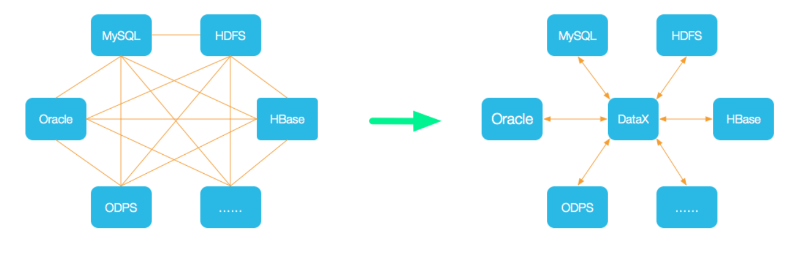
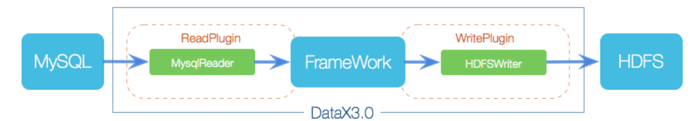
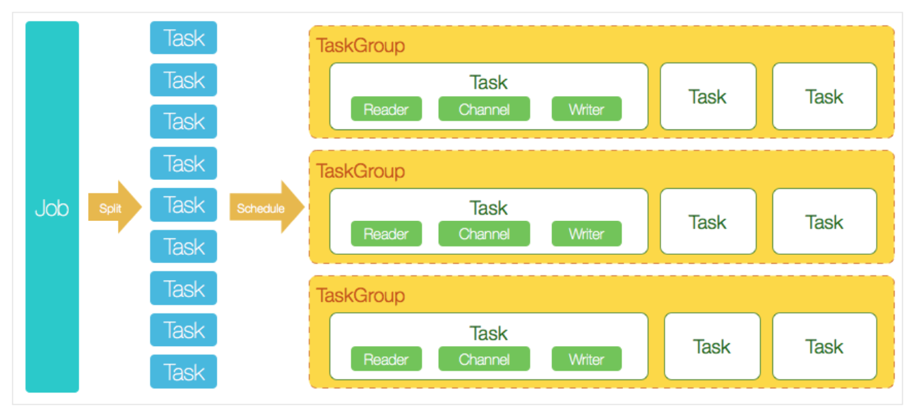

## DataX快速入门

### DataX安装及概述

DataX 是阿里巴巴集团内被广泛使用的离线数据同步工具/平台，实现包括 MySQL、Oracle、SqlServer、Postgre、HDFS、Hive、ADS、HBase、 TableStore(OTS)、MaxCompute(ODPS)、DRDS 等各种异构数据源之间高效的数 据同步功能。

#### 概述

为了解决异构数据源同步问题，DataX将复杂的网状的同步链路变成了星型数据链 路，DataX作为中间传输载体负责连接各种数据源。当需要接入一个新的数据源的时 候，只需要将此数据源对接到DataX，便能跟已有的数据源做到无缝数据同步。



DataX本身作为离线数据同步框架，采用Framework + plugin架构构建。将数据源 读取和写入抽象成为Reader/Writer插件，纳入到整个同步框架中。



* Reader:数据采集模块，负责采集数据源的数据，将数据发送给Framework; 
* Writer: 数据写入模块，负责不断向Framework取数据，并将数据写入到目的 端; 
* Framework:用于连接reader和writer，作为两者的数据传输通道，并处理缓 冲，流控，并发，数据转换等核心技术问题。

经过几年积累，DataX目前已经有了比较全面的插件体系，主流的RDBMS数据库、 NOSQL、大数据计算系统都已经接入。DataX目前支持数据参见[官网](https://github.com/alibaba/DataX/blob/master/introduction.md)。

DataX 3.0 开源版本支持单机多线程模式完成同步作业运行，本小节按一个DataX作 业生命周期的时序图，从整体架构设计非常简要说明DataX各个模块相互关系。



#### 核心模块

1. DataX完成单个数据同步的作业，称为Job。DataX接受到一个Job之后，将启动 一个进程来完成整个作业同步过程。DataX Job模块是单个作业的中枢管理节 点，承担了数据清理、子任务切分(将单一作业计算转化为多个子Task)、 TaskGroup管理等功能。
2. DataX Job启动后，会根据不同的源端切分策略，将Job切分成多个小的Task(子 任务)，以便于并发执行。Task便是DataX作业的最小单元，每一个Task都会负 责一部分数据的同步工作。

3. 切分多个Task之后，DataX Job会调用Scheduler模块，根据配置的并发数据 量，将拆分成的Task重新组合，组装成TaskGroup(任务组)。每一个TaskGroup 负责以一定的并发运行完毕分配好的所有Task，默认单个任务组的并发数量为 5。
4. 每一个Task都由TaskGroup负责启动，Task启动后，会固定启动Reader— >Channel—>Writer的线程来完成任务同步工作。
5. DataX作业运行起来之后， Job监控并等待多个TaskGroup模块任务完成，等待 所有TaskGroup任务完成后Job成功退出。否则，异常退出，进程退出值非0。

#### DataX 3.0六大核心优势

*  可靠的数据质量监控

* 丰富的数据转换功能

* 精准的速度控制

* 强劲的同步性能

* 健壮的容错机制

* 极简的使用体验

详情见[官网](https://github.com/alibaba/DataX/blob/master/introduction.md)

#### DataX安装配置

DataX官网:https://github.com/alibaba/DataX

前置条件:Linux、JDK(1.8以上，推荐1.8)、Python(推荐Python2.6.X) DataX的安装比较简单基本上是开箱即用:
1、下载DataX工具包 http://datax-opensource.oss-cn-hangzhou.aliyuncs.com/datax.tar.gz 

2、下载后解压至本地某个目录，进入bin目录，即可运行同步作业 配置环境变量 DATAX_HOME

```properties
##DATAX_HOME
export DATAX_HOME=/mnt/module/datax
export PATH=$PATH:$DATAX_HOME/bin
```

 python datax.py ../job/job.json

### DataX使用案例

#### Reader插件和Writer插件

DataX3.0版本提供的Reader插件和Writer插件，每种读插件都有一种和多种切分策略:

```
{
    "reader": {
        "name": "mysqlreader", #从mysql数据库获取数据(也支持sqlserverreader,oraclereader)
        "name": "txtfilereader",#从本地获取数据
        "name": "hdfsreader",#从hdfs文件、hive表获取数据
        "name": "streamreader",#从stream流获取数据(常用于测试)
        "name": "httpreader"   #从http URL获取数据
    },
    "writer": {
        "name": "hdfswriter", #向hdfs,hive表写入数据
        "name": "mysqlwriter", #向mysql写入数据(也支持sqlserverwriter,oraclewriter)
        "name": "streamwriter" #向stream流写入数据。(常用于测试)
    }
}
```

各种Reader插件、Writer插件的参考文档:https://github.com/alibaba/DataX

#### json配置文件模板
* 整个配置文件是一个job的描述;
*  job下面有两个配置项，content和setting，其中content用来描述该任务的源和 目的端的信息，setting用来描述任务本身的信息; 
* content又分为两部分，reader和writer，分别用来描述源端和目的端的信息; 
* setting中的speed项表示同时起几个并发执行该任务;

#### Job与Job Settion的基本配置

```
{
    "job": {
        "setting": {
            "speed": {
                "byte":10485760
            },
            "errorLimit": {
                "record": 0,
                "percentage": 0.02
            }
        },
        "content": [
            {
                "reader": {
                    "name": "streamreader",
                    "parameter": {
                        "column" : [
                            {
                                "value": "DataX",
                                "type": "string"
                            },
                            {
                                "value": 19890604,
                                "type": "long"
                            },
                            {
                                "value": "1989-06-04 00:00:00",
                                "type": "date"
                            },
                            {
                                "value": true,
                                "type": "bool"
                            },
                            {
                                "value": "test",
                                "type": "bytes"
                            }
                        ],
                        "sliceRecordCount": 100000
                    }
                },
                "writer": {
                    "name": "streamwriter",
                    "parameter": {
                        "print": false,
                        "encoding": "UTF-8"
                    }
                }
            }
        ]
    }
}
```

* job.setting.speed(流量控制)

  Job支持用户对速度的自定义控制，channel的值可以控制同步时的并发数， byte的值可以控制同步时的速度。

* job.setting.errorLimit(脏数据控制)

  Job支持用户对于脏数据的自定义监控和告警，包括对脏数据最大记录数阈值 (record值)或者脏数据占比阈值(percentage值)，当Job传输过程出现的脏 数据大于用户指定的数量/百分比，DataX Job报错退出。

#### 应用案例

Stream ===> Stream。stream reader/writer 都用于测试

如上面的配置


