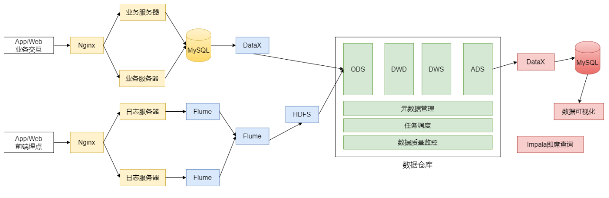

## 电商离线数仓设计

### 需求分析

近年来，中国的电子商务快速发展，交易额连创新高，电子商务在各领域的应用不 断拓展和深化、相关服务业蓬勃发展、支撑体系不断健全完善、创新的动力和能力 不断增强。电子商务正在与实体经济深度融合，进入规模性发展阶段，对经济社会 生活的影响不断增大，正成为我国经济发展的新引擎。

中国电子商务研究中心数据显示，截止到 2012 年底，中国电子商务市场交易规模达 7.85万亿人民币，同比增长 30.83%。其中，B2B 电子商务交易额 达 6.25 万亿，同 比增长 27%。而 2011 年全年，中国电子商务市场交易额达 6 万亿人民币，同比增 长 33%，占 GDP 比重上升到 13%;2012 年，电子商务占 GDP 的比重已经高达 15%。

### 电商行业技术特点

* 技术新
* 技术范围广
* 分布式 
* 高并发、集群、负载均衡 
* 海量数据
* 业务复杂 
* 系统安全

### 电商业务简介

类似X东商城、X猫商城。电商网站采用商家入驻的模式，商家入驻平台提交申请， 有平台进行资质审核，审核通过后，商家拥有独立的管理后台录入商品信息。商品 经过平台审核后即可发布。网上商城主要分为:

* 网站前台。网站首页、商家首页、商品详细页、搜索页、会员中心、订单与支 付相关页面、秒杀频道等;
* 运营商后台。运营人员的管理平台， 主要功能包括:商家审核、品牌管理、规 格管理、模板管理、商品分类管理、商品审核、广告类型管理、广告管理、订 单查询、商家结算等; 
* 商家管理后台。入驻的商家进行管理的平台，主要功能包括:商品管理、订单 查询统计、资金结算等功能;

###### 数据仓库项目主要分析以下数据:

* 日志数据: 启动日志、点击日志(广告点击日志) 
* 业务数据库的交易数据 :用户下单、提交订单、支付、退款等核心交易数据的分析

###### 数据仓库项目分析任务

* 会员活跃度分析主题 每日新增会员数;
  * 每日、周、月活跃会员数;留存会员数、留存会员率
* 广告业务分析主题
  * 广告点击次数、广告点击购买率、广告曝光次数
* 核心交易分析主题
  * 订单数、成交商品数、支付金额

### 数据埋点

**数据埋点，将用户的浏览、点击事件采集上报的一套数据采集的方法。**
通过这套方法，能够记录到用户在App、网页的一些行为，用来跟踪应用使用的状 况，后续用来进一步优化产品或是提供运营的数据支撑，包括访问数、访客数、停 留时长、浏览数、跳出率。这样的信息收集可以大致分为两种:页面统计、统计操 作行为。
在企业经营中，数据分析辅助决策是非常重要的一环，而埋点采集用户行为数据的 工作则是基础中的基础。如果没有用户行为数据，经营分析将无从说起。埋点为数 据分析提供基础数据，埋点工作流程可分为:

* 根据埋点需求完成开发(前端开发工程师 js) 
* App或网页采用用户数据
* 数据上报服务器 
* 数据的清洗、加工、存储(大数据工程师) 
* 进行数据分析等到相应的指标(大数据工程师)

在以上过程中，涉及的相关人员可分以下几类:

* 埋点需求:数据产品经理，负责撰写需求文档，规定哪些区域、用户操作需要埋点
* 埋点采集:前端工程师，负责通过一套前端 js 代码对用户的请求事件上送至服 务器 
* 数据清洗、加工及存储:对埋点中数据缺失、误报等情况需要进行清洗，并通 过一定的计算加工，输出业务分析所需要的结构化数据，最后将数据存储在数 据仓库中
* 数据分析:在数据仓库中对数据进行整理，成业务关注的指标 
* 前端展示:Java 开发

主流的埋点实现方法如下，主要区别是前端开发的工作量:

* 手动埋点:开发需要手动写代码实现埋点，比如页面ID、区域ID、按钮ID、按 钮位置、事件类型(曝光、浏览、点击)等，一般需要公司自主研发的一套埋 点框架
  * 优点:埋点数据更加精准
  * 缺点:工作量大，容易出错 
* 无痕埋点:不用开发写代码实现的，自动将设备号、浏览器型号、设备类型等 数据采集。主要使用第三方统计工具，如友盟、百度移动、魔方等
  * 优点:简单便捷 
  * 缺点:埋点数据统一，不够个性化和精准

启动日志:

```

```

事件日志(广告点击、收藏、点赞、消息通知、商品评论、商品详情页加载等事 件):

```

```

### 数据指标体系

指标:对数据的统计值。如:会员数、活跃会员数、会员留存数;广告点击量;订单金额、订单数都是指标;

指标体系:将各种指标系统的组织起来，按照业务模型、标准对指标进行分类和分层;

没有数据指标体系的团队内数据需求经常表现为需求膨胀以及非常多的需求变更。每个人都有看数据的视角和诉求，然后以非专业的方式创造维度/指标的数据口径。 数据分析人员被海量的数据需求缠住，很难抽离出业务规则设计好的解决方案，最 终滚雪球似的搭建难以维护的数据仓库。

* 建立指标体系实际上是与需求方达成一致。能有效遏制不靠谱的需求，让需求变得有条例和体系化; 
* 指标体系是知道数据仓库建设的基石。稳定而且体系化的需求，有利于数据仓库方案的优化，和效率提升;

由产品经理牵头、与业务、IT方协助，制定的一套能从维度反应业务状况的一套待实施框架。在建立指标体系时，要注重三个选取原则:准确、可解释、结构性。

* 准确:核心数据一定要理解到位和准确，不能选错;
* 可解释:所有指标都要配上明确、详细的业务解释。如日活的定义是什么，是 使用了App、还是在App中停留了一段时间、或是收藏或购买购买了商品; 
* 结构性:能够充分对业务进行解读。如新增用户只是一个大数，还需要知道每 个渠道的新增用户，每个渠道的新增转化率，每个渠道的新增用户价值等。

在建立指标体系之前，先了解一下指标的构成，在工作过程中遇见的指标多为派生 性指标。指标的构成如下所示:

* 基础指标 + [ 修饰词 ] + 时间段 
* 修饰词是可选的;基础指标和时间段是必须的 
* 基础指标是不可拆分的指标，如:交易额、支付金额、下单数 
* 修饰词多是某种场景的表现，如:通过搜索带来的交易等 
* 时间段即为一个时间周期，如:双十一期间，618活动期间等

三者叠加在一起就形成业务上常用的指标(这些指标也是派生指标)，如:双11这 一天通过搜索带来的交易额、双11这一天的交易额。同样，像此类日活、月活、次 日留存、日转化率等都属于派生指标。

在筛选完合理指标后，就要着手建立对应的指标体系。主要分为四个步骤:理清业 务阶段和需求、确定核心指标、对指标进行维度的拆解、指标的落地;

###### 厘清业务阶段及需求

企业的发展往往分为三个阶段:创业期、上升期、成熟发展期，不同的阶段关注的
核心指标也是不同的。

* 业务前期，最关注用户量，此时的指标体系应该紧密围绕用户量的提升来做各 种维度的拆解 
* 业务中期，除了关注用户量的走势大小，更加重要的是优化当前的用户量结 构，比如看用户留存，如果留存偏低，那就需要进一步分析查找原因 
* 成熟发展期，更多关注的就是产品变现能力和市场份额，要关注收入指标、各 种商业化模式的的收入，同时做好市场份额和竞品的监控，以防止新起势力抢 占份额等

###### 确定核心指标

这个阶段最重要的是找到正确的核心指标。

例:某款产品的日活口径是打开APP，而且日活量不小，而且稳定上升。然而分析 时发现，打开APP的用户中，5秒跳出率高达25%，这是非常不健康的，那么当前的 核心指标日活实际上已经有了问题，更加好的核心指标应该是停留时长大于5秒的用户数。

每个APP的核心指标都不太一样，一定要花时间去考虑这件事。就像XX头条APP， 它的日活和留存指标一定非常高，但仅关注这种指标肯定是不对的，它的真正核心 指标绝对不是单纯的日活和留存。

###### 核心指标维度拆解

核心指标的波动必然是某种维度的波动引起，要监控核心指标，本质上还是要监控

维度核心指标。 在分析“进入APP用户数”指标时，要关注渠道转化率，分析用户从哪里来;同时用户通过哪种方式打开的，如通过点击桌面图标、点击通知栏、点击Push等;

在分析“停留时长大于5秒占比”指标时，要重点关注停留时长的分布，停留1秒 -- 5秒 的用户各有多少，具体分布情况;停留大于5秒的用户特征和行为特性是怎么样的情 况;停留小于5秒的用户特征等;

电商平台注重交易额，在真正达成交易之前，用户要打开APP、选择商品、确认订 单、支付订单等整个交流漏斗模型。每一个环节的关键指标都可以通过公式的形式 进行拆解，在根据拆解公式逐个分析对应的影响因素。

###### 指标宣贯、存档、落地

在完成整个指标体系搭建后，要告知所有相关业务人员。一方面为下一步工作做铺垫，另一方面是为了让所有相关人员知晓已完成，以防甩锅;

对指标口径的业务逻辑进行详细的描述并存档，只有明确、清晰的定义才能明白指 标的具体含义;

就是建立核心指标的相关报表，实际工作中，报表会在埋点前建好的，这样的话一 旦版本上线就能立刻看到数据，而且也比较容易发现问题。

整个指标体系的搭建主要是由产品经理主导完成的，业务人员需要配合产品经理选 择并确认指标，这也是在建立之初最重要的一点。

### 总体架构设计

#### 技术选型方案

* 框架选型 
* 软件选型 
* 服务器选型 
* 集群规模的估算

###### 框架选型

Apache / 第三方发行版(CDH / HDP / Fusion Insight)，Apache社区版本优点:

* 完全开源免费 
* 社区活跃 
* 文档、资料详实

缺点:

* 复杂的版本管理

* 复杂的集群安装

* 复杂的集群运维

* 复杂的生态环境

第三方发行版本(CDH / HDP / Fusion Insight)，Hadoop遵从Apache开源协议，用户可以免费地任意使用和修改Hadoop。正因如 此，市面上有很多厂家在Apache Hadoop的基础上开发自己的产品。如Cloudera的 CDH，Hortonworks的HDP，华为的Fusion Insight等。这些产品的优点是:

* 主要功能与社区版一致 
* 版本管理清晰。比如Cloudera，CDH1，CDH2，CDH3，CDH4等，后面加上补 丁版本，如CDH4.1.0 patch level 923.142
* 比 Apache Hadoop 在兼容性、安全性、稳定性上有增强。第三方发行版通常 都经过了大量的测试验证，有众多部署实例，大量的运用到各种生产环境 
* 版本更新快。如CDH每个季度会有一个update，每一年会有一个release 
* 基于稳定版本Apache Hadoop，并应用了最新Bug修复或Feature的patch 提供了部署、安装、配置工具，大大提高了集群部署的效率，可以在几个小时 内部署好集群 
* 运维简单。提供了管理、监控、诊断、配置修改的工具，管理配置方便，定位 问题快速、准确，使运维工作简单，有效

CDH:最成型的发行版本，拥有最多的部署案例。提供强大的部署、管理和监控工 具。国内使用最多的版本;拥有强大的社区支持，当遇到问题时，能够通过社区、 论坛等网络资源快速获取解决方法;

HDP:100%开源，可以进行二次开发，但没有CDH稳定。国内使用相对较少; Fusion Insight:华为基于hadoop2.7.2版开发的，坚持分层，解耦，开放的原则，得益于高可靠性，在全国各地政府、运营商、金融系统有较多案例。

###### 软件选型

* 数据采集:DataX、Flume、Sqoop、Logstash、Kafka 
* 数据存储:HDFS、HBase 
* 数据计算:Hive、MapReduce、Tez、Spark、Flink 
* 调度系统:Airflow、azkaban、Oozie 
* 元数据管理:Atlas
* 数据质量管理:Griffin 
* 即席查询:Impala、Kylin、ClickHouse、Presto、Druid 
* 其他:MySQL

框架、软件尽量不要选择最新的版本，选择半年前左右稳定的版本。


###### 服务器选项

选择物理机还是云主机：

* 机器成本考虑:物理机的价格 > 云主机的价格

* 运维成本考虑:物理机需要有专业的运维人员;云主机的运维工作由供应商完成， 运维相对容易，成本相对较低;

###### 集群规模规划

如何确认集群规模(假设:每台服务器20T硬盘，128G内存) 可以从计算能力(CPU、 内存)、存储量等方面着手考虑集群规模。 

假设: 

1. 每天的日活用户500万，平均每人每天有100条日志信息 
2. 每条日志大小1K左右
3. 不考虑历史数据，半年集群不扩容 
4. 数据3个副本 
5. 离线数据仓库应用

需要多大集群规模?

要分析的数据有两部分:日志数据+业务数据

每天日志数据量:500W * 100 * 1K / 1024 / 1024 = 500G，半年需要的存储量:500G * 3 * 180 / 1024 = 260T，通常要给磁盘预留20-30%的空间(这里取25%): 260 * 1.25 = 325T 数据仓库应用有1-2倍的数据膨胀(这里取1.5):500T 需要大约25个节点。

其他未考虑因素:数据压缩、业务数据

以上估算的生产环境。实际上除了生产环境以外，还需要开发测试环境，这也需要 一定数据的机器。

#### 系统逻辑架构



#### 开发物理环境

5台物理机;500G数据盘;32G内存;8个core


关于数据集的说明: 

1. 在开发过程中使用小规模数据集
2. 模块测试使用真实的数据集(数据量大)
3. 在做项目期间根据自己实际情况使用不同的数据量(建议使用小规模的数据集)

#### 数据仓库命名规范

1. 数据库命名
   * 命名规则:数仓对应分层
   * 命名示例:ods / dwd / dws/ dim / temp / ads

2. 数仓各层对应数据库

   * ods层 -> ods_ {业务线|业务项目}
   * dw层 -> dwd_ {业务线|业务项目} + dws_{业务线|业务项目} 
   * dim层 -> dim_维表
   * ads层 -> ads_{业务线|业务项目} (统计指标等)
   * 临时数据 -> temp_{业务线|业务项目}

   备注:本项目未采用

3. 表命名(数据库表命名规则) 

   * ODS层:

     命名规则:ods_{业务线|业务项目}_[数据来源类型]_{业务}

   * DWD层

     命名规则:dwd_{业务线|业务项目}_{主题域}_{子业务}

   * DWS层:

     命名规则:dws_{业务线|业务项目}_{主题域}_{汇总相关粒度}_{汇总时间周期} 

   *  ADS层:

     命名规则:ads_{业务线|业务项目}_{统计业务}_{报表form|热门排序topN}

   * DIM层: 

     命名规则:dim_{业务线|业务项目|pub公共}_{维度}

###### 创建数据库

```sql
create database if not exists ods;
create database if not exists dwd;
create database if not exists dws;
create database if not exists ads;
create database if not exists dim;
create database if not exists tmp;
```


