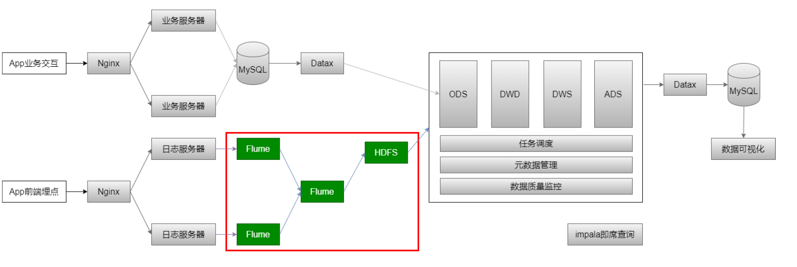
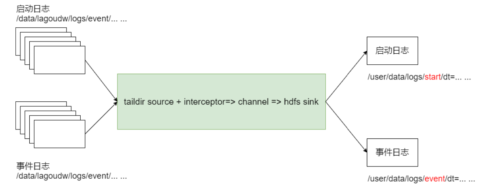
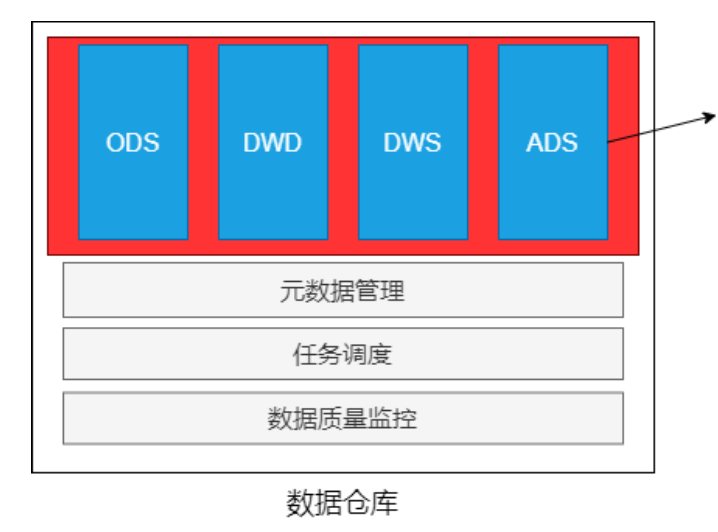
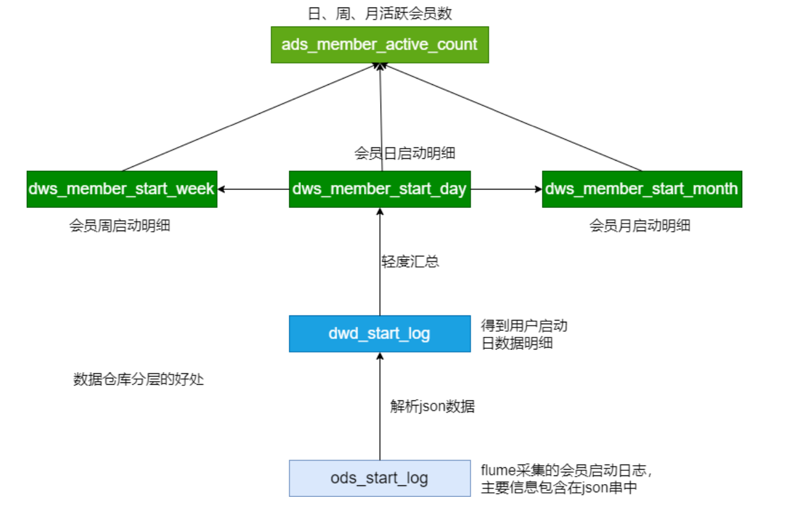
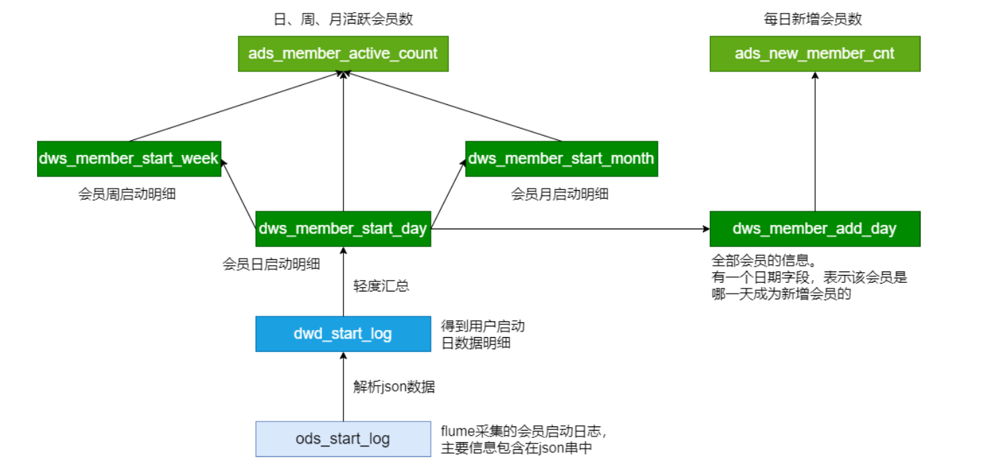
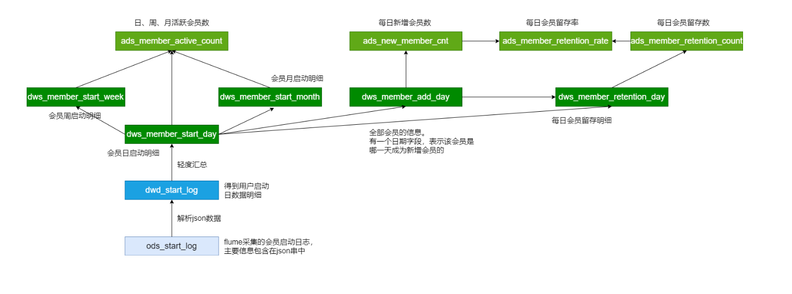
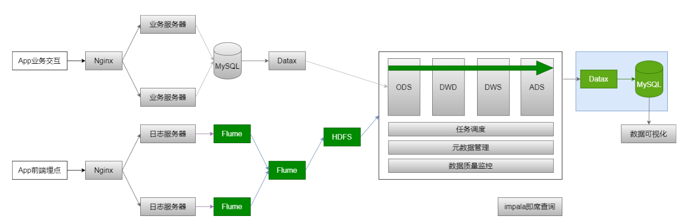
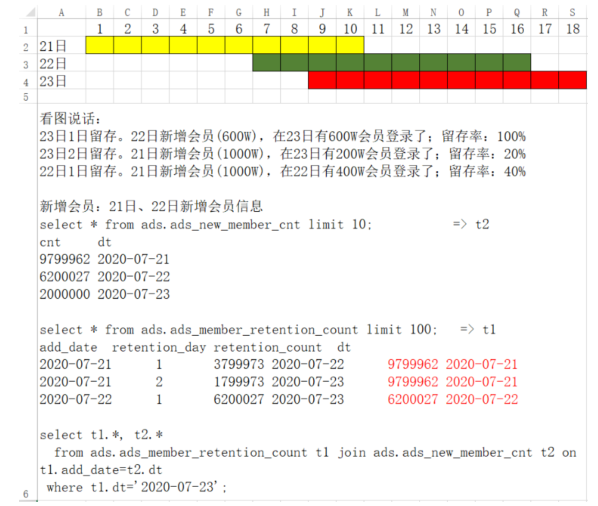
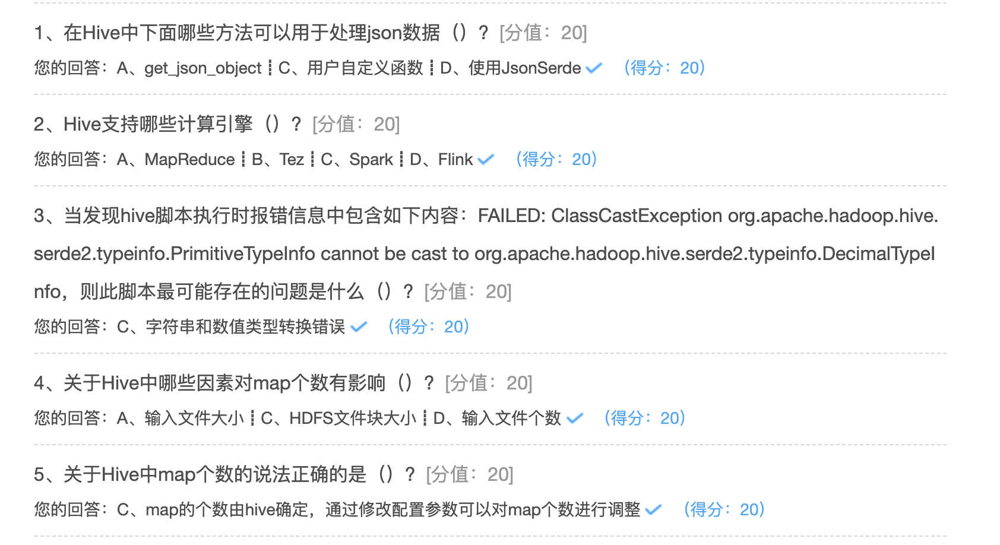

## 电商分析之--会员活跃度

### 需求分析

会员数据是后期营销的很重要的数据。网店会专门针对会员进行一系列营销活动。 电商会员一般门槛较低，注册网站即可加入。有些电商平台的高级会员具有时效性，需要购买VIP会员卡或一年内消费额达到多少才能成为高级会员。

#### 计算指标:

新增会员:每日新增会员数 活跃会员:每日，每周，每月的活跃会员数 会员留存:1日，2日，3日会员留存数、1日，2日，3日会员留存率

#### 指标口径业务逻辑:

**会员**:以设备为判断标准，每个独立设备认为是一个会员。Android系统通常根据 IMEI号，IOS系统通常根据OpenUDID 来标识一个独立会员，每部移动设备是一个 会员;
**活跃会员**:打开应用的会员即为活跃会员，暂不考虑用户的实际使用情况。一台设 备每天多次打开计算为一个活跃会员。在自然周内启动过应用的会员为周活跃会 员，同理还有月活跃会员;
**会员活跃率**:一天内活跃会员数与总会员数的比率是日活跃率;还有周活跃率(自 然周)、月活跃率(自然月);
**新增会员**:第一次使用应用的用户，定义为新增会员;卸载再次安装的设备，不会 被算作一次新增。新增用户包括日新增会员、周(自然周)新增会员、月(自然 月)新增会员;
**留存会员与留存率**:某段时间的新增会员，经过一段时间后，仍继续使用应用认为 是留存会员;这部分会员占当时新增会员的比例为留存率。

已知条件: 

1. 明确了需求
2. 输入:启动日志(OK)、事件日志
3. 输出:新增会员、活跃会员、留存会员 
4. 日志文件、ODS、DWD、DWS、ADS(输出)

下一步作什么?
数据采集:日志文件 => Flume => HDFS => ODS

### 日志数据采集

#### 原始日志数据(一条启动日志)

```
2020-07-30 14:18:47.339 [main] INFO com.lagou.ecommerce.AppStart - {"app_active":{"name":"app_active","json":{"entry":"1","action":"1","error_code":"0"},"time":1596111888529} ,"attr":{"area":"泰 安","uid":"2F10092A9","app_v":"1.1.13","event_type":"common","dev ice_id":"1FB872- 9A1009","os_type":"4.7.3","channel":"DK","language":"chinese","br and":"iphone-9"}}
```


#### 数据采集的流程



选择Flume作为采集日志数据的工具: 

* Flume 1.6
  * 无论是Spooling Directory Source、Exec Source均不能很好的满足动态实时收集的需求
* Flume 1.8+
  * 提供了一个非常好用的 Taildir Source 
  * 使用该source，可以监控多个目录，对目录中新写入的数据进行实时采集

####  taildir source配置

###### taildir Source的特点:

* 使用正则表达式匹配目录中的文件名 
* 监控的文件中，一旦有数据写入，Flume就会将信息写入到指定的Sink 
* 高可靠，不会丢失数据 
* 不会对跟踪文件有任何处理，不会重命名也不会删除 
* 不支持Windows，不能读二进制文件。支持按行读取文本文件

###### taildir source 配置

```properties
a1.sources.r1.type = TAILDIR
a1.sources.r1.channels = c1
a1.sources.r1.positionFile = /data/conf/startlog_position.json
a1.sources.r1.filegroups = f1
a1.sources.r1.filegroups.f1 = /data/logs/start/.*log
```

* positionFile

  配置检查点文件的路径，检查点文件会以 json 格式保存已经读取文件的位置， 解决断点续传的问题

* filegroups

  指定filegroups，可以有多个，以空格分隔(taildir source可同时监控多个目录 中的文件)

* filegroups.

  配置每个filegroup的文件绝对路径，文件名可以用正则表达式匹配

####  hdfs sink配置

```properties
a1.sinks.k1.type = hdfs
a1.sinks.k1.hdfs.path = /project/data/log/start/%y-%m-%d
a1.sinks.k1.hdfs.filePrefix = log

# 配置文件滚动方式(文件大小32M)
a1.sinks.k1.hdfs.rollInterval = 0
a1.sinks.k1.hdfs.rollSize = 33554432
a1.sinks.k1.hdfs.rollCount = 0
a1.sinks.k1.hdfs.idleTimeout = 0
a1.sinks.k1.hdfs.minBlockReplicas = 1
# 向hdfs上刷新的event的个数 
a1.sinks.k1.hdfs.batchSize = 100
# 使用本地时间 
a1.sinks.k1.hdfs.useLocalTimeStamp = true

```

HDFS Sink 都会采用滚动生成文件的方式，滚动生成文件的策略有:

* 基于时间。hdfs.rollInterval 30秒 
* 基于文件大小。hdfs.rollSize 1024字节 
* 基于event数量。hdfs.rollCount 10个event 
* 基于文件空闲时间。hdfs.idleTimeout 0 
* 0，禁用
* minBlockReplicas。默认值与 hdfs 副本数一致。设为1是为了让 Flume 感知不 到hdfs的块复制，此时其他的滚动方式配置(时间间隔、文件大小、events数 量)才不会受影响

#### Agent的配置

```properties
a1.sources = r1
a1.sinks = k1
a1.channels = c1

# taildir source
a1.sources.r1.type = TAILDIR
a1.sources.r1.channels = c1
a1.sources.r1.positionFile = /data/conf/startlog_position.json
a1.sources.r1.filegroups = f1
a1.sources.r1.filegroups.f1 = /data/logs/start/.*log

# memory channel
a1.channels.c1.type = memory
a1.channels.c1.capacity = 100000
a1.channels.c1.transactionCapacity = 2000


# hdfs sink
a1.sinks.k1.type = hdfs
a1.sinks.k1.hdfs.path = /project/data/log/start/%y-%m-%d
a1.sinks.k1.hdfs.filePrefix = log

# 配置文件滚动方式(文件大小32M)
a1.sinks.k1.hdfs.rollInterval = 0
a1.sinks.k1.hdfs.rollSize = 16777216
a1.sinks.k1.hdfs.rollCount = 0
a1.sinks.k1.hdfs.idleTimeout = 0
a1.sinks.k1.hdfs.minBlockReplicas = 1
# 向hdfs上刷新的event的个数
a1.sinks.k1.hdfs.batchSize = 1000
# 使用本地时间
a1.sinks.k1.hdfs.useLocalTimeStamp = true
# 文件格式
a1.sinks.k1.hdfs.fileType = DataStream

# Bind the source and sink to the channel
a1.sources.r1.channels = c1
a1.sinks.k1.channel = c1
```

/data/lagoudw/conf/flume-log2hdfs.conf


####  Flume的优化配置

1、启动agent

```shell
flume-ng agent --conf /opt/lagou/servers/flume-1.9.0/conf --conf-file /data/conf/flume-log2hdfs.conf  -name a1 -Dflume.root.logger=INFO,console
```

2、向 /data/lagoudw/logs/ 目录中放入日志文件，报错:

java.lang.OutOfMemoryError: GC overhead limit exceeded


缺省情况下 Flume jvm堆最大分配20m，这个值太小，需要调整。

3、解决方案:在 $FLUME_HOME/conf/flume-env.sh 中增加以下内容

```properties
export JAVA_OPTS="-Xms400m -Xmx4000m -Dcom.sun.management.jmxremote"


flume-ng agent --conf /opt/lagou/servers/flume-1.9.0/conf --conf-file /data/conf/flume-log2hdfs.conf  -name a1 -Dflume.root.logger=INFO,console
```

Flume内存参数设置及优化: 

* 根据日志数据量的大小，Jvm堆一般要设置为4G或更高
* -Xms -Xmx 最好设置一致，减少内存抖动带来的性能影响 

存在的问题:Flume放数据时，使用本地时间;不理会日志的时间戳

#### 自定义拦截器

前面 Flume Agent 的配置使用了本地时间，可能导致数据存放的路径不正确。要解决以上问题需要使用自定义拦截器。 agent用于测试自定义拦截器。netcat source =>logger sink

```properties
# a1是agent的名称。source、channel、sink的名称分别为:r1 c1 k1
a1.sources = r1
a1.sinks = k1
a1.channels = c1

# NetCat TCP Source

a1.sources.r1.type = netcat
a1.sources.r1.bind = linux123
a1.sources.r1.port = 9999
a1.sources.r1.interceptors = i1
a1.sources.r1.interceptors.i1.type=com.hhb.project.first.CustomerInterceptor$Builder


# memory channel
a1.channels.c1.type = memory
a1.channels.c1.capacity = 100000
a1.channels.c1.transactionCapacity = 2000

#sink
a1.sinks.k1.type = logger

# source、channel、sink之间的关系 
a1.sources.r1.channels = c1
a1.sinks.k1.channel = c1
```

自定义拦截器的原理:

1. 自定义拦截器要集成Flume 的 Interceptor
2. Event 分为header 和 body(接收的字符串)
3. 获取header和body
4. 从body中获取"time":1596382570539，并将时间戳转换为字符串 "yyyy-MM- dd"
5. 将转换后的字符串放置header中

自定义拦截器的实现:

1. 获取 event 的 header
2. 获取 event 的 body 
3. 解析body获取json串 
4. 解析json串获取时间戳 
5. 将时间戳转换为字符串 "yyyy-MM-dd" 
6. 将转换后的字符串放置header中 
7. 返回event

```xml
 <!-- Flume -->
<dependency>
  <groupId>org.apache.flume</groupId>
  <artifactId>flume-ng-core</artifactId>
  <version>1.9.0</version>
  <scope>provided</scope>
</dependency>
<dependency>
  <groupId>com.alibaba</groupId>
  <artifactId>fastjson</artifactId>
  <version>1.1.23</version>
</dependency>
<dependency>
  <groupId>junit</groupId>
  <artifactId>junit</artifactId>
  <version>RELEASE</version>
</dependency>
```


Java:

```java
package com.hhb.project.first;

import com.alibaba.fastjson.JSONObject;
import com.google.common.base.Charsets;
import com.google.common.base.Strings;
import org.apache.flume.Context;
import org.apache.flume.Event;
import org.apache.flume.event.SimpleEvent;
import org.apache.flume.interceptor.Interceptor;
import org.junit.Test;

import java.time.Instant;
import java.time.LocalDateTime;
import java.time.ZoneId;
import java.time.format.DateTimeFormatter;
import java.util.ArrayList;
import java.util.HashMap;
import java.util.List;
import java.util.Map;

/**
 * @description:
 * @author: huanghongbo
 * @date: 2020-09-01 19:18
 **/
public class TestInterceptor implements Interceptor {


    @Override
    public void initialize() {

    }

    /**
     * 1. 获取 event 的 header
     * 2. 获取 event 的 body
     * 3. 解析body获取json串
     * 4. 解析json串获取时间戳
     * 5. 将时间戳转换为字符串 "yyyy-MM-dd"
     * 6. 将转换后的字符串放置header中
     * 7. 返回event
     *
     * @param event
     * @return
     */
    @Override
    public Event intercept(Event event) {
        // 获取 event 的 header
        Map<String, String> headers = event.getHeaders();
        // 获取 event 的 body
        String bodyStr = new String(event.getBody(), Charsets.UTF_8);
        // 解析body获取json串
        String[] bodyArr = bodyStr.split("\\s+");
        try {
            if (Strings.isNullOrEmpty(bodyArr[6])) {
                return null;
            }
            JSONObject jsonObject = JSONObject.parseObject(bodyArr[6]);
            //将时间戳转换为字符串 "yyyy-MM-dd"
            String timeString = jsonObject.getJSONObject("app_active").getString("time");
            long timeStamp = Long.parseLong(timeString);
            DateTimeFormatter formatter = DateTimeFormatter.ofPattern("yyyy-MM-dd");
            String date = formatter.format(LocalDateTime.ofInstant(Instant.ofEpochMilli(timeStamp), ZoneId.systemDefault()));
//            将转换后的字符串放置header中
            headers.put("logTime", date);
        } catch (Exception e) {
            headers.put("logTime", "unknown");
        }
        event.setHeaders(headers);
        return event;
    }

    @Override
    public List<Event> intercept(List<Event> list) {
        List<Event> out = new ArrayList<>();
        for (Event event : list) {
            Event outEvent = intercept(event);
            if (outEvent != null) {
                out.add(outEvent);
            }
        }
        return out;
    }

    @Override
    public void close() {

    }


    public static class Builder implements Interceptor.Builder {

        @Override
        public Interceptor build() {
            return new TestInterceptor();
        }

        @Override
        public void configure(Context context) {

        }
    }

    @Test
    public void test() {
        String str = "2020-08-20 11:56:00.365 [main] INFO  com.lagou.ecommerce.AppStart - {\"app_active\":{\"name\":\"app_active\",\"json\":{\"entry\":\"1\",\"action\":\"0\",\"error_code\":\"0\"},\"time\":1595266507583},\"attr\":{\"area\":\"菏泽\",\"uid\":\"2F10092A1\",\"app_v\":\"1.1.2\",\"event_type\":\"common\",\"device_id\":\"1FB872-9A1001\",\"os_type\":\"0.01\",\"channel\":\"YO\",\"language\":\"chinese\",\"brand\":\"Huawei-9\"}}";
        Event event = new SimpleEvent();
        event.setBody(str.getBytes());
        event.setHeaders(new HashMap<>());

        TestInterceptor testInterceptor = new TestInterceptor();

        testInterceptor.intercept(event);

        System.err.println(event.getHeaders());
    }
}

```

将程序打包，放在 flume/lib目录下;

启动Agent测试

```shell
flume-ng agent --conf /opt/lagou/servers/flume-1.9.0/conf --conf-file /data/conf/flume-test.conf  -name a1 -Dflume.root.logger=INFO,console
```

###### 采集启动日志(使用自定义拦截器)

1、定义配置文件

```properties
a1.sources = r1
a1.sinks = k1
a1.channels = c1

# taildir source
a1.sources.r1.type = TAILDIR
a1.sources.r1.channels = c1
a1.sources.r1.positionFile = /data/conf/startlog_position.json
a1.sources.r1.filegroups = f1
a1.sources.r1.filegroups.f1 = /data/logs/start/.*log
a1.sources.r1.interceptors = i1
a1.sources.r1.interceptors.i1.type=com.hhb.project.first.CustomerInterceptor$Builder

# memory channel
a1.channels.c1.type = memory
a1.channels.c1.capacity = 100000
a1.channels.c1.transactionCapacity = 2000


# hdfs sink
a1.sinks.k1.type = hdfs
a1.sinks.k1.hdfs.path = /project/data/log/start/dt=%{logTime}/
a1.sinks.k1.hdfs.filePrefix = log

# 配置文件滚动方式(文件大小32M)
a1.sinks.k1.hdfs.rollInterval = 0
a1.sinks.k1.hdfs.rollSize = 16777216
a1.sinks.k1.hdfs.rollCount = 0
a1.sinks.k1.hdfs.idleTimeout = 0
a1.sinks.k1.hdfs.minBlockReplicas = 1
# 向hdfs上刷新的event的个数
a1.sinks.k1.hdfs.batchSize = 1000
# 使用本地时间
# a1.sinks.k1.hdfs.useLocalTimeStamp = true
# 文件格式
a1.sinks.k1.hdfs.fileType = DataStream

# Bind the source and sink to the channel
a1.sources.r1.channels = c1
a1.sinks.k1.channel = c1
```

修改：

* 给source增加自定义拦截器
* 去掉本地时间戳 a1.sinks.k1.hdfs.useLocalTimeStamp = true 
* 根据header中的logtime写文件

2、启动服务

```shell
# 测试
flume-ng agent --conf /opt/lagou/servers/flume-1.9.0/conf --conf-file /data/conf/flume-log2hdfs2.conf  -name a1 -Dflume.root.logger=INFO,console
```

3、拷贝日志 

4、检查HDFS文件

#### 采集启动日志和事件日志

本系统中要采集两种日志:启动日志、事件日志，不同的日志放置在不同的目录 下。要想一次拿到全部日志需要监控多个目录。



###### 总体思路

1、taildir监控多个目录 

2、修改自定义拦截器，不同来源的数据加上不同标志 

3、hdfs sink 根据标志写文件

###### Agent配置

```properties
a1.sources = r1
a1.sinks = k1
a1.channels = c1

# taildir source
a1.sources.r1.type = TAILDIR
a1.sources.r1.channels = c1
a1.sources.r1.positionFile = /data/conf/startlog_position.json
a1.sources.r1.filegroups = f1 f2
a1.sources.r1.filegroups.f1 = /data/logs/start/.*log
a1.sources.r1.headers.f1.logtype = start
a1.sources.r1.filegroups.f2 = /data/logs/event/.*log
a1.sources.r1.headers.f2.logtype = event

a1.sources.r1.interceptors = i1
a1.sources.r1.interceptors.i1.type=com.hhb.project.first.LogTypeInterceptor$Builder

# memory channel
a1.channels.c1.type = memory
a1.channels.c1.capacity = 100000
a1.channels.c1.transactionCapacity = 2000


# hdfs sink
a1.sinks.k1.type = hdfs
a1.sinks.k1.hdfs.path = /project/data/log/%{logtype}/dt=%{logTime}/
a1.sinks.k1.hdfs.filePrefix = log

# 配置文件滚动方式(文件大小32M)
a1.sinks.k1.hdfs.rollInterval = 0
a1.sinks.k1.hdfs.rollSize = 16777216
a1.sinks.k1.hdfs.rollCount = 0
a1.sinks.k1.hdfs.idleTimeout = 0
a1.sinks.k1.hdfs.minBlockReplicas = 1
# 向hdfs上刷新的event的个数
a1.sinks.k1.hdfs.batchSize = 1000
# 使用本地时间
# a1.sinks.k1.hdfs.useLocalTimeStamp = true
# 文件格式
a1.sinks.k1.hdfs.fileType = DataStream

# Bind the source and sink to the channel
a1.sources.r1.channels = c1
a1.sinks.k1.channel = c1
```

* filegroups

  指定filegroups，可以有多个，以空格分隔(taildir source可同时监控多个目录中的 文件)

* headers.< filegroupName >.< headerKey >

  给event增加header key。不同的filegroup，可配置不同的value

###### 自定义拦截器

编码完成后打包上传服务器，放置在$FLUME_HOME/lib 下

```java
package com.hhb.project.first;

import com.alibaba.fastjson.JSONArray;
import com.alibaba.fastjson.JSONObject;
import com.google.common.base.Charsets;
import com.google.common.base.Strings;
import org.apache.flume.Context;
import org.apache.flume.Event;
import org.apache.flume.event.SimpleEvent;
import org.apache.flume.interceptor.Interceptor;
import org.junit.Test;

import java.time.Instant;
import java.time.LocalDateTime;
import java.time.ZoneId;
import java.time.format.DateTimeFormatter;
import java.util.ArrayList;
import java.util.HashMap;
import java.util.List;
import java.util.Map;

/**
 * @description:
 * @author: huanghongbo
 * @date: 2020-09-01 19:18
 **/
public class LogTypeInterceptor implements Interceptor {


    @Override
    public void initialize() {

    }

    /**
     * 1. 获取 event 的 header
     * 2. 获取 event 的 body
     * 3. 解析body获取json串
     * 4. 解析json串获取时间戳
     * 5. 将时间戳转换为字符串 "yyyy-MM-dd"
     * 6. 将转换后的字符串放置header中
     * 7. 返回event
     *
     * @param event
     * @return
     */
    @Override
    public Event intercept(Event event) {
        // 获取 event 的 header
        Map<String, String> headers = event.getHeaders();
        // 获取 event 的 body
        String bodyStr = new String(event.getBody(), Charsets.UTF_8);
        // 解析body获取json串
        String[] bodyArr = bodyStr.split("\\s+");
        try {
            if (Strings.isNullOrEmpty(bodyArr[6])) {
                return null;
            }
            JSONObject jsonObject = JSONObject.parseObject(bodyArr[6]);
            String timeString = "";
            if ("start".equals(headers.get("logtype"))) {
                //将时间戳转换为字符串 "yyyy-MM-dd"
                timeString = jsonObject.getJSONObject("app_active").getString("time");
            } else if ("event".equals(headers.get("logtype"))) {
                JSONArray jsonArray = jsonObject.getJSONArray("lagou_event");
                if (jsonArray.size() > 0) {
                    timeString = jsonArray.getJSONObject(0).getString("time");
                }
            }

            long timeStamp = Long.parseLong(timeString);
            DateTimeFormatter formatter = DateTimeFormatter.ofPattern("yyyy-MM-dd");
            String date = formatter.format(LocalDateTime.ofInstant(Instant.ofEpochMilli(timeStamp), ZoneId.systemDefault()));
//            将转换后的字符串放置header中
            headers.put("logTime", date);
        } catch (Exception e) {
            headers.put("logTime", "unknown");
        }
        event.setHeaders(headers);
        return event;
    }

    @Override
    public List<Event> intercept(List<Event> list) {
        List<Event> out = new ArrayList<>();
        for (Event event : list) {
            Event outEvent = intercept(event);
            if (outEvent != null) {
                out.add(outEvent);
            }
        }
        return out;
    }

    @Override
    public void close() {

    }

    public static class Builder implements Interceptor.Builder {
        @Override
        public Interceptor build() {
            return new LogTypeInterceptor();
        }

        @Override
        public void configure(Context context) {
        }
    }

    @Test
    public void test() {
        String str = "2020-08-20 11:56:00.365 [main] INFO  com.lagou.ecommerce.AppStart - {\"app_active\":{\"name\":\"app_active\",\"json\":{\"entry\":\"1\",\"action\":\"0\",\"error_code\":\"0\"},\"time\":1595266507583},\"attr\":{\"area\":\"菏泽\",\"uid\":\"2F10092A1\",\"app_v\":\"1.1.2\",\"event_type\":\"common\",\"device_id\":\"1FB872-9A1001\",\"os_type\":\"0.01\",\"channel\":\"YO\",\"language\":\"chinese\",\"brand\":\"Huawei-9\"}}";
        Event event = new SimpleEvent();
        HashMap<String, String> map = new HashMap<>();
        map.put("logtype","start");

        event.setBody(str.getBytes());
        event.setHeaders(map);
        LogTypeInterceptor testInterceptor = new LogTypeInterceptor();
        testInterceptor.intercept(event);
        System.err.println(event.getHeaders());
    }


    @Test
    public void test2() {
        String str = "2020-08-20 12:00:30.111 [main] INFO  com.lagou.ecommerce.AppEvent - {\"lagou_event\":[{\"name\":\"goods_detail_loading\",\"json\":{\"entry\":\"2\",\"goodsid\":\"0\",\"loading_time\":\"107\",\"action\":\"3\",\"staytime\":\"108\",\"showtype\":\"5\"},\"time\":1595288680211},{\"name\":\"ad\",\"json\":{\"duration\":\"11\",\"ad_action\":\"0\",\"shop_id\":\"10\",\"event_type\":\"ad\",\"ad_type\":\"3\",\"show_style\":\"1\",\"product_id\":\"6\",\"place\":\"placecampaign1_right\",\"sort\":\"0\"},\"time\":1595271684867}],\"attr\":{\"area\":\"福州\",\"uid\":\"2F10092A2\",\"app_v\":\"1.1.0\",\"event_type\":\"common\",\"device_id\":\"1FB872-9A1002\",\"os_type\":\"5.79\",\"channel\":\"FD\",\"language\":\"chinese\",\"brand\":\"xiaomi-2\"}}";
        Event event = new SimpleEvent();
        HashMap<String, String> map = new HashMap<>();
        map.put("logtype","event");

        event.setBody(str.getBytes());
        event.setHeaders(map);
        LogTypeInterceptor testInterceptor = new LogTypeInterceptor();
        testInterceptor.intercept(event);
        System.err.println(event.getHeaders());
    }
}

```

测试

启动Agent，拷贝日志，检查HDFS文件

```shell
# 清理环境
rm -f /data/lagoudw/conf/startlog_position.json 
rm -f /data/lagoudw/logs/start/*.log
rm -f /data/lagoudw/logs/event/*.log

# 启动 Agent
flume-ng agent --conf /opt/lagou/servers/flume-1.9.0/conf --conf-file /data/conf/flume-log2hdfs3.conf  -name a1 -Dflume.root.logger=INFO,console

# 拷贝日志
cd /data/lagoudw/logs/source 
cp event0802.log ../event/ 
cp start0802.log ../start/
# 检查HDFS文件
hdfs dfs -ls /user/data/logs/event 
hdfs dfs -ls /user/data/logs/start


# 生产环境中用以下方式启动Agent
nohup flume-ng agent --conf /opt/apps/flume-1.9/conf --conf-file /data/lagoudw/conf/flume-log2hdfs3.conf -name a1 -Dflume.root.logger=INFO,LOGFILE > /dev/null 2>&1 &
```

* nohup，该命令允许用户退出帐户/关闭终端之后继续运行相应的进程 
* /dev/null，代表linux的空设备文件，所有往这个文件里面写入的内容都会丢 失，俗称黑洞

* 标准输入0，从键盘获得输入 /proc/self/fd/0 
* 标准输出1，输出到屏幕(控制台) /proc/self/fd/1 
* 错误输出2，输出到屏幕(控制台) /proc/self/fd/2
* \>/dev/null 标准输出1重定向到 /dev/null 中，此时标准输出不存在，没有任 何地方能够找到输出的内容
* 2>&1 错误输出将会和标准输出输出到同一个地方
* \>/dev/null 2>&1 不会输出任何信息到控制台，也不会有任何信息输出到文件中

#### 日志数据采集小结

* 使用taildir source 监控指定的多个目录，可以给不同目录的日志加上不同 header

* 在每个目录中可以使用正则匹配多个文件 
* 使用自定义拦截器，主要功能是从json串中获取时间戳，加到event的header中 
* hdfs sink使用event header中的信息写数据(控制写文件的位置) 
* hdfs文件的滚动方式(基于文件大小、基于event数量、基于时间)
* 调节flume jvm内存的分配

### ODS建表和数据加载



ODS层的数据与源数据的格式基本相同。 创建ODS层表:

```shell
use ODS;
create external table ods.ods_start_log(
str string
)
comment '用户启动日志'
partitioned by (dt string)
location '/project/data/log/start';

alter table ods.ods_start_log add partition(dt='2020-07-21');
```

加载启动日志数据:script/member_active/ods_load_log.sh,可以传参数确定日志，如果没有传参使用昨天日期

```shell
#! /bin/bash
if [ -n "$1" ]
then
    to_date=$1
else
   to_date=`date -d "-1 day" +%F`
fi
hive -e  'alter table ods.ods_start_log add partition(dt="'$to_date'");'
```

###  JSON数据处理

数据文件中每行必须是一个完整的 json 串，一个 json串 不能跨越多行。 Hive 处理json数据总体来说有三个办法:

* 使用内建的函数get_json_object、json_tuple 
* 使用自定义的UDF
* 第三方的SerDe（序列化和反序列化）

#### 使用内建函数处理

* get_json_object(string json_string, string path)

  * 返回值:String 

  * 说明:解析json字符串json_string，返回path指定的内容;如果输入的json字符串无效，那么返回NUll;函数每次只能返回一个数据项;

* json_tuple(jsonStr, k1, k2, ...)

  * 返回值:所有的输入参数、输出参数都是String;
  * 说明:参数为一组键k1，k2，。。。。。和json字符串，返回值的元组。该方法比 get_json_object高效，因此可以在一次调用中输入多个键;

* explode

  * 使用explod将Hive一行中复杂的 array 或 map 结构拆分成多行。

测试数据：

```
user1;18;male;{"id": 1,"ids": [101,102,103],"total_number": 3}
user2;20;female;{"id": 2,"ids": [201,202,203,204],"total_number":4}
user3;23;male;{"id": 3,"ids":[301,302,303,304,305],"total_number": 5}
user4;17;male;{"id": 4,"ids": [401,402,403,304],"total_number":5}
user5;35;female;{"id": 5,"ids": [501,502,503],"total_number": 3}
```


建表加载数据

ods_load_log.sh

```
create table jsont1(
username string,
age int,
sex string,
json string) 
row format delimited fields terminated by ';';

load data local inpath '/mnt/jsont1.json' overwrite into table jsont1;

```


json的处理

```sql
-- get 单层值
select username,age,sex,get_json_object(json,'$.id'),get_json_object(json,'$.ids') from jsont1;

-- get 数组
select username,age,sex,get_json_object(json,'$.id'),get_json_object(json,'$.ids[0]') from jsont1;

-- 使用json_tuple一次处理多个字段,返回值都是String
select json_tuple(json,'id','ids') from jsont1;
-- 报错，有语法错误，需要使用 explode + lateral view
select username,age,sex,json_tuple(json,'id','ids') from jsont1;

-- 处理 需要使用 explode + lateral view,
-- 第一步： 做数据转化，但是此时ids列是一个字符串，并不是一个数组
select  username,age,sex,id,ids from jsont1 lateral view json_tuple(json,'id','ids') t1 as id,ids;
-- 第二步：将ids转为数据
select  username,age,sex,id,split(regexp_replace(ids,"\\[|\\]",""),",") as ids from jsont1 lateral view json_tuple(json,'id','ids') t1 as id,ids;

-- 或下面的写法
with temp as (select  username,age,sex,id,ids from jsont1 lateral view json_tuple(json,'id','ids') t1 as id,ids)
select username,age,sex,id,split(regexp_replace(ids,"\\[|\\]",""),",") as ids from temp;


-- 把上面的数据炸开,行转列，把json函数炸开
with temp as (select  username,age,sex,id,split(regexp_replace(ids,"\\[|\\]",""),",") as ids from jsont1 lateral view json_tuple(json,'id','ids') t1 as id,ids)
select username,age,sex,id,id1 from temp lateral view explode(ids)t1 as id1;
```

json_tuple 优点是一次可以解析多个json字段，但是解析嵌套结果操作比较复杂

#### 使用UDF处理

自定义UDF处理json串中的数组。自定义UDF函数:

* 输入:json串、数组的key 
* 输出:字符串数组

Xml:

```xml
<!-- hive 文件-->
<dependency>
  <groupId>org.apache.hive</groupId>
  <artifactId>hive-exec</artifactId>
  <version>2.3.7</version>
  <scope>provided</scope>
</dependency>
<dependency>
  <groupId>com.alibaba</groupId>
  <artifactId>fastjson</artifactId>
  <version>1.1.23</version>
</dependency>
<dependency>
  <groupId>junit</groupId>
  <artifactId>junit</artifactId>
  <version>RELEASE</version>
  <scope>provided</scope>
</dependency>
```

java

```java
package com.hhb.project.first.hive;

import com.alibaba.fastjson.JSONObject;
import com.google.common.base.Strings;
import org.apache.hadoop.hive.ql.exec.UDF;
import org.junit.Test;

import java.util.ArrayList;
import java.util.List;

/**
 * @description:
 * @date: 2020-09-03 15:26
 **/
public class ParseJsonArray extends UDF {

    public ArrayList<String> evaluate(String jsonStr, String key) {
        if (Strings.isNullOrEmpty(jsonStr)) {
            return null;
        }
        try {
            ArrayList<String> list = new ArrayList<>();
            for (Object o : JSONObject.parseObject(jsonStr).getJSONArray(key)) {
                list.add(o.toString());
            }
            return list;
        } catch (Exception e) {
            return null;
        }
    }

    @Test
    public void testParseJsonArray() {
        String jsonStr = "{\"id\": 1,\"ids\": [101,102,103],\"total_number\": 3}";
        String key = "ids";
        List list = evaluate(jsonStr, key);
        System.err.println(JSONObject.toJSONString(list));
    }
}
```


```sql
-- 添加开发的jar包(在Hive命令行中)
add jar /data/com.hhb.bigdata-1.0-jar-with-dependencies.jar;

-- 创建临时函数。指定类名一定要完整的路径，即包名加类名
create temporary function lagou_json_array as "com.hhb.project.first.hive.ParseJsonArray";

-- 查询
select username,age,sex,lagou_json_array(json,"ids") from jsont1;
-- 将数组展开
select username,age,sex,ids1 from jsont1 lateral view explode(lagou_json_array(json,"ids")) t1 as ids1;

-- 解析json中的id，num
select username,age,sex,id,num from jsont1 lateral view json_tuple(json,"id","total_number") t1 as id,num;

-- 将所有数据展开
select username,age,sex,id,num,ids1 from jsont1  lateral view json_tuple(json,"id","total_number") t1 as id,num lateral view explode(lagou_json_array(json,"ids")) t2 as ids1;

```

#### 使用SerDe处理

序列化是对象转换为字节序列的过程;反序列化是字节序列恢复为对象的过程;对象的序列化主要有两种用途:

* 对象的持久化，即把对象转换成字节序列后保存到文件中 
* 对象数据的网络传送

SerDe 是Serializer 和 Deserializer 的简写形式。Hive使用Serde进行行对象的序列 与反序列化。最后实现把文件内容映射到 hive 表中的字段数据类型。SerDe包括 Serialize/Deserilize 两个功能:

* Serialize把Hive使用的java object转换成能写入HDFS字节序列，或者其他系统 能识别的流文件
* Deserilize把字符串或者二进制流转换成Hive能识别的java object对象

Read : HDFS files => InputFileFormat => <key, value> => Deserializer => Row object

Write : Row object => Seriallizer => <key, value> => OutputFileFormat => HDFS files

常见:https://cwiki.apache.org/confluence/display/Hive/DeveloperGuide#DeveloperGuide-HiveSerDe

Hive本身自带了几个内置的SerDe，还有其他一些第三方的SerDe可供选择。

```sql
-- parquet存储格式默认为：org.apache.hadoop.hive.ql.io.parquet.serde.ParquetHiveSerDe
create table t11(id string) stored as parquet;
desc formatted t11;
-- ORC存储格式默认为：org.apache.hadoop.hive.ql.io.orc.OrcSerde
create table t12(id string) stored as ORC;
desc formatted t12;

--TextFile 默认的为：org.apache.hadoop.hive.serde2.lazy.LazySimpleSerDe
```

对于纯 json 格式的数据，可以使用 JsonSerDe 来处理。

```properties
{"id": 1,"ids": [101,102,103],"total_number": 3}
{"id": 2,"ids": [201,202,203,204],"total_number": 4}
{"id": 3,"ids": [301,302,303,304,305],"total_number": 5}
{"id": 4,"ids": [401,402,403,304],"total_number": 5}
{"id": 5,"ids": [501,502,503],"total_number": 3}
```

```shell
create table jsont2(
id int,
ids array<string>,
total_number int
) ROW FORMAT SERDE 'org.apache.hive.hcatalog.data.JsonSerDe';
load data local inpath '/mnt/jsont2.json' into table jsont2;
```

各种Json格式处理方法小结: 

1. 简单格式的json数据，使用get_json_object、json_tuple处理 
2. 对于嵌套数据类型，可以使用UDF 
3. 纯json串可使用JsonSerDe处理更简单

### DWD层建表和数据加载

```shell
2020-08-20 11:56:01.213 [main] INFO  com.lagou.ecommerce.AppStart - {"app_active":{"name":"app_active","json":{"entry":"1","action":"1","error_code":"0"},"time":1595285925588},"attr":{"area":"柳州","uid":"2F10092A29307","app_v":"1.1.10","event_type":"common","device_id":"1FB872-9A10029307","os_type":"0.97","channel":"YM","language":"chinese","brand":"iphone-9"}}	2020-07-21
```

主要任务:ODS(包含json串) => DWD。json数据解析，丢弃无用数据(数据清洗)，保留有效信息，并将数据展开，形成每日启动明细表。

#### 创建DWD层表

```sql
create external table dwd.dwd_start_log (
name string,
entry string,
action string,
error_code string,
time string,
area string,
uid string,
app_v string,
event_type string,
device_id string,
os_type string,
channel string,
language string,
brand string)
partitioned by (dt string)
stored as parquet;
```

存储格式：parquet、分区表

#### 加载DWD数据

dwd_start_log.sh

```shell
#! /bin/bash
if [ -n "$1" ]
then
    to_date="$1"
else
   to_date=`date -d "-1 day" +%F`
fi

sql="
with temp as (
select split(str,' ')[7] as line from ods.ods_start_log where dt = '$to_date')
insert overwrite table dwd.dwd_start_log
partition(dt = '$to_date')
select
get_json_object(line,'$.app_active.name'),
get_json_object(line,'$.app_active.json.entry'),
get_json_object(line,'$.app_active.json.action'),
get_json_object(line,'$.app_active.json.error_code'),
get_json_object(line,'$.app_active.time'),
get_json_object(line,'$.attr.area'),
get_json_object(line,'$.attr.uid'),
get_json_object(line,'$.attr.app_v'),
get_json_object(line,'$.attr.event_type'),
get_json_object(line,'$.attr.device_id'),
get_json_object(line,'$.attr.os_type'),
get_json_object(line,'$.attr.channel'),
get_json_object(line,'$.attr.language'),
get_json_object(line,'$.attr.brand')
from temp;
"
hive -e "$sql"

# 执行脚本
sh dwd_start_log.sh 2020-07-21
```

日志文件 =》 Flume =》 HDFS =》 ODS =》 DWD ODS =》 DWD;json数据的解析;数据清洗

下一步任务:

DWD(会员的每日启动信息明细) => DWS(如何建表，如何加载数据)

活跃会员 ===> 新增会员 ===> 会员留存

### 活跃会员

活跃会员:打开应用的会员即为活跃会员; 

新增会员:第一次使用应用的用户，定义为新增会员;

留存会员:某段时间的新增会员，经过一段时间后，仍继续使用应用认为是留存会员;

活跃会员指标需求:每日、每周、每月的活跃会员数

DWD:会员的每日启动信息明细(会员都是活跃会员;某个会员可能会出现多次) 

DWS:每日活跃会员信息(关键)、每周活跃会员信息、每月活跃会员信息 

每日活跃会员信息 ===> 每周活跃会员信息

每日活跃会员信息 ===> 每月活跃会员信息 

ADS:每日、每周、每月活跃会员数(输出)

```
ADS表结构:
daycnt weekcnt monthcnt dt
```

备注:周、月为自然周、自然月

处理过程:

1. 建表(每日、每周、每月活跃会员信息)
2. 每日启动明细 ===> 每日活跃会员
3. 每日活跃会员 => 每周活跃会员;每日活跃会员 => 每月活跃会员
4. 汇总生成ADS层的数据


#### 创建DWS层表

```sql
create external table dws.dws_member_start_day (
name string,
entry string,
action string,
error_code string,
time string,
area string,
uid string,
app_v string,
event_type string,
device_id string,
os_type string,
channel string,
language string,
brand string)  COMMENT '会员日启动汇总'
partitioned by (dt string)
stored as parquet;


create external table dws.dws_member_start_week (
name string,
entry string,
action string,
error_code string,
time string,
area string,
uid string,
app_v string,
event_type string,
device_id string,
os_type string,
channel string,
language string,
brand string,
week string)  COMMENT '会员周启动汇总'
partitioned by (dt string)
stored as parquet;

create external table dws.dws_member_start_month (
name string,
entry string,
action string,
error_code string,
time string,
area string,
uid string,
app_v string,
event_type string,
device_id string,
os_type string,
channel string,
language string,
brand string,
month string)  COMMENT '会员月启动汇总'
partitioned by (dt string)
stored as parquet;
```

#### 加载DWS层数据

dws_member_start_day.sh

```shell
#! /bin/bash

if [ -n "$1" ]
then
    to_date="$1"
else
    to_date=`date -d "-1 day" +%F`
fi

sql="
insert overwrite table dws.dws_member_start_day
partition(dt='$to_date')
select
concat_ws('|',collect_set(name)),
concat_ws('|',collect_set(entry)),
concat_ws('|',collect_set(action)),
concat_ws('|',collect_set(error_code)),
concat_ws('|',collect_set(time)),
concat_ws('|',collect_set(area)),
concat_ws('|',collect_set(uid)),
concat_ws('|',collect_set(app_v)),
concat_ws('|',collect_set(event_type)),
device_id,
concat_ws('|',collect_set(os_type)),
concat_ws('|',collect_set(channel)),
concat_ws('|',collect_set(language)),
concat_ws('|',collect_set(brand))
from dwd.dwd_start_log where dt='$to_date' group by device_id
"
echo "$sql"
hive -e "$sql"
```

执行命令 sh dws_number_start_day.sh 2020-07-21


dws_nember_start_week.sh

```shell
#! /bin/bash

if [ -n "$1" ]
then
    to_date=$1
else
    to_date=`date -d "-1 day" +%F`
fi

sql="insert overwrite table dws.dws_member_start_week
partition(dt='$to_date')
select
concat_ws('|',collect_set(name)),
concat_ws('|',collect_set(entry)),
concat_ws('|',collect_set(action)),
concat_ws('|',collect_set(error_code)),
concat_ws('|',collect_set(time)),
concat_ws('|',collect_set(area)),
concat_ws('|',collect_set(uid)),
concat_ws('|',collect_set(app_v)),
concat_ws('|',collect_set(event_type)),
device_id ,
concat_ws('|',collect_set(os_type)),
concat_ws('|',collect_set(channel)),
concat_ws('|',collect_set(language)),
concat_ws('|',collect_set(brand)),
date_add('$to_date',1 - case when dayofweek('$to_date') = 1 then 7 else dayofweek('$to_date') - 1 end)
from dwd.dwd_start_log
where dt >= date_add('$to_date',1 - case when dayofweek('$to_date') = 1 then 7 else dayofweek('$to_date') - 1 end)
and dt <= '$to_date'
group by device_id;"

hive -e "$sql"
```

执行命令 sh dws_nember_start_week.sh 2020-07-21


dws_nember_start_month.sh

```shell
#! /bin/bash

if [ -n "$1" ]
then
    to_date=$1
else
    to_date=`date -d "-1 day" +%F`
fi
sql="insert overwrite table dws.dws_member_start_month
partition(dt='$to_date')
select
concat_ws('|',collect_set(name)),
concat_ws('|',collect_set(entry)),
concat_ws('|',collect_set(action)),
concat_ws('|',collect_set(error_code)),
concat_ws('|',collect_set(time)),
concat_ws('|',collect_set(area)),
concat_ws('|',collect_set(uid)),
concat_ws('|',collect_set(app_v)),
concat_ws('|',collect_set(event_type)),
device_id ,
concat_ws('|',collect_set(os_type)),
concat_ws('|',collect_set(channel)),
concat_ws('|',collect_set(language)),
concat_ws('|',collect_set(brand)),
date_format('$to_date','yyyy-MM-01')
from dwd.dwd_start_log
where dt >= date_format('$to_date','yyyy-MM-01')
and dt <= '$to_date'
group by device_id;"

hive -e  "$sql"
```

执行命令 sh dws_nember_start_month.sh 2020-07-21


#### 创建ADS层表

计算当天、当周、当月活跃会员数量

```sql
-- datax 不支持parquet
create external table ads.ads_member_active_count(
day_count string comment '当日会员数量',
week_count string comment '当周会员数量',
month_count string comment '当月会员数量'
)comment '活跃会员数'
partitioned by(dt string)
stored as parquet;


create external table ads.ads_member_active_count(
day_count string comment '当日会员数量',
week_count string comment '当周会员数量',
month_count string comment '当月会员数量'
)comment '活跃会员数'
partitioned by(dt string)
row format delimited fields terminated by ",";
```


#### 加载ADS层数据

ads_load_member_active.sh，采用的表关联的操作，也可以使用列转行。case when…… then…… end

```shell
#! /bin/bash

if [ -n "$1" ]
then
    to_date=$1
else
    to_date=`date -d "-1 day" +%F`
fi

sql="
insert overwrite table  ads.ads_member_active_count
partition(dt = '$to_date')
select t1.day_count,t2.week_count,t3.month_count from (
select count(dt) as day_count,dt from dws.dws_member_start_day where dt = '$to_date' group by dt) t1
left join
(select count(dt) as week_count,dt from dws.dws_member_start_week where dt = '$to_date' group by dt) t2
on t1.dt = t2.dt
left join
(select count(dt) as month_count,dt from dws.dws_member_start_month where dt = '$to_date' group by dt)t3
on t2.dt = t3.dt;
"

hive -e "$sql"
```

执行脚本： sh ads_load_member_active.sh 2020-07-21

#### 小结



脚本执行顺序

```shell
# 加载日志文件，把日志文件放入到hive中
ods_load_log.sh
# 清洗日志，保留有用的日志
dwd_start_log.sh
# 微计算，日、周、月数据
dws_number_start_day.sh
dws_number_start_week.sh
dws_number_start_month.sh
# 准备输出的数据
ads_load_member_active.sh         
```

### 新增会员

* 留存会员:某段时间的新增会员，经过一段时间后，仍继续使用应用认为是留存会员;
* 新增会员:第一次使用应用的用户，定义为新增会员;卸载再次安装的设备，不会 被算作一次新增。
* 新增会员先计算 => 计算会员留存

需求:每日新增会员数

08-02: DWD:会员每日启动明细(95-110);所有会员的信息(1-100)???

* 新增会员:101-110
* 新增会员数据 + 旧的所有会员的信息 = 新的所有会员的信息(1-110)

08-03: DWD:会员每日启动明细(100-120);所有会员的信息(1-110)

* 新增会员:111-120
* 新增会员数据 + 旧的所有会员的信息 = 新的所有会员的信息(1-120)

计算步骤:

* 计算新增会员
* 更新所有会员信息

改进后方法:

* 在所有会员信息中增加时间列，表示这个会员是哪一天成为新增会员 
* 只需要一张表:所有会员的信息(id，dt)
* 将新增会员 插入 所有会员表中

案例:如何计算新增会员

```sql
-- 每日新增的数据
t1.dat
4,2020-08-02
5,2020-08-02
6,2020-08-02
7,2020-08-02
8,2020-08-02
9,2020-08-02

create table t1 (
id string,
dt string)
row format delimited fields terminated by ',';
load data local inpath '/data/temp/t1.dat' into table t1;

-- 所有的会员数据
t2.dat
1,2020-08-01
2,2020-08-01
3,2020-08-01
4,2020-08-01
5,2020-08-01
6,2020-08-01
create table t2 (
id string,
dt string)
row format delimited fields terminated by ',';
load data local inpath '/data/temp/t2.dat' into table t2;
-- 把t1表中t2没有的数据插入到t2中
insert into table t2 select t1.id,t1.dt from t1 left join t2 on t1.id = t2.id where t1.dt = '2020-08-02' and t2.id is null;
-- 检查结果
select * from t2;

-- t1 加载 2020-08-03 的数据 
14,2020-08-03
15,2020-08-03
16,2020-08-03
17,2020-08-03
18,2020-08-03
19,2020-08-03
load data local inpath '/data/temp/t3.dat' into table t1;

-- 把t1表中t2没有的数据插入到t2中
insert into table t2 select t1.id,t1.dt from t1 left join t2 on t1.id = t2.id where t1.dt = '2020-08-03' and t2.id is null;
-- 检查结果
select * from t2;
```

#### 创建DWS层表

```shell
create external table dws.dws_member_add_day (
name string,
entry string,
action string,
error_code string,
time string,
area string,
uid string,
app_v string,
event_type string,
device_id string,
os_type string,
channel string,
language string,
brand string,
dt string)  COMMENT '所有会员明细信息，包容新增的日期'
stored as parquet;

```

#### 加载DWS层数据

创建dws_load_member_add_day.sh 脚本

```shell
#! /bin/bash

if[ -n "$1" ]
then
    to_date="$1"
else
    to_date=date -d "-1 day" +%F
fi

sql="
insert into table dws.dws_member_add_day
select  
t1.name,
t1.entry,
t1.action,
t1.error_code,
t1.time,
t1.area,
t1.uid,
t1.app_v,
t1.event_type,
t1.device_id,
t1.os_type,
t1.channel,
t1.language,
t1.brand,
'$to_date'
from dws.dws_member_start_day t1 left join dws.dws_member_add_day t2
on t1.device_id = t2.device_id where t1.dt='$to_date' and t2.device_id is null;
"

hive -e "$sql"
```

执行脚本：sh dws_load_member_add_day.sh 2020-07-21

#### 创建ADS层数据

```sql
-- patquet 表无法使用DataX
create external table ads.ads_new_member_cnt(
cnt string
)comment '汇总每日新增会员'
partitioned by (dt string)
stored as parquet;

-- 
create external table ads.ads_new_member_cnt(
cnt string
)comment '汇总每日新增会员'
partitioned by (dt string)
row format delimited fields terminated by ",";

```

#### 加载ADS层数据

创建ads_load_member_add.sh 脚本

```shell
#! /bin/bash

if [ -n "$1" ]
then
    to_date="$1"
else
    to_date=date -d "-1 day" +%F
fi

sql="
insert overwrite table  ads.ads_new_member_cnt
partition(dt='$to_date')
select count(*) from dws.dws_member_add_day where dt = '$to_date'
"
hive -e  "$sql"
```

执行脚本：sh ads_load_member_add.sh 2020-07-21

#### 小结



脚本调用顺序

```shell
## 会员所有会员信息，并标注每个会员成为会员的日期
dws_load_member_add_day.sh
## 汇总，计算每天成为会员的数量
ads_load_member_add.sh
```

### 留存会员

留存会员与留存率:某段时间的新增会员，经过一段时间后，仍继续使用应用认为是留存会员;这部分会员占当时新增会员的比例为留存率。

需求:1日、2日、3日的会员留存数和会员留存率

#### 创建DWS层表

```sql
create external table dws.dws_member_retention_day (
    name string,
    entry string,
    action string,
    error_code string,
    time string,
    area string,
    uid string,
    app_v string,
    event_type string,
    device_id string,
    os_type string,
    channel string,
    language string,
    brand string,
    `add_date` string comment '会员新增时间',
    `retention_date` int comment '留存天数'
)  COMMENT '每日留存的具体明细信息'
partitioned by (dt string)
stored as parquet;
```

#### 加载DWS层数据

dws_load_member_retention_day_error.sh

```shell
#! /bin/bash

if [ -n "$1" ]
then
    to_date="$1"
else
    to_date=`date -d "-1 day" +%F`
fi

sql="insert overwrite table dws.dws_member_retention_day
partition(dt='$to_date')
select 
  t1.name,
  t1.entry,
  t1.action,
  t1.error_code,
  t1.time,
  t1.area,
  t1.uid,
  t1.app_v,
  t1.event_type,
  t1.device_id,
  t1.os_type,
  t1.channel,
  t1.language,
  t1.brand,
  t1.dt,
  1
from dws.dws_member_add_day t1 join dws.dws_member_start_day t2
on t1.device_id = t2.device_id
where t1.dt=date_add('$to_date',-1)
and t2.dt='$to_date'
union all
select 
  t1.name,
  t1.entry,
  t1.action,
  t1.error_code,
  t1.time,
  t1.area,
  t1.uid,
  t1.app_v,
  t1.event_type,
  t1.device_id,
  t1.os_type,
  t1.channel,
  t1.language,
  t1.brand,
  t1.dt,
  2
from dws.dws_member_add_day t1 join dws.dws_member_start_day t2
on t1.device_id = t2.device_id
where t1.dt=date_add('$to_date',-2)
and t2.dt='$to_date'
union all
select 
  t1.name,
  t1.entry,
  t1.action,
  t1.error_code,
  t1.time,
  t1.area,
  t1.uid,
  t1.app_v,
  t1.event_type,
  t1.device_id,
  t1.os_type,
  t1.channel,
  t1.language,
  t1.brand,
  t1.dt,
  3
from dws.dws_member_add_day t1 join dws.dws_member_start_day t2
on t1.device_id = t2.device_id
where t1.dt=date_add('$to_date',-3)
and t2.dt='$to_date';
"
hive -e  "$sql"
```

Error during job, obtaining debugging information...

FAILED: Execution Error, **return code 2** from org.apache.hadoop.hive.ql.exec.mr.MapRedTask一般是内部错误。

1、找日志(hive.log【简略】 / MR的日志【详细】)

hive.log ===> 缺省情况下 /tmp/root/hive.log (hive-site.conf) 

MR的日志 ===> 启动historyserver、日志聚合 + SQL运行在集群模式

2、改写SQL

```sql
#! /bin/bash

if [ -n "$1" ]
then
    to_date="$1"
else
    to_date=`date -d "-1 day" +%F`
fi

sql="
drop table if exists tmp.tmp_member_retention;
create table tmp.tmp_member_retention as 
(
select 
t1.name,
t1.entry,
t1.action,
t1.error_code,
t1.time,
t1.area,
t1.uid,
t1.app_v,
t1.event_type,
t1.device_id,
t1.os_type,
t1.channel,
t1.language,
t1.brand,
t1.dt,
1
from dws.dws_member_add_day t1 join dws.dws_member_start_day t2
on t1.device_id = t2.device_id
where t1.dt=date_add('$to_date',-1)
and t2.dt='$to_date'
union all
select 
t1.name,
t1.entry,
t1.action,
t1.error_code,
t1.time,
t1.area,
t1.uid,
t1.app_v,
t1.event_type,
t1.device_id,
t1.os_type,
t1.channel,
t1.language,
t1.brand,
t1.dt,
2
from dws.dws_member_add_day t1 join dws.dws_member_start_day t2
on t1.device_id = t2.device_id
where t1.dt=date_add('$to_date',-2)
and t2.dt='$to_date'
union all
select 
t1.name,
t1.entry,
t1.action,
t1.error_code,
t1.time,
t1.area,
t1.uid,
t1.app_v,
t1.event_type,
t1.device_id,
t1.os_type,
t1.channel,
t1.language,
t1.brand,
t1.dt,
3
from dws.dws_member_add_day t1 join dws.dws_member_start_day t2
on t1.device_id = t2.device_id
where t1.dt=date_add('$to_date',-3)
and t2.dt='$to_date');
insert overwrite table dws.dws_member_retention_day partition(dt='$do_date')
  select * from tmp.tmp_member_retention;
"
hive -e  "$sql"
```

#### 创建ADS层表

```sql
create external table ads.ads_member_retention_count(
    add_date string comment '新增日期',
    retention_day int comment '截止到前日留存天数',
    retention_count bigint comment '留存数'
)comment '会员留存数'
partitioned by (dt string)
stored as parquet;

create external table ads.ads_member_retention_rate(
    add_date string comment '新增日期',
    retention_day int comment '截止到前日留存天数',
    retention_count bigint comment '留存数',
    new_mid_count bigint comment '当日会员新增数', 
    retention_ratio decimal(10,2) comment '留存率'
)comment '会员留存率'
partitioned by (dt string)
stored as parquet;


create external table ads.ads_member_retention_count(
    add_date string comment '新增日期',
    retention_day int comment '截止到前日留存天数',
    retention_count bigint comment '留存数'
)comment '会员留存数'
partitioned by (dt string)
row format delimited fields terminated by ",";

create external table ads.ads_member_retention_rate(
    add_date string comment '新增日期',
    retention_day int comment '截止到前日留存天数',
    retention_count bigint comment '留存数',
    new_mid_count bigint comment '当日会员新增数', 
    retention_ratio decimal(10,2) comment '留存率'
)comment '会员留存率'
partitioned by (dt string)
row format delimited fields terminated by ",";
```

#### 加载ADS层数据

ads_load_member_retention.sh

```shell
#! /bin/bash

if [ -n "$1" ]
then
    to_date="$1"
else
    to_date=`date -d "-1 day" +%F`
fi

sql="insert overwrite table ads.ads_member_retention_count
partition(dt='$to_date')
select add_date,retention_date,count(*)
from dws.dws_member_retention_day
where dt='$to_date' group by add_date,retention_date;

insert overwrite table ads.ads_member_retention_rate
partition(dt='$to_date')
select t1.add_date,t1.retention_day,t1.retention_count,t2.cnt,t1.retention_count/t2.cnt*100
from ads.ads_member_retention_count t1 join ads.ads_new_member_cnt t2
on t1.dt = t2.dt
where t1.dt='$to_date';
"
hive -e "$sql"
```

执行脚本：sh ads_load_member_retention.sh 2020-07-23

备注:最后一条SQL的连接条件应为:t1.add_date=t2.dt。在10.4 节中有详细说明。

#### 小结



脚本执行顺序

```shell
# 原始日志进入到Hive
ods_load_log.sh
# 清洗数据，把json变为一个一个字段
dwd_start_log.sh
# 每天启动的日志明细
dws_number_start_day.sh
# 每周启动的日志明细
dws_number_start_week.sh
# 每月启动的日志明细
dws_number_start_month.sh
#每天、周、月启动的汇总
ads_load_member_active.sh
# 全部的会员明细，包含天字段
dws_load_member_add_day.sh
# 每天新增的数量
ads_load_member_add.sh
# 每天的留存数
dws_load_member_retention_day.sh
# 每天的留存率
ads_load_member_retention.sh
```

### DataX数据导出

DataX官网:https://github.com/alibaba/DataX



安装见文档


```sql
DROP TABLE IF EXISTS dwads.ads_member_active_count;
CREATE TABLE dwads.ads_member_active_count(
	`dt` VARCHAR(10) COMMENT '统计日期' ,
	`day_count` INT COMMENT '当日会员数量' ,
	`week_count` INT COMMENT '当周会员数量' ,
	`month_count` INT COMMENT '当月会员数量' ,
	PRIMARY KEY(dt)
) COMMENT '活跃会员数';

-- 新增会员数

DROP TABLE IF EXISTS dwads.ads_new_member_cnt;
CREATE TABLE dwads.ads_new_member_cnt(
	`dt` VARCHAR(10) COMMENT '统计日期' ,
	`cnt`  VARCHAR(255) ,
	PRIMARY KEY(dt)
) COMMENT '新增会员数';

DROP TABLE IF EXISTS dwads.ads_member_retention_count;
CREATE TABLE dwads.ads_member_retention_count(
	`dt` VARCHAR(10) COMMENT '统计日期' ,
	`add_date`  VARCHAR(255) COMMENT '新增日期' ,
	`retention_day` INT COMMENT '截止当前日期留存天数' ,
	`retention_count` BIGINT COMMENT '留存数' ,
	PRIMARY KEY(dt)
) COMMENT '新增会员数';

-- 会员留存率

DROP TABLE IF EXISTS dwads.ads_member_retention_rate;
CREATE TABLE dwads.ads_member_retention_rate(
	`dt` VARCHAR(10) COMMENT '统计日期' ,
	`add_date` VARCHAR(255) COMMENT '新增日期' ,
	`retention_day` int COMMENT '截止当前日期留存天数',
	`retention_count` BIGINT COMMENT '留存数' ,
	`new_mid_count` BIGINT COMMENT '当日会员新增数' ,
	`retention_ratio` DECIMAL COMMENT '留存率' ,
	PRIMARY KEY(dt)
) COMMENT '会员留存率';
```


导出ads_member_active_count示例

```properties
{
    "job": {
        "setting": {
            "speed": {
                "channel": 1
            }
        },
        "content": [
            {
                "reader": {
                    "name": "hdfsreader",
                    "parameter": {
                        "path": "/user/hive/warehouse/ads.db/ads_member_active_count/dt=$to_date/*",
                        "defaultFS": "hdfs://linux121:9000",
                        "column": [
                            {
                                "type": "string",
                                "value": "$to_date"
                            },
                            {
                                "index": 0,
                                "type": "string"
                            },
                            {
                                "index": 1,
                                "type": "string"
                            },
                            {
                                "index": 2,
                                "type": "string"
                            }
                        ],
                        "fileType": "text",
                        "encoding": "UTF-8",
                        "fieldDelimiter": ","
                    }
                },
                "writer": {
                    "name": "mysqlwriter",
                    "parameter": {
                        "writeMode": "replace",
                        "username": "hive",
                        "password": "12345678",
                        "column": [
                            "dt",
                            "day_count",
                            "week_count",
                            "month_count"
                        ],
                        "session": [

                        ],
                        "preSql": [

                        ],
                        "connection": [
                            {
                                "jdbcUrl": "jdbc:mysql://linux123:3306/dwads?useUnicode=true&characterEncoding=utf-8",
                                "table": [
                                    "ads_member_active_count"
                                ]
                            }
                        ]
                    }
                }
            }
        ]
    }
}
```

执行：

```shell
python datax.py -p "-Dto_date=2020-07-21" ../job/ads_member_active_count.job
python datax.py -p "-Dto_date=2020-07-22" ../job/ads_member_active_count.job
python datax.py -p "-Dto_date=2020-07-23" ../job/ads_member_active_count.job
```


### 高仿日启动数据测试

数据采集 => ODS => DWD => DWS => ADS> MySQL

活跃会员、新增会员、会员留存

DAU: Daily Active User(日活跃用户)

MAU: monthly active user(月活跃用户)

假设App的DAU在1000W左右，日启动数据大概 1000W 条;测试3天的数据:7月21日、7月22日、7月23日。1000W条数据约3.5G+，每条记录 约370字节。


#### 使用 flume 采集数据(采集3天的数据)

修改flume的参数:1G滚动一次;加大channel缓存;加大刷新 hdfs 的缓存

```properties
# 配置文件滚动方式(文件大小1G) 
a1.sinks.k1.hdfs.rollSize = 1073741824

a1.channels.c1.capacity = 500000
a1.channels.c1.transactionCapacity = 20000
# 向hdfs上刷新的event个数
a1.sinks.k1.hdfs.batchSize = 10000
```

遇到的问题:

Error: Java heap space

原因:内存分配问题

解决思路:给map、reduce task分配合理的内存;map、reduce task处理合理的 数据

现在情况下map task分配了多少内存?使用的是缺省参数每个task分配200M内【mapred.child.java.opts】

每个节点:8 core / 32G;mapred.child.java.opts = 3G

```xml
<property>
  <name>mapred.child.java.opts</name>
  <value>-Xmx3072m</value>
</property>
```

调整map个数: 

* mapred.max.split.size=256000000 

调整reduce个数: 

* hive.exec.reducers.bytes.per.reducer 
* hive.exec.reducers.max

#### 会员留存率的计算-bug修复



script/member_active/ads_load_member_retention.sh(已修改Bug)

```shell
#! /bin/bash

if [ -n "$1" ]
then
    to_date="$1"
else
    to_date=`date -d "-1 day" +%F`
fi


sql="
set hive.execution.engine=tez;
insert overwrite table ads.ads_member_retention_count
partition(dt='$to_date')
select add_date,retention_date,count(*)
from dws.dws_member_retention_day
where dt='$to_date' group by add_date,retention_date;

insert overwrite table ads.ads_member_retention_rate
partition(dt='$to_date')
select t1.add_date,t1.retention_day,t1.retention_count,t2.cnt,t1.retention_count/t2.cnt*100
from ads.ads_member_retention_count t1 join ads.ads_new_member_cnt t2
on t1.add_date  = t2.dt
where t1.dt='$to_date';
"
hive -e   "$sql"
```

修改后的代码(计算留存率):

```sql
select t1.*, t2.*
from ads.ads_member_retention_count t1 join
ads.ads_new_member_cnt t2 on t1.add_date=t2.dt
where t1.dt='2020-07-24';
```

备注:主要改的是连接条件。将连接条件改为:t1.add_date=t2.dt


### 使用Tez

看文档11


