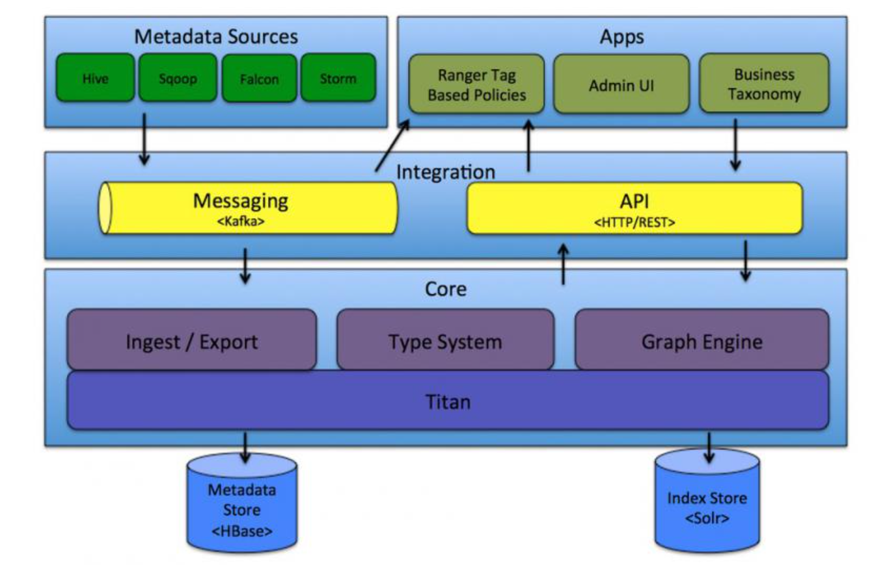

## 元数据管理工具Atlas

### 数据仓库元数据管理

元数据(MetaData)狭义的解释是用来描述数据的数据。广义的来看，除了业务逻辑直接读写处理的那些业务数据，所有其它用来维持整个系统运转所需的信息/数据都可以叫作元数据。如数据库中表的Schema信息，任务的血缘关系，用户和脚本/任务的权限映射关系信息等。

管理元数据的目的，是为了让用户能够更高效的使用数据，也是为了让平台管理人员能更加有效的做好数据的维护管理工作。

但通常这些元数据信息是散落在平台的各个系统，各种流程之中的，它们的管理也可能或多或少 可以通过各种子系统自身的工具，方案或流程逻辑来实现。

元数据管理平台很重要的一个功能就是信息的收集，至于收集哪些信息，取决于业务的需求和需 要解决的目标问题。

元数据管理平台还需要考虑如何以恰当的形式对这些元数据信息进行展示;进一步的，如何将这 些元数据信息通过服务的形式提供给周边上下游系统使用，真正帮助大数据平台完成质量管理的闭环工作。
应该收集那些信息，没有绝对的标准，但是对大数据开发平台来说，常见的元数据信息包括

* 表结构信息 
* 数据的空间存储，读写记录，权限归属和其它各类统计信息 
* 数据的血缘关系信息

* 数据的业务属性信息

**数据血缘关系**。血缘信息或者叫做Lineage的血统信息是什么，简单的说就是数据之间的上下游来源去向关系，数据从哪里来到哪里去。如果一个数据有问题，可以根据血缘关系往上游排查， 看看到底在哪个环节出了问题。此外也可以通过数据的血缘关系，建立起生产这些数据的任务之间的依赖关系，进而辅助调度系统的工作调度，或者用来判断一个失败或错误的任务可能对哪些下游数据造成影响等等。

分析数据的血缘关系看起来简单，但真的要做起来，并不容易，因为数据的来源多种多样，加工 数据的手段，所使用的计算框架可能也各不相同，此外也不是所有的系统天生都具备获取相关信 息的能力。而针对不同的系统，血缘关系具体能够分析到的粒度可能也不一样，有些能做到表级 别，有些甚至可以做到字段级别。

以Hive表为例，通过分析Hive脚本的执行计划，是可以做到相对精确的定位出字段级别的数据 血缘关系的。而如果是一个MapReduce任务生成的数据，从外部来看，可能就只能通过分析MR 任务输出的Log日志信息来粗略判断目录级别的读写关系，从而间接推导数据的血缘依赖关系 了。

**数据的业务属性信息**。业务属性信息都有哪些呢?如一张数据表的统计口径信息，这张表干什么 用的，各个字段的具体统计方式，业务描述，业务标签，脚本逻辑的历史变迁记录，变迁原因 等，此外还包括对应的数据表格是由谁负责开发的，具体数据的业务部门归属等。数据的业务属 性信息，首先是为业务服务的，它的采集和展示也就需要尽可能的和业务环境相融合，只有这样 才能真正发挥这部分元数据信息的作用。
很长一段时间内，市面都没有成熟的大数据元数据管理解决方案。直到2015年，Hortonworks 终于坐不住了，约了一众小伙伴公司倡议:咱们开始整个数据治理方案吧。然后，包含数据分 类、集中策略引擎、数据血缘、安全和生命周期管理功能的Atlas应运而生。(类似的产品还有 Linkedin 在2016年新开源的项目 WhereHows )

### Atlas简介

Atlas是Hadoop平台元数据框架;

Atlas是一组可扩展的核心基础治理服务，使企业能够有效，高效地满足Hadoop中的合规性要 求，并能与整个企业数据生态系统集成;

Apache Atlas为组织提供了开放的元数据管理和治理功能，以建立数据资产的目录，对这些资产 进行分类和治理，并为IT团队、数据分析团队提供围绕这些数据资产的协作功能。



Atlas由元数据的收集，存储和查询展示三部分核心组件组成。此外，还会有一个管理后台对整 体元数据的采集流程以及元数据格式定义和服务的部署等各项内容进行配置管理。

Atlas包括以下组件: 

* Core。Atlas功能核心组件，提供元数据的获取与导出(Ingets/Export)、类型系统(Type System)、元数据存储索引查询等核心功能 
* Integration。Atlas对外集成模块。外部组件的元数据通过该模块将元数据交给Atlas管理
* Metadata source。Atlas支持的元数据数据源，以插件形式提供。当前支持从以下来源提 取和管理元数据:
  * Hive
  * HBase
  * Sqoop
  * Kafka
  * Storm
* Applications。Atlas的上层应用，可以用来查询由Atlas管理的元数据类型和对象
* Graph Engine(图计算引擎)。Altas使用图模型管理元数据对象。图数据库提供了极大的 灵活性，并能有效处理元数据对象之间的关系。除了管理图对象之外，图计算引擎还为元 数据对象创建适当的索引，以便进行高效的访问。在Atlas 1.0 之前采用Titan作为图存储引 擎，从1.0开始采用 JanusGraph 作为图存储引擎。JanusGraph 底层又分为两块: 
* Metadata Store。采用 HBase 存储 Atlas 管理的元数据;
* Index Store。采用Solr存储元数据的索引，便于高效搜索;

#### 安装配置

* Maven 3.6.3(完成)

* HBase 1.1.2(不需要安装，需要软件包) 
* Solr 5.5.1(不需要安装，需要软件包) 
* atlas 1.2.0(需要编译)

官方只提供了源码，没有提供二进制的安装版本，因此Atlas需要编译。

#### 安装步骤

###### 准备软件包

apache-atlas-1.2.0-sources.tar.gz 

solr-5.5.1.tgz

hbase-1.1.2.tar.gz

###### 解压缩源码，修改配置

```shell
# 解压缩
cd /opt/lagou/software
tar zxvf apache-atlas-1.2.0-sources.tar.gz
cd apache-atlas-sources-1.2.0/
# 修改配置 
vi pom.xml
# 修改
645 <npm-for-v2.version>3.10.8</npm-for-v2.version> 
652 <hadoop.version>2.9.2</hadoop.version>
```

###### 将HBase、Solr的包拷贝到对应的目录中

如果不拷贝这些包，就需要下载，下载 HBase 和 Solr 时速度很慢。这里提前下载完所需的这两 个组件，拷贝到对应目录中。

