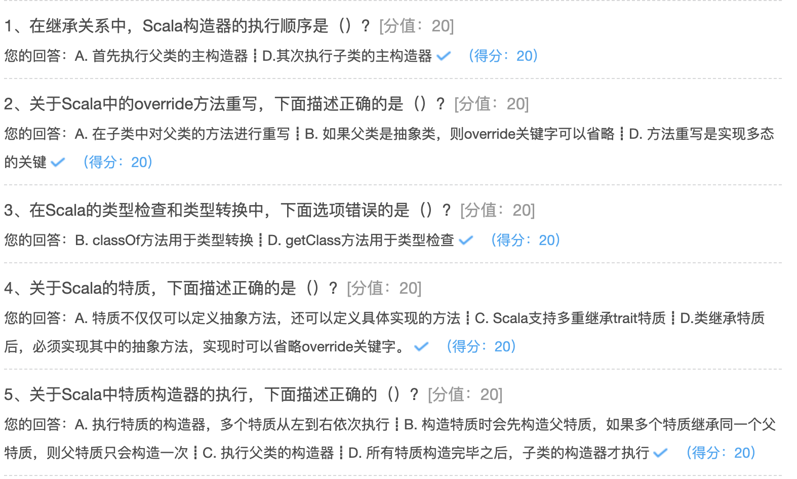

## 继承与特质

### 继承

#### 继承的概念

使用extends关键字：

```scala
package hhb.cn.part05

class person(name: String, age: Int)

//默认的类构造器属性是val，只有getter方法，stuNo使用var修饰，所以有getter setter方法
class Student(name: String, age: Int, var stuNo: String) extends person(name, age)

object ExtendsDemo {

  def main(args: Array[String]): Unit = {
    val student = new Student("张三", 20, "1001")
    student.stuNo = "1002"

    println(student.stuNo)

  }
}
```

#### 构造器的执行顺序

Scala在继承的时候构造器的执行顺序：首先执行父类的主构造器，其次执行子类自身的主构造器。

类有一个主构造器和任意数量的辅助构造器，而每个辅助构造器都必须以对先前定义的辅助构造器或主构造器的调用开始。

子类的辅助构造器最终都会调用主构造器。只有主构造器可以调用父类的构造器。

```
package hhb.cn.part05

class person(name: String, age: Int) {
  println("这是父类构造器！")
}

//默认的类构造器属性是val，只有getter方法，stuNo使用var修饰，所以有getter setter方法
class Student(name: String, age: Int, var stuNo: String) extends person(name, age) {
  println("这是子类构造器")
}

object ExtendsDemo {

  def main(args: Array[String]): Unit = {
    val student = new Student("张三", 20, "1001")
    student.stuNo = "1002"

    println(student.stuNo)
  }
}
```

输出：

```
这是父类构造器！
这是子类构造器
1002
```

#### override方法重写

Scala在继承的时候构造器的执行顺序：首先执行父类的主构造器，其次执行子类自身的主构造器。

类有一个主构造器和任意数量的辅助构造器，而每个辅助构造器都必须以对先前定义的辅助构造器或主构造器的调用开始。

子类的辅助构造器最终都会调用主构造器。只有主构造器可以调用父类的构造器。

```scala
package hhb.cn.part05


class Programmer(name: String, age: Int) {

  def coding: Unit = {
    println("我在写代码")
  }
}

class ScalaProgrammer(name: String, age: Int, workNo: String) extends Programmer(name, age) {

  override def coding: Unit = {
    //调用父类的方法
    super.coding

    //增加自己的实现
    println("我在用Scala写代码")
  }
}


object OverrideDemo {

  def main(args: Array[String]): Unit = {
    val scalaProgrammer = new ScalaProgrammer("张三", 20, "1001")
    scalaProgrammer.coding
  }

}
```

需要强调一点：如果父类是抽象类，则override关键字可以不加。如果继承的父类是抽象类（假设抽象类为AbstractClass，子类为SubClass），在SubClass类中，AbstractClass对应的抽象方法如果没有实现的话，那SubClass也必须定义为抽象类，否则的话必须要有方法的实现。

```scala
package hhb.cn.part05

abstract class Person(name: String, age: Int) {
  def talk: Unit
}

class Teacher(name: String, age: Int, workNo: String) extends Person(name, age) {
  //重写抽象类的walk方法，可以不加override方法
  def talk: Unit = {
    println("重写父类的方法")
  }
}

object AbstractDemo {

  def main(args: Array[String]): Unit = {
    val teacher = new Teacher("张三", 20, "123")
    teacher.talk
  }
}
```

#### 类型检查与转换 

要测试某个对象是否属于某个给定的类，可以用isInstanceOf方法。如果测试成功，可以用asInstanceOf方法进行类型转换。

```scala
if(p.isInstanceOf[Employee]){
	//s的类型转换为Employee
	val s = p.asInstanceOf[Employee]
}
```

如果p指向的是Employee类及其子类的对象，则p.isInstanceOf[Employee]将会成功。

如果p是null，则p.isInstanceOf[Employee]将返回false，且p.asInstanceOf[Employee]将返回null。

如果p不是一个Employee，则p.asInstanceOf[Employee]将抛出异常。

如果想要测试p指向的是一个Employee对象但又不是其子类，可以用：

```scala
if(p.getClass == classOf[Employee])
```

classOf方法定义在scala.Preder对象中，因此会被自动引入。

不过，与类型检查和转换相比，模式匹配通常是更好的选择。

```scala
p match{
	//将s作为Employee处理
	case s: Employee => ...
	//p不是Employee的情况
	case _ => ....
}
```

示例：

```scala
package hhb.cn.part05


class Person2

class Student2 extends Person2


object InstanceDemo {

  def main(args: Array[String]): Unit = {
    val p: Person2 = new Student2
    var s: Student2 = null
    //如果对象s 是一个null，isInstanceOf返回是false
    println(s.isInstanceOf[Student2])

    // 判断对象p是不是Student2这个类型
    if (p.isInstanceOf[Student2]) { // true
      //把p这个对象转化为Student2类型后赋值给s
      s = p.asInstanceOf[Student2]
    }
    // 输出s是否是Student2
    println(s.isInstanceOf[Student2]) // true

    //此时p已经是Student2类型
    println(p.getClass == classOf[Person2]) //false
    println(p.getClass == classOf[Student2]) // true

    println("-================================")

    p match {
      case s: Student2 => println("它是Student2类型的对象")
      case _ => println("它什么也不是")
    }
  }
}
```

### 特质

#### 作为接口使用的特质

Scala中的trait特质是一种特殊的概念。

首先可以将trait作为接口来使用，此时的trait就与Java中的接口非常类似。

在trait中可以定义抽象方法，与抽象类中的抽象方法一样，只要不给出方法的具体实现即可。

类可以使用extends关键字继承trait。

注意：在Scala中没有implement的概念，无论继承类还是trait特质，统一都是extends。

类继承trait特质后，必须实现其中的抽象方法，实现时**可以省略override关键字**。

Scala不支持对类进行多继承，但是**支持多重继承trait特质，使用with关键字即可**。

```scala
package hhb.cn.part06

trait HelloTrait {
  def seyHello: String
}

trait MakeFriendTrait {
  def makerFriend
}

class Person(name: String) extends HelloTrait with MakeFriendTrait {
  override def seyHello: String = {
    println(s"Hello,My Name is $name")
    name
  }

  override def makerFriend: Unit = {
    println(s"Hi, $name")
  }
}

//如果一个类继承了多个trait，第一个Trait用extends，其他的Trait用with关键字
object TraitDemo extends App {
  val person = new Person("zhangsan")
  println(person.seyHello)
  person.makerFriend
}
```

#### 带有具体实现的特质

###### 具体方法

Scala中的trait特质不仅仅可以定义抽象方法，还可以定义具体实现的方法，这时的trait更像是包含了通用工具方法的类。比如，trait中可以包含一些很多类都通用的功能方法，比如打印日志等等，Spark中就使用了trait来定义通用的日志打印方法。

###### 具体字段

Scala trait特质中的字段可以是抽象的，也可以是具体的。

```scala
package hhb.cn.part06

trait People {
  val name: String
  val age = 30
  val score: Double = 100

  def eat: Unit = {
    println("Eating........")
  }

  def test
}

trait Worker {
  val age = 20

  def work: Unit = {
    println("Working.........")
  }

}

class Student extends People with Worker {
  //重写抽象字段name，此处override可以省略
  override val name: String = "lisi"
  //由于Worker和People中都有age字段，所以当继承这两个类需要重写age字段，此时override关键字不能省略，否则会报错
  override val age: Int = 25

  override def test: Unit = {
    println("============")
  }
}

object TraitDemoTwo extends App {

  val student = new Student
  student.eat
  student.work
  println(student.name)
  println(student.age)
  println(student.score)
  student.test
}
```

**注意：**特质Person和Worker中都有age字段，当Student继承这两个特质时，需要重写age字段，并且要用override关键字，否则就会报错。

#### 特质构造顺序

在Scala中，trait特质也是有构造器的，也就是trait中的不包含在任何方法中的代码。

构造器以如下顺序执行：

1. 执行父类的构造器；

2. 执行trait的构造器，多个trait从左到右依次执行；

3. 构造trait时会先构造父trait，如果多个trait继承同一个父trait，则父trait只会构造一次；

4. 所有trait构造完毕之后，子类的构造器才执行

```scala
package hhb.cn.part06


class Person2 {
  println("Person's Constructor!")
}

trait Logger {
  println("Logger's Constructor!")
}

trait MyLogger extends Logger {
  println("MyLogger's Constructor!")

}

trait TimeLogger extends Logger {
  println("TimeLogger's Constructor!")

}

//如果一个类继承了父类，也继承了特质，要先写父类，在写特质
// extends 父类 with 特质
class Student2 extends Person2 with MyLogger with Logger with TimeLogger {
  println("Student2======")
}


object TraitDemoThree extends App {
  val student = new Student2
}
```

执行结果

```
Person's Constructor!
Logger's Constructor!
MyLogger's Constructor!
TimeLogger's Constructor!
Student2======
```

#### 特质继承类

在Scala中，trait特质也可以继承class类，此时这个class类就会成为所有继承此trait的类的父类。

```scala
package hhb.cn.part06

class MyUtil {
  def printMessage(name: String): Unit = {
    println("Hello, " + name)
  }
}

trait Log extends MyUtil {
  def sayHi(message: String): Unit = {
    println("Hi, " + message)
  }
}

// MyStudent 继承了Log特质，Log特质继承了MyUtil类，那么MyUtil就成了MyStudent 的父类，继承的传递性
class MyStudent(name: String) extends Log {
  def log(): Unit = {
    println("MyStudent:" + name)
    printMessage(name)
    sayHi(name)
  }
}

object TraitDemoFour {
  def main(args: Array[String]): Unit = {
    val student = new MyStudent("zhangsan")
    student.log()
  }
}
```

#### 使用 trait 实现适配器模式

当某个特质中有多个抽象方法，而我们只需要用到某个或某几个方法时不得不将该特质所有抽象方法重写。针对这种情况可以定义一个抽象类继承该特质，重写特质的所有方法，方法体为空。需要使用哪个方法只需要定义类继承抽象类，重写指定方法即可。

```scala
package hhb.bilibili.oop

/**
 * @description:
 * @date: 2020-10-19 21:38
 **/
object ClassDemo20 {

  trait LOL {
    def top()

    def mid()

    def adc()

    def support()
  }

  abstract class Player extends LOL {
    override def top(): Unit = {

    }

    override def mid(): Unit = {

    }

    override def adc(): Unit = {

    }

    override def support(): Unit = {

    }
  }

  class GreenHand extends Player {
    override def support(): Unit = {
      println("辅助")
    }
  }

  //Player 就是适配器类
  def main(args: Array[String]): Unit = {
    val hand = new GreenHand
    hand.support()
  }

}
```

#### 使用 trait 实现模板方法模式

在 Scala 中我们可以先定义一个操作中的算法骨架，而将算法的一些步骤延迟到子类中，使得子类可以不改变该结构的情况下重定义该算法的某些特定步骤，这就是模板方法设计模式。

优点：扩展性强、符号开闭原则。

缺点：类的个数增加会导致系统庞大，设计更抽象、增加代码阅读难度。

```scala
package hhb.bilibili.oop

/**
 * @description:
 * @date: 2020-10-19 21:45
 **/
object ClassDemo21 {

  abstract class Template {
    def code()

    def getRunTime(): Unit = {
      val l1 = System.currentTimeMillis()
      code()
      val l2 = System.currentTimeMillis()
      println(l2 - l1)
    }
  }

  class ForDemo extends Template {
    override def code(): Unit = for (i <- 1 to 10000) println("hello Scala")
  }

  def main(args: Array[String]): Unit = {
    val demo = new ForDemo
    demo.getRunTime()
  }
}
```

#### 使用 trait 实现责任链模式

多个 trait 中出现了同一方法，且该方法最后都调用了 super.该方法名()，当类继承了这多个 trait 后就可以依次调用多个 trait 中的此同一个方法了，这就形成了一个调用链。

执行顺序：从右至左、先子类后父类。

```scala
package hhb.bilibili.oop

/**
 * @description:
 * @author: huanghongbo
 * @date: 2020-10-19 22:03
 **/
object ClassDemo22 {

  trait Handle {
    def handler(data: String): Unit = {
      println("具体要处理的数据。。。4")
      println(data) // 5
    }
  }

  trait DataValidHandle extends Handle {
    override def handler(data: String): Unit = {
      println("验证数据 3")
      //核心：调用父特质的handle方法
      super.handler(data)
    }
  }

  trait SignHandle extends Handle {
    override def handler(data: String): Unit = {
      println("验签数据 2")
      //核心：调用父特质的handle方法
      super.handler(data)
    }
  }

  // 叠加特质
  class Payment extends DataValidHandle with SignHandle {
    override def handler(data: String): Unit = {
      println("用户发起支付请求 1")
      super.handler(data)
    }
  }

  /**
   * 执行顺序：
   * 1. 。按照从右向左的顺序，从右至左、先子类后父类。
   * @param args
   */
  def main(args: Array[String]): Unit = {
    val payment = new Payment
    payment.handler("123")
  }

}
```


#### Ordered和Ordering

在Java中对象的比较有两个接口，分别是Comparable和Comparator。它们之间的区别在于：

* 实现Comparable接口的类，重写compareTo()方法后，其对象自身就具有了可比较性；

* 实现Comparator接口的类，重写了compare()方法后，则提供一个第三方比较器，用于比较两个对象。

在Scala中也引入了以上两种比较方法(Scala.math包下):

Ordered特质混入Java的Comparable接口，它定义了相同类型间的比较方式，但这种内部比较方式是单一的；

```scala
trait Ordered[A] extends Any with java.lang.Comparable[A]{......}
```

Ordering特质混入Comparator接口，它是提供第三方比较器，可以自定义多种比较方式，在实际开发中也是使用比较多的，灵活解耦合。

```scala
trait Ordering[T] extends Comparator[T] with PartialOrdering[T] with Serializable {......}
```

排序操作

```scala
package hhb.cn.part06

import scala.util.Sorting


case class Project(tag: String, score: Int) extends Ordered[Project] {

  override def compare(that: Project): Int = {
    tag.compareTo(that.tag)
  }
}

object OrderDemo {

  def main(args: Array[String]): Unit = {
    //字典序
    val list = List(Project("hadoop", 40), Project("flink", 90), Project("hive", 30), Project("kafka", 20))
    println(list.sorted)


    val tuples = Array(("a", 3, 'b'), ("b", 1, 'c'), ("c", 2, 'a'))
    //默认使用第一个字母排序
    Sorting.quickSort(tuples)
    println(tuples.toBuffer)

    //Ordering.by[(String, Int, Char), Int](_._2) 将一个(String, Int, Char)
    // 类型的Tuple元组转换成Int类型，并根据Tuple元组中第二个元素排序
    Sorting.quickSort(tuples)(Ordering.by[(String, Int, Char), Int](_._2))
    println(tuples.toBuffer)
  }
}
```





