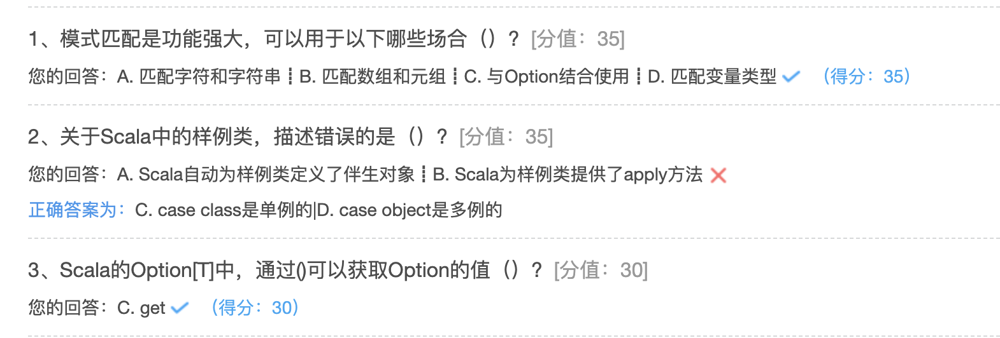

## 模式匹配和样例类

### 模式匹配

Scala没有Java中的switch case，它有一个更加强大的模式匹配机制，可以应用到很多场合。

Scala的模式匹配可以匹配各种情况，比如变量的类型、集合的元素、有值或无值。

模式匹配的基本语法结构：**变量 match { case 值 => 代码 }**

模式匹配match case中，只要有一个case分支满足并处理了，就不会继续判断下一个case分支了，不需要使用break语句。这点与Java不同，Java的switch case需要用break阻止。如果值为下划线，则代表不满足以上所有情况的时候如何处理。

模式匹配match case最基本的应用，就是对变量的值进行模式匹配。match是表达式，与if表达式一样，是有返回值的。

除此之外，Scala还提供了样例类，对模式匹配进行了优化，可以快速进行匹配。

### 字符和字符串匹配

```scala
package hhb.cn.part07

import scala.util.Random

object MatchDemo {

  def main(args: Array[String]): Unit = {
    //对字符进行模式匹配
    val carStr = '6'
    carStr match {
      //只要有一个匹配上就会直接返回，不需要break。
      case '+' => println("11111111111")
      case '-' => println("22222222222")
      case '*' => println("33333333333")
      case '/' => println("44444444444")
      //这个表示上面的都没有匹配上，输出other，类似Java中default
      case _ => println("other")
    }
    //对字符串进行模式匹配
    val arr = Array("Hadoop", "Zookeeper", "Spark", "Scala")
    val project = arr(Random.nextInt(arr.length))
    println(project)
    project match {
      case "Hadoop" => println("this is Hadoop")
      case "Zookeeper" => println("this is Zookeeper")
      case "Spark" => println("this is Spark")
      case _ => println("Other")
    }
  }
}

```

### 守卫式匹配

```scala
 //守卫式匹配，添加if 判断
val c = '/'
val num = c match {
  case '+' => 1
  case '-' => 2
  case _ if c.equals('*') => 3
  case _ => 4
}
println(num)
```

### 匹配类型

Scala的模式匹配还有一个强大的功能，它可以直接匹配类型，而不是值。这一点是Java的switch case做不到的。
匹配类型的语法：**case 变量 : 类型 => 代码**，而不是匹配值的“case 值 => 代码”这种语法。

```scala
//匹配类型语法： case 变量 : 类型 => 代码
def typeMatch(x: Any): Int = {
  x match {
    case x: String => println("这是一个字符串类型")
    1
    case x: Int => println("这是一个整型类型")
    2
    case x: Boolean if x == false => println("这是布尔类型的false")
    3
    case x: Array[Int] => println("这是一个整型数组")
    4
    case _ => println("不知道是什么类型")
    5
}

```

### 匹配数组、元组、集合

```scala
package hhb.cn.part07

object MatchCollection {

  def main(args: Array[String]): Unit = {

    //对Array数组进行匹配，分别匹配：带有指定个数元素的数组、带有指定元素的数组、以某个元素开头的数据
    //    val array = Array(1, 3, 5, 7, 9) // 这是一个其他数组
    //val array = Array(1, 3, 5) //这是一个指定长度为3的数组，并且第一个元素为1，x y 分别为 ：3   5
    //    val array = Array(1) //这是一个指定长度只有1的数组，而且元素就是1
    val array = Array(2) // 这是一个其他数组
    array match {
      case Array(1, x, y) => println(s"这是一个指定长度为3的数组，并且第一个元素为1，x y 分别为 ：$x   $y")
      case Array(1) => println("这是一个指定长度只有1的数组，而且元素就是1")
      case Array(1, _*) => println("这是一个以1开头的数组")
      case _ => println("这是一个其他数组")
    }


    //对List集合进行匹配，分别匹配：带有指定个数元素的列表、带有指定元素的列表、以某个元素开头的列表、以某个元素结尾
    //    val list = List(1, 3, 4, 5)  // 这是一个以1开头的元素
    //    val list = List(1, 3) // 这个一个有指定个数元素的列表，1  3
    //    val list = List(1) // 这是一个指定长度只有1的列表，而且元素就是1
    val list = List(2, 4, "s") // 其他
    list match {
      case x :: y :: Nil => println(s"这个一个有指定个数元素的列表，$x  $y")
      case 1 :: Nil => println("这是一个指定长度只有1的列表，而且元素就是1")
      case 1 :: tail => println("这是一个以1开头的元素")
      //      case head :: 2 => println("这是一个以2结尾的元素")
      case _ => println("其他")
    }


    //对元组进行匹配
    var tuple = (2, 3, 2)
    tuple match {
      //以1开头，包含三个元素的元组
      case (1, x, y) => println(s"$x   $y")
      //以1结尾，包含三个元素的元组
      case (x, _, 1) => println(s"$x  ")
      case _ => println("其他")
    }
  }
}
```

### 样例类

case class样例类是Scala中特殊的类。当声明样例类时，以下事情会自动发生：

- 主构造函数接收的参数通常不需要显式使用var或val修饰，Scala会自动使用val修饰
- 自动为样例类定义了伴生对象，并提供apply方法，不用new关键字就能够构造出相应的对象
- 将生成toString、equals、hashCode和copy方法，除非显示的给出这些方法的定义
- 继承了Product和Serializable这两个特质，也就是说样例类可序列化和可应用Product的方法

case class是多例的，后面要跟构造参数，case object是单例的。

此外，case class样例类中可以添加方法和字段，并且可用于模式匹配。

```scala
package hhb.cn.part07


class Amount

//样例类中主构造器的参数默认用val修饰
//样例类中自动生成apply方法
case class Test() extends Amount

case class Dollar(value: Double) extends Amount

case class Currency(value: Double, unit: String) extends Amount

case object Nothing extends Amount

object CaseClassDemo {

  def main(args: Array[String]): Unit = {
    judgeIdentity(Dollar(10.0))
    judgeIdentity(Currency(10.0, "123"))
    judgeIdentity(Nothing)
    judgeIdentity(Test())

  }

  /**
   * 样例类匹配
   *
   * @param amount
   */
  def judgeIdentity(amount: Amount): Unit = {
    amount match {
      case Dollar(value) => println("Dollar类型")
      case Currency(value, unit) => println("Currency类型")
      case Nothing => println("Nothing类型")
      case Test() => println("test")
    }
  }
}
```

### Option与模式匹配

Scala Option选项类型用来表示一个值是可选的，有值或无值。

Option[T] 是一个类型为 T 的可选值的容器，可以通过get()函数获取Option的值。如果值存在，Option[T] 就是一个 Some。如果不存在，Option[T] 就是对象 None 。

Option通常与模式匹配结合使用，用于判断某个变量是有值还是无值。

```scala
object OptionDemo {

  val map: Map[String, Int] = Map("a" -> 1, "b" -> 2, "c" -> 3)

  def getScore(name: String): Int = {

    val score = map.get(name)
    score match {
      //如果socre有值
      case Some(score) => score
      //如果score没有值
      case None => -1
    }
  }

  def main(args: Array[String]): Unit = {
    println(getScore("a"))
    println(getScore("d"))
  }

}
```



