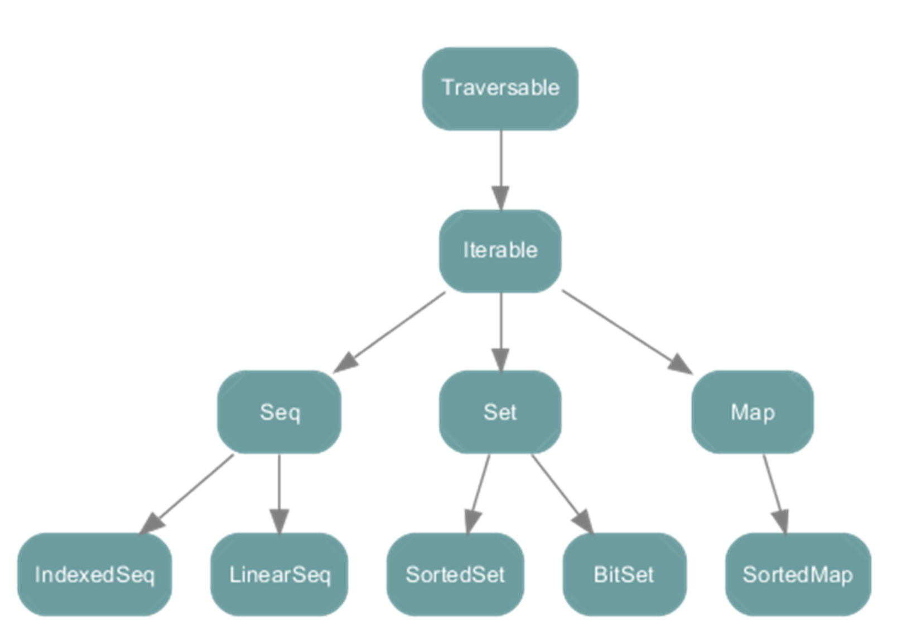
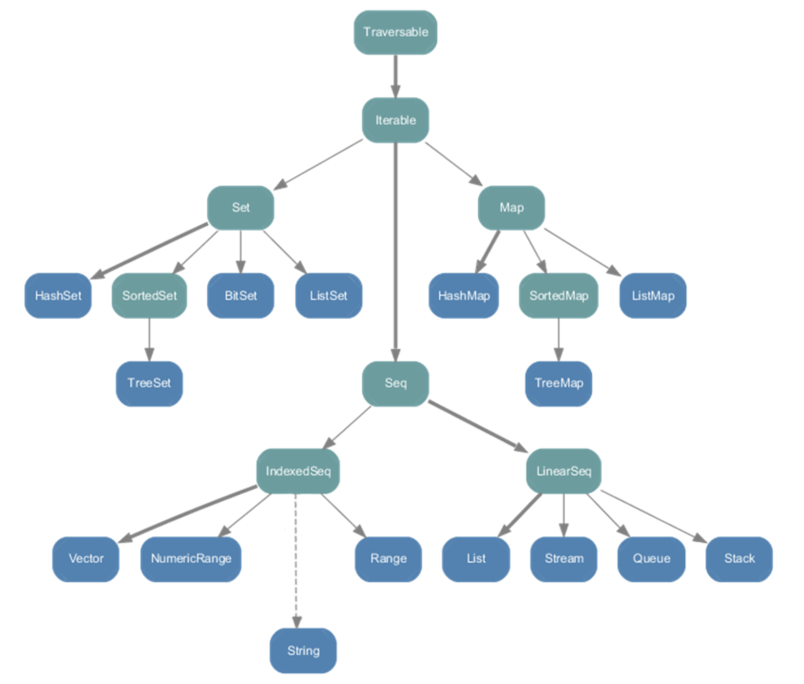
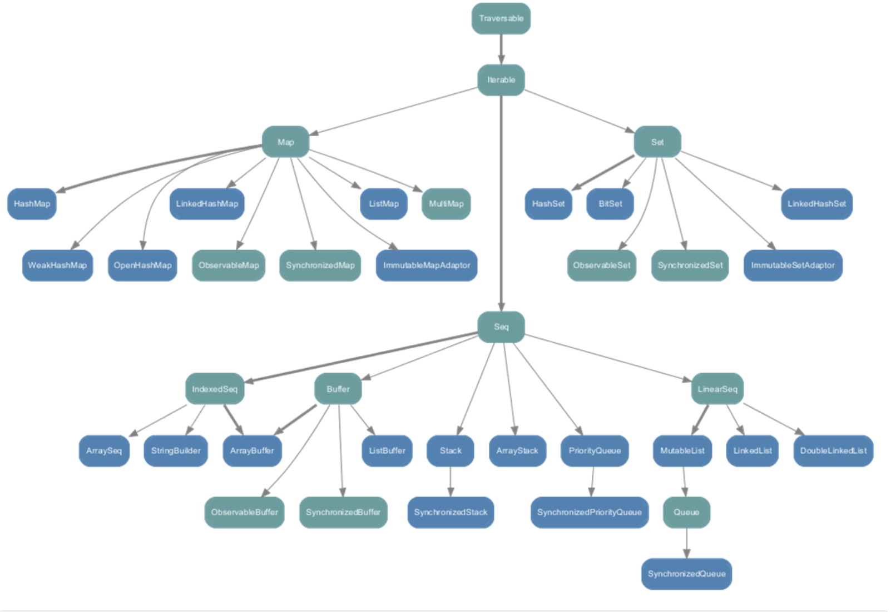
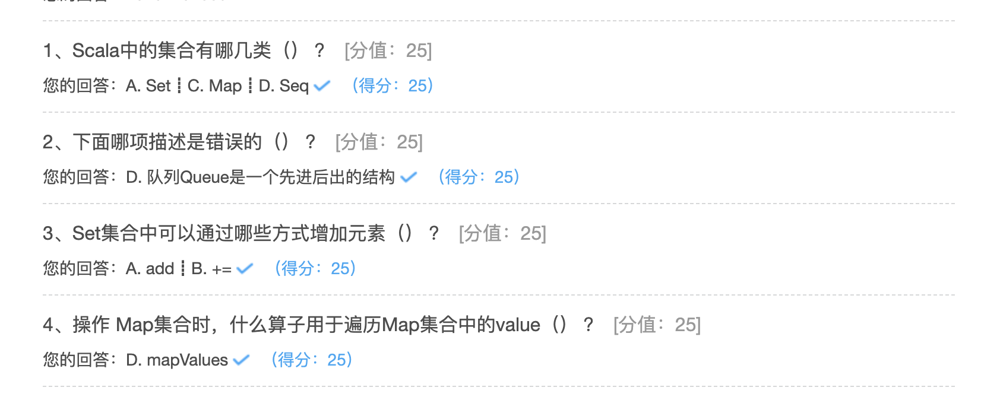

## 集合

### 可变和不可变集合

根据容器中元素的组织方式和操作方式，可以分为有序和无序、可变和不可变等不同容器类别。

不可变集合：是指集合的元素一但初始化完成就不可在进行更改，任何对集合的改变都将生成一个新的集合。

可变集合：提供了改变集合内元素的方法；

Scala同时支持可变集合和不可变集合，主要下面两个包：

- scala.collection.c：定义了可变集合的特质和具体实现类
- scala.collection.immutable：定义了不可变集合的特质和具体实现类

对于所有的集合类，Scala都同时提供了可变和不可变的版本


Scala优先采用不可变集合，不可变集合元素不可变更，可以安全的并发访问。Scala集合有三大类：Seq（序列）、Set（集）、Map（映射）；所有集合都拓展Iterable特质



Immutable 不可变集合



mutable可变集合：



```
小结：
String 属于IndexedSeq
Queue队列和Stack堆这两个经典的数据结构属于LinearSeq
Map体系下有一个SortedMap，说明Scala中的Map是可以支持排序的
mutable可变集合中Seq中的Buffer下有ListBuffer，想当于List
List列表属于Seq重的LinearSeq
```

### Seq

Seq代表按照一定顺序排列的元素序列，该序列是一种特殊的课迭代集合，包含可重复的元素。元素的顺序是确定的，每个元素对应一个索引值。

Seq提供了两个重要的子特质：

- IndexedSeq：提供了快速随机访问元素的功能，它通过索引来查找和定位的
- LinearSeq：提供了访问head、tail的功能，它是线型的，有头部和尾部的概念，通过遍历来查找。

#### List

List代表元素固定的不可变列表，它是Seq的子类，在Scala中经常使用。List是函数式编程语言中典型的数据结构，与数组类似，可索引、存放类型相同的元素。List一旦被定义，其值就不能修改。

List列表有头部和尾部的概念，可以分别使用head和tail方法来获取：

- head返回的是列表第一个元素的值
- tail返回的是除第一个元素外的其它元素构成的新列表

这体现出列表具有递归的链表结构。

Scala定义了一个空列表对象Nil，定义为List[Nothing]

借助 Nil 可将多个元素用操作符 **::** 添加到列表头部，常用来初始化列表；

操作符 **:::** 用于拼接两个列表；

```scala
package hhb.cn.part09

/**
 * @description:
 * @date: 2020-09-28 22:06
 **/
object ListDemo {

  def main(args: Array[String]): Unit = {

    //Nil 表示一个空列表
    // :: 操作符表示向集合中添加元素，它是从右向左运算的，所以空集合一定放在最右边
    val list1 = 1 :: 2 :: 3 :: 4 :: Nil
    val list2 = 5 :: 6 :: 7 :: 8 :: Nil
    // 使用 ::: 将两个集合拼接起来
    val list3 = list1 ::: list2 // List(1, 2, 3, 4, 5, 6, 7, 8)
    val list4 = list1 :: list2 // List(List(1, 2, 3, 4), 5, 6, 7, 8)
    println(list3)
    println(list4)

    println(list3.head) //返回第一个元素
    println(list3.tail) //返回除了一个元素之外的所有元素
    println(list3.init) // 返回除了最后一个的所有元素
    println(list3.last) // 返回最后一个元素

    val list = List(5, 1, 3, 6, 2, 5, 7, 0)
    println(quickSort(list))
  }

  //递归，快排
  def quickSort(list: List[Int]): List[Int] = {
    list match {
      case Nil => Nil
      case head :: tail =>
        // 使用partition 方法，把list集合分为两个部分，第一个部分小于head，第二个部分大于head
        val tuple: (List[Int], List[Int]) = tail.partition(_ < head)
        //让小于head的部分放在头部，把head放到大于head的集合中，组成一个新的集合
        quickSort(tuple._1) ::: head :: quickSort(tuple._2)
      //        val value = head :: Nil
      //        quickSort(tuple._1) ::: value ::: quickSort(tuple._2)
    }
  }
}
```

#### Queue

队列Queue是一个先进先出的结构。

队列是一个有序列表，在底层可以用数组或链表来实现。

先进先出的原则，就是先存入的数据，要先取出，后存入的数据后取出。

在Scala中，有scala.collection.mutable.Queue(可变集合)和scala.collection.immutable.Queue（不可变集合），一般来说，我们使用的是scala.collection.mutable.Queue

```scala
package hhb.cn.part09

import scala.collection.mutable

/**
 * @description:
 * @date: 2020-09-28 22:43
 **/
object QueueDemo {

  def main(args: Array[String]): Unit = {

    val queue = new mutable.Queue[Int]()
    println(queue)

    //添加一个元素
    queue += 1

    //向队列中添加一个集合
    queue ++= List(2, 3, 4)

    //获取第一个元素并删除
    val dequeue = queue.dequeue()
    println(dequeue)
    println(queue)

    //再次向队列中添加元素
    queue.enqueue(5,6,7)

    //获取第一个元素和最后一个元素
    println(queue.head)
    println(queue.last)
  }
}
```

### Set

Set(集合)是没有重复元素的对象集合，Set中的元素是唯一的；

Set分为可变的和不可变的集合；

默认情况下，使用的是不可变集合(引用 scala.collection.immutable.Set)；

使用可变集合，需要引用 scala.collection.mutable.Set 包；

```scala
package hhb.cn.part09


/**
 * @description:
 * @date: 2020-09-28 23:03
 **/
object SetDemo {

  def main(args: Array[String]): Unit = {

    //创建一个set集合，默认是不可变的set集合
    val set = Set(1, 2, 3, 4, 5, 6)
    set.removedAll(Array(1))
    //由于是不可变集合，无法删除
    println(set)

    //创建一个可变Set集合
    import scala.collection.mutable.Set

    val mutableSet = Set[Int]()
    println(mutableSet)
    mutableSet.add(1)
    mutableSet.addAll(Array(2, 3, 4, 5, 1))
    println(mutableSet)

    mutableSet.remove(1)
    println(mutableSet)

    //通过是有 += -= 进行增加删除操作
    mutableSet += 8
    println(mutableSet)
    mutableSet -= 2
    println(mutableSet)

    //对set集合进行交集的操作,可是使用&符合或intersect
    println(Set(1, 2, 3) & Set(2, 3, 4)) // 2,3
    println(Set(1, 2, 3) intersect (Set(2, 3, 4))) // 2,3

    // 对set集合进行去并集的操作( ++ 、 ｜  、 union)，会自动去重
    println(Set(1, 2, 3) ++ Set(2, 3, 4)) //1，2，3，4
    println(Set(1, 2, 3) | Set(2, 3, 4)) //1，2，3，4
    println(Set(1, 2, 3) union Set(2, 3, 4)) //1，2，3，4

    //对Set集合进行取差集的操作（ --  &～  diff）
    // 是将两个集合中的相同的元素，从第一个集合中删除掉，第一个集合剩下的元素就是取差集的结果
    println(Set(1, 2, 3) -- Set(2, 3, 4)) //1
    println(Set(1, 2, 3) &~ Set(2, 3, 4)) //1
    println(Set(1, 2, 3) diff Set(2, 3, 4)) //1
  }
}
```

### Map

Map(映射)是一系列键值对的容器；Scala 提供了可变的和不可变的两种版本的Map，

分别定义在包 scala.collection.mutable 和 scala.collection.immutable 里；

默认情况下，Scala中使用不可变的 Map；

如果要使用可变Map，必须导入scala.collection.mutable.Map；

在Map中，键的值是唯一的，可以根据键来对值进行快速的检索。

```scala
package hhb.cn.part09

/**
 * @description:
 * @date: 2020-09-29 14:08
 **/
object MapDemo {

  def main(args: Array[String]): Unit = {
    //使用两种方式创建不可变的Map

    val map1 = Map("a" -> 1, "b" -> 2)
    val map2 = Map(("a", 1), ("b", 2))

    map1.keys.foreach(println(_))
    map1.values.foreach(println(_))

    println(map1("b"))
    //如果访问不存在的Key的时候，抛出异常
    //    println(map1("c"))

    //使用get方法，获取与key对应的value值
    //get方法会返回一个Option对象，要么是some（有值），要么是none(无值)
    println(map1.get("b"))
    println(map1.get("c"))
    val num = map1.get("a")
    num match {
      case None => println("Null")
      case Some(x) => println(x)
    }

    //使用getOrElse方法,获取key值对应的value的值，如果不存在，返回默认值
    println(map1.getOrElse("c", 0))
    println(map1.getOrElse("b", 0))


    //创建一个可变的Map
    val map3 = scala.collection.mutable.Map("a" -> 1, "b" -> 2)
    println(map3)
    map3("a") = 10
    println(map3)
    map3("c") = 3
    println(map3)
    //使用+= -= 添加删除操作
    map3 += ("d" -> 4, "f" -> 5)
    println(map3)
    map3 -= ("d", "f")
    println(map3)

    //将key与value的值互换
    val map4 = for ((k, v) <- map3) yield (v, k)
    println(map4)

    //第二中方式将key和value互换
    //推荐使用该方式将key和value进行互换
    val map5 = map3.map(x => (x._2, x._1))
    println(map5)

    //通过拉链操作创建Map
    var a = Array(1, 2, 3)
    val b = Array("a", "b", "c")
    val c: Array[(Int, String)] = a.zip(b)
    val map6 = a.zip(b).toMap
    println(map6)
  }
}
```

### 集合常用算子

#### map、foreach & mapValues

集合对象都有 foreach、map 算子。

两个算子的共同点在于：都是用于遍历集合对象，并对每一项执行指定的方法；

两个算子的差异点在于：

foreach无返回值（准确说返回void），用于遍历集合

map返回集合对象，用于将一个集合转换成另一个集合

```scala
//map\forEach\mapValues
val list = (1 to 10).toList
list.foreach(elem => print(elem + " \t"))
list.foreach(print(_))
list.foreach(print)
println(list.map(_ > 2))
println(list.map(_ + 2))
```

操作 Map集合时，mapValues用于遍历value，是map操作的一种简化形式；

```scala
 // Range(20, 0, -2)用给定的步长值设定一个范围，从开始到结束(不包含)。
val index = Range(20, 0, -2).zipWithIndex
val map = index.toMap
println(map)

//将map中的值+100
println(map.map(x => (x._1, x._2 + 100)))
println(map.map { case (key, vale) => (key, vale + 100) })
println(map.mapValues(_ + 100).toMap)
```

#### flatten & flatMap

flatten的作用是把嵌套的结构展开，把结果放到一个集合中；

在 flatMap 中传入一个函数，该函数对每个输入都返回一个集合（而不是一个元素），最后把生成的多个集合“拍扁”成为一个集合；


~~~scala
scala> val lst1 = List(List(1,2), List(3,4))
lst1: List[List[Int]] = List(List(1, 2), List(3, 4))

scala> lst1.flatten
res5: List[Int] = List(1, 2, 3, 4)

// flatten 把一个字符串的集合展开为一个字符集合，因为字符串本身就是字符的集合
scala> val lst4 = List("Java", "hadoop")
lst4: List[String] = List(Java, hadoop)

scala> lst4.flatten
res8: List[Char] = List(J, a, v, a, h, a, d, o, o, p)

// flatten 有效的处理 Some 和 None 组成的集合。它可以展开Some元素形成一个新的集合，同时去掉None元素
scala> val x = Array(Some(1), None, Some(3), None)
x: Array[Option[Int]] = Array(Some(1), None, Some(3), None)

// 方法很多，flatten最简单
scala> x.flatten
res9: Array[Int] = Array(1, 3)

scala> x.collect{case Some(i) => i}
res10: Array[Int] = Array(1, 3)

scala> x.filter(!_.isEmpty).map(_.get)
res11: Array[Int] = Array(1, 3)
~~~


~~~scala
// 下面两条语句等价
val lst = List(List(1,2,5,6),List(3,4))

// 将 lst 中每个元素乘2，最后作为一个集合返回
// 此时 flatMap = flatten + map
//List(1,2,5,6,3,4)
lst.flatten.map(_*2)
lst.flatMap((x: List[Int]) => x.map(_*2))
lst.flatMap(_.map(_*2))

// 将字符串数组按空格切分，转换为单词数组
val lines = Array("Apache Spark has an advanced DAG execution engine",
"Spark offers over 80 high-level operators")
// 下面两条语句效果等价
//map算子产生的结果：Array(Array(Apache, Spark, has, an, advanced, DAG, execution, engine), Array(Spark, offers, over, 80, high-level, operators))
// flatten算子产生的结果：Array(Apache, Spark, has, an, advanced, DAG, execution, engine, Spark, offers, over, 80, high-level, operators)
lines.map(_.split(" ")).flatten
// 此时 flatMap = map + flatten	
lines.flatMap(_.split(" "))
~~~

**备注：flatMap = flatten + map 或 flatMap = map + flatten**

#### collect

collect通过执行一个并行计算（偏函数），得到一个新的数组对象

```scala
object CollectDemo {
  //通过下面的偏函数，把chars数组的小写a转换为大写的A
  val fun: PartialFunction[Char, Char] = {
    case 'a' => 'A'
    case x => x
  }

  def main(args: Array[String]): Unit = {
    val chars = Array('a', 'b', 'c')
    val newchars = chars.collect(fun)
    println("newchars:" + newchars.mkString(","))
  }
}
```

#### reduce

reduce可以对集合当中的元素进行归约操作；

还有 reduceLeft 和 reduceRight ，reduceLeft 从左向右归约，reduceRight 从右向左归约；

~~~scala
val lst1 = (1 to 10).toList
lst1.reduce(_+_)

// 为什么这里能出现两个占位符？
lst1.reduce(_+_)

// 我们说过一个占位符代表一个参数，那么两个占位符就代表两个参数。根据这个思路改写等价的语句
// x类似于buffer，缓存每次操作的数据；y每次操作传递新的集合元素
lst1.reduce((x, y) => x + y)


// 利用reduce操作，查找 lst1 中的最大值
lst1.reduce((x,y) => if (x>y) x else y)

// reduceLeft、reduceRight
lst1.reduceLeft((x,y) => if (x>y) x else y)
lst1.reduceRight((x,y) => if (x>y) x else y)
~~~

#### sorted sortwith & sortby

Scala中对于集合的排序有三种方法：sorted、sortBy、sortWith

```scala
object SortDemo {
  def main(args: Array[String]): Unit = {
    val list = List(1, 9, 3, 8, 5, 6)
    //sorted方法对一个集合进行自然排序
    //sorted源码：def sorted[B >: A](implicit ord: Ordering[B]): Repr
    //源码中有两点值得注意的地方：
    // 1.sorted方法中有个隐式参数ord: Ordering。
    // 2.sorted方法真正排序的逻辑是调用的java.util.Arrays.sort
    val numSort: List[Int] = list.sorted
    println(numSort)
    //sortBy源码：def sortBy[B](f: A => B)(implicit ord: Ordering[B]): Repr = sorted(ord on f)
    //sortBy最后调用的sorted方法
    println(list.sortBy(x => x).reverse)

    //sortWith源码：def sortWith(lt: (A, A) => Boolean): Repr = sorted(Ordering fromLessThan lt)
    print(list.sortWith(_ > _))
  }
}
```

### 与Java集合的转换

使用 scala.collection.JavaConverters 与Java集合交互。它有一系列的隐式转换，添加了asJava和asScala的转换方法。

~~~scala
import scala.collection.JavaConverters._
 
val list: Java.util.List[Int] = List(1,2,3,4).asJava
val buffer: scala.collection.mutable.Buffer[Int] = list.asScala
~~~



