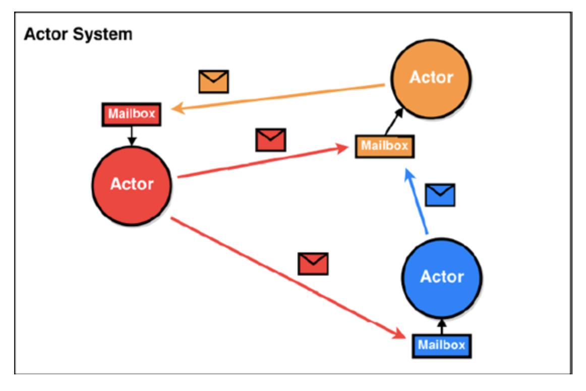
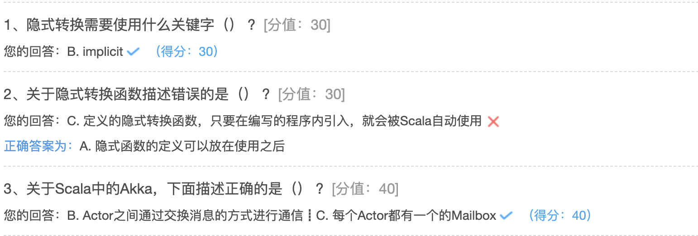

## 隐式机制及Akka

### 隐式转换

隐式转换和隐式参数时Scala中两个非常强大的功能，利用隐式转换和隐式参数，可以提供类库，对类库的使用者隐匿掉具体细节。

Scala会根据隐式转化函数的签名，在程序中使用隐式转换函数接收的参数类型定义的对象时，会自动将其传入隐式转换函数，转换为另一种类型的对象并返回，这就是隐式转换

* 首先有一个隐式转换函数
* 使用到隐式转换函数接收的参数类型定义的对象
* Scala自动传入隐式转换函数，并完成对象的类型转换

隐式转换需要使用implicit关键字。

使用Scala隐式转化有一定的限制：

* implicit关键字只能用来修饰方法、变量、参数
* 隐式转换的函数只在当前范围内才有效。如果隐式转换不在当前范围内定义，那么必须通过import语句将其导入

Spark源码中有大量的隐式转换和隐式参数，因此必须掌握

### 隐式转换函数

Scala的隐式转换最核心的就是定义隐式转换函数，即 implicit conversion function。

定义隐式转换函数，只要在编写程序内引入，就会被Scala自动使用。

隐式转换函数有Scala自动调用，通常建议将隐式函数命名问one2one的形式

示例一：

```scala
package hhb.cn.part10

class Num{}

class RichNum(num: Num) {
  def rich(): Unit = {
    println("============")
  }
}

/**
 * 自定义了一个伴生对象，生成一个apply方法
 */
object RichNum {
  def apply(num: Num): RichNum = {
    new RichNum(num)
  }
}

object ImplicitDemo {
  //定义一个隐式转换函数，命名要符合one2one的命名格式
  implicit def num2RichNum(num: Num): RichNum = {
    RichNum(num)
  }


  def main(args: Array[String]): Unit = {

    val num = new Num
    //num类型并没有rich方法，但是Scala编译器会查找当前范围内的隐式转换函数，
    //然后将其转换成RichNum类型，最终调用rich方法
    num.rich()
  }
}
```

示例二：导入隐式函数

```scala
package hhb.cn.part10

object IntToStringImplicit {

  implicit def int2String(num: Int): String = {
    num.toString
  }
}
```

下面代码中调用了String类型的length方法，Int类型本身没有length方法，但是在可用范围内定义了可以把Int转换为String的隐式函数int2String，因此函数编译通过并运行出正确的结果。

此示例中隐式函数的定义必须定义在使用之前，否则编译报错。

```scala
package hhb.cn.part10

import hhb.cn.part10.IntToStringImplicit.int2String

object ImplicitDemoTwo {

  def main(args: Array[String]): Unit = {
    val num = 10
    println(num.length)
  }
}
```

通过hhb.cn.part10.IntToStringImplicit.int2String，将Int2StringTest内部的成员导入到相应的作用域内，否则无法调用隐式函数。

要实现隐式转换，只要在程序可见的范围内定义隐式转换函数即可，Scala会自动使用隐式转换函数。隐式转换函数与普通函数的语法区别就是，要以implicit开头，而且最好要定义函数返回类型。

隐式转换案例：特殊售票窗口（只接受特殊人群买票，比如学生、老人等），其他人不能在特殊售票窗口买票。

```scala
package hhb.cn.part10


class SpecialPerson(var name: String)

class Older(var name: String)

class Worker(var name: String)

class Student(var name: String)

object ImplicitDemoThree {


  def SpecialBuyTick(specialPerson: SpecialPerson) = {
    if (specialPerson != null)
      println(specialPerson.name + " 购买了特殊票")
    else
      println("不能买")
  }

  //定义一个隐式转换函数
  implicit def anyToSpecial(any: Any): SpecialPerson = {
    any match {
      case any: Older => new SpecialPerson(any.asInstanceOf[Older].name)
      case any: Student => new SpecialPerson(any.asInstanceOf[Student].name)
      case _ => null
    }
  }

  def main(args: Array[String]): Unit = {
    val older = new Older("older")
    val student = new Student("student")
    val worker = new Worker("worker")

    SpecialBuyTick(older)
    SpecialBuyTick(student)
    SpecialBuyTick(worker)
  }
}
```

### 隐式参数和隐式值

在函数定义的时候，支持在最后一组参数中使用implicit，表明这是一组隐式参数，在调用该函数的时候，可以不用传递隐式参数，而编译器会自动寻找一个 implicit 标记过的合适的值作为参数

Scala编译器会在两个范围内查找：

* 当前作用域内可见的val或者var定义隐式变量
* 隐式参数类型的伴生对象内隐式值

```scala
object Doubly {
  //在print函数中定义一个隐式参数fmt
  def print(num: Double)(implicit fmt: String): Unit = {
    println(fmt format (num))
  }
  def main(args: Array[String]): Unit = {
    //此时调用print函数需要为第二个隐式参数赋值
    print(3.12)("%.1f")

    //定义一个隐式变量
    implicit val printFmt="%.3f"
    //当调用print函数时没有给第二个隐式参数赋值，
    //那么Scala会在当前作用域内寻找可见的val或var定义的隐式变量，一旦找到就会应用
    print(3.12)
  }
}
```

### 类型参数

Scala类型参数与Java的泛型是一样的，可以在集合、类、函数中定义类型参数，从而保证程序更好的健壮性。

#### 泛型类

泛型类，顾名思义，其实就是在类的声明中定义一些泛型类型，然后在类内部的字段或方法。就可以使用这些泛型类型。

使用泛型类，通常是需要对类中的某些成员变量，比如某个字段和方法中的参数或变量进行统一的类型限制，这样可以保证程序更好的健壮性和稳定性。

如果不使用泛型进行统一的类型限制，那么在后期程序运行过程中难免会出现问题，比如传入了不希望的类型导致程序出问题。

在使用泛型类的时候，比如创建泛型类的对象，只需将类型参数替换成时间的畸形即可。

Scala自动推断泛型类型特效，直接给使用泛型的字段赋值时，Scala会自动进行类型推断

泛型类的定义如下：

```scala
//定义一个泛型类
class Spark[T1, T2, T3](n: T1) {
  var name: T1 = n
  var age: T2 = _
  var address: T3 = _

  def getInfo(): Unit = {
    println(s"$name,$age,$address")
  }
}
```

使用上述的泛型类，只需要使用具体的类型代替类型参数即可。

```scala
object GenericDemo extends App {

  val spark = new Spark[String, Int, String]("zhangsan")

  spark.getInfo() //zhangsan,null,null
  spark.age = 20
  spark.address = "123"
  spark.getInfo() //zhangsan,20,123
}
```

#### 泛型函数

泛型函数，与泛型类类似，可以给某个函数在声明时指定泛型类型，然后在函数体内，多个变量或者返回值之间，就可以使用泛型类型进行声明，从而对某个特殊的变量，或者多个变量，进行强制性的类型限制。

与泛型类一样，你可以通过给使用了泛型类型的变量传递值来让Scala自动推断泛型的实际类型，也可以在调用函数时，手动指定泛型类型。

**案例：卡片售卖机，可以指定卡片的内容，内容可以是String类型或Int类型**

```scala

object GenericFunc {

  def getCart[T](context: T): Unit = {
    context match {
      case context: Int => s"cart : $context is Int"
      case context: String => s"cart : $context is String"
      case _ => "other"
    }
  }

  def main(args: Array[String]): Unit = {
    println(getCart[String]("12312313"))
    println(getCart(123))
    println(getCart(123.0))

  }

}
```

#### 协变和逆变

Scala的协变和逆变是非常有特色的，完全解决的Java中泛型的一大缺憾

举例来说，Java中，如果Process是Master的子类，那么Cart[Process]却不是Card[Master]的子类。而Scala中，只要灵活的使用协变和逆变就可以解决Java泛型的问题。

**协变定义形式如：trait List[+T]{}**

当类型s是类型A的子类型时，则List[s]也可以认为是List[A]的子类，即List[S]可以泛化List[A],也就是被参数化，类型的泛化方向与参数类型一致，所以被称为协变（covariance）。

 **逆变定义形式如：trait List[-T] {}**

与协变定义相反，类型的泛化方向与参数方向相反，被称为逆变（contravariance），当类型S是类型A的子类型时，则List[A]也可以认为是List[S]的子类

小结：如果A是B的子类，那么在协变中，List[A]就是List[B]的子类，在逆变中，List[A]就是List[B]的父类

```scala
package hhb.cn.part11

//大师
class Master

//专家
class Process extends Master

//讲师
class Teacher

//这是一个协变，Process是Master的子类，那么Card[Process] 也是 Card[Master] 的子类
class Card[+T]

class Card2[-T]


object CovarianceDemo {
  //表示只有Card[Master]以及Card[Master]的子类Card[Process]才能进入
  def enterMeet(card: Card[Master]): Unit = {
    println("进入")
  }

  //表示只有Card[Master]以及Card[Master]的子类Card[Process]才能进入
  def enterMeet2(card: Card2[Process]): Unit = {
    println("进入")
  }

  def main(args: Array[String]): Unit = {
    val master = new Card[Master]
    val process = new Card[Process]
    val teacher = new Card[Teacher]
    enterMeet(master)
    enterMeet(process)
    //直接报错
    //enterMeet(teacher)
    val master2 = new Card2[Master]
    val process2 = new Card2[Process]
    val teacher2 = new Card2[Teacher]
    enterMeet2(master2)
    enterMeet2(process2)
    //直接报错
    //enterMeet(teacher2)
  }
}
```

### Akka

Akka是Java虚拟机平台上构建高并发、分布式和容错应用的工具包和运行时。是使用Scala语言编写，同时提供了Scala和Java开发的接口。Akka处理并发的方法基于Actor模型，Actor之间通信的唯一机制就是消息传递。

#### Actor

Scala的Actor类似与Java 中的多线程，但是不同的是，Scala的Actor提供的模型与多线程不同，Actor尽可能的避免锁和共享状态，从而避免多线程并发时出现资源争用的情况，进而提升多线程编程的性能。

Actor可以看作一个个独立的实体，Actor之间可以通过交换消息的方式进行通信，每个Actor都有自己的收件箱（MailBox）。一个Actor收到其他Actor的信息后，根据需要作出各种响应，消息的类型可以是任意的，消息的内容也可以是任意的。



#### ActorSystem

在Akka中，ActorSystem是一个重量级结构。他需要分配多个线程，所以在实际应用中，ActorSystem通常是一个单例对象，我们可以使用ActorSystem创建很多Actor。


**Akka案例**：

创建一个maven项目，在项目的pom文件中增加如下依赖：

```xml
<?xml version="1.0" encoding="UTF-8"?>
<project xmlns="http://maven.apache.org/POM/4.0.0"
         xmlns:xsi="http://www.w3.org/2001/XMLSchema-instance"
         xsi:schemaLocation="http://maven.apache.org/POM/4.0.0 http://maven.apache.org/xsd/maven-4.0.0.xsd">
  <modelVersion>4.0.0</modelVersion>

  <groupId>ScalaMavenPro</groupId>
  <artifactId>ScalaMavenPro</artifactId>
  <version>1.0-SNAPSHOT</version>
  <!-- 定义一下常量-->
  <properties>
    <encoding>UTF-8</encoding>
    <scala.version>2.13.3</scala.version>
  </properties>

  <dependencies>
    <!-- 添加akka的actor依赖 -->
    <dependency>
      <groupId>org.scala-lang</groupId>
      <artifactId>scala-actors</artifactId>
      <version>2.11.12</version>
    </dependency>
    <!-- https://mvnrepository.com/artifact/com.typesafe.akka/akka-actor -->
    <dependency>
      <groupId>com.typesafe.akka</groupId>
      <artifactId>akka-actor_2.13</artifactId>
      <version>2.6.8</version>
    </dependency>
    <!-- 多进程之间的Actor通信 -->
    <dependency>
      <groupId>com.typesafe.akka</groupId>
      <artifactId>akka-remote_2.13</artifactId>
      <version>2.6.8</version>
    </dependency>
  </dependencies>
</project>
```

```scala
import akka.actor.{Actor, ActorRef, ActorSystem, Props}

import scala.io.StdIn

class Message extends Actor {
  override def receive: Receive = {
    case "您好" => println("你好呀！")
    case "干什么呢" => println("没干啥")
    case "拜拜" => {
      //关闭自己
      context.stop(self)
      //关闭SystemActor
      context.system.terminate()
    }
  }
}


object ActorDemo {

  def main(args: Array[String]): Unit = {
    val myActorSystem = ActorSystem("myActorSystem")

    val messageActorRef: ActorRef = myActorSystem.actorOf(Props[Message], "message")
    var flag = true
    while (flag) {
      print("请输入想发送的消息:")
      val str = StdIn.readLine()
      messageActorRef ! str
      if (str.equals("拜拜")) {
        flag = false
      }
      Thread.sleep(100)
    }
  }
}
```

