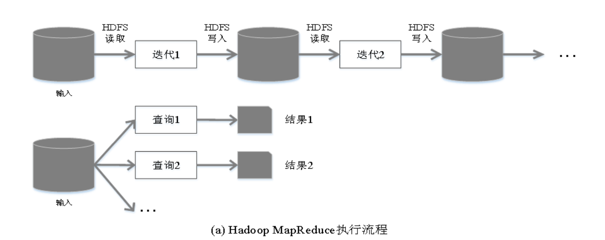
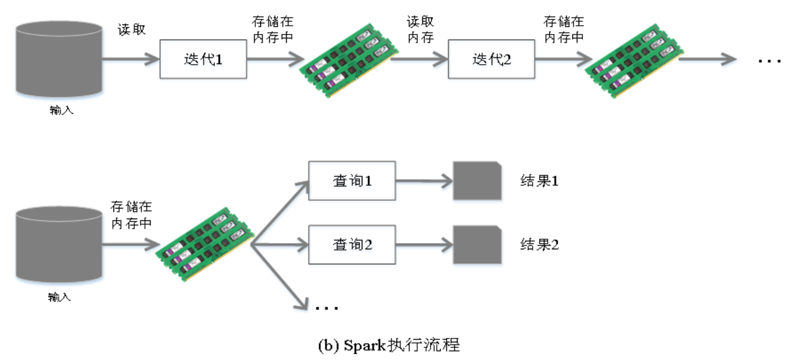
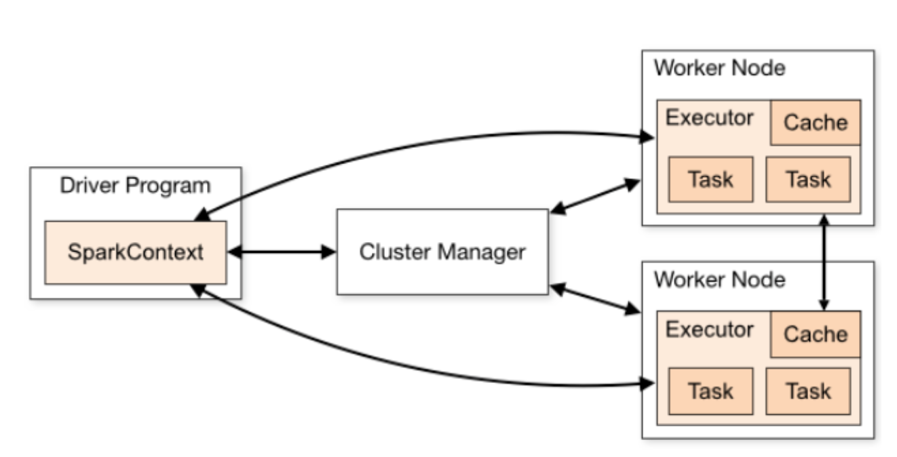
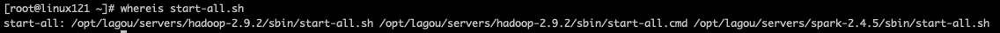
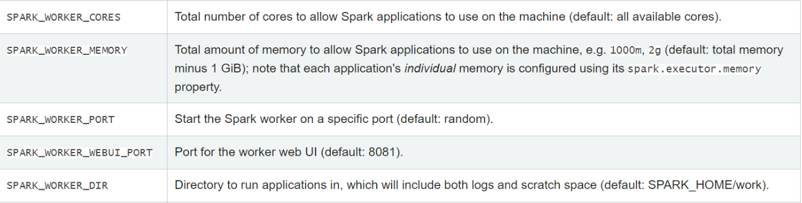
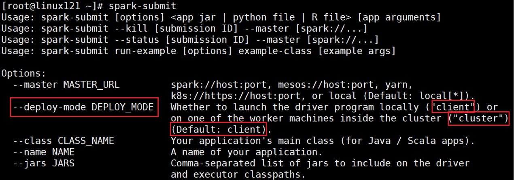
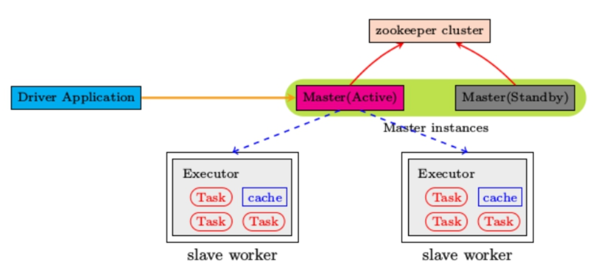
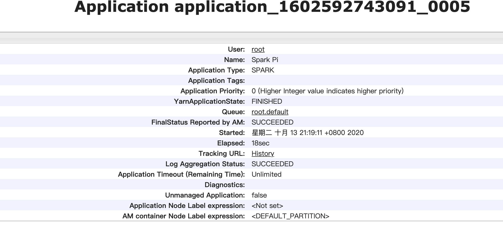
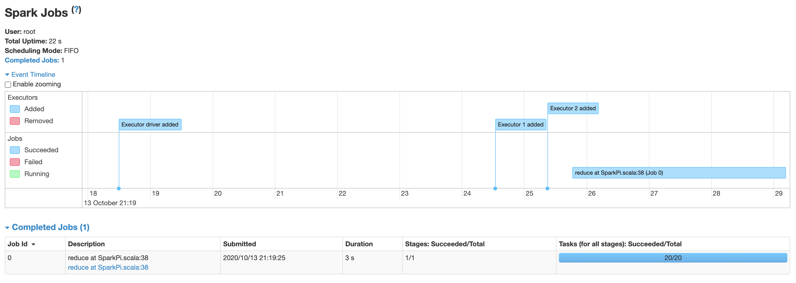

## 前言

内容：

```
Spark Core -- 离线处理
Spark SQL -- 离线处理、交互
Spark Streaming -- 实时
Spark Graphx -- 图处理
Spark原理
```

MapReduce、Spark、Flink（实时）=> 3代计算引擎，昨天、今天、未来

MapReduce、Spark：类MR引擎，底层原理非常相似，数据分区、MapTask、ReduceTask、Shuffle


## Spark Core

### Spark概述

#### 什么是Spark

[官网](http://spark.apache.org/)

Spark是一个快速、通用的计算引擎，特点：

* 速度快

  与MR相比，Spark基于内存的运算要快100倍，基于硬盘的运算也要快10倍以上，Spark实现了高效的DAG执行引擎，可以通过基于内存来高效处理数据

* 使用简单

  支持多种语言，支持超过80中高级算法，还支持交互式的Python和Scala的shell，可以方便的在这些shell中使用Spark集群来验证解决问题

* 通用

  SparK提供了统一的解决方案，Spark可以用于批处理、交互式查询（Spark SQL）实时流处理（Spark Streaming）、机器学习（Spark MLib）和图计算（Graphx）。

* 兼容好

  可以非常方便的与其他开源产品进行融合，可以使用YARN、Mesos作为他的资源管理和调度，可以处理所以Hadoop支持的数据等。Spark也可以不依赖第三方资源管理和调度器，它实现了Standalone作为内置的资源管理和调度框架

#### Spark与Hadoop

从狭义的角度上看：Hadoop是分布式框架。有存储、计算、资源调度三个部分组成

Spark是一个分布式计算引擎，由Scala语言编写的计算框架，基于内存的快速、通用、可扩展的大数据分析引擎

从广义上来看，Spark是Hadoop生态不可或缺的一部分


MapReduce的不足：

* 表达能力有限
* 磁盘IO开销大
* 延迟高
  * 任务之间衔接由IO开销
  * 前一个任务未完成，后一个任务无法开始，难以胜任复杂的、多阶段的计算任务





Spark在借鉴的MR的优点的同时，很好的解决了MR面临的问题

| MR                                                   | Spark                                                      |
| ---------------------------------------------------- | ---------------------------------------------------------- |
| 数据存储结构：磁盘HDFS文件系统的Split                | 使用内存构建弹性分布式数据集RDD对数据进行运算和cache       |
| 编程范式：Map+Reduce仅提供两个操作，表达力欠缺       | 提供了丰富的操作，是数据处理逻辑的代码非常简短             |
| 计算中间结果需要落到磁盘，IO及序列化、反序列化代价大 | 计算中间结果在内存中，维护存取速度比磁盘高几个数量级       |
| Task以进程的方式维护，需要数秒时间才能启动           | Task以线程的方式维护，对于小数据集读取能够达到亚秒级的延迟 |

备注：Spark计算模式也属于MR，Spark是对MR框架的优化


在实际应用中，大数据应用有以下三种类型

* 批量处理（离线处理）：通常时间跨度在数十分钟到数小时之间
* 交互式处理：通常时间跨度在数十秒到十分钟之间
* 流处理（实时处理）：通常时间跨度在数百毫秒到数秒之间

当同时存在以上三种情况的时候，Hadoop框架需要同时部署多种不同的软件：MR/Hive或Impala/Storm。这样做难免会带来一些问题：

* 不同场景之间输入输出数据无法做到无缝共享，通常需要进行数据转换
* 不同软件需要不同的开发和维护团队，带来较高的使用成本
* 比较难以对同一个集群中的各个系统进行统一的资源协调和分配

Spark所提供的生态系统足以解决上述三种场景，即同时支持批处理、交互式查询和流数据处理

* Spark的设计遵循“一个软件栈满足不同的应用场景”的理念（all in one），逐渐形成了一套完整的生态系统。
* 即能够在提供内存计算框架，也可以支持SQL即席查询、实时流式计算、机器学习和图计算
* Spark可以部署在资源管理器YARN之上，提供一站式的大数据解决方案。

Spark为什么比MR快

1. **Spark积极使用内存**。MR框架中的一个Job只能拥有一个MapTask任务和一个ReduceTask任务，如果业务复杂，一个Job就表达不出来，需要多个Job组合起来，然后前一个Job需要写到HDFS中，才能交给后面的Job，在MR中，这样的运算涉及到多次写入和读取操作，Spark框架则可以把多个MapTask和ReduceTask组合在一起连续执行，中间的计算结果不需要落地

   复杂的MR任务：mr + mr + mr+mr ....

   复杂的Spark任务： mr -> mr -> mr ....

2. **多进程模型（MR）vs多线程模型（Spark）**，MR框架中的MapTask和ReduceTask是进程级别的，都是JVM进程，每次启动都需要重新申请资源消耗了不必要的时间，而SparkTask是基于线程模型，通过复用线程池的线程来减少启动、关闭Task所需要的系统开销

#### 系统架构

Spark 运行架构包括：

* Cluster Manager：是集群资源的管理者。Spark支持3种集群模式（Standalone、Yarn、Mesos）
* Worker Node：工作节点，管理本地资源
* Driver Program：运行应用的main()方法并且创建了SparkContext。由ClusterManager分配资源，SparkContext发送Task到Executor上执行
* Executor：在工作节点上运行，执行Driver发送的Task，并向Dirver汇报计算结果



#### Spark集群部署模式

Spark支持3种不是模式：Standalone、Yarn、Mesos

###### Standalone模式

* 独立模式，自带完整的服务，可单独部署到一个集群中，无需依赖任何其他资源管理系统，从一定程度上说，该模式是其他两种的基础
* Cluster Manager：Master
* Worker Node：Worker
* 仅支持粗粒度的资源分配方式

###### Spark on Yarn 模式

* Yarn拥有强大的社区支持，且逐步已经成为大数据集群资源管理系统的标准
* 在国内生产环境运用最广泛的部署模式
* Spark on Yarn的支持两种模式
  * Yarn-Cluster：适用于生产环境
  * Yarn-Client：适用于交互、调试，希望立即看到App的输出
* Cluster Manager：ResourceManager
* Worker Node：NodeManager
* 仅支持粗粒度的资源分配方式

###### Spark in Mesos模式

* 官方推荐的模式。
* 运行在Mesos比运行在Yarn上更灵活、更自然
* Cluster Manager：Mesos Master
* Worker Node：Mesos Slave
* 支持粗粒度、细粒度的资源分配方式

###### 总结

**粗粒度模式（Coarse-grained Mode）**：每个应用程序的运行环境由一个Driver和多个Executor组成，每个Executor占用若干资源，内部可运行多个Task。**程序正式运行之前，需要将所有的资源申请好，且运行的工程中一直占有，即使不使用，也是等到任务结束在回收资源**

**细粒度模式（Fine-grained Mode）**：鉴于粗粒度模式会造成大量资源浪费，Spark On Mesos还提供了另外一种调度模式：细粒度模式，这种模式类似于现在的云计算，核心思想就是按需分配。


三种集群部署模式如何选择：

* 生产环境选择Yarn，国内使用最广的模式
* Spark的初学者，Standalone，简单
* 开发测试环境，可选择Standalone
* 数据量不会太大、应用不是太复杂，建议可以从Standalone模式开始
* mesos不会设计

#### 相关术语

[官方文档](http://spark.apache.org/docs/latest/cluster-overview.html)

* Application

  用户提交的Spark应用程序，由集群中的一个Driver和许多executor组成

* Application Jar

  一个包含Spark应用程序的Jar，Jar不应该包含Spark或Hadoop的jar，这些jar应该在运行中添加

* Driver Program

  运行应用程序的main()，并创建SparkContext（Spark应用程序）

* Cluster Manager

  管理集群资源的服务，如Standalone，Mesos，Yarn

* Deploy Mode

  区分Driver进程在何处运行，在Cluster模式下，在集群内部运行Driver。在Client模式下，Driver在集群外部运行。

* Worker node

  运行应用程序的工作节点

* Executor

  运行应用程序Task和保存数据，每个应用程序都有自己的Executors，并且各个executor相互独立

* Task

  Executors应用程序的最小运行单元

* Job

  在用户程序中，每次调用Action函数都会产生一个新的Job，也就是说，每个Action会生成一个Job

* Stage

  一个Job会被分解成多个Stage，每个Stage是一系列的Task集合

### Spark安装配置

#### Spark安装

[官网地址](http://spark.apache.org/)

[文档地址](http://spark.apache.org/docs/latest/)

[下载地址](http://spark.apache.org/downloads.html)

[下载Spark安装包](https://archive.apache.org/dist/spark/)

###### 安装步骤

1、下载后解压缩

```shell
cd /opt/lagou/software/
tar zxvf spark-2.4.5-bin-without-hadoop-scala-2.12.tgz
mv spark-2.4.5-bin-without-hadoop-scala-2.12/ ../servers/spark- 2.4.5/
```

2、设置环境变量，并使其生效

```shell
vi /etc/profile
export SPARK_HOME=/opt/lagou/servers/spark-2.4.5
export PATH=$PATH:$SPARK_HOME/bin:$SPARK_HOME/sbin
source /etc/profile
```

3、修改配置

文件位置:$SPARK_HOME/conf，赋值需要的文件

```shell
cp slaves.template slaves
cp spark-defaults.conf.template spark-defaults.conf
cp spark-env.sh.template spark-env.sh
cp log4j.properties.template log4j.properties
```

修改slaves

```properties
linux121
linux122
linux123
```

vim spark-defaults.conf

```properties
#Spark的master节点的地址和端口号
spark.master                     spark://linux121:7077
#是否做日志的聚合
spark.eventLog.enabled           true
#聚合日志在HDFS的目录，如果放在HDFS需要启动HDFS，并提前创建好目录spark-eventlog
spark.eventLog.dir               hdfs://linux121:9000/spark-eventlog
# 序列化方式
spark.serializer                 org.apache.spark.serializer.KryoSerializer
# Driver内存，默认是1G
spark.driver.memory              512m
```

修改spark-env.sh

```properties
export JAVA_HOME=/opt/lagou/servers/jdk1.8.0_231
export HADOOP_HOME=/opt/lagou/servers/hadoop-2.9.2
export HADOOP_CONF_DIR=/opt/lagou/servers/hadoop-2.9.2/etc/hadoop
#这里使用的是 spark-2.4.5-bin-without-hadoop，所以要将 Hadoop 相关 jars 的位置告诉Spark
export SPARK_DIST_CLASSPATH=$(/opt/lagou/servers/hadoop-2.9.2/bin/hadoop classpath)
export SPARK_MASTER_HOST=linux121
export SPARK_MASTER_PORT=7077
```

4、将Spark分发到其他两个机器，并修改环境变量，让环境变量生效

```shell
rsync-script spark-2.4.5
```

5、启动集群

```shell
cd $SPARK_HOME/sbin
./start-all.sh
```

分别在linux121、linux122、linux123上执行 jps，可以发现: 

linux121:Master、Worker

linux122:Worker

linux123:Worker

此时 Spark 运行在 Standalone 模式下。

在浏览器中输入:http://linux121:8080/


备注:在$HADOOP_HOME/sbin 及 $SPARK_HOME/sbin 下都有 start-all.sh 和 stop-all.sh 文件



此时直接执行start-all或stop-all的时候，回直接先执行hadoop的start-all,有冲突

解决方案：

* 删除一组start-all/stop-all命令，让另一个生效
* 对其中一组重命名
* 将其中一个的sbin目录不放到path中

6、集群测试

```shell
# 计算派：3.14……
run-example SparkPi 10 
# 启动shell脚本
spark-shell

#读取HDFS 文件，并进行单词统计
val lines = sc.textFile("/azkaban-wc/wc.txt")
lines.flatMap(_.split(" ")).map((_, 1)).reduceByKey(_+_).collect().foreach(println)
```

Spark不是一定要依赖HDFS的，只有用到了HDFS，才需要HDFS


Apache Spark支持多种部署模式。最简单的就是单机本地模式(Spark所有进程都运 行在一台机器的JVM中)、伪分布式模式(在一台机器中模拟集群运行，相关的进程 在同一台机器上)。分布式模式包括:Standalone、Yarn、Mesos。

Apache Spark支持多种部署模式:

* 本地模式。最简单的运行模式，Spark所有进程都运行在一台机器的 JVM 中
* 伪分布式模式。在一台机器中模拟集群运行，相关的进程在同一台机器上(用的 非常少)
* 分布式模式。包括:Standalone、Yarn、Mesos
  * Standalone。使用Spark自带的资源调度框架 
  * Yarn。使用 Yarn 资源调度框架 
  * Mesos。使用 Mesos 资源调度框架

#### 本地模式

部署在单机，主要用于测试或实验，最简单的运行模式，所有的进程都运行在一个JVM中。本地模式用单机的多个线程来模拟Spark分布式计算，通常用来验证开发出来的应用程序逻辑上又饿密友问题，这种模式非常简单，只需要包Spark安装包解压，修改一些常用配置即可，不用启动Master、Worker守护进程，也不用启动HDFS，除非用到。

* Spark-shell --master local：在本地启动一个线程来运行作业
* spark-shell --master local[N]:启动N个线程
* spark-shell --master local[*]:使用系统所有的核
* spark-shell --master local[N,M]:N:代表启动的核数，M代表容许作业失败的次数

前面几种模式没有指定M，默认是为1

测试：

1、启动 Spark 本地运行模式,此时JPS后只有一个SparkSubmit进程

```
spark-shell --master local
```

2、 测试

```shell
#读取本地文件，懒加载，如果文件不存在，此时不会报错，等到真正使用的时候才会报错
val lines = sc.textFile("file:///root/mess.txt")
# 计算行数
lines.count
```

备注：如果不需要使用HDFS，可以将 spark-defaults.conf相关的日志聚合部分注释

#### 伪分布式模式

伪分布式模式:在一台机器中模拟集群运行，相关的进程在同一台机器上; 

备注:不用启动集群资源管理服务;

* local-cluster[N,cores,memory]
  * N模拟集群的 Slave(或worker)节点个数 
  * cores模拟集群中各个Slave节点上的内核数 
  * memory模拟集群的各个Slave节点上的内存大小

备注:参数之间没有空格，memory不能加单位 

1、启动 Spark 伪分布式模式

```shell
spark-shell --master local-cluster[4,2,1024]
```

2、使用 jps 检查，发现1个 SparkSubmit 进程和4个 CoarseGrainedExecutorBackend 进程SparkSubmit依然充当全能角色，又是Client进程，又是Driver程序，还有资源管理 的作用。4个CoarseGrainedExecutorBackend，用来并发执行程序的进程。

3、执行简单的测试程序

```shell
park-submit --master local-cluster[4,2,1024] --class org.apache.spark.examples.SparkPi $SPARK_HOME/examples/jars/spark-examples_2.11-2.4.5.jar 10
```

备注:

* local-cluster[4,2,1024]，参数不要给太大，资源不够 
* 这种模式少用，有Bug。SPARK-32236

#### 集群模式-Standalone模式

[参考文档](http://spark.apache.org/docs/latest/spark-standalone.html)

* 分布式部署才能提现分布式计算的价值
* 与单机运行模式不同，这里必须先启动Spark的Master和Worker守护进程，关闭Yarn
* 不用启动Hadoop服务，除非需要


###### Standalone配置

* sbin/start-master.sh / sbin/stop-master.sh 启动关闭master节点
* sbin/start-slaves.sh / sbin/stop-slave.sh  启动关闭当前服务器的worker节点
* sbin/start-slave.sh / sbin/stop-slaves.sh  启动关闭所有服务器的worker节点
* sbin/start-all.sh / sbin/stop-all.sh 启动关闭所有的master和worker节点

备注:./sbin/start-slave.sh [options];启动节点上的worker进程，调试中较为常用

在 spark-env.sh 中定义:



**SPARK_WORKER_CORES**:Total number of cores to allow Spark applications to use on the machine (default: all available cores).

**SPARK_WORKER_MEMORY**:Total amount of memory to allow Spark applications to use on the machine, e.g. 1000m , 2g (default: total memory minus 1 GiB); note that each application's *individual* memory is configured using its spark.executor.memory property.

可以在spark-eh.sh中修改改参数

```properties
export SPARK_WORKER_CORES=10
export SPARK_WORKER_MEMORY=20g
```

###### 运行模式

最大的区别：Driver运行在哪里。

* client模式：（缺省，默认的），Driver提交任务给Client，此时可以在Client模式下，可以看见返回结果，适合交互和调试
* Cluster模式：Driver运行在Spark集群中，看不见程序的返回结果（可以在Driver运行所在的节点的work目录下看到），适合生产环境



测试1（Client模式）

```shell
spark-submit --class org.apache.spark.examples.SparkPi \
/opt/lagou/servers/spark-2.4.5/examples/jars/spark-examples_2.12-2.4.5.jar 5000
```

再次使用jps检查集群中的进程：

* Master进程作为cluster manager，管理集群资源
* Worker管理节点资源
* SparkSubmit最为Client段，不再Spark集群中，运行Driver程序，SparkApplication执行完成，进程终止
* CoarseGrainedExecutorBackend运行在Worker上，用来并发执行应用程序

测试2（Cluster模式）

```shell
spark-submit --class org.apache.spark.examples.SparkPi \
--deploy-mode cluster \
/opt/lagou/servers/spark-2.4.5/examples/jars/spark-examples_2.12-2.4.5.jar 5000
```

* SparkSubmit进程会在应用程序提交给集群之后就退出
* Master会在集群中选择一个Worker进程生成一个子进程DriverWrapper来启动Driver程序
* Worker节点上会启动CoarseGrainedExecutorBackend
* DriverWrapper进程会被占用Worker进程的一个core（缺省分配1C1G）
* 应用程序结果，会在执行Driver程序的节点的stdout输出，而不是打印在屏幕上

在启动 DriverWrapper 的节点上，进入 $SPARK_HOME/work/，可以看见类似 driver-20200810233021-0000 的目录，这个就是 driver 运行时的日志文件，进入 该目录，会发现:

* jar 文件，这就是移动的计算 
* stderr 运行日志

* stdout 输出结果

###### History Server

修改spark-defaults.conf

```properties
spark.eventLog.compress     true
```

修改 spark-env.sh

```properties
export SPARK_HISTORY_OPTS="-Dspark.history.ui.port=18080 -Dspark.history.retainedApplications=50 -Dspark.history.fs.logDirectory=hdfs://linux121:9000/spark-eventlog"
```

spark.history.retainedApplications。设置缓存Cache中保存的应用程序历史记录的 个数(默认50)，如果超过这个值，旧的将被删除;缓存文件数不表示实际显示的文件总数，只是表示不再缓存中的文件可能需要从硬盘中读取，速度有差别


前提条件：启动hdfs（日志需要写入到HDFS）

启动historyserver，使用 jps 检查，可以看见 HistoryServer 进程。如果看见该进程，请检查对应的日志。

```shell
$SPARK_HOME/sbin/start-history-server.sh
```

web端地址:http://hhb:18080/

###### 高可用配置

Spark Standalone集群是 Master-Slaves架构的集群模式，和大部分的Master- Slaves结构集群一样，存着Master单点故障的问题。如何解决这个问题，Spark提供 了两种方案:

1、**基于ZK的Standby Master**，适用于生产模式。将 Spark 集群连接到 Zookeeper，利用 Zookeeper 提供的选举和状态保存的功能，一个 Master 处于 Active 状态，其他 Master 处于Standby状态;保证在ZK中的元数据主要是集群的信息，包括:Worker，Driver和Application以及 Executors的信息;如果Active的Master挂掉了，通过选举产生新的 Active 的 Master，然后执行状态恢 复，整个恢复过程可能需要1~2分钟;

2、**基于文件系统的单点恢复**（Single-Node Rcovery with Local File System)， 主要用于开发或者测试环境。将 Spark Application 和 Worker 的注册信息保存在文 件中，一旦Master发生故障，就可以重新启动Master进程，将系统恢复到之前的状态



配置步骤

1、启动ZK

2、修改 spark-env.sh 文件，并分发到集群中

```properties
# 注释以下两行!!!
# export SPARK_MASTER_HOST=linux120
# export SPARK_MASTER_PORT=7077

export SPARK_DAEMON_JAVA_OPTS="-Dspark.deploy.recoveryMode=ZOOKEEPER -Dspark.deploy.zookeeper.url=linux121,linux122,linux123 -Dspark.deploy.zookeeper.dir=/spark"
```

备注：

* spark.deploy.recoveryMode:可选值 Zookeeper、FileSystem、None 
* deploy.zookeeper.url:Zookeeper的URL，主机名:端口号(缺省2181) 
* deploy.zookeeper.dir:保存集群元数据信息的地址，在ZooKeeper中保存该信 息

3、启动Spark集群（Linux120）

```shell
$SPARK_HOME/sbin/start-all.sh
```

浏览器输入:http://hhb:8080/，刚开始 Master 的状态是STANDBY，稍等一会 变为:RECOVERING，最终是:ALIVE

4、在 linux121上启动master

```properties
$SPARK_HOME/sbin/start-master.sh
```

进入浏览器输入:http://linux122:8080/，此时 Master 的状态为:STANDBY

5、杀到linux120上 Master 进程，再观察 linux121 上 Master 状态，由 STANDBY => RECOVERING => ALIVE


小结：

* 配置每个worker的core、memory
* 运行模式：cluster、client，client为缺省模式，有返回结果，适合调试；cluster与此相反
* History server
* 高可用（ZK，Local File，在ZK中记录集群状态）

#### 集群模式-Yarn模式

[参考官方文档](http://spark.apache.org/docs/latest/running-on-yarn.html)

需要启动的服务:hdfs服务、yarn服务,需要关闭的Standalone对应的服务（即集群中Master、Worker进程）一山不容二虎


在Yarn模式中，Spark应用程序有两种运行模式

* yarn-client。Driver程序运行在客户端，适用于交互、调试，希望立即看到app 的输出

* yarn-cluster。Driver程序运行在由RM启动的 AppMaster中，适用于生产环境

二者的主要区别:Driver在哪里

1、关闭 Standalon 模式下对应的服务;开启 hdfs、yarn、historyserver 服务

2、修改 yarn-site.xml 配置。在 $HADOOP_HOME/etc/hadoop/yarn-site.xml 中增加，分发到集群，重启 yarn服务

```xml
<property>
    <name>yarn.nodemanager.pmem-check-enabled</name>
    <value>false</value>
</property>
<property>
    <name>yarn.nodemanager.vmem-check-enabled</name>
    <value>false</value>
</property>
```

备注：

* yarn.nodemanager.pmem-check-enabled。是否启动一个线程检查每个任务 正使用的物理内存量，如果任务超出分配值，则直接将其杀掉，默认是true 
* yarn.nodemanager.vmem-check-enabled。是否启动一个线程检查每个任务正 使用的虚拟内存量，如果任务超出分配值，则直接将其杀掉，默认是true

3、修改配置，分发到集群

```properties
# spark-default.conf(以下是优化)
# 与 hadoop historyserver集成 
spark.yarn.historyServer.address linux120:18080
# 添加(以下是优化)
spark.yarn.jars hdfs:///spark-yarn/jars/*.jar
```

上传jar包

```shell
# 将 $SPARK_HOME/jars 下的jar包上传到hdfs 
hdfs dfs -mkdir -p /spark-yarn/jars/ 
cd $SPARK_HOME/jars
hdfs dfs -put * /spark-yarn/jars/
```

4、测试

```shell
# client
spark-submit --master yarn \
--deploy-mode client \
--class org.apache.spark.examples.SparkPi \
/opt/lagou/servers/spark-2.4.5/examples/jars/spark-examples_2.12-2.4.5.jar 2000
```

在提取App节点上可以看见:SparkSubmit、CoarseGrainedExecutorBackend

在集群的其他节点上可以看见:CoarseGrainedExecutorBackend 

在提取App节点上可以看见:程序计算的结果(即可以看见计算返回的结果)

```shell
# cluster
spark-submit --master yarn \
--deploy-mode cluster \
--class org.apache.spark.examples.SparkPi \
/opt/lagou/servers/spark-2.4.5/examples/jars/spark-examples_2.12-2.4.5.jar 2000
```

在提取App节点上可以看见:SparkSubmit 

在集群的其他节点上可以见:CoarseGrainedExecutorBackend、ApplicationMaster(Driver运行在此) 

在提取App节点上看不见最终的结果

###### 整合HistoryServer服务

前提:Hadoop的 HDFS、Yarn、HistoryServer 正常;Spark historyserver服务正常; 

Hadoop:JobHistoryServer 

Spark:HistoryServer

```shell
spark-submit \
--class org.apache.spark.examples.SparkPi \
--master yarn \
--deploy-mode client \
/opt/lagou/servers/spark-2.4.5/examples/jars/spark-examples_2.12-2.4.5.jar 20
```





1、修改 spark-defaults.conf，并分发到集群

```properties
spark.yarn.historyServer.address linux121:18080
spark.history.ui.port 18080
```

2、重启/启动 spark 历史服务

```shell
stop-history-server.sh
start-history-server.sh
```

3、查看日志

打开日志http://linux123:8088/cluster

备注：

1、在课程学习的过程中，大多数情况使用Standalone模式 或者 local模式 
2、建议不使用HA;更多关注的Spark开发


#### 开发环境搭建IDEA

前提:安装scala插件;能读写HDFS文件

pom.xml

```xml
<?xml version="1.0" encoding="UTF-8"?>
<project xmlns="http://maven.apache.org/POM/4.0.0"
         xmlns:xsi="http://www.w3.org/2001/XMLSchema-instance"
         xsi:schemaLocation="http://maven.apache.org/POM/4.0.0 http://maven.apache.org/xsd/maven-4.0.0.xsd">
    <parent>
        <artifactId>com.hhb.bigdata</artifactId>
        <groupId>com.hhb.bigdata</groupId>
        <version>1.0</version>
        <relativePath>../bigdata/pom.xml</relativePath>
    </parent>
    <modelVersion>4.0.0</modelVersion>

    <artifactId>spark</artifactId>
    <properties>
        <maven.compiler.source>1.8</maven.compiler.source>
        <maven.compiler.target>1.8</maven.compiler.target>
        <scala.version>2.12.10</scala.version>
        <spark.version>2.4.5</spark.version>
        <hadoop.version>2.9.2</hadoop.version>
        <encoding>UTF-8</encoding>
    </properties>
    <dependencies>
        <dependency>
            <groupId>org.scala-lang</groupId>
            <artifactId>scala-library</artifactId>
            <version>${scala.version}</version>
        </dependency>
        <dependency>
            <groupId>org.apache.spark</groupId>
            <artifactId>spark-core_2.12</artifactId>
            <version>${spark.version}</version>
        </dependency>
        <!-- hadoop -->
        <dependency>
            <groupId>org.apache.hadoop</groupId>
            <artifactId>hadoop-common</artifactId>
            <version>2.9.2</version>
        </dependency>
        <!-- https://mvnrepository.com/artifact/org.apache.hadoop/hadoop-client -->
        <dependency>
            <groupId>org.apache.hadoop</groupId>
            <artifactId>hadoop-client</artifactId>
            <version>2.9.2</version>
        </dependency>
        <!-- https://mvnrepository.com/artifact/org.apache.hadoop/hadoop-hdfs -->
        <dependency>
            <groupId>org.apache.hadoop</groupId>
            <artifactId>hadoop-hdfs</artifactId>
            <version>2.9.2</version>
        </dependency>
        <!-- hive 文件-->
        <dependency>
            <groupId>org.apache.hive</groupId>
            <artifactId>hive-exec</artifactId>
            <version>2.3.7</version>
        </dependency>

    </dependencies>
    <build>
        <pluginManagement>
            <plugins>
                <!-- 编译scala的插件 -->
                <plugin>
                    <groupId>net.alchim31.maven</groupId>
                    <artifactId>scala-maven-plugin</artifactId>
                    <version>3.2.2</version>
                </plugin>
                <!-- 编译java的插件 -->
                <plugin>
                    <groupId>org.apache.maven.plugins</groupId>
                    <artifactId>maven-compiler-plugin</artifactId>
                    <version>3.5.1</version>
                </plugin>
            </plugins>
        </pluginManagement>
        <plugins>
            <plugin>
                <groupId>net.alchim31.maven</groupId>
                <artifactId>scala-maven-plugin</artifactId>
                <executions>
                    <execution>
                        <id>scala-compile-first</id>
                        <phase>process-resources</phase>
                        <goals>
                            <goal>add-source</goal>
                            <goal>compile</goal>
                        </goals>
                    </execution>
                    <execution>
                        <id>scala-test-compile</id>
                        <phase>process-test-resources</phase>
                        <goals>
                            <goal>testCompile</goal>
                        </goals>
                    </execution>
                </executions>
            </plugin>
            <plugin>
                <groupId>org.apache.maven.plugins</groupId>
                <artifactId>maven-compiler-plugin</artifactId>
                <executions>
                    <execution>
                        <phase>compile</phase>
                        <goals>
                            <goal>compile</goal>
                        </goals>
                    </execution>
                </executions>
            </plugin>
            <!-- 打jar插件 -->
            <plugin>
                <groupId>org.apache.maven.plugins</groupId>
                <artifactId>maven-shade-plugin</artifactId>
                <version>2.4.3</version>
                <executions>
                    <execution>
                        <phase>package</phase>
                        <goals>
                            <goal>shade</goal>
                        </goals>
                        <configuration>
                            <filters>
                                <filter>
                                    <artifact>*:*</artifact>
                                    <excludes>
                                        <exclude>META-INF/*.SF</exclude>
                                        <exclude>META-INF/*.DSA</exclude>
                                        <exclude>META-INF/*.RSA</exclude>
                                    </excludes>
                                </filter>
                            </filters>
                        </configuration>
                    </execution>
                </executions>
            </plugin>
        </plugins>
    </build>
</project>
```

代码：

```scala
package com.hhb.spark.core

import org.apache.spark.rdd.RDD
import org.apache.spark.{SparkConf, SparkContext}

/**
 * @description:
 * @author: huanghongbo
 * @date: 2020-10-13 22:21
 **/
object WordCount {

  def main(args: Array[String]): Unit = {

    val conf = new SparkConf().setMaster("local").setAppName("WordCount")
    val sc = new SparkContext(conf)
    //    val lines: RDD[String] = sc.textFile("hdfs://linux121:9000/azkaban-wc/wc.txt")
    //    val lines: RDD[String] = sc.textFile("/wcinput/wc.txt")
    val lines: RDD[String] = sc.textFile("data/wc.dat")
    lines.flatMap(_.split(" ")).map((_, 1)).reduceByKey(_ + _).collect().foreach(println)
    sc.stop()
  }
}
```

hdfs-site.xml

```xml
<?xml version="1.0" encoding="UTF-8"?>
<?xml-stylesheet type="text/xsl" href="configuration.xsl"?>
<configuration>
    <property>
        <name>dfs.client.use.datanode.hostname</name>
        <value>true</value>
    </property>
</configuration>
```

