## RDD编程基础

### RDD编程

#### 什么是RDD

RDD是Spark的基石，是实现Spark数据处理的核心抽象。RDD是一个抽象类，它代表一个不可变、可分区、里面元素可并行计算的集合。

**RDD（Resilient Distributed Dataset）是Spark中的核心概念，它是一个容错、可以并行执行的分布式数据集**

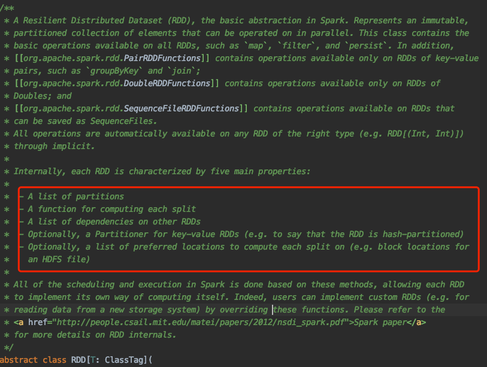

###### RDD包含五个特征

1. 一个分区的列表
2. 一个计算函数：compute，作用是对每个分区进行计算
3. 记录对其他RDDs的依赖（宽依赖、窄依赖）列表
4. 对于Key-value RDD来说，存在一个分区器（可选的）
5. 对每个分区有一个优先位置的列表（可选的）

* 一组分片，即数据集的基本组成单位。对于RDD来说，每个分片都会被一个计算任务处理，并决定并行计算的粒度，用户可以在创建RDD时指定RDD分片个数，如果没有指定，那么就会采用默认值。
* 一个对分区数据进行计算的函数。Spark中RDD的计算是以分片为单位的，每个RDD都会实现compute函数以达到该目的。compute函数会对迭代器进行组合，不需要保存每次的计算结果。
* RDD之间存在依赖关系，RDD每次转换都会生成一个新的RDD，RDD之间形成类似于流水线一样的前后依赖关系（lineage）。在部分分区数据丢失时，Spark可以通过这个依赖关系重新计算丢失的分区数据，而不是对所有的分区进行计算。
* 对于Key-Value的RDD来说，可能存在分区器（Partitioner）。Spark实现了两种类型的分片函数，一个是基于哈希的HashPartitioner，另一个是基于范围的RangePartitioner。只有key-value的RDD，才可能有Partitioner，非Key-Value的RDD的Partitioner的值是nono。Partitioner函数决定了RDD本身的分片数量，也决定了parent RDD Shuffle输出时的分片数量。
* 一个列表，存储每个Parition的优先位置（preferred location）。对于一个HDFS文件来说，这个列表保存的就是每个Partition所在的块的位置，安装“移动计算不移动数据”的理念，会尽可能的将计算任务分配到其所要处理数据块的存储位置。

#### RDD特点

###### 分区

RDD逻辑上时分区的，每个分区的数据时抽象存在的，计算的时候会通过一个compute函数得到每个分区的数据，如果RDD是通过已有的文件系统构建，则Compute函数是读取指定文件系统中的数据，如果RDD是通过其他RDD转换而来，而Compute函数是执行转换逻辑将其他RDD的数据进行转换。

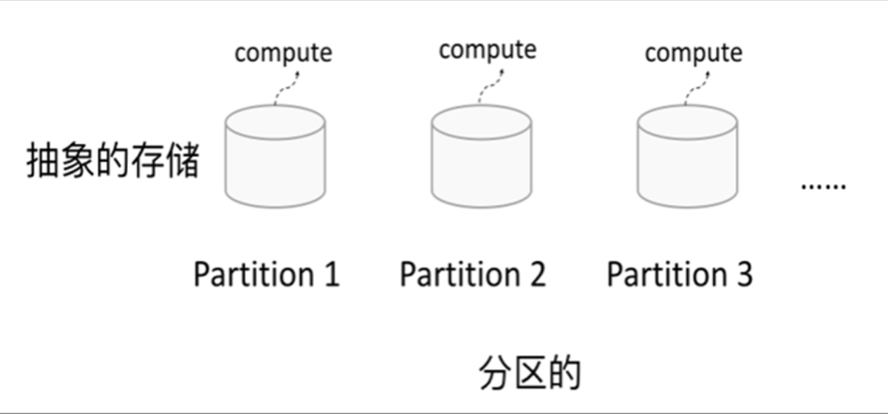

###### 只读

RDD是只读的，想要改变RDD中的数据，只能在现有的RDD基础上创建新的RDD。一个RDD转换为另一个RDD。通过丰富的操作算子（map,filter,union,join,reduceByKey等）实现，不像MR只能写Map和Reduce

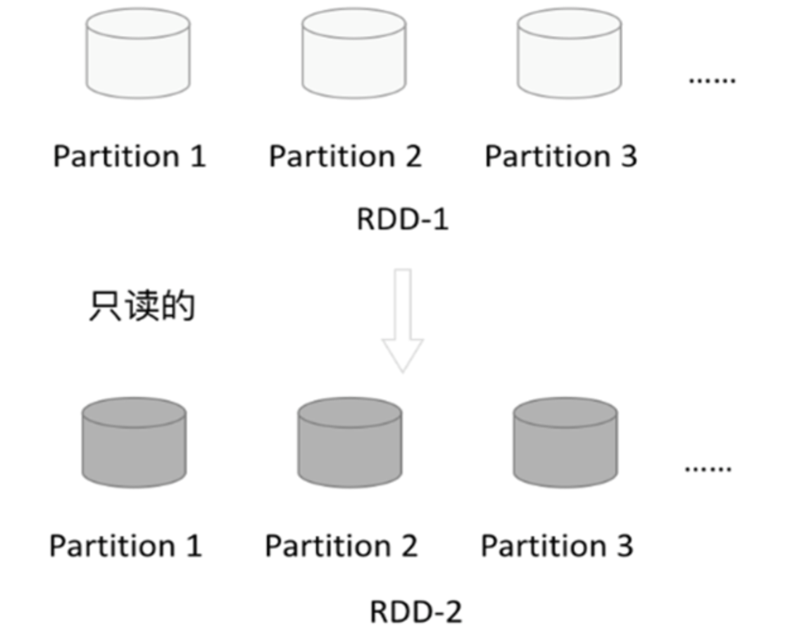

RDD的操作算子包含两类：

* transformation 用来对RDD进行转化，延迟执行（lazy）
* action 用来出发RDD计算，得到的计算结果或者将RDD保存到文件系统中

###### 依赖

RDDs通过算子进行转换，转换得到的新的RDD包含了从其他RDDs衍生的所必需的信息，RDDs之间维护着这种血缘关系（lineage），也称之为依赖。依赖包括两种

* 窄依赖。RDDs之间分区是一一对应的（1:1  或 n:1）
* 宽依赖。子RDD的每个分区与父RDD的每个分区都有关，是多对多的关系（n:m）**有Shuffle发生**

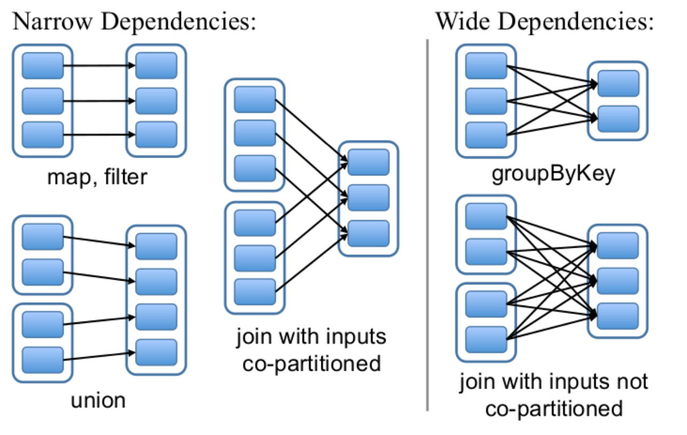

###### 缓存

可以控制存储级别（内存、磁盘等）进行缓存

如果在应用程序中多次使用同一个RDD，可以将该RDD缓存起来，该RDD只有在第一次计算的时候会根据血缘关系得到的分区数据，在后续其他地方用到该RDD的时候，会直接冲缓存处读取而不是在根据血缘关系计算，这样就加速的重用

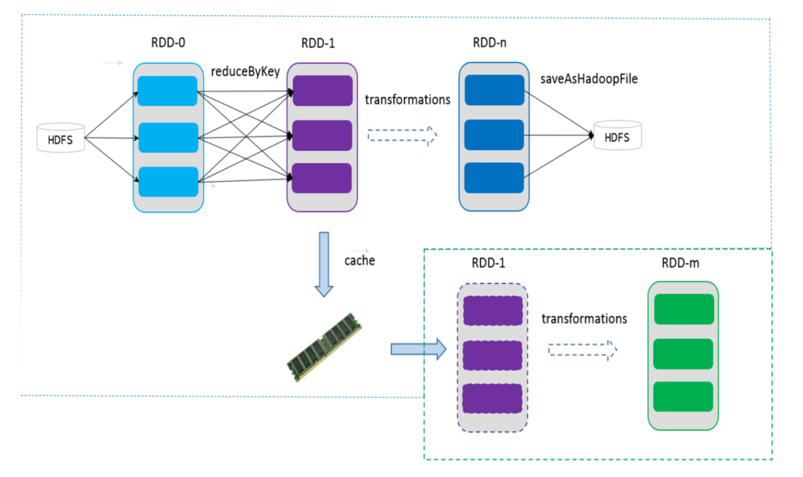

###### checkpoint

虽然RDD的血缘关系天然地可以实现容错，当RDD的某个分区数据失败或丢失，可以通过血缘关系重建。但是于长时间迭代型应用来说，随着迭代的进行，RDDs之间的血缘关系会越来越长，一旦在后续的迭代过程中出错，则需要通过非常长的血缘关系重建，势必影响性能。RDD支持checkpoint将数据保存到持久化的存储中，这样就可以切断之前的血缘关系，因为checkpoint后的RDD就不需要知道他的父RDDs，他可以直接从checkpoint处拿到数据。

#### Spark编程模型

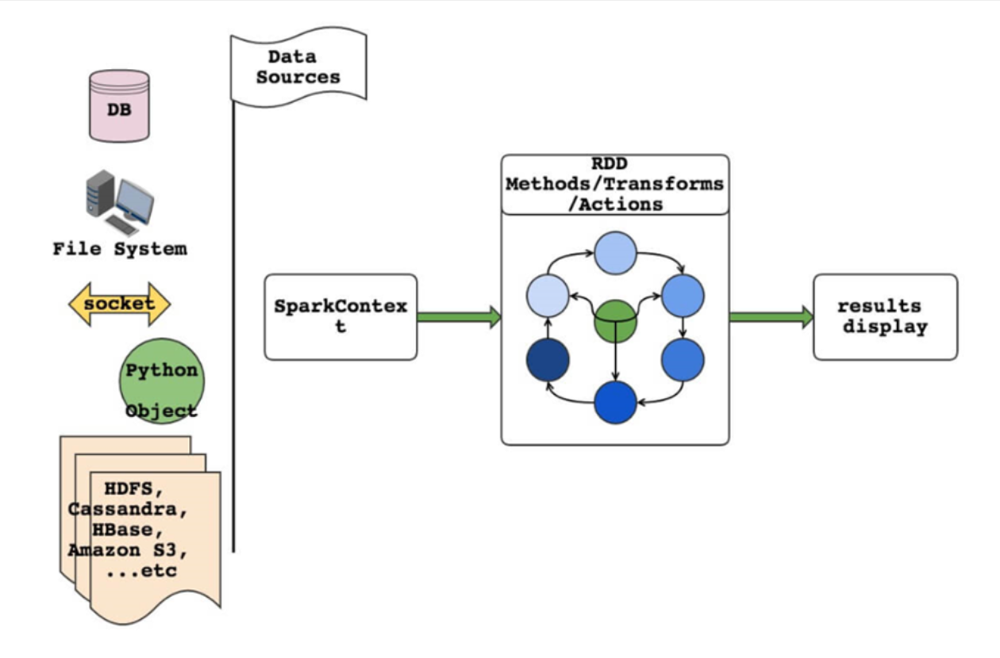

* RDD表示数据对象
* 通过对象上的方法调用来对RDD进行转换
* 最终显示结果或将结果输出到外部数据源
* RDD转换算子称为Transformation是Lazy的（延迟执行）
* 需要遇到Action算子才会执行RDD操作


需要使用Spark，需要编写Driver程序，它被提交到集群运行

* Driver中定义了一个或者多个RDD，并调用RDD上的各种算子
* Worker则执行RDD分区计算任务

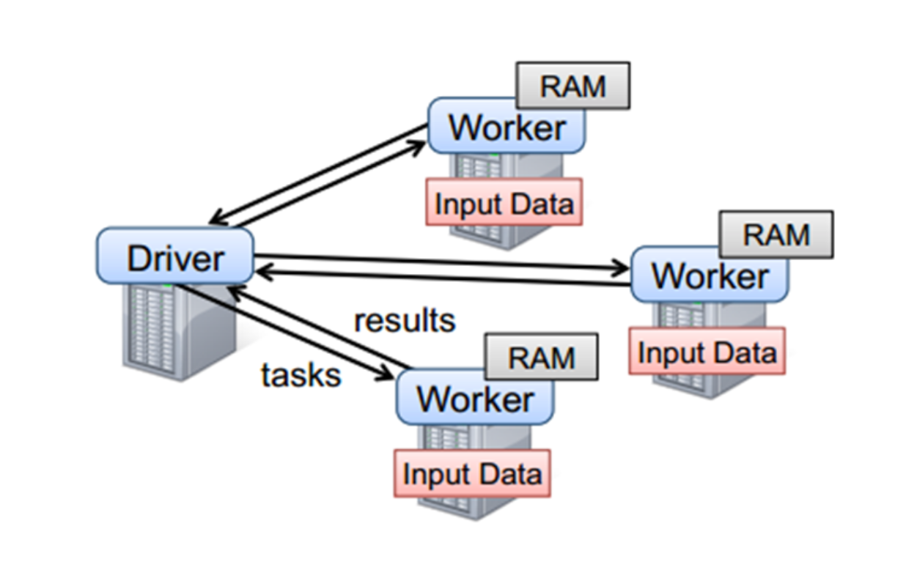

#### RDD创建

###### SparkContext

SparkContext是编写Spark程序用到的第一个类，是Spark的主要入口点。他负责整个集群的交互。如果把Spark集群当作服务端，那么Driver就是客户端，SparkContext是客户端的核心，SparkContext是Spark对外接口，负责向调用者提供Spark的各种功能。SparkContext用于连接Spark集群、创建RDD、累加器、广播变量。在Spark-shell中SparkContext已经创建好了，可直接使用，编写Spark Driver程序的第一件事就是创建SparkContext

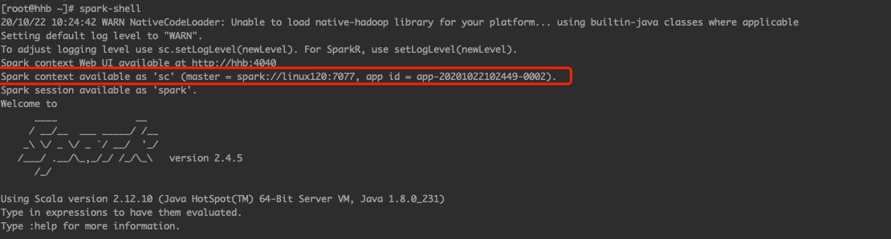

###### 从集合创建RDD

从集合中创建RDD，主要用户测试，Spark提供一下函数：parallelize、makeRDD、range

```scala
/** Distribute a local Scala collection to form an RDD.
   *
   * @note Parallelize acts lazily. If `seq` is a mutable collection and is altered after the call
   * to parallelize and before the first action on the RDD, the resultant RDD will reflect the
   * modified collection. Pass a copy of the argument to avoid this.
   * @note avoid using `parallelize(Seq())` to create an empty `RDD`. Consider `emptyRDD` for an
   * RDD with no partitions, or `parallelize(Seq[T]())` for an RDD of `T` with empty partitions.
   * @param seq Scala collection to distribute
   * @param numSlices number of partitions to divide the collection into
   * @return RDD representing distributed collection
   */
def parallelize[T: ClassTag](
  seq: Seq[T],
  numSlices: Int = defaultParallelism): RDD[T] = withScope {
  assertNotStopped()
  new ParallelCollectionRDD[T](this, seq, numSlices, Map[Int, Seq[String]]())
}

/**
   * Creates a new RDD[Long] containing elements from `start` to `end`(exclusive), increased by
   * `step` every element.
   *
   * @note if we need to cache this RDD, we should make sure each partition does not exceed limit.
   *
   * @param start the start value.
   * @param end the end value.
   * @param step the incremental step
   * @param numSlices number of partitions to divide the collection into
   * @return RDD representing distributed range
   */
def range(
  start: Long,
  end: Long,
  step: Long = 1,
  numSlices: Int = defaultParallelism): RDD[Long] = withScope {
  assertNotStopped()
  // when step is 0, range will run infinitely
  require(step != 0, "step cannot be 0")
  val numElements: BigInt = {
    val safeStart = BigInt(start)
    val safeEnd = BigInt(end)
    if ((safeEnd - safeStart) % step == 0 || (safeEnd > safeStart) != (step > 0)) {
      (safeEnd - safeStart) / step
    } else {
      // the remainder has the same sign with range, could add 1 more
      (safeEnd - safeStart) / step + 1
    }
  }
  parallelize(0 until numSlices, numSlices).mapPartitionsWithIndex { (i, _) =>
    val partitionStart = (i * numElements) / numSlices * step + start
    val partitionEnd = (((i + 1) * numElements) / numSlices) * step + start
    def getSafeMargin(bi: BigInt): Long =
    if (bi.isValidLong) {
      bi.toLong
    } else if (bi > 0) {
      Long.MaxValue
    } else {
      Long.MinValue
    }
    val safePartitionStart = getSafeMargin(partitionStart)
    val safePartitionEnd = getSafeMargin(partitionEnd)

    new Iterator[Long] {
      private[this] var number: Long = safePartitionStart
      private[this] var overflow: Boolean = false

      override def hasNext =
      if (!overflow) {
        if (step > 0) {
          number < safePartitionEnd
        } else {
          number > safePartitionEnd
        }
      } else false

      override def next() = {
        val ret = number
        number += step
        if (number < ret ^ step < 0) {
          // we have Long.MaxValue + Long.MaxValue < Long.MaxValue
          // and Long.MinValue + Long.MinValue > Long.MinValue, so iff the step causes a step
          // back, we are pretty sure that we have an overflow.
          overflow = true
        }
        ret
      }
    }
  }
}

/** Distribute a local Scala collection to form an RDD.
   *
   * This method is identical to `parallelize`.
   * @param seq Scala collection to distribute
   * @param numSlices number of partitions to divide the collection into
   * @return RDD representing distributed collection
   */
def makeRDD[T: ClassTag](
  seq: Seq[T],
  numSlices: Int = defaultParallelism): RDD[T] = withScope {
  parallelize(seq, numSlices)
}
```


```shell
scala> val rdd1 = sc.parallelize(Array(1,2,3,4,5,6))
rdd1: org.apache.spark.rdd.RDD[Int] = ParallelCollectionRDD[0] at parallelize at <console>:24

scala> val rdd2 = sc.parallelize(1 until 100)
rdd2: org.apache.spark.rdd.RDD[Int] = ParallelCollectionRDD[1] at parallelize at <console>:24

scala> rdd1.collect
res0: Array[Int] = Array(1, 2, 3, 4, 5, 6)

scala> rdd2.collect
res1: Array[Int] = Array(1, 2, 3, 4, 5, 6, 7, 8, 9, 10, 11, 12, 13, 14, 15, 16, 17, 18, 19, 20, 21, 22, 23, 24, 25, 26, 27, 28, 29, 30, 31, 32, 33, 34, 35, 36, 37, 38, 39, 40, 41, 42, 43, 44, 45, 46, 47, 48, 49, 50, 51, 52, 53, 54, 55, 56, 57, 58, 59, 60, 61, 62, 63, 64, 65, 66, 67, 68, 69, 70, 71, 72, 73, 74, 75, 76, 77, 78, 79, 80, 81, 82, 83, 84, 85, 86, 87, 88, 89, 90, 91, 92, 93, 94, 95, 96, 97, 98, 99)

scala> rdd1.getNumPartitions
res2: Int = 5

scala> rdd1.partition
partitioner   partitions

scala> rdd1.partitions.length
res3: Int = 5

scala> val rdd3 = sc.range(1,100,2)
rdd3: org.apache.spark.rdd.RDD[Long] = MapPartitionsRDD[3] at range at <console>:24

scala> rdd3.collect
res4: Array[Long] = Array(1, 3, 5, 7, 9, 11, 13, 15, 17, 19, 21, 23, 25, 27, 29, 31, 33, 35, 37, 39, 41, 43, 45, 47, 49, 51, 53, 55, 57, 59, 61, 63, 65, 67, 69, 71, 73, 75, 77, 79, 81, 83, 85, 87, 89, 91, 93, 95, 97, 99)

scala> val rdd4 = sc.parallelize(1 to 100,3)
rdd4: org.apache.spark.rdd.RDD[Int] = ParallelCollectionRDD[4] at parallelize at <console>:24

scala> rdd3.getNumPartitions
res5: Int = 5

scala> val rdd3 = sc.range(1,100,2,1)
rdd3: org.apache.spark.rdd.RDD[Long] = MapPartitionsRDD[6] at range at <console>:24

scala> rdd3.getNumPartitions
res6: Int = 1
```

rdd.collect方法是聚合的意思，在生产中不要使用，会造成Driver OOM

###### 从文件系统创建RDD

用textFile()方法来文件系统中加载数据创建RDD，方法将文件的URI作为参数，这个URI可以是：

* 本地文件系统
  * 如果是本地文件系统，在Spark集群中，要注意是否每个服务器上同个目录下都有该文件
* 分布式文件系统HDFS的地址
* Amazon S3的地址

```
// 从本地文件系统加载数据
val lines = sc.textFile("file:///root/data/wc.txt")
// 从分布式文件系统加载数据
val lines = sc.textFile("hdfs://linux121:9000/user/root/data/uaction.dat") val lines = sc.textFile("/user/root/data/uaction.dat")
val lines = sc.textFile("data/uaction.dat")
```

###### 从RDD创建RDD

本质是将一个RDD转换为另一个RDD。详细信息参见 3.5 Transformation

#### Transformation

RDD的操作算子分为两类：

* Transformation，用来对RDD进行转化，这个操作是延时执行或者说是Lazy的，返回的是一个新的RDD。
* Action，用来触发RDD的计算，得到相关计算结果 或者 将结果保存的外部系统中，返回结果int、double、集合（不会返回新的RDD）
* 要很准确区分Transformation、Action

每一次Tranformation操作都会产生新的RDD，供给下一个“转化”使用，转化得到的RDD是惰性求值得，也就是说，整个转换过程只是记录了转换的轨迹，并不会真正的计算，只有遇到了Action操作时，才会发生真正的计算，开始从血缘关系（lineage）源头开始，进行物理的转换操作；

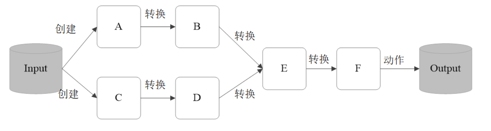

创建的Transformation：[官网](http://spark.apache.org/docs/latest/rdd-programming-guide.html)

###### 常用转换算子1

* **map(func)**:对数据集中的每个元素都进行func操作，然后返回一个新的RDD。

* **filter(func)**:对数据集中的每个元素都进行func操作，然后执行func操作，执行为true的返回构成一个新的RDD
* **flatMap(func)** 与map类似，和Scala中的flatMap一致，每个输入元素会被映射为0个或多个输出元素
* **mapPartitions(func)**:和map很像，但是map是将func作用在每个元素上，而mapPartitions是func作用在整个分区上。假设一个RDD有N个元素，M个分区，（N >> M），那么map的函数将会将会被调用N次，而mapParitions会被调用M次一次处理一个分区的数据
* **mapPartitionsWithIndex（func）**：与mapPartitions类似，多了分区的索引值的信息。

全都是窄依赖

```shell
scala> val rdd1 = sc.parallelize(1 to 100)
rdd1: org.apache.spark.rdd.RDD[Int] = ParallelCollectionRDD[0] at parallelize at <console>:24

scala> rdd1.collect
res0: Array[Int] = Array(1, 2, 3, 4, 5, 6, 7, 8, 9, 10, 11, 12, 13, 14, 15, 16, 17, 18, 19, 20, 21, 22, 23, 24, 25, 26, 27, 28, 29, 30, 31, 32, 33, 34, 35, 36, 37, 38, 39, 40, 41, 42, 43, 44, 45, 46, 47, 48, 49, 50, 51, 52, 53, 54, 55, 56, 57, 58, 59, 60, 61, 62, 63, 64, 65, 66, 67, 68, 69, 70, 71, 72, 73, 74, 75, 76, 77, 78, 79, 80, 81, 82, 83, 84, 85, 86, 87, 88, 89, 90, 91, 92, 93, 94, 95, 96, 97, 98, 99, 100)

scala> rdd1.map(_ * 2).collect
res1: Array[Int] = Array(2, 4, 6, 8, 10, 12, 14, 16, 18, 20, 22, 24, 26, 28, 30, 32, 34, 36, 38, 40, 42, 44, 46, 48, 50, 52, 54, 56, 58, 60, 62, 64, 66, 68, 70, 72, 74, 76, 78, 80, 82, 84, 86, 88, 90, 92, 94, 96, 98, 100, 102, 104, 106, 108, 110, 112, 114, 116, 118, 120, 122, 124, 126, 128, 130, 132, 134, 136, 138, 140, 142, 144, 146, 148, 150, 152, 154, 156, 158, 160, 162, 164, 166, 168, 170, 172, 174, 176, 178, 180, 182, 184, 186, 188, 190, 192, 194, 196, 198, 200)

scala> rdd1.filter(_ > 50).collect
res2: Array[Int] = Array(51, 52, 53, 54, 55, 56, 57, 58, 59, 60, 61, 62, 63, 64, 65, 66, 67, 68, 69, 70, 71, 72, 73, 74, 75, 76, 77, 78, 79, 80, 81, 82, 83, 84, 85, 86, 87, 88, 89, 90, 91, 92, 93, 94, 95, 96, 97, 98, 99, 100)

scala> val rdd2 = sc.textFile("/azkaban-wc/wc.txt")
rdd2: org.apache.spark.rdd.RDD[String] = /azkaban-wc/wc.txt MapPartitionsRDD[4] at textFile at <console>:24

scala> rdd2.flatMap(_.split(" ")).collect
res4: Array[String] = Array(hadoop, mapreduce, yarn, hdfs, hadoop, mapreduce, mapreduce, yarn, lagou, lagou, lagou)

## mapPartitions
scala> val rdd1 = sc.makeRDD(1 to 20,3)
rdd1: org.apache.spark.rdd.RDD[Int] = ParallelCollectionRDD[1] at makeRDD at <console>:24

scala> rdd1.getNumPartitions
res0: Int = 3

scala> rdd1.mapPartitions(as => Iterator(as.toArray.mkString(":"))).collect
res5: Array[String] = Array(1:2:3:4:5:6, 7:8:9:10:11:12:13, 14:15:16:17:18:19:20)

scala> rdd1.mapPartitions(iter => Iterator(iter.toList)).collect
res8: Array[List[Int]] = Array(List(1, 2, 3, 4, 5, 6), List(7, 8, 9, 10, 11, 12, 13), List(14, 15, 16, 17, 18, 19, 20))

scala> rdd1.mapPartitions(iter => Iterator(iter.toArray.toBuffer)).collect
res9: Array[scala.collection.mutable.Buffer[Int]] = Array(ArrayBuffer(1, 2, 3, 4, 5, 6), ArrayBuffer(7, 8, 9, 10, 11, 12, 13), ArrayBuffer(14, 15, 16, 17, 18, 19, 20))


scala> rdd1.mapPartitionsWithIndex((i,iter) => Iterator(i + "|" + iter.toArray.toBuffer)).collect
res13: Array[String] = Array(0|ArrayBuffer(1, 2, 3, 4, 5, 6), 1|ArrayBuffer(7, 8, 9, 10, 11, 12, 13), 2|ArrayBuffer(14, 15, 16, 17, 18, 19, 20))

```


```scala
/**
* 第一个参数参数是一个方法，讲一个迭代器迭代成另一个迭代器
*/
def mapPartitions[U: ClassTag](
  f: Iterator[T] => Iterator[U],
  preservesPartitioning: Boolean = false): RDD[U] = withScope {
  val cleanedF = sc.clean(f)
  new MapPartitionsRDD(
    this,
    (context: TaskContext, index: Int, iter: Iterator[T]) => cleanedF(iter),
    preservesPartitioning)
}

def mapPartitionsWithIndex[U: ClassTag](
  f: (Int, Iterator[T]) => Iterator[U],
  preservesPartitioning: Boolean = false): RDD[U] = withScope {
  val cleanedF = sc.clean(f)
  new MapPartitionsRDD(
    this,
    (context: TaskContext, index: Int, iter: Iterator[T]) => cleanedF(index, iter),
    preservesPartitioning)
}
```

map 与 mapPartitions的区别

* map：每次处理一条数据
* mapPartitions：每次处理一个分区的数据，分区的数据处理完成后，数据才能释放，资源不足容易OOM
* 最佳时间，当内存资源充足时，建议使用mapPartitions，以提高处理效率

###### 常用转换算子2

* **groupBy(func)**:按照传入函数的返回值进行分组，将key相同的值放入一个迭代器

* **glom()**：将每一个分区形成一个数组，形成新的RDD[Array[T]]

* **sample(withReplaceMent,fraction,seed)**:采样算子，以指定的随机种子（seed）随机抽样出数量为fraction的数据，withReplacement表示是抽出的数据是否放回，true为有放回的抽样，false为无放回的抽样
* **distinct([num])**:对RDD元素去重后，返回一个新的RDD，可传入numTasks才参数改变RDD分区数
* **coalesce(numPartitions)**:缩减分区数，无shuffle
* **repartitions(numPartitions)**：增加或缩减分区数，有shuffle
* **sortBy(func,[ascending],[numTasks])**:使用func对数据进行处理，对处理后的结果进行排序

宽依赖算子：groupBy、distinct、repartition、sortBy

```shell
scala> val rdd1 = sc.makeRDD(1 to 10)
rdd1: org.apache.spark.rdd.RDD[Int] = ParallelCollectionRDD[15] at makeRDD at <console>:24

scala> rdd1
res21: org.apache.spark.rdd.RDD[Int] = ParallelCollectionRDD[15] at makeRDD at <console>:24

scala> rdd1.collect
res22: Array[Int] = Array(1, 2, 3, 4, 5, 6, 7, 8, 9, 10)

scala> rdd1.mapPartitions(iter => iter.map(_ * 10))
res24: org.apache.spark.rdd.RDD[Int] = MapPartitionsRDD[16] at mapPartitions at <console>:26

scala> res24.collect
res25: Array[Int] = Array(10, 20, 30, 40, 50, 60, 70, 80, 90, 100)

scala> val rdd2 = rdd1.groupBy(_ % 3)
rdd2: org.apache.spark.rdd.RDD[(Int, Iterable[Int])] = ShuffledRDD[18] at groupBy at <console>:25

scala> rdd2.collect
res27: Array[(Int, Iterable[Int])] = Array((0,CompactBuffer(6, 9, 3)), (1,CompactBuffer(7, 1, 4, 10)), (2,CompactBuffer(2, 5, 8)))

scala> rdd2.mapValues(_.map(_*2)).collect
res28: Array[(Int, Iterable[Int])] = Array((0,List(6, 12, 18)), (1,List(2, 20, 8, 14)), (2,List(10, 4, 16)))

scala> val rdd1 = sc.makeRDD(1 to 20,3)
rdd1: org.apache.spark.rdd.RDD[Int] = ParallelCollectionRDD[0] at makeRDD at <console>:24

scala> rdd1.glom
res0: org.apache.spark.rdd.RDD[Array[Int]] = MapPartitionsRDD[1] at glom at <console>:26

scala> res0.collect
res1: Array[Array[Int]] = Array(Array(1, 2, 3, 4, 5, 6), Array(7, 8, 9, 10, 11, 12, 13), Array(14, 15, 16, 17, 18, 19, 20))

scala> rdd1.collect
res2: Array[Int] = Array(1, 2, 3, 4, 5, 6, 7, 8, 9, 10, 11, 12, 13, 14, 15, 16, 17, 18, 19, 20)

scala> val rdd1 = sc.makeRDD(1 to 111)
rdd1: org.apache.spark.rdd.RDD[Int] = ParallelCollectionRDD[2] at makeRDD at <console>:24

scala> rdd1.glom.collect
res3: Array[Array[Int]] = Array(Array(1, 2, 3, 4, 5, 6, 7, 8, 9, 10, 11, 12, 13, 14, 15, 16, 17, 18, 19, 20, 21, 22), Array(23, 24, 25, 26, 27, 28, 29, 30, 31, 32, 33, 34, 35, 36, 37, 38, 39, 40, 41, 42, 43, 44), Array(45, 46, 47, 48, 49, 50, 51, 52, 53, 54, 55, 56, 57, 58, 59, 60, 61, 62, 63, 64, 65, 66), Array(67, 68, 69, 70, 71, 72, 73, 74, 75, 76, 77, 78, 79, 80, 81, 82, 83, 84, 85, 86, 87, 88), Array(89, 90, 91, 92, 93, 94, 95, 96, 97, 98, 99, 100, 101, 102, 103, 104, 105, 106, 107, 108, 109, 110, 111))

scala> rdd1.glom.map(_.map(_ * 10)).collect
res4: Array[Array[Int]] = Array(Array(10, 20, 30, 40, 50, 60, 70, 80, 90, 100, 110, 120, 130, 140, 150, 160, 170, 180, 190, 200, 210, 220), Array(230, 240, 250, 260, 270, 280, 290, 300, 310, 320, 330, 340, 350, 360, 370, 380, 390, 400, 410, 420, 430, 440), Array(450, 460, 470, 480, 490, 500, 510, 520, 530, 540, 550, 560, 570, 580, 590, 600, 610, 620, 630, 640, 650, 660), Array(670, 680, 690, 700, 710, 720, 730, 740, 750, 760, 770, 780, 790, 800, 810, 820, 830, 840, 850, 860, 870, 880), Array(890, 900, 910, 920, 930, 940, 950, 960, 970, 980, 990, 1000, 1010, 1020, 1030, 1040, 1050, 1060, 1070, 1080, 1090, 1100, 1110))

scala> val rdd1 = sc.makeRDD(1 to 111,2)
rdd1: org.apache.spark.rdd.RDD[Int] = ParallelCollectionRDD[6] at makeRDD at <console>:24

scala> rdd1.glom
res5: org.apache.spark.rdd.RDD[Array[Int]] = MapPartitionsRDD[7] at glom at <console>:26

scala> rdd1.glom.collect
res6: Array[Array[Int]] = Array(Array(1, 2, 3, 4, 5, 6, 7, 8, 9, 10, 11, 12, 13, 14, 15, 16, 17, 18, 19, 20, 21, 22, 23, 24, 25, 26, 27, 28, 29, 30, 31, 32, 33, 34, 35, 36, 37, 38, 39, 40, 41, 42, 43, 44, 45, 46, 47, 48, 49, 50, 51, 52, 53, 54, 55), Array(56, 57, 58, 59, 60, 61, 62, 63, 64, 65, 66, 67, 68, 69, 70, 71, 72, 73, 74, 75, 76, 77, 78, 79, 80, 81, 82, 83, 84, 85, 86, 87, 88, 89, 90, 91, 92, 93, 94, 95, 96, 97, 98, 99, 100, 101, 102, 103, 104, 105, 106, 107, 108, 109, 110, 111))

scala> rdd1.glom.getNumPartitions
res7: Int = 2

scala> val rdd3 = rdd1.glom.map(_.sliding(10,10))
rdd3: org.apache.spark.rdd.RDD[Iterator[Array[Int]]] = MapPartitionsRDD[11] at map at <console>:25

scala> rdd3.collect
res8: Array[Iterator[Array[Int]]] = Array(<iterator>, <iterator>)
# 将数组聚合到一起，然后对聚合到以前的数据进行遍历，下面的_ 表示的是Array[Int]，然后对Array[Int]进行分割，步十个元素一组，步长为10
scala> val rdd3 = rdd1.glom.map(_.sliding(10,10).toArray)
rdd3: org.apache.spark.rdd.RDD[Array[Array[Int]]] = MapPartitionsRDD[13] at map at <console>:25
scala> rdd3.collect
res10: Array[Array[Array[Int]]] = Array(Array(Array(1, 2, 3, 4, 5, 6, 7, 8, 9, 10), Array(11, 12, 13, 14, 15, 16, 17, 18, 19, 20), Array(21, 22, 23, 24, 25, 26, 27, 28, 29, 30), Array(31, 32, 33, 34, 35, 36, 37, 38, 39, 40), Array(41, 42, 43, 44, 45, 46, 47, 48, 49, 50), Array(51, 52, 53, 54, 55)), Array(Array(56, 57, 58, 59, 60, 61, 62, 63, 64, 65), Array(66, 67, 68, 69, 70, 71, 72, 73, 74, 75), Array(76, 77, 78, 79, 80, 81, 82, 83, 84, 85), Array(86, 87, 88, 89, 90, 91, 92, 93, 94, 95), Array(96, 97, 98, 99, 100, 101, 102, 103, 104, 105), Array(106, 107, 108, 109, 110, 111)))

scala> rdd3.getNumPartitions
res11: Int = 2
## 生成一个1 到 33的数组
scala> val rddx = (1 to 33).toArray
rddx: Array[Int] = Array(1, 2, 3, 4, 5, 6, 7, 8, 9, 10, 11, 12, 13, 14, 15, 16, 17, 18, 19, 20, 21, 22, 23, 24, 25, 26, 27, 28, 29, 30, 31, 32, 33)
## 将数组进行分割，十个元素为一组，默认的步长为1，即第一个数组为1～10，第二个数组为2～11，1和2的步长为1
scala> rddx.sliding(10).toArray
res14: Array[Array[Int]] = Array(Array(1, 2, 3, 4, 5, 6, 7, 8, 9, 10), Array(2, 3, 4, 5, 6, 7, 8, 9, 10, 11), Array(3, 4, 5, 6, 7, 8, 9, 10, 11, 12), Array(4, 5, 6, 7, 8, 9, 10, 11, 12, 13), Array(5, 6, 7, 8, 9, 10, 11, 12, 13, 14), Array(6, 7, 8, 9, 10, 11, 12, 13, 14, 15), Array(7, 8, 9, 10, 11, 12, 13, 14, 15, 16), Array(8, 9, 10, 11, 12, 13, 14, 15, 16, 17), Array(9, 10, 11, 12, 13, 14, 15, 16, 17, 18), Array(10, 11, 12, 13, 14, 15, 16, 17, 18, 19), Array(11, 12, 13, 14, 15, 16, 17, 18, 19, 20), Array(12, 13, 14, 15, 16, 17, 18, 19, 20, 21), Array(13, 14, 15, 16, 17, 18, 19, 20, 21, 22), Array(14, 15, 16, 17, 18, 19, 20, 21, 22, 23), Array(15, 16, 17, 18, 19, 20, 21, 22, 23, 24), Array(16, 17, 18, 19, 20, 21, 22, 23, 24, 25), Array(17, 18, 19, 20, 21, 22, 2...
## 将数组进行分割，十个元素为一组，默认的步长为5
scala> rddx.sliding(10,5).toArray
res15: Array[Array[Int]] = Array(Array(1, 2, 3, 4, 5, 6, 7, 8, 9, 10), Array(6, 7, 8, 9, 10, 11, 12, 13, 14, 15), Array(11, 12, 13, 14, 15, 16, 17, 18, 19, 20), Array(16, 17, 18, 19, 20, 21, 22, 23, 24, 25), Array(21, 22, 23, 24, 25, 26, 27, 28, 29, 30), Array(26, 27, 28, 29, 30, 31, 32, 33))
## 将数组进行分割，十个元素为一组，默认的步长为10
scala> rddx.sliding(10,10).toArray
res16: Array[Array[Int]] = Array(Array(1, 2, 3, 4, 5, 6, 7, 8, 9, 10), Array(11, 12, 13, 14, 15, 16, 17, 18, 19, 20), Array(21, 22, 23, 24, 25, 26, 27, 28, 29, 30), Array(31, 32, 33))

# 对数据采样，先生成一个数组
scala> val rdd1 = sc.makeRDD(1 to 200)
rdd1: org.apache.spark.rdd.RDD[Int] = ParallelCollectionRDD[1] at makeRDD at <console>:24
# 对数组进行采样，第一个参数为是否允许采样过的数据，再次被收集到，true为可以，第二个参数是取多少比例的数据，该数据是一个范围，不是准备的就是那么多，最后一个参数为算子，当算子相同的时候，每次采样的数据必定是相同的，该参数可以不写，则每次采样的数据就是完全随机的了。
scala> val rdd2 = rdd1.sample(true,0.1,10)
rdd2: org.apache.spark.rdd.RDD[Int] = PartitionwiseSampledRDD[2] at sample at <console>:25

scala> rdd2.collect
res1: Array[Int] = Array(2, 4, 20, 20, 37, 60, 67, 81, 96, 106, 107, 156, 164, 166, 167, 172, 173, 174, 174, 185, 187, 188, 195, 197)

scala> rdd1.sample(true,0.1,10).collect
res2: Array[Int] = Array(2, 4, 20, 20, 37, 60, 67, 81, 96, 106, 107, 156, 164, 166, 167, 172, 173, 174, 174, 185, 187, 188, 195, 197)

scala> rdd1.sample(true,0.1,101).collect
res3: Array[Int] = Array(28, 32, 45, 53, 60, 94, 102, 120, 157, 162, 167, 170, 170, 183, 185, 200)

scala> rdd1.sample(true,0.1).collect
res4: Array[Int] = Array(13, 14, 36, 51, 55, 81, 83, 84, 88, 106, 106, 120, 127, 142, 145, 149, 158, 176, 188, 190)

scala> rdd1.sample(true,0.1).collect
res5: Array[Int] = Array(1, 12, 35, 39, 45, 57, 63, 80, 99, 107, 113, 117, 145, 160, 160, 161, 162, 170, 175, 185, 185, 186, 200)

scala> rdd1.sample(false,0.1,10).collect
res6: Array[Int] = Array(2, 5, 8, 10, 15, 16, 31, 34, 35, 37, 59, 71, 75, 81, 90, 108, 154, 164, 169, 179, 181, 183)

scala> rdd1.sample(false,0.1,10).collect
res7: Array[Int] = Array(2, 5, 8, 10, 15, 16, 31, 34, 35, 37, 59, 71, 75, 81, 90, 108, 154, 164, 169, 179, 181, 183)

scala> rdd1.sample(false,0.1).collect
res8: Array[Int] = Array(31, 40, 44, 67, 70, 107, 108, 112, 117, 125, 154, 163, 170, 174, 185, 187, 199)

## 测试去重，先生成一个random，然后生成随机数
scala> val random = scala.util.Random
random: util.Random.type = scala.util.Random$@6022cf7e


scala> val arr = (1 to 30).map(_ => random.nextInt(15))
arr: scala.collection.immutable.IndexedSeq[Int] = Vector(1, 6, 7, 4, 5, 1, 4, 1, 8, 13, 14, 1, 0, 4, 1, 13, 7, 4, 12, 14, 12, 7, 4, 10, 4, 13, 5, 5, 2, 14)


scala> val rdd = sc.makeRDD(arr)
rdd: org.apache.spark.rdd.RDD[Int] = ParallelCollectionRDD[0] at makeRDD at <console>:26

scala> rdd.collect
res0: Array[Int] = Array(1, 6, 7, 4, 5, 1, 4, 1, 8, 13, 14, 1, 0, 4, 1, 13, 7, 4, 12, 14, 12, 7, 4, 10, 4, 13, 5, 5, 2, 14)

scala> rdd.distinct.collect
res1: Array[Int] = Array(0, 10, 5, 1, 6, 7, 12, 2, 13, 8, 4, 14)


## 减少或增加分区数
# coalesce只能减少分区数，不能增加分区数
scala> val rdd2 = rdd1.distinct.coalesce(2)
rdd2: org.apache.spark.rdd.RDD[Int] = CoalescedRDD[13] at coalesce at <console>:25

scala> rdd2.getNumPartitions
res4: Int = 2

scala> val rdd3 = rdd1.distinct.repartition(2)
rdd3: org.apache.spark.rdd.RDD[Int] = MapPartitionsRDD[20] at repartition at <console>:25

scala> rdd3.getNumPartitions
res5: Int = 2

scala> val rdd3 = rdd1.distinct.repartition(6)
rdd3: org.apache.spark.rdd.RDD[Int] = MapPartitionsRDD[27] at repartition at <console>:25

scala> rdd3.getNumPartitions
res6: Int = 6

## 排序，默认升序，false为降序
scala> rdd1.sortBy(x => x).collect
res11: Array[Int] = Array(0, 1, 1, 1, 1, 2, 4, 4, 5, 5, 5, 6, 7, 7, 7, 7, 8, 8, 10, 10, 10, 10, 11, 11, 11, 13, 13, 13, 14, 14)

scala> rdd1.sortBy(x => x,false).collect
res12: Array[Int] = Array(14, 14, 13, 13, 13, 11, 11, 11, 10, 10, 10, 10, 8, 8, 7, 7, 7, 7, 6, 5, 5, 5, 4, 4, 2, 1, 1, 1, 1, 0)
```

###### coalesce 与 repartition的区别

```scala
/**
* Return a new RDD that has exactly numPartitions partitions.
*
* Can increase or decrease the level of parallelism in this RDD. Internally, this uses
* a shuffle to redistribute data.
*
* If you are decreasing the number of partitions in this RDD, consider using `coalesce`,
* which can avoid performing a shuffle.
*
* TODO Fix the Shuffle+Repartition data loss issue described in SPARK-23207.
*/
def repartition(numPartitions: Int)(implicit ord: Ordering[T] = null): RDD[T] = withScope {
  //调用coalesce，但是有shuffle，明确指定shuffle为true
  coalesce(numPartitions, shuffle = true)
}

/**
* Return a new RDD that is reduced into `numPartitions` partitions.
*
* This results in a narrow dependency, e.g. if you go from 1000 partitions
* to 100 partitions, there will not be a shuffle, instead each of the 100
* new partitions will claim 10 of the current partitions. If a larger number
* of partitions is requested, it will stay at the current number of partitions.
*
* However, if you're doing a drastic coalesce, e.g. to numPartitions = 1,
* this may result in your computation taking place on fewer nodes than
* you like (e.g. one node in the case of numPartitions = 1). To avoid this,
* you can pass shuffle = true. This will add a shuffle step, but means the
* current upstream partitions will be executed in parallel (per whatever
* the current partitioning is).
*
* @note With shuffle = true, you can actually coalesce to a larger number
* of partitions. This is useful if you have a small number of partitions,
* say 100, potentially with a few partitions being abnormally large. Calling
* coalesce(1000, shuffle = true) will result in 1000 partitions with the
* data distributed using a hash partitioner. The optional partition coalescer
* passed in must be serializable.
*/
def coalesce(numPartitions: Int, shuffle: Boolean = false,
             partitionCoalescer: Option[PartitionCoalescer] = Option.empty)
(implicit ord: Ordering[T] = null)
: RDD[T] = withScope {
  require(numPartitions > 0, s"Number of partitions ($numPartitions) must be positive.")
  if (shuffle) {
    /** Distributes elements evenly across output partitions, starting from a random partition. */
    val distributePartition = (index: Int, items: Iterator[T]) => {
      var position = new Random(hashing.byteswap32(index)).nextInt(numPartitions)
      items.map { t =>
        // Note that the hash code of the key will just be the key itself. The HashPartitioner
        // will mod it with the number of total partitions.
        position = position + 1
        (position, t)
      }
    } : Iterator[(Int, T)]

    // include a shuffle step so that our upstream tasks are still distributed
    new CoalescedRDD(
      new ShuffledRDD[Int, T, T](
        mapPartitionsWithIndexInternal(distributePartition, isOrderSensitive = true),
        new HashPartitioner(numPartitions)),
      numPartitions,
      partitionCoalescer).values
  } else {
    new CoalescedRDD(this, numPartitions, partitionCoalescer)
  }
}
```

小结：

* repartition： 增大或减少分区数；有shuffle
* coalesce：一般用于减少分区数（此时无shuffle）

###### 常见转换算子3

RDD之间的交、并、差算子：分别如下

* **intersection(otherRDD)** 交集
* **union(otherRDD)** 并集
* **subtract(otherRDD)** 差集，rdd1.subtract(rdd2),这里面指的是rdd1相比rdd2的差集
* **cartesian(otherRDD)**：笛卡尔积
* **zip(otherRDD)**：将两个RDD组合成key-value形式的RDD，默认两个RDD的partition数量以及元素数量都相同，否则会抛出异常。

宽依赖的算子（shuffle）：intersection、subtract、cartesian

```shell
scala> val rdd1 = sc.range(1,21)
rdd1: org.apache.spark.rdd.RDD[Long] = MapPartitionsRDD[1] at range at <console>:24

scala> val rdd2 = sc.range(10,31)
rdd2: org.apache.spark.rdd.RDD[Long] = MapPartitionsRDD[3] at range at <console>:24

scala> rdd1.intersection(rdd2).collect
res0: Array[Long] = Array(15, 20, 10, 16, 11, 17, 12, 13, 18, 19, 14)

scala> rdd1.intersection(rdd2).collect.sorted
res1: Array[Long] = Array(10, 11, 12, 13, 14, 15, 16, 17, 18, 19, 20)

scala> rdd1.intersection(rdd2).sortBy(x => x).collect
res3: Array[Long] = Array(10, 11, 12, 13, 14, 15, 16, 17, 18, 19, 20)

scala> rdd1.intersection(rdd2).sortBy(x => x).collect
res3: Array[Long] = Array(10, 11, 12, 13, 14, 15, 16, 17, 18, 19, 20)

scala> rdd1.union(rdd2).sortBy(x => x).collect
res4: Array[Long] = Array(1, 2, 3, 4, 5, 6, 7, 8, 9, 10, 10, 11, 11, 12, 12, 13, 13, 14, 14, 15, 15, 16, 16, 17, 17, 18, 18, 19, 19, 20, 20, 21, 22, 23, 24, 25, 26, 27, 28, 29, 30)

scala> rdd1.union(rdd2).distinct.sortBy(x => x).collect
res5: Array[Long] = Array(1, 2, 3, 4, 5, 6, 7, 8, 9, 10, 11, 12, 13, 14, 15, 16, 17, 18, 19, 20, 21, 22, 23, 24, 25, 26, 27, 28, 29, 30)

scala> rdd1.subtract(rdd2).sortBy(x => x).collect
res6: Array[Long] = Array(1, 2, 3, 4, 5, 6, 7, 8, 9)

scala> rdd1.intersection(rdd2).getNumPartitions
res7: Int = 5

scala> rdd1.union(rdd2).getNumPartitions
res8: Int = 10

scala> rdd1.subtract(rdd2).getNumPartitions
res9: Int = 5

scala> val rdd1 = sc.range(1,5)
rdd1: org.apache.spark.rdd.RDD[Long] = MapPartitionsRDD[63] at range at <console>:24

scala> val rdd2 = sc.range(6,10)
rdd2: org.apache.spark.rdd.RDD[Long] = MapPartitionsRDD[65] at range at <console>:24

scala> rdd1.cartesian(rdd2).collect
res10: Array[(Long, Long)] = Array((1,6), (1,7), (1,8), (1,9), (2,6), (2,7), (2,8), (2,9), (3,6), (3,7), (3,8), (3,9), (4,6), (4,7), (4,8), (4,9))

scala> rdd1.cartesian(rdd2).getNumPartitions
res11: Int = 25

scala> rdd1.zip(rdd2).collect
res12: Array[(Long, Long)] = Array((1,6), (2,7), (3,8), (4,9))

scala> rdd1.zip(rdd2).getNumPartitions
res13: Int = 5

scala> val rdd2 = sc.range(1,12)
rdd2: org.apache.spark.rdd.RDD[Long] = MapPartitionsRDD[71] at range at <console>:24

scala> rdd1.zip(rdd2)
res14: org.apache.spark.rdd.RDD[(Long, Long)] = ZippedPartitionsRDD2[72] at zip at <console>:28

scala> rdd1.zip(rdd2).collect
20/10/23 14:17:58 WARN TaskSetManager: Lost task 2.0 in stage 30.0 (TID 182, 172.17.178.97, executor 0): org.apache.spark.SparkException: Can only zip RDDs with same number of elements in each partition
	at org.apache.spark.rdd.RDD$$anon$2.hasNext(RDD.scala:914)
	at scala.collection.Iterator.foreach(Iterator.scala:941)
	at scala.collection.Iterator.foreach$(Iterator.scala:941)
	at org.apache.spark.rdd.RDD$$anon$2.foreach(RDD.scala:910)
	at scala.collection.generic.Growable.$plus$plus$eq(Growable.scala:62)
	at scala.collection.generic.Growable.$plus$plus$eq$(Growable.scala:53)
	at scala.collection.mutable.ArrayBuffer.$plus$plus$eq(ArrayBuffer.scala:105)
	at scala.collection.mutable.ArrayBuffer.$plus$plus$eq(ArrayBuffer.scala:49)
	at scala.collection.TraversableOnce.to(TraversableOnce.scala:315)
	at scala.collection.TraversableOnce.to$(TraversableOnce.scala:313)
	at org.apache.spark.rdd.RDD$$anon$2.to(RDD.scala:910)
	at scala.collection.TraversableOnce.toBuffer(TraversableOnce.scala:307)
	at scala.collection.TraversableOnce.toBuffer$(TraversableOnce.scala:307)
	at org.apache.spark.rdd.RDD$$anon$2.toBuffer(RDD.scala:910)
	at scala.collection.TraversableOnce.toArray(TraversableOnce.scala:294)
	at scala.collection.TraversableOnce.toArray$(TraversableOnce.scala:288)
	at org.apache.spark.rdd.RDD$$anon$2.toArray(RDD.scala:910)
	at org.apache.spark.rdd.RDD.$anonfun$collect$2(RDD.scala:990)
	at org.apache.spark.SparkContext.$anonfun$runJob$5(SparkContext.scala:2101)
	at org.apache.spark.scheduler.ResultTask.runTask(ResultTask.scala:90)
	at org.apache.spark.scheduler.Task.run(Task.scala:123)
	at org.apache.spark.executor.Executor$TaskRunner.$anonfun$run$3(Executor.scala:411)
	at org.apache.spark.util.Utils$.tryWithSafeFinally(Utils.scala:1360)
	at org.apache.spark.executor.Executor$TaskRunner.run(Executor.scala:414)
	at java.util.concurrent.ThreadPoolExecutor.runWorker(ThreadPoolExecutor.java:1149)
	at java.util.concurrent.ThreadPoolExecutor$Worker.run(ThreadPoolExecutor.java:624)
	at java.lang.Thread.run(Thread.java:748)

```

备注：

* union是窄依赖：得到的RDD分区数为两个RDD分区数之和
* cartesian是宽依赖：得到的RDD分区数为两个分区数之积。慎用

#### Action

Action是用来触发RDD的计算，得到相关计算结果；

```
Action触发job。一个Spark程序（Driver程序）包含了多少Action算子，那么就有多少个Job
典型的Action算子：collect(将数据聚合到一起)、count（统计RDD中数据的数量）
每个action的调用链路，例如：collect()
collect() => sc.runJob() => ... => dagScheduler.runJob() => 触发了Job
要求：能快速的区分Transformation、Action
```

源码：

```scala
/**
* Return an array that contains all of the elements in this RDD.
*
* @note This method should only be used if the resulting array is expected to be small, as
* all the data is loaded into the driver's memory.
*/
def collect(): Array[T] = withScope {
  val results = sc.runJob(this, (iter: Iterator[T]) => iter.toArray)
  Array.concat(results: _*)
}
.....

/**
* Run an action job on the given RDD and pass all the results to the resultHandler function as
* they arrive.
*
* @param rdd target RDD to run tasks on
* @param func a function to run on each partition of the RDD
* @param partitions set of partitions to run on; some jobs may not want to compute on all
*   partitions of the target RDD, e.g. for operations like first()
* @param callSite where in the user program this job was called
* @param resultHandler callback to pass each result to
* @param properties scheduler properties to attach to this job, e.g. fair scheduler pool name
*
* @note Throws `Exception` when the job fails
*/
def runJob[T, U](
  rdd: RDD[T],
  func: (TaskContext, Iterator[T]) => U,
  partitions: Seq[Int],
  callSite: CallSite,
  resultHandler: (Int, U) => Unit,
  properties: Properties): Unit = {
  val start = System.nanoTime
  val waiter = submitJob(rdd, func, partitions, callSite, resultHandler, properties)
  ThreadUtils.awaitReady(waiter.completionFuture, Duration.Inf)
  waiter.completionFuture.value.get match {
    case scala.util.Success(_) =>
    logInfo("Job %d finished: %s, took %f s".format
            (waiter.jobId, callSite.shortForm, (System.nanoTime - start) / 1e9))
    case scala.util.Failure(exception) =>
    logInfo("Job %d failed: %s, took %f s".format
            (waiter.jobId, callSite.shortForm, (System.nanoTime - start) / 1e9))
    // SPARK-8644: Include user stack trace in exceptions coming from DAGScheduler.
    val callerStackTrace = Thread.currentThread().getStackTrace.tail
    exception.setStackTrace(exception.getStackTrace ++ callerStackTrace)
    throw exception
  }
}
```

collect/collectAsMap()

stats/count/mean/stdev/max/min

reduce(func)/fold(func)/aggregate(func)

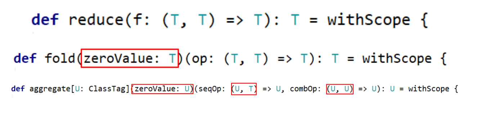

first():取RDD的第一个元素

take(n):取RDD的前n个元素

top(n):按照默认或者指定排序规则，返回前n个元素

takeSample(withReplacement, num, [seed]):返回采样的数据

foreach(func) / foreachPartition(func):与map、mapPartitions类似，区别是 foreach 是 Action

saveAsTextFile(path) / saveAsSequenceFile(path) / saveAsObjectFile(path)

```shell
# stats:返回统计信息的，只能作用于RDD[Double]类型上调用
scala> val rdd1 = sc.range(1,101)
rdd1: org.apache.spark.rdd.RDD[Long] = MapPartitionsRDD[1] at range at <console>:24

scala> rdd1.stats
res0: org.apache.spark.util.StatCounter = (count: 100, mean: 50.500000, stdev: 28.866070, max: 100.000000, min: 1.000000)

scala> val rdd2 =sc.range(1,101)
rdd2: org.apache.spark.rdd.RDD[Long] = MapPartitionsRDD[5] at range at <console>:24
# 不能调用
scala> rdd1.zip(rdd2).stats
<console>:28: error: value stats is not a member of org.apache.spark.rdd.RDD[(Long, Long)]
       rdd1.zip(rdd2).stats
                      ^
# count在各种类型的RDD上，均能调用
scala> rdd1.zip(rdd2).count
res2: Long = 100
# 获取第一个元素
scala> rdd1.zip(rdd2).first
res3: (Long, Long) = (1,1)
# 获取前十个元素
scala> rdd1.zip(rdd2).take(10)
res4: Array[(Long, Long)] = Array((1,1), (2,2), (3,3), (4,4), (5,5), (6,6), (7,7), (8,8), (9,9), (10,10))
# 对rdd1中的元素求和
scala> rdd1.reduce(_ +_)
res5: Long = 5050

scala> rdd1.fold(0)(_+_)
res6: Long = 5050

scala> rdd1.fold(1)(_+_)
res7: Long = 5053

scala> rdd1.getNumPartitions
res8: Int = 2

scala> val rdd = sc.makeRDD(1 to 10,2)
rdd: org.apache.spark.rdd.RDD[Int] = ParallelCollectionRDD[0] at makeRDD at <console>:24

scala> rdd.getNumPartitions
res0: Int = 2

scala> rdd.reduce(_ + _)
res1: Int = 55

scala> rdd.reduce((x,y) =>{
     | println(s"x:$x,y:$y")
     | x+y
     | })
x:6,y:7
x:13,y:8
x:21,y:9
x:30,y:10
x:1,y:2
x:3,y:3
x:6,y:4
x:10,y:5
x:40,y:15
res2: Int = 55

scala> rdd.fold(1)(_+_)
res3: Int = 58
#fold(初始值)(局部汇总和全局汇总要用到的函数)
scala> rdd.fold(1)((x,y) => {
     | println(s"x:$x,y:$y")
     | x + y
     | })
x:1,y:1
x:2,y:2
x:4,y:3
x:7,y:4
x:11,y:5
x:1,y:6
x:7,y:7
x:14,y:8
x:22,y:9
x:31,y:10
x:1,y:16
x:17,y:41
res4: Int = 58
# aggregate(初始值)((局部汇总的函数),(全局汇总的函数))
scala> rdd.aggregate(1)(_+_,_+_)
res5: Int = 58

scala> rdd.aggregate(1)((x,y) =>{
     |  println(s"x:$x,y:$y")
     | x+y
     | }
     | ,
     | (a,b) => {
     | println(s"a:$a,b:$b")
     | a+b
     | })
x:1,y:1
x:2,y:2
x:4,y:3
x:7,y:4
x:11,y:5
a:1,b:16
x:1,y:6
x:7,y:7
x:14,y:8
x:22,y:9
x:31,y:10
a:17,b:41
res6: Int = 58
```

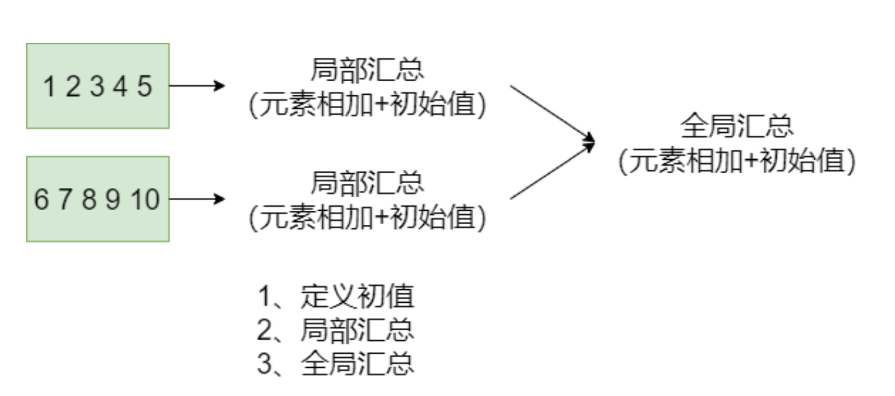


first、take(n)、top(n)

```shell
scala> val rdd = sc.range(1,101)
rdd: org.apache.spark.rdd.RDD[Long] = MapPartitionsRDD[1] at range at <console>:24
#取出第一个元素
scala> rdd.first
res0: Long = 1
# 取出前十个元素
scala> rdd.take(10)
res1: Array[Long] = Array(1, 2, 3, 4, 5, 6, 7, 8, 9, 10)
#倒序后，取出前20个元素
scala> rdd.top(20)
res3: Array[Long] = Array(100, 99, 98, 97, 96, 95, 94, 93, 92, 91, 90, 89, 88, 87, 86, 85, 84, 83, 82, 81)

scala> val random = scala.util.Random
random: util.Random.type = scala.util.Random$@34f9275f

scala> var rdd1 = (1 to 100).map(x => random.nextInt(200))
rdd1: scala.collection.immutable.IndexedSeq[Int] = Vector(100, 97, 145, 12, 156, 82, 70, 67, 84, 152, 39, 10, 164, 138, 174, 176, 182, 111, 171, 129, 191, 145, 190, 114, 177, 193, 139, 163, 134, 188, 193, 14, 91, 66, 143, 91, 6, 39, 51, 86, 62, 179, 121, 16, 94, 76, 116, 193, 85, 155, 108, 176, 69, 92, 20, 121, 173, 94, 150, 93, 86, 59, 62, 40, 30, 162, 64, 43, 156, 176, 6, 41, 154, 53, 186, 47, 88, 10, 21, 181, 74, 112, 153, 1, 56, 11, 17, 42, 94, 182, 171, 194, 23, 16, 167, 165, 123, 133, 71, 198)

scala> val rdd = sc.makeRDD(rdd1)
rdd: org.apache.spark.rdd.RDD[Int] = ParallelCollectionRDD[3] at makeRDD at <console>:26

scala> rdd.take(10)
res5: Array[Int] = Array(100, 97, 145, 12, 156, 82, 70, 67, 84, 152)

scala> rdd.top(10)
res6: Array[Int] = Array(198, 194, 193, 193, 193, 191, 190, 188, 186, 182)
#采样，第一个参数为是否返回，第二个位获取几个数据，第三个位随机算子
scala> rdd.takeSample(true,10)
res7: Array[Int] = Array(84, 143, 56, 129, 163, 11, 190, 176, 177, 12)

scala> rdd.takeSample(true,40)
res8: Array[Int] = Array(134, 167, 86, 94, 12, 177, 69, 139, 53, 30, 163, 181, 177, 94, 176, 134, 150, 30, 16, 133, 193, 121, 67, 163, 76, 182, 145, 16, 93, 91, 10, 123, 171, 163, 39, 111, 181, 10, 94, 150)

scala> rdd.takeSample(false,40)
res9: Array[Int] = Array(134, 121, 86, 108, 198, 111, 171, 6, 30, 155, 121, 116, 171, 176, 153, 145, 114, 1, 43, 74, 66, 56, 41, 177, 156, 47, 191, 88, 53, 179, 64, 176, 138, 129, 84, 194, 123, 70, 163, 93)
```

foreach(func)

```
scala> rdd.foreach(_+1)

scala> rdd.collect
res11: Array[Int] = Array(100, 97, 145, 12, 156, 82, 70, 67, 84, 152, 39, 10, 164, 138, 174, 176, 182, 111, 171, 129, 191, 145, 190, 114, 177, 193, 139, 163, 134, 188, 193, 14, 91, 66, 143, 91, 6, 39, 51, 86, 62, 179, 121, 16, 94, 76, 116, 193, 85, 155, 108, 176, 69, 92, 20, 121, 173, 94, 150, 93, 86, 59, 62, 40, 30, 162, 64, 43, 156, 176, 6, 41, 154, 53, 186, 47, 88, 10, 21, 181, 74, 112, 153, 1, 56, 11, 17, 42, 94, 182, 171, 194, 23, 16, 167, 165, 123, 133, 71, 198)

scala> val rdd = sc.makeRDD(1 to 10)
rdd: org.apache.spark.rdd.RDD[Int] = ParallelCollectionRDD[8] at makeRDD at <console>:24

scala> rdd.getNumPartitions
res12: Int = 2

scala> rdd.foreach(x => {
     | println(x+1)
     | }
     | )
2
3
4
5
6
7
8
9
10
11

```

foreachPartition(func)

```shell
scala> val rdd = sc.makeRDD(1 to 10)
rdd: org.apache.spark.rdd.RDD[Int] = ParallelCollectionRDD[0] at makeRDD at <console>:24

scala> rdd.foreachPartition
   def foreachPartition(f: Iterator[Int] => Unit): Unit

scala>rdd.foreachPartition(iter => iter.foreach(println(_)))
[Stage 0:>                                                          (0 + 2) / 2]
1
2
3
4
5
6
7
8
9
10
```

saveAsTextFile

```shell
scala> rdd.collect
res1: Array[Int] = Array(1, 2, 3, 4, 5, 6, 7, 8, 9, 10)

scala> rdd.getNumPartitions
res2: Int = 2
#存放到HDFS中，一个分区就存一个文件，容易出现小文件问题（t1目录下就是两个文件）
scala> rdd.saveAsTextFile("/spark-test/t1")
#存放到HDFS中，一个分区就存一个文件，容易出现小文件问题（t1目录下就是一个文件）
scala> rdd.coalesce(1).saveAsTextFile("/spark-test/t2")
```

#### Key-Value RDD操作

RDD整体上分为Value类型和Key-Value类型，前面介绍的是Value类型RDD操作，实际使用更多的是key-value类型的RDD，也被称为pariRDD。value类型RDD的操作基本集中在RDD.scala中，key-value类型的RDD操作集中在PairRDDFunctions.scala中

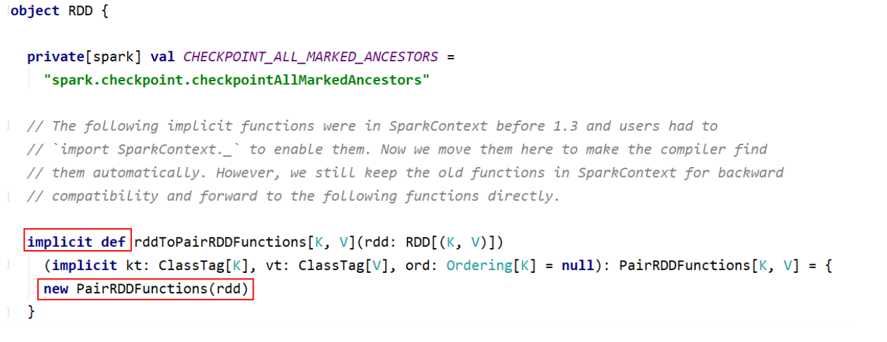

前面介绍的大多数算子对Pair RDD都是有效的，Pair RDD还有属于自己的Transformation、Action算子

###### 创建PairRDD

```shell
scala> val rdd = sc.makeRDD(1 to 10)
rdd: org.apache.spark.rdd.RDD[Int] = ParallelCollectionRDD[0] at makeRDD at <console>:24

scala> rdd.collect
res0: Array[Int] = Array(1, 2, 3, 4, 5, 6, 7, 8, 9, 10)

scala> val arr = (1 to 10).toArray
arr: Array[Int] = Array(1, 2, 3, 4, 5, 6, 7, 8, 9, 10)

scala> val arr1 = arr.map(x =>(x,x * 10,x* 100))
arr1: Array[(Int, Int, Int)] = Array((1,10,100), (2,20,200), (3,30,300), (4,40,400), (5,50,500), (6,60,600), (7,70,700), (8,80,800), (9,90,900), (10,100,1000))
# rdd不是 Pari RDD
scala> val rdd = sc.makeRDD(arr1)
rdd: org.apache.spark.rdd.RDD[(Int, Int, Int)] = ParallelCollectionRDD[1] at makeRDD at <console>:26

scala> rdd.first
res1: (Int, Int, Int) = (1,10,100)
# res2 是Pari RDD
scala> rdd.map(x => (x._1,(x._2,x._3))).take(3)
res2: Array[(Int, (Int, Int))] = Array((1,(10,100)), (2,(20,200)), (3,(30,300)))

scala> rdd.map(x => (x._1,(x._2,x._3))).collectAsMap
res4: scala.collection.Map[Int,(Int, Int)] = Map(8 -> (80,800), 2 -> (20,200), 5 -> (50,500), 4 -> (40,400), 7 -> (70,700), 10 -> (100,1000), 1 -> (10,100), 9 -> (90,900), 3 -> (30,300), 6 -> (60,600))

```

###### Transformation操作

类似Map操作

mapValues/flatMapValues/keys/values，这些操作都可以使用map操作实现，是简化操作。

mapValues:直接操作map的values

flatMapValues：操作完values值后，在将值拉平

```shell
scala> val a = sc.parallelize(List((1,2),(3,4),(5,6)))
a: org.apache.spark.rdd.RDD[(Int, Int)] = ParallelCollectionRDD[4] at parallelize at <console>:24

scala> a.collect
res5: Array[(Int, Int)] = Array((1,2), (3,4), (5,6))

scala> a.collectAsMap
res6: scala.collection.Map[Int,Int] = Map(5 -> 6, 1 -> 2, 3 -> 4)

scala> rdd.map(x => (x._1,(x._2,x._3))).collect
res8: Array[(Int, (Int, Int))] = Array((1,(10,100)), (2,(20,200)), (3,(30,300)), (4,(40,400)), (5,(50,500)), (6,(60,600)), (7,(70,700)), (8,(80,800)), (9,(90,900)), (10,(100,1000)))

scala> val b = a.mapValues(x => ( 1 to x))
b: org.apache.spark.rdd.RDD[(Int, scala.collection.immutable.Range.Inclusive)] = MapPartitionsRDD[6] at mapValues at <console>:25

scala> b.collect
res9: Array[(Int, scala.collection.immutable.Range.Inclusive)] = Array((1,Range 1 to 2), (3,Range 1 to 4), (5,Range 1 to 6))

scala> val c = a.map(x => (x._1,1 to x._2))
c: org.apache.spark.rdd.RDD[(Int, scala.collection.immutable.Range.Inclusive)] = MapPartitionsRDD[7] at map at <console>:25

scala> c.collect
res10: Array[(Int, scala.collection.immutable.Range.Inclusive)] = Array((1,Range 1 to 2), (3,Range 1 to 4), (5,Range 1 to 6))

scala> val d = a.map{case(k,v) => (k,1 to v)}
d: org.apache.spark.rdd.RDD[(Int, scala.collection.immutable.Range.Inclusive)] = MapPartitionsRDD[8] at map at <console>:25

scala> d.collect
res11: Array[(Int, scala.collection.immutable.Range.Inclusive)] = Array((1,Range 1 to 2), (3,Range 1 to 4), (5,Range 1 to 6))

scala> val e = a.flatMapValues(x => 1 to x)
e: org.apache.spark.rdd.RDD[(Int, Int)] = MapPartitionsRDD[9] at flatMapValues at <console>:25

scala> e.collect
res12: Array[(Int, Int)] = Array((1,1), (1,2), (3,1), (3,2), (3,3), (3,4), (5,1), (5,2), (5,3), (5,4), (5,5), (5,6))

scala> val f = a.map(x => (x._1,1 to x._2)).collect
f: Array[(Int, scala.collection.immutable.Range.Inclusive)] = Array((1,Range 1 to 2), (3,Range 1 to 4), (5,Range 1 to 6))


scala> val f = a.map(x => (x._1,1 to x._2)).flatMap{case (k ,v) => v.map(elem => (k,elem))}
f: org.apache.spark.rdd.RDD[(Int, Int)] = MapPartitionsRDD[12] at flatMap at <console>:25

scala> f.collect
res13: Array[(Int, Int)] = Array((1,1), (1,2), (3,1), (3,2), (3,3), (3,4), (5,1), (5,2), (5,3), (5,4), (5,5), (5,6))

scala> f.keys.collect
res14: Array[Int] = Array(1, 1, 3, 3, 3, 3, 5, 5, 5, 5, 5, 5)

scala> f.values.collect
res15: Array[Int] = Array(1, 2, 1, 2, 3, 4, 1, 2, 3, 4, 5, 6)

scala> f.map{case(k,y) => k}
res16: org.apache.spark.rdd.RDD[Int] = MapPartitionsRDD[15] at map at <console>:26

scala> f.map{case(k,y) => k}.collect
res17: Array[Int] = Array(1, 1, 3, 3, 3, 3, 5, 5, 5, 5, 5, 5)

scala> f.map{case(k,v) => v}.collect
res19: Array[Int] = Array(1, 2, 1, 2, 3, 4, 1, 2, 3, 4, 5, 6)

scala> f.map(x=> x._1).collect
res20: Array[Int] = Array(1, 1, 3, 3, 3, 3, 5, 5, 5, 5, 5, 5)

scala> f.map{case(k,_) => k}
res21: org.apache.spark.rdd.RDD[Int] = MapPartitionsRDD[19] at map at <console>:26

scala> f.map{case(k,_) => k}.collect
res23: Array[Int] = Array(1, 1, 3, 3, 3, 3, 5, 5, 5, 5, 5, 5)
```

###### 聚合操作

PariRDD（k，v）使用范围广，聚合

groupByKey/reduceByKey/foldByKey/aggregateByKey

combineByKey(OLD)/combineByKeyWithClassTag(NEW) => 底层的实现

subtractByKey:类似subtract，删掉RDD中健与other RDD中的健相同的元素

小案例:给定一组数据:("spark", 12), ("hadoop", 26), ("hadoop", 23), ("spark", 15), ("scala", 26), ("spark", 25), ("spark", 23), ("hadoop", 16), ("scala", 24), ("spark", 16)， 键值对的key表示图书名称，value表示某天图书销量。计算每个键对应的平均 值，也就是计算每种图书的每天平均销量。

```shell
scala> val rdd = sc.makeRDD(Array(("spark", 12), ("hadoop", 26), ("hadoop", 23), ("spark", 15), ("scala", 26), ("spark", 25), ("spark", 23), ("hadoop", 16), ("scala", 24), ("spark", 16)))
rdd: org.apache.spark.rdd.RDD[(String, Int)] = ParallelCollectionRDD[0] at makeRDD at <console>:24
# groupByKey
scala> rdd.groupByKey
res0: org.apache.spark.rdd.RDD[(String, Iterable[Int])] = ShuffledRDD[1] at groupByKey at <console>:26

scala> rdd.groupByKey.collect
res1: Array[(String, Iterable[Int])] = Array((scala,CompactBuffer(26, 24)), (spark,CompactBuffer(12, 15, 25, 23, 16)), (hadoop,CompactBuffer(26, 23, 16)))

scala> rdd.groupByKey.mapValues(x => (x.toArray.sum/x.size))
res5: org.apache.spark.rdd.RDD[(String, Int)] = MapPartitionsRDD[6] at mapValues at <console>:26

scala> rdd.groupByKey.mapValues(x => (x.toArray.sum/x.size)).collect
res6: Array[(String, Int)] = Array((scala,25), (spark,18), (hadoop,21))

scala>  rdd.groupByKey.map(x =>(x._1,x._2.sum) )
res7: org.apache.spark.rdd.RDD[(String, Int)] = MapPartitionsRDD[10] at map at <console>:26

scala>  rdd.groupByKey.map(x =>(x._1,x._2.sum / x._2.size) )
res8: org.apache.spark.rdd.RDD[(String, Int)] = MapPartitionsRDD[12] at map at <console>:26

scala>  rdd.groupByKey.map(x =>(x._1,x._2.sum / x._2.size) ).collect
res9: Array[(String, Int)] = Array((scala,25), (spark,18), (hadoop,21))

scala>  rdd.groupByKey.map(x =>(x._1,x._2.sum.toDouble / x._2.size) ).collect
res10: Array[(String, Double)] = Array((scala,25.0), (spark,18.2), (hadoop,21.666666666666668))

scala> rdd.groupByKey.map{case (k,v) => (k,v.sum * 1.0 / v.size)}
res11: org.apache.spark.rdd.RDD[(String, Double)] = MapPartitionsRDD[18] at map at <console>:26

scala> rdd.groupByKey.map{case (k,v) => (k,v.sum * 1.0 / v.size)}.collect
res12: Array[(String, Double)] = Array((scala,25.0), (spark,18.2), (hadoop,21.666666666666668))

scala> rdd.groupByKey.mapValues(v => v.sum * 1.0 / v.size)
res13: org.apache.spark.rdd.RDD[(String, Double)] = MapPartitionsRDD[22] at mapValues at <console>:26

scala> rdd.groupByKey.mapValues(v => v.sum * 1.0 / v.size).collect
res14: Array[(String, Double)] = Array((scala,25.0), (spark,18.2), (hadoop,21.666666666666668))

scala> rdd.reduceByKey(_+_).collect
res16: Array[(String, Int)] = Array((scala,50), (spark,91), (hadoop,65))

scala> rdd.mapValues(x => (x,1)).collect
res0: Array[(String, (Int, Int))] = Array((spark,(12,1)), (hadoop,(26,1)), (hadoop,(23,1)), (spark,(15,1)), (scala,(26,1)), (spark,(25,1)), (spark,(23,1)), (hadoop,(16,1)), (scala,(24,1)), (spark,(16,1)))

# reduceByKey
scala> rdd.mapValues(x => (x,1)).reduceByKey((x,y) =>(x._1 + y._1,y._1 + x._1))
res1: org.apache.spark.rdd.RDD[(String, (Int, Int))] = ShuffledRDD[3] at reduceByKey at <console>:26

scala> rdd.mapValues(x => (x,1)).reduceByKey((x,y) =>(x._1 + y._1,y._1 + x._1)).collect
res2: Array[(String, (Int, Int))] = Array((scala,(50,50)), (spark,(91,91)), (hadoop,(65,65)))

scala> rdd.mapValues(x => (x,1)).reduceByKey((x,y) =>(x._1 + y._1,y._2 + x._2)).collect
res3: Array[(String, (Int, Int))] = Array((scala,(50,2)), (spark,(91,5)), (hadoop,(65,3)))

scala> rdd.mapValues(x => (x,1)).reduceByKey((x,y) =>(x._1 + y._1,y._2 + x._2)).mapValues(v => v._1.toDouble / v._2)
res4: org.apache.spark.rdd.RDD[(String, Double)] = MapPartitionsRDD[10] at mapValues at <console>:26

scala> rdd.mapValues(x => (x,1)).reduceByKey((x,y) =>(x._1 + y._1,y._2 + x._2)).mapValues(v => v._1.toDouble / v._2).collect
res5: Array[(String, Double)] = Array((scala,25.0), (spark,18.2), (hadoop,21.666666666666668))

scala> rdd.mapValues(x =>(x,1)).collect
res6: Array[(String, (Int, Int))] = Array((spark,(12,1)), (hadoop,(26,1)), (hadoop,(23,1)), (spark,(15,1)), (scala,(26,1)), (spark,(25,1)), (spark,(23,1)), (hadoop,(16,1)), (scala,(24,1)), (spark,(16,1)))
#foldByKey
scala> rdd.mapValues(x => (x,1)).foldByKey((0,0))((x,y) =>(x._1 + y._1,y._2 + x._2)).mapValues(v => v._1.toDouble / v._2).collect
res10: Array[(String, Double)] = Array((scala,25.0), (spark,18.2), (hadoop,21.666666666666668))
```

aggregateByKey => 定义初值 + 分区内的聚合函数+分区间的聚合函数

```shell
rdd.mapValues(x => (x,1)).aggregateByKey((0,0))((x,y) =>(x._1 + y._1,y._2 + x._2),(a,b) =>(a._1 + b._1,a._2 + b._2)).mapValues(v => v._1.toDouble / v._2).collect

## 初值（这里是元组）可以与RDD元素类型（Int）可以不一致，此时的x就是（0，0）元组，y就是RDD的元素（Int）
scala> rdd.aggregateByKey((0,0))(
     | (x,y) =>(x._1 + y,x._2 + 1),
     | (a,b) => (a._1 + b._1 ,a._2 + b._2))
res29: org.apache.spark.rdd.RDD[(String, (Int, Int))] = ShuffledRDD[30] at aggregateByKey at <console>:26

scala> rdd.aggregateByKey((0,0))(
     | (x,y) =>(x._1 + y,x._2 + 1),
     | (a,b) => (a._1 + b._1 ,a._2 + b._2)).collect
res30: Array[(String, (Int, Int))] = Array((scala,(50,2)), (spark,(91,5)), (hadoop,(65,3)))

scala> rdd.aggregateByKey((0,0))(
     | (x,y) =>(x._1 + y,x._2 + 1),
     | (a,b) => (a._1 + b._1 ,a._2 + b._2)).mapValues(x => (x._1.toD))
toDegrees   toDouble
     | (a,b) => (a._1 + b._1 ,a._2 + b._2)).mapValues(x => (x._1.toDouble / x._2))
res31: org.apache.spark.rdd.RDD[(String, Double)] = MapPartitionsRDD[33] at mapValues at <console>:28

scala> rdd.aggregateByKey((0,0))(
     | (x,y) =>(x._1 + y,x._2 + 1),
     | (a,b) => (a._1 + b._1 ,a._2 + b._2)).mapValues(x => (x._1.toDouble / x._2)).collect
res32: Array[(String, Double)] = Array((scala,25.0), (spark,18.2), (hadoop,21.666666666666668))

scala> rdd.aggregateByKey(scala.collection.mutable.ArrayBuffer[Int]())((x,y) => {x.append(y);x},(a,b) => a++b).collect
res34: Array[(String, scala.collection.mutable.ArrayBuffer[Int])] = Array((scala,ArrayBuffer(26, 24)), (spark,ArrayBuffer(12, 15, 25, 23, 16)), (hadoop,ArrayBuffer(26, 23, 16)))

scala> rdd.aggregateByKey(scala.collection.mutable.ArrayBuffer[Int]())((x,y) => {x.append(y);x},(a,b) => a++b).mapValues(x => (x.sum.toDouble / x.size)).collect
res36: Array[(String, Double)] = Array((scala,25.0), (spark,18.2), (hadoop,21.666666666666668))


scala> rdd.aggregateByKey((0,0))((x,y) => (x._1 + y,x._2 + 1),(a,b) => (a._1 + b._1,a._2 + b._2)).collect
res37: Array[(String, (Int, Int))] = Array((scala,(50,2)), (spark,(91,5)), (hadoop,(65,3)))


# 分区内的合并和分区间的合并，可以采用不同的方式
scala> rdd.aggregateByKey(scala.collection.mutable.ArrayBuffer[Int]())((x,y) => {x.append(y);x},(a,b) => a++b).mapValues(x => (x.sum.toDouble / x.size)).collect
res36: Array[(String, Double)] = Array((scala,25.0), (spark,18.2), (hadoop,21.666666666666668))
# 此时x就是（0，0）元组，y就是rdd的元素（int）
scala> rdd.aggregateByKey((0,0))((x,y) => (x._1 + y,x._2 + 1),(a,b) => (a._1 + b._1,a._2 + b._2)).collect
res37: Array[(String, (Int, Int))] = Array((scala,(50,2)), (spark,(91,5)), (hadoop,(65,3)))

# combineByKey
scala> rdd.combineByKey(
     | (x:Int) => (x,1), # 初始值，相当于上面做的一个map(x => (x,1))的一个操作
     | (x:(Int,Int),y:Int)=>(x._1 + y, x._2 +1), # 分区内的聚合
     # 分区间的聚合
     | (a:(Int,Int),b:(Int,Int)) => (a._1 + b._1,a._2 + b._2)).collect
res40: Array[(String, (Int, Int))] = Array((scala,(50,2)), (spark,(91,5)), (hadoop,(65,3)))

## subtractByKey
scala> val rdd1 = sc.makeRDD(Array(("spark", 12), ("hadoop", 26), ("hadoop", 23), ("spark", 15)))
rdd1: org.apache.spark.rdd.RDD[(String, Int)] = ParallelCollectionRDD[41] at makeRDD at <console>:24

scala> val rdd2 = sc.makeRDD(Array(("spark", 100), ("hadoop", 300)))
rdd2: org.apache.spark.rdd.RDD[(String, Int)] = ParallelCollectionRDD[42] at makeRDD at <console>:24

scala> rdd1.subtractByKey(rdd2).collect
res42: Array[(String, Int)] = Array()

scala> val rdd = sc.makeRDD(Array(("a",1), ("b",2), ("c",3), ("a",5), ("d",5)))
rdd: org.apache.spark.rdd.RDD[(String, Int)] = ParallelCollectionRDD[45] at makeRDD at <console>:24
                                                                      ^
scala> val other = sc.makeRDD(Array(("a",10), ("b",20), ("c",30)))
other: org.apache.spark.rdd.RDD[(String, Int)] = ParallelCollectionRDD[46] at makeRDD at <console>:24

scala> rdd.subtractByKey(other).collect
res44: Array[(String, Int)] = Array((d,5))

```

**结论：效率相等的情况下，使用最熟悉的方法；groupByKey一般情况下，效率低，尽量少用。**

**初学者考虑实现，如果使用的groupByKey，寻找代替的算子实现。**

###### 为什么groupByKey的效率低

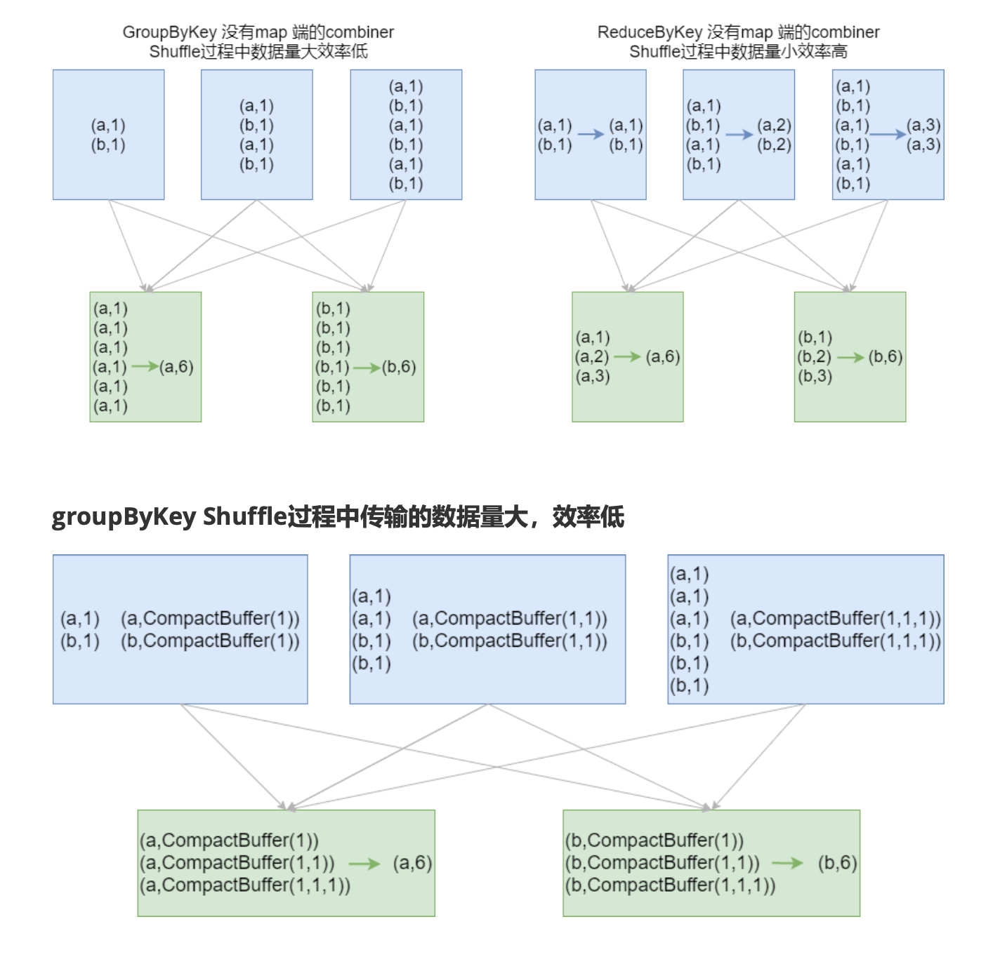

ReduceByKey 和 groupByKey的相同点和不同点：

相同点：

* 都作用于RDD[K,V]
* 都是根据key来进行分组聚合
* 默认分区数量不变，但是可以通过参数指定分区数量

不同点：

* groupByKey没有默认的聚合函数，得到的返回值类型是RDD[k,Iterable[v]]
* reduceByKey必须传聚合函数，返回值类型是RDD[k,聚合后的V]
* groupByKey.map() = reduceByKey

###### 排序操作

sortByKey:sortByKey作用于PariRDD函数，对Key进行排序，在org.apache.spark.rdd.OrderedRDDFunctions 中实现:

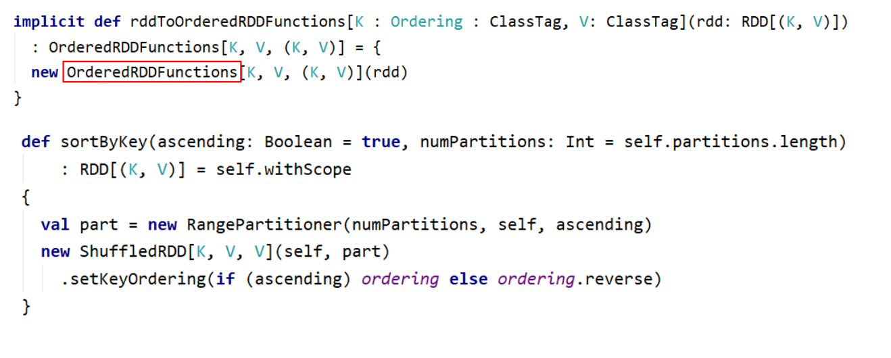

```shell
scala> val a = sc.makeRDD(List("wyp","spark","hadoop","123321","hive"))
a: org.apache.spark.rdd.RDD[String] = ParallelCollectionRDD[0] at makeRDD at <console>:24                        ^

scala> val b = sc.makeRDD(1 to a.count.toInt)
b: org.apache.spark.rdd.RDD[Int] = ParallelCollectionRDD[1] at makeRDD at <console>:26

scala> val c = a.zip(b)
c: org.apache.spark.rdd.RDD[(String, Int)] = ZippedPartitionsRDD2[2] at zip at <console>:27

scala> c.collect
res1: Array[(String, Int)] = Array((wyp,1), (spark,2), (hadoop,3), (123321,4), (hive,5))

scala> c.sortByKey().collect
res3: Array[(String, Int)] = Array((123321,4), (hadoop,3), (hive,5), (spark,2), (wyp,1))

scala> c.sortByKey(false).collect
res4: Array[(String, Int)] = Array((wyp,1), (spark,2), (hive,5), (hadoop,3), (123321,4))
```

###### join操作

cogroup/join/leftOuterJoin/rightOuterJoin/fullOuterJoin

源码：

```scala
  /**
   * Return an RDD containing all pairs of elements with matching keys in `this` and `other`. Each
   * pair of elements will be returned as a (k, (v1, v2)) tuple, where (k, v1) is in `this` and
   * (k, v2) is in `other`. Uses the given Partitioner to partition the output RDD.
   */
  def join[W](other: RDD[(K, W)], partitioner: Partitioner): RDD[(K, (V, W))] = self.withScope {
    this.cogroup(other, partitioner).flatMapValues( pair =>
      for (v <- pair._1.iterator; w <- pair._2.iterator) yield (v, w)
    )
  }
```

练习：

```shell

scala> val rdd1 = sc.makeRDD(Array((1,"Spark"), (2,"Hadoop"), (3,"Kylin"), (4,"Flink")))
rdd1: org.apache.spark.rdd.RDD[(Int, String)] = ParallelCollectionRDD[0] at makeRDD at <console>:24

scala> val rdd2 = sc.makeRDD(Array((3,"李四"), (4,"王五"), (5,"赵六"), (6,"冯七")))
rdd2: org.apache.spark.rdd.RDD[(Int, String)] = ParallelCollectionRDD[1] at makeRDD at <console>:24

#cogroup
scala> val rdd3 = rdd1.cogroup(rdd2)
rdd3: org.apache.spark.rdd.RDD[(Int, (Iterable[String], Iterable[String]))] = MapPartitionsRDD[3] at cogroup at <console>:27

scala> rdd3.collect
res0: Array[(Int, (Iterable[String], Iterable[String]))] = Array((4,(CompactBuffer(Flink),CompactBuffer(王五))), (6,(CompactBuffer(),CompactBuffer(冯七))), (2,(CompactBuffer(Hadoop),CompactBuffer())), (1,(CompactBuffer(Spark),CompactBuffer())), (3,(CompactBuffer(Kylin),CompactBuffer(李四))), (5,(CompactBuffer(),CompactBuffer(赵六))))

scala> rdd3.foreach(println)
(4,(CompactBuffer(Flink),CompactBuffer(王五)))
(6,(CompactBuffer(),CompactBuffer(冯七)))
(2,(CompactBuffer(Hadoop),CompactBuffer()))
(1,(CompactBuffer(Spark),CompactBuffer()))
(3,(CompactBuffer(Kylin),CompactBuffer(李四)))
(5,(CompactBuffer(),CompactBuffer(赵六)))
# leftOuterJoin
scala> rdd1.leftOuterJoin(rdd2).collect
res2: Array[(Int, (String, Option[String]))] = Array((4,(Flink,Some(王五))), (2,(Hadoop,None)), (1,(Spark,None)), (3,(Kylin,Some(李四))))
# rightOuterJoin
scala> rdd1.rightOuterJoin(rdd2).collect
res3: Array[(Int, (Option[String], String))] = Array((4,(Some(Flink),王五)), (6,(None,冯七)), (3,(Some(Kylin),李四)), (5,(None,赵六)))
# fullOuterJoin
scala> rdd1.fullOuterJoin(rdd2).collect
res4: Array[(Int, (Option[String], Option[String]))] = Array((4,(Some(Flink),Some(王五))), (6,(None,Some(冯七))), (2,(Some(Hadoop),None)), (1,(Some(Spark),None)), (3,(Some(Kylin),Some(李四))), (5,(None,Some(赵六))))
# join
scala> rdd1.join(rdd2).collect
res5: Array[(Int, (String, String))] = Array((4,(Flink,王五)), (3,(Kylin,李四)))
# join 实际上调用的就是cogroup，
scala> rdd1.cogroup(rdd2).flatMapValues( pair =>
     |       for (v <- pair._1.iterator; w <- pair._2.iterator) yield (v, w)
     |     )
res8: org.apache.spark.rdd.RDD[(Int, (String, String))] = MapPartitionsRDD[18] at flatMapValues at <console>:28

```

测试上面的那个for循环代码：

```scala
def main(args: Array[String]): Unit = {

  val arrayBuffer = scala.collection.mutable.Map[Int, (ArrayBuffer[String], ArrayBuffer[String])]()
  //    (4,(CompactBuffer(Flink),CompactBuffer(王五)))
  //    (6,(CompactBuffer(),CompactBuffer(冯七)))
  //    (2,(CompactBuffer(Hadoop),CompactBuffer()))
  //    (1,(CompactBuffer(Spark),CompactBuffer()))
  //    (3,(CompactBuffer(Kylin),CompactBuffer(李四)))
  //    (5,(CompactBuffer(),CompactBuffer(赵六)))
  arrayBuffer(4) = (ArrayBuffer("Flink"), ArrayBuffer("王五"))
  arrayBuffer(6) = (ArrayBuffer(), ArrayBuffer("冯七"))
  arrayBuffer(2) = (ArrayBuffer("Hadoop"), ArrayBuffer())
  arrayBuffer(1) = (ArrayBuffer("Spark"), ArrayBuffer())
  arrayBuffer(3) = (ArrayBuffer("Kylin"), ArrayBuffer("李四"))
  arrayBuffer(5) = (ArrayBuffer(), ArrayBuffer("赵六"))
  val intToTuples = arrayBuffer.mapValues(v => for (i <- v._1; j <- v._2)
                                          yield (i, j)
                                         )
  println(arrayBuffer)
  println("*" * 15)
  println(intToTuples)
}
```

输出：

```scala
Map(2 -> (ArrayBuffer(Hadoop),ArrayBuffer()), 5 -> (ArrayBuffer(),ArrayBuffer(赵六)), 4 -> (ArrayBuffer(Flink),ArrayBuffer(王五)), 1 -> (ArrayBuffer(Spark),ArrayBuffer()), 3 -> (ArrayBuffer(Kylin),ArrayBuffer(李四)), 6 -> (ArrayBuffer(),ArrayBuffer(冯七)))
***************
Map(2 -> ArrayBuffer(), 5 -> ArrayBuffer(), 4 -> ArrayBuffer((Flink,王五)), 1 -> ArrayBuffer(), 3 -> ArrayBuffer((Kylin,李四)), 6 -> ArrayBuffer())

然后再使用下面的输出去过，进行flatMap
```

###### Action操作

collectAsMap、countByKey、lookup(key)

collectAsMap:

```shell
scala> val rdd1 = sc.makeRDD(Array((1,"Spark"), (2,"Hadoop"), (3,"Kylin"), (4,"Flink")))
rdd1: org.apache.spark.rdd.RDD[(Int, String)] = ParallelCollectionRDD[0] at makeRDD at <console>:24

scala> val rdd2 = sc.makeRDD(Array((3,"李四"), (4,"王五"), (5,"赵六"), (6,"冯七")))
rdd2: org.apache.spark.rdd.RDD[(Int, String)] = ParallelCollectionRDD[1] at makeRDD at <console>:24

scala> val rdd3 = rdd1.join(rdd2)
rdd3: org.apache.spark.rdd.RDD[(Int, (String, String))] = MapPartitionsRDD[4] at join at <console>:27

scala> rdd3.collectAsMap
res0: scala.collection.Map[Int,(String, String)] = Map(4 -> (Flink,王五), 3 -> (Kylin,李四))
```

countByKey

源码：

```scala
 /**
   * Count the number of elements for each key, collecting the results to a local Map.
   *
   * @note This method should only be used if the resulting map is expected to be small, as
   * the whole thing is loaded into the driver's memory.
   * To handle very large results, consider using rdd.mapValues(_ => 1L).reduceByKey(_ + _), which
   * returns an RDD[T, Long] instead of a map.
   */
  def countByKey(): Map[K, Long] = self.withScope {
    //将每个key对应的value设置为1，然后对相同的key进行聚合
    self.mapValues(_ => 1L).reduceByKey(_ + _).collect().toMap
  }
```

演示

```shell
scala> rdd3.countByKey
res2: scala.collection.Map[Int,Long] = Map(4 -> 1, 3 -> 1)
```

lookup(key):高效的查找方法，只查找对应分区的数据(如果RDD有分区器的话)

源码：

```scala
/**
* Return the list of values in the RDD for key `key`. This operation is done efficiently if the
* RDD has a known partitioner by only searching the partition that the key maps to.
* 如果改rdd有分区器，该方法会效率高，因为只查询一个分区，否则会查询所有的元素
*/
def lookup(key: K): Seq[V] = self.withScope {
  self.partitioner match {
    case Some(p) =>
    val index = p.getPartition(key)
    val process = (it: Iterator[(K, V)]) => {
      val buf = new ArrayBuffer[V]
      for (pair <- it if pair._1 == key) {
        buf += pair._2
      }
      buf
    } : Seq[V]
    val res = self.context.runJob(self, process, Array(index))
    res(0)
    case None =>
    self.filter(_._1 == key).map(_._2).collect()
  }
}
```

演示：

```shell
scala> val rdd1 = sc.makeRDD(Array(("1","Spark"),("2","Hadoop"), ("3","Scala"),("1","Java")))
rdd1: org.apache.spark.rdd.RDD[(String, String)] = ParallelCollectionRDD[7] at makeRDD at <console>:24

scala> rdd1.lookup("1")
res3: Seq[String] = WrappedArray(Spark, Java)
```

### 输入与输出

#### 文件输入与输出

###### 文本文件

数据读取：textFi le(String) 可指定单个文件，支持通配符。但是这样对大量的小文件读取销量并不高，应该使用wholeTextFiles

```scala
/**
* Read a directory of text files from HDFS, a local file system (available on all nodes), or any
* Hadoop-supported file system URI. Each file is read as a single record and returned in a
* key-value pair, where the key is the path of each file, the value is the content of each file.
*
* <p> For example, if you have the following files:
* {{{
*   hdfs://a-hdfs-path/part-00000
*   hdfs://a-hdfs-path/part-00001
*   ...
*   hdfs://a-hdfs-path/part-nnnnn
* }}}
*
* Do `val rdd = sparkContext.wholeTextFile("hdfs://a-hdfs-path")`,
*
* <p> then `rdd` contains
* {{{
*   (a-hdfs-path/part-00000, its content)
*   (a-hdfs-path/part-00001, its content)
*   ...
*   (a-hdfs-path/part-nnnnn, its content)
* }}}
*
* @note Small files are preferred, large file is also allowable, but may cause bad performance.
* @note On some filesystems, `.../path/&#42;` can be a more efficient way to read all files
*       in a directory rather than `.../path/` or `.../path`
* @note Partitioning is determined by data locality. This may result in too few partitions
*       by default.
*
* @param path Directory to the input data files, the path can be comma separated paths as the
*             list of inputs.
* @param minPartitions A suggestion value of the minimal splitting number for input data.
* @return RDD representing tuples of file path and the corresponding file content
*/
def wholeTextFiles(
    path: String,
    minPartitions: Int = defaultMinPartitions): RDD[(String, String)] = withScope {
  assertNotStopped()
  val job = NewHadoopJob.getInstance(hadoopConfiguration)
  // Use setInputPaths so that wholeTextFiles aligns with hadoopFile/textFile in taking
  // comma separated files as input. (see SPARK-7155)
  NewFileInputFormat.setInputPaths(job, path)
  val updateConf = job.getConfiguration
  new WholeTextFileRDD(
    this,
    classOf[WholeTextFileInputFormat],
    classOf[Text],
    classOf[Text],
    updateConf,
    minPartitions).map(record => (record._1.toString, record._2.toString)).setName(path)
}
```

返回值RDD[(String,String)]，其中key是文件名称，value是文件内容。

数据保存：saveAsTextFile(String).指定的输出目录

###### CSV文件

读取CSV（Comma-Separated Values）/TSV(Tab-Separated Values)数据和读取json数据相似，都需要先把文件当作普通文本来读取数据，然后通过每一行进行解析，实现对CSV的读取。

CSV/TSV数据的输出也是需要将结构化RDD通过相关的库转换成字符串RDD。然后使用Spark的文本文件API写出去。

###### json文件

如果一个JSON文件一行就是一个JSON记录，那么可以通过将JSON文件党对文本文件来读取，然后利用相关的JSON库对每一条数据进行JSON解析。

JSON数据的输出主要是通过输出之前将结构化数据组成的RDD转为字符串RDD，然后使用Spark文本文件API写出去

JSON文件的处理使用SparkSQL最为简洁

###### SequenceFile

SequenceFile文件是Hadoop用来存储二进制形式的key-value对而设计的一种平面文件（Flat File）。Spark有专门用来读取SequenceFile的接口，在SparkContext中，可以调用sequenceFile[keyClass,valueClass];

调用saveAsSequenceFile(Path)保存PairRDD，系统将键和值自动转为Writable类型

###### 对象文件

对象文件是将对象序列化后保存的文件，采用Java的序列化机制

通过objectFile[k,v]（path）接受一个路径，读取对象文件，返回对应的RDD，也可以个通过调用saveAsObjectFile[]实现对对象文件的输出，因为是序列化所以要指定类型

#### JDBC

见综合案例

### 算子综合应用案例

#### WordCount ----- Scala

备注:打包上传服务器运行

```scala
package com.hhb.spark.core

import org.apache.spark.rdd.RDD
import org.apache.spark.{SparkConf, SparkContext}

/**
 * @description:
 * @author: huanghongbo
 * @date: 2020-10-26 21:03
 **/
object WordCountTest {

  def main(args: Array[String]): Unit = {

    //1 创建sc
    //    val sparkConf = new SparkConf().setMaster("local").setAppName("WordCountTest")
    //打包到服务器时，不需要有master
    val sparkConf = new SparkConf().setAppName("WordCountTest")
    val sc = new SparkContext(sparkConf)

    //2 读取文件
    //    val lines = sc.textFile("/Users/baiwang/myproject/spark/data/wc.dat")
    //动态的，不能写死
    val lines = sc.textFile(args(0))

    //3 数据转换
    //将每行数据展开
    val words = lines.flatMap(line => line.split("\\s+"))
    val wordMap = words.map(x => (x, 1))
    val result: RDD[(String, Int)] = wordMap.reduceByKey(_ + _)

    //4  输出结果
    result.foreach(println(_))

    //5  关闭sc
    sc.stop()

   // 打包到集群运行，local模式
//    spark-submit --master local[*] --class com.hhb.spark.core.WordCountTest \
//    original-ParseDateWork.jar /azkaban-wc/wc.txt
    //明天要试一下打包到到standalone模式
    
     //Yarn
    // spark-submit --master yarn --class cn.lagou.sparkcore.WordCount \
    // original-LagouBigData-1.0-SNAPSHOT.jar /wcinput/*
  }
}
```

#### WordCount ---- Java

Spark提供了:Scala、Java、Python、R语言的API; 对 Scala 和 Java 语言的支持最好;

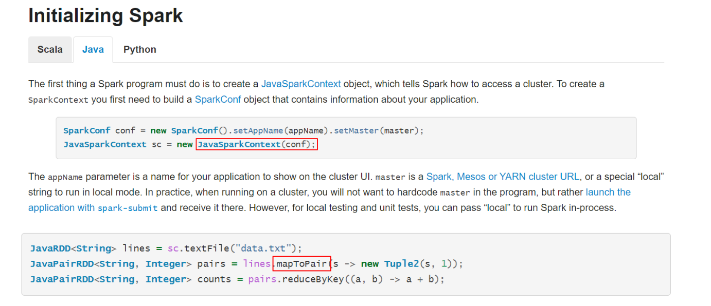


```java
package com.hhb.java.core;

import org.apache.spark.SparkConf;
import org.apache.spark.api.java.JavaPairRDD;
import org.apache.spark.api.java.JavaRDD;
import org.apache.spark.api.java.JavaSparkContext;
import scala.Tuple2;

import java.util.Arrays;

/**
 * @description:
 * @author: huanghongbo
 * @date: 2020-10-26 21:31
 **/
public class JavaWordCount {

    public static void main(String[] args) {

        //创建sc
        SparkConf sparkConf = new SparkConf().setAppName("JavaWordCount").setMaster("local");
        JavaSparkContext sc = new JavaSparkContext(sparkConf);
        //读取文件
        JavaRDD<String> lines = sc.textFile("/Users/baiwang/myproject/spark/data/wc.dat");
        //转换数据
        JavaRDD<String> words = lines.flatMap(line -> Arrays.stream(line.split("\\s+")).iterator());
        JavaPairRDD<String, Integer> wordMap = words.mapToPair(word -> new Tuple2<>(word, 1));
        JavaPairRDD<String, Integer> result = wordMap.reduceByKey((x, y) -> x + y);

        // 输出结果
        result.foreach(r -> System.err.println(r));
        //关闭sc
        sc.stop();

    }
}
```

备注：

* Spark入口点：JavaSparkContext
* Value-RDD：JavaRDD，key-value RDD:JavaPairRDD
* JavaRDD和JavaPairRDD转化
  * JavaRDD => JavaPairRDD： 通过mapToPair函数
  * JavaPairRDD => JavaRDD: 通过map函数转化
* lambda表达式使用 ->

#### 计算圆周率

使用蒙特卡洛思想

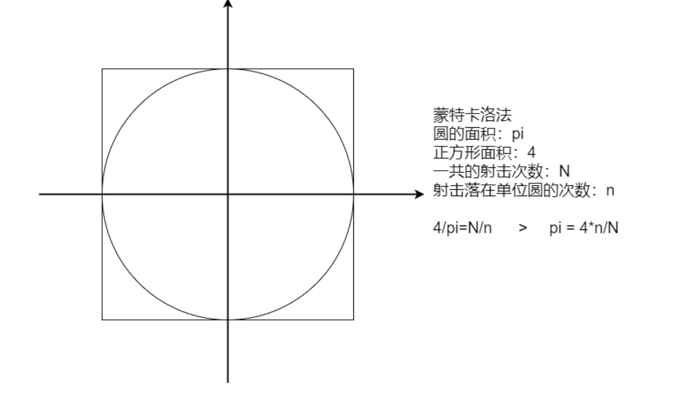

```scala
package com.hhb.spark.core

import org.apache.spark.{SparkConf, SparkContext}
import scala.math.random

/**
 * @description:
 * @author: huanghongbo
 * @date: 2020-10-26 22:00
 **/
object SparkPi {

  /**
   * 计算圆周率，使用蒙特卡洛法 : 4 /pi = N / n => pi = 4*n/N
   *
   * @param args
   */
  def main(args: Array[String]): Unit = {

    //1. 创建sc
    val sc = new SparkContext(new SparkConf().setMaster("local[*]").setAppName(this.getClass.getCanonicalName.init))
    //2. 读取数据
    val N = 10000000
    val slices: Int = if (args.length > 0) args(0).toInt else 10

    val m = sc.makeRDD(1 to N, slices)
      .map(_ => {
        val (x, y) = (random, random)
        if (x * x + y * y <= 1) 1 else 0
      })
    //3. 转换数据
    val n = m.reduce(_ + _)
    //4. 输出
    println(s"pi : ${4.0 * n / N}")
    // 关闭sc
    sc.stop()


  }

}
```


#### 广告数据统计

数据格式：timestamp province city userid adid 时间点，省份，城市，用户，广告

需求：

1. 统计每一个省份点击TOP3的广告
2. 统计每一个省份每一个小时的Top3的广告

###### 统计每一个省份点击TOP3的广告

```scala
package com.hhb.spark.core

import org.apache.spark.rdd.RDD
import org.apache.spark.{SparkConf, SparkContext}

/**
 * @description: 需求1:统计每个省份点击 TOP3 的广告ID
 * @author: huanghongbo
 * @date: 2020-10-26 22:20
 **/
object AdstatTest1 {

  def main(args: Array[String]): Unit = {

    //1. 创建sc
    val sc = new SparkContext(new SparkConf().setMaster("local[*]").setAppName(this.getClass.getCanonicalName.init))
    //2. 读取数据
    val lines: RDD[String] = sc.textFile("/Users/baiwang/myproject/spark/data/advert.log")
    //3. 转换数据
    // 字段:时间、省份、城市、用户、广告
    val lineRDD: RDD[((String, String), Int)] = lines.map {
      line => {
        val lineArray: Array[String] = line.split("\\s+")
        ((lineArray(1), lineArray(4)), 1)
      }
    }
    //(Henan,(5,2189))
    //(Hebei,(7,2250))
    //(Henan,(0,2237))
    //(Jiangsu,(1,2166))
    //(Henan,(7,2151))
    //(Hebei,(8,2240))
    //(Hunan,(7,2132))
    //(Hunan,(0,2162))
    //(Hubei,(7,2150))
    val priRDD: RDD[(String, (String, Int))] = lineRDD.reduceByKey(_ + _).map {
      case ((a, b), c) => (a, (b, c))
    }
    //    (Hunan,CompactBuffer((7,2132), (0,2162), (4,2140), (8,2189), (2,2193), (9,2122), (3,2157), (1,2202), (6,2082), (5,2273)))
    priRDD.groupByKey()
      //(Hunan,List((5,2273), (1,2202), (2,2193), (8,2189), (0,2162), (3,2157), (4,2140), (7,2132), (9,2122), (6,2082)))
      //对每个省的数据取所有的value，转换成list后排序，取前三个
      .mapValues(buf => buf.toList.sortWith(_._2 > _._2).take(3).map {
        case (x, y) => x
      }.mkString(":")).collect().foreach(println(_))

    //4. 输出

    // 关闭sc
    sc.stop()

  }
}
```

###### 统计每一个省份每一个小时的Top3的广告

```scala
package com.hhb.spark.core

import java.time.{LocalDateTime, ZoneOffset}

import org.apache.spark.rdd.RDD
import org.apache.spark.{SparkConf, SparkContext}

/**
 * @description: 统计每一个省份每一个小时的 TOP3广告ID 
 * @author: huanghongbo
 * @date: 2020-10-27 13:35
 **/
object AdstatTest2 {

  /**
   * 数据格式：时间点 省份 城市 用户 广告
   *
   * @param args
   */
  def main(args: Array[String]): Unit = {
    //创建sc
    val sc = new SparkContext(new SparkConf().setAppName(this.getClass.getCanonicalName.init).setMaster("local[*]"))

    //读取数据
    val lines: RDD[String] = sc.textFile("/Users/baiwang/myproject/spark/data/advert.log")

    //数据转换
    val wordRDD: RDD[((Int, String, String), Int)] = lines.map(line => {
      val words = line.split("\\s+")
      ((LocalDateTime.ofEpochSecond(words(0).toLong / 1000, 0, ZoneOffset.ofHours(8)).getHour, words(1), words(4)), 1)
    })
    //如果key进行分区后聚合
    wordRDD.reduceByKey(_ + _)
      //进行数据格式转换
      .map { case ((a, b, c), d) => ((a, b), (c, d)) }
      //将相同的key进行聚合
      .groupByKey()
      //将根据value的第二个元素进行排序，然后去前三个
      .mapValues(buf => buf.toList.sortWith(_._2 > _._2).take(3))
      .collect().foreach(println(_))
    //关闭sc
    sc.stop()
  }
}
```

###### 总结

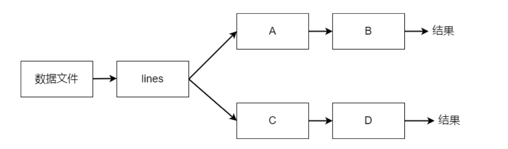

如果将上面的两个都合并到一个main中，读取完数据lines后，先计算第一个需求，然后再使用lines计算第二个需求，那么是读取几次数据文件呢？

回答：两次

#### 找共同好友


#### Super WordCount

要求:将单词全部转换为小写，去除标点符号(难)，去除停用词(难);最后按照 count 值降序保存到文件，同时将全部结果保存到MySQL(难);标点符号和停用词可 以自定义。

停用词:语言中包含很多功能词。与其他词相比，功能词没有什么实际含义。最普遍 的功能词是[限定词](the、a、an、that、those)，介词(on、in、to、from、 over等)、代词、数量词等。

Array[(String, Int)] => scala jdbc => MySQL

第一个版本

```scala
package com.hhb.spark.core

import org.apache.spark.{SparkConf, SparkContext}

/**
 * @description:
 * @author: huanghongbo
 * @date: 2020-10-27 17:41
 **/
object SuperWordCount {

  def main(args: Array[String]): Unit = {
    val sc = new SparkContext(new SparkConf().setMaster("local[*]").setAppName(this.getClass.getCanonicalName.init))

    val lines = sc.textFile("/Users/baiwang/myproject/spark/data/swc.dat")
    val list = "and of see the to a in".split("\\s+")


    val p = """[()\\?\\.,:;'’”“!\\? ]"""
    lines.flatMap(_.split("\\s+"))
      .map(word => {
        word.toLowerCase()
          .replaceAll(p, "")
      }).filter(word => word.trim.length > 0 && !list.contains(word))
      .map((_, 1))
      .reduceByKey(_ + _)
      .sortBy(_._2, false)
      .collect().foreach(println(_))
  }
}
```

第二个版本：

```scala
package com.hhb.spark.core

import java.sql.{Connection, DriverManager, PreparedStatement}

import org.apache.spark.rdd.RDD
import org.apache.spark.{SparkConf, SparkContext}

/**
 * @description:
 * @author: huanghongbo
 * @date: 2020-10-29 10:46
 **/
object SuperWordCount1 {

  private val p = """[()\\?\\.,:;'’”“!\\? ]"""
  private val list = "and of see the to a in".split("\\s+")

  private val url = "jdbc:mysql://linux123:3306/ebiz?useUnicode=true&characterEncoding=utf-8&useSSL=false"
  private val userName = "hive"
  private val password = "12345678"
  private val sql = "insert  into test (wort,total) values(?,?);"

  def main(args: Array[String]): Unit = {

    val sc = new SparkContext(new SparkConf().setMaster("local[*]").setAppName(this.getClass.getCanonicalName.init))
    val lines: RDD[String] = sc.textFile("/Users/baiwang/myproject/spark/data/swc.dat")
    lines.flatMap(_.split("\\s+"))
      .map(x => {
        x.toLowerCase.replaceAll(p, "")
      })
      .filter(word => word.trim.length > 0 && !list.contains(word))
      .map((_, 1))
      .reduceByKey(_ + _)
      .sortBy(_._2, false)
      .foreach { case (k, v) => {
        var conn: Connection = null
        var st: PreparedStatement = null
        try {
          conn = DriverManager.getConnection(url, userName, password)
          st = conn.prepareStatement(sql)
          st.setString(1, k)
          st.setInt(2, v)
          st.executeUpdate()
        } catch {
          case e: Exception => e.printStackTrace()
        } finally {
          if (st != null) st.close()
          if (conn != null) conn.close()
        }
      }
      }
  }
}
```

scala链接JDBC

```scala
package com.hhb.spark.core

import java.sql.{Connection, DriverManager, PreparedStatement}

/**
 * @description:
 * @author: huanghongbo
 * @date: 2020-10-28 21:01
 **/
object JDBCDemo {

  def main(args: Array[String]): Unit = {

    val list = "a b c d e f g".split("\\s+").zipWithIndex
    list.foreach(println(_))
    val url = "jdbc:mysql://linux123:3306/ebiz?useUnicode=true&characterEncoding=utf-8&useSSL=false"
    val userName = "hive"
    val password = "12345678"
    val sql = "insert  into test (wort,total) values(?,?);"

    var conn: Connection = null
    var st: PreparedStatement = null

    try {
      conn = DriverManager.getConnection(url, userName, password)
      st = conn.prepareStatement(sql)
      list.foreach(w => {
        st.setString(1, w._1)
        st.setInt(2, w._2)
        st.executeUpdate()
      })
    } catch {
      case e: Exception => e.printStackTrace()
    } finally {
      if (st != null) st.close()
      if (conn != null) conn.close()
    }

  }
}
```

pom

```xml
<!-- JDBC -->
<dependency>
  <groupId>mysql</groupId>
  <artifactId>mysql-connector-java</artifactId>
  <version>5.1.44</version>
</dependency>
```

第三个版本

```scala
package com.hhb.spark.core

import java.sql.{Connection, DriverManager, PreparedStatement}

import org.apache.spark.rdd.RDD
import org.apache.spark.{SparkConf, SparkContext}

/**
 * @description:
 * @author: huanghongbo
 * @date: 2020-10-29 10:46
 **/
object SuperWordCount2 {

  private val p = """[()\\?\\.,:;'’”“!\\? ]"""
  private val list = "and of see the to a in".split("\\s+")

  private val url = "jdbc:mysql://linux123:3306/ebiz?useUnicode=true&characterEncoding=utf-8&useSSL=false"
  private val userName = "hive"
  private val password = "12345678"
  private val sql = "insert  into test (wort,total) values(?,?);"
  private var count = 0;

  def main(args: Array[String]): Unit = {

    val sc = new SparkContext(new SparkConf().setMaster("local[*]").setAppName(this.getClass.getCanonicalName.init))
    val lines: RDD[String] = sc.textFile("/Users/baiwang/myproject/spark/data/swc.dat")
    lines.flatMap(_.split("\\s+"))
      .map(x => {
        x.toLowerCase.replaceAll(p, "")
      })
      .filter(word => word.trim.length > 0 && !list.contains(word))
      .map((_, 1))
      .reduceByKey(_ + _)
      .sortBy(_._2, false)
      .foreachPartition(iter => {
        var conn: Connection = null
        var st: PreparedStatement = null
        conn = DriverManager.getConnection(url, userName, password)
        st = conn.prepareStatement(sql)
        count += 1
        println(count)
        try {
          iter.foreach { case (k, v) => {
            st.setString(1, k)
            st.setInt(2, v)
            st.executeUpdate()
          }
          }
        } catch {
          case e: Exception => e.printStackTrace()
        }
        finally {
          if (st != null) st.close()
          if (conn != null) conn.close()
        }
      }
      )
  }
}
```

第四个版本

```scala
package com.hhb.spark.core

import java.sql.{Connection, DriverManager, PreparedStatement}

import org.apache.spark.rdd.RDD
import org.apache.spark.{SparkConf, SparkContext}

/**
 * @description:
 * @author: huanghongbo
 * @date: 2020-10-29 10:46
 **/
object SuperWordCount3 {

  private val p = """[()\\?\\.,:;'’”“!\\? ]"""
  private val list = "and of see the to a in".split("\\s+")

  private val url = "jdbc:mysql://linux123:3306/ebiz?useUnicode=true&characterEncoding=utf-8&useSSL=false"
  private val userName = "hive"
  private val password = "12345678"
  private val sql = "insert  into test (wort,total) values(?,?);"
  private var count = 0;

  def main(args: Array[String]): Unit = {

    val sc = new SparkContext(new SparkConf().setMaster("local[*]").setAppName(this.getClass.getCanonicalName.init))
    val lines: RDD[String] = sc.textFile("/Users/baiwang/myproject/spark/data/swc.dat")
    val result = lines.flatMap(_.split("\\s+"))
      .map(x => {
        x.toLowerCase.replaceAll(p, "")
      })
      .filter(word => word.trim.length > 0 && !list.contains(word))
      .map((_, 1))
      .reduceByKey(_ + _)
      .sortBy(_._2, false)
    result.saveAsTextFile("/Users/baiwang/myproject/spark/data/super")

    result.foreachPartition(iter => insert(iter))
  }

  def insert(iter: Iterator[(String, Int)]): Unit = {
    var conn: Connection = null
    var st: PreparedStatement = null
    conn = DriverManager.getConnection(url, userName, password)
    st = conn.prepareStatement(sql)
    count += 1
    println(count)
    try {
      iter.foreach { case (k, v) => {
        st.setString(1, k)
        st.setInt(2, v)
        st.executeUpdate()
      }
      }
    } catch {
      case e: Exception => e.printStackTrace()
    }
    finally {
      if (st != null) st.close()
      if (conn != null) conn.close()
    }
  }
}
```

总结：最终优化版本使用foreachPartition 代替 foreach

备注：

* SparkSQL有方便读写MySQL的方法，给参数直接调用即可
* 但是掌握以上方法非常有必要，因为SparkSQL不支持所有类型的数据库

## RDD编程高阶

Spark原理

### 序列化

在实际开发中会自定义一些对RDD的操作，此时需要注意的是：

* 初始化工作在Driver端进行的
* 实际运行程序是在Executor端进行的

那么在这个过程就涉及到网络通信，是需要进行序列化的

举例：

```scala
/**
 * @description:
 * @date: 2020-10-27 17:41
 **/
object SuperWordCount {
	//属性的实例化就是在driver
  private val list = "and of see the to a in".split("\\s+")
  private val p = """[()\\?\\.,:;'’”“!\\? ]"""

  def main(args: Array[String]): Unit = {
    //在driver端进行初始化sc
    val sc = new SparkContext(new SparkConf().setMaster("local[*]").setAppName(this.getClass.getCanonicalName.init))
    //涉及到RDD的操作，就是在Executor端
    val lines = sc.textFile("/Users/baiwang/myproject/spark/data/swc.dat")

    lines.flatMap(_.split("\\s+"))
      .map(word => {
        word.toLowerCase()
          .replaceAll(p, "")
      }).filter(word => word.trim.length > 0 && !list.contains(word))
      .map((_, 1))
      .reduceByKey(_ + _)
      .sortBy(_._2, false)
      .collect().foreach(println(_))
  }
}
```

序列化：

```scala
package com.hhb.spark.core

import org.apache.spark.{SparkConf, SparkContext}

/**
 * @description:
 * @date: 2020-10-29 13:54
 **/

class MyClass1(x: Int) {
  val num = x
}

case class MyClass2(x: Int) {
  val num = x
}

class MyClass3(x: Int) extends Serializable {
  val num = x
}

object SerializableDemo {

  def main(args: Array[String]): Unit = {
    val sc = new SparkContext(new SparkConf().setMaster("local[*]").setAppName(this.getClass.getCanonicalName.init))

    val rdd = sc.makeRDD(1 to 20)

    //过程和方法，都具备序列化的能力
    def add1(x: Int) = x + 100

    val add2 = add1 _
    //
    //    rdd.map(add1(_)).foreach(println(_))
    //    rdd.map(add2(_)).foreach(println(_))

    val object1 = new MyClass1(1)
    //MyClass1没有序列化，提示 org.apache.spark.SparkException: Task not serializable
    //    rdd.map(_ + object1.num).foreach(println(_))

    //    解决1： 使用样例类
    val object2 = MyClass2(2)
    rdd.map(_ + object2.num).foreach(println(_))

    println("*" * 15)
    //解决2：实现Serializable接口
    val object3 = new MyClass3(3)
    rdd.map(_ + object3.num).foreach(println(_))
  }
}
```

### RDD依赖关系

RDD只支持粗粒度抓获，即在大量记录上执行的单个操作，将创建RDD的一系列Lineage血统记录下来，以便恢复丢失的分区。

RDD的Lineage会记录RDD的元数据信息和转换行为，当该RDD的部分分区丢失时，可根据这些信息来重新运算和和恢复丢失的数据分区。


RDD和他依赖的父RDD（s）的关系有两种不同的类型，即窄依赖（narrow dependency）和宽依赖（wide dependency）。依赖有两个作用：

* 用来解决数据容错
* 用来换份stage

窄依赖：1:1 或 n：1

宽依赖：n:m 意味着有shuffle

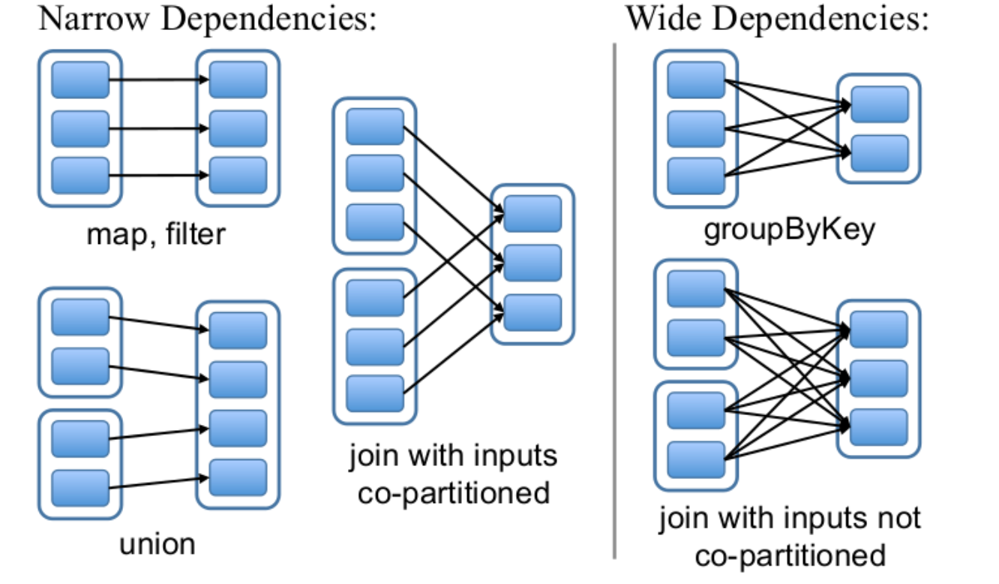

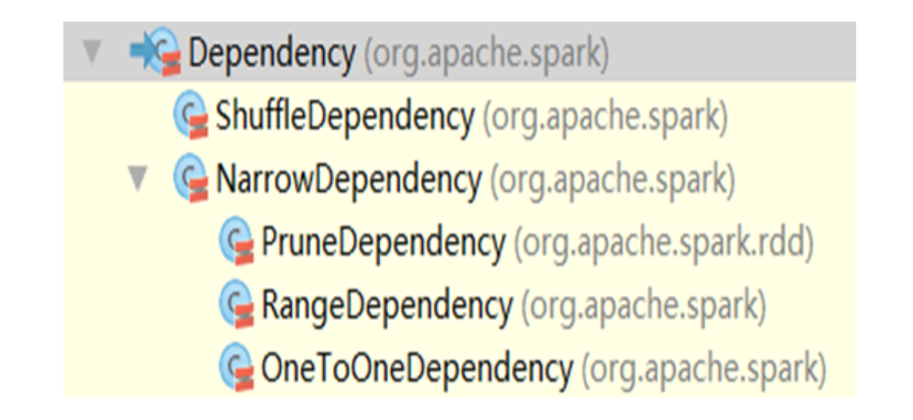

DAG（Directed Acyclic Graph）有向无环图。原始的RDD通过一系列的转换就形成了DAG，根据RDD之间的依赖关系的不同将DAG划分成不同的Stage：

* 对窄依赖，partition的转换处理在Stage中完成计算
* 对宽依赖由于有Shuffle的存在，只能在Parent RDD处理完成后，才能开始接下来的运算
* 宽依赖是划分Stage的依据

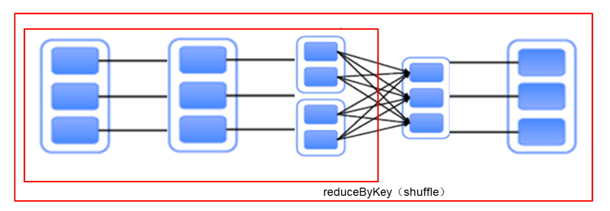

RDD任务切分中间分为：Driver programe、Job、Stage（TaskSet）和Task

* Driver programe：初始化一个SparkContext即生成一个Spark应用
* job：一个Action算子就会生成一个Job
* Stage：根据RDD之间的依赖关系的不同，将Job划分成不同的Stage，遇到一个宽依赖则划分一个Stage
* Task：Stage是一个TashSet，将Stage划分的结果发送到不同的Executor执行，即为一个Task
* Task是Spark中任务调度的最小单位，每个Stage包含许多Task，这些Task执行的计算逻辑相同，但是计算的数据不同

注意：Driver -> Job -> Stage -> Task 每一层都是1对n的关系

```shell
# 窄依赖
scala> val rdd1 = sc.parallelize(1 to 10 ,1)
rdd1: org.apache.spark.rdd.RDD[Int] = ParallelCollectionRDD[0] at parallelize at <console>:24

scala> val rdd2 = sc.parallelize(11 to 20,1)
rdd2: org.apache.spark.rdd.RDD[Int] = ParallelCollectionRDD[1] at parallelize at <console>:24

scala> val rdd3 = rdd1.union(rdd2)
rdd3: org.apache.spark.rdd.RDD[Int] = UnionRDD[2] at union at <console>:27

scala> rdd3.dependencies
res0: Seq[org.apache.spark.Dependency[_]] = ArrayBuffer(org.apache.spark.RangeDependency@7572c6dd, org.apache.spark.RangeDependency@d8194cc)

scala> rdd3.dependencies(0).rdd
res1: org.apache.spark.rdd.RDD[_] = ParallelCollectionRDD[0] at parallelize at <console>:24
# 打印rdd1的数据
scala> rdd3.dependencies(0).rdd.collect
res2: Array[_] = Array(1, 2, 3, 4, 5, 6, 7, 8, 9, 10)


#宽依赖
random: scala.util.Random = scala.util.Random@81a48a8

scala> val arr =  (1 to 100).map(idx => random.nextInt(100))
arr: scala.collection.immutable.IndexedSeq[Int] = Vector(96, 86, 87, 47, 60, 47, 40, 31, 75, 41, 13, 57, 16, 23, 47, 62, 75, 34, 64, 97, 37, 0, 71, 14, 24, 49, 95, 37, 58, 42, 51, 38, 19, 31, 76, 86, 62, 45, 88, 75, 99, 5, 6, 72, 75, 48, 60, 20, 21, 84, 64, 70, 21, 8, 12, 83, 76, 61, 37, 84, 39, 24, 61, 71, 61, 28, 33, 17, 0, 60, 90, 10, 72, 2, 70, 48, 2, 17, 51, 33, 4, 37, 91, 49, 75, 37, 15, 45, 67, 80, 22, 31, 67, 85, 75, 26, 75, 9, 12, 89)

scala> val rdd1 = sc.makeRDD(arr).map((_,1))
rdd1: org.apache.spark.rdd.RDD[(Int, Int)] = MapPartitionsRDD[4] at map at <console>:26

scala> val rdd2 = rdd1.reduceByKey
reduceByKey   reduceByKeyLocally

scala> val rdd2 = rdd1.reduceByKey(_+_)
rdd2: org.apache.spark.rdd.RDD[(Int, Int)] = ShuffledRDD[5] at reduceByKey at <console>:25

scala> rdd2.dependencies
res3: Seq[org.apache.spark.Dependency[_]] = List(org.apache.spark.ShuffleDependency@1aaea328)

scala> rdd2.dependencies(0).rdd
res4: org.apache.spark.rdd.RDD[_] = MapPartitionsRDD[4] at map at <console>:26

scala> rdd2.dependencies(0).rdd.dependencies
res5: Seq[org.apache.spark.Dependency[_]] = List(org.apache.spark.OneToOneDependency@623e4193)

scala> rdd2.dependencies(0).rdd.dependencies(0).rdd.collect
res6: Array[_] = Array(96, 86, 87, 47, 60, 47, 40, 31, 75, 41, 13, 57, 16, 23, 47, 62, 75, 34, 64, 97, 37, 0, 71, 14, 24, 49, 95, 37, 58, 42, 51, 38, 19, 31, 76, 86, 62, 45, 88, 75, 99, 5, 6, 72, 75, 48, 60, 20, 21, 84, 64, 70, 21, 8, 12, 83, 76, 61, 37, 84, 39, 24, 61, 71, 61, 28, 33, 17, 0, 60, 90, 10, 72, 2, 70, 48, 2, 17, 51, 33, 4, 37, 91, 49, 75, 37, 15, 45, 67, 80, 22, 31, 67, 85, 75, 26, 75, 9, 12, 89)

dd2.toDebugString
res7: String =
(5) ShuffledRDD[5] at reduceByKey at <console>:25 []
 +-(5) MapPartitionsRDD[4] at map at <console>:26 []
    |  ParallelCollectionRDD[3] at makeRDD at <console>:26 []
```

#### 在谈WordCount

```shell
scala> val rdd1 = sc.textFile("/azkaban-wc/wc.txt")
rdd1: org.apache.spark.rdd.RDD[String] = /azkaban-wc/wc.txt MapPartitionsRDD[7] at textFile at <console>:24

scala> val rdd2 = rdd1.flatMap(_.split("\\s+"))
rdd2: org.apache.spark.rdd.RDD[String] = MapPartitionsRDD[8] at flatMap at <console>:25

scala> val rdd3 = rdd2.map((_,1))
rdd3: org.apache.spark.rdd.RDD[(String, Int)] = MapPartitionsRDD[9] at map at <console>:25


scala> val rdd4 = rdd3.reduceByKey(_+_)
rdd4: org.apache.spark.rdd.RDD[(String, Int)] = ShuffledRDD[10] at reduceByKey at <console>:25


scala> val rdd5 = rdd4.sortBy(_._2,false)
rdd5: org.apache.spark.rdd.RDD[(String, Int)] = MapPartitionsRDD[15] at sortBy at <console>:25

scala> val rdd6 = rdd4.sortByKey()
rdd6: org.apache.spark.rdd.RDD[(String, Int)] = ShuffledRDD[18] at sortByKey at <console>:25
# 查看学院关系
scala> rdd5.toDebugString
res8: String =
(2) MapPartitionsRDD[15] at sortBy at <console>:25 []
 |  ShuffledRDD[14] at sortBy at <console>:25 []
 +-(2) MapPartitionsRDD[11] at sortBy at <console>:25 []
    |  ShuffledRDD[10] at reduceByKey at <console>:25 []
    +-(2) MapPartitionsRDD[9] at map at <console>:25 []
       |  MapPartitionsRDD[8] at flatMap at <console>:25 []
       |  /azkaban-wc/wc.txt MapPartitionsRDD[7] at textFile at <console>:24 []
       |  /azkaban-wc/wc.txt HadoopRDD[6] at textFile at <console>:24 []

scala> rdd6.toDebugString
res9: String =
(2) ShuffledRDD[18] at sortByKey at <console>:25 []
 +-(2) ShuffledRDD[10] at reduceByKey at <console>:25 []
    +-(2) MapPartitionsRDD[9] at map at <console>:25 []
       |  MapPartitionsRDD[8] at flatMap at <console>:25 []
       |  /azkaban-wc/wc.txt MapPartitionsRDD[7] at textFile at <console>:24 []
       |  /azkaban-wc/wc.txt HadoopRDD[6] at textFile at <console>:24 []
# 查看依赖
scala> rdd1.dependencies
res10: Seq[org.apache.spark.Dependency[_]] = List(org.apache.spark.OneToOneDependency@64cd5efa)

scala> rdd1.dependencies(0).rdd
res11: org.apache.spark.rdd.RDD[_] = /azkaban-wc/wc.txt HadoopRDD[6] at textFile at <console>:24

scala> rdd5.dependencies(0).rdd
res12: org.apache.spark.rdd.RDD[_] = ShuffledRDD[14] at sortBy at <console>:25

scala> rdd6.dependencies(0).rdd
res13: org.apache.spark.rdd.RDD[_] = ShuffledRDD[10] at reduceByKey at <console>:25

scala> rdd6.dependencies(0)
res14: org.apache.spark.Dependency[_] = org.apache.spark.ShuffleDependency@3739758a

scala> rdd5.dependencies(0)
res15: org.apache.spark.Dependency[_] = org.apache.spark.OneToOneDependency@2c4d4204

scala> rdd1.dependencies(0).rdd
res16: org.apache.spark.rdd.RDD[_] = /azkaban-wc/wc.txt HadoopRDD[6] at textFile at <console>:24

# 查看最佳有限位置
scala> res16.preferredLocations(res16.partitions(0))
res17: Seq[String] = ArraySeq(linux121, linux122, linux123)

scala> res16.preferredLocations(res16.partitions(1))
res18: Seq[String] = ArraySeq(linux121, linux122, linux123)
# 只有两个分区
scala> res16.preferredLocations(res16.partitions(3))
java.lang.ArrayIndexOutOfBoundsException: 3
  ... 49 elided
  
scala> rdd1.getNumPartitions
res20: Int = 2

# 使用hdfs命令检查文件情况
hdfs fsck /azkaban-wc/wc.txt -files -blocks -locations
```

问题：上面的wordCount一共有几个Job、几个Stage、几个Task？

1个Job、3个stage、6个Task

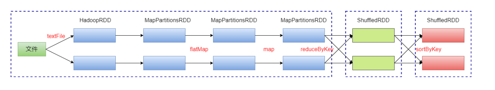

```
val rdd1 = sc.textFile("/azkaban-wc/wc.txt")
val rdd2 = rdd1.flatMap(_.split("\\s+"))
val rdd3 = rdd2.map((_,1))
val rdd4 = rdd3.reduceByKey(_+_)
val rdd6 = rdd4.sortByKey()
rdd6.count
```


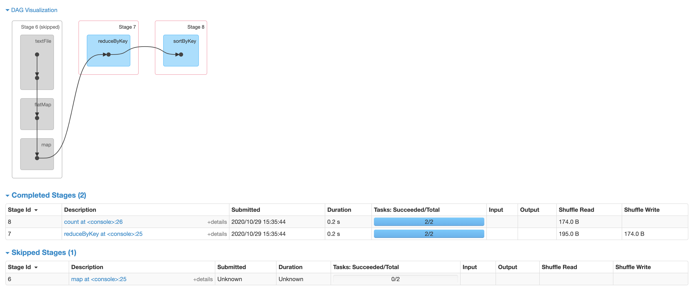

### RDD持久化/缓存

**涉及到的算子：persist、cache、unpersist：都是Transformation**

缓存是将计算结果写入不同的介质，用户定义存储级别（存储级别定义了缓存存储的介质，目前支持内存、磁盘、堆外内存）；通过缓存，Spark避免了RDD上的重复计算，能够极大的提升计算速度；RDD持久化或缓存，是Spark最重要的特征之一，可以说，缓存是Spark构建迭代式算法和快速交互式查询的关键因素。

Spark速度快的原因之一就是在内存中持久化（或缓存）一个数据集，当持久化一个RDD后，每一个节点都将把计算的分片结果保存在内存中，并在对此数据集（或衍生的数据集）进行其他动作（Action）中重用。这样事后续的动作变得更加迅速

使用persist()方法对一个RDD标记为持久化。之所以说“标记为持久化”，是因为出现persist()语句的地方，并不会马上计算生成RDD并把它持久化，而是要等到遇到第一个行动操作触发真正的计算以后，才厚把计算结果持久化。


通过persist()或cache()方法可以标记一个要被持久化的RDD，持久化被触发，RDD将会被保留在计算节点的内存中并重用。

什么时候缓存数据，需要对空间和速度进行权衡，一般情况下，**如果多个动作需要用到某个RDD，而它的计算代价有很高，那么就应该把这个RDD缓存起来；**

**缓存有可能丢失，或者存在于内存中的数据由于内存不足而被删除**，RDD缓存的容错机制保证了即使缓存丢失也能保证计算正确的执行，通过基于RDD的一系列的转化，丢失的数据会被重算。RDD的各个Partition是相对独立的，因此只需要计算丢失的部分即可，并不需要重算全部的Partition。

persist()的参数可以指定持久化级别参数。使用cache()方法时，会调用persist(MEMORY_ONLY)。即：

```scala
cache() == persist(StorageLevel.Memeory_ONLY)
```

使用unpersist()方法手动的把持久化的RDD从缓存中移除

```scala
/**
* Persist this RDD with the default storage level (`MEMORY_ONLY`).
*/
def persist(): this.type = persist(StorageLevel.MEMORY_ONLY)

/**
* Persist this RDD with the default storage level (`MEMORY_ONLY`).
*/
def cache(): this.type = persist()

@DeveloperApi
class StorageLevel private(
  private var _useDisk: Boolean,
  private var _useMemory: Boolean,
  private var _useOffHeap: Boolean,
  private var _deserialized: Boolean,
  private var _replication: Int = 1)
extends Externalizable {
}
    
object StorageLevel {
  val NONE = new StorageLevel(false, false, false, false)
  val DISK_ONLY = new StorageLevel(true, false, false, false)
  val DISK_ONLY_2 = new StorageLevel(true, false, false, false, 2)
  val MEMORY_ONLY = new StorageLevel(false, true, false, true)
  val MEMORY_ONLY_2 = new StorageLevel(false, true, false, true, 2)
  val MEMORY_ONLY_SER = new StorageLevel(false, true, false, false)
  val MEMORY_ONLY_SER_2 = new StorageLevel(false, true, false, false, 2)
  val MEMORY_AND_DISK = new StorageLevel(true, true, false, true)
  val MEMORY_AND_DISK_2 = new StorageLevel(true, true, false, true, 2)
  val MEMORY_AND_DISK_SER = new StorageLevel(true, true, false, false)
  val MEMORY_AND_DISK_SER_2 = new StorageLevel(true, true, false, false, 2)
  val OFF_HEAP = new StorageLevel(true, true, true, false, 1)

}
```

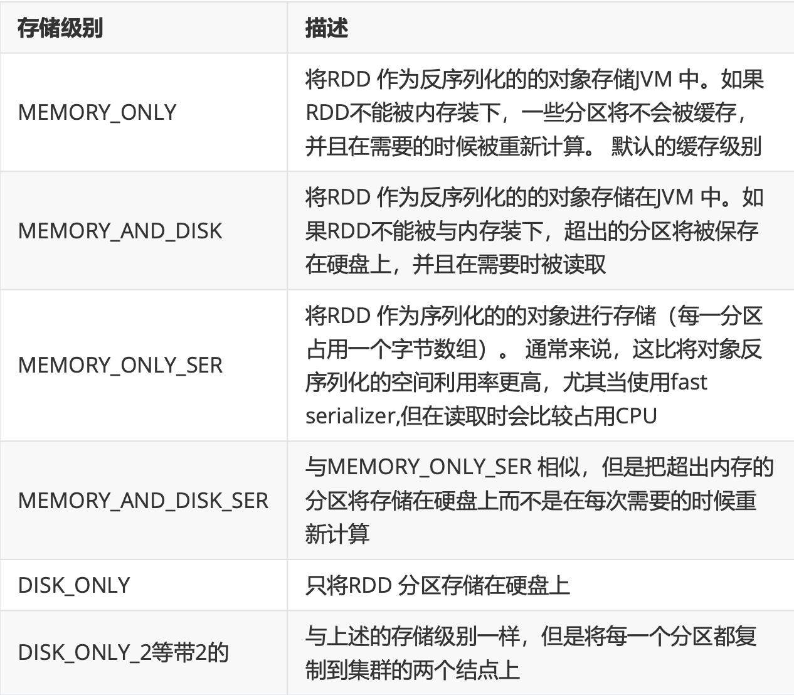

cache RDD 以分区为单位(一存就是存一个分区的数据，如果内存存不下整个分区的数据，那么就不存);程序执行完毕后，系统会清理cache数据;

```shell
scala> val list = List("hadoop","spark","hive")
list: List[String] = List(hadoop, spark, hive)
scala> val rdd = sc.parallelize(list)
rdd: org.apache.spark.rdd.RDD[String] = ParallelCollectionRDD[0] at parallelize at <console>:26

# 调用的cache，就是调用的persist(MEMORY_ONLY)方法
# 语句执行到这，其实还没有缓存RDD，cache也是一个Transformation，遇到Action才会执行
scala> rdd.cache
res2: rdd.type = ParallelCollectionRDD[0] at parallelize at <console>:26
# 第一次触发Action操作，从头到位执行一次，并会把RDD缓存起来
scala> rdd.count
# 第二次Action操作，不需要从头到尾执行，只需要在使用缓存的cache
rdd.collect().mkString(",")
```

### RDD容错机制-CheckPoint

**涉及到的算子：checkpoint，也是Transformation**

Spark对于数据的保存除了持久化操作之外，还提供了检查点的机制。**检查点本质是通过将RDD写入高可靠的磁盘，主要目的是为了容错**。检查点通过将数据写入到HDFS文件系统实现的RDD检查点功能。

Lineage过长会造成容错成本过高，这样不如在中间阶段做检查点容错，如果之后有节点出现问题而丢失分区，从检查点的RDD开始重做Lineage，就会减少开销

cache和checkpoint有显著区别的，缓存把RDD计算出来然后放在内存中，但是RDD的依赖链不能丢掉，当某个点宕机的时候，上面cache的RDD会丢掉，会通过依赖链重发计算，不同的是，checkpoint是把RDD保存在HDFS中，是多副本可靠存储，此时依赖链可以丢掉，**所以斩断了依赖链**

以下场景适合使用检查点机制：

1. DAF的Lineage过程，如果重算，则开销太大
2. 在宽依赖上做CheckPoint获得的收益更大

与cache类似，checkpoint也是lazy的

```shell
scala> val rdd1 = sc.parallelize(1 to 100000)
rdd1: org.apache.spark.rdd.RDD[Int] = ParallelCollectionRDD[0] at parallelize at <console>:24
# 设置检查点目录
scala> sc.setCheckpointDir("/spark-test/checkpoint")
20/10/29 18:11:47 WARN SparkContext: Spark is not running in local mode, therefore the checkpoint directory must not be on the local filesystem. Directory '/spark-test/checkpoint' appears to be on the local filesystem.

scala> val rdd2 = rdd1.map(_ * 2)
rdd2: org.apache.spark.rdd.RDD[Int] = MapPartitionsRDD[1] at map at <console>:25
#设置检查点 
scala> rdd2.checkpoint
# 判断是否已经做好检查点，由于checkpoint是lazy的，所以此时是false
scala> rdd2.isCheckpointed
res2: Boolean = false
# 获取rdd2没有做好检查点之前的rdd依赖关系
scala> rdd2.dependencies(0).rdd
res3: org.apache.spark.rdd.RDD[_] = ParallelCollectionRDD[0] at parallelize at <console>:24
scala> rdd2.dependencies(0).rdd.collect
res4: Array[_] = Array(1, 2, 3, 4, 5, 6, 7, 8, 9, 10, 11, 12, 13, 14, 15, 16, 17, 18, 19, 20, 21, 22, 23, 24, 25, 26, 27, 28, 29, 30, 31, 32, 33, 34, 35, 36, 37, 38, 39, 40, 41, 42, 43, 44, 45, 46, 47, 48, 49, 50, 51, 52, 53, 54, 55, 56, 57, 58, 59, 60, 61, 62, 63, 64, 65, 66, 67, 68, 69, 70, 71, 72, 73, 74, 75, 76, 77, 78, 79, 80, 81, 82, 83, 84, 85, 86, 87, 88, 89, 90, 91, 92, 93, 94, 95, 96, 97, 98, 99, 100, 101, 102, 103, 104, 105, 106, 107, 108, 109, 110, 111, 112, 113, 114, 115, 116, 117, 118, 119, 120, 121, 122, 123, 124, 125, 126, 127, 128, 129, 130, 131, 132, 133, 134, 135, 136, 137, 138, 139, 140, 141, 142, 143, 144, 145, 146, 147, 148, 149, 150, 151, 152, 153, 154, 155, 156, 157, 158, 159, 160, 161, 162, 163, 164, 165, 166, 167, 168, 169, 170, 171, 1...
# 执行Action，触发checkpoint
scala> rdd2.count
res5: Long = 100000
#再次查看是否已经执行checkpoint
scala> rdd2.isCheckpointed
res6: Boolean = true
# 再次查看rdd2的依赖关系，可以看到checkpoint后，RDD的lineage被截断，变成从checkpointRDD开始
scala> rdd2.dependencies(0).rdd
res7: org.apache.spark.rdd.RDD[_] = ReliableCheckpointRDD[2] at count at <console>:26
scala> rdd2.dependencies(0).rdd.collect
res8: Array[_] = Array(2, 4, 6, 8, 10, 12, 14, 16, 18, 20, 22, 24, 26, 28, 30, 32, 34, 36, 38, 40, 42, 44, 46, 48, 50, 52, 54, 56, 58, 60, 62, 64, 66, 68, 70, 72, 74, 76, 78, 80, 82, 84, 86, 88, 90, 92, 94, 96, 98, 100, 102, 104, 106, 108, 110, 112, 114, 116, 118, 120, 122, 124, 126, 128, 130, 132, 134, 136, 138, 140, 142, 144, 146, 148, 150, 152, 154, 156, 158, 160, 162, 164, 166, 168, 170, 172, 174, 176, 178, 180, 182, 184, 186, 188, 190, 192, 194, 196, 198, 200, 202, 204, 206, 208, 210, 212, 214, 216, 218, 220, 222, 224, 226, 228, 230, 232, 234, 236, 238, 240, 242, 244, 246, 248, 250, 252, 254, 256, 258, 260, 262, 264, 266, 268, 270, 272, 274, 276, 278, 280, 282, 284, 286, 288, 290, 292, 294, 296, 298, 300, 302, 304, 306, 308, 310, 312, 314, 316, 318, 320, 3...
# 查看RDD所依赖的checkpoint的文件位置
scala> rdd2.getCheckpointFile
res9: Option[String] = Some(hdfs://linux121:9000/spark-test/checkpoint/8500794d-d6f8-49ef-98bd-b61c1343cbea/rdd-1)
```

备注：checkpoint的文件作业执行完毕后不会被删除，需要我们手动自己删除

### RDD分区

spark.default.parallelism: 默认并发数 = 2

当配置文件Spark-default.conf中没有显示的配置，就按照如下规则取值

#### 本地模式

```shell
spark-shell --master local[N]  spark.default.parallelism = N
spark-shell --master local     spark.default.parallelism = 1
```

#### 伪分布式

x 为本级上启动的executor数，y为每个executor使用的core数。z为每个executor使用的内存

```shell
spark-shell --master local-cluster[x,y,z]
spark,default.parallelism = x * y
```

#### 分布式模式（Yarn or Standalone）

```shell
spark.default.parallelism = max(应用程序持有executor的core总数,2)
```

备注:total number of cores on all executor nodes or 2, whichever is larger

经过上面的规则，就能确定了spark.default.parallelism的默认值（配置文件 spark-defaylt.conf 中没有显示的配置，如果配置了，则spark.default.parallelism = 配置的值）

SparkContext初始化时，同时会生成两个参数，由上面得到的spark.default.parallelism推导出这两个参数的值

```scala
// 从集合中创建RDD的分区数
sc.defaultParallelism   =  spark.default.parallelism

//从文件中创建RDD的分区数
sc.defaultMinPartitions = min(spark.default.parallelism,2)
```

以上参数确定后，就可以重新计算RDD的分区数了

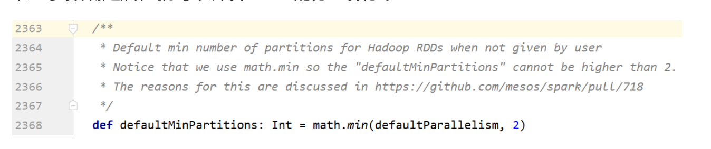

#### 创建RDD的几种方式：

###### 通过集合创建

```scala
//如果创建RDD时没有指定分区数，则RDD的分区数 = sc.defaultParallelism
val rdd = sc.parallelize(1 to 100)
rdd.getNumPartitions
```

备注：简单的说RDD分区数等于core总数

###### 通过textFile创建

```scala
val rdd = sc.textFile("/azkaban-wc/wc.txt")
rdd.getNumPartitions
```

如果没有没有指定分区数：

* 读取本地文件：RDD的分区数 = max(本地文件分片数，sc.defaultMinPartitions)
* 读取HDFS文件：RDD的分区数 = max(hdfs文件block数，sc.defaultMinPartitions)

备注：

* 本地文件分片数 = 本地文件大小 /32 M
* 如果读取的是HDFS文件，同时指定分区数  < hdfs 文件的block数，指定的数不生效

### RDD分区器

以下RDD分别是否有分区器，是什么类型的分区器

```scala
scala> val rdd1  = sc.textFile("/azkaban-wc/wc.txt")
rdd1: org.apache.spark.rdd.RDD[String] = /azkaban-wc/wc.txt MapPartitionsRDD[5] at textFile at <console>:24

scala> val rdd2 = rdd1.flatMap(_.split("\\s+"))
rdd2: org.apache.spark.rdd.RDD[String] = MapPartitionsRDD[6] at flatMap at <console>:25

scala> rdd1.partitioner
res4: Option[org.apache.spark.Partitioner] = None

scala> rdd2.partitioner
res5: Option[org.apache.spark.Partitioner] = None

scala> val rdd3 = rdd2.map((_,1))
rdd3: org.apache.spark.rdd.RDD[(String, Int)] = MapPartitionsRDD[7] at map at <console>:25

scala> rdd3.partitioner
res6: Option[org.apache.spark.Partitioner] = None

scala> val rdd4 = rdd3.reduceByKey
reduceByKey   reduceByKeyLocally

scala> val rdd4 = rdd3.reduceByKey(_+_)
rdd4: org.apache.spark.rdd.RDD[(String, Int)] = ShuffledRDD[8] at reduceByKey at <console>:25

scala> rdd4.partitioner
res7: Option[org.apache.spark.Partitioner] = Some(org.apache.spark.HashPartitioner@2)

scala> val rdd5 = rdd4.sortByKey()
rdd5: org.apache.spark.rdd.RDD[(String, Int)] = ShuffledRDD[11] at sortByKey at <console>:25

scala> rdd5.partitioner
res8: Option[org.apache.spark.Partitioner] = Some(org.apache.spark.RangePartitioner@bdd2d498)

```

**只有key-value类型的RDD才有可能有分区器，Value类型的RDD分区器的值是none**

分区器的作用与分类：

在PairRDD（key，valye）中，很多操作都是基于key的，系统会按照key对数据进行重组，如groupByKey，数据重组需要规则，最常见的就是基于hash的分区，此外还有一种复杂的抽样Range分区方法；

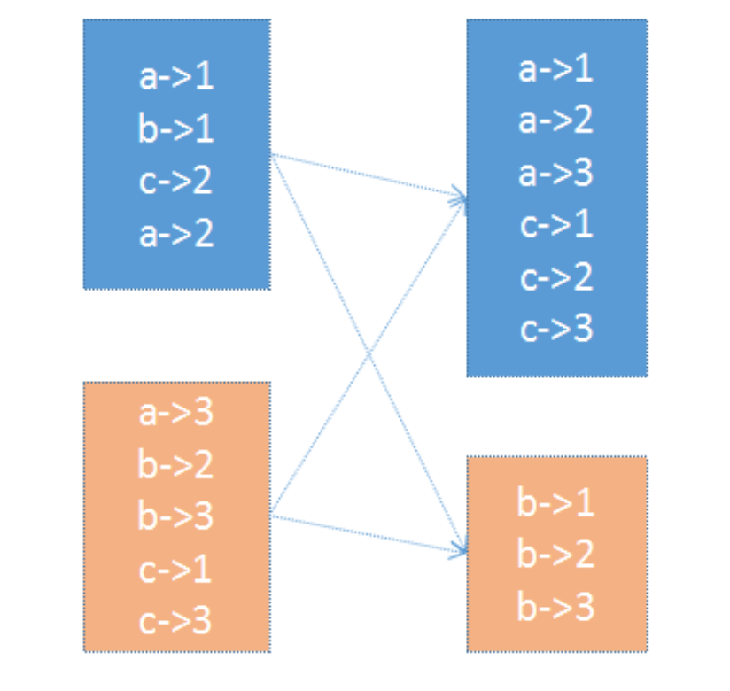

#### HashPartitioner

最简单、最常用，也是默认提供的分区器，对于给定的key，计算其hashCode，并除以分区的个数取余，如果余数小于0，这用余数+分区的个数，最后返回的值就是这个key所属的分区ID。该方法可以保证key相同的数据出现在同一个分区。

用户可以通过partitionBy主动使用分区器，通过partitions参数指定想要分区的数量

```scala
scala> val rdd1 = sc.makeRDD(1 to 100).map((_,1))
rdd1: org.apache.spark.rdd.RDD[(Int, Int)] = MapPartitionsRDD[13] at map at <console>:24

scala> rdd1.getNumPartitions
res9: Int = 5
// 仅仅是将数据大致分成了若干份，并没有使用分区器
scala> rdd1.glom.collect.foreach(x => println(x.toBuffer))
ArrayBuffer((1,1), (2,1), (3,1), (4,1), (5,1), (6,1), (7,1), (8,1), (9,1), (10,1), (11,1), (12,1), (13,1), (14,1), (15,1), (16,1), (17,1), (18,1), (19,1), (20,1))
ArrayBuffer((21,1), (22,1), (23,1), (24,1), (25,1), (26,1), (27,1), (28,1), (29,1), (30,1), (31,1), (32,1), (33,1), (34,1), (35,1), (36,1), (37,1), (38,1), (39,1), (40,1))
ArrayBuffer((41,1), (42,1), (43,1), (44,1), (45,1), (46,1), (47,1), (48,1), (49,1), (50,1), (51,1), (52,1), (53,1), (54,1), (55,1), (56,1), (57,1), (58,1), (59,1), (60,1))
ArrayBuffer((61,1), (62,1), (63,1), (64,1), (65,1), (66,1), (67,1), (68,1), (69,1), (70,1), (71,1), (72,1), (73,1), (74,1), (75,1), (76,1), (77,1), (78,1), (79,1), (80,1))
ArrayBuffer((81,1), (82,1), (83,1), (84,1), (85,1), (86,1), (87,1), (88,1), (89,1), (90,1), (91,1), (92,1), (93,1), (94,1), (95,1), (96,1), (97,1), (98,1), (99,1), (100,1))

scala> rdd1.partition
partitionBy   partitioner   partitions

scala> rdd1.partitioner
res11: Option[org.apache.spark.Partitioner] = None

scala> val rdd2 = rdd1.partition
partitionBy   partitioner   partitions
// 主动使用HashPartitioner分区器
scala> val rdd2 = rdd1.partitionBy(new org.apache.spark.HashPartitioner(10))
rdd2: org.apache.spark.rdd.RDD[(Int, Int)] = ShuffledRDD[15] at partitionBy at <console>:25

scala> rdd2.glom.collect.foreach(x => println(x.toBuffer))
ArrayBuffer((70,1), (80,1), (90,1), (100,1), (30,1), (40,1), (10,1), (20,1), (50,1), (60,1))
ArrayBuffer((21,1), (31,1), (61,1), (71,1), (81,1), (91,1), (1,1), (11,1), (41,1), (51,1))
ArrayBuffer((22,1), (32,1), (2,1), (12,1), (62,1), (72,1), (82,1), (92,1), (42,1), (52,1))
ArrayBuffer((43,1), (53,1), (3,1), (13,1), (23,1), (33,1), (63,1), (73,1), (83,1), (93,1))
ArrayBuffer((64,1), (74,1), (84,1), (94,1), (24,1), (34,1), (4,1), (14,1), (44,1), (54,1))
ArrayBuffer((25,1), (35,1), (5,1), (15,1), (45,1), (55,1), (65,1), (75,1), (85,1), (95,1))
ArrayBuffer((66,1), (76,1), (86,1), (96,1), (6,1), (16,1), (46,1), (56,1), (26,1), (36,1))
ArrayBuffer((67,1), (77,1), (87,1), (97,1), (7,1), (17,1), (27,1), (37,1), (47,1), (57,1))
ArrayBuffer((8,1), (18,1), (48,1), (58,1), (28,1), (38,1), (68,1), (78,1), (88,1), (98,1))
ArrayBuffer((29,1), (39,1), (49,1), (59,1), (9,1), (19,1), (69,1), (79,1), (89,1), (99,1))

scala> rdd2.partitioner
res13: Option[org.apache.spark.Partitioner] = Some(org.apache.spark.HashPartitioner@a)

scala> rdd2.getNumPartitions
res14: Int = 10
// 主动使用RangePartitioner分区器
scala> val rdd3 = rdd1.partitionBy(new org.apache.spark.RangePartitioner(10,rdd1))
rdd3: org.apache.spark.rdd.RDD[(Int, Int)] = ShuffledRDD[19] at partitionBy at <console>:25

scala> rdd3.glom.collect.foreach(x => println(x.toBuffer))
ArrayBuffer((1,1), (2,1), (3,1), (4,1), (5,1), (6,1), (7,1), (8,1), (9,1), (10,1))
ArrayBuffer((11,1), (12,1), (13,1), (14,1), (15,1), (16,1), (17,1), (18,1), (19,1), (20,1))
ArrayBuffer((21,1), (22,1), (23,1), (24,1), (25,1), (26,1), (27,1), (28,1), (29,1), (30,1))
ArrayBuffer((31,1), (32,1), (33,1), (34,1), (35,1), (36,1), (37,1), (38,1), (39,1), (40,1))
ArrayBuffer((41,1), (42,1), (43,1), (44,1), (45,1), (46,1), (47,1), (48,1), (49,1), (50,1))
ArrayBuffer((51,1), (52,1), (53,1), (54,1), (55,1), (56,1), (57,1), (58,1), (59,1), (60,1))
ArrayBuffer((61,1), (62,1), (63,1), (64,1), (65,1), (66,1), (67,1), (68,1), (69,1), (70,1))
ArrayBuffer((71,1), (72,1), (73,1), (74,1), (75,1), (76,1), (77,1), (78,1), (79,1), (80,1))
ArrayBuffer((81,1), (82,1), (83,1), (84,1), (85,1), (86,1), (87,1), (88,1), (89,1), (90,1))
ArrayBuffer((91,1), (92,1), (93,1), (94,1), (95,1), (96,1), (97,1), (98,1), (99,1), (100,1))

scala> rdd3.partitioner
res16: Option[org.apache.spark.Partitioner] = Some(org.apache.spark.RangePartitioner@7e392d9e)

scala> rdd3.getNumPartitions
res17: Int = 10
```

很多算子都可以设置HashPartitioner的值，例如我们使用的ReduceByKey算子，默认的就是使用HashPartitioner

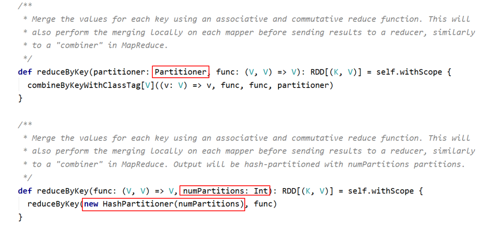

#### RangePartitioner

简单来说就是将一定范围内的数据映射到某一个分区，在实现中，分区算法尤为重要，用到了水塘抽样算法。sortByKey会使用RangePartitioner

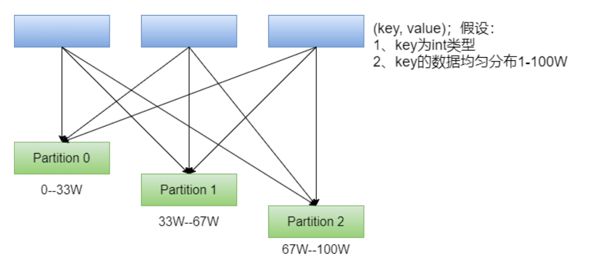

现在的问题：在执行分区之前，其实并不知道数据分布情况，如果想知道数据分区就需要对**数据进行采样**，spark中RangePartitioner对数据采用的过程使用的**水塘采样算法。**

水塘采样：从包含n个项目的集合S中选取k个样本，其中n为一个很大或未知的数量，尤其适用于不能把所有n个项目都存放到主内存的情况。

在采样的过程中执行了collect()操作，引发了Action。具体看sortByKey，sortByKey是一个Transformation。但是里面有执行action操作。

#### 自定义分区器

Spark运行用户自定义Partitioner对象， 灵活的控制RDD的分区方式

实现自定义分区器按以下规则分区:

* 分区0 < 100
* 100 <= 分区1 < 200 
* 200 <= 分区2 < 300 
* 300 <= 分区3 < 400
*  ... ...
* 900 <= 分区9 < 1000

```scala
package com.hhb.spark.core

import org.apache.spark.{Partitioner, SparkConf, SparkContext}

import scala.collection.immutable

/**
 * @description:
 * @date: 2020-10-31 16:41
 **/
class MyPartitioner(n: Int) extends Partitioner {
  override def numPartitions: Int = n

  override def getPartition(key: Any): Int = {
    key.toString.toInt / 100
  }
}

object TestMyPartitioner {
  def main(args: Array[String]): Unit = {

    //创建sc
    val sc = new SparkContext(new SparkConf().setAppName(this.getClass.getCanonicalName.init).setMaster("local[*]"))

    val random = new scala.util.Random()
    val arr: immutable.IndexedSeq[Int] = (1 to 100).map(_ => random.nextInt(1000))
    val rdd1 = sc.makeRDD(arr).map((_, 1))
    rdd1.glom.collect.foreach(x => println(x.toBuffer))
    println("**" * 15)
    val rdd2 = rdd1.partitionBy(new MyPartitioner(11))
    rdd2.glom.collect.foreach(x => println(x.toBuffer))

    //    关闭sc
    sc.stop()
  }
}
```

### 广播变量

有时间需要在多个任务之间共享变量，或者在任务（Task）和Driver Program 之间共享变量。为了满足这个需求，Spark提供了两种类型的变量

* 广播变量（broadcast variables）
* 累加器（accumulators）

广播变量、累加器主要作用是为了优化Spark程序

广播变量将变量在节点的Exceutor之间进行共享（有Driver广播出去），广播变量用来高效分发较大的对象。向所有工作节点（Executor）发送一个较大的只读值，以供一个或多个操作使用

使用广播变量的过程如下：

* 对一个类型T的对象调用SparkContext.broadcast创建一个Broadcast[T]对象，任何序列化的类型都可以这么实现（在Driver端）
* 通过value属性访问该对象的值（在Executor中）
* 变量只会被发到各个Executor一次，作为只读值处理

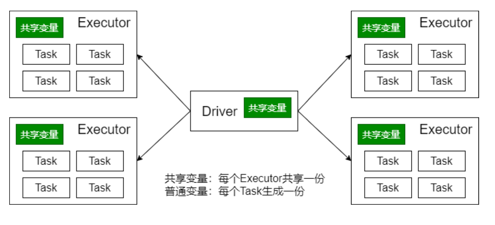

广播变量的参数：

* spark.broadcast.blockSize(缺省值:4m) 压缩的共享变量会分块，每块默认4M
* spark.broadcast.checksum(缺省值:true) 检查Driver发送到Executor的实际数量和要发送的数量
* spark.broadcast.compress(缺省值:true) 是否压缩

#### 广播变量的运用（Map Side Join）

普通的Join操作：

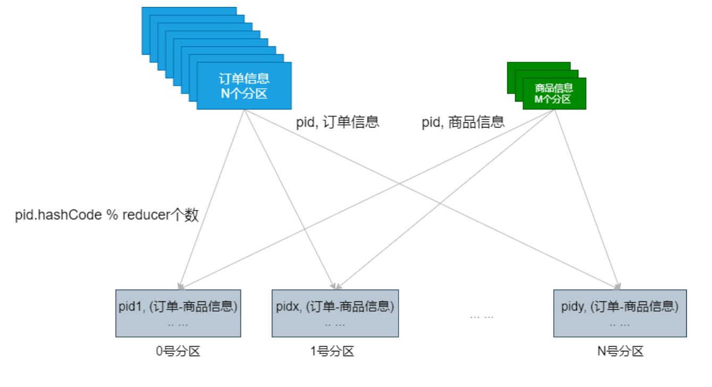

```scala
package com.hhb.spark.core

import org.apache.spark.rdd.RDD
import org.apache.spark.{SparkConf, SparkContext}

/**
 * @description:
 * @author: huanghongbo
 * @date: 2020-10-31 21:36
 **/
object JoinDemo {
  def main(args: Array[String]): Unit = {

    val sc = new SparkContext(new SparkConf().setMaster("local[*]").setAppName(this.getClass.getCanonicalName.init))
    //读取本地，默认分片是32M，在这里设置模拟HDFS128M
    sc.hadoopConfiguration.setLong("fs.local.block.size", 128 * 1024 * 1024)
    //读取文件
    val productRDD = sc.textFile("/Users/baiwang/myproject/spark/data/lagou_product_info.txt")
      .map(lines => {
        (lines.split(";")(0), lines)
      })
    //读取文件
    val orderRDD = sc.textFile("/Users/baiwang/myproject/spark/data/orderinfo.txt")
      .map(lines => {
        (lines.split(";")(2), lines)
      })

    //有Shuffle
    val resultRDD: RDD[(String, (String, String))] = productRDD.join(orderRDD)
    println(resultRDD.count())

    Thread.sleep(10000000)

    sc.stop()

  }
}
```

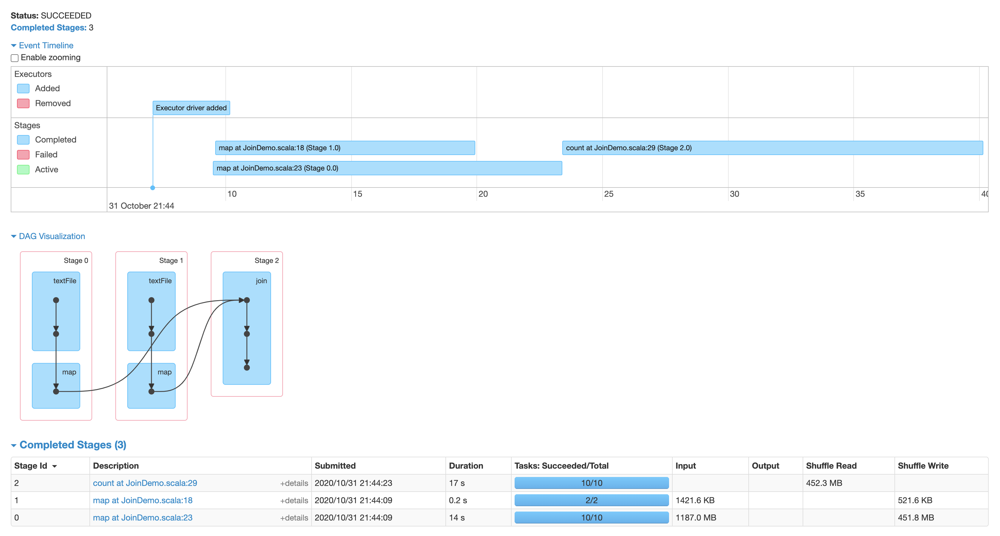

Map Side Join

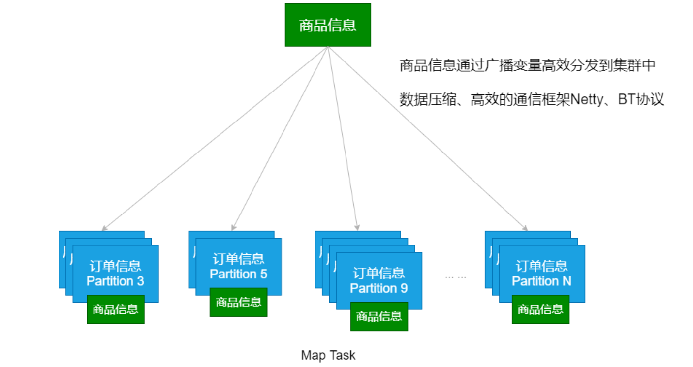

```scala
package com.hhb.spark.core

import org.apache.spark.broadcast.Broadcast
import org.apache.spark.{SparkConf, SparkContext}

/**
 * @description:
 * @author: huanghongbo
 * @date: 2020-10-31 21:36
 **/
object MapSideJoin {
  def main(args: Array[String]): Unit = {

    val sc = new SparkContext(new SparkConf().setMaster("local[*]").setAppName(this.getClass.getCanonicalName.init))
    //读取本地，默认分片是32M，在这里设置模拟HDFS128M
    sc.hadoopConfiguration.setLong("fs.local.block.size", 128 * 1024 * 1024)
    //读取文件
    val productRDD = sc.textFile("/Users/baiwang/myproject/spark/data/lagou_product_info.txt")
      .map(lines => {
        (lines.split(";")(0), lines)
      })
    val broadProduct: Broadcast[collection.Map[String, String]] = sc.broadcast(productRDD.collectAsMap())

    //读取文件
    val orderRDD = sc.textFile("/Users/baiwang/myproject/spark/data/orderinfo.txt")
      .map(lines => {
        (lines.split(";")(2), lines)
      })

    //有Shuffle
    //    val resultRDD: RDD[(String, (String, String))] = productRDD.join(orderRDD)
    //用这种方式无shuffle，广播变量
    val resultRDD = orderRDD.map { case (pid, line) => {
      val productMap = broadProduct.value
      val productInfo = productMap.getOrElse(pid, null)
      (pid, productInfo, line)
    }
    }
    println(resultRDD.count())

    Thread.sleep(10000000)

    sc.stop()
  }
}
```

这种方式没有shuffle

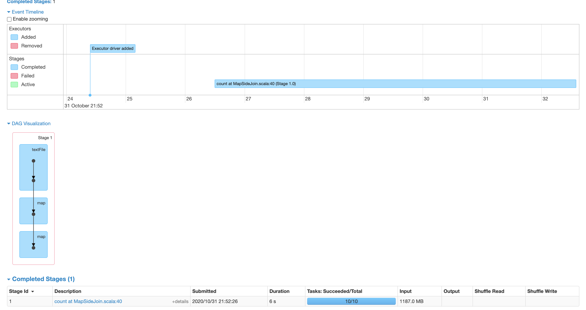

### 累加器

累加器的作用：可以实现一个变量在不同的Executor端能保持状态的累加；累加器在Driver端定义，读取；在Executor中完成累加；累加器也是Lazy的，需要Action触发，Action触发一次，执行一次，触发多次，执行多次。累加器一个比较经典的应用场景是用来在Spark Streaming应用中记录某些事件的数量。

```scala
//方式一
scala> val data = sc.makeRDD(Seq("a b c","d e f"))
data: org.apache.spark.rdd.RDD[String] = ParallelCollectionRDD[0] at makeRDD at <console>:24

scala> val rdd1 = data.flatMap(_.split("\\s+"))
rdd1: org.apache.spark.rdd.RDD[String] = MapPartitionsRDD[1] at flatMap at <console>:25

scala> val rdd2 = rdd1.map( word => 1)
rdd2: org.apache.spark.rdd.RDD[Int] = MapPartitionsRDD[3] at map at <console>:25

scala> val count = rdd2.reduce(_+_)
count: Int = 6
//方式二
scala> var acc = 0
acc: Int = 0
scala> data.flatMap(_.split("\\s+")).foreach(word => acc+= 1)

scala> println(acc)
0

//在Driver中定义变量，每个运行的Task会得到这些变量的一个副本，但在Task中更新这些副本的值，不会影响Driver中对应变量的值。
```

Spark内置类型的累加器，分别是：

* LongAccumulator 用来累加整数型
* DoubleAccumulator 用来累加浮点型
* CollectionAccumulator 用来累加集合元素

```scala
scala> val data = sc.makeRDD("a b c d e f g h  i j k l m n".split("\\s+"))
data: org.apache.spark.rdd.RDD[String] = ParallelCollectionRDD[6] at makeRDD at <console>:24

scala> val acc1 = sc.longAccumulator
acc1: org.apache.spark.util.LongAccumulator = LongAccumulator(id: 125, name: None, value: 0)

scala> val acc2 = sc.doubleAccumulator
acc2: org.apache.spark.util.DoubleAccumulator = DoubleAccumulator(id: 126, name: None, value: 0.0)

scala> val acc3 =sc.collectionAccumulator[String]
acc3: org.apache.spark.util.CollectionAccumulator[String] = CollectionAccumulator(id: 128, name: None, value: [])

scala> val rdd = data.map{ word =>
     | acc1.add(word.length)
     | acc2.add(word.length)
     | acc3.add(word)
     | word
     | }
rdd: org.apache.spark.rdd.RDD[String] = MapPartitionsRDD[7] at map at <console>:31

scala> rdd.count
res7: Long = 14

scala> println(s"acc1=${acc1.value},acc2 = ${acc2.value},acc3=${acc3.value}")
acc1=14,acc2 = 14.0,acc3=[c, d, e, l, m, n, i, j, k, f, g, h, a, b]

scala> rdd.count
res10: Long = 14

scala> println(s"acc1=${acc1.value},acc2 = ${acc2.value},acc3=${acc3.value}")
acc1=28,acc2 = 28.0,acc3=[c, d, e, l, m, n, i, j, k, f, g, h, a, b, c, d, e, f, g, h, i, j, k, l, m, n, a, b]

```

### TopN的优化

```scala
package com.hhb.spark.core

import org.apache.spark.rdd.RDD
import org.apache.spark.{SparkConf, SparkContext}

import scala.collection.immutable

/**
 * @description:
 * @date: 2020-11-02 10:20
 **/
object TopNTest {

  def main(args: Array[String]): Unit = {

    val sc = new SparkContext(new SparkConf().setAppName(this.getClass.getCanonicalName.init).setMaster("local[*]"))


    val random = scala.util.Random
    val N = 10
    val list: immutable.IndexedSeq[String] = (1 to 50).flatMap {
      idx =>
        (1 to 2000).map { id =>
          f"group$idx%2d,${random.nextInt(100000)}"
        }
    }
    //生产测试数据的RDD
    val valueRDD: RDD[(String, Int)] = sc.makeRDD(list).map {
      line =>
        val strArr = line.split(",")
        (strArr(0), strArr(1).toInt)
    }
    //缓存数据
    valueRDD.cache()
    //方法一：排序后，从右向左取值后再反转，由于使用的groupBy，是全部数据进行Shuffle
    val result1 = valueRDD.groupByKey().mapValues(x => x.toList.sorted.takeRight(N).reverse)
    result1.sortByKey().collect.foreach(println(_))
    println("--" * 15)
    //方法二：由于shuffle无法曲线，那么就减少shuffle，在每一个分区内获取topN后。分区间在获取topN
    val result2 = valueRDD.aggregateByKey(List[Int]())(
      //分区内取值,一个参数就是初始值，第一个参数就是valueRDD的value,把value放到list中后排序，取N个
      (list, score) => (list :+ score).sorted.takeRight(N),
      //把两个集合合并后，再次去N个，这个是分区间的合并
      (list1, list2) => (list1 ++ list2).sorted.takeRight(N)
    ).mapValues(list => list.sorted.reverse)
    result2.sortByKey().collect.foreach(println(_))
  }
}
```

## Spark原理初探

### Standalone模式作业提交

Standalone模式下四个重要组成部分，分别是：

* Driver： 用户编写Spark应用程序就运行在Driver上，有Driver执行
* Master：主要负责资源的调度和分配，并进行集群的监控等职责
* Worker：Worker运行在集群中的一台服务器上，负责管理该节点的资源，负责启动节点上的Executor
* Executor：一个Worker上可以运行多个Executor，Executor通过启动多个线程（Task）对RDD的分区进行并行计算

SparkContext中的三大组件

DAGScheduler：负责将DAG划分成若干个Stage

TashScheduler：将DAGScheduler提交的Stage（TaskSet）进行优先级排序，再将task发送到Executor

SchedulerBackend：定义了许多与Executor事件相关的处理，包括：新的executor注册进来的时候记录executor的信息，增加全局的资源量（核数）；executor更新状态，若任务完成的话，回收core；其他停止executor、remove executor等事件

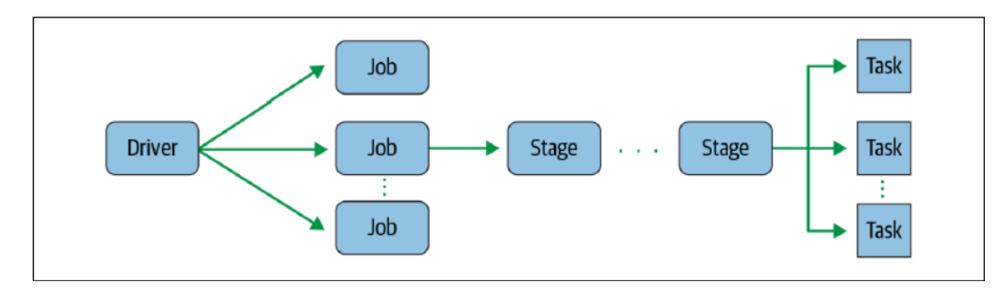

Standalone模式下作业提交步骤

1、启动应用程序，完成SparkContext初始化

2、Driver程序向master注册，申请资源

3、Master检查集群资源情况。如集群资源满足，通知Worker启动Executor

4、Executor启动后向Driver注册（反向注册）

5、Driver完成DAG解析，得到Tasks，然后向Executor发生Task

6、Executor向Driver汇总任务的执行情况

7、应用程序执行完毕，回收资源

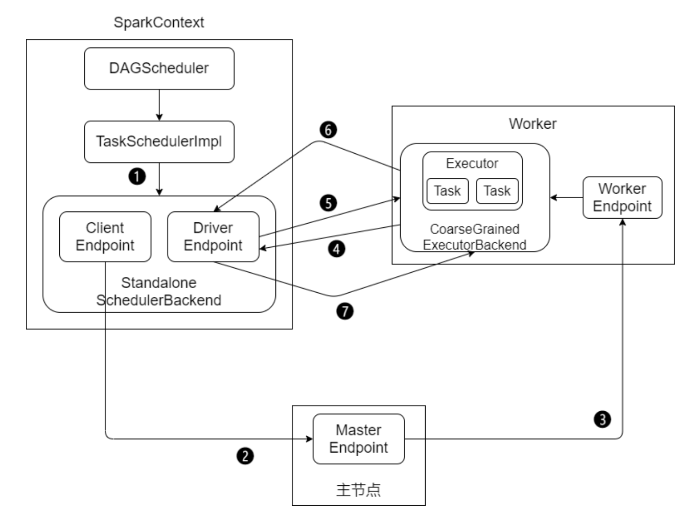


### Shuffle原理

Shuffle的本意是洗牌，目的就是把牌弄乱。

Spark、Hadoop中的shuffle可不是为了把数据弄乱，而是为了将随机排列的数据转换成具有移动规则的数据。Shuffle是MapReduce计算框架中的一个特殊的阶段，介于Map和Reduce之间，当Map的输出结果要被Reduce使用时，输出的结果需要按key排列，并且分发到Reducer上去，这个过程就是Shuffle。

Shuffle涉及到了本地磁盘（非HDFS）的读写和网络的传输，大多数的Spark作业的性能主要就是消耗在了Shuffle环境，因此shuffle性能的高低直接影响到整个程序的运行效率

在Spark Shuffle的实现上，经历了Hash、Sort、Tungsten-Sort(堆外排序)三阶段

* Spark 0.8及以前 Hash Based Shuffle

* Spark 0.8.1 为Hash Based Shuffle引入File Consolidation机制 
* Spark 0.9 引入ExternalAppendOnlyMap

* Spark 1.1 引入Sort Based Shuffle，但默认仍为Hash Based Shuffle 
* Spark 1.2 默认的Shuffle方式改为Sort Based Shuffle

* Spark 1.4 引入Tungsten-Sort Based Shuffle

* Spark 1.6 Tungsten-sort并入Sort Based Shuffle

* Spark 2.0 Hash Based Shuffle退出历史舞台

**简单的说:**

* Spark 1.1 以前是Hash Shuffle

* Spark 1.1 引入了Sort Shuffle

* Spark 1.6 将Tungsten-sort并入Sort Shuffle 
* Spark 2.0 Hash Shuffle退出历史舞台

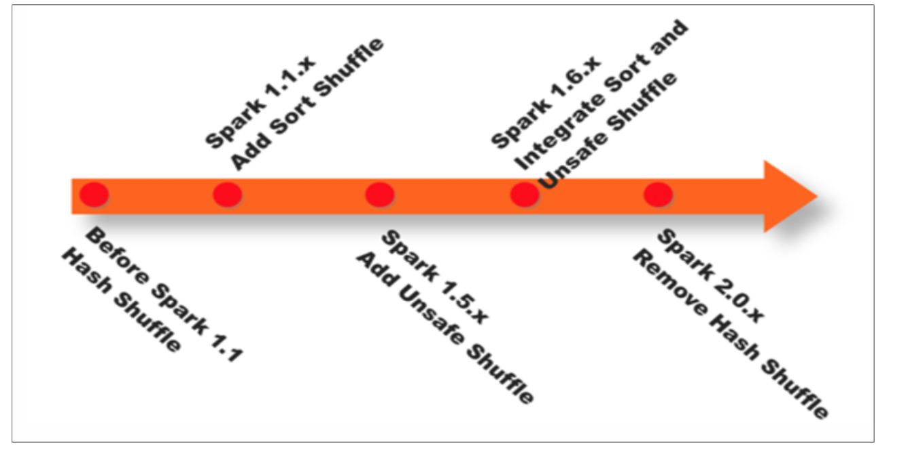

#### Hash Base Shuffle V1

* 每个Shuffle Map Task 需要为每个下游的Task创建一个单独的文件
* Shuffle过程中会生成海量的小文件，同时打开过多文件、低效的随机IO

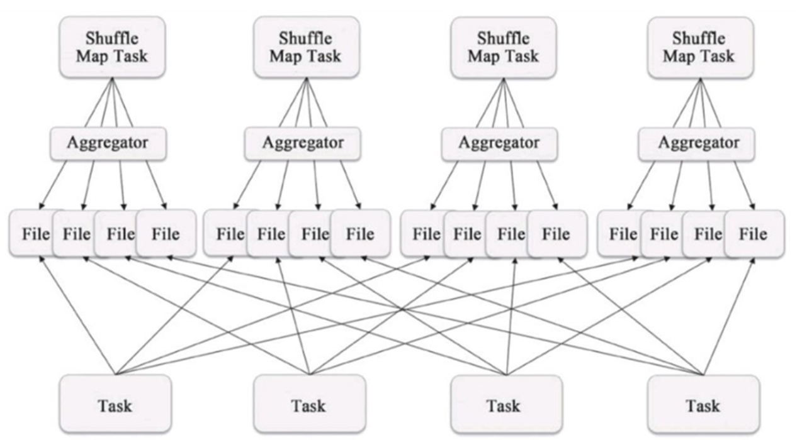

#### Hash Base Shuffle V2

Hash Base Shuffle V2 核心思想：允许不同的task复用同一批磁盘文件，有效降多个task的磁盘文件进行一定程度上的合并，从而大幅度减少磁盘数量，进而提升shuffle write的性能，一定程度上解决了Hash V1的问题，但不彻底

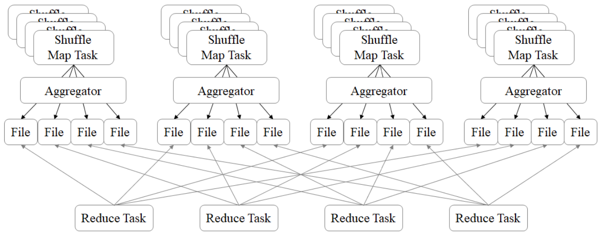

Hash Shuffle规避了排序，提高了性能；总体来说在Hash Shuffle过程中生成海量的小文件（Hash Base Shuffle V2 生成海量小文件的问题得到了一定程度的缓解）。

#### Sort Base Shuffle

Sort Base Shuffle 大大减少了Shuffle过程中产生的文件数，提高Shuffle的效率

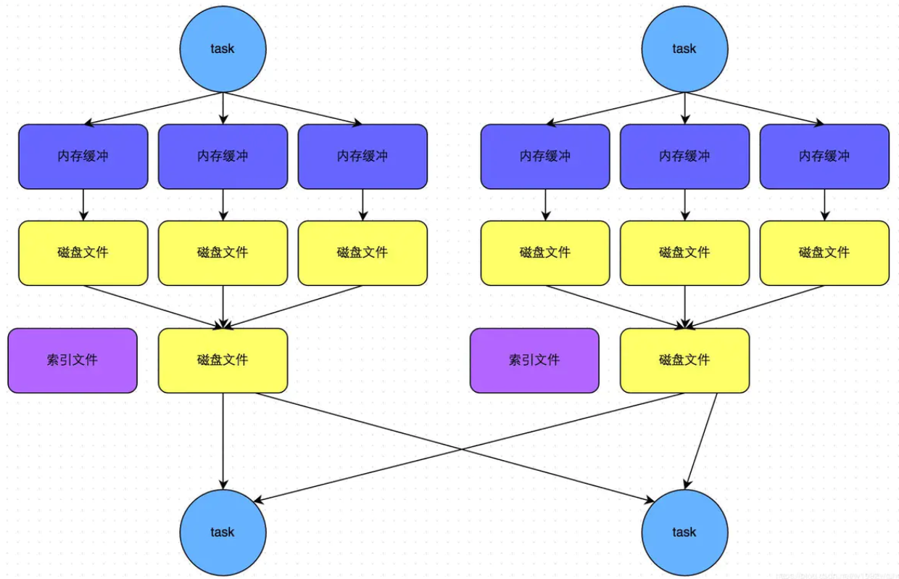

Spark Shuffle 与 Hadoop Shuffle从目的、功能上看时类似的，实现（细节）上有区别

### RDD变成优化

#### RDD复用

避免创建重复的RDD，在开发过程中要注意：对于同一份数据，只应该创建一个RDD，不要创建多个RDD来代表同一份数据

#### RDD缓存/持久化

* 当多次对同一个RDD执行算子操作时，每一次都会对这个RDD以及之前的父RDD重新计算一次，这种情况是必须要避免的，对同一个RDD的重复计算时对资源的极大浪费
* 对多次使用的RDD进行持久化，通过持久化将公共RDD的数据缓存到内存/磁盘中，之后对于公共RDD的计算都会从内存/磁盘中直接获取RDD数据
* RDD的持久化是可以进行序列化的，当内存无法将RDD的数据完整的进行存放的时候，可以考虑使用序列化的方式减小数据体积，将数据完成存储在内存中

#### 巧用filter

* 尽可能早的执行filter操作，过滤无用数据
* 在filter过滤掉较多数据后，使用coalesce对数据进行重分区

#### 使用高性能算子

1. 避免使用groupByKey，根据场景使用高性能算子的聚合算子reduceByKey、aggregateByKey
2. coalesce、repartition，在可能的情况下优先选择没有shuffle的操作
3. foreachPartition优先输出操作
4. map、mapPartitions 选择合理的算子。MapPartitions性能更好，但数据量大时容易导致OOM
5. 用repartitionAndSortWithinPartitions替代repartition + sort 操作
6. 合理使用cache、persist、checkpoint，选择合理的数据存储级别
7. filter使用
8. 减少对数据源的扫描（算法复杂了）

#### 设置合理的并行度

* Spark 作业中并行度指各个stage的task数量
* 设置合理的并行度，让并行度与资源相匹配。见到来说就是在资源允许的前提下，并行度要设置的尽可能大，达到可以充分利用的集群资源。合理的设置并行度，可以提升整个Spark作业的性能和运行速度

#### 广播大变量

* 默认情况下，task中的算子中如果使用了外部变量，每个task都会获取一份变量的副本，这回造成多余的网络传输和内存消耗
* 使用广播变量，只会在每个Executor保存一个副本，Executor的所有task公用此广播变量，这样就节约了网络及内存资源


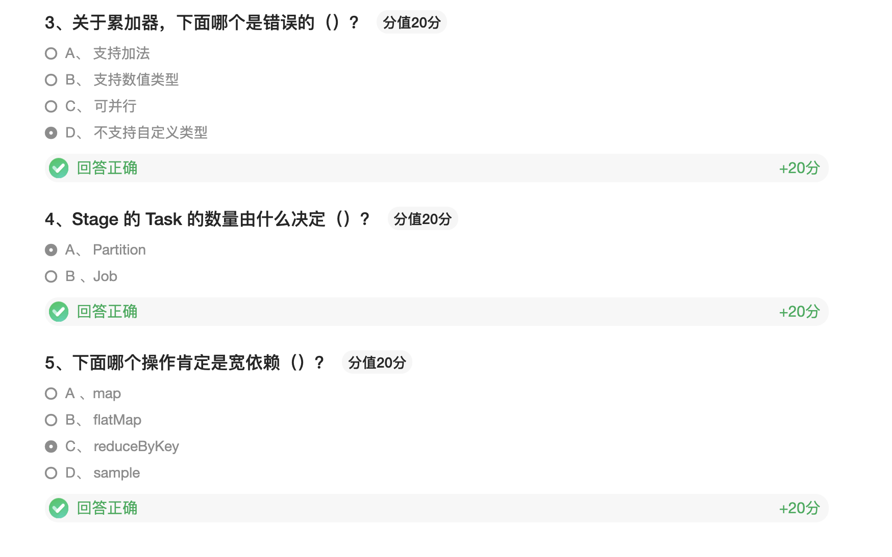

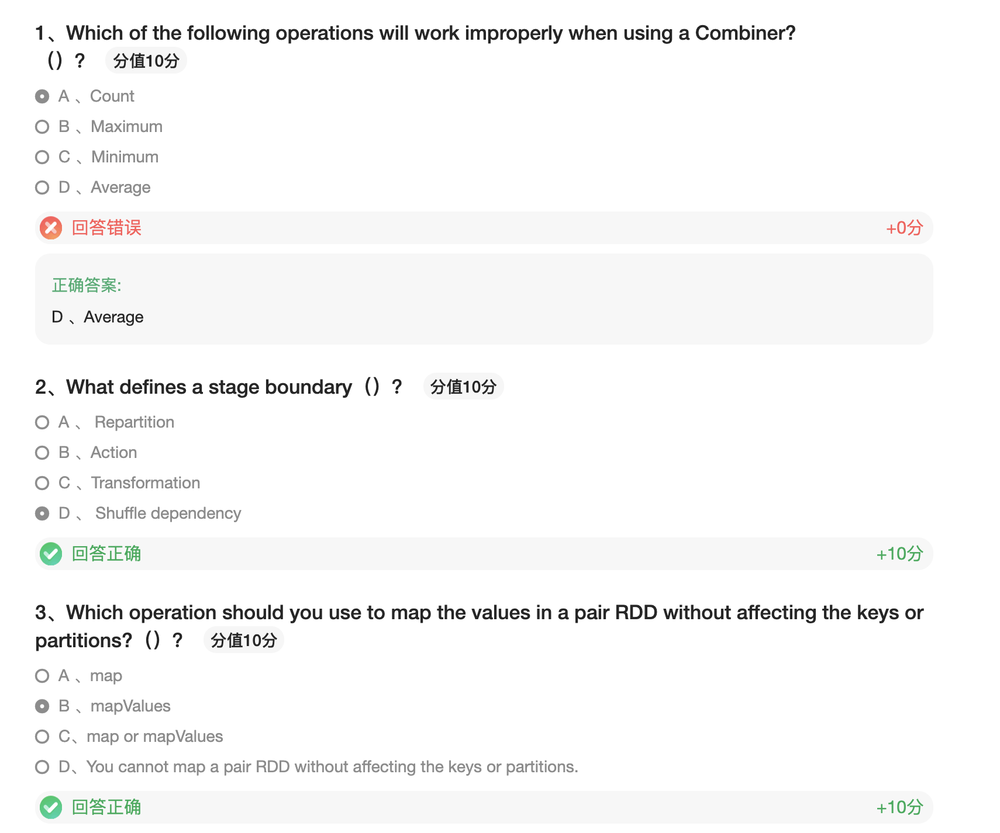

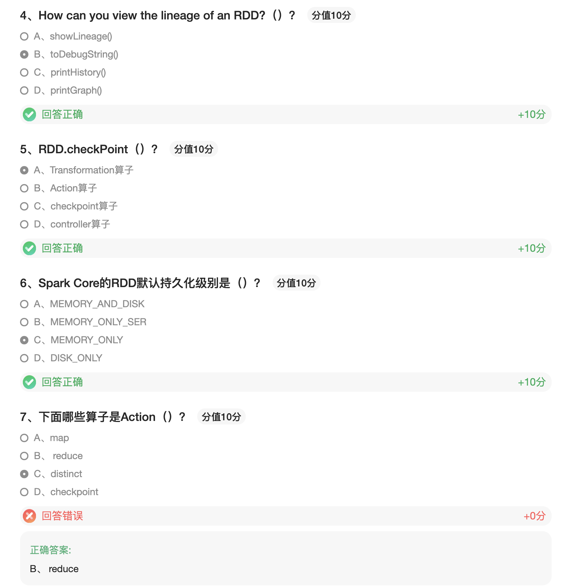

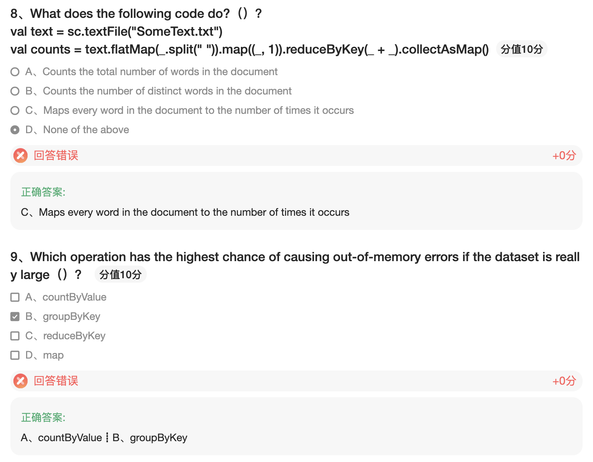

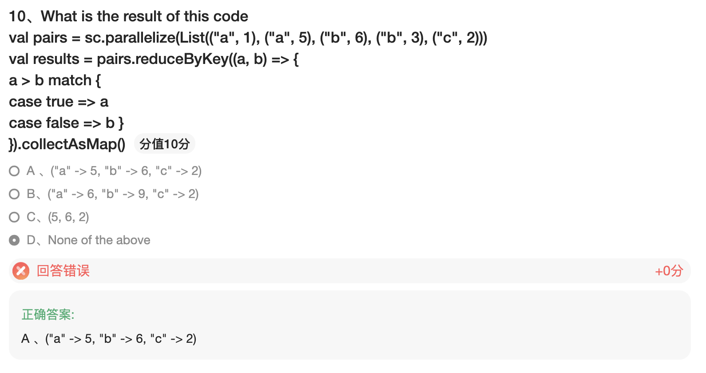


