## Spark SQL

### Spark SQL的概述

Hive的诞生，主要是因为开发MapReduce程序对 Java 要求比较高，为了让他们能够操作HDFS上的数据，推出了Hive。Hive与RDBMS的SQL模型比较类似，容易掌握。 Hive的主要缺陷在于它的底层是基于MapReduce的，执行比较慢。

在Spark 0.x版的时候推出了Shark，Shark与Hive是紧密关联的，Shark底层很多东西还是依赖于Hive，修改了内存管理、物理计划、执行三个模块，底层使用Spark的基于内存的计算模型，性能上比Hive提升了很多倍。

Shark更多是对Hive的改造，替换了Hive的物理执行引擎，提高了执行速度。但Shark继承了大量的Hive代码，因此给优化和维护带来了大量的麻烦。

在Spark 1.x的时候Shark被淘汰。在2014 年7月1日的Spark Summit 上， Databricks宣布终止对Shark的开发，将重点放到 Spark SQL 上。

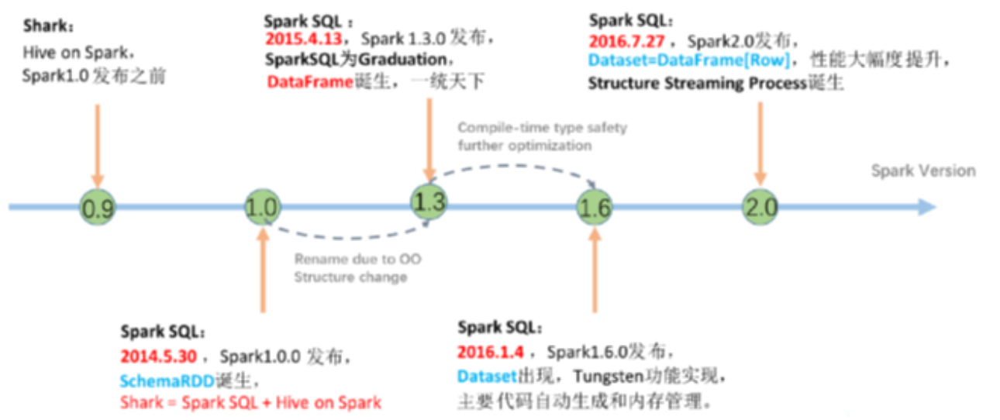

Shark终止以后，产生了两个分支: 

* Hive on Spark

hive社区的，源码在hive中

* Spark SQL(Spark on Hive)

Spark社区，源码在Spark中，支持多种数据源，多种优化技术，扩展性好很多;Apache Spark 3.0.0解决超过3400个Jira问题被解决，这些问题在Spark各个核心组件中分布情况如下图:

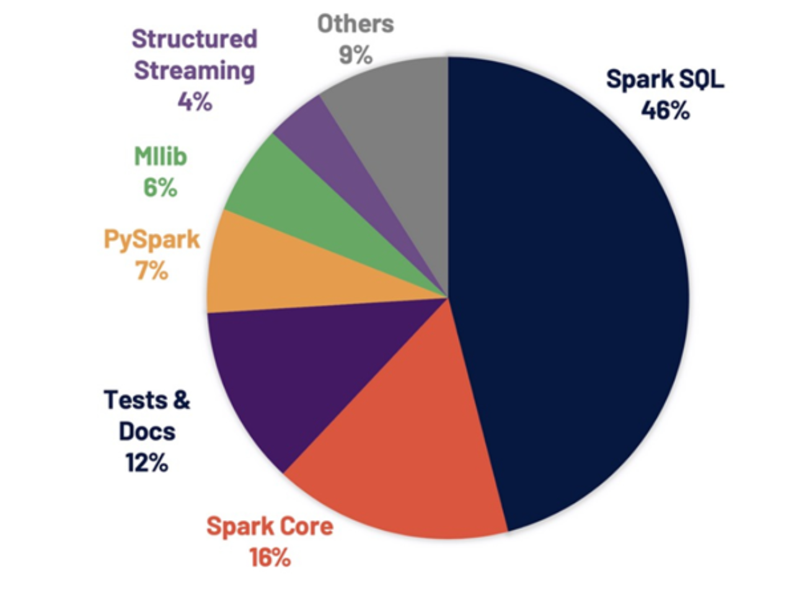

#### Spark SQL特点

Spark SQL自从面世以来不仅接过了shark的接力棒，为spark用户提供高性能的SQL on hadoop的解决方案，还为spark带来了通用的高效的，多元一体的结构化的数据 处理能力。

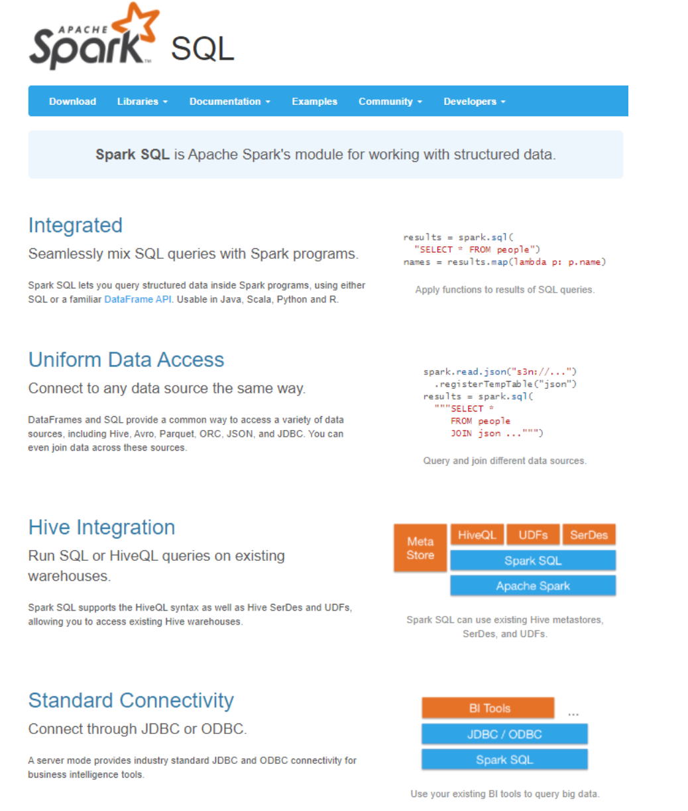

Spark SQL 的优势

* 写更少的代码
* 读更少的数据（SparkSQL的表数据在内存中存储，不使用原生态JVM对象存储方法，而是采用内存列存储）
* 提供更好的性能（字节码生成技术、SQL优化）

#### Spark SQL数据抽象

Spark SQL提供了两个新的抽象，分别是DataFrame 和Dataset；同样的数据都给到这三个数据结构，经过系统的计算逻辑，都得到相同的结果。不同的是他们的执行效率和执行方式

在后期的Spark版本中，Dataset会逐步取代RDD和DataFrame成为唯一的API接口

###### DataFrame

DataFrame的前身是SchemaRDD。Spark1.3更名为DataFrame。不继承RDD，自己实现RDD的大部分功能。

与RDD类似，DataFrame也是一个分布式数据集

* DataFrame可以看做分布式Row对象的集合，提供了由列组成的详细模式信息，使其可以得到优化，DataFrame不仅有比RDD更多的算子，还可以进行执行计划的优化
* DataFrame更像传统数据库的二维表格，除了数据以外，还记录数据的结构信息，即schema
* DataFrame也支持嵌套数据类型（struct、array和Map）
* DataFrame API提供的是一套高层的关系操作，比函数式RDD API更加优化，门槛低
* DataFrame的劣势在于在编译期缺少类型安全检查，导致运行时出错。

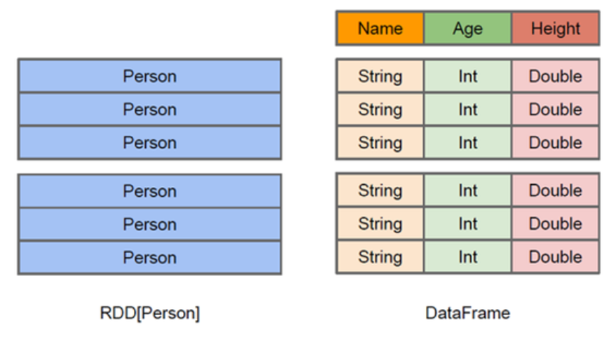

###### Dataset

Dataset时在Spark1.6中添加的新接口；与RDD相比，可以保存更多的描述信息，概念上等同于关系型数据库中的二维表。与DataFrame相比，保存了类型信息，是强类型，提供了编译时检查。

调用Dataset的方法会生成逻辑计划，然后Spark的优化器进行优化，最终胜出无力计划，然后提交到集群中运行。

Dataset包含了DataFrame的功能，在Spark2.0中两者得到了统一，DataFrame表示为Dataset[Row]，即Dataset的子集


###### Row & Shcema

DataFrame = RDD[Row] + Schema; DataFrame 的前身的SchemaRDD

**Row是一个泛化的无类型JVM对象**

```shell
scala> import org.apache.spark.sql.Row
import org.apache.spark.sql.Row

scala> val row1 = Row(1,"abc",1.2)
row1: org.apache.spark.sql.Row = [1,abc,1.2]

scala> row1(0)
res0: Any = 1

scala> row1(1)
res1: Any = abc

scala> row1(2)
res2: Any = 1.2

scala> row1.getInt(0)
res3: Int = 1

scala> row1.getString(1)
res4: String = abc

scala> row1.getDouble(2)
res6: Double = 1.2

scala> row1.getDouble(3)
java.lang.ArrayIndexOutOfBoundsException: 3
  at org.apache.spark.sql.catalyst.expressions.GenericRow.get(rows.scala:174)
  at org.apache.spark.sql.Row.isNullAt(Row.scala:191)
  at org.apache.spark.sql.Row.isNullAt$(Row.scala:191)
  at org.apache.spark.sql.catalyst.expressions.GenericRow.isNullAt(rows.scala:166)
  at org.apache.spark.sql.Row.getAnyValAs(Row.scala:472)
  at org.apache.spark.sql.Row.getDouble(Row.scala:248)
  at org.apache.spark.sql.Row.getDouble$(Row.scala:248)
  at org.apache.spark.sql.catalyst.expressions.GenericRow.getDouble(rows.scala:166)
  ... 49 elided

scala> row1.getAs[Int](0)
res7: Int = 1

scala> row1.getAs[String](1)
res8: String = abc

scala> row1.getAs[Double](2)
res9: Double = 1.2
```

DataFrame（即带有Schema信息的RDD），Spark通过Schema就能够读懂数据。

什么是schema？

DataFrame 中提供了详细的数据结构信息，从而使得SparkSQl可以清晰地知道该数据集中包含哪些列，每列的名称和类型各是什么，DataFrame中的数据结构信息，即为schema。

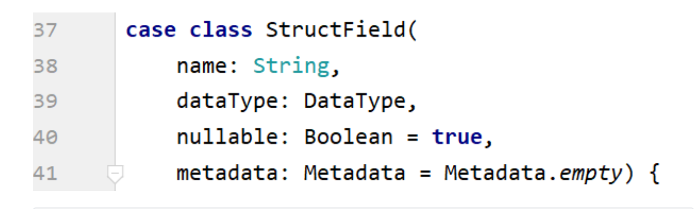

```shell
import org.apache.spark.sql.types._ 
val schema = (new StructType).
add("id", "int", false).
add("name", "string", false).
add("height", "double", false)
```

参考源码StructType.scala

```scala
import org.apache.spark.sql.types._
val schema1 = StructType( StructField("name", StringType, false)
                         :: StructField("age",  IntegerType, false)
                         :: StructField("height", IntegerType,false) ::  Nil)

val schema2 = StructType( Seq(StructField("name", StringType,false),
                              StructField("age",  IntegerType,false),
                              StructField("height", IntegerType,false)))

val schema3 = StructType( List(StructField("name", StringType,false),
                               StructField("age",  IntegerType,false),
                               StructField("height", IntegerType,false)))

// 来自源码
val schema4 = (new StructType).
add(StructField("name", StringType, false)).
add(StructField("age", IntegerType, false)).
add(StructField("height", IntegerType, false))

val schema5 = (new StructType).
add("name", StringType, true, "comment1").
add("age", IntegerType, false, "comment2").
add("height", IntegerType, true, "comment3")
```

###### 三者的共性

1. RDD、DataFrame、Dataset都是Spark平台下的分布式弹性数据集，为处理海量数据提供便利
2. 三者都有许多相同的概念，如分区、持久化、容错多难过，有许多共同的函数，如map、filter、sortBy等
3. 三者都有惰性机制，只有遇到Action算子时，才会开始真正的计算
4. 对DataFrame和Dataset进行操作，许多操作都是通过这个包来进行支持，`import spark.implicits._`

###### 三者的区别

DataFrame(DataFrame = RDD[Row] + Schema):

1. 与RDD和Dataset不同，DataFrame每一行的固定为Row，只有通过解析才能获取各个字段的值。
2. DataFrame与Dataset均支持SparkSQL的操作

Dataset(Dataset = RDD[case class].toDS):

1. Dataset和DataFrame拥有完全相同的成员函数，区别只是每一行的数据类型不同
2. DataFrame第一位Dataset[Row]。每一行的类型是Row。每一行究竟有哪些字段，各个字段又是什么类型都无从得知，只能用前面提到的getAs方法或者模式匹配拿出特定字段
3. Dataset每一行的数据类型都是一个case class，在自定义了case class之后，可以很自由的获取每一行的信息

#### 数据类型

[官网](http://spark.apache.org/docs/latest/sql-ref-datatypes.html)

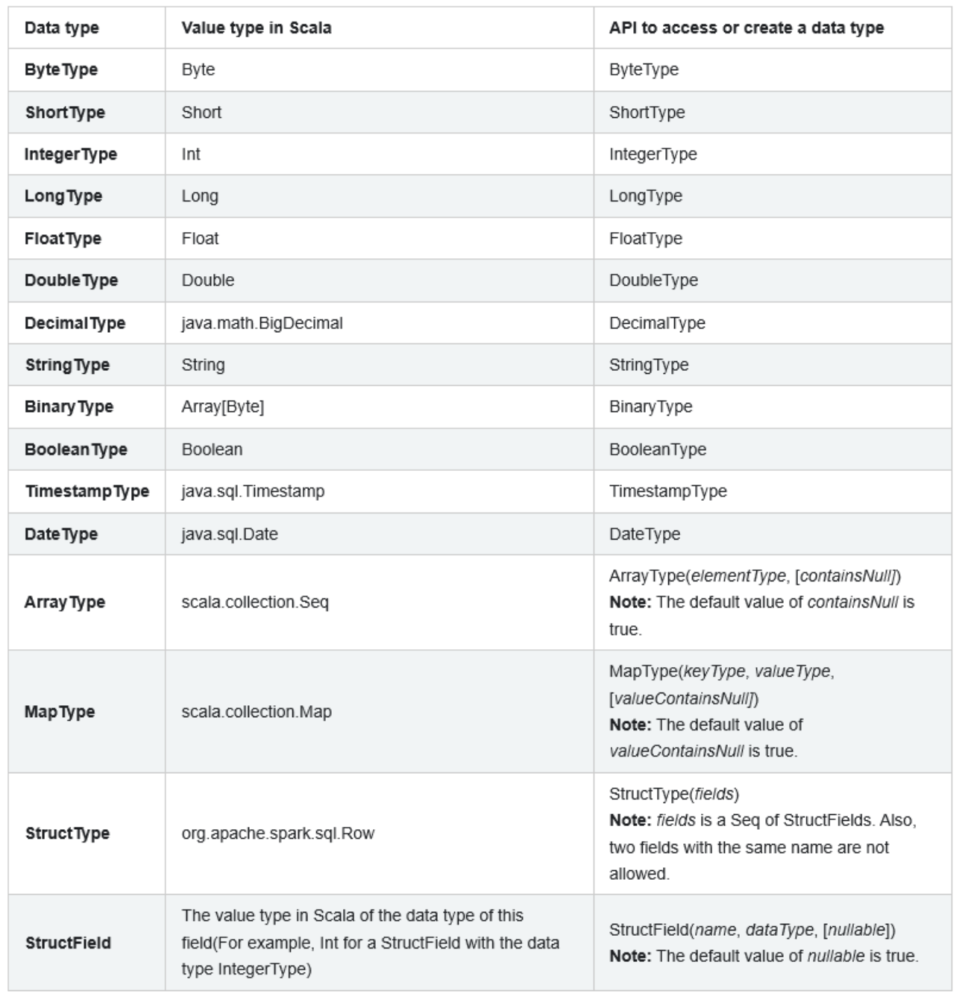

### Spark SQL 编程

[官方文档](http://spark.apache.org/docs/latest/sql-getting-started.html)

#### SparkSession


#### DataFrame & Dataset的创建

不用刻意区分：DF和DS，因为DF是一种特殊的DS，而且当DS执行某些transformation的时候会返回DF

###### 有range生成DS

```scala
//创建一个DS
scala> val numDs = spark.range(5,1000,5)
numDs: org.apache.spark.sql.Dataset[Long] = [id: bigint]
//输出DS的schema信息
scala> numDs.printSchema
root
 |-- id: long (nullable = false)

//统计信息
scala> numDs.describe().show
+-------+------------------+
|summary|                id|
+-------+------------------+
|  count|               199|
|   mean|             500.0|
| stddev|287.95254238618327|
|    min|                 5|
|    max|               995|
+-------+------------------+
//与上面的统计信息一致
scala> numDs.rdd.map(_.toInt).stats
res14: org.apache.spark.util.StatCounter = (count: 199, mean: 500.000000, stdev: 287.228132, max: 995.000000, min: 5.000000)
// 按照id字段排序后显示前五个
scala> numDs.orderBy(desc("id")).show(5)
+---+
| id|
+---+
|995|
|990|
|985|
|980|
|975|
+---+
only showing top 5 rows
//按照ID排序，显示20个，默认20个
scala> numDs.orderBy(desc("id")).show()
+---+
| id|
+---+
|995|
|990|
|985|
|980|
|975|
|970|
|965|
|960|
|955|
|950|
|945|
|940|
|935|
|930|
|925|
|920|
|915|
|910|
|905|
|900|
+---+
only showing top 20 rows
// 检查分区数
scala> numDs.rdd.getNumPartitions
res17: Int = 5
```

###### 由集合生成DS

Dataset = RDD[case class]

```scala
//
case class Person(name:String,age:Int,height:Int)
// 创建一个Person的集合
scala> val seq1 =Seq(Person("掌声",12,180), Person("历史",20,178),Person("wangw",30,160))
seq1: Seq[Person] = List(Person(掌声,12,180), Person(历史,20,178), Person(wangw,30,160))
//创建一个ds
scala> val ds1 = spark.createDataset(seq1)
ds1: org.apache.spark.sql.Dataset[Person] = [name: string, age: int ... 1 more field]
//显示字段信息
scala> ds1.printSchema
root
 |-- name: string (nullable = true)
 |-- age: integer (nullable = false)
 |-- height: integer (nullable = false)

//显示具体内容
scala> ds1.show
+-----+---+------+
| name|age|height|
+-----+---+------+
| 掌声| 12|   180|
| 历史| 20|   178|
|wangw| 30|   160|
+-----+---+------+


scala> val seq2 = Seq(("Jack", 28, 184), ("Tom", 10, 144), ("Andy", 16, 165))
seq2: Seq[(String, Int, Int)] = List((Jack,28,184), (Tom,10,144), (Andy,16,165))

scala> val ds2 = spark.createDataset(seq2)
ds2: org.apache.spark.sql.Dataset[(String, Int, Int)] = [_1: string, _2: int ... 1 more field]

scala> ds2.show
+----+---+---+
|  _1| _2| _3|
+----+---+---+
|Jack| 28|184|
| Tom| 10|144|
|Andy| 16|165|
+----+---+---+
```

###### 由集合生成DataFrame

DataFrame = RDD[Row] + Schema

```scala
scala> val lst = List(("zhangsan",12,180.0),("lisi",15,177.9),("wangwu",20,180.1))
lst: List[(String, Int, Double)] = List((zhangsan,12,180.0), (lisi,15,177.9), (wangwu,20,180.1))

scala> val df1 = spark.createDataFrame(lst)
df1: org.apache.spark.sql.DataFrame = [_1: string, _2: int ... 1 more field]

scala> df1.printSchema
root
 |-- _1: string (nullable = true)
 |-- _2: integer (nullable = false)
 |-- _3: double (nullable = false)
//修改单个字段
scala> df1.withColumnRenamed("_1","name").
     | withColumnRenamed("_2","age")
res5: org.apache.spark.sql.DataFrame = [name: string, age: int ... 1 more field]

scala> df1.printSchema
root
 |-- _1: string (nullable = true)
 |-- _2: integer (nullable = false)
 |-- _3: double (nullable = false)


scala> res5.printSchema
root
 |-- name: string (nullable = true)
 |-- age: integer (nullable = false)
 |-- _3: double (nullable = false)

// 在spark-shell中不需要处理，但是在IDEA中，desc是函数，在IDEA中使用是需要导包
import org.apache.spark.sql.functions._

scala> res5.orderBy(desc("age")).show()
[Stage 0:>                                                          (0 + 0) / 2]20/11/02 22:25:58 WARN TaskSchedulerImpl: Initial job has not accepted any resources; check your cluster UI to ensure that workers are registered and have sufficient resources
+--------+---+-----+
|    name|age|   _3|
+--------+---+-----+
|  wangwu| 20|180.1|
|    lisi| 15|177.9|
|zhangsan| 12|180.0|
+--------+---+-----+

//修改整个DF的列名
scala> val df2 = spark.createDataFrame(lst).toDF("name","age","height")
df2: org.apache.spark.sql.DataFrame = [name: string, age: int ... 1 more field]

scala> df2.printSchema
root
 |-- name: string (nullable = true)
 |-- age: integer (nullable = false)
 |-- height: double (nullable = false)
```

使用idea，引入POM

```xml
<dependency>
  <groupId>org.apache.spark</groupId>
  <artifactId>spark-sql_2.12</artifactId>
  <version>${spark.version}</version>
</dependency>
```

代码:

```scala
package com.hhb.spark.sql

import org.apache.spark.sql.types._
import org.apache.spark.sql.{Row, SparkSession}
import org.apache.spark.sql.functions._

/**
 * @description:
 * @author: huanghongbo
 * @date: 2020-11-02 22:34
 **/
case class Person(name: String, age: Int, height: Int)

object Demo {

  def main(args: Array[String]): Unit = {

    val spark = SparkSession.builder()
      .appName(this.getClass.getCanonicalName.init)
      .master("local[*]")
      .getOrCreate()
    val sc = spark.sparkContext
    sc.setLogLevel("warn")

    import spark.implicits._

    val arr1 = Array(("zhangsan", 18, 185), ("lisi", 10, 178), ("wangwu", 29, 177))
    val rdd1 = sc.makeRDD(arr1).map(f => Row(f._1, f._2, f._3))
    val schema1 = StructType(StructField("name", StringType, false)
      :: StructField("age", IntegerType, false)
      :: StructField("height", IntegerType, false)
      :: Nil)
    val schema2 = (new StructType).
      add("name", StringType, false, "姓名").
      add("age", IntegerType, false, "年龄").
      add("height", IntegerType, false, "身高")
    val dataFrame = spark.createDataFrame(rdd1, schema2)
    //desc 是一个function，需要引入包
    dataFrame.orderBy(desc("age")).show(1)
    dataFrame.printSchema()
    println("***" * 15)
    val arr2 = Array(("zhangsan", 18, null), ("lisi", 10, 178), ("wangwu", 29, 177))
    val rdd2 = sc.makeRDD(arr2).map(f => Row(f._1, f._2, f._3))
    val df2 = spark.createDataFrame(rdd2, schema2)
    df2.printSchema()
    //执行到这报错，因为height不可以为空，但是这里面有空值
    //    df2.show()
    println("***" * 15)
    val schema3 = (new StructType).
      add("name", StringType, false, "姓名").
      add("age", IntegerType, false, "年龄").
      add("height", IntegerType, true, "身高")

    val df3 = spark.createDataFrame(rdd2, schema3)
    df3.printSchema()
    df3.show()
    println("***" * 15)
    val rdd3 = sc.makeRDD(arr1).map(f => Person(f._1, f._2, f._3))
    //反射推断，spark通过反射从case class 的定义得到类名
    val df = rdd3.toDF() 
    //发射推断
    val ds = rdd3.toDS()
    df.printSchema()
    df.show()
    println("***" * 15)
    ds.printSchema()
    ds.show()
  }
}
```

###### RDD转Dataset

Dataset = RDD[case class]

DataFrame= RDD[Row] + schema

```scala
val ds2 = spark.createDataset(rdd3)
ds2.printSchema()
```

###### 从文件创建DataFrame（以csv文件为例）

```scala
//读取文件创建DF
val df4 = spark.read.csv("/Users/baiwang/myproject/spark/data/people1.csv")
df4.printSchema()
df4.show()
println("***" * 15)
val df5 = spark.read.csv("/Users/baiwang/myproject/spark/data/people2.csv")
df5.printSchema()
df5.show()

println("****" * 15)
//inferschema 自动类型推断，适用于简单的数据类型
//header：表头
val df6 = spark.read
.options(Map(("header", "true"), ("inferschema", "true")))
.csv("/Users/baiwang/myproject/spark/data/people1.csv")
df6.printSchema()
df6.show()
println("***" * 15)
//复杂类型是，不能使用自动类型推断
val schema = "name string,age int,job string"
val df7 = spark.read
.option("header", "true")
//设置csv的分隔符
.option("delimiter", ";")
.schema(schema)
.csv("/Users/baiwang/myproject/spark/data/people2.csv")
df7.printSchema()
df7.show()
```

#### 三者的转换

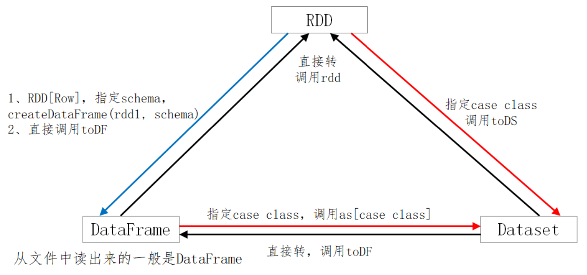

SparkSQL提供了一个领域特定语言（DSL）以方便操作结构化数据。核心思想还是SQL，仅仅是一个语法的问题

#### Action操作

与RDD类似的操作：show、collect、collectAsList、head、first、count、take、takeAsList、reduce

与结构类似的操作：printSchema、explain、columns、dtypes、col

```scala
package com.hhb.spark.sql

import java.util

import org.apache.spark.sql.{DataFrame, Row, SparkSession}

/**
 * @description:
 * @date: 2020-11-03 13:41
 **/
object ActionDemo {

  def main(args: Array[String]): Unit = {

    val spark = SparkSession.builder()
      .appName(this.getClass.getCanonicalName.init)
      .master("local[*]")
      .getOrCreate()
    val sc = spark.sparkContext
    sc.setLogLevel("warn")
    import spark.implicits._

    val df = spark.read
      //表头
      .option("header", "true")
      //自动类型推断
      .option("inferschema", "true")
      .csv("/Users/baiwang/myproject/spark/data/emp.dat")

    df.printSchema()
    df.show()

    println(s"df.count() => ${df.count()}")
    //并集，显示前20个
    df.union(df).show()
    println(s"df.union(df) => ${df.union(df).count()}")
    //显示前两个
    df.show(2)

    //将df转换成json，并显示前十条，且不截断字符
    df.toJSON.show(10, false)
    //显示前十个，不截断
    spark.catalog.listFunctions().show(10, false)
    //返回的是数组
    val rows: Array[Row] = df.collect()
    println(s"row:${rows}")
    //f返回的是list
    val rowList: util.List[Row] = df.collectAsList()
    println(s"rowList:${rowList}")

    //返回第一行，返回值是row类型
    val rowHead: Row = df.head()
    val rowFirst: Row = df.first()

    println(s"rowHead:$rowHead,rowFirst:$rowFirst")

    //返回前三行，返回值类型是Array
    val rowsHead: Array[Row] = df.head(3)
    val rowsTake: Array[Row] = df.take(3)
    println(s"rowsHead:$rowsHead,rowsTake:$rowsTake")

    //返回前两行，返回值类型是list
    val rowsTakeList: util.List[Row] = df.takeAsList(2)
    println(s"rowsTakeList:$rowsTakeList")

    //结构属性：
    println("查看列名：" + df.columns)
    println("查看列名和类型：" + df.dtypes)
    println("查看执行计划：" + df.explain())
    println("获取某个列：" + df.col("EMPNO"))
    df.printSchema()
  }
}
```

#### Transformation 操作

select * from tab where ... group by ... having... order by...

```
RDD类似的操作
持久化、缓存与checkpoint
select
where
group by /聚合
order by
join
集合操作
空值操作（函数）
函数
```

###### 与RDD类似的操作

map、filter、flatMap、mapPartitions、sample、 randomSplit、 limit、 distinct、dropDuplicates、describe

```scala
package com.hhb.spark.sql

import org.apache.spark.sql.{Dataset, Row, SparkSession}

/**
 * @description:
 * @date: 2020-11-03 14:09
 **/
object TransformationDemo {

  def main(args: Array[String]): Unit = {

    val spark = SparkSession.builder()
      .appName(this.getClass.getCanonicalName.init)
      .master("local[*]")
      .getOrCreate()
    val sc = spark.sparkContext
    sc.setLogLevel("warn")
    import spark.implicits._

    val df = spark.read
      //表头
      .option("header", "true")
      //自动类型推断
      .option("inferschema", "true")
      .csv("/Users/baiwang/myproject/spark/data/emp.dat")

    df.printSchema()
    //输出第一列
    df.map(row => row.getAs[Int](0)).show()
    df.map(_.getInt(0)).show()
    df.map(_.get(0).toString.toInt).show()
    //randomSplit(与RDD类似，将DF、DS切割成传入的比例，该比例为一个大概值)
    val arrayDS: Array[Dataset[Row]] = df.randomSplit(Array(0.5, 0.6, 0.7))
    println(s"${arrayDS(0).count()} ,,,${arrayDS(0).show()}")
    println(s"${arrayDS(1).count()} ,,,${arrayDS(1).show()}")
    println(s"${arrayDS(2).count()} ,,,${arrayDS(2).show()}")
    println("***" * 15)
    //取出10行数据，生成新的Dataset
    val ds: Dataset[Row] = df.limit(10)
    ds.show()
    println("***" * 15)
    //distinct 去重
    val dfDis = df.union(df)
    dfDis.distinct().show()
    //dropDuplicates，按列值去重
    println("***" * 15)
    dfDis.dropDuplicates.show()
    //按照这两个列去重
    dfDis.dropDuplicates("mgr", "deptno").show()

    //返回全部列的统计信息（count、mean、stddev、min、max）
    ds.describe().show()

    //返回指定列的统计
    ds.describe("sal").show()
    ds.describe("sal", "comm").show()

    sc.stop()
    spark.close()
  }
}

```

###### 存储相关

cacheTable、persist、checkpoint、unpersist、cache

备注：Dataset默认存储级别`MEMORY_AND_DISK`

```scala
package com.hhb.spark.sql

import org.apache.spark.sql.{Dataset, Row, SparkSession}
import org.apache.spark.storage.StorageLevel

/**
 * @description:
 * @date: 2020-11-03 14:09
 **/
object TransformationCacheDemo {

  def main(args: Array[String]): Unit = {

    val spark = SparkSession.builder()
      .appName(this.getClass.getCanonicalName.init)
      .master("local[*]")
      .getOrCreate()
    val sc = spark.sparkContext
    sc.setLogLevel("warn")
    sc.setCheckpointDir("hdfs://linux121:9000/spark-test/checkpoint")
    import spark.implicits._

    val df = spark.read
      //表头
      .option("header", "true")
      //自动类型推断
      .option("inferschema", "true")
      .csv("/Users/baiwang/myproject/spark/data/emp.dat")

    df.show()
    df.checkpoint()
    df.cache()
    df.persist(StorageLevel.MEMORY_ONLY)
    println(df.count())
    df.unpersist(true)

    df.createOrReplaceTempView("t1")
    spark.sql("select * from t1").show()
    spark.catalog.cacheTable("t1")
    spark.catalog.uncacheTable("t1")

    sc.stop()
    spark.close()
  }
}

```

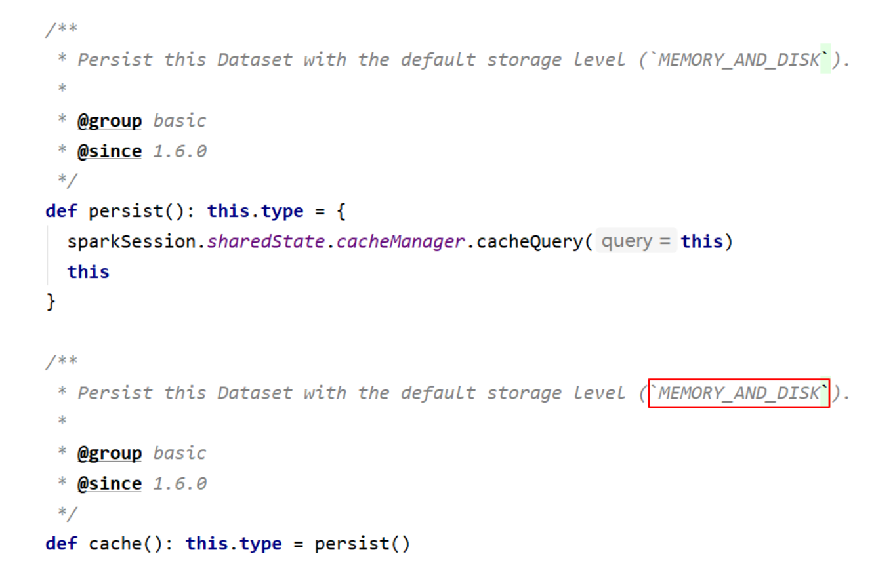

###### select 相关

列的多种表示、select、selectExpr、drop、withColumn、withColumnRenamed、cast（内置函数）

```scala
val df = spark.read.
      option("header", "true").
      option("inferschema", "true").
      csv("/spark-test/data/emp.dat")
//查询ename、sal两列，有下面五种写法。但是不能混用
scala> df.select($"ename",$"sal").show
scala> df.select("ename","sal").show
scala> df.select('ename,'sal).show
scala> df.select(col("ename"),col("sal")).show
scala> df.select(df("ename"),df("sal")).show
//查询ename、sal两列,并对sal列+1000，下面两种无效
scala> df.select("ename","sal+1000").show
scala> df.select("ename","sal"+1000).show
//查询ename、sal两列,并对sal列+1000
scala> df.select($"ename",$"sal" + 1000).show
scala> df.select('ename,'sal + 1000).show
// 可使用expr表达式(expr里面只能使用引号)
scala> df.select(expr("comm+100"),expr("sal + 100"),expr("ename")).show
scala> df.select(expr("nvl(comm,0)+100"),expr("sal + 100"),expr("ename")).show
scala> df.selectExpr("ename as name").show
scala> df.selectExpr("power(sal,2) as newSal","sal").show
scala> df.selectExpr("round(sal, -3) as newsal", "sal", "ename").show
//drop 删除一列或多列，得到新的DF
scala> df.drop("mgr").show
scala> df.drop("empno","mgr").show
//withColumn,修改列值
scala> df.withColumn("sal",$"sal" + 1000).show
scala> df.withColumnRenamed("sal","newSal").show
// 备注:drop、withColumn、withColumnRenamed返回的是DF

//cast 类型转换
scala> df.selectExpr("cast(empno as string)").printSchema

scala> import org.apache.spark.sql.types._
scala> df.select('empno.cast(StringType)).printSchema
```

###### where相关

where == filter

```scala
// filter操作
scala> df.filter("sal > 2000").show
scala> df.filter("sal > 2000 and job = 'MANAGER'").show
scala> df.filter("sal > 2000 and job == 'MANAGER'").show
//where 操作
scala> df.where("sal > 2000").show
scala> df.where("sal > 2000 and job == 'MANAGER'").show
scala> df.where("sal > 2000 and job = 'MANAGER'").show
```

###### groupBy相关

groupBy、agg、max、min、avg、sum、count（后面5个为内置函数）

```scala
// groupBy、max、min、mean、sum、count(与df1.count不同)
scala> df.groupBy("job").sum("sal").show
scala> df.groupBy("job").max("sal").show
scala> df.groupBy("job").min("sal").show
scala> df.groupBy("job").avg("sal").show
scala> df.groupBy("job").count.show

//类似having字句
scala> df.groupBy("job").avg("sal").where("avg(sal) > 2000").show
scala> df.groupBy("job").avg("sal").where($"avg(sal)" > 2000).show

//agg
scala> df.groupBy("job").agg("sal" -> "max","sal" -> "min","sal" -> "avg").show
scala> df.groupBy("job").agg(max("sal"),min("sal"),avg("sal")).show

//给列取别名
scala> df.groupBy("job").agg("sal" -> "max","sal" -> "min","sal" -> "avg").withColumnRenamed("min(sal)","minSal").show
scala> df.groupBy("job").agg(max("sal"),min("sal").as("min1"),avg("sal")).show
```

###### orderBy相关

orderBy == sort

```scala
//升序
scala> df.orderBy("sal").show
scala> df.orderBy($"sal").show
scala> df.orderBy($"sal".asc).show
scala> df.orderBy('sal).show
scala> df.orderBy(col("sal")).show
scala> df.orderBy(df("sal")).show
//降序
scala> df.orderBy(-$"sal").show
scala> df.orderBy($"sal".desc).show
scala> df.orderBy($"sal".desc,-'deptno).show

//sort
scala> df.sort("sal").show
scala> df.sort($"sal").show
scala> df.sort($"sal".asc).show
scala> df.sort('sal).show
scala> df.sort(col("sal")).show
scala> df.sort(df("sal")).show
//降序
scala> df.sort(-$"sal").show
scala> df.sort($"sal".desc).show
scala> df.sort($"sal".desc,-'deptno).show
```

###### join相关

```scala
//笛卡尔积
scala> df.crossJoin(df).show
//等值链接，单字段，链接的字段为empno，在结果中，只显示一次
scala> df.join(df,"empno").show
//等值链接，
scala> df.join(df,Seq("empno","ename")).show
scala> df.join(df,List("empno","ename")).show

// 定义第一个数据集
case class StudentAge(sno: Int, name: String, age: Int)
val lst = List(StudentAge(1,"Alice", 18), StudentAge(2,"Andy", 19), StudentAge(3,"Bob", 17), StudentAge(4,"Justin", 21), StudentAge(5,"Cindy", 20))
val ds1 = spark.createDataset(lst)
ds1.show()
// 定义第二个数据集
case class StudentHeight(sname: String, height: Int)
val rdd = sc.makeRDD(List(StudentHeight("Alice", 160), StudentHeight("Andy", 159), StudentHeight("Bob", 170), StudentHeight("Cindy", 165), StudentHeight("Rose", 160)))
val ds2 = rdd.toDS

//使用非相同字段名称作为链接条件
scala> ds1.join(ds2,$"name" === $"sname").show
scala> ds1.join(ds2,$"sname" === $"name").show
scala> ds1.join(ds2,'name === 'sname).show
scala> ds1.join(ds2,ds1("name") === ds2("sname")).show
//内链接，默认即内链接
scala> ds1.join(ds2,ds1("name") === ds2("sname"),"inner").show
//左外链接
scala> ds1.join(ds2,ds1("name") === ds2("sname"),"left").show
scala> ds1.join(ds2,ds1("name") === ds2("sname"),"left_outer").show
//右外链接
scala> ds1.join(ds2,$"name" === $"sname","right").show
scala> ds1.join(ds2,$"name" === $"sname","right_outer").show
//全外链接
scala> ds1.join(ds2,$"name" === $"sname","full").show
scala> ds1.join(ds2,$"name" === $"sname","full_outer").show

备注：DS在join操作之后变成的DF
```

###### 集合相关

union、unionAll（过期）、intersect、except

```scala
val ds3 = ds1.select("name")
ds3: org.apache.spark.sql.DataFrame = [name: string]

scala> val ds4 = ds2.select("sname")
ds4: org.apache.spark.sql.DataFrame = [sname: string]
//并集。不去重
scala> ds3.union(ds3).show

//并集（过期）不去重，不建议使用
scala> ds3.unionAll(ds3).show
warning: there was one deprecation warning (since 2.0.0); for details, enable `:setting -deprecation' or `:replay -deprecation'

//求交
scala> ds3.intersect(ds4).show

//求差
scala> ds3.except(ds4).show

```

###### 空值处理

na.fill 填充、na.drop 删除

```scala
//NaN（not a number）
scala> math.sqrt(-1.0)
res12: Double = NaN

scala> math.sqrt(-1.0).isNaN()
res14: Boolean = true

//显示所有列不含空的行
scala> df.na.drop.show
//显示mgr列不为空的行
scala> df.na.drop(Array("mgr")).show

//对全部的列进行填充
scala> df.na.fill(100).show
//对单列进行填充
scala> df.na.fill(100,Array("comm")).show
//对多列进行填充
scala> df.na.fill(Map("mgr" -> -1,"comm" -> -2)).show
//对指定列的指定值进行替换
scala> df.na.replace(List("comm","deptno"),Map(0 -> 9999,10 -> 10000)).show

// 查询空值列或非空值列。isNull、isNotNull为内置函数
df.filter("comm is null").show
df.filter($"comm".isNull).show
df.filter(col("comm").isNull).show
df.filter("comm is not null").show
df.filter(col("comm").isNotNull).show
```

###### 窗口函数

一半情况下，窗口函数不用DSL处理，直接使用SQL更方便，参考源码Window.scala、WindowSpec.scala(主要)

```scala
import org.apache.spark.sql.expressions.Window
val w1 = Window.partitionBy("cookieid").orderBy("createtime")
val w2 = Window.partitionBy("cookieid").orderBy("pv")
val w3 = w1.rowsBetween(Window.unboundedPreceding, Window.currentRow)
val w4 = w1.rowsBetween(-1, 1)

// 聚组函数【用分析函数的数据集】
df.select($"cookieid", $"pv", sum("pv").over(w1).alias("pv1")).show df.select($"cookieid", $"pv", sum("pv").over(w3).alias("pv1")).show
df.select($"cookieid", $"pv", sum("pv").over(w4).as("pv1")).show

// 排名
df.select($"cookieid", $"pv", rank().over(w2).alias("rank")).show df.select($"cookieid", $"pv", dense_rank().over(w2).alias("denserank")).show df.select($"cookieid", $"pv", row_number().over(w2).alias("rownumber")).show
// lag、lead
df.select($"cookieid", $"pv", lag("pv", 2).over(w2).alias("rownumber")).show df.select($"cookieid", $"pv", lag("pv", -2).over(w2).alias("rownumber")).show
```

###### 内建函数

http://spark.apache.org/docs/latest/api/sql/index.html

#### SQL语句

总体而言:SparkSQL与HQL兼容;与HQL相比，SparkSQL更简洁。createTempView、createOrReplaceTempView、spark.sql("SQL")

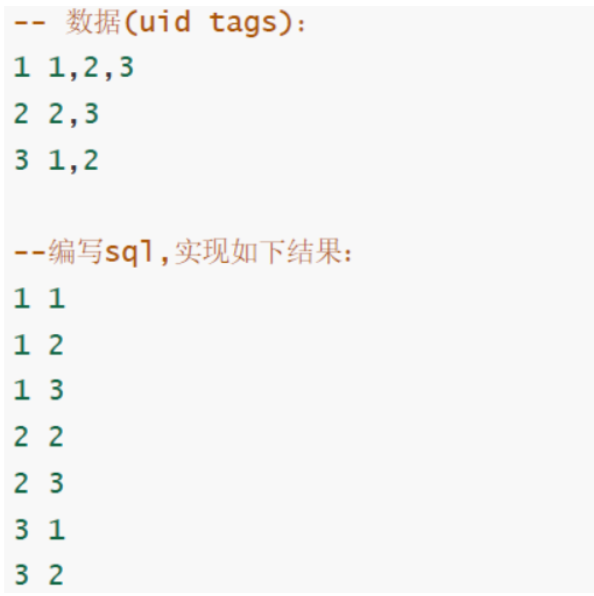

```scala
package com.hhb.spark.sql

import org.apache.spark.sql.SparkSession

/**
 * @description:
 * @date: 2020-11-04 16:46
 **/

case class Info(id: String, tags: String)

object SQLDemo {

  def main(args: Array[String]): Unit = {

    val spark = SparkSession.builder()
      .master("local[*]")
      .appName(this.getClass.getCanonicalName.init)
      .getOrCreate()
    spark.sparkContext.setLogLevel("warn")


    import spark.implicits._

    val arr = Array("1 1,2,3", "2 2,3", "3 1,3")
    val rdd = spark.sparkContext.makeRDD(arr)
      .map {
        x =>
          Info(x.split("\\s+")(0), x.split("\\s+")(1))
      }
    val ds = rdd.toDS()
    ds.createOrReplaceTempView("info")
    spark.sql(
      """
        |select * from info
        |""".stripMargin).show()
    println("**" * 15)

    spark.sql(
      """
        |select
        | id,tag
        |from
        | info lateral view explode(split(tags,","))  t as tag
        |
        |""".stripMargin).show()
    println("**" * 15)
    spark.sql(
      """
        |select
        | id,explode(split(tags,",")) as tag
        |from
        | info
        |""".stripMargin).show()
    spark.close()
  }
}
```

#### 输入与输出

SparkSQL内建支持的数据源包括：Parquet、JSON、CSV、Avro、Images、BinaryFiles（Spark3.0），其中Parquet是默认数据源。

```scala
// 内部使用 
DataFrameReader.format(args).option("key", "value").schema(args).load()
// 开发API 
SparkSession.read
```


###### Parquet文件

```scala
package com.hhb.spark.sql

import org.apache.spark.sql.{DataFrame, SparkSession}

/**
 * @description:
 * @author: huanghongbo
 * @date: 2020-11-04 20:06
 **/
object InputOutputDemo {

  def main(args: Array[String]): Unit = {

    val spark = SparkSession.builder()
      .appName(this.getClass.getCanonicalName.init)
      .master("local[*]")
      .getOrCreate()
    spark.sparkContext.setLogLevel("warn")
    //直接使用命令加载文件
    val parquetDF: DataFrame = spark.read.load("data/users.parquet")
    parquetDF.show()
    //加载文件并创建成users
    spark.sql(
      """
        |create or replace temporary view users
        |using parquet
        |options(path "data/users.parquet")
        |""".stripMargin)
    spark.sql(
      """
        |select * from users
        |""".stripMargin).show()

    //输出文件
    parquetDF.write.format("parquet")
      .mode("overwrite") // 写文件的方式
      .option("compression", "none") // 是否压缩
      .save("data/parquet") // 保存的路径

    spark.sql(
      """
        |select * from users
        |""".stripMargin).write.format("parquet")
      .mode("append")
      .option("compression", "none")
      .save("data/parquet")
    spark.close()
  }
}
```

###### json文件

```scala
package com.hhb.spark.sql

import org.apache.spark.sql.{DataFrame, SparkSession}

/**
 * @description:
 * @date: 2020-11-04 20:15
 **/
object JsonFileDemo {

  def main(args: Array[String]): Unit = {
    val spark = SparkSession.builder()
      .appName(this.getClass.getCanonicalName.init)
      .master("local[*]")
      .getOrCreate()
    spark.sparkContext.setLogLevel("warn")
    //直接使用命令加载文件
    val jsonDF: DataFrame = spark.read.format("json").load("data/emp.json")
    jsonDF.show(false)
    //使用SQL加载文件
    spark.sql(
      """
        |create or replace temporary view emp
        |using json
        |options(path "data/emp.json")
        |""".stripMargin)
    spark.sql(
      """
        |select * from emp
        |""".stripMargin).show()
    //使用命令导出文件
    jsonDF.write.format("json")
      .mode("overwrite")
      .save("data/json")
    //使用SQL导出文件
    spark.sql(
      """
        |select * from emp
        |""".stripMargin).write.format("json")
      .mode("overwrite")
      .save("data/json1")
    spark.close()
  }
}
```


###### CSV文件

```scala
package com.hhb.spark.sql

import org.apache.spark.sql.{DataFrame, SparkSession}

/**
 * @description:
 * @author: huanghongbo
 * @date: 2020-11-04 20:22
 **/
object CSVFileDemo {

  def main(args: Array[String]): Unit = {
    val spark = SparkSession.builder()
      .appName(this.getClass.getCanonicalName.init)
      .master("local[*]")
      .getOrCreate()
    spark.sparkContext.setLogLevel("warn")
    //直接使用命令加载文件
    val csvDF = spark.read.format("csv")
      .options(Map("header" -> "true", "inferschema" -> "true", "delimiter" -> ";"))
      .load("/Users/baiwang/myproject/spark/data/people2.csv")
    csvDF.show()
    csvDF.printSchema()
    //使用SQL加载文件
    spark.sql(
      """
        |create or replace temporary view people
        |using csv
        |options(path "/Users/baiwang/myproject/spark/data/people2.csv",
        |        header "true",
        |        inferschema "true",
        |        delimiter ";"
        |        )
        |""".stripMargin)

    spark.sql(
      """
        |select * from people
        |""".stripMargin).show()
    //使用命令导出文件
    csvDF.write.format("csv")
      .option("delimiter", "|")
      .option("header", "true")
      .mode("overwrite")
      .save("data/csv")
    //使用SQL导出文件
    spark.sql(
      """
        |select * from people
        |""".stripMargin).write.format("csv")
      .option("delimiter", "|")
      .option("header", "true")
      .mode("append")
      .save("data/csv")
    spark.close()
  }
}
```

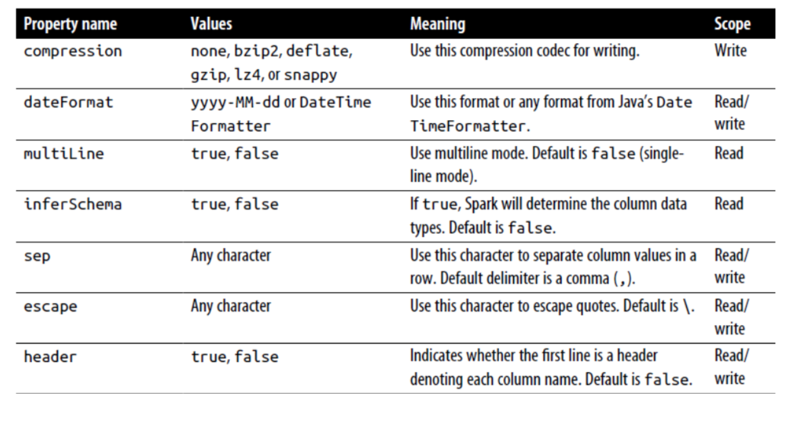

###### JDBC

```scala
package com.hhb.spark.sql

import org.apache.spark.sql.{DataFrame, SaveMode, SparkSession}

/**
 * @description:
 * @author: huanghongbo
 * @date: 2020-11-05 09:21
 **/
object JdbcDemo {
  def main(args: Array[String]): Unit = {
    val spark = SparkSession.builder()
      .appName(this.getClass.getCanonicalName.init)
      .master("local[*]")
      .getOrCreate()
    spark.sparkContext.setLogLevel("warn")
    //加载
    val jdbcDF = spark.read.format("jdbc")
      .option("url", "jdbc:mysql://linux123:3306/ebiz?useSSL=false")
      .option("user", "hive")
      .option("password", "12345678")
      //      .option("dbtable", "test")
      .option("driver", "com.mysql.jdbc.Driver")
      .option("query", "select * from test where total >= 10")
      .load()
    jdbcDF.show()
    //导出

    jdbcDF.write.format("jdbc")
      .option("url", "jdbc:mysql://linux123:3306/ebiz?useSSL=false")
      .option("user", "hive")
      .option("password", "12345678")
      .option("dbtable", "test_bak")
      .option("driver", "com.mysql.jdbc.Driver")
      .mode(SaveMode.Append)
      .save()
    //加载
    spark.read.format("jdbc")
      .option("url", "jdbc:mysql://linux123:3306/ebiz?useSSL=false")
      .option("user", "hive")
      .option("password", "12345678")
      .option("dbtable", "test_bak")
      .option("driver", "com.mysql.jdbc.Driver")
      //      .option("query", "select * from test_bak")
      .load().show()

    spark.close()
  }
}
```

备注：如果有中文，需要注意表的字符集，否则会乱吗

* SaveMode.ErrorIfExists(默认)。若表存在，则会直接报异常，数据不能存入数据库 
* SaveMode.Append。若表存在，则追加在该表中;若该表不存在，则会先创建表，再插入数据 
* SaveMode.Overwrite。先将已有的表及其数据全都删除，再重新创建该表，最后插入新的数据 
* SaveMode.Ignore。若表不存在，则创建表并存入数据;若表存在，直接跳过数据的存储，不会报错

```sql
-- 创建表
create table lagou_product_info_back as select * from lagou_product_info;
-- 检查表的字符集
show create table lagou_product_info_back;
show create table lagou_product_info;
-- 修改表的字符集
alter table lagou_product_info_back convert to character set utf8;
```

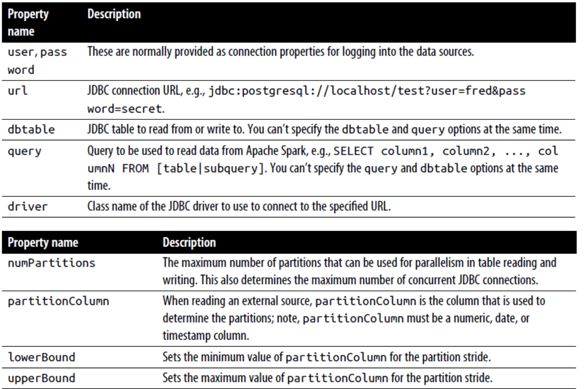

#### UDF & UDAF

###### UDF

UDF(User Defined Function),自定义函数。函数的输入输出都是一条记录，类似于Spark-SQL中普通的数学或字符串函数。实现上看就是一个普通的Scala函数；

UDAF（User Defined Aggregation Function）,用户自定义聚合函数。函数本身作用于数据集合，能够在聚合操作的基础上进行自定义操作（多条数据输入，一条数据输出）类似于group by之后使用的sum、avg等函数

用Scala编写的UDF与普通的scala函数几乎没有任何区别，唯一需要多执行的一个步骤是要在SQLContext注册。

```scala
def len(bookTitle: String):Int = bookTitle.length
spark.udf.register("len", len _)
val booksWithLongTitle = spark.sql("select title, author from books where len(title) > 10")
```

编写的UDF可以放到SQL语句的fields部分，也可以作为where、groupBy或者 having子句的一部分。也可以在使用UDF时，传入常量而非表的列名。稍稍修改一下前面的函数，让长度 10作为函数的参数传入:

```scala
def lengthLongerThan(bookTitle: String, length: Int): Boolean = bookTitle.length > length
spark.udf.register("longLength", lengthLongerThan _)
val booksWithLongTitle = spark.sql("select title, author from books where longLength(title, 10)")
```

若使用DataFrame的API，则以字符串的形式将UDF传入:

```scala
val booksWithLongTitle = dataFrame.filter("longLength(title, 10)")
```

DataFrame的API也可以接收Column对象，可以用$符号来包裹一个字符串表示一个 Column。$是定义在 SQLImplicits 对象中的一个隐式转换。此时，UDF的定义也不 相同，不能直接定义Scala函数，而是要用定义在org.apache.spark.sql.functions中 的 udf 方法来接收一个函数。这种方式无需register:

```scala
import org.apache.spark.sql.functions._
val longLength = udf((bookTitle: String, length: Int) => bookTitle.length > length)
import spark.implicits._
val booksWithLongTitle = dataFrame.filter(longLength($"title", lit(10)))
```

完整示例：

```scala
package com.hhb.spark.sql

import org.apache.spark.sql.{Row, SparkSession}

/**
 * @description:
 * @author: huanghongbo
 * @date: 2020-11-05 10:24
 **/

object UDFDemo {

  def main(args: Array[String]): Unit = {

    val spark = SparkSession.builder()
      .master("local[*]")
      .appName(this.getClass.getCanonicalName.init)
      .getOrCreate()
    spark.sparkContext.setLogLevel("warn")

    //准备数据
    val data = List(("scala", "author1"), ("spark", "author2"), ("hadoop", "author3"), ("hive", "author4"), ("strom", "author5"), ("kafka", "author6"))
    val df = spark.createDataFrame(data).toDF("title", "author")
    df.createTempView("book")

    //定义函数并注册
    def len(title: String) = title.length

    spark.udf.register("len", len _)
    spark.sql(
      """
        |select title,author,len(title) as l from book
        |""".stripMargin).show()

    spark.sql(
      """
        |select * from book where len(title) > 5
        |""".stripMargin).show()

    import spark.implicits._
    df.filter("len(title) > 5").show()
    //无法编译
    //    df.where(len($"title") > 5)

    // 如果要在DSL语法中使用$符号包裹字符串表示一个Column，需要用udf方法来接 收函数。这种函数无需注册
    import org.apache.spark.sql.functions._
    val len2 = udf(len _)
    df.where(len2($"title") > 5).show()

    //不能使用udf
    df.map { case Row(title: String, author: String) =>
      (title, author, title.length)
    }.show()
    spark.close()
  }
}
```

###### UDAF

```
数据如下:
id, name, sales, discount, state, saleDate
1, "Widget Co",1000.00,0.00, "AZ","2019-01-01"
2, "Acme Widgets",2000.00,500.00,"CA","2019-02-01"
3, "Widgetry",1000.00,200.00, "CA","2020-01-11"
4, "Widgets R Us",2000.00,0.0,"CA","2020-02-19"
5, "Ye Olde Widgete",3000.00,0.0,"MA","2020-02-28"

最后要得到的结果为:
(2020年的合计值 – 2019年的合计值) / 2019年的合计值 (6000 - 3000) / 3000 = 1
执行以下SQL得到最终的结果:
select userFunc(sales, saleDate) from table1;
即计算逻辑在userFunc中实现
```

普通的UDF不支持数据的聚合运算。如当要对销售数据执行年度同比计算，就需要对当年和上一年的销量分别求和，然后再利用公式进行计算。此时需要使用UDAF，Spark为所有的UDAF定义一个父类， UserDefinedAffregateFunction。要继承这个类，需要实现父类的几个抽象方法：

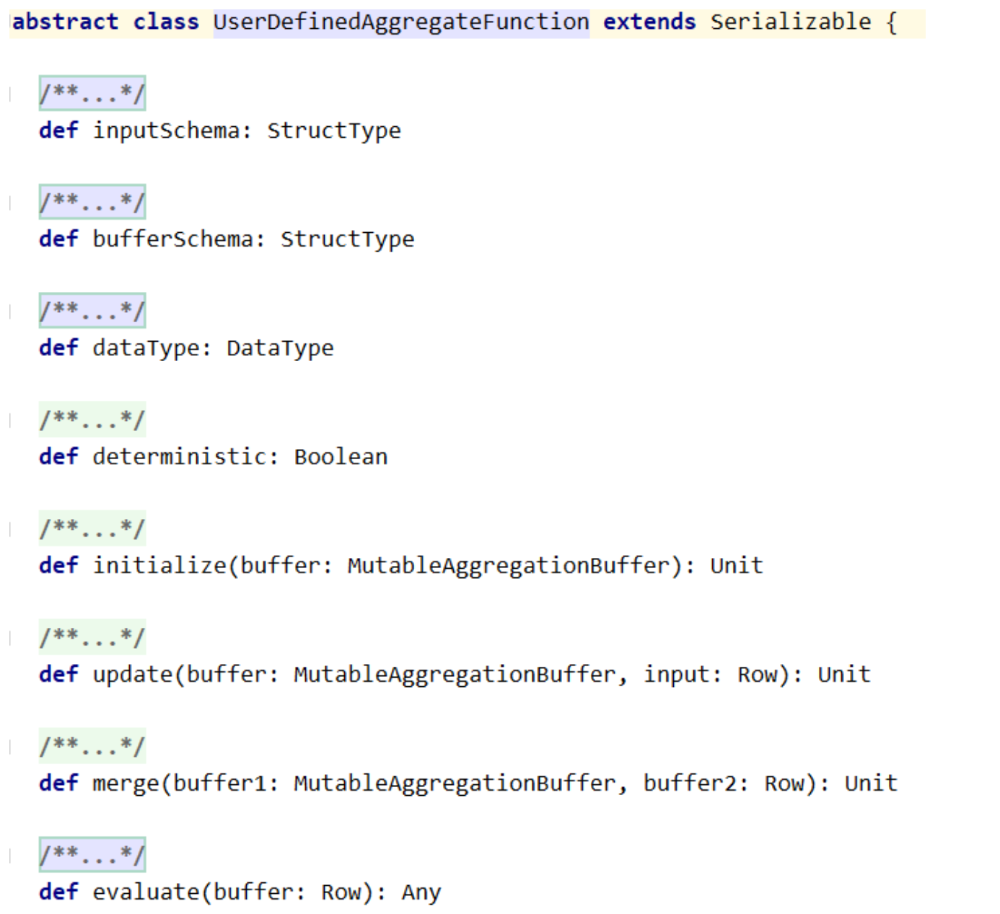

* inputSchema用于定义与DataFrame列有关的输入样式 
* bufferSchema用于定义存储聚合运算时产生的中间数据结果的Schema 
* dataType标明了UDAF函数的返回值类型 
* deterministic是一个布尔值，用以标记针对给定的一组输入，UDAF是否总是生 成相同的结果
* initialize对聚合运算中间结果的初始化 
* update函数的第一个参数为bufferSchema中两个Field的索引，默认以0开始; UDAF的核心计算都发生在update函数中;update函数的第二个参数input: Row对应的并非DataFrame的行，而是被inputSchema投影了的行 
* merge函数负责合并两个聚合运算的buffer，再将其存储到 MutableAggregationBuffer中 
* evaluate函数完成对聚合Buffer值的运算，得到最终的结果

###### UDAF-类型不安全

```scala
package com.hhb.spark.sql

import org.apache.spark.sql.expressions.{MutableAggregationBuffer, UserDefinedAggregateFunction}
import org.apache.spark.sql.types._
import org.apache.spark.sql.{Row, SparkSession}

/**
 * @description:
 * @author: huanghongbo
 * @date: 2020-11-05 10:55
 **/

class TypeUnsafeUDAF extends UserDefinedAggregateFunction {
  //输入类型
  override def inputSchema: StructType = new StructType().add("salDate", StringType).add("sal", DoubleType)

  //缓存的数据类型
  override def bufferSchema: StructType = new StructType().add("year2019", DoubleType).add("year2020", DoubleType)

  //返回值类型
  override def dataType: DataType = DoubleType

  // 布尔值，用以标记针对给定的一组输入，UDAF是否总是生成相同的结果。通常用 true
  override def deterministic: Boolean = true

  // 初始化的初值
  override def initialize(buffer: MutableAggregationBuffer): Unit = {
    buffer(0) = 0.00
    buffer(1) = 0.00
  }

  //分区内合并
  override def update(buffer: MutableAggregationBuffer, input: Row): Unit = {

    val year = input.getString(0).take(4)
    val sal = input.getAs[Double](1)
    year match {
      case "2019" => buffer(0) = buffer.getDouble(0) + sal
      case "2020" => buffer(1) = buffer.getDouble(1) + sal
      case _ => println("ERROR")
    }

  }

  //分区间合并
  override def merge(buffer1: MutableAggregationBuffer, buffer2: Row): Unit = {
    buffer1(0) = buffer1.getDouble(0) + buffer2.getDouble(0)
    buffer1(1) = buffer1.getDouble(1) + buffer2.getDouble(1)
  }

  //最终结果 (2020年的合计值 – 2019年的合计值) / 2019年的合计值 (6000 - 3000) / 3000
  override def evaluate(buffer: Row): Any = {
    if (buffer.getDouble(0) < 0.0000000001) 0.00
    else (buffer.getDouble(1) - buffer.getDouble(0)) / buffer.getDouble(0)
  }
}

object TypeUnsafeUDAFDemo {

  def main(args: Array[String]): Unit = {

    val spark = SparkSession.builder()
      .master("local[*]")
      .appName(this.getClass.getCanonicalName.init)
      .getOrCreate()
    spark.sparkContext.setLogLevel("warn")

    val sales = Seq(
      (1, "Widget Co", 1000.00, 0.00, "AZ", "2019-01-01"),
      (2, "Acme Widgets", 2000.00, 500.00, "CA", "2019-02-01"),
      (3, "Widgetry", 1000.00, 200.00, "CA", "2020-01-11"),
      (4, "Widgets R Us", 2000.00, 0.0, "CA", "2020-02-19"),
      (5, "Ye Olde Widgete", 3000.00, 0.0, "MA", "2020-02-28")
    )
    val df = spark.createDataFrame(sales).toDF("id", "name", "sal", "total", "state", "salDate")
    df.createTempView("sales")
    spark.udf.register("userFunc", new TypeUnsafeUDAF())
    spark.sql(
      """
        |select userFunc(salDate,sal) from sales
        |""".stripMargin).show()
    spark.close()
  }
}
```

###### UDAF-类型安全

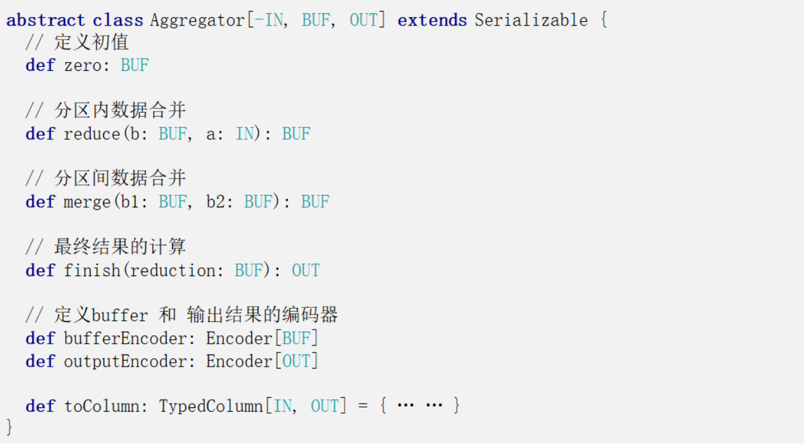

```scala
package com.hhb.spark.sql

import org.apache.spark.sql.{Column, Encoder, Encoders, SparkSession, TypedColumn}
import org.apache.spark.sql.expressions.Aggregator

/**
 * @description:
 * @author: huanghongbo
 * @date: 2020-11-05 11:30
 **/
case class Sales(id: Int, name: String, sal: Double, total: Double, state: String, salDate: String)

case class SaleBuffer(var sal2019: Double, var sal2020: Double)

class TypeSafeUDAF extends Aggregator[Sales, SaleBuffer, Double] {
  //初始值
  override def zero: SaleBuffer = SaleBuffer(0.00, 0.00)

  //分区内计算
  override def reduce(b: SaleBuffer, a: Sales): SaleBuffer = {
    val year = a.salDate.take(4)
    val sal = a.sal
    year match {
      case "2019" => b.sal2019 = b.sal2019 + sal
      case "2020" => b.sal2020 = b.sal2020 + sal
      case _ => println("ERROR")
    }
    b
  }

  //分区间计算
  override def merge(b1: SaleBuffer, b2: SaleBuffer): SaleBuffer = {
    b1.sal2019 = b1.sal2019 + b2.sal2019
    b1.sal2020 = b2.sal2020 + b1.sal2020
    b1
  }

  //最终结果
  override def finish(reduction: SaleBuffer): Double = {
    if (reduction.sal2019 < 0.000000001) 0.00
    else (reduction.sal2020 - reduction.sal2019) / reduction.sal2019
  }

  //编码器,对象编码器是固定的
  override def bufferEncoder: Encoder[SaleBuffer] = Encoders.product

  //编码器
  override def outputEncoder: Encoder[Double] = Encoders.scalaDouble
}

object TypeSafeUDAFDemo {

  def main(args: Array[String]): Unit = {
    val spark = SparkSession.builder()
      .master("local[*]")
      .appName(this.getClass.getCanonicalName.init)
      .getOrCreate()
    spark.sparkContext.setLogLevel("warn")

    val sales = Seq(
      Sales(1, "Widget Co", 1000.00, 0.00, "AZ", "2019-01-01"),
      Sales(2, "Acme Widgets", 2000.00, 500.00, "CA", "2019-02-01"),
      Sales(3, "Widgetry", 1000.00, 200.00, "CA", "2020-01-11"),
      Sales(4, "Widgets R Us", 2000.00, 0.0, "CA", "2020-02-19"),
      Sales(5, "Ye Olde Widgete", 3000.00, 0.0, "MA", "2020-02-28")
    )
    import spark.implicits._
    val ds = spark.createDataset(sales)
    ds.show()

    val rate: TypedColumn[Sales, Double] = new TypeSafeUDAF().toColumn.name("rate")
    ds.select(rate).show()

    spark.close()
  }
}
```

#### 访问Hive

在 pom 文件中增加依赖:

```xml
<!-- spark-hive -->
<dependency>
   <groupId>org.apache.spark</groupId>
   <artifactId>spark-hive_2.12</artifactId>
   <version>${spark.version}</version>
</dependency>
<!-- https://mvnrepository.com/artifact/org.apache.spark/spark-hive-thriftserver -->
<dependency>
  <groupId>org.apache.spark</groupId>
  <artifactId>spark-hive-thriftserver_2.12</artifactId>
  <version>${spark.version}</version>
  <scope>provided</scope>
</dependency>
<!-- https://mvnrepository.com/artifact/org.apache.hive/hive-jdbc -->
<dependency>
  <groupId>org.apache.hive</groupId>
  <artifactId>hive-jdbc</artifactId>
  <version>2.1.1</version>
</dependency>
```

在resources中增加hive-site.xml文件，在文件中增加内容：

```xml
<?xml version="1.0" encoding="UTF-8" standalone="no"?>
<?xml-stylesheet type="text/xsl" href="configuration.xsl"?>
<configuration>
    <!-- hive元数据的存储位置 -->
    <property>
        <name>javax.jdo.option.ConnectionURL</name>
        <value>jdbc:mysql://linux123:3306/hivemetadata?createDatabaseIfNotExist=true&amp;useSSL=false</value>
        <description>JDBC connect string for a JDBC metastore</description>
    </property>
    <!-- 指定驱动程序 -->
    <property>
        <name>javax.jdo.option.ConnectionDriverName</name>
        <value>com.mysql.jdbc.Driver</value>
        <description>Driver class name for a JDBC metastore</description>
    </property>
    <!-- 连接数据库的用户名 -->
    <property>
        <name>javax.jdo.option.ConnectionUserName</name>
        <value>hive</value>
        <description>username to use against metastore database</description>
    </property>
    <!-- 连接数据库的口令 -->
    <property>
        <name>javax.jdo.option.ConnectionPassword</name>
        <value>12345678</value>
        <description>password to use against metastore database</description>
    </property>
    <!-- 数据默认的存储位置(HDFS) -->
    <property>
        <name>hive.metastore.warehouse.dir</name>
        <value>/user/hive/warehouse</value>
        <description>location of default database for the warehouse</description>
    </property>
    <!-- 在命令行中，显示当前操作的数据库 -->
    <property>
        <name>hive.cli.print.current.db</name>
        <value>true</value>
        <description>Whether to include the current database in the Hive prompt.</description>
    </property>
    <!-- 在命令行中，显示数据的表头 -->
    <property>
        <name>hive.cli.print.header</name>
        <value>true</value>
    </property>
    <!-- 操作小规模数据时，使用本地模式，提高效率 -->
    <property>
        <name>hive.exec.mode.local.auto</name>
        <value>true</value>
        <description>Let Hive determine whether to run in local mode automatically</description>
    </property>
    <!--指定metastore地址 -->
    <property>
        <name>hive.metastore.uris</name>
        <value>thrift://linux121:9083,thrift://linux123:9083</value>
    </property>
    <property>
        <name>hive.metastore.client.socket.timeout</name>
        <value>3600</value>
    </property>
</configuration>
```

备注:最好使用 metastore service 连接Hive;使用直连 metastore 的方式时， SparkSQL程序会修改 Hive 的版本信息;默认Spark使用 Hive 1.2.1进行编译，包含对应的serde, udf, udaf等。

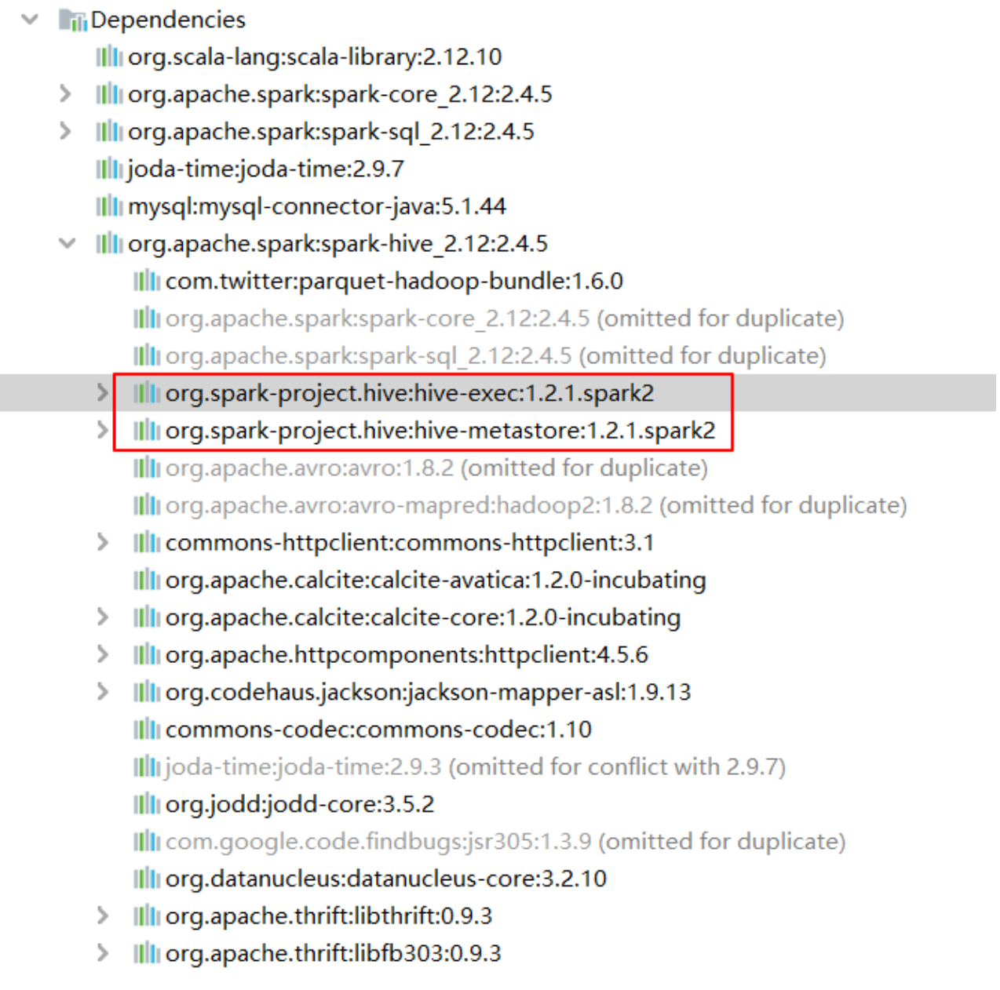

```scala

package com.hhb.spark.sql

import org.apache.spark.sql.{DataFrame, SaveMode, SparkSession}

/**
 * @description:
 * @date: 2020-11-05 13:37
 **/
object AccessHive {

  def main(args: Array[String]): Unit = {

    val spark = SparkSession
      .builder()
      .appName("Demo1").master("local[2]")
      .enableHiveSupport()
      // Spark使用与Hive相同的约定写parquet数据
      .config("spark.sql.parquet.writeLegacyFormat", "true")
      .getOrCreate()
    val sc = spark.sparkContext
    sc.setLogLevel("warn")

    spark.sql("show databases").show
    spark.sql(
      """
        | use ads
        |""".stripMargin)

    spark.sql("show tables").show()

    val df: DataFrame = spark.sql(
      """
        |select * from ads_ad_show
        |""".stripMargin)
    
    df.write
      .mode(SaveMode.Append)
        .saveAsTable("")
    spark.close()
  }
}
```

### Spark SQL原理

#### SparkSQL中的join

数据分析中将两个数据集进行join操作是很常见的场景。在Spark 物理计划阶段，Spark的Join Selection 类会根据Join hints策略、join表的大小、Join是等值join还是不等值以及参与Join的key是否可以排序等条件来选择最终的Join的策略，最后Spark会利用选择好的Join策略执行最终的计算，当前Spark一共支持五种Join策略

* **Broadcast hash join (BHJ)**
* Shuffle hash join(SHJ)
* **Shuffle sort merge join (SMJ)**
*  Shuffle-and-replicate nested loop join，又称笛卡尔积(Cartesian product join)
* Broadcast nested loop join (BNLJ)

其中 BHJ 和 SMJ 这两种 Join 策略是我们运行 Spark 作业最常见的。JoinSelection 会先根据 Join 的 Key 为等值 Join 来选择 Broadcast hash join、Shuffle hash join 以及 Shuffle sort merge join 中的一个;如果 Join 的 Key 为不等值 Join 或者没有指定 Join 条件，则会选择 Broadcast nested loop join 或 Shuffle-and-replicate nested loop join。

不同的 Join 策略在执行上效率差别很大，了解每种 Join 策略的执行过程和适用条件是很有必要的。

###### Broadcast Hash Join

Broadcast Hash Join 的实现是将小表的数据广播到 Spark 所有的 Executor 端，这个广播过程和我们自己去广播数据没什么区别:

* 利用 collect 算子将小表的数据从 Executor 端拉到 Driver 端

* 在 Driver 端调用 sparkContext.broadcast 广播到所有 Executor 端

* 在 Executor 端使用广播的数据与大表进行 Join 操作(实际上是执行map操作)

这种 Join 策略避免了 Shuffle 操作。一般而言，Broadcast Hash Join 会比其他 Join 策略执行的要快。

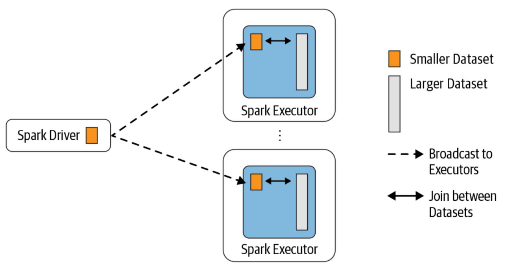

使用这种Join策略必须满足以下条件：

* 小表的数据必须很小，可以通过spark.sql.autoBroadcastJoinThrdshold参数来配置，默认是10M
* 如果内存比较大，可以将阈值适当加大
* 将spark.sql.autoBroadcastJoinThrdshold参数设置为-1，可以关闭这种链接方式
* 只能用于等值join，不要求参与join的keys可排序

###### Shuffle Hash Join

当表中的数据比较大，又不适合广播，这个时候就可以考虑使用Shuffle Hash Join。

Shuffle Hash Join 同样是在大表和小表进行join的时候选择的一种策略，他的计算思想是：把大表和小表按照相同的分区算法和分区数进行分区（根据参与Join的keys进行分区）这样就保证了Hash值一样的数据分发到同一个分区中，然后在同一个Executor中两张表hash值一样的分区就可以在本地进行hash join了。在进行Join之前，还会对小表的分区构建Hash Map，Shuffle hash Join 利用了分治思想，把大问题拆解成小问题去解决。

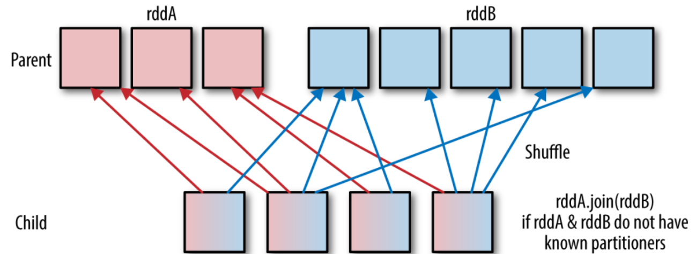


要启用Shuffle Hash join 必须满足以下条件：

* 仅支持等值Join，不要求参与Join的keys可排序
* spark.sql.join.preferSortMergeJoin参数必须设置为false，参数是从spark2.0.0版本引入的，默认是true，也就是默认情况下选择Sort Merge Join
* 小表的大小（plan.stats.sizeInBytes）必须小于 spark.sql.autoBroadcastJoinThreshold * Spark.sql.shuffle.partitions(默认值 200)
* 而且小表大小（stats.sizeInBytes）的三倍必须小于等于大表的大小（stats.sizeInBytes）,也就是a.stats.sizeInBytes * 3 <= b.stats.sizeInBytes

###### Shuffle Sort Merge Join

前面两种join策略对表的大小都是有条件的，如果参与的join的表都很大，这时候就得考虑Shuffle Sort Merge Join了。

Shuffle Sort Merge Join的实现思想：

* 将两张表按照Join Key进行shuffle，保证join key 值相同的记录回被分为相应的分区。
* 对每个分区内的数据进行排序
* 排序后在对对应的分区内的记录进行连接

无论分区有多大，Sort Merge Join都不用把一侧的数据全部加载到内存中，而是即用即丢；因为两个序列都有序。从头遍历，遇到key相同的就输出，如果不同，左边小就继续取左边，反之取右边。从而大大提高了大数据量下sql join的稳定性。

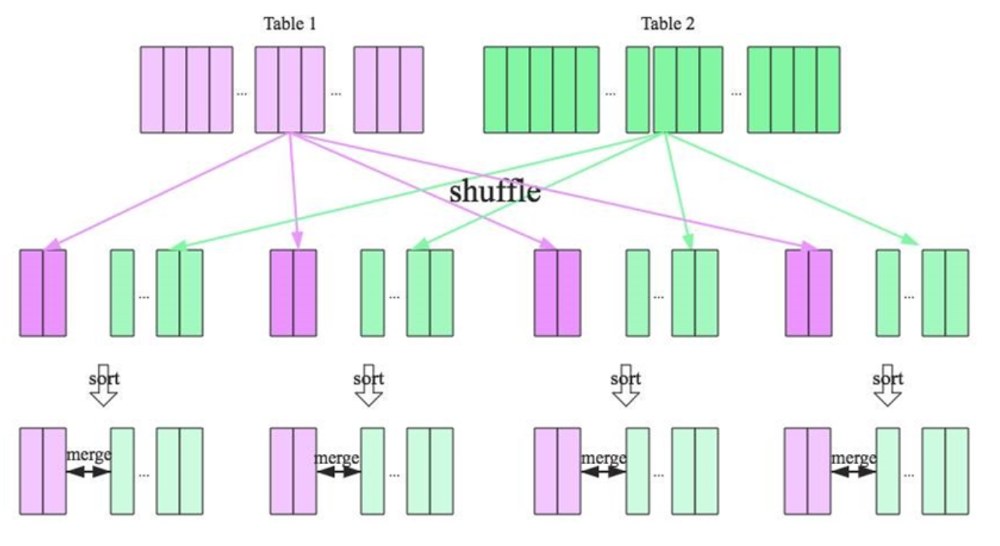

要启用Shuffle Sort Merge Join 必须满足以下条件：

* 仅支持等值Join，而且要求参与Join的keys可排序

###### Cartesian Product Join

如果 Spark 中两张参与 Join 的表没指定连接条件，那么会产生Cartesian product join，这个 Join 得到的结果其实就是两张表行数的乘积。

###### Broadcast Nested loop Join

可以把 Broadcast nested loop join 的执行看做下面的计算:

```scala
for record_1 in relation_1:
  for record_2 in relation_2:
    # join condition is executed
```

可以看出 Broadcast nested loop join 在某些情况会对某张表重复扫描多次，效率非常低下。从名字可以看出，这种 join 会根据相关条件对小表进行广播，以减少表的扫描次数。

Broadcast nested loop join 支持等值和不等值 Join，支持所有的 Join 类型。

#### SQL解析过程

Spark SQL 可以说是 Spark 中的精华部分。原来基于 RDD 构建大数据计算任务，重心在向 DataSet 转移，原来基于 RDD 写的代码也在迁移。使用 Spark SQL 编码好处是非常大的，尤其是在性能方面，有很大提升。Spark SQL 中各 种内嵌的性能优化比写 RDD 遵守各种最佳实践更靠谱的，尤其对新手来说。如先 filter 操作再 map 操作，Spark SQL 中会自动进行谓词下推;Spark SQL中会自动使用 broadcast join 来广播小表，把 shuffle join 转化为 map join 等等。

Spark SQL对SQL语句的处理和关系型数据库类似，即词法/语法解析、绑定、优化、执行。Spark SQL会先将SQL语 句解析成一棵树，然后使用规则(Rule)对Tree进行绑定、优化等处理过程。Spark SQL由Core、Catalyst、Hive、 Hive-ThriftServer四部分构成:

* Core: 负责处理数据的输入和输出，如获取数据，查询结果输出成DataFrame等 
* **Catalyst: 负责处理整个查询过程，包括解析、绑定、优化等**
* Hive: 负责对Hive数据进行处理
* Hive-ThriftServer: 主要用于对Hive的访问

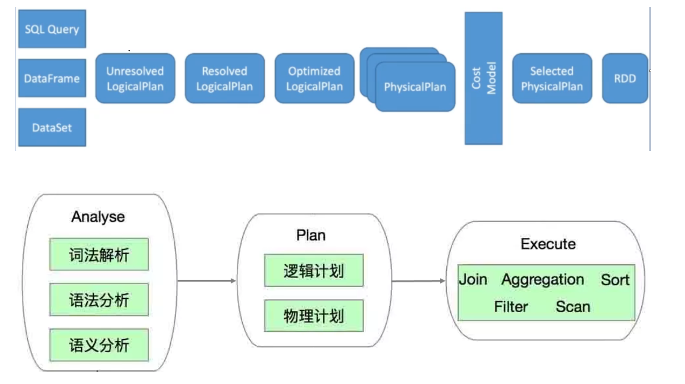

Spark SQL的代码复杂度是问题的本质复杂度带来的，Spark SQL中的 Catalyst 框架大部分逻辑是在一个 Tree 类型的数据结构上做各种折腾，基于 Scala 来实现还是很优雅的，Scala 的偏函数和强大的 Case 正则匹配，让整个代码 看起来非常优雅。

SparkSession 是编写 Spark 应用代码的入口，启动一个 spark-shell 会提供给你一个创建 SparkSession， 这个对象 是整个 Spark 应用的起始点。以下是 SparkSession 的一些重要的变量和方法:

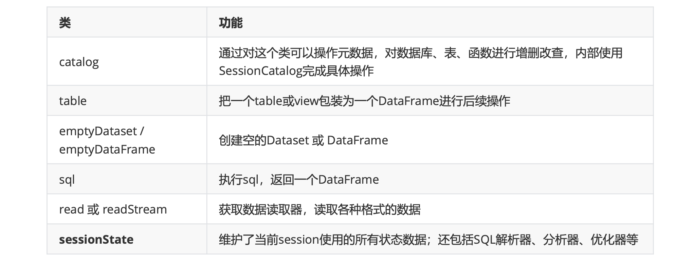

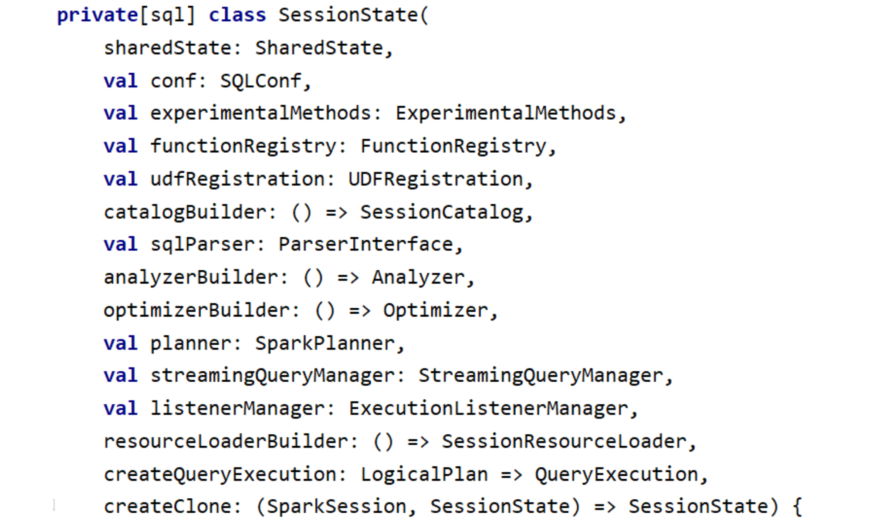

```scala
object Plan {
  def main(args: Array[String]): Unit = {
    val spark = SparkSession
      .builder()
      .appName("Demo1")
      .master("local[*]")
      .getOrCreate()
    spark.sparkContext.setLogLevel("warn")
    import spark.implicits._
    Seq((0, "zhansan", 10),
      (1, "lisi", 11),
      (2, "wangwu", 12)).toDF("id", "name", "age").createOrReplaceTempView("stu")
    Seq((0, "chinese", 80), (0, "math", 100), (0, "english", 98),
      (1, "chinese", 86), (1, "math", 97), (1, "english", 90),
      (2, "chinese", 90), (2, "math", 94), (2, "english", 88)
    ).toDF("id", "subject", "score").createOrReplaceTempView("score")
    val df: DataFrame = spark.sql(
      """
        |select sum(v), name
        | from (select stu.id, 100 + 10 + score.score as v, name
        |          from stu join score
        | where stu.id = score.id and stu.age >= 11) tmp 
        |group by name
        |""".stripMargin)
    df.show()
    // 打印执行计划
    println(df.queryExecution)
    println(df.queryExecution.optimizedPlan)
    spark.close()
  }
}
```

queryExecution 就是整个执行计划的执行引擎，里面有执行过程中各个中间过程变量，整个执行流程如下:

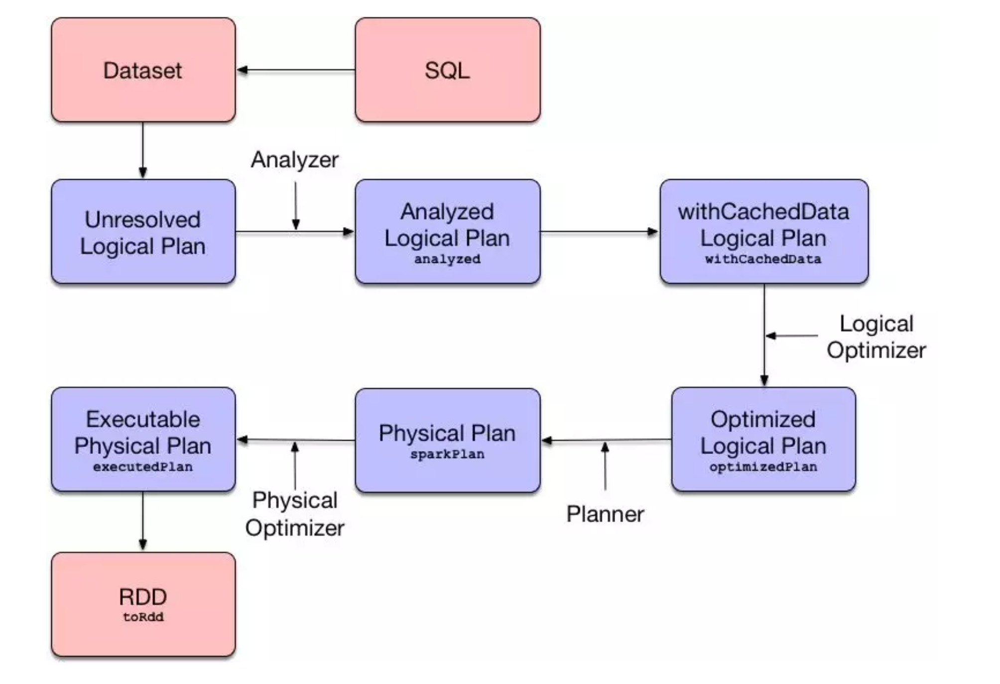

上面例子中的 SQL 语句经过 Parser 解析后就会变成一个抽象语法树，对应解析后的逻辑计划 AST 为:

```shell
== Parsed Logical Plan ==
'Aggregate ['name], [unresolvedalias('sum('v), None), 'name]
+- 'SubqueryAlias `tmp`
   +- 'Project ['stu.id, ((100 + 10) + 'score.score) AS v#26, 'name]
      +- 'Filter (('stu.id = 'score.id) && ('stu.age >= 11))
         +- 'Join Inner
            :- 'UnresolvedRelation `stu`
            +- 'UnresolvedRelation `score`
```

备注:在执行计划中 Project/Projection 代表的意思是投影 

选投连三种最基本的操作

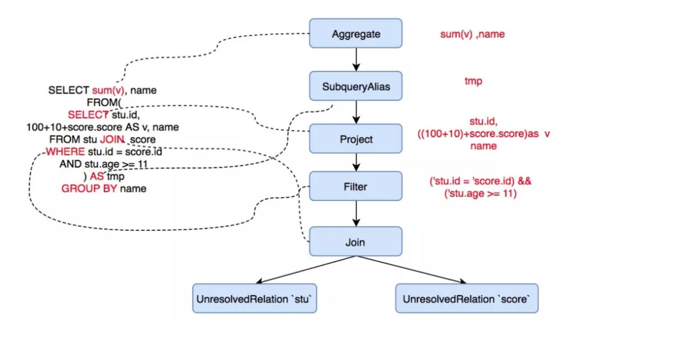

其中过滤条件变为了 Filter 节点，这个节点是 UnaryNode(一元节点) 类型， 只有一个孩子。两个表中的数据变为了 UnresolvedRelation 节点，节点类型为 LeafNode ，即叶子节点， JOIN 操作为节点， 这个是一个 BinaryNode 节 点，有两个孩子。

以上节点都是 LogicalPlan 类型的， 可以理解为进行各种操作的 Operator， SparkSQL 对各种操作定义了各种 Operator。

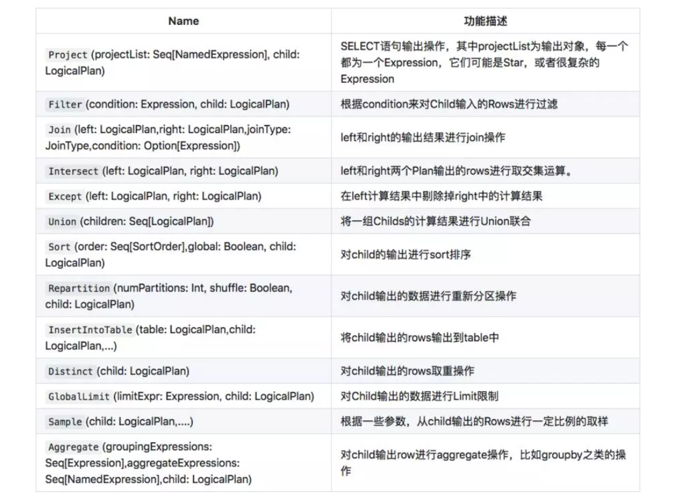

这些 operator 组成的抽象语法树就是整个 Catatyst 优化的基础，Catatyst 优化器会在这个树上面进行各种折腾，把 树上面的节点挪来挪去来进行优化。

经过 Parser 有了抽象语法树，但是并不知道 score，sum 这些东西是啥，所以就需要 analyer 来定位。

analyzer 会把 AST 上所有 Unresolved 的东西都转变为 resolved 状态，SparkSQL 有很多resolve 规则:

* ResolverRelations。解析表(列)的基本类型等信息 
* ResolveFuncions。解析出来函数的基本信息 
* ResolveReferences。解析引用，通常是解析列名

```shell
== Analyzed Logical Plan ==
sum(v): bigint, name: string
Aggregate [name#8], [sum(cast(v#26 as bigint)) AS sum(v)#28L, name#8]
+- SubqueryAlias `tmp`
   +- Project [id#7, ((100 + 10) + score#22) AS v#26, name#8]
      +- Filter ((id#7 = id#20) && (age#9 >= 11))
         +- Join Inner
            :- SubqueryAlias `stu`
            :  +- Project [_1#3 AS id#7, _2#4 AS name#8, _3#5 AS age#9]
            :     +- LocalRelation [_1#3, _2#4, _3#5]
            +- SubqueryAlias `score`
               +- Project [_1#16 AS id#20, _2#17 AS subject#21, _3#18 AS score#22]
                  +- LocalRelation [_1#16, _2#17, _3#18]
```

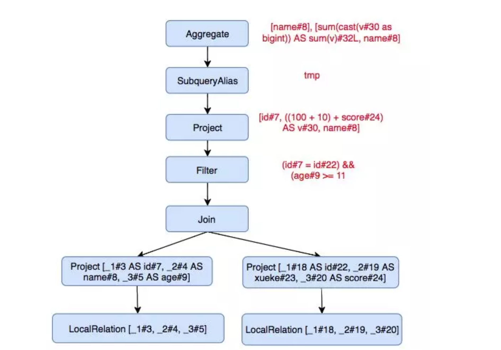

下面要进行逻辑优化了，常见的逻辑优化有:

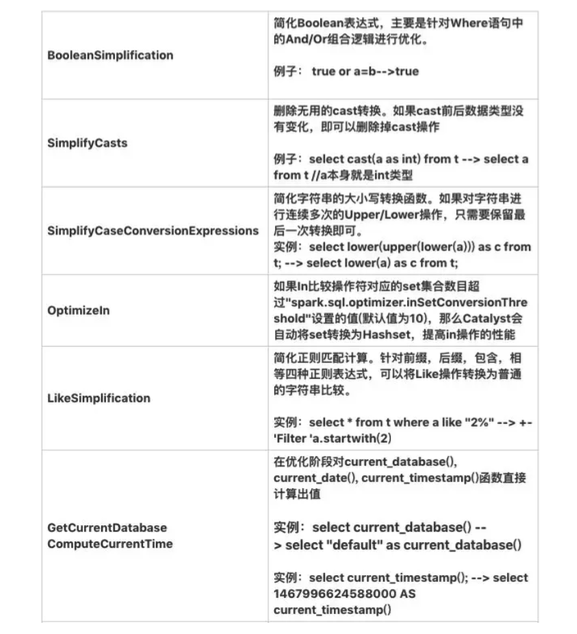

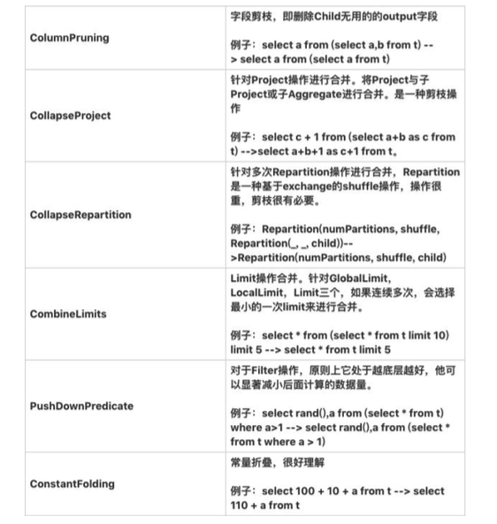

```shell
== Optimized Logical Plan ==
Aggregate [name#8], [sum(cast(v#26 as bigint)) AS sum(v)#28L, name#8]
+- Project [(110 + score#22) AS v#26, name#8]
   +- Join Inner, (id#7 = id#20)
      :- LocalRelation [id#7, name#8]
      +- LocalRelation [id#20, score#22]
```

这里用到的优化有:谓词下推(Push Down Predicate)、常量折叠(Constant Folding)、字段裁剪(Columning Pruning)

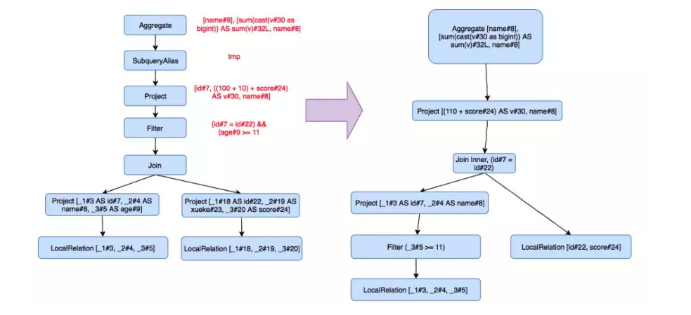

做完逻辑优化，还需要先转换为物理执行计划，将逻辑上可行的执行计划变为 Spark 可以真正执行的计划:

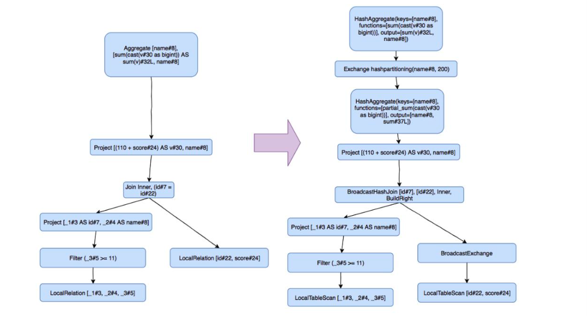

SparkSQL 把逻辑节点转换为了相应的物理节点， 比如 Join 算子，Spark 根据不同场景为该算子制定了不同的算法 策略。

```shell
== Physical Plan ==
*(2) HashAggregate(keys=[name#8], functions=[sum(cast(v#26 as bigint))], output=[sum(v)#28L, name#8])
+- Exchange hashpartitioning(name#8, 200)
   +- *(1) HashAggregate(keys=[name#8], functions=[partial_sum(cast(v#26 as bigint))], output=[name#8, sum#38L])
      +- *(1) Project [(110 + score#22) AS v#26, name#8]
         +- *(1) BroadcastHashJoin [id#7], [id#20], Inner, BuildLeft
            :- BroadcastExchange HashedRelationBroadcastMode(List(cast(input[0, int, false] as bigint)))
            :  +- LocalTableScan [id#7, name#8]
            +- LocalTableScan [id#20, score#22]
Aggregate [name#8], [sum(cast(v#26 as bigint)) AS sum(v)#28L, name#8]
+- Project [(110 + score#22) AS v#26, name#8]
   +- Join Inner, (id#7 = id#20)
      :- LocalRelation [id#7, name#8]
      +- LocalRelation [id#20, score#22]
```

数据在一个一个的 plan 中流转，然后每个 plan 里面表达式都会对数据进行处理，就相当于经过了一个个小函数的调 用处理，这里面有大量的函数调用开销。是不是可以把这些小函数内联一下，当成一个大函数， WholeStageCodegen 就是干这事的。可以看到最终执行计划每个节点前面有个 * 号，说明整段代码生成被启用， Project、BroadcastHashJoin、HashAggregate 这一段都启用了整段代码生成，级联为了大函数。