## Spark Streaming

随着大数据技术的不断发展，人们对于大数据的实时性处理要求也在不断提高，传统 的 MapReduce 等批处理框架在某些特定领域，例如实时用户推荐、用户行为分析这 些应用场景上逐渐不能满足人们对实时性的需求，因此诞生了一批如 S3、Samza、 Storm、Flink等流式分析、实时计算框架。

Spark 由于其内部优秀的调度机制、快速的分布式计算能力，能够以极快的速度进行 迭代计算。正是由于具有这样的优势，Spark 能够在某些程度上进行实时处理， Spark Streaming 正是构建在此之上的流式框架。

### Spark Streaming 概述

#### 什么是Spark Streaming

Spark Streaming 类似于Apache Storm（来一条数据处理一条，延迟低、响应快、吞吐量低），用于流式数据处理。Spark Streaming 具有高吞吐量和容错能力强等特点，支持数据源有很多，例如Kafka（最重要的数据源）、Flume、Twitter和TCP套接字，数据输入后可用高度抽象API，如map、reduce、join、window等进行运算，处理结果能保存在很多地方，如HDFS、数据库等，Spark Streaming能与MLlib已经Graphx融合

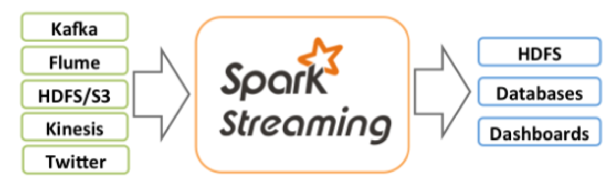

Spark Streaming 与Spark 基于RDD的概念比较类似，**Spark Streaming使用离散流（Discretized Stream）作为抽象表示，称为DStream**，DStream是随着时间推移而收到的数据的序列。在内部，每个时间区间收到的数据都作为RDD存在，DStream是由这些RDD所组成的序列

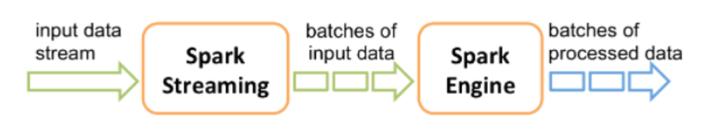

DStream可以从各种输入源创建，比如Flume、Kafka或者HDFS。创建出来的DStream支持两种操作

* 转化操作，会生成一个新的DStream
* 输出操作（output operation），把数据写入外部系统

DStream提供了许多与RDD所支持的操作相类似的操作支持，还增加了时间相关的新操作，比如滑动窗口。

#### Spark Streaming架构

Spark Streaming 使用 mini-batch架构，把流式计算当作一系列连续的小规模批处理来对待，Spark Streaming 从各种输入源中读取数据，并把数据分组为小的批次，新的批次按均匀的时间间隔创建处理，在每个时间区间开始的时候，一个新的批次就创建出来，在该区间内接收到的数据都会被添加到这个批次中。在时间区间结束时，批次停止增长。时间区间的大小是有批次间隔这个参数觉得决定的，批次间隔一般设在500毫秒到几秒之间，有开发者配置。每个输入批次都形成一个RDD，以 Spark 作业的方式处理并生成其他的 RDD。 处理的结果可以以批处理的方式传给外部系统。

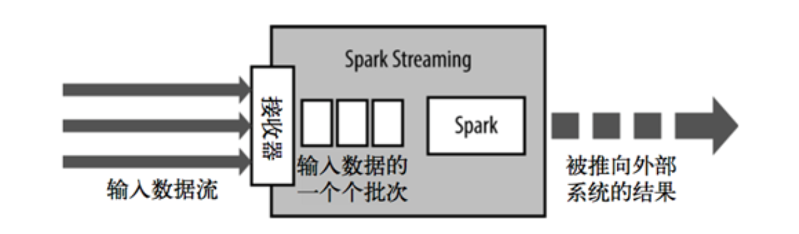

Spark Streaming 的编程抽象时离散化流，也就是DStream，是一个RDD序列，每个RDD代表数据流中的一个时间片的内的数据。

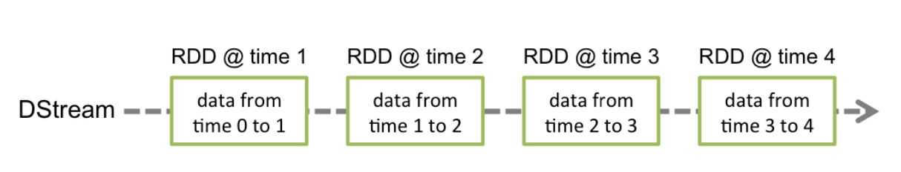

应用于DStream上的转换操作，都会转换为底层RDD上的操作，如对行DStream中的每个RDD应用flatMap操作以生成单词DStream的RDD

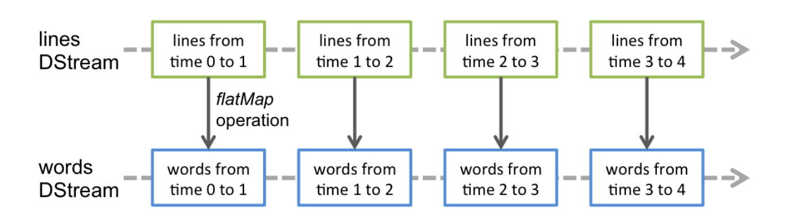

这些底层的RDD转换是由Spark引擎完成的。DStream操作隐藏了大部分这些细节， 为开发人员提供了更高级别的API以方便使用。

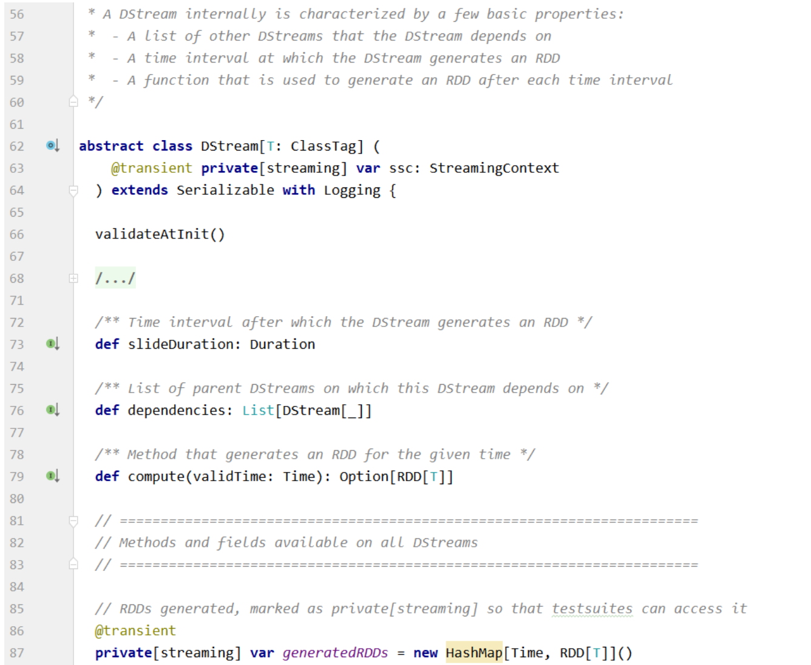

Spark Streaming为每个输入源启动对应的接收器。接收器运行在Executor中，从输入源收集数据并保存为 RDD。默认情况下接收到的数据后会复制到另一个Executor中，进行容错; Driver 中的 StreamingContext 会周期性地运行 Spark 作业来处理这些数据。

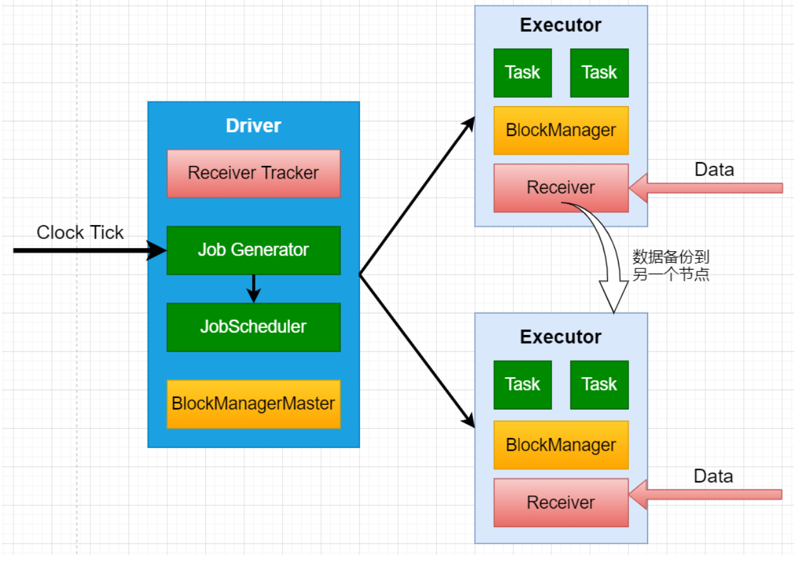

Spark Streaming运行流程

1. 客户端提交Spark Streaming 作业后启动Driver，Driver启动Receiver，Receiver接收数据源的数据

2. 每个作业保护多个Executor，每个Executor以线程的方式运行task，Spark Streaming至少包含一个receiver task（一般情况下）
3. Receiver接收数据后生成Block，并把BlockId汇报给Driver，然后备份到另外一个Executor上
4. ReceiverTracker维护Reciver汇报的BlockId
5. Driver定时启动JobGenerator，根据DStream的关系生成逻辑RDD，然后创建JobSet，叫个JobScheduler
6. JobScheduler负责调度JobSet，交给DAGScheduler，DAGScheduler根据逻辑RDD，生成相应的Stages，每个stage包含一到多个Task，将TaskSet提交给TaskSchedule。
7. TaskScheduler负责把Task调度到Executor上，并维护Task运行状态。

总结：

1. 提交完spark作业后，driver就会去启动Receiver取接收数据，Receiver接收数据的同时，会将数据备份到另一个节点，Receiver接收到数据会回报给Driver的，然后

#### Spark Streaming优缺点

EOS：exactly onece semantic 处理且仅处理一次

与传统流式框架相比，Spark Streaming最大的不同点在于它对待数据是粗粒度的处理方式，记一次处理一小批数据，而其他框架往往采用细粒度的处理模式，即依次处理一条数据，Spark Streaming这样的设计即为其带来了优点，也带来的确定

###### 优点

* Spark Streaming 内部实现和调度方式高度依赖Spark的DAG调度器和RDD，这就决定了Spark Streaming的设计初衷必须是粗粒度方式的，同时，由于Spark 内部调度器足够快速和高效，可以快速地处理小批量数据，这就获得准实时的特性
* Spark Streaming 的粗粒度执行方式使其确保“处理且仅处理一次”的特性（EOS），同时也可以方便地实现容错回复机制
* 由于Spark Streaming的DStream本质是RDD在流式数据上的抽象，因此基于RDD的各种操作也有相应的基于DStream的版本，这样就大大降低了用户对于新框架的学习成本，在了解Spark的情况下，用户将很容易使用Spark Streaming
* 由于DStream是在RDD上抽象，那么也跟容易与RDD进行交互操作，在需要将流式数据和批处理数据结合进行分析的情况下，将会变得非常方便

###### 缺点

* Spark Streaming 的粗粒度处理方式也造成了不可避免的延迟。在细粒度处理方式下，理想情况下每一条记录都会被实时处理，而在Spark Streaming中，数据需要汇总到一定的量后在一次性处理，这就增加了数据处理的延迟，这种延迟是由框架的设计引入的，并不是由网络或其他情况造成的

#### Structured Streaming

Spark Streaming计算逻辑是把数据按时间划分为DStream，存在以下问题：

* 框架自身只能根据Batch Time单元进行数据处理，很难处理基于Event time（即时间戳）的数据，很难处理延迟、乱序的数据
* 流式和批量处理的API完全不一致，两种使用场景中，程序代码还是需要一定的转换
* 端到端的数据容错保障逻辑需要用户自己构建，难以处理增量更新和持久化存储等一致性问题

基于以上问题，提出了下一代Structure Streaming。将数据映射为一张无界长度的表，通过表的计算，输出结果映射为另一张表。

以结构化的方式去操作流式数据，简化了实时计算过程，同时还复用了Catalyst引擎来优化SQL操作此外还能支持增量计算和基于event time 的计算。

### DStream基础数据源

基础数据源包括:文件数据流、socket数据流、RDD队列流;这些数据源主要用于测试。

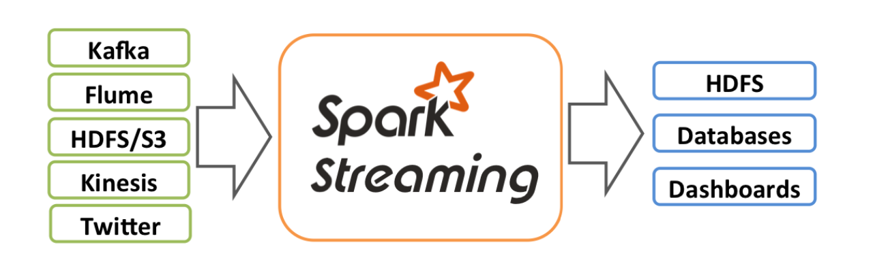

引入依赖：

```xml
<dependency>
    <groupId>org.apache.spark</groupId>
    <artifactId>spark-streaming_2.12</artifactId>
    <version>${spark.version}</version>
</dependency>
```

#### 文件数据流

文件数据流：通过textFileStream(directory)方法进行读取HDFS兼容的文件系统文件

```scala
/**
 * Create an input stream that monitors a Hadoop-compatible filesystem
 * for new files and reads them as text files (using key as LongWritable, value
 * as Text and input format as TextInputFormat). Files must be written to the
 * monitored directory by "moving" them from another location within the same
 * file system. File names starting with . are ignored.
 * @param directory HDFS directory to monitor for new file
 */
def textFileStream(directory: String): DStream[String] = withNamedScope("text file stream") {
  fileStream[LongWritable, Text, TextInputFormat](directory).map(_._2.toString)
}
```

Spark Streaming 将会监控directory目录，并不断处理移动进来的文件

* 不支持嵌套目录
* 文件需要相同的数据格式
* 文件进入directory的方式需要通过移动或者重命名来实现
* 一旦文件移动进目录，则不能在修改，即使修改了也不会读取新数据
* 文件流不需要接收器（receiver），不需要单独分配CPU核

```scala
package com.hhb.spark.streaming

import org.apache.spark.SparkConf
import org.apache.spark.streaming.{Seconds, StreamingContext}

/**
 * @description: 只能监控启动后的新增的文件
 * @date: 2020-11-19 10:28
 **/
object FileDStream {

  def main(args: Array[String]): Unit = {

    //1 创建SparkConf
    val conf: SparkConf = new SparkConf().setMaster("local[*]").setAppName(this.getClass.getCanonicalName.init)
    //2 初始化入口，设置任务5秒钟执行一次
    val ssc = new StreamingContext(conf, Seconds(5))
    ssc.sparkContext.setLogLevel("warn")
    //3、4、5
    //3 读取本地文件，创建DStream
    val linesDStream = ssc.textFileStream("/Users/baiwang/myproject/spark/data/log/")
    //4 DStream转换
    val wordDStream = linesDStream.flatMap(_.split("\\s+"))
    val wordCountDStream = wordDStream.map((_, 1)).reduceByKey(_ + _)
    //5 输出DStream到屏幕
    wordCountDStream.print()
    //6 启动作业
    ssc.start()
    //启动作业后，等待，作业以5秒一次的频率运行
    ssc.awaitTermination()
  }
}
```

#### Socket数据流

Spark Streaming 可以通过Socket端口监听并接受数据，然后进行相应的处理

在linux120上执行nc程序

```shell
nc -lk 9999
# yum install nc
```

随后可以在nc窗口中随意输入一下单词，监听窗口会自动获得单词数据流信息，在监听窗口每隔x秒就会打印出词频的统计信息，可以在屏幕上出现结果

备注：使用local[*]可能出现问题

如果给虚拟机配置的cpu数为1，使用local[*]也只会启动一个线程，该线程用于receiver task，此时没有资源处理接受打到的数据。

【现象:程序正常执行，不会打印时间戳，屏幕上也不会有其他有效信息】

源码：

```scala
/**
 * Creates an input stream from TCP source hostname:port. Data is received using
 * a TCP socket and the receive bytes is interpreted as UTF8 encoded `\n` delimited
 * lines.
 * @param hostname      Hostname to connect to for receiving data
 * @param port          Port to connect to for receiving data
 * @param storageLevel  Storage level to use for storing the received objects
 *                      (default: StorageLevel.MEMORY_AND_DISK_SER_2)
 * @see [[socketStream]]
 */
def socketTextStream(
    hostname: String,
    port: Int,
   //监控到的数据，默认存内存，内存存不下放到磁盘，并对数据进行备份
    storageLevel: StorageLevel = StorageLevel.MEMORY_AND_DISK_SER_2
  ): ReceiverInputDStream[String] = withNamedScope("socket text stream") {
  socketStream[String](hostname, port, SocketReceiver.bytesToLines, storageLevel)
}
```

注意:DStream的 StorageLevel 是 MEMORY_AND_DISK_SER_2;

```scala
package com.hhb.spark.streaming

import org.apache.spark.SparkConf
import org.apache.spark.streaming.{Seconds, StreamingContext}

/**
 * @description:
 * @author: huanghongbo
 * @date: 2020-11-19 15:35
 **/
object SocketDStream {

  def main(args: Array[String]): Unit = {

    //初始化StreamingContext
    val conf = new SparkConf().setMaster("local[*]").setAppName(this.getClass.getCanonicalName.init)
    val ssc = new StreamingContext(conf, Seconds(5))

    //接受数据，转换成socketStream
    //链接服务器，需要在服务安装nc 执行命令nc -lk 9999，然后输入数据
//    val socketDStream = ssc.socketTextStream("linux120", 9999)
    //链接本地
    val socketDStream = ssc.socketTextStream("localhost", 9999)
    //数据转换
    val wordDStream = socketDStream.flatMap(_.split("\\s+"))
    val wordCountDStream = wordDStream.map((_, 1)).reduceByKey(_ + _)

    //数据输出
    wordCountDStream.print()

    //启动
    ssc.start()
    ssc.awaitTermination()
  }

}
```

SocketServer程序(单线程)，监听本机指定端口，与socket连接后可发送信息:

```scala
package com.hhb.spark.streaming


import java.io.PrintWriter
import java.net.ServerSocket

/**
 * @description:
 * @author: huanghongbo
 * @date: 2020-11-19 16:14
 **/
object OneThreadSocket {

  def main(args: Array[String]): Unit = {

    val arr: Array[String] = "Hello World Hello Hadoop Hello spark kafka hive zookeeper hbase flume sqoop".split("\\s+")
    val n = arr.length
    val port = 9999
    val random = scala.util.Random
    val server = new ServerSocket(port)
    val socket = server.accept()
    println("链接成功，链接地址：" + socket.getInetAddress)
    while (true) {
      val writer = new PrintWriter(socket.getOutputStream)
      writer.println(arr(random.nextInt(n)) + " " + arr(random.nextInt(n)))
      writer.flush()
      Thread.sleep(100)
    }
  }
}
```

SocketServer程序(多线程)

```scala

```

#### RDD队列流

调试Spark Streaming应用程序的时候，可使用streamingContext.queueStream(queueOfRDD) 创建基于RDD队列的DStream

源码：

```scala
/**
 * Create an input stream from a queue of RDDs. In each batch,
 * it will process either one or all of the RDDs returned by the queue.
 *
 * @param queue      Queue of RDDs. Modifications to this data structure must be synchronized.
 * @param oneAtATime Whether only one RDD should be consumed from the queue in every interval
 * @tparam T         Type of objects in the RDD
 *
 * @note Arbitrary RDDs can be added to `queueStream`, there is no way to recover data of
 * those RDDs, so `queueStream` doesn't support checkpointing.
 */
def queueStream[T: ClassTag](
    queue: Queue[RDD[T]],
  //表示一次只处理一个RDD
    oneAtATime: Boolean = true
  ): InputDStream[T] = {
  queueStream(queue, oneAtATime, sc.makeRDD(Seq.empty[T], 1))
}
```

备注：

* oneAtTime :缺省为true，一次处理一个RDD，设为false，一次处理全部的RDD
* RDD队列流可以使用local[1]
* 涉及到同时出队和入队操作，所以需要同步

每秒创建一个RDD(RDD存放1-100的整数)，Streaming每隔1秒就对数据进行处 理，计算RDD中数据除10取余的个数。

```scala
package com.hhb.spark.streaming

import org.apache.spark.SparkConf
import org.apache.spark.rdd.RDD
import org.apache.spark.streaming.{Seconds, StreamingContext}

import scala.collection.mutable

/**
 * @description:
 * @date: 2020-11-19 16:20
 **/
object RDDDStream {

  def main(args: Array[String]): Unit = {
    //初始化ssc,没个一秒处理一次数据
    val conf = new SparkConf().setAppName(this.getClass.getCanonicalName.init).setMaster("local[*]")
    //由于RDD是一秒产生一个，所以执行实现需要小于一秒，否则产生完RDD后直接停止了，
    // 例如设置10秒，还没等执行，程序已经结束
    val ssc = new StreamingContext(conf, Seconds(1))
    //组装RDD的对流
    val queue = mutable.Queue[RDD[Int]]()
    // 读取RDD生成DStream
    val rddDStream = ssc.queueStream(queue)
    //具体的业务处理逻辑
    val countDStream = rddDStream.map(x => (x % 10, 1)).reduceByKey(_ + _)

    //输出
    countDStream.print()

    //启动
    ssc.start()

    //每秒产生一个RDD
    val arr = 1 to 100
    for (i <- 1 to 5) {
      queue.synchronized {
        queue += ssc.sparkContext.makeRDD(arr.map(_ * i))
      }
      Thread.sleep(1000)
    }
    ssc.stop()
  }
}
```


### DStream 转换操作

DStream上的操作与RDD类似，分为Transformations（转换） 和 Output Operations（输出）两种，池外转换操作中还有一些比较特殊的方法，如：updateStateByKey、transform以及各种Window相关的操作

| Transformation                   | Meaning                                                      |
| -------------------------------- | ------------------------------------------------------------ |
| map(func)                        | 将源DStream中的每个元素通过一个函数func从 而得到新的DStreams |
| flatMap(func)                    | 和map类似，但是每个输入的项可以被映射为0 或更多项            |
| filter(func)                     | 选择源DStream中函数func判为true的记录作为 新DStreams         |
| repartition(numPartitions)       | 通过创建更多或者更少的partition来改变此 DStream的并行级别    |
| union(otherStream)               | 联合源DStreams和其他DStreams来得到新 DStream                 |
| count()                          | 统计源DStreams中每个RDD所含元素的个数得 到单元素RDD的新DStreams |
| reduce(func)                     | 通过函数func(两个参数一个输出)来整合源 DStreams中每个RDD元素得到单元素RDD的 DStreams。这个函数需要关联从而可以被并行 计算 |
| countByValue()                   | 对于DStreams中元素类型为K调用此函数，得到 包含(K,Long)对的新DStream，其中Long值表明 相应的K在源DStream中每个RDD出现的频率 |
| reduceByKey(func, [numTasks])    | 对(K,V)对的DStream调用此函数，返回同样(K,V) 的新DStream，新DStream中的对应V为使用 reduce函数整合而来。默认情况下，这个操作使 用Spark默认数量的并行任务(本地模式为2，集 群模式中的数量取决于配置参数 spark.default.parallelism)。也可以传入可选 的参数numTasks来设置不同数量的任务 |
| join(otherStream, [numTasks])    | 两DStream分别为(K,V)和(K,W)对，返回(K,(V,W)) 对的新DStream   |
| cogroup(otherStream, [numTasks]) | 两DStream分别为(K,V)和(K,W)对，返回(K, (Seq[V],Seq[W])对新DStreams |
| **transform(func)**              | 将RDD到RDD映射的函数func作用于源DStream 中每个RDD上得到新DStream。这个可用于在 DStream的RDD上做任意操作 |
| updateStateByKey(func)           | 得到”状态”DStream，其中每个key状态的更新是 通过将给定函数用于此key的上一个状态和新值 而得到。这个可用于保存每个key值的任意状态 数据 |

备注：

* 在DStream与RDD上的转换操作非常类似（无状态操作）
* DStream有自己特殊的操作（窗口操作、追踪状态变化操作）
* 在DStream上的转换操作比RDD上的转换操作少

DStream的转化操作可以分为无状态（stateless）和有状态（stateful）两种：

* 无状态转换操作，每个批次处理不依赖之前批次的数据，常见的RDD转化操作，例如map、filter、reduceByKey等
* 有状态转化操作。需要使用之前批次的数据 或者 中间结果来计算当前批次的数据。有状态转化操作包括：基于滑动窗口的转化操作 或 追踪状态变化的转化操作

#### 无状态转换

无状态转化操作就是把简单的RDD转化操作应用到每个批次上，也就是转化DStream中的每一个RDD。创建的无状态转换包括:map、flatMap、filter、repartition、reduceByKey、groupByKey;直接作用在DStream上。重要的转换操作:**transform**。通过对源DStream的每个RDD应用RDD-to-RDD函 数，创建一个新的DStream。支持在新的DStream中做任何RDD操作。

```scala
/**
* Create a new DStream in which each RDD is generated by applying a function on RDDs of
* the DStreams.
*/
def transform[T: ClassTag](
  dstreams: Seq[DStream[_]],
  transformFunc: (Seq[RDD[_]], Time) => RDD[T]
): DStream[T] = withScope {
new TransformedDStream[T](dstreams, sparkContext.clean(transformFunc))
}
```

这是一个功能强大的函数，它可以允许开发者直接操作其内部的RDD。也就是说开 发者，可以提供任意一个RDD到RDD的函数，这个函数在数据流每个批次中都被调 用，生成一个新的流。

示例：黑名单过滤

```
假设:arr1为黑名单数据(自定义)，true表示数据生效，需要被过滤掉;false表示数据 未生效
val arr1 = Array(("spark", true), ("scala", false))
假设:流式数据格式为"time word"，需要根据黑名单中的数据对流式数据执行过滤操 作。如"2 spark"要被过滤掉
1 hadoop
2 spark
3 scala
4 java
5 hive
结果:"2 spark" 被过滤
```

方法一：使用外链接

```scala
package com.hhb.spark.streaming

import org.apache.spark.SparkConf
import org.apache.spark.streaming.dstream.ConstantInputDStream
import org.apache.spark.streaming.{Seconds, StreamingContext}

/**
 * @description:ConstantInputDStream 主要用于流式计算的测试
 * @date: 2020-11-20 10:09
 **/
object BlackListFilter1 {

  def main(args: Array[String]): Unit = {

    val conf = new SparkConf().setMaster("local[*]").setAppName(this.getClass.getCanonicalName.init)
    val ssc = new StreamingContext(conf, Seconds(5))
    //准备数据
    val arr: Array[(String, Int)] = "Hello World Hello Hadoop Hello spark kafka hive zookeeper hbase flume sqoop hello scala".split("\\s+").map(_.toLowerCase).zipWithIndex
    val data = arr.map { case (k, v) => v + " " + k }
    val rdd = ssc.sparkContext.makeRDD(data)
    //  黑名单
    val blackList = Array(("spark", true), ("scala", false),("hbase", true),("hello", true))
    val blackListRDD = ssc.sparkContext.makeRDD(blackList)
    //new ConstantInputDStream[String](ssc, rdd) =》 1 hello
    //    new ConstantInputDStream[String](ssc, rdd).map(value => (value.split("\\s+")(1), value))  => (hello,(1 hello))
    val rddDStream = new ConstantInputDStream[String](ssc, rdd).map(value => (value.split("\\s+")(1), value))
    val resultDStream = rddDStream.transform { rdd =>
      // 通过leftOuterJoin操作既保留了左侧RDD的所有内容，又获得了内容是否在黑名单中
      rdd.leftOuterJoin(blackListRDD)
        //      (hello,(hello 1,option(none)),(spark,(spark 3,option(true)))
        .filter { case (_, (_, rightValue)) => rightValue.getOrElse(false) != true }
        .map { case (_, (leftValue, _)) => leftValue }
    }
    resultDStream.print()
    // 启动流式作业
    ssc.start()
    ssc.awaitTermination()
  }
}
```

方案二：使用SQL或者DSL

```scala
package com.hhb.spark.streaming

import org.apache.spark.SparkConf
import org.apache.spark.sql.SparkSession
import org.apache.spark.streaming.dstream.ConstantInputDStream
import org.apache.spark.streaming.{Seconds, StreamingContext}

/**
 * @description:使用SQL或者DSL
 * @author: huanghongbo
 * @date: 2020-11-20 10:39
 **/
object BlackListFilter2 {

  def main(args: Array[String]): Unit = {

    val conf = new SparkConf().setAppName(this.getClass.getCanonicalName.init).setMaster("local[*]")
    val ssc = new StreamingContext(conf, Seconds(2))
    ssc.sparkContext.setLogLevel("warn")
    //准备数据
    val arr: Array[(String, Int)] = "Hello World Hello Hadoop Hello spark kafka hive zookeeper hbase flume sqoop hello scala".split("\\s+").map(_.toLowerCase).zipWithIndex
    val arrRDD = ssc.sparkContext.makeRDD(arr).map { case (k, v) => v + " " + k }
    val constantDStream = new ConstantInputDStream[String](ssc, arrRDD)

    //  黑名单
    val blackList = Array(("spark", true), ("scala", false), ("hbase", true), ("hello", true))
    val blackListRDD = ssc.sparkContext.makeRDD(blackList)

    val valueDStream = constantDStream.map(line => (line.split("\\s+")(1), line))
    valueDStream.transform { rdd =>
      val spark = SparkSession.builder.config(rdd.sparkContext.getConf).getOrCreate()
      import spark.implicits._

      val wordDF = rdd.toDF("word", "line")
      val blackListDF = blackListRDD.toDF("word1", "flag")

      wordDF.join(blackListDF, $"word" === $"word1", "left")
        .filter("flag == false or flag is null")
        .select("line")
        .rdd

    }.print()


    ssc.start()
    ssc.awaitTermination()
  }
}
```

方案三：直接过滤，没有shuffle

```scala
package com.hhb.spark.streaming

import org.apache.spark.SparkConf
import org.apache.spark.streaming.{Seconds, StreamingContext}
import org.apache.spark.streaming.dstream.ConstantInputDStream

/**
 * @description: 直接过滤，没有shuffle
 * @author: huanghongbo
 * @date: 2020-11-20 10:39
 **/
object BlackListFilter3 {


  def main(args: Array[String]): Unit = {
    val conf = new SparkConf().setAppName(this.getClass.getCanonicalName.init).setMaster("local[*]")
    val ssc = new StreamingContext(conf, Seconds(2))
    ssc.sparkContext.setLogLevel("warn")
    //准备数据
    val arr: Array[(String, Int)] = "Hello World Hello Hadoop Hello spark kafka hive zookeeper hbase flume sqoop hello scala".split("\\s+").map(_.toLowerCase).zipWithIndex
    val arrRDD = ssc.sparkContext.makeRDD(arr).map { case (k, v) => v + " " + k }
    val constantDStream = new ConstantInputDStream[String](ssc, arrRDD)

    //  黑名单
    val blackList = Array(("spark", true), ("scala", false), ("hbase", true), ("hello", true))
      .filter { case (_, v) => v }
      .map { case (k, _) => k }

   constantDStream.map(line => (line.split("\\s+")(1), line))
      .filter { case (word, _) => !blackList.contains(word) }
      .map { case (_, line) => line }
      .print()

    ssc.start()
    ssc.awaitTermination()
  }
}
```

#### 有状态转换

有状态转化的主要有两种操作：窗口操作、状态跟踪操作

###### 窗口操作

Window Operations 可以设计**窗口大小** 和 **滑动窗口间隔**。来动态的获取当前Streaming的状态。基于窗口的操作会在一个比StreamingContext和batchDuration（批次间隔）更长的时间范围内，通过整合多个批次的结果，计算整个窗口的结果

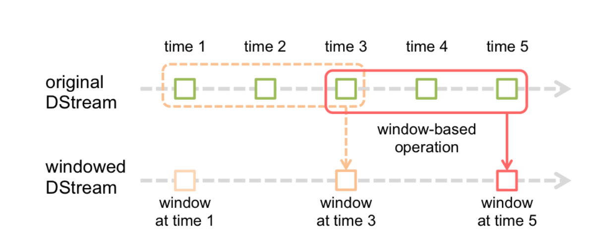

基于窗口的操作需要两个参数：

* 窗口长度（windowDuration）。控制每次计算最近的多少个批次的数据
* 滑动间隔（slideDuration）。用来控制对新的DStream进行计算的间隔

两者都必须是StreamingContext中批次间隔（batchDuration）的整数倍

每秒发送一个数字：

```scala
package com.hhb.spark.streaming

import java.io.PrintWriter
import java.net.ServerSocket

/**
 * @description:
 * @date: 2020-11-20 14:31
 **/
object NumSocket {

  def main(args: Array[String]): Unit = {

    val server = new ServerSocket(9999)
    val socket = server.accept()
    var i = 0
    println("服务注册：" + socket.getInetAddress)
    while (true) {
      i += 1
      val writer = new PrintWriter(socket.getOutputStream)
      writer.println(i)
      writer.flush()
      Thread.sleep(1000)
    }
  }

}
```

案例一：

* 观察窗口的数据

* 观察batchDuration、windowDuration、slideDuration三者之间的关系
* 使用窗口相关的操作

```scala
package com.hhb.spark.streaming

import org.apache.spark.SparkConf
import org.apache.spark.streaming.{Seconds, StreamingContext}

/**
 * @description:
 * @date: 2020-11-20 14:31
 **/
object WindowDemo {

  def main(args: Array[String]): Unit = {

    //初始化
    val conf = new SparkConf().setMaster("local[*]").setAppName(this.getClass.getCanonicalName.init)
    //每5秒生成一个RDD
    val ssc = new StreamingContext(conf, Seconds(5))
    ssc.sparkContext.setLogLevel("error")

    val lines = ssc.socketTextStream("localhost", 9999)

    lines.foreachRDD { (rdd, time) =>
      println(rdd.id + "   time: " + time)
      println("*" * 15)
      rdd.foreach(x => print(x + "\t"))
    }
    // 窗口长度为20s，每隔10s滑动一次
    lines.reduceByWindow(_ + " " + _, Seconds(20), Seconds(10))
      .print()
    println("=" * 15)

    //对数据进行求和
    lines.map(_.toInt).window(Seconds(20), Seconds(10)).reduce(_ + _).print()
		//对数据进行求和
    lines.map(_.toInt).reduceByWindow(_ + _, Seconds(20), Seconds(10)).print()

    ssc.start()
    ssc.awaitTermination()

  }
}
```

案例二：热点搜索词实时统计。每隔 10 秒，统计最近20秒的词出现的次数

```scala
package com.hhb.spark.streaming

import org.apache.spark.SparkConf
import org.apache.spark.streaming.{Seconds, StreamingContext}

/**
 * @description:
 * @author: huanghongbo
 * @date: 2020-11-20 15:12
 **/
object HotWordStats {

  def main(args: Array[String]): Unit = {
    //初始化StreamingContext
    val conf = new SparkConf().setMaster("local[*]").setAppName(this.getClass.getCanonicalName.init)
    val ssc = new StreamingContext(conf, Seconds(5))
    ssc.sparkContext.setLogLevel("error")

    // 通过reduceByKeyAndWindow算子, 每隔10秒统计最近20秒的词出现的次数 ,后 3个参数:窗口时间长度、滑动窗口时间、分区
    val wordDStream = ssc.socketTextStream("localhost", 9999).flatMap(_.split("\\s+")).map((_, 1))
    wordDStream.reduceByKeyAndWindow((x: Int, y: Int) => x + y, Seconds(20), Seconds(10)).print()

    println("*" * 20)
		//设置检查点，检查点具有容错机制。生产环境中应设置到HDFS
    ssc.checkpoint("data/checkpoint/")
    // 这里需要checkpoint的支持
    wordDStream.reduceByKeyAndWindow(_ + _, _ - _, Seconds(20), Seconds(10)).print()

    ssc.start()
    ssc.awaitTermination()
  }
}
```

###### 状态追踪(updateStateByKey)

UpdateStateByKey的主要功能：

* 为Streaming中每一个key维护一份state状态，state类型可以是任意类型的，可以是自定义对象；更新函数也可以是自定义的
* 通过更新函数对该key的状态不断更新，对于每个新的batch而言，Spark Streaming会在使用updateStateKey的时候为已经存在的key进行state的状态更新
* 使用updateStateByKey时要开启checkpoint功能

源码：

```scala
/**
* Return a new "state" DStream where the state for each key is updated by applying
* the given function on the previous state of the key and the new values of each key.
* In every batch the updateFunc will be called for each state even if there are no new values.
* Hash partitioning is used to generate the RDDs with Spark's default number of partitions.
* @param updateFunc State update function. If `this` function returns None, then
*                   corresponding state key-value pair will be eliminated.
* @tparam S State type
*/
def updateStateByKey[S: ClassTag](
  updateFunc: (Seq[V], Option[S]) => Option[S]
): DStream[(K, S)] = ssc.withScope {
updateStateByKey(updateFunc, defaultPartitioner())
}
```

流式程序启动后计算wordcount的累计值，将每个批次的结果保存到文件

```scala
package com.hhb.spark.streaming

import org.apache.spark.SparkConf
import org.apache.spark.streaming.{Seconds, StreamingContext}

/**
 * @description:
 * @author: huanghongbo
 * @date: 2020-11-20 17:56
 **/
object StateTracker1 {

  def main(args: Array[String]): Unit = {
    val conf = new SparkConf().setMaster("local[*]").setAppName(this.getClass.getCanonicalName.init)
    val ssc = new StreamingContext(conf, Seconds(5))
    ssc.sparkContext.setLogLevel("error")
    ssc.checkpoint("data/checkpoint")
    //准备数据
    val wordDStream = ssc.socketTextStream("localhost", 9999).flatMap(_.split("\\s+")).map((_, 1))

    // def updateStateByKey[S: ClassTag](updateFunc: (Seq[V]value的类型, Option[S]) => Option[S] 返回值
    //定义状态更新函数
    //函数常量定义，返回值类型是Some（Int），表示的含义是最新的状态
    //函数的功能是将当前时间间隔产生的key的value的集合，加到上一个状态，得到最新状态
    val updateFunc = (currVale: Seq[Int], preValue: Option[Int]) => {
      //通过Spark内部的reduceByKey按key规约，然后这里传入某key当前批次的Seq，在计算当前批次的总和
      val currSum = currVale.sum
      //以前已经累加的值
      val preSum = preValue.getOrElse(0)
      Option(currSum + preSum)
    }
    val resultDStream = wordDStream.updateStateByKey[Int](updateFunc)
    resultDStream.cache()

    resultDStream.print()
    // 把DStream保存到文本文件中，会生成很多的小文件。一个批次生成一个目录
    resultDStream.repartition(1).saveAsTextFiles("data/output1/")

    ssc.start()
    ssc.awaitTermination()
  }
}
```

统计全局的key的状态，但是就算没有数据输入，也会在每一个批次的时候返回之前的key的状态。这样的确定：如果数据量很大的话，checkpoint数据会占用较大的存储，而且效率也不高。

mapWithState：也是用于全局统计key的状态，如果没有数据输入，便不会返回之前key的状态，有一点增量的感觉，这样做的好处是，只关心那些已经发生变化的key，对于没有数据输入，则不会返回那些没有变化的key的数据，即使数据量很大，checkpoint也不会像updateStateByKey那样，占用太多的存储

```scala
package com.hhb.spark.streaming

import org.apache.spark.SparkConf
import org.apache.spark.streaming.{Seconds, State, StateSpec, StreamingContext}

/**
 * @description:
 * @author: huanghongbo
 * @date: 2020-11-20 17:56
 **/
object StateTracker2 {
  def main(args: Array[String]): Unit = {
    val conf = new SparkConf().setMaster("local[*]").setAppName(this.getClass.getCanonicalName.init)
    val ssc = new StreamingContext(conf, Seconds(5))
    ssc.sparkContext.setLogLevel("error")
    ssc.checkpoint("data/checkpoint")
    //准备数据
    val wordDStream = ssc.socketTextStream("localhost", 9999).flatMap(_.split("\\s+")).map((_, 1))


    //(KeyType, Option[ValueType], State[StateType]) => MappedType
    //(key的类型，输入的数据，中间汇总)=> 返回值类型
    def func(key: String, option: Option[Int], state: State[Int]): (String, Int) = {
      val sum = option.getOrElse(0) + state.getOption().getOrElse(0)
      state.update(sum)
      (key, sum)
    }

    val spec = StateSpec.function(func _)
    //只统计本批次出现的数据，不会把所有数据汇总
    val resultDStream = wordDStream.mapWithState(spec)
      //.stateSnapshots() 以快照的形式，把所有的数据都显示出来,结果类似于updateStateByKey
      .stateSnapshots()

    resultDStream.cache()

    resultDStream.print()
    // 把DStream保存到文本文件中，会生成很多的小文件。一个批次生成一个目录
    resultDStream.repartition(1).saveAsTextFiles("data/output2/")

    ssc.start()
    ssc.awaitTermination()

  }
}
```

总结：mapWithState按照时间线在每一个批次间隔返回之前的发生改变的或者新的key的状态，不发生变化的不返回；updateStateByKey统计的是全局Key的状态，就算没有数据输入也会在每个批次的时候返回之前的Key的状态。也就是说，mapWithState统计的是一个批次的数据，updateStateByKey统计的是全局的key

### DStream 输出操作

输出操作定义 DStream 的输出操作。与 RDD 中的惰性求值类似，如果一个DStream及其派生出的 DStream 都没有被执行输出操作，那么这些 DStream 就都不会被求值。如果 StreamingContext 中没有设定输出操作，整个流式作业不会启动。

| Output Operation                        | Meaning                                                      |
| --------------------------------------- | ------------------------------------------------------------ |
| print()                                 | 在运行流程序的Driver上，输出DStream中每一批次数据最开始的10个元素，用于开发和调试 |
| saveAsTestFile(prefix,[suffix])         | 以text文件形成存储DStream的内容，每一批次的存储文件名基于参数中的prefix和suffix |
| saveAsObjectFiles(prefix,[suffix])      | 以 Java 对象序列化的方式将Stream中的数据保 存为 Sequence Files。每一批次的存储文件名基 于参数中的为"prefix-TIME_IN_MS[.suffix]" |
| saveAsHadoopFiles(*prefix*, [*suffix*]) | 将Stream中的数据保存为 Hadoop files。每一批 次的存储文件名基于参数中的为"prefix- TIME_IN_MS[.suffix]" |
| **foreachRDD**(*func*)                  | **最通用的输出操作**。将函数 func 应用于 DStream 的每一个RDD上 |

通用的输出操作foreachRDD，用来对DStream中的RDD进行任意计算，在foreachRDD中，可以重用Spark RDD 中所有的Action操作，需要注意的是：

* 链接不要定义在Driver
* 链接定义在RDD的foreach算子中，则遍历RDD的每个元素时都创建链接，得不偿失
* 应该在RDD的foreachPartition中定义链接，每个分区创建一个链接
* 可以考虑使用连接池

### 与Kafka整合

[官网](http://spark.apache.org/docs/2.4.5/streaming-kafka-integration.html)

针对不同的spark、kafka版本，集成处理数据的方式分为两种:Receiver Approach 和Direct Approach，不同集成版本处理方式的支持，可参考下图:

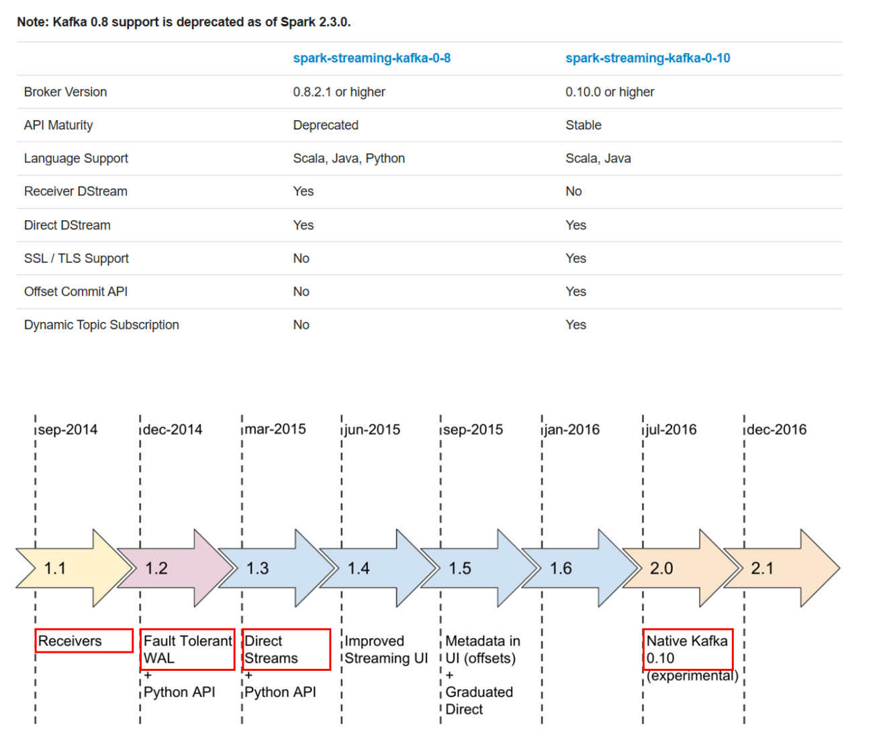

对Kafka的支持分为两个版本08(在高版本中将被废弃)、010，两个版本不兼容。

#### Kafka-08接口

###### Receiver based Approach

基于Receiver的方式使用kafka旧版消费者高阶API实现。对于所有的Receiver，通过Kafka接收的数据被存储于Spark的Executors上，底层是写入BlockManager中，默认200ms生成一个block（spark.streaming.blockInterval）。然后由spark Streaming提交的job构建BlockRDD，最终以Spark Core任务的形式运行，对应的Receiver方式，有以下几点需要注意：

* Receiver 作为一个常驻线程调度到Executor上运行，占用一个CPU
* Receiver个数由KafkaUtil.createStream调用次数来决定，一次一个Receiver。
* Kafka中的topic分区并不能关联产生在spark streaming中的rdd分区，增加在KafkaUtils.createStream()中的指定的topic分区数，仅仅增加了单个receiver消费的topic线程数，他不会正价处理数据中并行的Spark数量【即：topicMap[topic,num_threads]中，value对应的数值应该是每个topic对应的消费线程数】
* receiver默认200ms生成一个block，可根据数据量大小调整block生成周期，一个block对应RDD分区。
* receiver接收的数据会放入到BlockManager，每个Executor都会有一个BlockManager实例，由于数据本地性，那些存在Receiver的Executor会被调度执行更多的Task，就会导致某些executor比较空闲
* 默认情况下，Receiver是可能丢失数据的，可以通过设置spark.streaming.receiver.writeAheadLog.enable为true开启预写日志机制，将数据先写入到一个可靠的分布式文件系统（如HDFS），确保数据不丢失，但会损失一定性能。

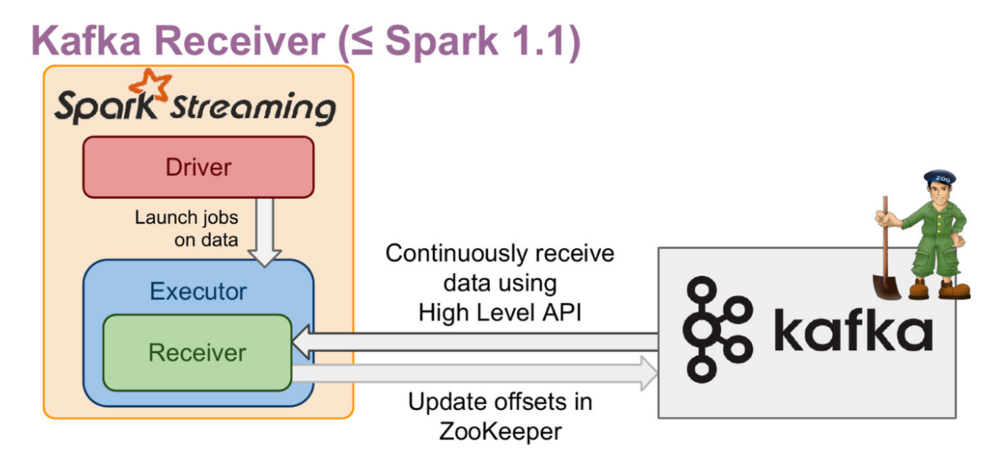

Kafka-08接口（Receiver方式）：

* Offset保持在ZK中，系统管理
* 对应kafka的版本0.8.2.1+
* 接口底层实现使用Kafka旧版消费者高阶API
* DStream底层实现为BlockRDD

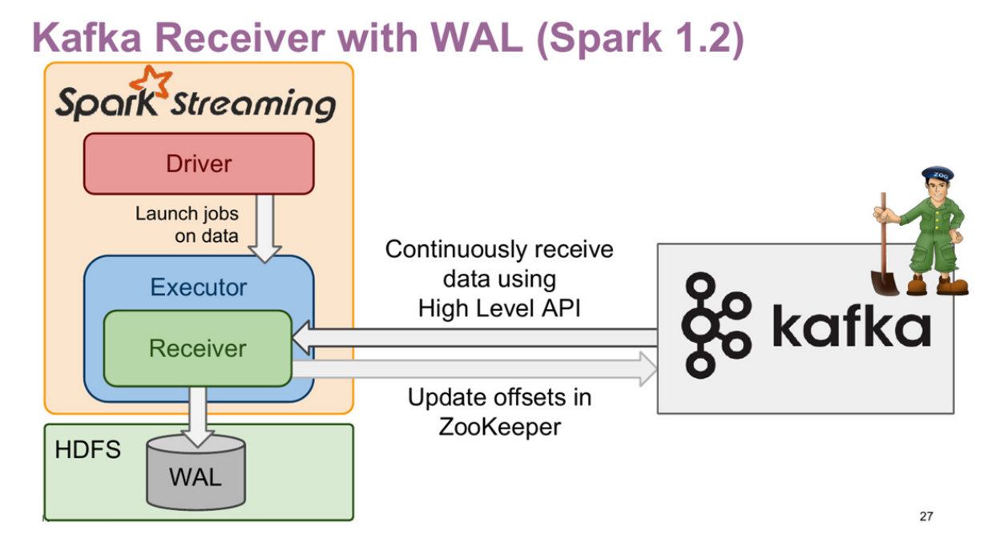

Kafka-08接口（Receiver with WAL）

* 增强了故障恢复的能力
* 接收的数据与Dirver的元数据保存到HDFS
* 增加了流式应用处理的延迟

###### Direct Approach

Direct Approach是 Spark Streaming不使用Receiver集成kafka的方式，在企业生产环境中使用较多。相较于Receiver，有以下特点:

* 不使用Receiver。减少不必要的CPU占用，减少了Receiver接收数据写入BlockManager，然后运行时再通过BlockId、网络传输、磁盘读取等来获取数据的整个过程，提高了效率；无需WAL，进一步减少磁盘IO

* Direct方式生成了RDD时KafkaRDD，他的分区数与Kafka分区数保存一致，便于控制并行度

  注意：在Shuffle或Repartition操作后生成的RDD，这种对应关系会失效

* 可以手动维护offset，实现Exactly once 语义（处理仅处理一次）

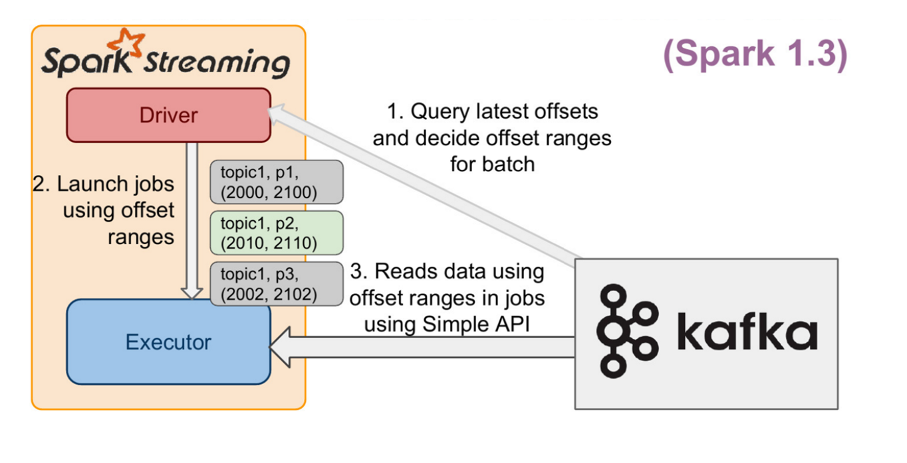

#### Kafka-010接口

Spark Streaming与kafka 0.10的整合，和0.8版本的 Direct 方式很像。Kafka的分区 和Spark的RDD分区是一一对应的，可以获取 offsets 和元数据，API 使用起来没有 显著的区别。

添加依赖：

```xml
<!-- sparkStreaming 结合 kafka -->
<dependency>
  <groupId>org.apache.spark</groupId>
  <artifactId>spark-streaming-kafka-0-10_2.12</artifactId>
  <version>${spark.version}</version>
</dependency>
```

不要手动添加 org.apache.kafka 相关的依赖，如kafka-clients。spark-streaming- kafka-0-10已经包含相关的依赖了，不同的版本会有不同程度的不兼容。

使用kafka010接口从Kafka中获取数据

* Kafka集群
* Kakfa生产者发送数据
* Spark Streaming程序接收数据

```scala
package com.hhb.spark.streaming.kafka

import java.util.Properties

import org.apache.kafka.clients.producer.{KafkaProducer, ProducerConfig, ProducerRecord}
import org.apache.kafka.common.serialization.StringSerializer

/**
 * @description:
 * @author: huanghongbo
 * @date: 2020-11-23 11:08
 **/
object KafkaProducer {


  def main(args: Array[String]): Unit = {

    val brokers = "linux121:9092,linux122:9092,linux123:9092"
    val topic = "topicA"
    val prop = new Properties()

    prop.put(ProducerConfig.BOOTSTRAP_SERVERS_CONFIG, brokers)
    prop.put(ProducerConfig.KEY_SERIALIZER_CLASS_CONFIG, classOf[org.apache.kafka.common.serialization.StringSerializer])
    prop.put(ProducerConfig.VALUE_SERIALIZER_CLASS_CONFIG, classOf[org.apache.kafka.common.serialization.StringSerializer])

    // 创建生产者
    val producer = new KafkaProducer[String, String](prop)

    //向生产者里面发送信息
    for (i <- 0 to 1000000) {
      val record = new ProducerRecord[String, String](topic, i.toString, i.toString)
      producer.send(record)
      println(s"i -> $i")
      Thread.sleep(100)
    }
    producer.close()
  }
}
```

消费：

```scala
package com.hhb.spark.streaming.kafka

import org.apache.kafka.clients.consumer.ConsumerConfig
import org.apache.kafka.common.serialization.StringDeserializer
import org.apache.spark.SparkConf
import org.apache.spark.streaming.kafka010.{ConsumerStrategies, KafkaUtils, LocationStrategies}
import org.apache.spark.streaming.{Seconds, StreamingContext}

/**
 * @description:
 * @author: huanghongbo
 * @date: 2020-11-23 12:35
 **/
object KafkaDStream1 {


  def main(args: Array[String]): Unit = {

    val conf = new SparkConf().setAppName(this.getClass.getCanonicalName.init).setMaster("local[*]")
    val ssc = new StreamingContext(conf, Seconds(2))
    ssc.sparkContext.setLogLevel("warn")
    val topics = Array("topicA")
    val groupId = "groupId"
    //定义Kafka相关参数
    val param: Map[String, Object] = getKafkaParam(groupId)

    val kafkaDStream = KafkaUtils.createDirectStream(
      ssc,
      LocationStrategies.PreferConsistent,
      ConsumerStrategies.Subscribe[String, String](topics, param)
    )
    kafkaDStream.foreachRDD((rdd, time) =>
      println(s"rdd.count=>${rdd.count()},time=> ${time}")
    )
    ssc.start()
    ssc.awaitTermination()
  }

  /**
   * 定义Kafka相关参数
   *
   * @return
   */
  def getKafkaParam(groupId: String): Map[String, Object] = {
    Map[String, Object](
      ConsumerConfig.BOOTSTRAP_SERVERS_CONFIG -> "linux121:9092,linux122:9092,linux123:9092",
      ConsumerConfig.KEY_DESERIALIZER_CLASS_CONFIG -> classOf[org.apache.kafka.common.serialization.StringDeserializer],
      ConsumerConfig.VALUE_DESERIALIZER_CLASS_CONFIG -> classOf[org.apache.kafka.common.serialization.StringDeserializer],
      ConsumerConfig.GROUP_ID_CONFIG -> groupId,
      ConsumerConfig.AUTO_OFFSET_RESET_CONFIG -> "earliest",
      ConsumerConfig.ENABLE_AUTO_COMMIT_CONFIG -> (false: java.lang.Boolean)
    )
  }
}
```

**LocationStrategies(本地策略)**

* LocationStrategies.PreferBrokers ：如果Executor在Kafka集群中的某些节点上，可以使用这种策略，那么Executor中的数据都会来之当前broker节点
* LocationStrategies.PreferConsistent: 大多数情况下使用的策略，将Kafka分区均匀分布在Spark集群的Executor上
* LocationStrategies.PreferFixed:如果节点之间的分区明显分布不均，使用这种策略。通过一个Map指定将topic分区分布在哪些节点中

**ConsumerStrategies(消费策略)**

* ConsumerStrategies.Subscribe，用来订阅一组Topic
* ConsumerStrategies.SubscribePattern，使用正则来指定感兴趣的topic
* ConsumerStrategies.Assign，指定固定分区的集合

这三种策略都有重载构造函数，允许指定特定分区的起始偏移量;使用 Subscribe 或 SubscribePattern 在运行时能实现分区自动发现。

kafka相关命令：

```shell
# 创建Topic
kafka-topics.sh --create --zookeeper localhost:2181/myKafka --topic topicA --partitions 3 --replication-factor 3

# 显示topic信息
kafka-topics.sh --zookeeper localhost:2181/myKafka --topic topicA --describe
 
# 检查 topic 的最大offset
kafka-run-class.sh kafka.tools.GetOffsetShell --broker-list linux121:9092,linux122:9092,linux123:9092 --topic topicA --time -1


# 检查消费者的offset
kafka-consumer-groups.sh --bootstrap-server linux121:9092 --describe --group groupId

# 重置消费者offset
kafka-consumer-groups.sh --bootstrap-server linux121:9092,linux122:9092,linux123:9092 --group groupId --reset-offsets --execute --to-offset 0 --topic topicA
```

#### Offset管理

Spark Streaming集成Kafka，允许Kafka中读取一个或者多个topic数据，一个Kafka Topic包含一个或多个分区，每个分区中的消息顺序存储，并使用offset来标记消息的位置，开发者可以在SparkStreaming应用中通过offset来控制数据的读取位置。

Offsets管理对于保证流式应用在整个生命周期中数据的连贯性是非常重要的，如果在应用停止或报错退出之前没有将offset持久化保存，该信息就会丢失，那么Spark Streaming就没有办法从上次停止或报错的位置继续消费Kafka中的消息。

###### 获取偏移量（Obtaining Offsets）

Spark Streaming与kafka整合时，允许获取其消费的 offset ，具体方法如下:

```scala
 package com.hhb.spark.streaming.kafka

import org.apache.kafka.clients.consumer.ConsumerConfig
import org.apache.spark.SparkConf
import org.apache.spark.streaming.kafka010.{ConsumerStrategies, HasOffsetRanges, KafkaUtils, LocationStrategies}
import org.apache.spark.streaming.{Seconds, StreamingContext}

/**
 * @description:
 * @author: huanghongbo
 * @date: 2020-11-23 12:35
 **/
object KafkaDStream1 {


  def main(args: Array[String]): Unit = {

    val conf = new SparkConf().setAppName(this.getClass.getCanonicalName.init).setMaster("local[*]")
    val ssc = new StreamingContext(conf, Seconds(2))
    ssc.sparkContext.setLogLevel("warn")
    val topics = Array("topicA")
    val groupId = "groupId"
    //定义Kafka相关参数
    val param: Map[String, Object] = getKafkaParam(groupId)


    val kafkaDStream = KafkaUtils.createDirectStream(
      ssc,
      LocationStrategies.PreferConsistent,
      ConsumerStrategies.Subscribe[String, String](topics, param)
    )

    //topic：topicA,partition:1,from: 0,to:90
    //topic：topicA,partition:0,from: 0,to:122
    //topic：topicA,partition:2,from: 0,to:98
    //topic：topicA,partition:1,from: 90,to:90
    //topic：topicA,partition:0,from: 122,to:122
    //topic：topicA,partition:2,from: 98,to:98
    kafkaDStream.foreachRDD { rdd =>
      val ranges = rdd.asInstanceOf[HasOffsetRanges].offsetRanges
      ranges.foreach { range =>
        println(s"topic：${range.topic},partition:${range.partition},from: ${range.fromOffset},to:${range.untilOffset}")
      }
    }

    //    kafkaDStream.foreachRDD((rdd, time) =>
    //      println(s"rdd.count=>${rdd.count()},time=> ${time}")
    //    )


    ssc.start()
    ssc.awaitTermination()
  }


  /**
   * 定义Kafka相关参数
   *
   * @return
   */
  def getKafkaParam(groupId: String): Map[String, Object] = {
    Map[String, Object](
      ConsumerConfig.BOOTSTRAP_SERVERS_CONFIG -> "linux121:9092,linux122:9092,linux123:9092",
      ConsumerConfig.KEY_DESERIALIZER_CLASS_CONFIG -> classOf[org.apache.kafka.common.serialization.StringDeserializer],
      ConsumerConfig.VALUE_DESERIALIZER_CLASS_CONFIG -> classOf[org.apache.kafka.common.serialization.StringDeserializer],
      ConsumerConfig.GROUP_ID_CONFIG -> groupId,
      ConsumerConfig.AUTO_OFFSET_RESET_CONFIG -> "earliest",
      ConsumerConfig.ENABLE_AUTO_COMMIT_CONFIG -> (false: java.lang.Boolean)
    )
  }
}
```

注意：对HasOffsetRanges的类型转换只有在对createDirectStream调用的第一个方法中完成才会成功，而不是在随后的方法链中。RDD分区和Kafka分区之间的对应关系在shuffle或重分区后丢失，如reduceByKey或Window。

###### 存储偏移量（Storing Offsets）

在Streaming 程序失败的情况下，kafka交付语义取决于**如何以及何时存储**偏移量。Spark 输出操作的语义为 at-least-once

如果要失效EOS语义（Exactly Once Semantics）,**必须在幂等的输出之后存储偏移量或者将存储偏移量与输出放在一个事务中**，可以安装增加可靠性（和代码复杂度）的顺序使用一下选项来存储偏移量

* CheckPoint

  CheckPoint是对Spark Steaming运行过程中的元数据和每个RDDs的数据状态保存到一个持久化系统中，这里也包含了offset，一般是HDFS、S3，如果应用程序或者集群挂了，可以迅速恢复，如果Streamging 程序的代码变了，重新打包执行就会出翔反序列化异常的问题。这是因为CheckPoint首次持久化时会讲整个jar序列化，以便重启时恢复，重新打包之后，新旧代码逻辑不同，就会报错或仍然执行旧版代码。要解决这个问题，只能将HDFS上的checkpoint文件删除，但是这样也会删除Kafka的offset信息

* Kafka

  默认情况下，消费者定期自动提交偏移量，它将偏移量存储在一个特殊的Kafka主题中(__consumer_offsets)。但在某些情况下，这将导致问题，因为消息可能已经 被消费者从Kafka拉去出来，但是还没被处理。可以将 enable.auto.commit 设置为 false ，在 Streaming 程序输出结果之后，手动 提交偏移到kafka。与检查点相比，使用Kafka保存偏移量的优点是无论应用程序代码如何更改，偏移量 仍然有效。

  ```scala
  stream.foreachRDD { rdd => val offsetRanges =
  rdd.asInstanceOf[HasOffsetRanges].offsetRanges
  // 在输出操作完成之后，手工提交偏移量;此时将偏移量提交到 Kafka 的消息队列中
  stream.asInstanceOf[CanCommitOffsets].commitAsync(offsetRanges) }
  ```

  与HasOffsetRanges一样，只有在createDirectStream的结果上调用时，转换到 CanCommitOffsets才会成功，而不是在转换之后。commitAsync调用是线程安全 的，但必须在输出之后执行。

* 自定义存储

  Offsets可以通过多种方式来管理，但是一般来说遵循下面的步骤:

  * 在 DStream 初始化的时候，需要指定每个分区的offset用于从指定位置读取数据
  * 读取并处理消息
  * 处理完之后存储结果数据 
  * 用虚线圈存储和提交offset，强调用户可能会执行一系列操作来满足他们更加严格的语义要求。这包括幂等操作和通过原子操作的方式存储offset
  * 将 offsets 保存在外部持久化数据库如 HBase、Kafka、HDFS、ZooKeeper、 Redis、MySQL ... ...

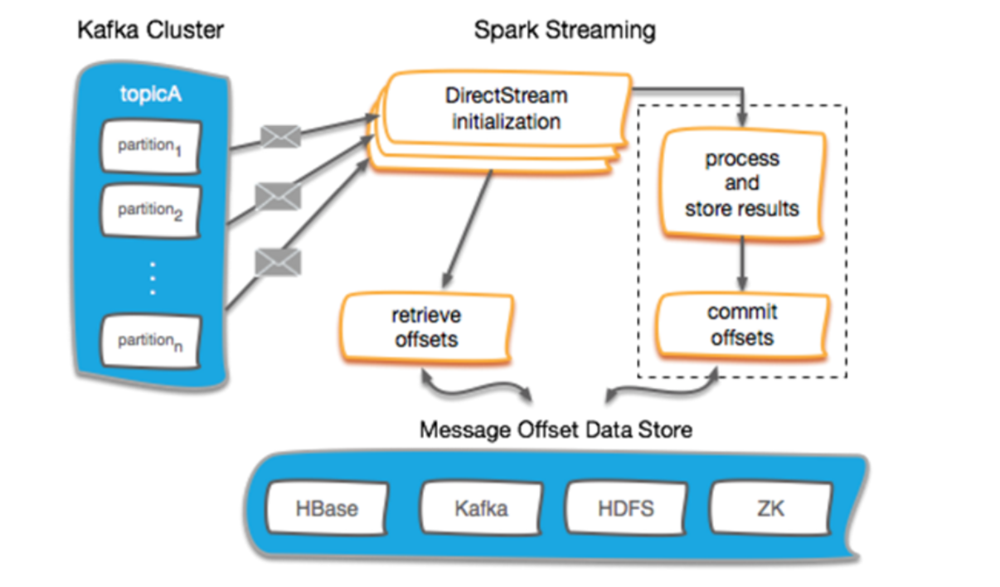

可以将 Offsets 存储到HDFS中，但这并不是一个好的方案。因为HDFS延迟有点高， 此外将每批次数据的offset存储到HDFS中还会带来小文件问题;

可以将 Offset 存储到保存ZK中，但是将ZK作为存储用，也并不是一个明智的选择， 同时ZK也不适合频繁的读写操作;

###### Redis管理的Offset

要想将Offset保存到外部存储中，关键要实现以下几个功能:

* Streaming程序启动时，从外部存储获取保存的Offsets(执行一次) 
* 在foreachRDD中，每个批次数据处理之后，更新外部存储的offsets(多次执行) 

案例一:使用自定义的offsets，从kafka读数据;处理完数据后打印offsets

```scala
package com.hhb.spark.streaming.kafka

import org.apache.kafka.clients.consumer.ConsumerConfig
import org.apache.kafka.common.TopicPartition
import org.apache.kafka.common.serialization.StringDeserializer
import org.apache.spark.SparkConf
import org.apache.spark.streaming.kafka010.{ConsumerStrategies, HasOffsetRanges, KafkaUtils, LocationStrategies}
import org.apache.spark.streaming.{Seconds, StreamingContext}

/**
 * @description: 使用自定义offset，从kafka读数据，处理完数据后打印offsets
 * @date: 2020-11-23 16:07
 **/
object KafkaDStream2 {


  def main(args: Array[String]): Unit = {


    val conf = new SparkConf().setMaster("local[*]").setAppName(this.getClass.getCanonicalName.init)
    val ssc = new StreamingContext(conf, Seconds(2))
    ssc.sparkContext.setLogLevel("warn")
    val topics = Array("topicA")
    val groupId = "groupId"
    val param: Map[String, Object] = getKafkaMap(groupId)
    val offsets: Map[TopicPartition, Long] = Map(
      new TopicPartition(topics(0), 0) -> 50,
      new TopicPartition(topics(0), 1) -> 60,
      new TopicPartition(topics(0), 2) -> 80,
    )

    val kafkaDStream = KafkaUtils.createDirectStream(
      ssc,
      LocationStrategies.PreferConsistent,
      ConsumerStrategies.Subscribe[String, String](topics, param, offsets)
    )
    kafkaDStream.foreachRDD { (rdd, times) =>
      println(s"rdd.count = ${rdd.count()},time=>${times}")
      val ranges = rdd.asInstanceOf[HasOffsetRanges].offsetRanges
      ranges.foreach { range =>
        println(s"partition=>${range.partition},topic => ${range.topic},from=> ${range.fromOffset} ,to=>${range.untilOffset}")
      }
    }

    ssc.start()
    ssc.awaitTermination()

  }

  def getKafkaMap(groupId: String): Map[String, Object] = {
    Map[String, Object](
      ConsumerConfig.BOOTSTRAP_SERVERS_CONFIG -> "linux121:9092,linux122:9092,linux123:9092",
      ConsumerConfig.KEY_DESERIALIZER_CLASS_CONFIG -> classOf[StringDeserializer],
      ConsumerConfig.VALUE_DESERIALIZER_CLASS_CONFIG -> classOf[StringDeserializer],
      ConsumerConfig.GROUP_ID_CONFIG -> groupId,
      ConsumerConfig.ENABLE_AUTO_COMMIT_CONFIG -> (false: java.lang.Boolean)
    )
  }
}
```

案例二:根据 key 从 Redis 获取offsets，根据该offsets从kafka读数据;处理完数据 后将offsets保存到 Redis

Redis管理的Offsets:

```
1、数据结构选择:Hash;key、field、value 
Key:kafka:topic:TopicName:groupid 
Field:partition
Value:offset
2、从 Redis 中获取保存的offsets 
3、消费数据后将offsets保存到redis
```

工具类(Redis读取、保存offset)

```scala
package com.hhb.spark.streaming.kafka

import java.util
import java.util.{HashSet, Set}

import org.apache.kafka.common.TopicPartition
import org.apache.spark.streaming.kafka010.OffsetRange
import redis.clients.jedis.{HostAndPort, Jedis, JedisCluster, JedisPool, JedisPoolConfig}

/**
 * @description:
 * @author: huanghongbo
 * @date: 2020-11-23 16:59
 **/
object OffsetsRedisUtils {

  private val config = new JedisPoolConfig

  val jedisClusterNode: util.Set[HostAndPort] = new util.HashSet[HostAndPort]
  jedisClusterNode.add(new HostAndPort("59.110.241.53", 7001))
  jedisClusterNode.add(new HostAndPort("59.110.241.53", 7002))
  jedisClusterNode.add(new HostAndPort("59.110.241.53", 7003))
  jedisClusterNode.add(new HostAndPort("59.110.241.53", 7004))
  jedisClusterNode.add(new HostAndPort("59.110.241.53", 7005))
  jedisClusterNode.add(new HostAndPort("59.110.241.53", 7006))
  jedisClusterNode.add(new HostAndPort("59.110.241.53", 7007))

  //最大链接
  config.setMaxTotal(30)

  //最大空闲
  config.setMaxIdle(10)

  private val topicKeyPrefix = "kafka:topic"


  private def getJcd() = new JedisCluster(jedisClusterNode, config)


  //获取key信息
  private def getKey(topic: String, groupId: String): String = {
    topicKeyPrefix + ":" + topic + ":" + groupId
  }


  def getOffset(topics: Array[String], groupId: String): Map[TopicPartition, Long] = {
    val cluster = getJcd()
    val result = topics.map { topic =>
      import scala.collection.JavaConverters._
      //获取该topic、groupId下所有的信息
      cluster.hgetAll(getKey(topic, groupId))
        //转换成scala
        .asScala
        //再次遍历，将分区，offset 转换成(new TopicPartition(topic, k.toInt), v.toLong)结构
        .map { case (k, v) => (new TopicPartition(topic, k.toInt), v.toLong) }
    }
    cluster.close()
    //压平数据后转map
    result.flatten.toMap
  }

  //自己的方法
  def saveOffset(ranges: Array[OffsetRange], groupId: String): Unit = {
    val cluster = getJcd()
    ranges.foreach { range =>
      val key = getKey(range.topic, groupId)
      println(s"key=>${key},part=>${range.partition.toString},offset=>${range.untilOffset.toString}")
      cluster.hset(key, range.partition.toString, range.untilOffset.toString)
    }
    cluster.close()
  }

  //老师的方法
  def saveOffset2(ranges: Array[OffsetRange], groupId: String): Unit = {
    val cluster = getJcd()
    val result: Map[String, Array[(String, String)]] = ranges.map(range => (range.topic, (range.partition.toString -> range.untilOffset.toString)))
      .groupBy(_._1)
      .map { case (topic, buffer) => (topic, buffer.map(_._2)) }
    result.map { r =>
      import scala.collection.JavaConverters._
      val offsets = r._2.toMap.asJava
      cluster.hmset(getKey(r._1, groupId), offsets)
    }
  }
}
```

KafkaDStream(从kafka获取数据，使用 Redis 保存offsets)

```scala
package com.hhb.spark.streaming.kafka

import org.apache.kafka.clients.consumer.ConsumerConfig
import org.apache.kafka.common.TopicPartition
import org.apache.kafka.common.serialization.StringDeserializer
import org.apache.spark.SparkConf
import org.apache.spark.streaming.{Seconds, StreamingContext}
import org.apache.spark.streaming.kafka010.{ConsumerStrategies, HasOffsetRanges, KafkaUtils, LocationStrategies}

/**
 * @description:
 * @author: huanghongbo
 * @date: 2020-11-23 16:59
 **/
object KafkaDStream3 {

  def main(args: Array[String]): Unit = {


    val conf = new SparkConf().setMaster("local[*]").setAppName(this.getClass.getCanonicalName.init)
    val ssc = new StreamingContext(conf, Seconds(2))
    ssc.sparkContext.setLogLevel("warn")
    val topics = Array("topicA")
    val groupId = "groupId"
    val param: Map[String, Object] = getKafkaMap(groupId)
    val offsets: Map[TopicPartition, Long] = OffsetsRedisUtils.getOffset(topics, groupId)
    val kafkaDStream = KafkaUtils.createDirectStream(
      ssc,
      LocationStrategies.PreferConsistent,
      ConsumerStrategies.Subscribe[String, String](topics, param, offsets)
    )
    kafkaDStream.foreachRDD { (rdd, times) =>
      if(!rdd.isEmpty()){
        //数据处理逻辑，这里只是输出
        println(s"rdd.count = ${rdd.count()},time=>${times}")
        val ranges = rdd.asInstanceOf[HasOffsetRanges].offsetRanges
        OffsetsRedisUtils.saveOffset(ranges, groupId)
      }
    }

    ssc.start()
    ssc.awaitTermination()

  }

  def getKafkaMap(groupId: String): Map[String, Object] = {
    Map[String, Object](
      ConsumerConfig.BOOTSTRAP_SERVERS_CONFIG -> "linux121:9092,linux122:9092,linux123:9092",
      ConsumerConfig.KEY_DESERIALIZER_CLASS_CONFIG -> classOf[StringDeserializer],
      ConsumerConfig.VALUE_DESERIALIZER_CLASS_CONFIG -> classOf[StringDeserializer],
      ConsumerConfig.GROUP_ID_CONFIG -> groupId,
      ConsumerConfig.ENABLE_AUTO_COMMIT_CONFIG -> (false: java.lang.Boolean)
    )
  }

}
```

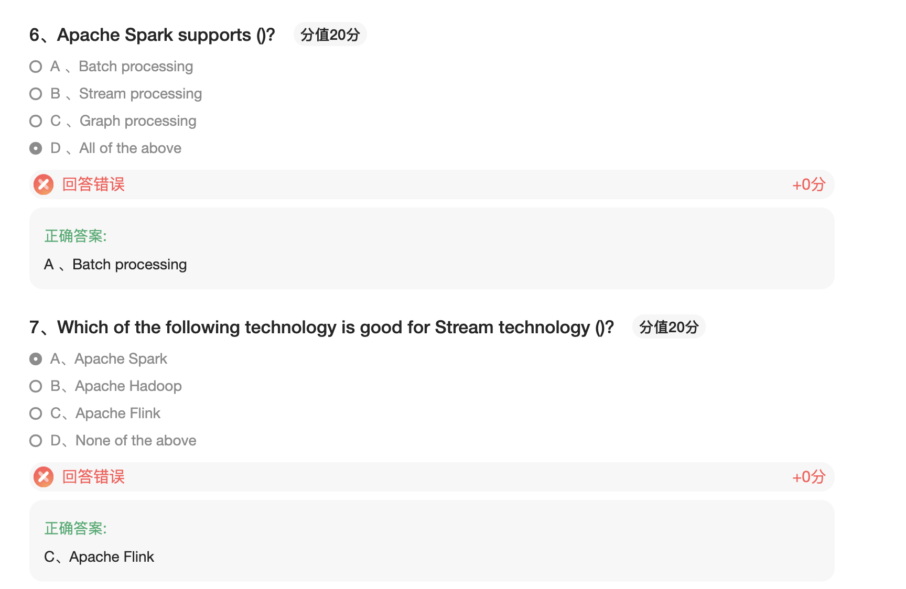

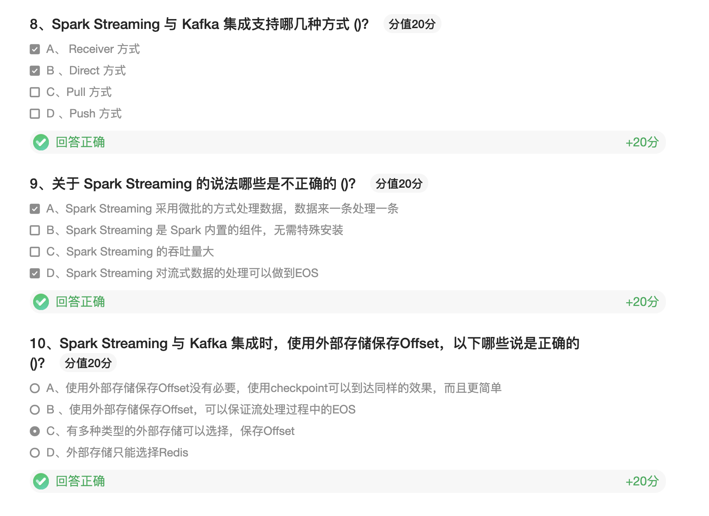