## Spark原理及源码

Spark 原理主要包括 :

* 核心组件的运行机制（Master、Worker、SparkContext等）
* 任务调度的原理
* Shuffle原理
* 内存管理
* 数据倾斜管理
* Spark优化

熟练掌握Spark内核原理，能够帮助我们更好地完成Spark应用开发，并能够准确锁定项目运行过程中出现问题的症结所在

### Spark Runtime

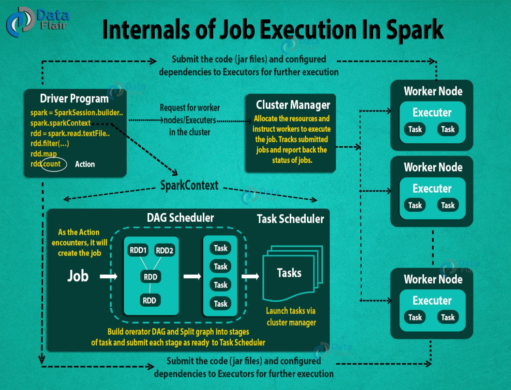

通用的流程:

* Using spark-submit, the user submits an application.

* In spark-submit, we invoke the main() method that the user specifies. It also launches the driver program.

* The driver program asks for the resources to the cluster manager that we need to launch executors.

* The cluster manager launches executors on behalf of the driver program. 
* The driver process runs with the help of user application. Based on the actions and transformation on RDDs, the driver sends work to executors in the form of tasks.

* The executors process the task and the result sends back to the driver through the cluster manager.

#### 核心组件

**Master**（Cluster Manager）：集群中的管理节点，管理集群资源，通知Worker启动Executor或Driver

Worker:集群的工作节点，负责管理本节点的资源，定期向Master汇报心跳，接收Master命令，启动Driver或Executor。

**Driver**：执行Spark应用中的main方法，负责实际代码的执行国内工作，其主要任务：

* 负责向集群申请资源，向master注册信息
* Executor启动后，向Driver反向注册
* 负责作业的解析，生成Stage并调度Task到Executor上
* 监控Task的执行情况，执行完毕后释放资源
* 通知Master注销应用程序

Executor：是一个JVM进程，负责执行具体的Task，Spark启动时，Executor节点被同时启动，并且始终伴随着整个Spark应用的生命周期而存在，如果有Executor节点发生故障或崩溃，会讲出错节点上的任务调度掉其他Executor节点上继续运行，Executor的核心功能：

* 负责运行组成Spark应用的任务，并将结果返回给Driver进程
* 通过自身的Block Manager为应用程序缓存RDD

#### 集群部署模式

Spark支持三种集群管理器，分别是：

* Standalone：独立模式，Spark原生的简单集群管理器，自带完整的服务，可单独部署到一个集群中，无需依赖任何其他资源管理系统，使用Standalone可以很方便的搭建一个集群。
* Hadoop Yarn：统一的资源管理机制，在上面可以运行多套计算框架，如MapReduce、Storm等，根据driver在集群中的位置不同，分为yarn client和yarn cluster
* Apache Mesos：一个强大的分布式资源管理框架，它允许多种不同的框架部署在其上；

Spark的运行模式取决于传递给SparkContext的Master环境变量的值，个别模式还需辅助的程序接口来配合使用，目前支持的Master字符串及URL包括

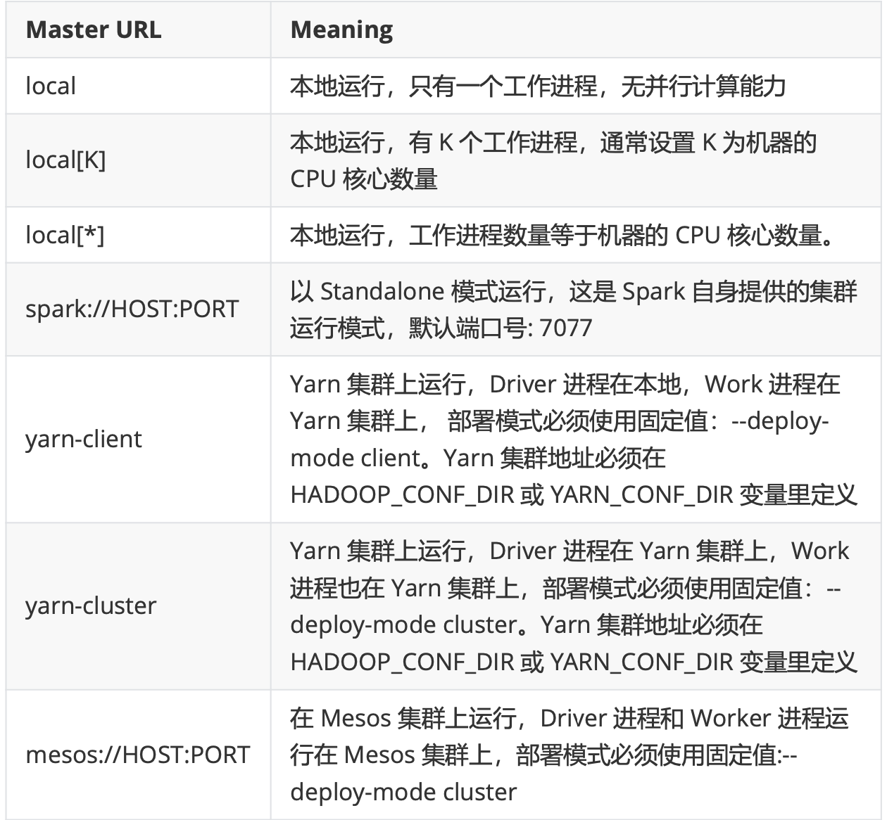

提交任务时，以下参数共同决定了Spark的运行方式

* master Master_URL:决定了Spark任务提交给那种集群处理
* deploy-mode DEPLOY_MODE：决定了Driver的运行方式，可选值为Client（缺省值）或Cluster

#### Yarn模式运行机制

###### Yarn Cluster模式（生产）

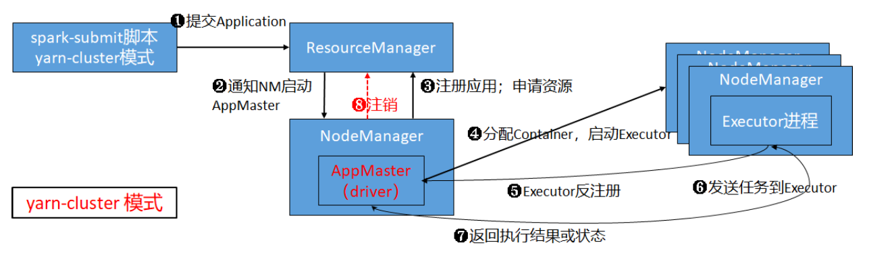

* Client 向 RM（ResourceManager）提交请求，并上传jar到HDFS上
* RM在集群中选择一个NodeManager，在NM上启动启动AppMaster，在AppMaster上实例化SparkContext（Driver）
* AppMaster向RM注册，注册应用程序的目的是申请资源。RM监控App的运行状态，直到结束
* AppMaster申请到资源后，与NM通信，在Container中启动Executor进程
* Executor向Driver注册，申请任务
* Driver对应用进行解析，最后将Task发送到Executor上
* Execuotr中执行Task，并将执行结果或状态汇报给Driver
* 应用执行完毕后，AppMaster通知RM注销应用，回收资源


###### Yarn Client 模式（调试）

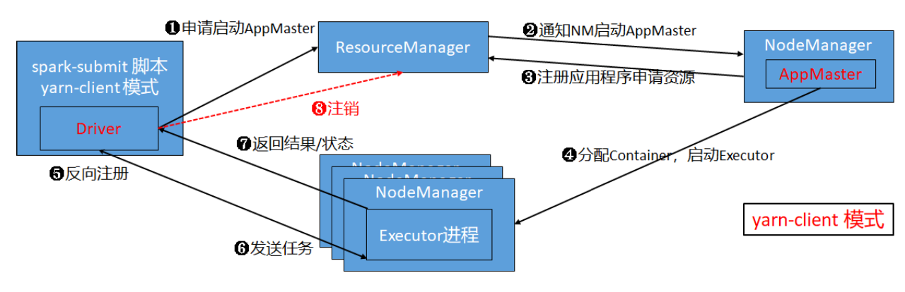

* 启动应用程序，实例化SparkContext，向RM申请启动AppMaster
* RM在集群中选择一个NodeManager，在NM上启动启动AppMaster
* AppMaster向RM注册应用程序，注册的目的是申请资源，RM监控App的运行状态直到结束
* AppMaster申请到资源后，与NM通信，在Container中启动Executor进程
* Executor向Driver注册，申请任务
* Driver对应用进行解析，最后将Task发送到Executor上
* Executor中执行Task，并将执行结果或状态汇报给Driver
* 应用执行完毕后，AppMaster通知RM注销应用，回收资源

###### Client模式和Cluster模式的区别

client模式：

* Driver运行在客户端
* 适用于调试，能直接看见各种日志
* 如果链接断掉，任务执行失败，直接挂了

cluster模式

* Driver 运行在 AppMaster中（运行在集群中）
* 适用于生产，日志需要登陆到节点，才能看见
* 如果链接断了，只要任务提交了，任务就不受影响。

### Master & Worker 解析

#### Spark RPC框架

RPC(Remote Procedure Call) 远程调用过程，两台服务器A、B，A服务器上的应用，想要调用B服务器上的应用提供的函数/方法，由于不再一个内存空间，不能直接调用，需要通过网络来表达调用的语义和传导调用的数据

* RPC接口，让使用者调用远程请求时，就像调用本地函数
* 序列化、反序列化
* 网络传输

如果把分布式系统（Hadoop、Spark等）比作一个人，那么RPC可以认为是人体的血液循环系统，他将系统中各个不同的组件联系起来，在Spark中，不同组件之间的通讯、jar的上传、Shuffle数据的传输、Block数据的复制与备份都是基于RPC来实现的，所以说，RPC是分布式系统的基石毫不为过

在Spark2.x之前，RPC框架是借助Akka来实现的，Akka是非常优秀的开源分布式框架，弃用Akka，主要是解决用户的Spark Application中Akka版本和Spark 内置的Akka版本冲突的问题

Spark2.x的RPC框架是基于优秀的网络通信框架Netty开发的，Spark RPC借鉴了Akka中的设计，他是基于Actor模型，各个组件可以认为是一个个独立的实体，各个实体之间通过消息来进行通信。具体各个组件之间的关系图如下

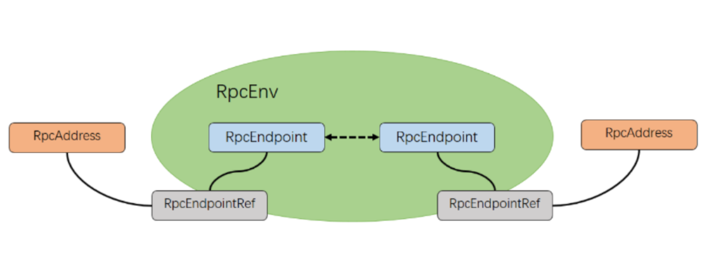

###### RpcEnv

RpcEnv是RPC的环境对象，管理着整个RpcEndPoint的生命周期，其主要功能有：根据name或者uri注册endpoints、管理各种消息的处理、停止endpoints。其中RpcEnv只能通过RpcEnvFactory创建得到。RpcEnv中的核心方法：

```scala
// RpcEndpoint 向 RpcEnv 注册
def setupEndpoint(name: String, endpoint: RpcEndpoint): RpcEndpointRef
// 根据参数信息，从 RpcEnv 中获得一个远程的RpcEndpoint
def setupEndpointRef(address: RpcAddress, endpointName: String): RpcEndpointRef
```

###### RpcEndPoint

RpcEndPoint：表示一个消息通信体，可以接收、发送、处理消息。

RpcEndpoint的生命周期为：constructor -> onStart -> receive* -> onStop,其中

* onStart在接受任务消息前调用主要用来执行初始化
* Receive和receiveAndReply分别用来接收RpcEndpoint send和ask过来的消息
  * receive方法，接收有RpcEndPointRef.send 方法发送的消息，该类消息不需要进行响应消息（Reply），而只是在RpcEndpoint端进行处理
  * receiveAndReply方法，接收有RpcEndpoint.ask发送过来的消息，RpcEndPoint端处理完消息后，需要给调用RpcEndPointRdf.ask的通信端响应消息
* send发送的消息不需要立即处理，ask发送的消息需要立即处理

```scala
/*
 * Licensed to the Apache Software Foundation (ASF) under one or more
 * contributor license agreements.  See the NOTICE file distributed with
 * this work for additional information regarding copyright ownership.
 * The ASF licenses this file to You under the Apache License, Version 2.0
 * (the "License"); you may not use this file except in compliance with
 * the License.  You may obtain a copy of the License at
 *
 *    http://www.apache.org/licenses/LICENSE-2.0
 *
 * Unless required by applicable law or agreed to in writing, software
 * distributed under the License is distributed on an "AS IS" BASIS,
 * WITHOUT WARRANTIES OR CONDITIONS OF ANY KIND, either express or implied.
 * See the License for the specific language governing permissions and
 * limitations under the License.
 */

package org.apache.spark.rpc

import org.apache.spark.SparkException

/**
 * A factory class to create the [[RpcEnv]]. It must have an empty constructor so that it can be
 * created using Reflection.
 */
private[spark] trait RpcEnvFactory {

  def create(config: RpcEnvConfig): RpcEnv
}

/**
 * An end point for the RPC that defines what functions to trigger given a message.
 *
 * It is guaranteed that `onStart`, `receive` and `onStop` will be called in sequence.
 *
 * The life-cycle of an endpoint is:
 *
 * {@code constructor -> onStart -> receive* -> onStop}
 *
 * Note: `receive` can be called concurrently. If you want `receive` to be thread-safe, please use
 * [[ThreadSafeRpcEndpoint]]
 *
 * If any error is thrown from one of [[RpcEndpoint]] methods except `onError`, `onError` will be
 * invoked with the cause. If `onError` throws an error, [[RpcEnv]] will ignore it.
 */
private[spark] trait RpcEndpoint {

  /**
   * The [[RpcEnv]] that this [[RpcEndpoint]] is registered to.
   * 当前RpcEndpoint所注册的[RpcEnv]
   */
  val rpcEnv: RpcEnv

  /**
   * The [[RpcEndpointRef]] of this [[RpcEndpoint]]. `self` will become valid when `onStart` is
   * called. And `self` will become `null` when `onStop` is called.
   *
   * Note: Because before `onStart`, [[RpcEndpoint]] has not yet been registered and there is not
   * valid [[RpcEndpointRef]] for it. So don't call `self` before `onStart` is called.
   * 当前[[RpcEndpoint]]的代理，当`onStart`方法被调用时`self`生效，当`onStop`被调用时，`self`变成null
	 * 注意:在`onStart`方法被调用之前，[[RpcEndpoint]]对象还未进行注册，所以就没有有效的[[RpcEndpointRef]]
   */
  final def self: RpcEndpointRef = {
    require(rpcEnv != null, "rpcEnv has not been initialized")
    rpcEnv.endpointRef(this)
  }

  /**
   * Process messages from `RpcEndpointRef.send` or `RpcCallContext.reply`. If receiving a
   * unmatched message, `SparkException` will be thrown and sent to `onError`.
   * 用于处理从`RpcEndpointRef.send` 或 `RpcCallContext.reply`接收到的消息。
	 * 如果接收到一个不匹配的消息，将会抛出SparkException异常，并发送给`onError`
   * 通过上面的receive方法，接收由RpcEndpointRef.send方法发送的消息，
   * 该类消息不需要进行响应消息(Reply)，而只是在RpcEndpoint端进行处理
   */
  def receive: PartialFunction[Any, Unit] = {
    case _ => throw new SparkException(self + " does not implement 'receive'")
  }

  /**
   * Process messages from `RpcEndpointRef.ask`. If receiving a unmatched message,
   * `SparkException` will be thrown and sent to `onError`.
   *  处理来自`RpcEndpointRef.ask`的消息，RpcEndpoint端处理完消息后，需要给调用RpcEndpointRef.ask的通信端返回响应消息
   */
  def receiveAndReply(context: RpcCallContext): PartialFunction[Any, Unit] = {
    case _ => context.sendFailure(new SparkException(self + " won't reply anything"))
  }

  /**
   * Invoked when any exception is thrown during handling messages.
   * 在处理消息期间出现异常的话将被调用
   */
  def onError(cause: Throwable): Unit = {
    // By default, throw e and let RpcEnv handle it
    throw cause
  }

  /**
   * Invoked when `remoteAddress` is connected to the current node.
   * 当有远端连接到当前服务器时会被调用
   */
  def onConnected(remoteAddress: RpcAddress): Unit = {
    // By default, do nothing.
  }

  /**
   * Invoked when `remoteAddress` is lost.
   * 当远端与当前服务器断开时，该方法会被调用
   */
  def onDisconnected(remoteAddress: RpcAddress): Unit = {
    // By default, do nothing.
  }

  /**
   * Invoked when some network error happens in the connection between the current node and
   * `remoteAddress`.
   * 当前节点与远端之间的连接发生错误时，该方法将会被调用
   */
  def onNetworkError(cause: Throwable, remoteAddress: RpcAddress): Unit = {
    // By default, do nothing.
  }

  /**
   * Invoked before [[RpcEndpoint]] starts to handle any message.
   * 在 [[RpcEndpoint]] 开始处理消息之前被调用
   */
  def onStart(): Unit = {
    // By default, do nothing.
  }

  /**
   * Invoked when [[RpcEndpoint]] is stopping. `self` will be `null` in this method and you cannot
   * use it to send or ask messages.
   * 当[[RpcEndpoint]]正在停止时，该方法将会被调用
   * `self`将会在该方法中被置位null，因此你不能使用它来发送消息
   */
  def onStop(): Unit = {
    // By default, do nothing.
  }

  /**
   * A convenient method to stop [[RpcEndpoint]].
   */
  final def stop(): Unit = {
    val _self = self
    if (_self != null) {
      rpcEnv.stop(_self)
    }
  }
}

/**
 * A trait that requires RpcEnv thread-safely sending messages to it.
 *
 * Thread-safety means processing of one message happens before processing of the next message by
 * the same [[ThreadSafeRpcEndpoint]]. In the other words, changes to internal fields of a
 * [[ThreadSafeRpcEndpoint]] are visible when processing the next message, and fields in the
 * [[ThreadSafeRpcEndpoint]] need not be volatile or equivalent.
 *
 * However, there is no guarantee that the same thread will be executing the same
 * [[ThreadSafeRpcEndpoint]] for different messages.
 */
private[spark] trait ThreadSafeRpcEndpoint extends RpcEndpoint

```

###### RpcEndPointRef

RpcEndpointRef 是对远程RpcEndPoint的一个引用，当需要向一个具体的RpcEndPoint发送消息时，需要获取改RpcEndPoint的引用，然后通过该引用发送消息

* send方法发送消息后不等待响应，立即Send-and-forget
* ask方法发送消息后，需要等待通信对端给予响应，通过Future来异步获取响应结果

```scala
/*
 * Licensed to the Apache Software Foundation (ASF) under one or more
 * contributor license agreements.  See the NOTICE file distributed with
 * this work for additional information regarding copyright ownership.
 * The ASF licenses this file to You under the Apache License, Version 2.0
 * (the "License"); you may not use this file except in compliance with
 * the License.  You may obtain a copy of the License at
 *
 *    http://www.apache.org/licenses/LICENSE-2.0
 *
 * Unless required by applicable law or agreed to in writing, software
 * distributed under the License is distributed on an "AS IS" BASIS,
 * WITHOUT WARRANTIES OR CONDITIONS OF ANY KIND, either express or implied.
 * See the License for the specific language governing permissions and
 * limitations under the License.
 */

package org.apache.spark.rpc

import scala.concurrent.Future
import scala.reflect.ClassTag

import org.apache.spark.{SparkConf, SparkException}
import org.apache.spark.internal.Logging
import org.apache.spark.util.RpcUtils

/**
 * A reference for a remote [[RpcEndpoint]]. [[RpcEndpointRef]] is thread-safe.
 */
private[spark] abstract class RpcEndpointRef(conf: SparkConf)
  extends Serializable with Logging {

  private[this] val maxRetries = RpcUtils.numRetries(conf)
  private[this] val retryWaitMs = RpcUtils.retryWaitMs(conf)
  private[this] val defaultAskTimeout = RpcUtils.askRpcTimeout(conf)

  /**
   * return the address for the [[RpcEndpointRef]]
   * 返回[RpcEndpointRef]]的引用的远端服务器地址
   */
  def address: RpcAddress

  def name: String

  /**
   * Sends a one-way asynchronous message. Fire-and-forget semantics.
   * 发送一条单向的异步消息，并且发送消息后不等待响应，亦即Send-and-forget
   */
  def send(message: Any): Unit

  /**
   * Send a message to the corresponding [[RpcEndpoint.receiveAndReply)]] and return a [[Future]] to
   * receive the reply within the specified timeout.
   *
   * This method only sends the message once and never retries.
   * 发送消息给相关的[[RpcEndpoint.receiveAndReply]]，并且返回一个Future，能够在timeout时间内接收回复
   * 该方法只会发送一次消息，失败后不重试
   * 而ask方法发送消息后需要等待通信对端给予响应，通过Future来异步获取响应结果
   */
  def ask[T: ClassTag](message: Any, timeout: RpcTimeout): Future[T]

  /**
   * Send a message to the corresponding [[RpcEndpoint.receiveAndReply)]] and return a [[Future]] to
   * receive the reply within a default timeout.
   *
   * This method only sends the message once and never retries.
    * 发送消息给相关的[[RpcEndpoint.receiveAndReply]]，并且返回一个Future，能够在defaultAskTimeout时间内接收回复
   * 该方法只会发送一次消息，失败后不重试
   * 而ask方法发送消息后需要等待通信对端给予响应，通过Future来异步获取响应结果
   */
  def ask[T: ClassTag](message: Any): Future[T] = ask(message, defaultAskTimeout)

  /**
   * Send a message to the corresponding [[RpcEndpoint.receiveAndReply]] and get its result within a
   * default timeout, throw an exception if this fails.
   *
   * Note: this is a blocking action which may cost a lot of time,  so don't call it in a message
   * loop of [[RpcEndpoint]].

   * @param message the message to send
   * @tparam T type of the reply message
   * @return the reply message from the corresponding [[RpcEndpoint]]
   * 发送消息给相关的[[RpcEndpoint.receiveAndReply)]]，并且返回一个Future，能够在defaultAskTimeout时间内接收回复，如果超时则抛出异常 
   * 注意:该方法会阻塞当前线程
   */
  def askSync[T: ClassTag](message: Any): T = askSync(message, defaultAskTimeout)

  /**
   * Send a message to the corresponding [[RpcEndpoint.receiveAndReply]] and get its result within a
   * specified timeout, throw an exception if this fails.
   *
   * Note: this is a blocking action which may cost a lot of time, so don't call it in a message
   * loop of [[RpcEndpoint]].
   * 发送消息给相关的[[RpcEndpoint.receiveAndReply)]]，并且返回一个Future，能够在timeout时间内接收回复，如果超时则抛出异常
	 * 注意:该方法会阻塞当前线程
   *
   * @param message the message to send 发送的消息内容
   * @param timeout the timeout duration 超时时长
   * @tparam T type of the reply message 响应消息的类型
   * @return the reply message from the corresponding [[RpcEndpoint]] 从[[RpcEndpoint]]端响应的消息内容
   */
  def askSync[T: ClassTag](message: Any, timeout: RpcTimeout): T = {
    val future = ask[T](message, timeout)
    timeout.awaitResult(future)
  }
}
```

###### 其他组件

* Dispatcher，消息分发器，针对RpcEndpoint发送/接收到的消息，分发至对应的指令收件箱/发件箱。如果指令接收方是自己，则存入自己的收件箱，如果指令的接收方为非自身端点，则放入发件箱
* Inbox，指令消息发件箱，一个本地端点对应一个收件箱，Dispatcher在每次向Inbox存入消息时，将对应的EndpointData加入内部待Receiver Queue中，另外Dispatcher创建时会启动一个单独线程进行轮询Receiver Queue ，进行收件箱消息消费
* OutBox，指令消息发件箱。一个远程端点对应一个发件箱，当消息放入Outbox后，紧接着将消息通过TransportClient发送出去
* TransportClient，Netty通信客户端。根据OutBox消息的Receiver消息，请求对应远程TransportServer
* TransportServer，Netty通信服务端。一个RPC端点一个TransportServer，接收远程消息后调用Dispatcher分发消息至对应收发件箱

#### Master 启动流程

Master是RpcEndpoint，实现了RpcEndpoint接口，Master生命周期遵循constructir -> onStart -> receive*->onStop 的步骤，Master 的onStart方法中最重要的事情是：执行恢复

Master HA实现方式：

* Zookeeper。基于Zookeeper的Active/Standby模式。适用于生产模式，其基本原理是通过Zookeeper来选举一个Master。其他的Master处于StrandBy状态
* FileSystem。基于文件系统的单点恢复，主要用于开发或测试环境。为Spark提供目录保持Spark Application 和worker 的注册信息，一旦Master发生故障， 可通过重新启动Master进程（start-master.sh），恢复已运行的Spark Application 和 Worker注册信息
* Custom。允许用户自定义HA的实现，对于高级用户特别有用
* _。默认请求，未配置HA，不会持久化集群的数据，Master启动立即管理集群

```scala
package org.apache.spark.deploy.master

private[deploy] class Master(
    override val rpcEnv: RpcEnv,
    address: RpcAddress,
    webUiPort: Int,
    val securityMgr: SecurityManager,
    val conf: SparkConf)
  extends ThreadSafeRpcEndpoint with Logging with LeaderElectable {

  private val forwardMessageThread =
    ThreadUtils.newDaemonSingleThreadScheduledExecutor("master-forward-message-thread")
	//给Hadoop添加一些配置
  private val hadoopConf = SparkHadoopUtil.get.newConfiguration(conf)

  // For application IDs，为了生成application的ID做的时间格式化
  private def createDateFormat = new SimpleDateFormat("yyyyMMddHHmmss", Locale.US)

  private val WORKER_TIMEOUT_MS = conf.getLong("spark.worker.timeout", 60) * 1000
  private val RETAINED_APPLICATIONS = conf.getInt("spark.deploy.retainedApplications", 200)
  private val RETAINED_DRIVERS = conf.getInt("spark.deploy.retainedDrivers", 200)
  private val REAPER_ITERATIONS = conf.getInt("spark.dead.worker.persistence", 15)
  //如果想利用Spark本身实现选举和故障恢复，可以设置Spark.deploy.recoveryMode为FileSystem
  //两种：Zookeeper和FileSystem
  //Zookeeper：需要设置属性spark.deploy.zookeeper.url => zookeeper 集群地址
  // spark.deploy.zookeeper.dir -> spark在zookeeper集群上面注册节点的路径
  // FileSystem：文件系统故障恢复模式
  //spark.deploy.recoveryMode => FileSystem
  // spark.deploy.recoveryDirectory -> 存储Spark的Master节点的相关信息，以便于故障恢复使用，此种模式可以结合NFS等共享文件系统
  // 可以在当前Master进程挂掉时候，在另外一个节点启动Master继续提供服务
  private val RECOVERY_MODE = conf.get("spark.deploy.recoveryMode", "NONE")
  private val MAX_EXECUTOR_RETRIES = conf.getInt("spark.deploy.maxExecutorRetries", 10)
	// worker的信息
  val workers = new HashSet[WorkerInfo]
  val idToApp = new HashMap[String, ApplicationInfo]
  private val waitingApps = new ArrayBuffer[ApplicationInfo]
  val apps = new HashSet[ApplicationInfo]
	//workerId与Worker的对应关系
  private val idToWorker = new HashMap[String, WorkerInfo]
  private val addressToWorker = new HashMap[RpcAddress, WorkerInfo]

  private val endpointToApp = new HashMap[RpcEndpointRef, ApplicationInfo]
  private val addressToApp = new HashMap[RpcAddress, ApplicationInfo]
  private val completedApps = new ArrayBuffer[ApplicationInfo]
  private var nextAppNumber = 0

  private val drivers = new HashSet[DriverInfo]
  private val completedDrivers = new ArrayBuffer[DriverInfo]
  // Drivers currently spooled for scheduling
  private val waitingDrivers = new ArrayBuffer[DriverInfo]
  private var nextDriverNumber = 0

  Utils.checkHost(address.host)
	//Spark 测量系统 MetricsSystem
  //Spark 测量系统，有指定的instrance创建，由source、sink组成，周期性地从source获取指标，然后发送到sink，其中instance、source、sink概念如下“
  //Instance：指定了谁在使用测量系统，在Spark中有一些列例如master、worker、executor、client、driver这些角色，这些角色创建测量系统用于监控Spark状态，目前在Spark中已经实现的角色包括msater、worker、executor、driver、applications
  // soucre：指定了从哪里手机测量数据。在Spark测量系统中有两种来源：
  // Spark内部指标，比如MasterSource、WorkerSource等，这些源将会收集Soark组件的内部状态
  // 普通指标，比如JvmSource，通过配置文件进行配置
  //Sink：指定了往哪里输出测量数据
  private val masterMetricsSystem = MetricsSystem.createMetricsSystem("master", conf, securityMgr)
  // 应用程序的监测系统
  private val applicationMetricsSystem = MetricsSystem.createMetricsSystem("applications", conf,
    securityMgr)
  private val masterSource = new MasterSource(this)

  // After onStart, webUi will be set
  private var webUi: MasterWebUI = null

  private val masterPublicAddress = {
    val envVar = conf.getenv("SPARK_PUBLIC_DNS")
    if (envVar != null) envVar else address.host
  }

  private val masterUrl = address.toSparkURL
  private var masterWebUiUrl: String = _

  private var state = RecoveryState.STANDBY
  // 持久化引擎，主要处理Master节点/worker节点新创建、移除的时候，持久化一些状态，用于故障恢复
  private var persistenceEngine: PersistenceEngine = _
  //选举代理人的主要接口（特质）
  private var leaderElectionAgent: LeaderElectionAgent = _

  private var recoveryCompletionTask: ScheduledFuture[_] = _

  private var checkForWorkerTimeOutTask: ScheduledFuture[_] = _

  // As a temporary workaround before better ways of configuring memory, we allow users to set
  // a flag that will perform round-robin scheduling across the nodes (spreading out each app
  // among all the nodes) instead of trying to consolidate each app onto a small # of nodes.
  private val spreadOutApps = conf.getBoolean("spark.deploy.spreadOut", true)

  // Default maxCores for applications that don't specify it (i.e. pass Int.MaxValue)
  // Spark默认部署的Sprak.deploy.defaultCores core核数
  private val defaultCores = conf.getInt("spark.deploy.defaultCores", Int.MaxValue)
  val reverseProxy = conf.getBoolean("spark.ui.reverseProxy", false)
  if (defaultCores < 1) {
    throw new SparkException("spark.deploy.defaultCores must be positive")
  }

  // Alternative application submission gateway that is stable across Spark versions
  private val restServerEnabled = conf.getBoolean("spark.master.rest.enabled", false)
  private var restServer: Option[StandaloneRestServer] = None
  private var restServerBoundPort: Option[Int] = None

  {
    val authKey = SecurityManager.SPARK_AUTH_SECRET_CONF
    require(conf.getOption(authKey).isEmpty || !restServerEnabled,
      s"The RestSubmissionServer does not support authentication via ${authKey}.  Either turn " +
        "off the RestSubmissionServer with spark.master.rest.enabled=false, or do not use " +
        "authentication.")
  }

  override def onStart(): Unit = {
    logInfo("Starting Spark master at " + masterUrl)
    logInfo(s"Running Spark version ${org.apache.spark.SPARK_VERSION}")
    //床架MasterUI
    webUi = new MasterWebUI(this, webUiPort)
    webUi.bind()
    masterWebUiUrl = "http://" + masterPublicAddress + ":" + webUi.boundPort
    if (reverseProxy) {
      masterWebUiUrl = conf.get("spark.ui.reverseProxyUrl", masterWebUiUrl)
      webUi.addProxy()
      logInfo(s"Spark Master is acting as a reverse proxy. Master, Workers and " +
       s"Applications UIs are available at $masterWebUiUrl")
    }
    //定时任务，WORKER_TIMEOUT_MS=60，每60秒执行一次任务，检查worker节点是否超时
    checkForWorkerTimeOutTask = forwardMessageThread.scheduleAtFixedRate(new Runnable {
      override def run(): Unit = Utils.tryLogNonFatalError {
        //self是endpointRef，定时发送MasterEndpoint的CheckForWorkerTimeOut信息
        //主要是检查、移除超时没有发送心跳的worker节点
        self.send(CheckForWorkerTimeOut)
      }
    }, 0, WORKER_TIMEOUT_MS, TimeUnit.MILLISECONDS)
    //默认为true
    if (restServerEnabled) {
      val port = conf.getInt("spark.master.rest.port", 6066)
      restServer = Some(new StandaloneRestServer(address.host, port, conf, self, masterUrl))
    }
    restServerBoundPort = restServer.map(_.start())
	  //主节点注册资源，格式如：<app ID>.<executor ID (or "driver")>.<source name>.
    masterMetricsSystem.registerSource(masterSource)
    //启动主节点的MetricsSystem，只能启动一次
    masterMetricsSystem.start()
    //启动应用程序的检测系统
    applicationMetricsSystem.start()
    // Attach the master and app metrics servlet handler to the web ui after the metrics systems are
    // started.
    masterMetricsSystem.getServletHandlers.foreach(webUi.attachHandler)
    applicationMetricsSystem.getServletHandlers.foreach(webUi.attachHandler)

    //以上都是启动master和app的元数据统计系统
    
    //Java的序列化狂减
    val serializer = new JavaSerializer(conf)
    //持久化引擎，主要是处理Master节点、worker节点新创建、移除的时候，持久化一些状态，用于故障恢复
    val (persistenceEngine_, leaderElectionAgent_) = RECOVERY_MODE match {
      case "ZOOKEEPER" =>
        logInfo("Persisting recovery state to ZooKeeper")
        val zkFactory =
          new ZooKeeperRecoveryModeFactory(conf, serializer)
        (zkFactory.createPersistenceEngine(), zkFactory.createLeaderElectionAgent(this))
      case "FILESYSTEM" =>
        val fsFactory =
          new FileSystemRecoveryModeFactory(conf, serializer)
        (fsFactory.createPersistenceEngine(), fsFactory.createLeaderElectionAgent(this))
      case "CUSTOM" =>
        val clazz = Utils.classForName(conf.get("spark.deploy.recoveryMode.factory"))
        val factory = clazz.getConstructor(classOf[SparkConf], classOf[Serializer])
          .newInstance(conf, serializer)
          .asInstanceOf[StandaloneRecoveryModeFactory]
        (factory.createPersistenceEngine(), factory.createLeaderElectionAgent(this))
      case _ =>
        (new BlackHolePersistenceEngine(), new MonarchyLeaderAgent(this))
    }
    persistenceEngine = persistenceEngine_
    //主要通过利用Curator框架进行主备切换，leaderElectionAgent 在ZookeeperLeaderElectionAgent类中
    leaderElectionAgent = leaderElectionAgent_
  }

  override def onStop() {
    masterMetricsSystem.report()
    applicationMetricsSystem.report()
    // prevent the CompleteRecovery message sending to restarted master
    if (recoveryCompletionTask != null) {
      recoveryCompletionTask.cancel(true)
    }
    if (checkForWorkerTimeOutTask != null) {
      checkForWorkerTimeOutTask.cancel(true)
    }
    forwardMessageThread.shutdownNow()
    webUi.stop()
    restServer.foreach(_.stop())
    masterMetricsSystem.stop()
    applicationMetricsSystem.stop()
    persistenceEngine.close()
    leaderElectionAgent.stop()
  }

  override def electedLeader() {
    self.send(ElectedLeader)
  }

  override def revokedLeadership() {
    self.send(RevokedLeadership)
  }

  // Master的消息吹了
  // Master接收到ElectedLeader消息后会进行选举操作，由local-cluster模式只有一个Master，所以PersistenceEngine没有持久化的APP，Driver、Worker的信息，所以当前Master即为激活（Alive）状态。这里涉及到Master故障恢复
  override def receive: PartialFunction[Any, Unit] = {
    case ElectedLeader =>
      val (storedApps, storedDrivers, storedWorkers) = persistenceEngine.readPersistedData(rpcEnv)
      state = if (storedApps.isEmpty && storedDrivers.isEmpty && storedWorkers.isEmpty) {
        RecoveryState.ALIVE
      } else {
        RecoveryState.RECOVERING
      }
      logInfo("I have been elected leader! New state: " + state)
      if (state == RecoveryState.RECOVERING) {
        beginRecovery(storedApps, storedDrivers, storedWorkers)
        recoveryCompletionTask = forwardMessageThread.schedule(new Runnable {
          override def run(): Unit = Utils.tryLogNonFatalError {
            self.send(CompleteRecovery)
          }
        }, WORKER_TIMEOUT_MS, TimeUnit.MILLISECONDS)
      }

    case CompleteRecovery => completeRecovery()

    case RevokedLeadership =>
      logError("Leadership has been revoked -- master shutting down.")
      System.exit(0)

    //等待Worker注册上来
    //Master收到RegisterWorker消息后的处理步骤
    //1.创建WorkerInfo
    //2.注册WorkerInfo
    //3.向worker发送RegisteredWorker消息，表示注册完成
    //4.调用Schedule方法进行资源调度
    case RegisterWorker(
      id, workerHost, workerPort, workerRef, cores, memory, workerWebUiUrl, masterAddress) =>
      logInfo("Registering worker %s:%d with %d cores, %s RAM".format(
        workerHost, workerPort, cores, Utils.megabytesToString(memory)))
    	//如果该Master不是active，不做任何操作，返回
      //如果注册过该worker id，向sender返回错误
    	//worker节点正在恢复中
      if (state == RecoveryState.STANDBY) {
        //workerRef.send()==>RpcEndpointRef.send()===>NettyRpcEnv.send()
        workerRef.send(MasterInStandby)
      } else if (idToWorker.contains(id)) {
        //worker 的 Id重复
        workerRef.send(RegisterWorkerFailed("Duplicate worker ID"))
        // 节点不在恢复中
      } else {
        val worker = new WorkerInfo(id, workerHost, workerPort, cores, memory,
          workerRef, workerWebUiUrl)
        //registerWorker(worker)：注册WorkerInfo，其实就是将其添加到workers：HashSet[WorkerInfo]中，并且更新worker id与 worker以及worker address与 worker的映射关系
        if (registerWorker(worker)) {
          //如果worker节点注册成功，就持久化worker节点的相关信息，为了以后恢复
          persistenceEngine.addWorker(worker)
          //由worker.handleRegisterResponse(msg: RegisterWorkerResponse)方法去处理，
          workerRef.send(RegisteredWorker(self, masterWebUiUrl, masterAddress))
          schedule()
        } else {
          //如果woker注册失败，就发送消息到sender
          val workerAddress = worker.endpoint.address
          logWarning("Worker registration failed. Attempted to re-register worker at same " +
            "address: " + workerAddress)
          workerRef.send(RegisterWorkerFailed("Attempted to re-register worker at same address: "
            + workerAddress))
        }
      }

    //注册应用程序App
    //如果是standby，那么忽略这个消息;否则注册application;返回结果并且开 始调度
    case RegisterApplication(description, driver) =>
      // TODO Prevent repeated registrations from some driver
      //若之前注册过
      if (state == RecoveryState.STANDBY) {
        // ignore, don't send response
        //StandBy的master会忽略注册消息。如果AppClient发送请求道 Standby的master
        // 会触发超时机制(默认是20秒)，超时会重试
      } else {
        logInfo("Registering app " + description.name)
        //创建app
        //创建App应用程序 包括创建时间 appID ，描述，驱动driver,默认的 cores(defaultCores)
        val app = createApplication(description, driver)
        //保存Application相关信息，主要是保存到waitingApps列表中，供待会调用
        registerApplication(app)
        logInfo("Registered app " + description.name + " with ID " + app.id)
        // 将此App的信息持久化到ZK中
        persistenceEngine.addApplication(app)
        // 调度driver和app
        driver.send(RegisteredApplication(app.id, self))
        schedule()
      }

    case ExecutorStateChanged(appId, execId, state, message, exitStatus) =>
      val execOption = idToApp.get(appId).flatMap(app => app.executors.get(execId))
      execOption match {
        case Some(exec) =>
          val appInfo = idToApp(appId)
          val oldState = exec.state
          exec.state = state

          if (state == ExecutorState.RUNNING) {
            assert(oldState == ExecutorState.LAUNCHING,
              s"executor $execId state transfer from $oldState to RUNNING is illegal")
            appInfo.resetRetryCount()
          }

          exec.application.driver.send(ExecutorUpdated(execId, state, message, exitStatus, false))

          if (ExecutorState.isFinished(state)) {
            // Remove this executor from the worker and app
            logInfo(s"Removing executor ${exec.fullId} because it is $state")
            // If an application has already finished, preserve its
            // state to display its information properly on the UI
            if (!appInfo.isFinished) {
              appInfo.removeExecutor(exec)
            }
            exec.worker.removeExecutor(exec)

            val normalExit = exitStatus == Some(0)
            // Only retry certain number of times so we don't go into an infinite loop.
            // Important note: this code path is not exercised by tests, so be very careful when
            // changing this `if` condition.
            if (!normalExit
                && appInfo.incrementRetryCount() >= MAX_EXECUTOR_RETRIES
                && MAX_EXECUTOR_RETRIES >= 0) { // < 0 disables this application-killing path
              val execs = appInfo.executors.values
              if (!execs.exists(_.state == ExecutorState.RUNNING)) {
                logError(s"Application ${appInfo.desc.name} with ID ${appInfo.id} failed " +
                  s"${appInfo.retryCount} times; removing it")
                removeApplication(appInfo, ApplicationState.FAILED)
              }
            }
          }
          schedule()
        case None =>
          logWarning(s"Got status update for unknown executor $appId/$execId")
      }

    case DriverStateChanged(driverId, state, exception) =>
      state match {
        case DriverState.ERROR | DriverState.FINISHED | DriverState.KILLED | DriverState.FAILED =>
          removeDriver(driverId, state, exception)
        case _ =>
          throw new Exception(s"Received unexpected state update for driver $driverId: $state")
      }

    case Heartbeat(workerId, worker) =>
      idToWorker.get(workerId) match {
        // 如果worker节点心跳来了
        case Some(workerInfo) =>
        // 记录worker节点的最后心跳时间
          workerInfo.lastHeartbeat = System.currentTimeMillis()
        case None =>
          if (workers.map(_.id).contains(workerId)) {
            logWarning(s"Got heartbeat from unregistered worker $workerId." +
              " Asking it to re-register.")
            worker.send(ReconnectWorker(masterUrl))
          } else {
            logWarning(s"Got heartbeat from unregistered worker $workerId." +
              " This worker was never registered, so ignoring the heartbeat.")
          }
      }
    // 将appId的app的状态置为WAITING，为切换Master做准备。
    case MasterChangeAcknowledged(appId) =>
      idToApp.get(appId) match {
        case Some(app) =>
          logInfo("Application has been re-registered: " + appId)
          app.state = ApplicationState.WAITING
        case None =>
          logWarning("Master change ack from unknown app: " + appId)
      }

      if (canCompleteRecovery) { completeRecovery() }

    //worker节点的调度器状态相应
    //通过workerId查找到worker，那么worker的state置为ALIVE，
		// 并且查找状态为idDefined的executors，并且将这些executors都加入到app中，
    // 然后保存这些app到worker中。可以理解为Worker在Master端的Recovery
    case WorkerSchedulerStateResponse(workerId, executors, driverIds) =>
      idToWorker.get(workerId) match {
        case Some(worker) =>
          logInfo("Worker has been re-registered: " + workerId)
          worker.state = WorkerState.ALIVE

          val validExecutors = executors.filter(exec => idToApp.get(exec.appId).isDefined)
          for (exec <- validExecutors) {
            val app = idToApp.get(exec.appId).get
            val execInfo = app.addExecutor(worker, exec.cores, Some(exec.execId))
            worker.addExecutor(execInfo)
            execInfo.copyState(exec)
          }

          for (driverId <- driverIds) {
            drivers.find(_.id == driverId).foreach { driver =>
              driver.worker = Some(worker)
              driver.state = DriverState.RUNNING
              worker.addDriver(driver)
            }
          }
        case None =>
          logWarning("Scheduler state from unknown worker: " + workerId)
      }

      if (canCompleteRecovery) { completeRecovery() }
		// worker节点的最后状态
    case WorkerLatestState(workerId, executors, driverIds) =>
      idToWorker.get(workerId) match {
        case Some(worker) =>
          for (exec <- executors) {
            val executorMatches = worker.executors.exists {
              case (_, e) => e.application.id == exec.appId && e.id == exec.execId
            }
            if (!executorMatches) {
              // master doesn't recognize this executor. So just tell worker to kill it.
              worker.endpoint.send(KillExecutor(masterUrl, exec.appId, exec.execId))
            }
          }

          for (driverId <- driverIds) {
            val driverMatches = worker.drivers.exists { case (id, _) => id == driverId }
            if (!driverMatches) {
              // master doesn't recognize this driver. So just tell worker to kill it.
              worker.endpoint.send(KillDriver(driverId))
            }
          }
        case None =>
          logWarning("Worker state from unknown worker: " + workerId)
      }
		// 没有注册的应用程序
    case UnregisterApplication(applicationId) =>
      logInfo(s"Received unregister request from application $applicationId")
      idToApp.get(applicationId).foreach(finishApplication)

    case CheckForWorkerTimeOut =>
     //检查 移除 超时没有发送心跳的 worker节点
      timeOutDeadWorkers()

  }

  override def receiveAndReply(context: RpcCallContext): PartialFunction[Any, Unit] = {
    case RequestSubmitDriver(description) =>
      if (state != RecoveryState.ALIVE) {
        val msg = s"${Utils.BACKUP_STANDALONE_MASTER_PREFIX}: $state. " +
          "Can only accept driver submissions in ALIVE state."
        context.reply(SubmitDriverResponse(self, false, None, msg))
      } else {
        logInfo("Driver submitted " + description.command.mainClass)
        val driver = createDriver(description)
        persistenceEngine.addDriver(driver)
        waitingDrivers += driver
        drivers.add(driver)
        schedule()

        // TODO: It might be good to instead have the submission client poll the master to determine
        //       the current status of the driver. For now it's simply "fire and forget".

        context.reply(SubmitDriverResponse(self, true, Some(driver.id),
          s"Driver successfully submitted as ${driver.id}"))
      }
		// 请求杀死driver
    case RequestKillDriver(driverId) =>
      if (state != RecoveryState.ALIVE) {
        val msg = s"${Utils.BACKUP_STANDALONE_MASTER_PREFIX}: $state. " +
          s"Can only kill drivers in ALIVE state."
        context.reply(KillDriverResponse(self, driverId, success = false, msg))
      } else {
        logInfo("Asked to kill driver " + driverId)
        val driver = drivers.find(_.id == driverId)
        driver match {
          case Some(d) =>
            if (waitingDrivers.contains(d)) {
              waitingDrivers -= d
              self.send(DriverStateChanged(driverId, DriverState.KILLED, None))
            } else {
              // We just notify the worker to kill the driver here. The final bookkeeping occurs
              // on the return path when the worker submits a state change back to the master
              // to notify it that the driver was successfully killed.
              d.worker.foreach { w =>
                w.endpoint.send(KillDriver(driverId))
              }
            }
            // TODO: It would be nice for this to be a synchronous response
            val msg = s"Kill request for $driverId submitted"
            logInfo(msg)
            context.reply(KillDriverResponse(self, driverId, success = true, msg))
          case None =>
            val msg = s"Driver $driverId has already finished or does not exist"
            logWarning(msg)
            context.reply(KillDriverResponse(self, driverId, success = false, msg))
        }
      }
		//request driver status
		// 查找请求的driver，如果找到则返回driver的状态
    case RequestDriverStatus(driverId) =>
      if (state != RecoveryState.ALIVE) {
        val msg = s"${Utils.BACKUP_STANDALONE_MASTER_PREFIX}: $state. " +
          "Can only request driver status in ALIVE state."
        context.reply(
          DriverStatusResponse(found = false, None, None, None, Some(new Exception(msg))))
      } else {
        (drivers ++ completedDrivers).find(_.id == driverId) match {
          case Some(driver) =>
            context.reply(DriverStatusResponse(found = true, Some(driver.state),
              driver.worker.map(_.id), driver.worker.map(_.hostPort), driver.exception))
          case None =>
            context.reply(DriverStatusResponse(found = false, None, None, None, None))
        }
      }
		//请求master的状态
    //向sender返回master的状态
    case RequestMasterState =>
      context.reply(MasterStateResponse(
        address.host, address.port, restServerBoundPort,
        workers.toArray, apps.toArray, completedApps.toArray,
        drivers.toArray, completedDrivers.toArray, state))

    case BoundPortsRequest =>
      context.reply(BoundPortsResponse(address.port, webUi.boundPort, restServerBoundPort))

    case RequestExecutors(appId, requestedTotal) =>
      context.reply(handleRequestExecutors(appId, requestedTotal))

    case KillExecutors(appId, executorIds) =>
      val formattedExecutorIds = formatExecutorIds(executorIds)
      context.reply(handleKillExecutors(appId, formattedExecutorIds))
  }
	// 主节点链接失效
  override def onDisconnected(address: RpcAddress): Unit = {
    // The disconnected client could've been either a worker or an app; remove whichever it was
    logInfo(s"$address got disassociated, removing it.")
    addressToWorker.get(address).foreach(removeWorker(_, s"${address} got disassociated"))
    addressToApp.get(address).foreach(finishApplication)
    if (state == RecoveryState.RECOVERING && canCompleteRecovery) { completeRecovery() }
  }

  private def canCompleteRecovery =
    workers.count(_.state == WorkerState.UNKNOWN) == 0 &&
      apps.count(_.state == ApplicationState.UNKNOWN) == 0

  private def beginRecovery(storedApps: Seq[ApplicationInfo], storedDrivers: Seq[DriverInfo],
      storedWorkers: Seq[WorkerInfo]) {
    for (app <- storedApps) {
      logInfo("Trying to recover app: " + app.id)
      try {
        registerApplication(app)
        app.state = ApplicationState.UNKNOWN
        app.driver.send(MasterChanged(self, masterWebUiUrl))
      } catch {
        case e: Exception => logInfo("App " + app.id + " had exception on reconnect")
      }
    }

    for (driver <- storedDrivers) {
      // Here we just read in the list of drivers. Any drivers associated with now-lost workers
      // will be re-launched when we detect that the worker is missing.
      drivers += driver
    }

    for (worker <- storedWorkers) {
      logInfo("Trying to recover worker: " + worker.id)
      try {
        registerWorker(worker)
        worker.state = WorkerState.UNKNOWN
        worker.endpoint.send(MasterChanged(self, masterWebUiUrl))
      } catch {
        case e: Exception => logInfo("Worker " + worker.id + " had exception on reconnect")
      }
    }
  }

  private def completeRecovery() {
    // Ensure "only-once" recovery semantics using a short synchronization period.
    if (state != RecoveryState.RECOVERING) { return }
    state = RecoveryState.COMPLETING_RECOVERY

    // Kill off any workers and apps that didn't respond to us.
    workers.filter(_.state == WorkerState.UNKNOWN).foreach(
      removeWorker(_, "Not responding for recovery"))
    apps.filter(_.state == ApplicationState.UNKNOWN).foreach(finishApplication)

    // Update the state of recovered apps to RUNNING
    apps.filter(_.state == ApplicationState.WAITING).foreach(_.state = ApplicationState.RUNNING)

    // Reschedule drivers which were not claimed by any workers
    drivers.filter(_.worker.isEmpty).foreach { d =>
      logWarning(s"Driver ${d.id} was not found after master recovery")
      if (d.desc.supervise) {
        logWarning(s"Re-launching ${d.id}")
        relaunchDriver(d)
      } else {
        removeDriver(d.id, DriverState.ERROR, None)
        logWarning(s"Did not re-launch ${d.id} because it was not supervised")
      }
    }

    state = RecoveryState.ALIVE
    schedule()
    logInfo("Recovery complete - resuming operations!")
  }

  /**
   * Schedule executors to be launched on the workers.
   * Returns an array containing number of cores assigned to each worker.
   *
   * There are two modes of launching executors. The first attempts to spread out an application's
   * executors on as many workers as possible, while the second does the opposite (i.e. launch them
   * on as few workers as possible). The former is usually better for data locality purposes and is
   * the default.
   *
   * The number of cores assigned to each executor is configurable. When this is explicitly set,
   * multiple executors from the same application may be launched on the same worker if the worker
   * has enough cores and memory. Otherwise, each executor grabs all the cores available on the
   * worker by default, in which case only one executor per application may be launched on each
   * worker during one single schedule iteration.
   * Note that when `spark.executor.cores` is not set, we may still launch multiple executors from
   * the same application on the same worker. Consider appA and appB both have one executor running
   * on worker1, and appA.coresLeft > 0, then appB is finished and release all its cores on worker1,
   * thus for the next schedule iteration, appA launches a new executor that grabs all the free
   * cores on worker1, therefore we get multiple executors from appA running on worker1.
   *
   * It is important to allocate coresPerExecutor on each worker at a time (instead of 1 core
   * at a time). Consider the following example: cluster has 4 workers with 16 cores each.
   * User requests 3 executors (spark.cores.max = 48, spark.executor.cores = 16). If 1 core is
   * allocated at a time, 12 cores from each worker would be assigned to each executor.
   * Since 12 < 16, no executors would launch [SPARK-8881].
   */
  private def scheduleExecutorsOnWorkers(
      app: ApplicationInfo,
      usableWorkers: Array[WorkerInfo],
      spreadOutApps: Boolean): Array[Int] = {
    val coresPerExecutor = app.desc.coresPerExecutor
    val minCoresPerExecutor = coresPerExecutor.getOrElse(1)
    val oneExecutorPerWorker = coresPerExecutor.isEmpty
    val memoryPerExecutor = app.desc.memoryPerExecutorMB
    val numUsable = usableWorkers.length
    val assignedCores = new Array[Int](numUsable) // Number of cores to give to each worker
    val assignedExecutors = new Array[Int](numUsable) // Number of new executors on each worker
    var coresToAssign = math.min(app.coresLeft, usableWorkers.map(_.coresFree).sum)

    /** Return whether the specified worker can launch an executor for this app. */
    def canLaunchExecutor(pos: Int): Boolean = {
      val keepScheduling = coresToAssign >= minCoresPerExecutor
      val enoughCores = usableWorkers(pos).coresFree - assignedCores(pos) >= minCoresPerExecutor

      // If we allow multiple executors per worker, then we can always launch new executors.
      // Otherwise, if there is already an executor on this worker, just give it more cores.
      val launchingNewExecutor = !oneExecutorPerWorker || assignedExecutors(pos) == 0
      if (launchingNewExecutor) {
        val assignedMemory = assignedExecutors(pos) * memoryPerExecutor
        val enoughMemory = usableWorkers(pos).memoryFree - assignedMemory >= memoryPerExecutor
        val underLimit = assignedExecutors.sum + app.executors.size < app.executorLimit
        keepScheduling && enoughCores && enoughMemory && underLimit
      } else {
        // We're adding cores to an existing executor, so no need
        // to check memory and executor limits
        keepScheduling && enoughCores
      }
    }

    // Keep launching executors until no more workers can accommodate any
    // more executors, or if we have reached this application's limits
    var freeWorkers = (0 until numUsable).filter(canLaunchExecutor)
    while (freeWorkers.nonEmpty) {
      freeWorkers.foreach { pos =>
        var keepScheduling = true
        while (keepScheduling && canLaunchExecutor(pos)) {
          coresToAssign -= minCoresPerExecutor
          assignedCores(pos) += minCoresPerExecutor

          // If we are launching one executor per worker, then every iteration assigns 1 core
          // to the executor. Otherwise, every iteration assigns cores to a new executor.
          if (oneExecutorPerWorker) {
            assignedExecutors(pos) = 1
          } else {
            assignedExecutors(pos) += 1
          }

          // Spreading out an application means spreading out its executors across as
          // many workers as possible. If we are not spreading out, then we should keep
          // scheduling executors on this worker until we use all of its resources.
          // Otherwise, just move on to the next worker.
          if (spreadOutApps) {
            keepScheduling = false
          }
        }
      }
      freeWorkers = freeWorkers.filter(canLaunchExecutor)
    }
    assignedCores
  }

  /**
   * Schedule and launch executors on workers
   */
  private def startExecutorsOnWorkers(): Unit = {
    // Right now this is a very simple FIFO scheduler. We keep trying to fit in the first app
    // in the queue, then the second app, etc.
    for (app <- waitingApps) {
      val coresPerExecutor = app.desc.coresPerExecutor.getOrElse(1)
      // If the cores left is less than the coresPerExecutor,the cores left will not be allocated
      if (app.coresLeft >= coresPerExecutor) {
        // Filter out workers that don't have enough resources to launch an executor
        val usableWorkers = workers.toArray.filter(_.state == WorkerState.ALIVE)
          .filter(worker => worker.memoryFree >= app.desc.memoryPerExecutorMB &&
            worker.coresFree >= coresPerExecutor)
          .sortBy(_.coresFree).reverse
        val assignedCores = scheduleExecutorsOnWorkers(app, usableWorkers, spreadOutApps)

        // Now that we've decided how many cores to allocate on each worker, let's allocate them
        for (pos <- 0 until usableWorkers.length if assignedCores(pos) > 0) {
          allocateWorkerResourceToExecutors(
            app, assignedCores(pos), app.desc.coresPerExecutor, usableWorkers(pos))
        }
      }
    }
  }

  /**
   * Allocate a worker's resources to one or more executors.
   * @param app the info of the application which the executors belong to
   * @param assignedCores number of cores on this worker for this application
   * @param coresPerExecutor number of cores per executor
   * @param worker the worker info
   */
  private def allocateWorkerResourceToExecutors(
      app: ApplicationInfo,
      assignedCores: Int,
      coresPerExecutor: Option[Int],
      worker: WorkerInfo): Unit = {
    // If the number of cores per executor is specified, we divide the cores assigned
    // to this worker evenly among the executors with no remainder.
    // Otherwise, we launch a single executor that grabs all the assignedCores on this worker.
    val numExecutors = coresPerExecutor.map { assignedCores / _ }.getOrElse(1)
    val coresToAssign = coresPerExecutor.getOrElse(assignedCores)
    for (i <- 1 to numExecutors) {
      val exec = app.addExecutor(worker, coresToAssign)
      launchExecutor(worker, exec)
      app.state = ApplicationState.RUNNING
    }
  }

  /**
   * Schedule the currently available resources among waiting apps. This method will be called
   * every time a new app joins or resource availability changes.
   */

  //目前可用的资源在等待调度程序。每当新应用程序连接或资源可用性更改时，该方法 将被调用。
  //为Application分配资源选择Worker(Executor),现在有两种策略: 
  //1.尽量打散。将一个Application尽可能的分配到不同的节点，可以通过设置spark.deploy.spreadOut来实现，默认值为true 
  //2.尽量集中。将一个Application尽可能de 分配到尽可能少的节点，CPU密集型而内存占用比较少的Application比较适合这种策略
  private def schedule(): Unit = {
    if (state != RecoveryState.ALIVE) {
      return
    }
    // Drivers take strict precedence over executors
    // 得到活动状态的Worker
    val shuffledAliveWorkers = Random.shuffle(workers.toSeq.filter(_.state == WorkerState.ALIVE))
    val numWorkersAlive = shuffledAliveWorkers.size
    var curPos = 0
    for (driver <- waitingDrivers.toList) { 
      //如果是Standalone部署下的client方式提交的话，则driver的运行时本地提交节点
       //如果是cluster方式提交的话，则driver的运行节点是有master调度的
      // iterate over a copy of waitingDrivers
      // We assign workers to each waiting driver in a round-robin fashion. For each driver, we
      // start from the last worker that was assigned a driver, and continue onwards until we have
      // explored all alive workers.
      //迭代等待驱动程序的副本，我们以循环的方式分配给每个等待的驱动程序。对于每个driver，我们从最后一个被分配driver的worker开始，然后继续向前，直到我们探索所有活着的worker。
      var launched = false
      var numWorkersVisited = 0
      //这里循环每个driver，比如 
      //			A写了一个程序，(需要内存:100M,需要核数:1个) 
      //			 B写了一个程序，(需要内存:200M,需要核数:1个) 
      //			 c写了一个程序，(需要内存:300M,需要核数:2个)
			//都已经注册成功了，但是因为资源不够，都在处于等待状态，
      //这里要循环每个worker，只要worker处于活动状态，还没有运行任务，就尝 试给它运行任务
      while (numWorkersVisited < numWorkersAlive && !launched) {
        val worker = shuffledAliveWorkers(curPos)
        numWorkersVisited += 1
        //如果worker空闲的内存 > driver描述的内存 worker空闲的核数 > driver描述的核数
        //假设现在worker空闲的内存是250M，核数是1个，那么符合条件的只要A和B,根据先来先运行，A去这个worker上运行，那么worker还剩下空闲的内存是150M，核数是0个，B和C都要继续等待
        if (worker.memoryFree >= driver.desc.mem && worker.coresFree >= driver.desc.cores) {
          // 启动Driver程序，吧Driver放到executor中
          launchDriver(worker, driver)
          waitingDrivers -= driver
          launched = true
        }
        curPos = (curPos + 1) % numWorkersAlive
      }
    }
    //上面每次都会循环一边，然后执行launchExecutor,启动executor，即为app分配资源
    startExecutorsOnWorkers()
  }

  private def launchExecutor(worker: WorkerInfo, exec: ExecutorDesc): Unit = {
    logInfo("Launching executor " + exec.fullId + " on worker " + worker.id)
    worker.addExecutor(exec)
    worker.endpoint.send(LaunchExecutor(masterUrl,
      exec.application.id, exec.id, exec.application.desc, exec.cores, exec.memory))
    exec.application.driver.send(
      ExecutorAdded(exec.id, worker.id, worker.hostPort, exec.cores, exec.memory))
  }

  /** 注册worker节点
	* 注册WorkerInfo，其实就是将其添加到workers:HashSet[WorkerInfo]中，并且更新worker id 与worker以及worker address与worker的映射关系。 
	* 处理逻辑:
  * 1.标记注册成功 
  * 2.调用changeMaster方法更新 activeMasterUrl,activeMasterWebUiUrl,master,masterAddress等信息 
	* 3.启动定时调度给自己发送SendHeartbeat消息
	*/
  private def registerWorker(worker: WorkerInfo): Boolean = {
    // There may be one or more refs to dead workers on this same node (w/ different ID's),
    // remove them.
    // 可能会有死的worker节点如果有就删除他
    workers.filter { w =>
      (w.host == worker.host && w.port == worker.port) && (w.state == WorkerState.DEAD)
    }.foreach { w =>
      workers -= w
    }

    val workerAddress = worker.endpoint.address
    if (addressToWorker.contains(workerAddress)) {
      val oldWorker = addressToWorker(workerAddress)
      if (oldWorker.state == WorkerState.UNKNOWN) {
        // A worker registering from UNKNOWN implies that the worker was restarted during recovery.
        // The old worker must thus be dead, so we will remove it and accept the new worker.
        // 老的节点必须死掉，所以移除掉它接受新的节点
        removeWorker(oldWorker, "Worker replaced by a new worker with same address")
      } else {
        logInfo("Attempted to re-register worker at same address: " + workerAddress)
        return false
      }
    }

    workers += worker
    idToWorker(worker.id) = worker
    addressToWorker(workerAddress) = worker
    true
  }

  private def removeWorker(worker: WorkerInfo, msg: String) {
    logInfo("Removing worker " + worker.id + " on " + worker.host + ":" + worker.port)
    worker.setState(WorkerState.DEAD)
    idToWorker -= worker.id
    addressToWorker -= worker.endpoint.address

    for (exec <- worker.executors.values) {
      logInfo("Telling app of lost executor: " + exec.id)
      exec.application.driver.send(ExecutorUpdated(
        exec.id, ExecutorState.LOST, Some("worker lost"), None, workerLost = true))
      exec.state = ExecutorState.LOST
      exec.application.removeExecutor(exec)
    }
    for (driver <- worker.drivers.values) {
      if (driver.desc.supervise) {
        logInfo(s"Re-launching ${driver.id}")
        relaunchDriver(driver)
      } else {
        logInfo(s"Not re-launching ${driver.id} because it was not supervised")
        removeDriver(driver.id, DriverState.ERROR, None)
      }
    }
    logInfo(s"Telling app of lost worker: " + worker.id)
    apps.filterNot(completedApps.contains(_)).foreach { app =>
      app.driver.send(WorkerRemoved(worker.id, worker.host, msg))
    }
    persistenceEngine.removeWorker(worker)
  }

  private def relaunchDriver(driver: DriverInfo) {
    // We must setup a new driver with a new driver id here, because the original driver may
    // be still running. Consider this scenario: a worker is network partitioned with master,
    // the master then relaunches driver driverID1 with a driver id driverID2, then the worker
    // reconnects to master. From this point on, if driverID2 is equal to driverID1, then master
    // can not distinguish the statusUpdate of the original driver and the newly relaunched one,
    // for example, when DriverStateChanged(driverID1, KILLED) arrives at master, master will
    // remove driverID1, so the newly relaunched driver disappears too. See SPARK-19900 for details.
    removeDriver(driver.id, DriverState.RELAUNCHING, None)
    val newDriver = createDriver(driver.desc)
    persistenceEngine.addDriver(newDriver)
    drivers.add(newDriver)
    waitingDrivers += newDriver

    schedule()
  }

  private def createApplication(desc: ApplicationDescription, driver: RpcEndpointRef):
      ApplicationInfo = {
    val now = System.currentTimeMillis()
    val date = new Date(now)
    val appId = newApplicationId(date)
    new ApplicationInfo(now, appId, desc, date, driver, defaultCores)
  }

  private def registerApplication(app: ApplicationInfo): Unit = {
    val appAddress = app.driver.address
    if (addressToApp.contains(appAddress)) {
      logInfo("Attempted to re-register application at same address: " + appAddress)
      return
    }

    applicationMetricsSystem.registerSource(app.appSource)
    apps += app
    idToApp(app.id) = app
    endpointToApp(app.driver) = app
    addressToApp(appAddress) = app
    waitingApps += app
  }

  private def finishApplication(app: ApplicationInfo) {
    removeApplication(app, ApplicationState.FINISHED)
  }

  def removeApplication(app: ApplicationInfo, state: ApplicationState.Value) {
    if (apps.contains(app)) {
      logInfo("Removing app " + app.id)
      apps -= app
      idToApp -= app.id
      endpointToApp -= app.driver
      addressToApp -= app.driver.address

      if (completedApps.size >= RETAINED_APPLICATIONS) {
        val toRemove = math.max(RETAINED_APPLICATIONS / 10, 1)
        completedApps.take(toRemove).foreach { a =>
          applicationMetricsSystem.removeSource(a.appSource)
        }
        completedApps.trimStart(toRemove)
      }
      completedApps += app // Remember it in our history
      waitingApps -= app

      for (exec <- app.executors.values) {
        killExecutor(exec)
      }
      app.markFinished(state)
      if (state != ApplicationState.FINISHED) {
        app.driver.send(ApplicationRemoved(state.toString))
      }
      persistenceEngine.removeApplication(app)
      schedule()

      // Tell all workers that the application has finished, so they can clean up any app state.
      workers.foreach { w =>
        w.endpoint.send(ApplicationFinished(app.id))
      }
    }
  }

  /**
   * Handle a request to set the target number of executors for this application.
   *
   * If the executor limit is adjusted upwards, new executors will be launched provided
   * that there are workers with sufficient resources. If it is adjusted downwards, however,
   * we do not kill existing executors until we explicitly receive a kill request.
   *
   * @return whether the application has previously registered with this Master.
   */
  private def handleRequestExecutors(appId: String, requestedTotal: Int): Boolean = {
    idToApp.get(appId) match {
      case Some(appInfo) =>
        logInfo(s"Application $appId requested to set total executors to $requestedTotal.")
        appInfo.executorLimit = requestedTotal
        schedule()
        true
      case None =>
        logWarning(s"Unknown application $appId requested $requestedTotal total executors.")
        false
    }
  }

  /**
   * Handle a kill request from the given application.
   *
   * This method assumes the executor limit has already been adjusted downwards through
   * a separate [[RequestExecutors]] message, such that we do not launch new executors
   * immediately after the old ones are removed.
   *
   * @return whether the application has previously registered with this Master.
   */
  private def handleKillExecutors(appId: String, executorIds: Seq[Int]): Boolean = {
    idToApp.get(appId) match {
      case Some(appInfo) =>
        logInfo(s"Application $appId requests to kill executors: " + executorIds.mkString(", "))
        val (known, unknown) = executorIds.partition(appInfo.executors.contains)
        known.foreach { executorId =>
          val desc = appInfo.executors(executorId)
          appInfo.removeExecutor(desc)
          killExecutor(desc)
        }
        if (unknown.nonEmpty) {
          logWarning(s"Application $appId attempted to kill non-existent executors: "
            + unknown.mkString(", "))
        }
        schedule()
        true
      case None =>
        logWarning(s"Unregistered application $appId requested us to kill executors!")
        false
    }
  }

  /**
   * Cast the given executor IDs to integers and filter out the ones that fail.
   *
   * All executors IDs should be integers since we launched these executors. However,
   * the kill interface on the driver side accepts arbitrary strings, so we need to
   * handle non-integer executor IDs just to be safe.
   */
  private def formatExecutorIds(executorIds: Seq[String]): Seq[Int] = {
    executorIds.flatMap { executorId =>
      try {
        Some(executorId.toInt)
      } catch {
        case e: NumberFormatException =>
          logError(s"Encountered executor with a non-integer ID: $executorId. Ignoring")
          None
      }
    }
  }

  /**
   * Ask the worker on which the specified executor is launched to kill the executor.
   */
  private def killExecutor(exec: ExecutorDesc): Unit = {
    exec.worker.removeExecutor(exec)
    exec.worker.endpoint.send(KillExecutor(masterUrl, exec.application.id, exec.id))
    exec.state = ExecutorState.KILLED
  }

  /** Generate a new app ID given an app's submission date */
  private def newApplicationId(submitDate: Date): String = {
    val appId = "app-%s-%04d".format(createDateFormat.format(submitDate), nextAppNumber)
    nextAppNumber += 1
    appId
  }

  /** Check for, and remove, any timed-out workers */
  private def timeOutDeadWorkers() {
    // Copy the workers into an array so we don't modify the hashset while iterating through it
    val currentTime = System.currentTimeMillis()
    val toRemove = workers.filter(_.lastHeartbeat < currentTime - WORKER_TIMEOUT_MS).toArray
    for (worker <- toRemove) {
      if (worker.state != WorkerState.DEAD) {
        logWarning("Removing %s because we got no heartbeat in %d seconds".format(
          worker.id, WORKER_TIMEOUT_MS / 1000))
        removeWorker(worker, s"Not receiving heartbeat for ${WORKER_TIMEOUT_MS / 1000} seconds")
      } else {
        if (worker.lastHeartbeat < currentTime - ((REAPER_ITERATIONS + 1) * WORKER_TIMEOUT_MS)) {
          workers -= worker // we've seen this DEAD worker in the UI, etc. for long enough; cull it
        }
      }
    }
  }

  private def newDriverId(submitDate: Date): String = {
    val appId = "driver-%s-%04d".format(createDateFormat.format(submitDate), nextDriverNumber)
    nextDriverNumber += 1
    appId
  }

  private def createDriver(desc: DriverDescription): DriverInfo = {
    val now = System.currentTimeMillis()
    val date = new Date(now)
    new DriverInfo(now, newDriverId(date), desc, date)
  }

  private def launchDriver(worker: WorkerInfo, driver: DriverInfo) {
    logInfo("Launching driver " + driver.id + " on worker " + worker.id)
    worker.addDriver(driver)
    driver.worker = Some(worker)
    worker.endpoint.send(LaunchDriver(driver.id, driver.desc))
    driver.state = DriverState.RUNNING
  }

  private def removeDriver(
      driverId: String,
      finalState: DriverState,
      exception: Option[Exception]) {
    drivers.find(d => d.id == driverId) match {
      case Some(driver) =>
        logInfo(s"Removing driver: $driverId")
        drivers -= driver
        if (completedDrivers.size >= RETAINED_DRIVERS) {
          val toRemove = math.max(RETAINED_DRIVERS / 10, 1)
          completedDrivers.trimStart(toRemove)
        }
        completedDrivers += driver
        persistenceEngine.removeDriver(driver)
        driver.state = finalState
        driver.exception = exception
        driver.worker.foreach(w => w.removeDriver(driver))
        schedule()
      case None =>
        logWarning(s"Asked to remove unknown driver: $driverId")
    }
  }
}

private[deploy] object Master extends Logging {
  val SYSTEM_NAME = "sparkMaster"
  val ENDPOINT_NAME = "Master"

  def main(argStrings: Array[String]) {
    Thread.setDefaultUncaughtExceptionHandler(new SparkUncaughtExceptionHandler(
      exitOnUncaughtException = false))
    //功能主要是设置一些平常的诊断状态，应该在main方法之前调用，在类unix系统上注册一个信号处理程序来记录信号
    Utils.initDaemon(log)
    val conf = new SparkConf
    //MasterArguments 解析系统环境变量和启动Master时指定的命令行参数
    val args = new MasterArguments(argStrings, conf)
    val (rpcEnv, _, _) = startRpcEnvAndEndpoint(args.host, args.port, args.webUiPort, conf)
    rpcEnv.awaitTermination()
  }

  /**
   * Start the Master and return a three tuple of:
   *   (1) The Master RpcEnv
   *   (2) The web UI bound port
   *   (3) The REST server bound port, if any
   */
  def startRpcEnvAndEndpoint(
      host: String,
      port: Int,
      webUiPort: Int,
      conf: SparkConf): (RpcEnv, Int, Option[Int]) = {
    val securityMgr = new SecurityManager(conf)
    //创建rpcEnv主要是接收消息，然后交给backend处理
    val rpcEnv = RpcEnv.create(SYSTEM_NAME, host, port, conf, securityMgr)
    val masterEndpoint = rpcEnv.setupEndpoint(ENDPOINT_NAME,
      new Master(rpcEnv, rpcEnv.address, webUiPort, securityMgr, conf))
    // 发送一条消息到相应的[[RpcEndpoint.receiveAndReply]] 。在默认超时 时间内得到结果，如果失败，则抛出异常
    //Endpoint启动时，会默认启动TransportServer，且启动结束后会进行一次同 步测试rpc可用性(askSync-BoundPortsRequest)
    val portsResponse = masterEndpoint.askSync[BoundPortsResponse](BoundPortsRequest)
    (rpcEnv, portsResponse.webUIPort, portsResponse.restPort)
  }
}

```

#### Worker 启动流程

```scala
/*
 * Licensed to the Apache Software Foundation (ASF) under one or more
 * contributor license agreements.  See the NOTICE file distributed with
 * this work for additional information regarding copyright ownership.
 * The ASF licenses this file to You under the Apache License, Version 2.0
 * (the "License"); you may not use this file except in compliance with
 * the License.  You may obtain a copy of the License at
 *
 *    http://www.apache.org/licenses/LICENSE-2.0
 *
 * Unless required by applicable law or agreed to in writing, software
 * distributed under the License is distributed on an "AS IS" BASIS,
 * WITHOUT WARRANTIES OR CONDITIONS OF ANY KIND, either express or implied.
 * See the License for the specific language governing permissions and
 * limitations under the License.
 */

package org.apache.spark.deploy.worker

import java.io.File
import java.io.IOException
import java.text.SimpleDateFormat
import java.util.{Date, Locale, UUID}
import java.util.concurrent._
import java.util.concurrent.{Future => JFuture, ScheduledFuture => JScheduledFuture}
import java.util.function.Supplier

import scala.collection.mutable.{HashMap, HashSet, LinkedHashMap}
import scala.concurrent.ExecutionContext
import scala.util.Random
import scala.util.control.NonFatal

import org.apache.spark.{SecurityManager, SparkConf}
import org.apache.spark.deploy.{Command, ExecutorDescription, ExecutorState}
import org.apache.spark.deploy.DeployMessages._
import org.apache.spark.deploy.ExternalShuffleService
import org.apache.spark.deploy.master.{DriverState, Master}
import org.apache.spark.deploy.worker.ui.WorkerWebUI
import org.apache.spark.internal.{config, Logging}
import org.apache.spark.metrics.MetricsSystem
import org.apache.spark.rpc._
import org.apache.spark.util.{SparkUncaughtExceptionHandler, ThreadUtils, Utils}

private[deploy] class Worker(
    override val rpcEnv: RpcEnv,
    webUiPort: Int,
    cores: Int,
    memory: Int,
    masterRpcAddresses: Array[RpcAddress],
    endpointName: String,
    workDirPath: String = null,
    val conf: SparkConf,
    val securityMgr: SecurityManager,
    externalShuffleServiceSupplier: Supplier[ExternalShuffleService] = null)
  extends ThreadSafeRpcEndpoint with Logging {

  private val host = rpcEnv.address.host
  private val port = rpcEnv.address.port

  Utils.checkHost(host)
  assert (port > 0)

  // A scheduled executor used to send messages at the specified time.
  private val forwordMessageScheduler =
    ThreadUtils.newDaemonSingleThreadScheduledExecutor("worker-forward-message-scheduler")

  // A separated thread to clean up the workDir and the directories of finished applications.
  // Used to provide the implicit parameter of `Future` methods.
  // 一个分离的线程清理workDir和目录应用程序目录。
  private val cleanupThreadExecutor = ExecutionContext.fromExecutorService(
    ThreadUtils.newDaemonSingleThreadExecutor("worker-cleanup-thread"))

  // For worker and executor IDs
  private def createDateFormat = new SimpleDateFormat("yyyyMMddHHmmss", Locale.US)
  // Send a heartbeat every (heartbeat timeout) / 4 milliseconds
  //发送心跳间隔时间，默认15秒一次
  private val HEARTBEAT_MILLIS = conf.getLong("spark.worker.timeout", 60) * 1000 / 4

  // Model retries to connect to the master, after Hadoop's model.
  // The first six attempts to reconnect are in shorter intervals (between 5 and 15 seconds)
  // Afterwards, the next 10 attempts are between 30 and 90 seconds.
  // A bit of randomness is introduced so that not all of the workers attempt to reconnect at
  // the same time.
  private val INITIAL_REGISTRATION_RETRIES = 6
  private val TOTAL_REGISTRATION_RETRIES = INITIAL_REGISTRATION_RETRIES + 10
  private val FUZZ_MULTIPLIER_INTERVAL_LOWER_BOUND = 0.500
  private val REGISTRATION_RETRY_FUZZ_MULTIPLIER = {
    val randomNumberGenerator = new Random(UUID.randomUUID.getMostSignificantBits)
    randomNumberGenerator.nextDouble + FUZZ_MULTIPLIER_INTERVAL_LOWER_BOUND
  }
  private val INITIAL_REGISTRATION_RETRY_INTERVAL_SECONDS = (math.round(10 *
    REGISTRATION_RETRY_FUZZ_MULTIPLIER))
  private val PROLONGED_REGISTRATION_RETRY_INTERVAL_SECONDS = (math.round(60
    * REGISTRATION_RETRY_FUZZ_MULTIPLIER))

  private val CLEANUP_ENABLED = conf.getBoolean("spark.worker.cleanup.enabled", false)
  // How often worker will clean up old app folders
  private val CLEANUP_INTERVAL_MILLIS =
    conf.getLong("spark.worker.cleanup.interval", 60 * 30) * 1000
  // TTL for app folders/data;  after TTL expires it will be cleaned up
  private val APP_DATA_RETENTION_SECONDS =
    conf.getLong("spark.worker.cleanup.appDataTtl", 7 * 24 * 3600)

  // Whether or not cleanup the non-shuffle files on executor exits.
  private val CLEANUP_NON_SHUFFLE_FILES_ENABLED =
    conf.getBoolean("spark.storage.cleanupFilesAfterExecutorExit", true)

  private val testing: Boolean = sys.props.contains("spark.testing")
  private var master: Option[RpcEndpointRef] = None

  /**
   * Whether to use the master address in `masterRpcAddresses` if possible. If it's disabled, Worker
   * will just use the address received from Master.
   */
  private val preferConfiguredMasterAddress =
    conf.getBoolean("spark.worker.preferConfiguredMasterAddress", false)
  /**
   * The master address to connect in case of failure. When the connection is broken, worker will
   * use this address to connect. This is usually just one of `masterRpcAddresses`. However, when
   * a master is restarted or takes over leadership, it will be an address sent from master, which
   * may not be in `masterRpcAddresses`.
   */
  private var masterAddressToConnect: Option[RpcAddress] = None
  private var activeMasterUrl: String = ""
  private[worker] var activeMasterWebUiUrl : String = ""
  private var workerWebUiUrl: String = ""
  private val workerUri = RpcEndpointAddress(rpcEnv.address, endpointName).toString
  private var registered = false
  private var connected = false
  private val workerId = generateWorkerId()
  private val sparkHome =
    if (testing) {
      assert(sys.props.contains("spark.test.home"), "spark.test.home is not set!")
      new File(sys.props("spark.test.home"))
    } else {
      new File(sys.env.get("SPARK_HOME").getOrElse("."))
    }

  var workDir: File = null
  val finishedExecutors = new LinkedHashMap[String, ExecutorRunner]
  val drivers = new HashMap[String, DriverRunner]
  val executors = new HashMap[String, ExecutorRunner]
  val finishedDrivers = new LinkedHashMap[String, DriverRunner]
  val appDirectories = new HashMap[String, Seq[String]]
  val finishedApps = new HashSet[String]

  val retainedExecutors = conf.getInt("spark.worker.ui.retainedExecutors",
    WorkerWebUI.DEFAULT_RETAINED_EXECUTORS)
  val retainedDrivers = conf.getInt("spark.worker.ui.retainedDrivers",
    WorkerWebUI.DEFAULT_RETAINED_DRIVERS)

  // The shuffle service is not actually started unless configured.
  // 除非配置好，否则实际上不会启动shuffle服务。
  private val shuffleService = if (externalShuffleServiceSupplier != null) {
    externalShuffleServiceSupplier.get()
  } else {
    new ExternalShuffleService(conf, securityMgr)
  }

  private val publicAddress = {
    val envVar = conf.getenv("SPARK_PUBLIC_DNS")
    if (envVar != null) envVar else host
  }
  private var webUi: WorkerWebUI = null

  private var connectionAttemptCount = 0

  private val metricsSystem = MetricsSystem.createMetricsSystem("worker", conf, securityMgr)
  private val workerSource = new WorkerSource(this)

  val reverseProxy = conf.getBoolean("spark.ui.reverseProxy", false)

  private var registerMasterFutures: Array[JFuture[_]] = null
  private var registrationRetryTimer: Option[JScheduledFuture[_]] = None

  // A thread pool for registering with masters. Because registering with a master is a blocking
  // action, this thread pool must be able to create "masterRpcAddresses.size" threads at the same
  // time so that we can register with all masters.
  private val registerMasterThreadPool = ThreadUtils.newDaemonCachedThreadPool(
    "worker-register-master-threadpool",
    masterRpcAddresses.length // Make sure we can register with all masters at the same time
  )

  var coresUsed = 0
  var memoryUsed = 0

  def coresFree: Int = cores - coresUsed
  def memoryFree: Int = memory - memoryUsed

  private def createWorkDir() {
    workDir = Option(workDirPath).map(new File(_)).getOrElse(new File(sparkHome, "work"))
    try {
      // This sporadically fails - not sure why ... !workDir.exists() && !workDir.mkdirs()
      // So attempting to create and then check if directory was created or not.
      workDir.mkdirs()
      if ( !workDir.exists() || !workDir.isDirectory) {
        logError("Failed to create work directory " + workDir)
        System.exit(1)
      }
      assert (workDir.isDirectory)
    } catch {
      case e: Exception =>
        logError("Failed to create work directory " + workDir, e)
        System.exit(1)
    }
  }
	// work节点的启动函数
  override def onStart() {
    assert(!registered)
    logInfo("Starting Spark worker %s:%d with %d cores, %s RAM".format(
      host, port, cores, Utils.megabytesToString(memory)))
    logInfo(s"Running Spark version ${org.apache.spark.SPARK_VERSION}")
    logInfo("Spark home: " + sparkHome)
    createWorkDir()
    // 启动额外的shuffle服务，除非用户配置了 否则不会启动的
    startExternalShuffleService()
    webUi = new WorkerWebUI(this, workDir, webUiPort)
    webUi.bind()

    workerWebUiUrl = s"http://$publicAddress:${webUi.boundPort}"
    // 开始注册Master
    registerWithMaster()
		//work节点申请资源
    metricsSystem.registerSource(workerSource)
    //启动work 节点 的监控
    metricsSystem.start()
    // Attach the worker metrics servlet handler to the web ui after the metrics system is started.
    metricsSystem.getServletHandlers.foreach(webUi.attachHandler)
  }

  /**
   * Change to use the new master.
   *
   * @param masterRef the new master ref
   * @param uiUrl the new master Web UI address
   * @param masterAddress the new master address which the worker should use to connect in case of
   *                      failure
   */
  private def changeMaster(masterRef: RpcEndpointRef, uiUrl: String, masterAddress: RpcAddress) {
    // activeMasterUrl it's a valid Spark url since we receive it from master.
    activeMasterUrl = masterRef.address.toSparkURL
    activeMasterWebUiUrl = uiUrl
    masterAddressToConnect = Some(masterAddress)
    master = Some(masterRef)
    connected = true
    if (reverseProxy) {
      logInfo(s"WorkerWebUI is available at $activeMasterWebUiUrl/proxy/$workerId")
    }
    // Cancel any outstanding re-registration attempts because we found a new master
    cancelLastRegistrationRetry()
  }

  private def tryRegisterAllMasters(): Array[JFuture[_]] = {
    masterRpcAddresses.map { masterAddress =>
      registerMasterThreadPool.submit(new Runnable {
        override def run(): Unit = {
          try {
            logInfo("Connecting to master " + masterAddress + "...")
            //向所有的Master发送RegisterWorker消息 ===》 master.receive: PartialFunction[Any, Unit]方法去处理
            val masterEndpoint = rpcEnv.setupEndpointRef(masterAddress, Master.ENDPOINT_NAME)
            sendRegisterMessageToMaster(masterEndpoint)
          } catch {
            case ie: InterruptedException => // Cancelled
            case NonFatal(e) => logWarning(s"Failed to connect to master $masterAddress", e)
          }
        }
      })
    }
  }

  /**
   * Re-register with the master because a network failure or a master failure has occurred.
   * If the re-registration attempt threshold is exceeded, the worker exits with error.
   * Note that for thread-safety this should only be called from the rpcEndpoint.
   */
  private def reregisterWithMaster(): Unit = {
    Utils.tryOrExit {
      connectionAttemptCount += 1
      if (registered) {
        cancelLastRegistrationRetry()
      } else if (connectionAttemptCount <= TOTAL_REGISTRATION_RETRIES) {
        logInfo(s"Retrying connection to master (attempt # $connectionAttemptCount)")
        /**
         * Re-register with the active master this worker has been communicating with. If there
         * is none, then it means this worker is still bootstrapping and hasn't established a
         * connection with a master yet, in which case we should re-register with all masters.
         *
         * It is important to re-register only with the active master during failures. Otherwise,
         * if the worker unconditionally attempts to re-register with all masters, the following
         * race condition may arise and cause a "duplicate worker" error detailed in SPARK-4592:
         *
         *   (1) Master A fails and Worker attempts to reconnect to all masters
         *   (2) Master B takes over and notifies Worker
         *   (3) Worker responds by registering with Master B
         *   (4) Meanwhile, Worker's previous reconnection attempt reaches Master B,
         *       causing the same Worker to register with Master B twice
         *
         * Instead, if we only register with the known active master, we can assume that the
         * old master must have died because another master has taken over. Note that this is
         * still not safe if the old master recovers within this interval, but this is a much
         * less likely scenario.
         */
        master match {
          case Some(masterRef) =>
            // registered == false && master != None means we lost the connection to master, so
            // masterRef cannot be used and we need to recreate it again. Note: we must not set
            // master to None due to the above comments.
          //registered == false && master != None这也意味和我们丢 失了和主节点的连接，所以masterRef是不能使用了，
          //我们需要重新创建它，注意:因为上面的愿意，我们必须重新设置master=none
            if (registerMasterFutures != null) {
              registerMasterFutures.foreach(_.cancel(true))
            }
            val masterAddress =
              if (preferConfiguredMasterAddress) masterAddressToConnect.get else masterRef.address
            registerMasterFutures = Array(registerMasterThreadPool.submit(new Runnable {
              override def run(): Unit = {
                try {
                  logInfo("Connecting to master " + masterAddress + "...")
                  val masterEndpoint = rpcEnv.setupEndpointRef(masterAddress, Master.ENDPOINT_NAME)
                  sendRegisterMessageToMaster(masterEndpoint)
                } catch {
                  case ie: InterruptedException => // Cancelled
                  case NonFatal(e) => logWarning(s"Failed to connect to master $masterAddress", e)
                }
              }
            }))
          case None =>
            if (registerMasterFutures != null) {
              registerMasterFutures.foreach(_.cancel(true))
            }
            // We are retrying the initial registration
          	//尝试初始注册master
            registerMasterFutures = tryRegisterAllMasters()
        }
        // We have exceeded the initial registration retry threshold
        // All retries from now on should use a higher interval
        if (connectionAttemptCount == INITIAL_REGISTRATION_RETRIES) {
          registrationRetryTimer.foreach(_.cancel(true))
          registrationRetryTimer = Some(
            forwordMessageScheduler.scheduleAtFixedRate(new Runnable {
              override def run(): Unit = Utils.tryLogNonFatalError {
                self.send(ReregisterWithMaster)
              }
            }, PROLONGED_REGISTRATION_RETRY_INTERVAL_SECONDS,
              PROLONGED_REGISTRATION_RETRY_INTERVAL_SECONDS,
              TimeUnit.SECONDS))
        }
      } else {
        logError("All masters are unresponsive! Giving up.")
        System.exit(1)
      }
    }
  }

  /**
   * Cancel last registeration retry, or do nothing if no retry
   * 取消上次重试的注册，或者如果没有重试，什么也不做
   */
  private def cancelLastRegistrationRetry(): Unit = {
    if (registerMasterFutures != null) {
      registerMasterFutures.foreach(_.cancel(true))
      registerMasterFutures = null
    }
    registrationRetryTimer.foreach(_.cancel(true))
    registrationRetryTimer = None
  }
	/**
	* 开始注册master
	* Worker的registerWithMaster方法用于将Worker注册到Master.其中调用了tryRegisterAllMasters方法向所有Master发送RegisterWorker消息。
	*/
  private def registerWithMaster() {
    // onDisconnected may be triggered multiple times, so don't attempt registration
    // if there are outstanding registration attempts scheduled.
    registrationRetryTimer match {
      case None =>
        registered = false
        //tryRegisterAllMasters方法向所有Master发送RegisterWorker消息
        registerMasterFutures = tryRegisterAllMasters()
        connectionAttemptCount = 0
        // 这是一个定时任务 发送ReregisterWithMaster消息
        registrationRetryTimer = Some(forwordMessageScheduler.scheduleAtFixedRate(
          new Runnable {
            override def run(): Unit = Utils.tryLogNonFatalError {
              Option(self).foreach(_.send(ReregisterWithMaster))
            }
          },
          INITIAL_REGISTRATION_RETRY_INTERVAL_SECONDS,
          INITIAL_REGISTRATION_RETRY_INTERVAL_SECONDS,
          TimeUnit.SECONDS))
      case Some(_) =>
        logInfo("Not spawning another attempt to register with the master, since there is an" +
          " attempt scheduled already.")
    }
  }

  private def startExternalShuffleService() {
    try {
      shuffleService.startIfEnabled()
    } catch {
      case e: Exception =>
        logError("Failed to start external shuffle service", e)
        System.exit(1)
    }
  }

  private def sendRegisterMessageToMaster(masterEndpoint: RpcEndpointRef): Unit = {
    masterEndpoint.send(RegisterWorker(
      workerId,
      host,
      port,
      self,
      cores,
      memory,
      workerWebUiUrl,
      masterEndpoint.address))
  }

  private def handleRegisterResponse(msg: RegisterWorkerResponse): Unit = synchronized {
    msg match {
      case RegisteredWorker(masterRef, masterWebUiUrl, masterAddress) =>
        if (preferConfiguredMasterAddress) {
          logInfo("Successfully registered with master " + masterAddress.toSparkURL)
        } else {
          logInfo("Successfully registered with master " + masterRef.address.toSparkURL)
        }
        registered = true
        changeMaster(masterRef, masterWebUiUrl, masterAddress)
        forwordMessageScheduler.scheduleAtFixedRate(new Runnable {
          override def run(): Unit = Utils.tryLogNonFatalError {
            self.send(SendHeartbeat)
          }
        }, 0, HEARTBEAT_MILLIS, TimeUnit.MILLISECONDS)
        if (CLEANUP_ENABLED) {
          logInfo(
            s"Worker cleanup enabled; old application directories will be deleted in: $workDir")
          forwordMessageScheduler.scheduleAtFixedRate(new Runnable {
            override def run(): Unit = Utils.tryLogNonFatalError {
              self.send(WorkDirCleanup)
            }
          }, CLEANUP_INTERVAL_MILLIS, CLEANUP_INTERVAL_MILLIS, TimeUnit.MILLISECONDS)
        }

        val execs = executors.values.map { e =>
          new ExecutorDescription(e.appId, e.execId, e.cores, e.state)
        }
        masterRef.send(WorkerLatestState(workerId, execs.toList, drivers.keys.toSeq))

      case RegisterWorkerFailed(message) =>
        if (!registered) {
          logError("Worker registration failed: " + message)
          System.exit(1)
        }

      case MasterInStandby =>
        // Ignore. Master not yet ready.
    }
  }

  override def receive: PartialFunction[Any, Unit] = synchronized {
    case msg: RegisterWorkerResponse =>
      handleRegisterResponse(msg)
    // Worker收到SendHeartbeat消息后，会向Master转发Heartbeat消息。
    case SendHeartbeat =>
      if (connected) { sendToMaster(Heartbeat(workerId, self)) }

    case WorkDirCleanup =>
      // Spin up a separate thread (in a future) to do the dir cleanup; don't tie up worker
      // rpcEndpoint.
      // Copy ids so that it can be used in the cleanup thread.
      val appIds = (executors.values.map(_.appId) ++ drivers.values.map(_.driverId)).toSet
      try {
        val cleanupFuture: concurrent.Future[Unit] = concurrent.Future {
          val appDirs = workDir.listFiles()
          if (appDirs == null) {
            throw new IOException("ERROR: Failed to list files in " + appDirs)
          }
          appDirs.filter { dir =>
            // the directory is used by an application - check that the application is not running
            // when cleaning up
            val appIdFromDir = dir.getName
            val isAppStillRunning = appIds.contains(appIdFromDir)
            dir.isDirectory && !isAppStillRunning &&
              !Utils.doesDirectoryContainAnyNewFiles(dir, APP_DATA_RETENTION_SECONDS)
          }.foreach { dir =>
            logInfo(s"Removing directory: ${dir.getPath}")
            Utils.deleteRecursively(dir)
          }
        }(cleanupThreadExecutor)

        cleanupFuture.failed.foreach(e =>
          logError("App dir cleanup failed: " + e.getMessage, e)
        )(cleanupThreadExecutor)
      } catch {
        case _: RejectedExecutionException if cleanupThreadExecutor.isShutdown =>
          logWarning("Failed to cleanup work dir as executor pool was shutdown")
      }

    case MasterChanged(masterRef, masterWebUiUrl) =>
      logInfo("Master has changed, new master is at " + masterRef.address.toSparkURL)
      changeMaster(masterRef, masterWebUiUrl, masterRef.address)

      val execs = executors.values.
        map(e => new ExecutorDescription(e.appId, e.execId, e.cores, e.state))
      masterRef.send(WorkerSchedulerStateResponse(workerId, execs.toList, drivers.keys.toSeq))

    case ReconnectWorker(masterUrl) =>
      logInfo(s"Master with url $masterUrl requested this worker to reconnect.")
      registerWithMaster()
	  // 启动Driver程序
    case LaunchExecutor(masterUrl, appId, execId, appDesc, cores_, memory_) =>
      if (masterUrl != activeMasterUrl) {
        logWarning("Invalid Master (" + masterUrl + ") attempted to launch executor.")
      } else {
        try {
          logInfo("Asked to launch executor %s/%d for %s".format(appId, execId, appDesc.name))

          // Create the executor's working directory
          val executorDir = new File(workDir, appId + "/" + execId)
          if (!executorDir.mkdirs()) {
            throw new IOException("Failed to create directory " + executorDir)
          }

          // Create local dirs for the executor. These are passed to the executor via the
          // SPARK_EXECUTOR_DIRS environment variable, and deleted by the Worker when the
          // application finishes.
          val appLocalDirs = appDirectories.getOrElse(appId, {
            val localRootDirs = Utils.getOrCreateLocalRootDirs(conf)
            val dirs = localRootDirs.flatMap { dir =>
              try {
                val appDir = Utils.createDirectory(dir, namePrefix = "executor")
                Utils.chmod700(appDir)
                Some(appDir.getAbsolutePath())
              } catch {
                case e: IOException =>
                  logWarning(s"${e.getMessage}. Ignoring this directory.")
                  None
              }
            }.toSeq
            if (dirs.isEmpty) {
              throw new IOException("No subfolder can be created in " +
                s"${localRootDirs.mkString(",")}.")
            }
            dirs
          })
          appDirectories(appId) = appLocalDirs
          val manager = new ExecutorRunner(
            appId,
            execId,
            appDesc.copy(command = Worker.maybeUpdateSSLSettings(appDesc.command, conf)),
            cores_,
            memory_,
            self,
            workerId,
            host,
            webUi.boundPort,
            publicAddress,
            sparkHome,
            executorDir,
            workerUri,
            conf,
            appLocalDirs, ExecutorState.RUNNING)
          executors(appId + "/" + execId) = manager
          manager.start()
          coresUsed += cores_
          memoryUsed += memory_
          sendToMaster(ExecutorStateChanged(appId, execId, manager.state, None, None))
        } catch {
          case e: Exception =>
            logError(s"Failed to launch executor $appId/$execId for ${appDesc.name}.", e)
            if (executors.contains(appId + "/" + execId)) {
              executors(appId + "/" + execId).kill()
              executors -= appId + "/" + execId
            }
            sendToMaster(ExecutorStateChanged(appId, execId, ExecutorState.FAILED,
              Some(e.toString), None))
        }
      }

    case executorStateChanged @ ExecutorStateChanged(appId, execId, state, message, exitStatus) =>
      handleExecutorStateChanged(executorStateChanged)

    case KillExecutor(masterUrl, appId, execId) =>
      if (masterUrl != activeMasterUrl) {
        logWarning("Invalid Master (" + masterUrl + ") attempted to kill executor " + execId)
      } else {
        val fullId = appId + "/" + execId
        executors.get(fullId) match {
          case Some(executor) =>
            logInfo("Asked to kill executor " + fullId)
            executor.kill()
          case None =>
            logInfo("Asked to kill unknown executor " + fullId)
        }
      }

    case LaunchDriver(driverId, driverDesc) =>
      logInfo(s"Asked to launch driver $driverId")
      val driver = new DriverRunner(
        conf,
        driverId,
        workDir,
        sparkHome,
        driverDesc.copy(command = Worker.maybeUpdateSSLSettings(driverDesc.command, conf)),
        self,
        workerUri,
        securityMgr)
      drivers(driverId) = driver
      driver.start()

      coresUsed += driverDesc.cores
      memoryUsed += driverDesc.mem

    case KillDriver(driverId) =>
      logInfo(s"Asked to kill driver $driverId")
      drivers.get(driverId) match {
        case Some(runner) =>
          runner.kill()
        case None =>
          logError(s"Asked to kill unknown driver $driverId")
      }

    case driverStateChanged @ DriverStateChanged(driverId, state, exception) =>
      handleDriverStateChanged(driverStateChanged)

    case ReregisterWithMaster =>
      reregisterWithMaster()

    case ApplicationFinished(id) =>
      finishedApps += id
      maybeCleanupApplication(id)
  }

  override def receiveAndReply(context: RpcCallContext): PartialFunction[Any, Unit] = {
    case RequestWorkerState =>
      context.reply(WorkerStateResponse(host, port, workerId, executors.values.toList,
        finishedExecutors.values.toList, drivers.values.toList,
        finishedDrivers.values.toList, activeMasterUrl, cores, memory,
        coresUsed, memoryUsed, activeMasterWebUiUrl))
  }

  override def onDisconnected(remoteAddress: RpcAddress): Unit = {
    if (master.exists(_.address == remoteAddress) ||
      masterAddressToConnect.exists(_ == remoteAddress)) {
      logInfo(s"$remoteAddress Disassociated !")
      masterDisconnected()
    }
  }

  private def masterDisconnected() {
    logError("Connection to master failed! Waiting for master to reconnect...")
    connected = false
    registerWithMaster()
  }

  private def maybeCleanupApplication(id: String): Unit = {
    val shouldCleanup = finishedApps.contains(id) && !executors.values.exists(_.appId == id)
    if (shouldCleanup) {
      finishedApps -= id
      try {
        appDirectories.remove(id).foreach { dirList =>
          concurrent.Future {
            logInfo(s"Cleaning up local directories for application $id")
            dirList.foreach { dir =>
              Utils.deleteRecursively(new File(dir))
            }
          }(cleanupThreadExecutor).failed.foreach(e =>
            logError(s"Clean up app dir $dirList failed: ${e.getMessage}", e)
          )(cleanupThreadExecutor)
        }
      } catch {
        case _: RejectedExecutionException if cleanupThreadExecutor.isShutdown =>
          logWarning("Failed to cleanup application as executor pool was shutdown")
      }
      shuffleService.applicationRemoved(id)
    }
  }

  /**
   * Send a message to the current master. If we have not yet registered successfully with any
   * master, the message will be dropped.
   */
  private def sendToMaster(message: Any): Unit = {
    master match {
      case Some(masterRef) => masterRef.send(message)
      case None =>
        logWarning(
          s"Dropping $message because the connection to master has not yet been established")
    }
  }

  private def generateWorkerId(): String = {
    "worker-%s-%s-%d".format(createDateFormat.format(new Date), host, port)
  }

  override def onStop() {
    cleanupThreadExecutor.shutdownNow()
    metricsSystem.report()
    cancelLastRegistrationRetry()
    forwordMessageScheduler.shutdownNow()
    registerMasterThreadPool.shutdownNow()
    executors.values.foreach(_.kill())
    drivers.values.foreach(_.kill())
    shuffleService.stop()
    webUi.stop()
    metricsSystem.stop()
  }

  private def trimFinishedExecutorsIfNecessary(): Unit = {
    // do not need to protect with locks since both WorkerPage and Restful server get data through
    // thread-safe RpcEndPoint
    if (finishedExecutors.size > retainedExecutors) {
      finishedExecutors.take(math.max(finishedExecutors.size / 10, 1)).foreach {
        case (executorId, _) => finishedExecutors.remove(executorId)
      }
    }
  }

  private def trimFinishedDriversIfNecessary(): Unit = {
    // do not need to protect with locks since both WorkerPage and Restful server get data through
    // thread-safe RpcEndPoint
    if (finishedDrivers.size > retainedDrivers) {
      finishedDrivers.take(math.max(finishedDrivers.size / 10, 1)).foreach {
        case (driverId, _) => finishedDrivers.remove(driverId)
      }
    }
  }

  private[worker] def handleDriverStateChanged(driverStateChanged: DriverStateChanged): Unit = {
    val driverId = driverStateChanged.driverId
    val exception = driverStateChanged.exception
    val state = driverStateChanged.state
    state match {
      case DriverState.ERROR =>
        logWarning(s"Driver $driverId failed with unrecoverable exception: ${exception.get}")
      case DriverState.FAILED =>
        logWarning(s"Driver $driverId exited with failure")
      case DriverState.FINISHED =>
        logInfo(s"Driver $driverId exited successfully")
      case DriverState.KILLED =>
        logInfo(s"Driver $driverId was killed by user")
      case _ =>
        logDebug(s"Driver $driverId changed state to $state")
    }
    sendToMaster(driverStateChanged)
    val driver = drivers.remove(driverId).get
    finishedDrivers(driverId) = driver
    trimFinishedDriversIfNecessary()
    memoryUsed -= driver.driverDesc.mem
    coresUsed -= driver.driverDesc.cores
  }

  private[worker] def handleExecutorStateChanged(executorStateChanged: ExecutorStateChanged):
    Unit = {
    sendToMaster(executorStateChanged)
    val state = executorStateChanged.state
    if (ExecutorState.isFinished(state)) {
      val appId = executorStateChanged.appId
      val fullId = appId + "/" + executorStateChanged.execId
      val message = executorStateChanged.message
      val exitStatus = executorStateChanged.exitStatus
      executors.get(fullId) match {
        case Some(executor) =>
          logInfo("Executor " + fullId + " finished with state " + state +
            message.map(" message " + _).getOrElse("") +
            exitStatus.map(" exitStatus " + _).getOrElse(""))
          executors -= fullId
          finishedExecutors(fullId) = executor
          trimFinishedExecutorsIfNecessary()
          coresUsed -= executor.cores
          memoryUsed -= executor.memory
          if (CLEANUP_NON_SHUFFLE_FILES_ENABLED) {
            shuffleService.executorRemoved(executorStateChanged.execId.toString, appId)
          }
        case None =>
          logInfo("Unknown Executor " + fullId + " finished with state " + state +
            message.map(" message " + _).getOrElse("") +
            exitStatus.map(" exitStatus " + _).getOrElse(""))
      }
      maybeCleanupApplication(appId)
    }
  }
}

private[deploy] object Worker extends Logging {
  val SYSTEM_NAME = "sparkWorker"
  val ENDPOINT_NAME = "Worker"
  private val SSL_NODE_LOCAL_CONFIG_PATTERN = """\-Dspark\.ssl\.useNodeLocalConf\=(.+)""".r

  /**
	* Worker节点也通过main函数来启动，主要完成以下内容: 
	* 1.创建SparkConf。
	* 2.Worker参数解析。 
	* 3.创建，启动ActorSystem,并且向ActorSystem注册Worker.
	*/
  def main(argStrings: Array[String]) {
    Thread.setDefaultUncaughtExceptionHandler(new SparkUncaughtExceptionHandler(
      exitOnUncaughtException = false))
    Utils.initDaemon(log)
    val conf = new SparkConf
    val args = new WorkerArguments(argStrings, conf)
    val rpcEnv = startRpcEnvAndEndpoint(args.host, args.port, args.webUiPort, args.cores,
      args.memory, args.masters, args.workDir, conf = conf)
    // With external shuffle service enabled, if we request to launch multiple workers on one host,
    // we can only successfully launch the first worker and the rest fails, because with the port
    // bound, we may launch no more than one external shuffle service on each host.
    // When this happens, we should give explicit reason of failure instead of fail silently. For
    // more detail see SPARK-20989.
    val externalShuffleServiceEnabled = conf.get(config.SHUFFLE_SERVICE_ENABLED)
    val sparkWorkerInstances = scala.sys.env.getOrElse("SPARK_WORKER_INSTANCES", "1").toInt
    require(externalShuffleServiceEnabled == false || sparkWorkerInstances <= 1,
      "Starting multiple workers on one host is failed because we may launch no more than one " +
        "external shuffle service on each host, please set spark.shuffle.service.enabled to " +
        "false or set SPARK_WORKER_INSTANCES to 1 to resolve the conflict.")
    rpcEnv.awaitTermination()
  }

  def startRpcEnvAndEndpoint(
      host: String,
      port: Int,
      webUiPort: Int,
      cores: Int,
      memory: Int,
      masterUrls: Array[String],
      workDir: String,
      workerNumber: Option[Int] = None,
      conf: SparkConf = new SparkConf): RpcEnv = {

    // The LocalSparkCluster runs multiple local sparkWorkerX RPC Environments
    //LocalSparkCluster运行多个本地sparkWorkerX RPC环境。
    val systemName = SYSTEM_NAME + workerNumber.map(_.toString).getOrElse("")
    val securityMgr = new SecurityManager(conf)
    val rpcEnv = RpcEnv.create(systemName, host, port, conf, securityMgr)
    val masterAddresses = masterUrls.map(RpcAddress.fromSparkURL(_))
    // 调用这个方法之前，会调用,worker的onStart()方法，
    rpcEnv.setupEndpoint(ENDPOINT_NAME, new Worker(rpcEnv, webUiPort, cores, memory,
      masterAddresses, ENDPOINT_NAME, workDir, conf, securityMgr))
    rpcEnv
  }

  def isUseLocalNodeSSLConfig(cmd: Command): Boolean = {
    val result = cmd.javaOpts.collectFirst {
      case SSL_NODE_LOCAL_CONFIG_PATTERN(_result) => _result.toBoolean
    }
    result.getOrElse(false)
  }

  def maybeUpdateSSLSettings(cmd: Command, conf: SparkConf): Command = {
    val prefix = "spark.ssl."
    val useNLC = "spark.ssl.useNodeLocalConf"
    if (isUseLocalNodeSSLConfig(cmd)) {
      val newJavaOpts = cmd.javaOpts
          .filter(opt => !opt.startsWith(s"-D$prefix")) ++
          conf.getAll.collect { case (key, value) if key.startsWith(prefix) => s"-D$key=$value" } :+
          s"-D$useNLC=true"
      cmd.copy(javaOpts = newJavaOpts)
    } else {
      cmd
    }
  }
}

```

小结：

* Master、Worker都是RpcEndpoint，实现了RpcEndpoint接口，主要任务收发、处理消息
* Master、Worker的生命周期都遵循：constructor -> onStart -> receive* ->onStop
* 在Master的onStart方法中，最重要的是执行恢复
* 在Worker的onStart方法中，最重要的是向Master注册


#### 模拟程序

Master

```scala
package org.apache.spark.deploy

import org.apache.spark.SparkConf
import org.apache.spark.rpc.{RpcAddress, RpcEndpointRef, RpcEnv, ThreadSafeRpcEndpoint}
import org.apache.spark.SecurityManager
import org.apache.spark.deploy.MyMaster.{Heartbeat, RegisterWorker, RegisteredWorker, TestAdd, WorkerInfo}
import org.apache.spark.util.Utils

/**
 * @description:
 * @date: 2020-12-01 13:30
 **/

class MyMaster(override val rpcEnv: RpcEnv,
               address: RpcAddress,
               val securityMgr: SecurityManager,
               val conf: SparkConf)
  extends ThreadSafeRpcEndpoint {

  println("开始启动MyMaster主构造器")


  override def receive: PartialFunction[Any, Unit] = {
    case TestAdd(x, y) => println(s"x=>$x,y=$y,x+y = ${x + y}")
    //接收到Worker发送的RegisterWorker信息，然后向worker发送一个RegisteredWorker 信息
    case RegisterWorker(_, host, port, workerRef, cores, memory, address) =>
      println("Registering worker %s:%d with %d cores, %s RAM".format(host, port, cores, Utils.megabytesToString(memory)))
      workerRef.send(RegisteredWorker(self, address))
    //收到Worker发送的Heartbeat的信息，输出哪个workerId什么时间推送过来的数据
    case Heartbeat(workerId, _) =>
      println(s"workerId=>$workerId,时间：${System.currentTimeMillis()}")
    case _ => println("不知道接收的是啥")
  }

  override def onStart(): Unit = {
    println("开始启动MyMaster的onStart。。。。。")
  }
}


object MyMaster {


  val SYSTEM_NAME = "MyMaster"
  val ENDPOINT_NAME = "Master"

  def main(argStrings: Array[String]) {

    val host = "localhost"
    val port = 9999

    val conf = new SparkConf
    val securityMgr = new SecurityManager(conf)
    val rpcEnv = RpcEnv.create(SYSTEM_NAME, host, port, conf, securityMgr)
    val masterEndpoint = rpcEnv.setupEndpoint(ENDPOINT_NAME, new MyMaster(rpcEnv, rpcEnv.address, securityMgr, conf))
    masterEndpoint.send(TestAdd(10, 20))
    rpcEnv.awaitTermination()
  }

  case class TestAdd(x: Int, y: Int)

  case class RegisterWorker(workerId: String, host: String, port: Int, self: RpcEndpointRef, cores: Int, memory: Int, address: RpcAddress)

  case class WorkerInfo(id: String, host: String, port: Int, cores: Int, memory: Int, endpoint: RpcEndpointRef)

  case class RegisteredWorker(master: RpcEndpointRef, masterAddress: RpcAddress)

  case object SendHeartbeat

  case class Heartbeat(workerId: String, worker: RpcEndpointRef)

}
```

Worker

```scala
package org.apache.spark.deploy


import java.text.SimpleDateFormat
import java.util.concurrent.TimeUnit
import java.util.{Date, Locale}

import org.apache.spark.deploy.MyMaster.{Heartbeat, RegisterWorker, RegisteredWorker, SendHeartbeat, TestAdd}
import org.apache.spark.{SecurityManager, SparkConf}
import org.apache.spark.rpc.{RpcAddress, RpcEndpointRef, RpcEnv, ThreadSafeRpcEndpoint}
import org.apache.spark.util.{ThreadUtils, Utils}


/**
 * @description:
 * @author: huanghongbo
 * @date: 2020-12-01 13:31
 **/
class MyWorker(override val rpcEnv: RpcEnv,
               cores: Int,
               memory: Int,
               masterRpcAddresses: Array[RpcAddress],
               endpointName: String,
               val conf: SparkConf,
               val securityMgr: SecurityManager) extends ThreadSafeRpcEndpoint {

  private val host = rpcEnv.address.host
  private val port = rpcEnv.address.port
  private var master: RpcEndpointRef = _

  private val forwordMessageScheduler =
    ThreadUtils.newDaemonSingleThreadScheduledExecutor("worker-forward-message-scheduler")

  private val HEARTBEAT_MILLIS = 10000


  private def createDateFormat = new SimpleDateFormat("yyyyMMddHHmmss", Locale.US)

  private val workerId = generateWorkerId()

  private def generateWorkerId(): String = {
    "worker-%s-%s-%d".format(createDateFormat.format(new Date), host, port)
  }


  println("开始启动MyWorker的主构造器")

  override def receive: PartialFunction[Any, Unit] = {
    //worker接收到master发送到的RegisteredWorker信息后，定时向自己发送消息
    case RegisteredWorker(master, _) =>
      println("收到被注册的信息，自己给自己发送消息")
      this.master = master
      forwordMessageScheduler.scheduleAtFixedRate(() => Utils.tryLogNonFatalError {
        self.send(SendHeartbeat)
      }, 0, HEARTBEAT_MILLIS, TimeUnit.MILLISECONDS)
    //worker 接收到自己发送给自己的信息后，向Master发送一个Heartbeat
    case SendHeartbeat =>
      master.send(Heartbeat(workerId, self))
    case _ => println("----")
  }

  override def onStart(): Unit = {
    println("开始启动MyWorker的onStart，向MyMaster注册")
    //向所有的master节点注册，发送一个RegisterWorker 信息
    masterRpcAddresses.foreach { masterAddress =>
      val masterEndpoint = rpcEnv.setupEndpointRef(masterAddress, MyMaster.ENDPOINT_NAME)
      //发送一个测试的信息
      masterEndpoint.send(TestAdd(100, 200))
      //向Master发送worker的注册信息
      masterEndpoint.send(RegisterWorker(workerId, host, port, self, cores, memory, masterEndpoint.address))
    }
  }
}

object MyWorker {

  val SYSTEM_NAME = "MyWorker"
  val ENDPOINT_NAME = "Worker"

  def main(args: Array[String]): Unit = {
    val conf = new SparkConf
    val systemName = SYSTEM_NAME
    val host = "localhost"
    val port = 8888
    val cores = 2
    val memory = 2014
    val masterAddresses: Array[RpcAddress] = Array(RpcAddress("localhost", 9999))
    val securityMgr = new SecurityManager(conf)

    val rpcEnv = RpcEnv.create(systemName, host, port, conf, securityMgr)
    rpcEnv.setupEndpoint(ENDPOINT_NAME, new MyWorker(rpcEnv, cores, memory, masterAddresses, ENDPOINT_NAME, conf, securityMgr))
    rpcEnv.awaitTermination()
  }
}
```

### SparkContext

#### SparkContext 内部组件

Spark应用程序的第一步就是创建并初始化SparkContext，SparkContext的初始化过程包含了内部组件的创建和准备，主要涉及**网络通信、分布式、消息、存储、计算、调度、缓存、度量、清理、文件服务和UI**等方面。

SparkContext是Spark程序主要功能的入口点，链接Spark集群，创建RDD、累加器和广播变量，一个线程只能运行一个SparkContext。

SparkContext在应用程序中将外部数据转换成RDD，建立第一个RDD，也就是说SparkContext建立了RDD血缘关系的跟，是DAG的根源。

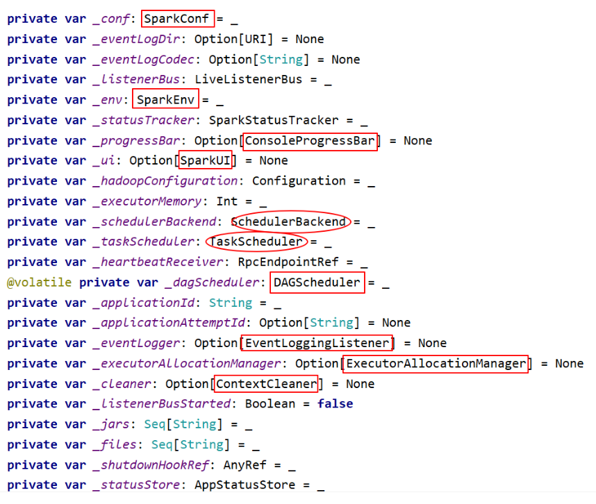

* **SparkConf**。Spark Application 的配置，用来设置 Spark 的 KV 格式的参数。 可用通过 new 实例化一个 SparkConf 的对象，这可以把所有的以 spark 开头的属性配置好，使用 SparkConf 进行参数设置的优先级是高于属性文件，通过new SparkConf(false) 可以在进行单元测试的时候不去读取外部的设置。所 有的 setter 方法都支持链式表达。一旦 SparkConf 对象传给 Spark，会被其他 组件 clone，并且不能再动态的被任何用户修改
* **SparkEnv**: SparkEnv 是Spark的执行环境对象，其中包括与众多Executor执行相关的对象。Executor 有自己的 Spark 的执行环境 SparkEnv。有了 SparkEnv，就可以将数据存储在存储体系中;就能利用计算引擎对计算任务进 行处理，就可以在节点间进行通信等。在 local 模式下Driver会创建Executor， local-cluster部署模式或者 Standalone 部署模式下 Worker 的 CoarseGrainedExecutorBackend 进程中也会创建Executor，所以 SparkEnv 存在于 Driver 或者 CoarseGrainedExecutorBackend 进程中。SparkEnv包含 了很多重要的组件，完成不同的功能 
* **DAGScheduler**。DAG调度器，调度系统中最重要的组件之一，负责创建job， 将DAG的RDD划分为不同的stage，提交stage
* **TaskScheduler。**任务调度器，调度系统中最重要的组件之一，按照调度算法 对集群管理器已经分配给应用程序的资源进行二次调度后分配任务， TaskScheduler调度的 Task是 DAGScheduler创建的，因此DAGScheduler是 TaskScheduler的前置调度器 
* **SchedulerBackend。**用于对接不同的资源管理系统 
* LiveListenerBus:事件总线。接收各个使用方的事件，以异步的方式对事件进 行匹配和处理 
* SparkUI:用户界面，依赖计算引擎、调度系统、存储体系、作业、阶段、存 储、执行器等组件的监控数据，以SparkListenerEnvent的形式投递给Live Listener，Spark从SparkListener中读取数据 
* SparkStatusTracker:状态跟踪器，提供对作业、stage等的监控信息 
* _shutdownHookRef:任务退出时执行清理任务 
* ConsoleProgressBar:进度条，利用SparkStatusTracker的API，在控制台展示 Stage的进度 
* ContextCleaner:上下文清理器，用异步方式清理超出应用程序范围的RDD、 ShuffleDependency和BroadCast 
* EventLoggingListener:将事件日志的监听器，Spark可选组件， spark.eventLog.enabled=true时启动
* ExecutorAllocationManager: Executor动态分配管理器，根据工作负载动态 调整Executor的数量，在spark.dynamicAllocation.enabled=true的前提下，和 非local模式下或者spark.dynamicAllocation.testing=true时启动 
* hadoopConfiguration(): hadoop的配置信息，如果使用的是系统 SPARK_YARN_MODE=true或者环境变量SPARK_YARN_MODE=true时，启用 yarn配置，否则启用hadoop配置 
* heartbeatReceiver(RpcEndpointRef):心跳接收器，Executor都会向 heartbeatReceiver发送心跳信息，heartbeatReceiver接收到信息后，更新 executor最后的可见时间，然后传递给taskScheduler做进一步处理

#### SparkEnv内部组件

SparkEnv是Spark计算层的基石，不管是Driver还是Executor，都需要依赖SparkEnv来进行计算，他是Spark的执行环境对象，启动包括与众多Executor执行相关的对象，Spark对任务的计算都依托于Executor的能力，所有的Executor都有自己的Spark的执行环境SparkEnv。

有了SparkEnv，可以将数据存储在存储体系中；利用计算引擎对计算任务进行处理，可以在节点间进行通信等。

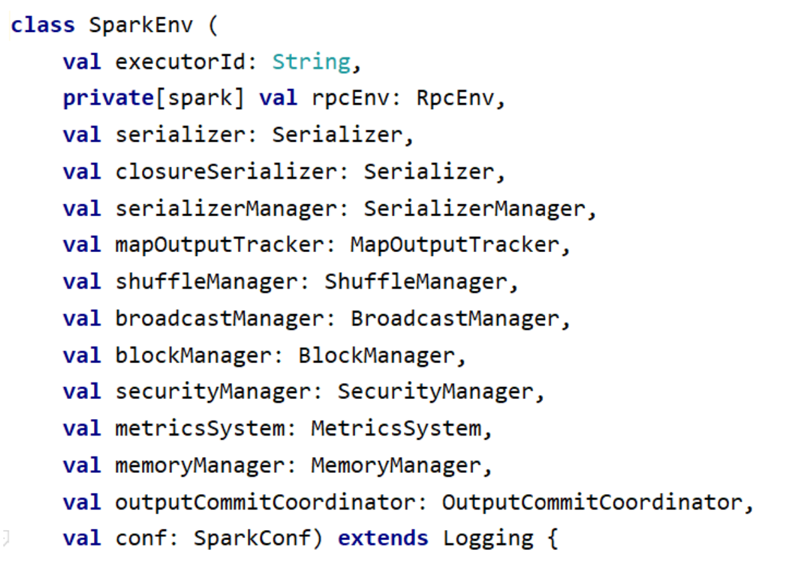

* ExecutorId。每一个Executor在向Driver端注册时，都会生成一个ExecutorId， 对Driver来说，这个ExecutorId就是Executor的唯一标识，它会一直伴随 Executor;

* **RpcEnv**。通过Netty技术来实现对组件之间的通信; 
* Serializer。Spark使用的序列化器，默认使用Java的序列化org.apache.spark.serializer.JavaSerializer;

* SerializerManager。Spark 中很多对象在通用网络传输或者写入存储体系时， 都需要序列化。SparkEnv 中有两个序列化组件，分别是SerializerManager和 ClosureSerializer。serializer默认为Java的序列化器 org.apache.spark.serializer.JavaSerializer，用户可以通过spark.serializer属性 配置其他的序列化实现，如org.apache.spark.serializer.KryoSerializer。而 closureSerializer 的实际类型固定为 org.apache.spark.serializer.JavaSerializer，用户不能够自己指定。 JavaSerializer采用 Java 语言自带的序列化 API 实现;

* **MapOutPutTracker**。MapOutputTracker 用于跟踪Map阶段任务的输出状态，此状态便于Reduce阶段任务获取地址及中间结果。每个Map任务或者 Reduce任务都会有其唯一标识，分别为mapId 和 reduceId。每个Reduce任务 的输入可能是多个Map任务的输出，Reduce会到各个Map任务的所在节点上拉取Block。每个Shuffle过程都有唯一的表示shuffleId。MapOutputTracker 有两个子类:MapOutputTrackerMaster(for driver) 和 MapOutputTrackerWorker(for executors);因为它们使用了不同的 HashMap来存储元数据;

* **ShuffleManager**。ShuffleManager负责管理本地及远程的Block数据的shuffle 操作。ShuffleManager根据默认的 spark.shuffle.manager 属性，通过反射方式生成的SortShuffleManager的实例。默认使用的是sort模式的 SortShuffleManager;

* BroadcastManager。BroadcastManager用于将配置信息和序列化后的RDD、 Job以及ShuffleDependency等信息在本地存储。如果为了容灾，也会复制到其他节点上;

* **BlockManager**。BlockManager负责对Block的管理; 
* SecurityManager。主要对帐号、权限以及身份认证进行设置和管理;

* MetricsSystem。Spark内置的测量系统。度量系统根据当前实例是 Driver 还是 Executor 有所区别:
  * 当前实例为 Driver:创建度量系统，并且指定度量系统的实例名为 driver， 然后等待 SparkContext 中的任务调度器 TaskScheculer 告诉度量系统后再启动;

  * 当前实例为 Executor:设置spark.executor.id属性为当前 Executor 的ID， 然后再创建并启动度量系统;

* **MemoryManager**。MemoryManager 的主要实现有 StaticMemoryManager 和UnifiedMemoryManager(默认)。

* OutputCommitCoordinator。当 Spark 应用程序使用了 Spark SQL (包括 Hive)或者需要将任务的输出保存到 HDFS 时，就会用到输出提交协调器 OutputCommitCoordinator，OutputCommitCoordinator 将决定任务是否可 以提交输出到 HDFS。无论是 Driver 还是 Executor，在 SparkEnv 中都包含了 子组件 OutputCommitCoordinator。在 Driver 上注册了 OutputCommitCoordinatorEndpoint，在所有 Executor 上的 OutputCommitCoordinator 都是通过 OutputCommitCoordinatorEndpoint 的 RpcEndpointRef 来询问 Driver 上的 OutputCommitCoordinator，是否能 够将输出提交到 HDFS。

#### SparkContext 启动流程

SparkContext涉及到的组件多，源码比较庞大。有些边缘性的模块主要起到辅助的功能，展示省略，本文主要关心SparkContext整体启动流程、三大组件的启动。

初始化部分的代码主要集中在363-592行（Spark版本 2.4.5）

###### 步骤汇总

1. 初始设置
2. 创建 SparkEnv
3. 创建 SparkUI
4. Hadoop 相关配置
5. Executor 环境变量
6. 注册 HeartbeatReceiver 心跳接收器
7. 创建 TaskScheduler、SchedulerBackend 
8. 创建和启动 DAGScheduler
9. 启动TaskScheduler、SchedulerBackend
10. 启动测量系统 MetricsSystem
11. 创建事件日志监听器
12. 创建和启动 ExecutorAllocationManager
13. ContextCleaner 的创建与启动
14. 自定义 SparkListener 与启动事件
15. Spark 环境更新
16. 投递应用程序启动事件
17. 测量系统添加Source
18. 将 SparkContext 标记为激活

###### 初始设置

SparkContext默认只有一个实例。要在SparkConf中设置allowMultipleContexts为true。在存在多个Actice级别的SparkContext实例时Spark会发生警告，而不是跑出异常，要特别注意

```scala
// In order to prevent multiple SparkContexts from being active at the same time, mark this
// context as having started construction.
// NOTE: this must be placed at the beginning of the SparkContext constructor.
SparkContext.markPartiallyConstructed(this, allowMultipleContexts)
```

对SparkConf进行复制，然后对各种配置信息进行校验，最主要的就是SparkConf必须指定spark.master(用于设置部署模式)和spark.app.name（应用程序名称）属性，否则会抛出异常

```scala
_conf = config.clone()
_conf.validateSettings()

if (!_conf.contains("spark.master")) {
  throw new SparkException("A master URL must be set in your configuration")
}
if (!_conf.contains("spark.app.name")) {
  throw new SparkException("An application name must be set in your configuration")
}
```

###### 创建 SparkEnv

SparkEnv是Spark的执行环境对象，SparkEnv存在于Driver或者CoarseGrainedExecutorBackend进程中

```scala
// Create the Spark execution environment (cache, map output tracker, etc)
_env = createSparkEnv(_conf, isLocal, listenerBus)
SparkEnv.set(_env)
```

###### 创建 SparkUI

SparkUI提供了用浏览器访问具有样式布局并且提供丰富监控数据页面。其采用的是时间监听机制。发送的时间会存入缓存，由定时调度器取出后分配给监听此时间的监听器对监控数据进行更新。如果不需要SparkUI，则可以将Spark.ui.enabled置为false

```scala
_ui =
if (conf.getBoolean("spark.ui.enabled", true)) {
  Some(SparkUI.create(Some(this), _statusStore, _conf, _env.securityManager, appName, "",startTime))
} else {
  // For tests, do not enable the UI
  None
}
```

###### Hadoop 相关配置

获取的配置信息包括:

* 将Amazon S3文件系统的AWS_ACCESS_KEY_ID和 AWS_SECRET_ACCESS_KEY 加载到Hadoop的Configuration;
* 将SparkConf中所有的以 spark.hadoop 开头的属性都赋值到Hadoop的 Configuration;

* 将SparkConf的属性 spark.buffer.size 复制到Hadoop的Configuration的配置 io.file.buffer.size;

```scala
_hadoopConfiguration = SparkHadoopUtil.get.newConfiguration(_conf)
```

###### Executor 环境变量

ExecutorEnvs包含的环境变量将会注册应用程序的过程中发送给Master，Master给 Worker发送调度后，Worker最终使用ExecutorEnvs提供的信息启动Executor。 通过配置spark.executor.memory指定 Executor 占用的内存的大小，也可以配置系统变量SPARK_EXECUTOR_MEMORY或者SPARK_MEM设置其大小。

```scala
_executorMemory = _conf.getOption("spark.executor.memory")
      .orElse(Option(System.getenv("SPARK_EXECUTOR_MEMORY")))
      .orElse(Option(System.getenv("SPARK_MEM"))
      .map(warnSparkMem))
      .map(Utils.memoryStringToMb)
      .getOrElse(1024)

// Convert java options to env vars as a work around
// since we can't set env vars directly in sbt.
for { (envKey, propKey) <- Seq(("SPARK_TESTING", "spark.testing"))
     value <- Option(System.getenv(envKey)).orElse(Option(System.getProperty(propKey)))} {
  executorEnvs(envKey) = value
}
Option(System.getenv("SPARK_PREPEND_CLASSES")).foreach { v =>
  executorEnvs("SPARK_PREPEND_CLASSES") = v
}
// The Mesos scheduler backend relies on this environment variable to set executor memory.
// TODO: Set this only in the Mesos scheduler.
executorEnvs("SPARK_EXECUTOR_MEMORY") = executorMemory + "m"
executorEnvs ++= _conf.getExecutorEnv
executorEnvs("SPARK_USER") = sparkUser
```

###### 注册 HeartbeatReceiver 心跳接收器

在 Spark 的实际生产环境中，Executor 是运行在不同的节点上的。

* 在 Local 模式 Driver 与 Executor 属于同一个进程，所以 Dirver 与 Executor 可 以直接使用本地调用交互，当 Executor 运行出现问题时，Driver 可以很方便地 知道。

* 在生产环境中，Driver 与 Executor 通常不在同一个进程内，运行在不同的节点 上，甚至不同的机房里，为了能够掌控 Executor，在 Driver 中创建了这个心跳 接收器。

```scala
 // We need to register "HeartbeatReceiver" before "createTaskScheduler" because Executor will
// retrieve "HeartbeatReceiver" in the constructor. (SPARK-6640)
_heartbeatReceiver = env.rpcEnv.setupEndpoint(
  HeartbeatReceiver.ENDPOINT_NAME, new HeartbeatReceiver(this))
```

###### 创建 TaskScheduler、SchedulerBackend 

TaskScheduler，负责任务的提交，并且负责发送任务到集群并运行它们，任务失败的重试，以及慢任务的在其他节点上重试。 其中给应用程序分配并运行 Executor为 一级调度，而给任务分配 Executor 并运行任务则为二级调度。另外 TaskScheduler 也可以看做任务调度的客户端。

* 为 TaskSet创建和维护一个TaskSetManager并追踪任务的本地性以及错误信息;

* 遇到Straggle 任务会方到其他的节点进行重试; 
* 向DAGScheduler汇报执行情况， 包括在Shuffle输出lost的时候报告fetch failed 错误等信息;

SchedulerBackend负责与Master、Worker通信收集Worker上分配给该应用使用的 资源情况。

```scala
// Create and start the scheduler
val (sched, ts) = SparkContext.createTaskScheduler(this, master, deployMode)
_schedulerBackend = sched
_taskScheduler = ts
_dagScheduler = new DAGScheduler(this)
_heartbeatReceiver.ask[Boolean](TaskSchedulerIsSet)

// start TaskScheduler after taskScheduler sets DAGScheduler reference in DAGScheduler's
// constructor
_taskScheduler.start()
```

###### 创建和启动 DAGScheduler

DAGScheduler主要用于在任务正式交给TaskScheduler提交之前做一些准备工作，包括:创建Job，将DAG中的RDD划分到不同的Stage，提交Stage等。 DAGScheduler的数据结构主要维护 jobId 和 stageId 的关系、Stage、ActiveJob，以及缓存的RDD的Partition的位置信息。

###### 启动TaskScheduler、SchedulerBackend


TaskSchedulerImpl.scala

```scala
def newTaskId(): Long = nextTaskId.getAndIncrement()

override def start() {
  backend.start()

  if (!isLocal && conf.getBoolean("spark.speculation", false)) {
    logInfo("Starting speculative execution thread")
    speculationScheduler.scheduleWithFixedDelay(new Runnable {
      override def run(): Unit = Utils.tryOrStopSparkContext(sc) {
        checkSpeculatableTasks()
      }
    }, SPECULATION_INTERVAL_MS, SPECULATION_INTERVAL_MS, TimeUnit.MILLISECONDS)
  }
}
```

###### 启动测量系统 MetricsSystem

MetricsSystem中三个概念:

* **Instance**: 指定了谁在使用测量系统; Spark按照Instance的不同，分为Master、Worker、Application、Driver和Executor

* **Source**: 指定了从哪里收集测量数据;Source的有两种来源:Spark internal source: MasterSource / Worker Source等; Common source: JvmSource

* **Sink**:指定了往哪里输出测量数据; Spark目前提供的Sink有ConsoleSink、 CsvSink、JmxSink、MetricsServlet、GraphiteSink等;Spark使用 MetricsServlet作为默认的Sink

MetricsSystem的启动过程包括:

* 注册Sources

* 注册Sinks
* 将Sinks增加 Jetty 的ServletContextHandler 
* MetricsSystem启动完毕后，会遍历与Sinks有关的 ServletContextHandler，并 调用 attachHandler将它们绑定到Spark UI上

```scala
// The metrics system for Driver need to be set spark.app.id to app ID.
// So it should start after we get app ID from the task scheduler and set spark.app.id.
_env.metricsSystem.start()
// Attach the driver metrics servlet handler to the web ui after the metrics system is started.
_env.metricsSystem.getServletHandlers.foreach(handler => ui.foreach(_.attachHandler(handler)))
```

###### 创建事件日志监听器

EventLoggingListener 是将事件持久化到存储的监听器，是 SparkContext 中可选组件。当spark.eventLog.enabled 属性为 true 时启动，默认为 false。

```scala
_eventLogger =
if (isEventLogEnabled) {
  val logger =
  new EventLoggingListener(_applicationId, _applicationAttemptId, _eventLogDir.get,
                           _conf, _hadoopConfiguration)
  logger.start()
  listenerBus.addToEventLogQueue(logger)
  Some(logger)
} else {
  None
}
```

###### 创建和启动 ExecutorAllocationManager

可选的组件，用于对以分配的Executor进行管理。默认情况下不会创建 ExecutorAllocationManager，可以修改属性spark.dynamicAllocation.enabled为 true来创建。

ExecutorAllocationManager可以动态的分配最小Executor的数量、动态分配最大 Executor的数量、每个Executor可以运行的Task数量等配置信息，并对配置信息进 行校验。

start方法将ExecutorAllocationListener加入listenerBus中， ExecutorAllocationListener通过监听listenerBus里的事件，动态的添加、删除 Executor。并且通过不断添加Executor，遍历Executor，将超时的Executor杀死并移除。

```scala
// Optionally scale number of executors dynamically based on workload. Exposed for testing.
val dynamicAllocationEnabled = Utils.isDynamicAllocationEnabled(_conf)
_executorAllocationManager =
if (dynamicAllocationEnabled) {
  schedulerBackend match {
    case b: ExecutorAllocationClient =>
    Some(new ExecutorAllocationManager(
      schedulerBackend.asInstanceOf[ExecutorAllocationClient], listenerBus, _conf,
      _env.blockManager.master))
    case _ =>
    None
  }
} else {
  None
}
_executorAllocationManager.foreach(_.start())
```

###### ContextCleaner 的创建与启动

ContextCleaner用于清理超出应用范围的RDD、ShuffleDependency和Broadcast对象

* referenceQueue: 缓存顶级的AnyRef引用 
* referenceBuff:缓存AnyRef的虚引用 
* listeners:缓存清理工作的监听器数组 
* cleaningThread:用于具体清理工作的线程

```scala
 _cleaner =
if (_conf.getBoolean("spark.cleaner.referenceTracking", true)) {
  Some(new ContextCleaner(this))
} else {
  None
}
_cleaner.foreach(_.start())
```

###### 自定义 SparkListener 与启动事件

添加用于自定义 SparkListener

```scala
// 注册config的spark.extraListeners属性中指定的监听器，并启动监听器总线 
setupAndStartListenerBus()
// 环境更新 
postEnvironmentUpdate()
// 投递应用程序启动事件 
postApplicationStart()
```

###### Spark 环境更新

在SparkContext的初始化过程中，可能对其环境造成影响，处理步骤，所以需要更新环境。

* 通过调用 SparkEnv 的方法 environmentDetails，将环境的 JVM 参数、Spark 属性、系统属性、classPath 等信息设置为环境明细信息

* 生成事件 SparkListenerEnvironmentUpdate(此事件携带环境明细信息)，并 投递到事件总线 listenerBus，此事件最终被 EnvironmentListener 监听，并影 响 EnvironmentPage 页面中的输出内容。

###### 投递应用程序启动事件

向listenerBus发送了SparkListenerApplicationStart事件

###### 测量系统添加Source

先调用 taskScheduler.postStartHook 方法，等待backend就绪;创建 DAGSchedulerSource、BlockManagerSource和 ExecutorAllocationManagerSource;

```scala
// Post init
_taskScheduler.postStartHook()
_env.metricsSystem.registerSource(_dagScheduler.metricsSource)
_env.metricsSystem.registerSource(new BlockManagerSource(_env.blockManager))
_executorAllocationManager.foreach { e =>
  _env.metricsSystem.registerSource(e.executorAllocationManagerSource)
}
```

###### 将 SparkContext 标记为激活

SparkContext初始化的最后将当前SparkContext的状态从contextBeingConstructed(正在构建中)改为activeContext(已激活)。

```scala
// In order to prevent multiple SparkContexts from being active at the same time, mark this
// context as having finished construction.
// NOTE: this must be placed at the end of the SparkContext constructor.
SparkContext.setActiveContext(this, allowMultipleContexts)
```

#### 三大组件启动流程

* DAGScheduler(高层调度器，class)：负责将DAG拆封成不同的Stage的具有依赖关系（包含RDD的依赖关系）的多批任务，然后提交给TaskScheduler进行具体处理
* TashScheduler（底层调度器，trait，只有一种具体实现：TaskSchedulerImpl）：负责实际每个具体Task的物理调度执行
* SchedulerBackend（trait）：有多种实现，分别对应不同的资源管理器
  * 在Standalone模式下，其实现为：StandaloneSchedulerBackend

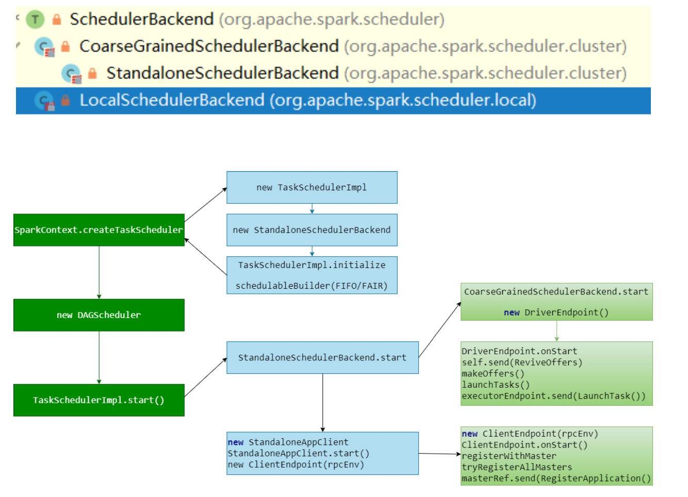

###### 步骤汇总

1. 完整流程
2. 创建SchedulerBackend、TaskScheduler
3. 创建 DAGScheduler
4. 执行 TaskScheduler.start
5. CoarseGrainedSchedulerBackend.start
6. 创建 StandaloneAppClient
7. Master处理注册信息

###### 完整流程

SparkContext源码：

```scala
// Create and start the scheduler
//创建createTaskScheduler，实际上返回的是schedulerBackend 和 taskScheduler
val (sched, ts) = SparkContext.createTaskScheduler(this, master, deployMode)
_schedulerBackend = sched
_taskScheduler = ts
_dagScheduler = new DAGScheduler(this)
_heartbeatReceiver.ask[Boolean](TaskSchedulerIsSet)

// start TaskScheduler after taskScheduler sets DAGScheduler reference in DAGScheduler's
// constructor
_taskScheduler.start()
```

###### 创建SchedulerBackend、TaskScheduler

根据传入的参数不同，启动不同的SchedulerBackend、TaskScheduler（都是trait）

* TaskScheduler的实现只有一个，但是不同的模式传入的参数不同
* SchedulerBackend的实现有多个
* 在Standalone模式下，创建的分别是：StandaloneSchedulerBackend、TaskSchedulerImpl
* 创建TaskSchedulerImpl后，构建了任务调度池FIFOSchedulableBuilder/FairSchedulableBuilder

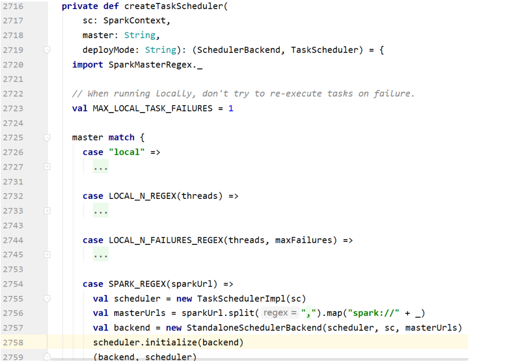

###### 创建 DAGScheduler

```scala
_dagScheduler = new DAGScheduler(this)
```

###### 执行 TaskScheduler.start

TaskSchedulerImpl.start

```scala
override def start() {
  backend.start()

  if (!isLocal && conf.getBoolean("spark.speculation", false)) {
    logInfo("Starting speculative execution thread")
    speculationScheduler.scheduleWithFixedDelay(new Runnable {
      override def run(): Unit = Utils.tryOrStopSparkContext(sc) {
        checkSpeculatableTasks()
      }
    }, SPECULATION_INTERVAL_MS, SPECULATION_INTERVAL_MS, TimeUnit.MILLISECONDS)
  }
}
```

###### CoarseGrainedSchedulerBackend.start

* StandaloneSchedulerBackend.start => CoarseGrainedSchedulerBackend.start
* CoarseGrainedSchedulerBackend.start 启动中最重要的事情是:创建并注册 driverEndpoint
* 在DriverEndpoint.onStart方法中创建定时调度任务，定时发送ReviveOffers消息，最终调用makeOffers方法处理该消息
* DriverEndpoint 代表Driver管理App计算资源，即Executor
* makeOffers方法，将集群的资源以Offer的方式发送给上层的TaskSchedulerImpl

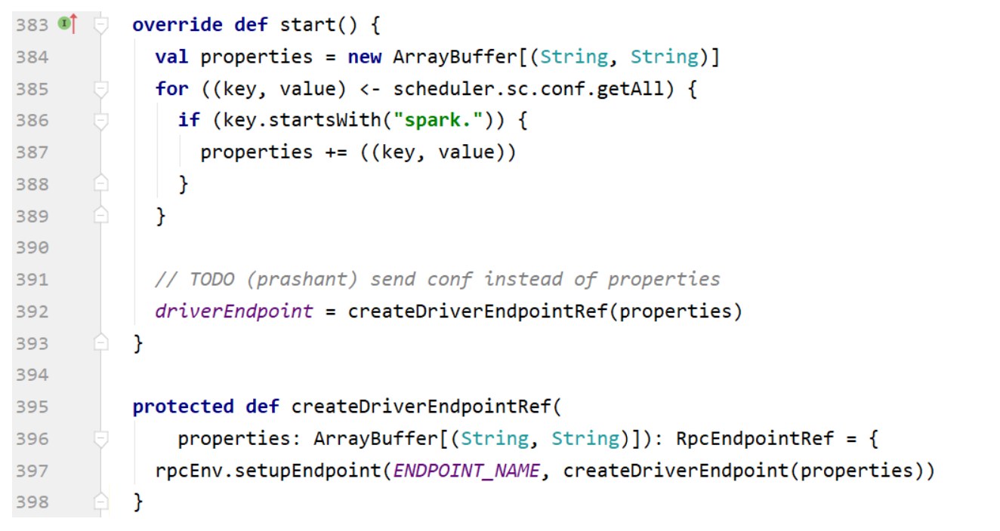

DriverEndpoint 在 CoarseGrainedSchedulerBackend 定义

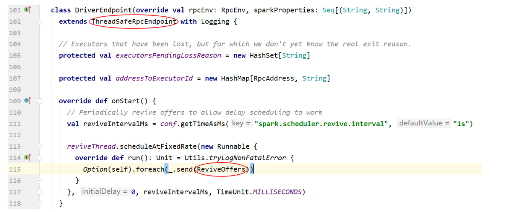

在onStart方法中创建定时调度任务，发送定时ReviveOffers消息；最终调用makeOffers()方法处理消息，makeOffers方法，将集群的资源以Offer的方式发送给上层的TaskSchedulerImpl。TaskSchedulerImpl调用scheduler.resourceOffers获得要被执行的 Seq[TaskDescription]，然后将得到的Seq[TaskDescription]交给CoarseGrainedSchedulerBackend分发到各个executor上执行

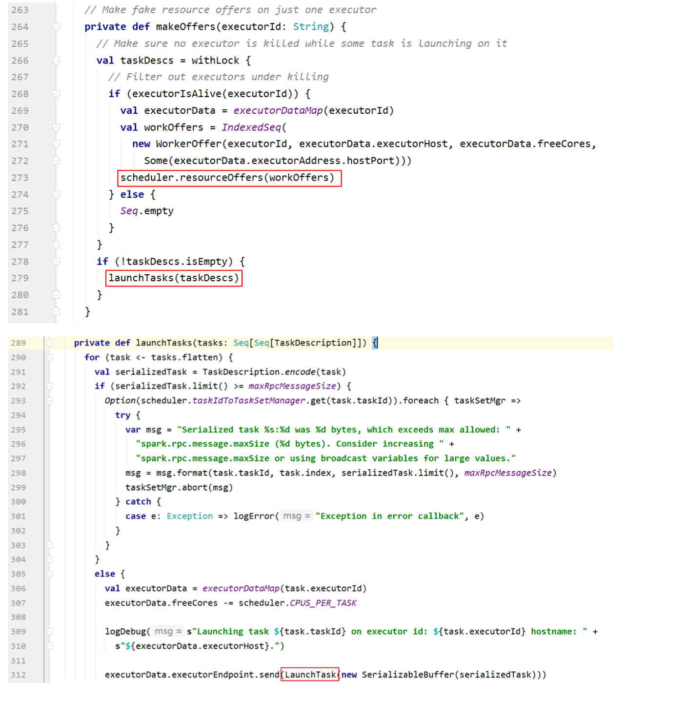

###### 创建 StandaloneAppClient

* 执行start()，在其中创建ClientEndpoint
* ClientEndpoint执行onStart方法
* ClientEndpoint 代表应用程序向 Master 注册 【RegisterApplication】

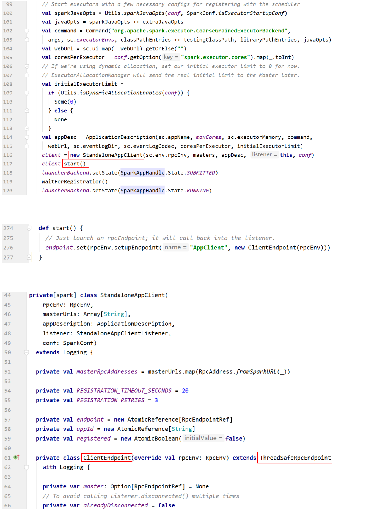

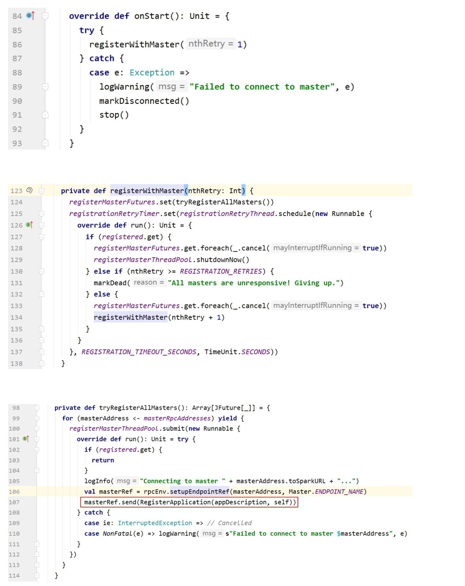

###### Master处理注册信息

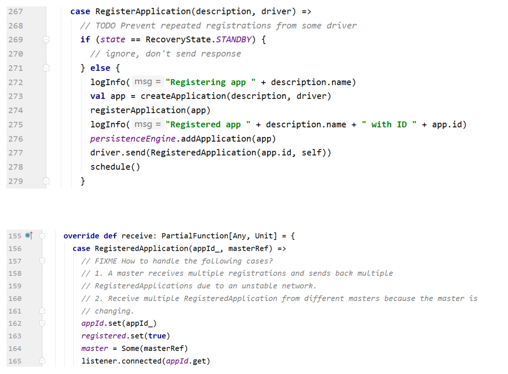

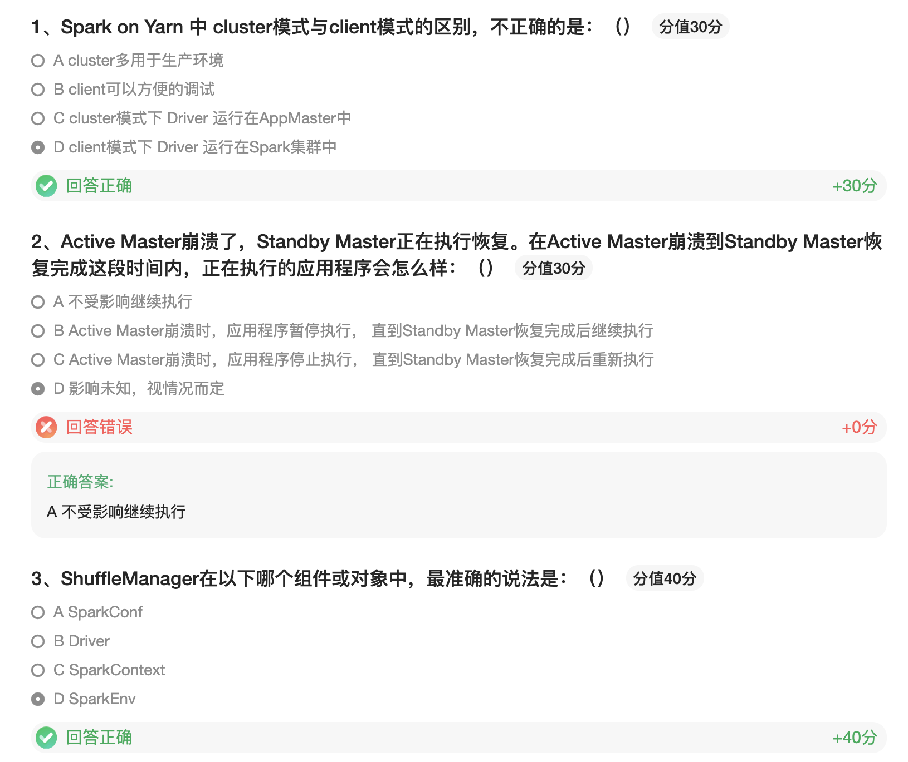

