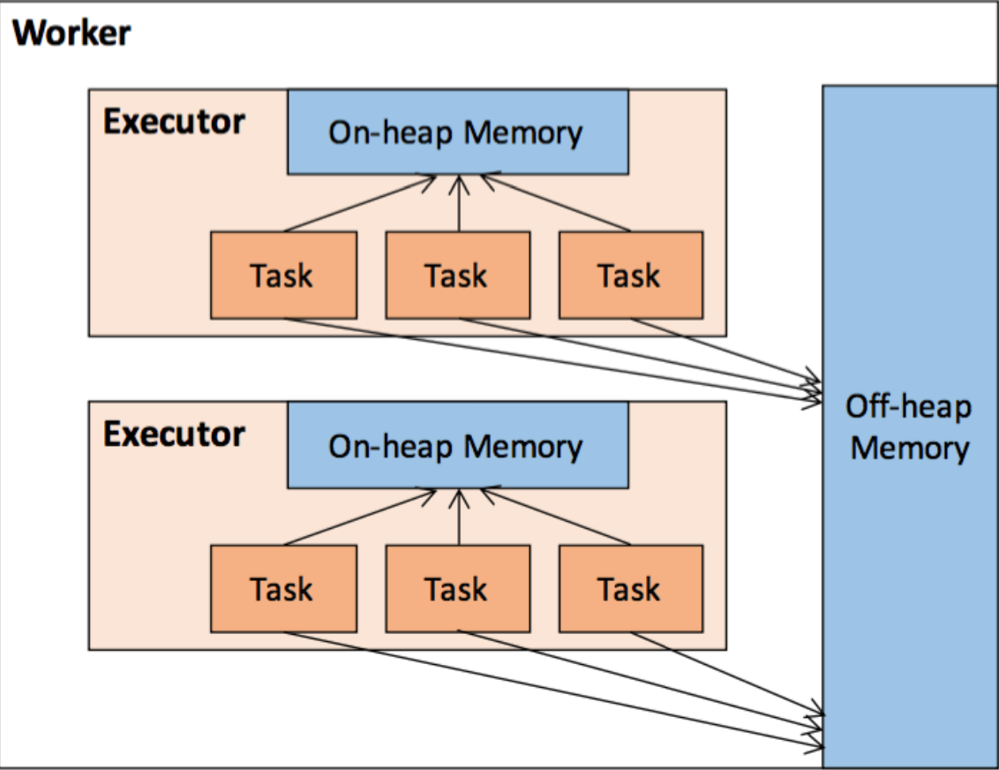

## Spark原理及源码

### 作业执行原理

#### 任务调度概述

再次回顾Spark中的几个重要概念

* Job是以Action方法为界，遇到一个Action方法则触发一个Job
* State是Job的子集，以RDD宽依赖（即Shuffle）为界，遇到Shuffle做一次划分。Stage有两个具体的子类
  * ShuffleMapStage，是其他Stage的输入
    * ShuffleMapStage内部的转换操作（map、filter等）会组成pipeline，连在一起计算
    * 产生map输出文件（Shuffle过程中输出的文件）
  * ResultStage。 一个Job中只有一个ResultStage，最后一个Stage即为ResultStage
* Task是Stage的子集，以并行度（分区数）来衡量，分区数是多少，则有多少个task

SparkContext中的三大组件：

* DAGScheduler（class） 负责Stage的调度
* TaskScheduler（trait，仅有一个实现TaskSchedulerImpl），负责Task的调度
* SchedulerBackend有多种实现，分别对应不同的资源管理器
  * CoarseGrainedSchedulerBackend
  * StandaloneSchedulerBackend
  * LocalSchedulerBackend

Spark的任务调度可分为：Stage级调度（高层调度）、Task级调度（底层调度）。总体流程如下：


#### job触发

Action 操作后会触发 Job 的计算，并交给 DAGScheduler 来提交。


###### Action 触发 sc.runJob

```scala
def count(): Long = sc.runJob(this, Utils.getIteratorSize _).sum
```

###### 触发dagScheduler.runJob

```scala
/**
* Run a function on a given set of partitions in an RDD and pass the results to the given
* handler function. This is the main entry point for all actions in Spark.
*
* @param rdd target RDD to run tasks on
* @param func a function to run on each partition of the RDD
* @param partitions set of partitions to run on; some jobs may not want to compute on all
* partitions of the target RDD, e.g. for operations like `first()`
* @param resultHandler callback to pass each result to
*/
def runJob[T, U: ClassTag](
  rdd: RDD[T],
  func: (TaskContext, Iterator[T]) => U,
  partitions: Seq[Int],
  resultHandler: (Int, U) => Unit): Unit = {
  if (stopped.get()) {
    throw new IllegalStateException("SparkContext has been shutdown")
  }
  val callSite = getCallSite
  val cleanedFunc = clean(func)
  logInfo("Starting job: " + callSite.shortForm)
  if (conf.getBoolean("spark.logLineage", false)) {
    logInfo("RDD's recursive dependencies:\n" + rdd.toDebugString)
  }
  //触发调用dagScheduler
  dagScheduler.runJob(rdd, cleanedFunc, partitions, callSite, resultHandler, localProperties.get)
  progressBar.foreach(_.finishAll())
  rdd.doCheckpoint()
}
```

spark.logLineage为ture的时候，调用Action时打印rdd的lineage信息

###### dagScheduler.runJob 提交job

```scala
def runJob[T, U](
  rdd: RDD[T],
  func: (TaskContext, Iterator[T]) => U,
  partitions: Seq[Int],
  callSite: CallSite,
  resultHandler: (Int, U) => Unit,
  properties: Properties): Unit = {
  //启动时间
  val start = System.nanoTime
  //提交Job，该方法时异步的，会立即返回JobWaiter对象
  val waiter = submitJob(rdd, func, partitions, callSite, resultHandler, properties)
  //等待Job处理完毕
  ThreadUtils.awaitReady(waiter.completionFuture, Duration.Inf)
  //获取运行结果
  waiter.completionFuture.value.get match {
    //Job执行成功
    case scala.util.Success(_) =>
    logInfo("Job %d finished: %s, took %f s".format
            (waiter.jobId, callSite.shortForm, (System.nanoTime - start) / 1e9))
    //Job执行失败
    case scala.util.Failure(exception) =>
    logInfo("Job %d failed: %s, took %f s".format
            (waiter.jobId, callSite.shortForm, (System.nanoTime - start) / 1e9))
    // SPARK-8644: Include user stack trace in exceptions coming from DAGScheduler.
    //记录线程异常堆栈信息
    val callerStackTrace = Thread.currentThread().getStackTrace.tail
    exception.setStackTrace(exception.getStackTrace ++ callerStackTrace)
    //抛出异常
    throw exception
  }
}
```

#### Stage划分

Spark的任务调度从DAG划分开始，有DAGScheduler完成

* DAGScheduler根据RDD血缘关系构建成DAG进行切分，讲一个Job划分为若干个Stages，具体划分为若干个Stages，具体的划分策略是：从最后一个RDD开始，通过回溯依赖父依赖是否为宽依赖（即以Shuffle为界），划分Stage；窄依赖的RDD之间被划分到同一个Stage中，可以进行pipeline式的计算
* 再向前搜索的过程中，使用深度优先搜索算法
* 最后一个Stage称为ResultStage，其他的都是ShuffleMapStage
* 一个Stage是否被提交，需要判断他的父Stage是否执行，只有父Stage执行完毕才能提交当前Stage，如果一个Stage没有父Stage，那么从该Stage开始提交。

总体而言，DAGScheduler做的事情比较简单，仅仅是在Stage层面划分DAG，提交Stage并监控相关状态信息。

###### DAGScheduler中的重要对象

**DAGSchedulerEventProcessLoop**：DAGScheduler内部的时间循环处理器，用于处理DAGSchedulerEvent类型事件，DAGSchedulerEventProcessLoop实现了EventLoop。

* 内置一个消息队列（双端队列）eventQueue：LinkedBlockingDeque[E]，配合实现消息存储、消息消费使用
* 内置了一个消费线程eventThread，消费线程消费队列中的消息，消息处理接口函数是onReceive(event:E)，消费异常函数接口 onError（e:Throwable）
* 对外开放了接收消息的Post方法：接收外部消息并存入队列，等待被消费
* 消费线程启动方法start，在调用线程启动方法：eventThread.start()之前，需要调用onStart为启动做准备接口函数
* 消费线程停止方法stop，在调用线程停止方法：eventThread.interrupt&eventThread.join()之后，需要调用onStop()做补充接口函数

```scala
/*
 * Licensed to the Apache Software Foundation (ASF) under one or more
 * contributor license agreements.  See the NOTICE file distributed with
 * this work for additional information regarding copyright ownership.
 * The ASF licenses this file to You under the Apache License, Version 2.0
 * (the "License"); you may not use this file except in compliance with
 * the License.  You may obtain a copy of the License at
 *
 *    http://www.apache.org/licenses/LICENSE-2.0
 *
 * Unless required by applicable law or agreed to in writing, software
 * distributed under the License is distributed on an "AS IS" BASIS,
 * WITHOUT WARRANTIES OR CONDITIONS OF ANY KIND, either express or implied.
 * See the License for the specific language governing permissions and
 * limitations under the License.
 */

package org.apache.spark.util

import java.util.concurrent.{BlockingQueue, LinkedBlockingDeque}
import java.util.concurrent.atomic.AtomicBoolean

import scala.util.control.NonFatal

import org.apache.spark.internal.Logging

/**
 * An event loop to receive events from the caller and process all events in the event thread. It
 * will start an exclusive event thread to process all events.
 *
 * Note: The event queue will grow indefinitely. So subclasses should make sure `onReceive` can
 * handle events in time to avoid the potential OOM.
 */
private[spark] abstract class EventLoop[E](name: String) extends Logging {

  //时间队列，双端队列
  private val eventQueue: BlockingQueue[E] = new LinkedBlockingDeque[E]()

  //标记当前事件循环是否停止
  private val stopped = new AtomicBoolean(false)

  // Exposed for testing.
  //事件处理线程
  private[spark] val eventThread = new Thread(name) {
    //设置为守护线程
    setDaemon(true)

    //主要的run方法
    override def run(): Unit = {
      try {
        //如果没有停止
        while (!stopped.get) {
          //从队列中拉取数据
          val event = eventQueue.take()
          try {
            //将事件交给onReceive方法处理
            onReceive(event)
          } catch { //异常处理
            case NonFatal(e) => //非致命异常
              try {
                onError(e) //回调给onError
              } catch {
                case NonFatal(e) => logError("Unexpected error in " + name, e)
              }
          }
        }
      } catch {
        case ie: InterruptedException => // exit even if eventQueue is not empty
        case NonFatal(e) => logError("Unexpected error in " + name, e)
      }
    }

  }

  //启动当前事件的循环
  def start(): Unit = {
    //判断是够已经停止
    if (stopped.get) {
      throw new IllegalStateException(name + " has already been stopped")
    }
    // Call onStart before starting the event thread to make sure it happens before onReceive
    //调用onStart方法通知事件循环启动了，onStart方法由子类实现，onstart方法在onReceive之前调用
    onStart()
    //启动事件处理线程
    eventThread.start()
  }

  //停止循环
  def stop(): Unit = {
    //使用CAS的方式，将标记设置为trye
    if (stopped.compareAndSet(false, true)) {
      eventThread.interrupt()
      var onStopCalled = false
      try {
        eventThread.join()
        // Call onStop after the event thread exits to make sure onReceive happens before onStop
        onStopCalled = true
        onStop()
      } catch {
        case ie: InterruptedException =>
          Thread.currentThread().interrupt()
          if (!onStopCalled) {
            // ie is thrown from `eventThread.join()`. Otherwise, we should not call `onStop` since
            // it's already called.
            onStop()
          }
      }
    } else {
      // Keep quiet to allow calling `stop` multiple times.
    }
  }

  /**
   * Put the event into the event queue. The event thread will process it later.
   */
  //投递事件，将数据放到队列中
  def post(event: E): Unit = {
    eventQueue.put(event)
  }

  /**
   * Return if the event thread has already been started but not yet stopped.
   */
  //判断是否存活
  def isActive: Boolean = eventThread.isAlive

  /**
   * Invoked when `start()` is called but before the event thread starts.
   */
  //事件开始启动，需要子类实现
  protected def onStart(): Unit = {}

  /**
   * Invoked when `stop()` is called and the event thread exits.
   */
  //事件停止，同上
  protected def onStop(): Unit = {}

  /**
   * Invoked in the event thread when polling events from the event queue.
   *
   * Note: Should avoid calling blocking actions in `onReceive`, or the event thread will be blocked
   * and cannot process events in time. If you want to call some blocking actions, run them in
   * another thread.
   */
  // 需要DAGScheduler.scala 中的 DAGSchedulerEventProcessLoop类来实现该方法
  protected def onReceive(event: E): Unit

  /**
   * Invoked if `onReceive` throws any non fatal error. Any non fatal error thrown from `onError`
   * will be ignored.
   */
  protected def onError(e: Throwable): Unit
}
```

JobWaiter 实现了JobListener接口，等待DAGScheduler中的job计算完成。每个Task结束后，通过回调函数，将对应结果传递给句柄函数resultHandler处理。

所有的Task都完成时任务Job完成

```scala

package org.apache.spark.scheduler

import java.util.concurrent.atomic.AtomicInteger

import scala.concurrent.{Future, Promise}

import org.apache.spark.internal.Logging

/**
 * An object that waits for a DAGScheduler job to complete. As tasks finish, it passes their
 * results to the given handler function.
 */
private[spark] class JobWaiter[T](
    dagScheduler: DAGScheduler,
    val jobId: Int,
    totalTasks: Int,
    resultHandler: (Int, T) => Unit)
  extends JobListener with Logging {
  //完成的Task的数量
  private val finishedTasks = new AtomicInteger(0)
  // If the job is finished, this will be its result. In the case of 0 task jobs (e.g. zero
  // partition RDDs), we set the jobResult directly to JobSucceeded.
  //用来表示Job完成，如果task的数量等于零，说明没有Task要执行，直接返回success
  private val jobPromise: Promise[Unit] =
    if (totalTasks == 0) Promise.successful(()) else Promise()

  //job是否完成
  def jobFinished: Boolean = jobPromise.isCompleted

  //返回jobPromise的future
  def completionFuture: Future[Unit] = jobPromise.future

  /**
   * Sends a signal to the DAGScheduler to cancel the job. The cancellation itself is handled
   * asynchronously. After the low level scheduler cancels all the tasks belonging to this job, it
   * will fail this job with a SparkException.
   */
    //取消Job
  def cancel() {
      //使用DAG的cancelJob方法，将job取消
    dagScheduler.cancelJob(jobId, None)
  }

  //Job执行成功后调用该方法
  override def taskSucceeded(index: Int, result: Any): Unit = {
    // resultHandler call must be synchronized in case resultHandler itself is not thread safe.
    synchronized { // 加锁进行回调
      resultHandler(index, result.asInstanceOf[T])
    }
    //完成的task自增，并获取当前完成的数量与总task比较，如果想到，表示Job完成
    if (finishedTasks.incrementAndGet() == totalTasks) {
      jobPromise.success(())
    }
  }

  //job执行失败调用该方法
  override def jobFailed(exception: Exception): Unit = {
    //调用jobPromise的相关方法将其设置为Failure
    if (!jobPromise.tryFailure(exception)) {
      logWarning("Ignore failure", exception)
    }
  }
}
```

###### dagScheduler.submit 发送消息

入口 RDD.scala：

```scala
def count(): Long = sc.runJob(this, Utils.getIteratorSize _).sum
```

最终执行的：

```scala
/**
 * Submit an action job to the scheduler.
 *
 * @param rdd           target RDD to run tasks on
 * @param func          a function to run on each partition of the RDD
 * @param partitions    set of partitions to run on; some jobs may not want to compute on all
 *                      partitions of the target RDD, e.g. for operations like first()
 * @param callSite      where in the user program this job was called
 * @param resultHandler callback to pass each result to
 * @param properties    scheduler properties to attach to this job, e.g. fair scheduler pool name
 * @return a JobWaiter object that can be used to block until the job finishes executing
 *         or can be used to cancel the job.
 * @throws IllegalArgumentException when partitions ids are illegal
 */
def submitJob[T, U](
                     rdd: RDD[T],
                     func: (TaskContext, Iterator[T]) => U,
                     partitions: Seq[Int],
                     callSite: CallSite,
                     resultHandler: (Int, U) => Unit,
                     properties: Properties): JobWaiter[U] = {
  // Check to make sure we are not launching a task on a partition that does not exist.
  //获取当前Job的分区数量
  val maxPartitions = rdd.partitions.length
  //判断分区数量是否正常
  partitions.find(p => p >= maxPartitions || p < 0).foreach { p =>
    throw new IllegalArgumentException(
      "Attempting to access a non-existent partition: " + p + ". " +
        "Total number of partitions: " + maxPartitions)
  }
  //生产下一个Job的jobId
  val jobId = nextJobId.getAndIncrement()
  if (partitions.size == 0) {
    // Return immediately if the job is running 0 tasks
    //如果分区数量为0，直接创建一个JobWaiter对象，在JobWaiter的jobPromise，如果task属性为0
    //直接被设置为Success
    return new JobWaiter[U](this, jobId, 0, resultHandler)
  }

  //s设置断言
  assert(partitions.size > 0)
  // 如果分区数量大于0
  val func2 = func.asInstanceOf[(TaskContext, Iterator[_]) => _]
  //创建一个JobWaiter对象
  val waiter = new JobWaiter(this, jobId, partitions.size, resultHandler)
  //将JobSubmitted发送到 DAGSchedulerEventProcessLoop，
  //然后会被  DAGSchedulerEventProcessLoop 的 doOnReceive 方法处理
  eventProcessLoop.post(JobSubmitted(
    jobId, rdd, func2, partitions.toArray, callSite, waiter,
    SerializationUtils.clone(properties)))
  //返回JobWaiter
  waiter
}
```

###### 调用 dagScheduler.handleJobSubmitted

上面的方法执行post后，在DAGScheduler中的DAGSchedulerEventProcessLoop类中，有着doOnReceive方法，然后处理提交的JobSubmitted。

```scala
case JobSubmitted(jobId, rdd, func, partitions, callSite, listener, properties) =>
      dagScheduler.handleJobSubmitted(jobId, rdd, func, partitions, callSite, listener, properties)
```

handleJobSubmitted:

```scala
private[scheduler] def handleJobSubmitted(jobId: Int,
                                          finalRDD: RDD[_],
                                          func: (TaskContext, Iterator[_]) => _,
                                          partitions: Array[Int],
                                          callSite: CallSite,
                                          listener: JobListener,
                                          properties: Properties) {
  //定义一个resultStage
  var finalStage: ResultStage = null
  try {
    // New stage creation may throw an exception if, for example, jobs are run on a
    // HadoopRDD whose underlying HDFS files have been deleted.
    // 创建ResultStage
    finalStage = createResultStage(finalRDD, func, partitions, jobId, callSite)
  } catch {
    case e: BarrierJobSlotsNumberCheckFailed =>
    logWarning(s"The job $jobId requires to run a barrier stage that requires more slots " +
               "than the total number of slots in the cluster currently.")
    // If jobId doesn't exist in the map, Scala coverts its value null to 0: Int automatically.
    val numCheckFailures = barrierJobIdToNumTasksCheckFailures.compute(jobId,new BiFunction[Int, Int, Int] {
   override def apply(key: Int, value: Int): Int = value + 1]})
    if (numCheckFailures <= maxFailureNumTasksCheck) {
      messageScheduler.schedule(
        new Runnable {
          override def run(): Unit = eventProcessLoop.post(JobSubmitted(jobId, finalRDD, func,partitions, callSite, listener, properties))
        },
        timeIntervalNumTasksCheck,
        TimeUnit.SECONDS
      )
      return
    } else {
      // Job failed, clear internal data.
      barrierJobIdToNumTasksCheckFailures.remove(jobId)
      listener.jobFailed(e)
      return
    }

    case e: Exception =>
    logWarning("Creating new stage failed due to exception - job: " + jobId, e)
    listener.jobFailed(e)
    return
  }
  // Job submitted, clear internal data.
  // 提交作业，清除内部数据。
  barrierJobIdToNumTasksCheckFailures.remove(jobId)

  //创建一个活着的Job
  val job = new ActiveJob(jobId, finalStage, callSite, listener, properties)
  //清除缓存的各个RDD的所有分区位置信息
  clearCacheLocs()
  logInfo("Got job %s (%s) with %d output partitions".format(
    job.jobId, callSite.shortForm, partitions.length))
  logInfo("Final stage: " + finalStage + " (" + finalStage.name + ")")
  logInfo("Parents of final stage: " + finalStage.parents)
  logInfo("Missing parents: " + getMissingParentStages(finalStage))
  //生成job提交时间
  val jobSubmissionTime = clock.getTimeMillis()
  //记录存活的jobId与job的关系
  jobIdToActiveJob(jobId) = job
  activeJobs += job
  //将resultStage设置为当前提交的job
  finalStage.setActiveJob(job)
  //获取该jobde所有Stage的ID
  val stageIds = jobIdToStageIds(jobId).toArray
  //根据StageId获取Stage信息
  val stageInfos = stageIds.flatMap(id => stageIdToStage.get(id).map(_.latestInfo))
  //向事件总线提交SparkListenerJobStart事件
  listenerBus.post(
    SparkListenerJobStart(job.jobId, jobSubmissionTime, stageInfos, properties))
  // 提交Stage
  submitStage(finalStage)
}
```

###### handleJobSubmitted => createResultStage

createResultStage:

```scala
/**
* Create a ResultStage associated with the provided jobId.
*/
private def createResultStage(
  rdd: RDD[_],
  func: (TaskContext, Iterator[_]) => _,
  partitions: Array[Int],
  jobId: Int,
  callSite: CallSite): ResultStage = {
  checkBarrierStageWithDynamicAllocation(rdd)
  checkBarrierStageWithNumSlots(rdd)
  checkBarrierStageWithRDDChainPattern(rdd, partitions.toSet.size)
  //获取所有的父Stage的列表，父 Stage 主要是宽依赖（ShuffleDependency）对应的Stage，此列表中的Stage有以下几种
  // 1. 当前RDD的直接或间接依赖是ShuffleDependency，且已经注册过的Stage
  // 2. 当前RDD的直接或间接依赖是ShuffleDependency，且没有注册过的Stage
  //  对于这种ShuffleDependency，根据ShuffleDependency中的RDD，找到他的直接或间接的依赖ShuffleDependency
  // 且没有注册过的Stage，为它们创建并注册。
  // 3. 当前RDD的直接或间接依赖是ShuffleDependency，且没有注册过Stage，为此ShuffleDependency创建并注册Stage
  val parents = getOrCreateParentStages(rdd, jobId)
  //生成ResultStage的标示
  val id = nextStageId.getAndIncrement()
  //创建ResultStage对象
  val stage = new ResultStage(id, rdd, func, partitions, parents, jobId, callSite)
  //记录stageId与Stage的关系
  stageIdToStage(id) = stage
  //更新Job的身份标识与ResultStage以及其所有祖先的依赖关系
  updateJobIdStageIdMaps(jobId, stage)
  stage
}
```

getOrCreateParentStages:

```scala
/**
* Get or create the list of parent stages for a given RDD.  The new Stages will be created with
* the provided firstJobId.
*/
//获取给定的RDD的所有父类的shuffle依赖
private def getOrCreateParentStages(rdd: RDD[_], firstJobId: Int): List[Stage] = {
  //获取RDD的所有ShuffleDependency 序列
  getShuffleDependencies(rdd)
  //遍历
  .map {
    //为每个ShuffleDependency创建对应的 ShuffleMapStage
    shuffleDep =>
    getOrCreateShuffleMapStage(shuffleDep, firstJobId)
  }.toList
}
```

getShuffleDependencies

```scala
/**
 * Returns shuffle dependencies that are immediate parents of the given RDD.
 *
 * This function will not return more distant ancestors.  For example, if C has a shuffle
 * dependency on B which has a shuffle dependency on A:
 *
 * A <-- B <-- C
 *
 * calling this function with rdd C will only return the B <-- C dependency.
 *
 * This function is scheduler-visible for the purpose of unit testing.
 */
//获取RDD的所有ShuffleDependency 序列
private[scheduler] def getShuffleDependencies(
                                               rdd: RDD[_]): HashSet[ShuffleDependency[_, _, _]] = {
  val parents = new HashSet[ShuffleDependency[_, _, _]]
  val visited = new HashSet[RDD[_]]
  //创建一个栈
  val waitingForVisit = new ArrayStack[RDD[_]]
  //将rdd押入栈中
  waitingForVisit.push(rdd)
  //当栈不为空的事件
  while (waitingForVisit.nonEmpty) {
    //顶端RDD出栈
    val toVisit = waitingForVisit.pop()
    //判断是否已经处理过该RDD，如果没有处理过
    if (!visited(toVisit)) {
      //将该RDD放毒到已经处理的集合中
      visited += toVisit
      //遍历弹出的RDD的所有依赖，如果是ShuffleDependency就记录到父类的RDD集合中
      toVisit.dependencies.foreach {
        case shuffleDep: ShuffleDependency[_, _, _] =>
          parents += shuffleDep
          //如果是dependency类型，继续押入到栈中
        case dependency =>
          waitingForVisit.push(dependency.rdd)
      }
    }
  }
  parents
}
```

###### 提交ResultStage

在handleJobSubmitted方法中，通过调用submitStage方法， 提交ResultStage的Task集合，在中间会层层获取入参的所有的父类Stage

先调用getMissingParentStages来获取是否有未提交的父Stages。若有，则依次递归提交父Stages，并将missing加入到waitingStages中，对于要依次提交的父Stage也是如此

如missing存在未提交的父Stage，则先提交父stages，

这时会调用submitMissingTask（stage，JobId.get）参数就是missing及其对应的jobId.get。这个函数便是将stage与taskSet对应起来，然后DAGScheduler将 taskSet提交给TaskScheduler去执行的实施者。

```scala
/** Submits stage, but first recursively submits any missing parents. */
//该方法是一个递归方法
private def submitStage(stage: Stage) {
  //获取当前stage对应的JobId
  val jobId = activeJobForStage(stage)
  //判断该JobId是否被定义
  if (jobId.isDefined) {
    logDebug(s"submitStage($stage (name=${stage.name};" +
             s"jobs=${stage.jobIds.toSeq.sorted.mkString(",")}))")
    //判断该stage不在等待的集合中、不在正在执行的stage集合中、不在失败的stage集合中
    if (!waitingStages(stage) && !runningStages(stage) && !failedStages(stage)) {
      //获取当前Stage所有的未执行的父Stage
      val missing = getMissingParentStages(stage).sortBy(_.id)
      logDebug("missing: " + missing)
      if (missing.isEmpty) {
        //如果父Stage为空，提交当前Stage
        logInfo("Submitting " + stage + " (" + stage.rdd + "), which has no missing parents")
        submitMissingTasks(stage, jobId.get)
      } else {
        //如果父Stage不为空，遍历并提交父Stage
        for (parent <- missing) {
          submitStage(parent)
        }
        waitingStages += stage
      }
    }
  } else {
    abortStage(stage, "No active job for stage " + stage.id, None)
  }
}
```

getMissingParentStages:

```scala
//获取该Stage所有未提交的父Stage
private def getMissingParentStages(stage: Stage): List[Stage] = {
  val missing = new HashSet[Stage]
  val visited = new HashSet[RDD[_]]
  // We are manually maintaining a stack here to prevent StackOverflowError
  // caused by recursively visiting

  val waitingForVisit = new ArrayStack[RDD[_]]

  def visit(rdd: RDD[_]) {
    if (!visited(rdd)) {//判断是否已经处理过
      visited += rdd//没有处理过，加入过visited集合中
      //获取RDD各个分区的TaskLocation序列，判断是否包含nil，
      //Stage的RDD各个分区中存在没有对应的TaskLocaltion序列的分区
      //则说明当前Stage的某个上游ShuffleMapStage的某个分区任务未执行
      val rddHasUncachedPartitions = getCacheLocs(rdd).contains(Nil)
      // TaskLocation序列包含Nil
      if (rddHasUncachedPartitions) {
        //遍历该RDD所有的依赖
        for (dep <- rdd.dependencies) {
          dep match {
            //是ShuffleDependency
            case shufDep: ShuffleDependency[_, _, _] =>
            //获取该ShuffleDependency的上游第一个提交的ShuffleMapStage
            val mapStage = getOrCreateShuffleMapStage(shufDep, stage.firstJobId)
            //判断ShuffleMapStage是否不可用
            if (!mapStage.isAvailable) {
              //如果不可用，提交到missing集合中
              missing += mapStage
            }
            //NarrowDependency，窄依赖，压栈
            case narrowDep: NarrowDependency[_] =>
            //将该窄依赖的rdd压入waitingForVisit栈中
            waitingForVisit.push(narrowDep.rdd)
          }
        }
      }
    }
  }

  waitingForVisit.push(stage.rdd)
  //当栈不为空的时候
  while (waitingForVisit.nonEmpty) {
    visit(waitingForVisit.pop())
  }
  missing.toList
}

```

###### 提交 Task

* 得到RDD中需要计算的partition

对于Shuffle类型的Stage，需要判断Stage中是否缓存了该结果；对于Result类型的Final Stage，则判断计算Job中该partition是否已经计算完成。这么做（没有直接提交全部tasks）的原因是，stage中的某个task执行失败而其他的执行成功的时候，就需需要找出这个失败的task对应要计算的partition而不是计算所有的partition。

* 序列化task的binary

Executor可以公告广播变量得到它，每个task运行的时候首先会反序列化

* 为每个需要就算的partition生成一个task

ShuffleMapStage对应task全是ShuffleMapTask；ResultStage对应的全是ResultTask。task继承Serializable，要确保task是可序列化的

* 提交tasks

先用tasks来初始化一个TaskSet对象，再调用TashScheduler.submitTasks提交

```scala
/** Called when stage's parents are available and we can now do its task. */
private def submitMissingTasks(stage: Stage, jobId: Int) {
  logDebug("submitMissingTasks(" + stage + ")")

  // First figure out the indexes of partition ids to compute.
  //找到当前Stage所有分区中还没有完成计算的de分区索引
  val partitionsToCompute: Seq[Int] = stage.findMissingPartitions()

  // Use the scheduling pool, job group, description, etc. from an ActiveJob associated
  // with this Stage
  //获取ActionJob的properties，properties包含了当前job的调度、group、描述等属性信息
  val properties = jobIdToActiveJob(jobId).properties

  //将当前stage加入到运行的stage集合中
  runningStages += stage
  // SparkListenerStageSubmitted should be posted before testing whether tasks are
  // serializable. If tasks are not serializable, a SparkListenerStageCompleted event
  // will be posted, which should always come after a corresponding SparkListenerStageSubmitted
  // event.
  // 启动对当前Stage的输出提交到HDFS的协调机制
  stage match {
    //不同的stage类型，使用不同的分区数来确认此阶段任务中可能出现的最大分区ID
    case s: ShuffleMapStage =>
    outputCommitCoordinator.stageStart(stage = s.id, maxPartitionId = s.numPartitions - 1)
    case s: ResultStage =>
    outputCommitCoordinator.stageStart(
      stage = s.id, maxPartitionId = s.rdd.partitions.length - 1)
  }
  // 获取还没有完成计算的每一个分区的偏好位置
  val taskIdToLocations: Map[Int, Seq[TaskLocation]] = try {
    stage match {
      case s: ShuffleMapStage =>
      partitionsToCompute.map { id => (id, getPreferredLocs(stage.rdd, id)) }.toMap
      case s: ResultStage =>
      partitionsToCompute.map { id =>
        val p = s.partitions(id)
        (id, getPreferredLocs(stage.rdd, p))
      }.toMap
    }
  } catch {
    case NonFatal(e) =>
    //如果出现异常，调用makeNewStageAttempt开一次新的Stage执行尝试
    stage.makeNewStageAttempt(partitionsToCompute.size)
    listenerBus.post(SparkListenerStageSubmitted(stage.latestInfo, properties))
    abortStage(stage, s"Task creation failed: $e\n${Utils.exceptionString(e)}", Some(e))
    runningStages -= stage
    return
  }

  stage.makeNewStageAttempt(partitionsToCompute.size, taskIdToLocations.values.toSeq)

  // If there are tasks to execute, record the submission time of the stage. Otherwise,
  // post the even without the submission time, which indicates that this stage was
  // skipped.
  if (partitionsToCompute.nonEmpty) {
    stage.latestInfo.submissionTime = Some(clock.getTimeMillis())
  }
  listenerBus.post(SparkListenerStageSubmitted(stage.latestInfo, properties))

  // TODO: Maybe we can keep the taskBinary in Stage to avoid serializing it multiple times.
  // Broadcasted binary for the task, used to dispatch tasks to executors. Note that we broadcast
  // the serialized copy of the RDD and for each task we will deserialize it, which means each
  // task gets a different copy of the RDD. This provides stronger isolation between tasks that
  // might modify state of objects referenced in their closures. This is necessary in Hadoop
  // where the JobConf/Configuration object is not thread-safe.
  var taskBinary: Broadcast[Array[Byte]] = null
  var partitions: Array[Partition] = null
  try {
    // For ShuffleMapTask, serialize and broadcast (rdd, shuffleDep).
    // For ResultTask, serialize and broadcast (rdd, func).
    var taskBinaryBytes: Array[Byte] = null
    // taskBinaryBytes and partitions are both effected by the checkpoint status. We need
    // this synchronization in case another concurrent job is checkpointing this RDD, so we get a
    // consistent view of both variables.
    //不同的stage的序列化方式
    RDDCheckpointData.synchronized {
      taskBinaryBytes = stage match {
        case stage: ShuffleMapStage =>
        JavaUtils.bufferToArray(
          closureSerializer.serialize((stage.rdd, stage.shuffleDep): AnyRef))
        case stage: ResultStage =>
        JavaUtils.bufferToArray(closureSerializer.serialize((stage.rdd, stage.func): AnyRef))
      }

      partitions = stage.rdd.partitions
    }
    //序列化的变量做广播变量
    taskBinary = sc.broadcast(taskBinaryBytes)
  } catch {
    // In the case of a failure during serialization, abort the stage.
    case e: NotSerializableException =>
    abortStage(stage, "Task not serializable: " + e.toString, Some(e))
    runningStages -= stage

    // Abort execution
    return
    case e: Throwable =>
    abortStage(stage, s"Task serialization failed: $e\n${Utils.exceptionString(e)}", Some(e))
    runningStages -= stage

    // Abort execution
    return
  }

  //创建task序列
  val tasks: Seq[Task[_]] = try {
    val serializedTaskMetrics = closureSerializer.serialize(stage.latestInfo.taskMetrics).array()
    stage match {
      case stage: ShuffleMapStage =>
      //清空当前Stage的pendingPartitions，便于记录需要计算的分区任务。
      stage.pendingPartitions.clear()
      //为ShuffleMapStage的每一个分区创建一个ShuffleMapTask
      partitionsToCompute.map { id =>
        //对应分区的偏好位置序列
        val locs = taskIdToLocations(id)
        //RDD的分区
        val part = partitions(id)
        //
        stage.pendingPartitions += id
        //创建ShuffleMapTask
        new ShuffleMapTask(stage.id, stage.latestInfo.attemptNumber,
                           taskBinary, part, locs, properties, serializedTaskMetrics, Option(jobId),
                           Option(sc.applicationId), sc.applicationAttemptId, stage.rdd.isBarrier())
      }

      case stage: ResultStage =>
      //为ResultStage的每一个分区创建一个ResultTask
      partitionsToCompute.map { id =>
        val p: Int = stage.partitions(id)
        val part = partitions(p)
        val locs = taskIdToLocations(id)
        new ResultTask(stage.id, stage.latestInfo.attemptNumber,
                       taskBinary, part, locs, id, properties, serializedTaskMetrics,
                       Option(jobId), Option(sc.applicationId), sc.applicationAttemptId,
                       stage.rdd.isBarrier())
      }
    }
  } catch {
    case NonFatal(e) =>
    //出现问题，放弃提交
    abortStage(stage, s"Task creation failed: $e\n${Utils.exceptionString(e)}", Some(e))
    runningStages -= stage
    return
  }

  //task数量大于0
  if (tasks.size > 0) {
    logInfo(s"Submitting ${tasks.size} missing tasks from $stage (${stage.rdd}) (first 15 " +s"tasks are for partitions ${tasks.take(15).map(_.partitionId)})")
    //为这批task创建taskSet，调用taskScheduler的submitTasks方法提交该批次的Task
    taskScheduler.submitTasks(new TaskSet(
      tasks.toArray, stage.id, stage.latestInfo.attemptNumber, jobId, properties))
  } else {
    // Because we posted SparkListenerStageSubmitted earlier, we should mark
    // the stage as completed here in case there are no tasks to run
    //否则表示要执行的task为0，没有创建任何task
    markStageAsFinished(stage, None)

    stage match {
      case stage: ShuffleMapStage =>
      logDebug(s"Stage ${stage} is actually done; " +
               s"(available: ${stage.isAvailable}," +
               s"available outputs: ${stage.numAvailableOutputs}," +
               s"partitions: ${stage.numPartitions})")
      markMapStageJobsAsFinished(stage)
      case stage: ResultStage =>
      logDebug(s"Stage ${stage} is actually done; (partitions: ${stage.numPartitions})")
    }
    //提交当前stage的子stage
    submitWaitingChildStages(stage)
  }
}
```

#### Task调度

Task的调度是由TaskScheduler来完成（底层调度）

DAGScheduler将Stage打包到TaskSet交给TaskScheduler，TaskScheduler会将TaskSet封装为TaskSetManager加入到调度队列中，TaskSetManager结构如下图所示：


TaskSetManager初始化后会启动SchedulerBackend。（在SparkContext源码中），SchedulerBackend负责跟外界打交道，接收Executor的注册，维护Executor的状态，SchedulerBackend是管“资源”（Executor）的，它在启动后会定期去寻味TaskScheduler有没有要执行的任务

TaskScheduler在SchedulerBackend访问的时候，会从调度队列中按照指定的调度策略选择TaskScheduler去调度执行，大致方法调用流程如下图所示


将TaskSetManager加入rootPool调度池中之后，调用SchedulerBackend的reviveOffers方法，给dirverEndpoint发送ReviveOffer消息；dirverEndpoint收到ReviveOffers方法，过滤出活跃状态的Executor  这些Executor都是任务启动时反向注册到Driver的Executor，然后将Executor封装成WorkerOffer对象，准备好计算资源（WorkerOffer）后，taskScheduler基于这些资源调用resourceOffer在Executor上分配task

###### submitTasks

```scala
//处理传入的Tasks
override def submitTasks(taskSet: TaskSet) {
  //获取Tasks中所有的task
  val tasks = taskSet.tasks
  logInfo("Adding task set " + taskSet.id + " with " + tasks.length + " tasks")
  this.synchronized {
    //创建TaskSetManager
    val manager = createTaskSetManager(taskSet, maxTaskFailures)
    //获取StageId
    val stage = taskSet.stageId
    //更新taskSetsByStageIdAndAttempt中记录的推测执行信息
    val stageTaskSets =
    taskSetsByStageIdAndAttempt.getOrElseUpdate(stage, new HashMap[Int, TaskSetManager])
    // Mark all the existing TaskSetManagers of this stage as zombie, as we are adding a new one.
    // This is necessary to handle a corner case. Let's say a stage has 10 partitions and has 2
    // TaskSetManagers: TSM1(zombie) and TSM2(active). TSM1 has a running task for partition 10
    // and it completes. TSM2 finishes tasks for partition 1-9, and thinks he is still active
    // because partition 10 is not completed yet. However, DAGScheduler gets task completion
    // events for all the 10 partitions and thinks the stage is finished. If it's a shuffle stage
    // and somehow it has missing map outputs, then DAGScheduler will resubmit it and create a
    // TSM3 for it. As a stage can't have more than one active task set managers, we must mark
    // TSM2 as zombie (it actually is).
    //
    stageTaskSets.foreach { case (_, ts) =>
      ts.isZombie = true
    }

    stageTaskSets(taskSet.stageAttemptId) = manager
    //将刚刚创建好的TaskSetManager添加到调度池构建器的调度池中
    schedulableBuilder.addTaskSetManager(manager, manager.taskSet.properties)

    //判断当前应用程序不是local模式并且TaskSchedulerImpl还没有接收到Task
    if (!isLocal && !hasReceivedTask) {
      //设置并检查TaskSchedulerImpl的饥饿状况的定时器
      starvationTimer.scheduleAtFixedRate(new TimerTask() {
        //定时检查饥饿状况
        override def run() {
          if (!hasLaunchedTask) {
            logWarning("Initial job has not accepted any resources; " +
                       "check your cluster UI to ensure that workers are registered " +
                       "and have sufficient resources")
          } else {
            this.cancel()
          }
        }
      }, STARVATION_TIMEOUT_MS, STARVATION_TIMEOUT_MS)
    }
    //当TaskShceudulerImpl已经运行Task，取消此定时器
    hasReceivedTask = true
  }
  //向backend分配资源并运行task
  backend.reviveOffers()
}
```

###### makeOffers

reviveOffers:

```scala
override def reviveOffers() {
  driverEndpoint.send(ReviveOffers)
}
```

receive方法：

```scala
case ReviveOffers => makeOffers()
```

makeOffers():

```scala
// Make fake resource offers on all executors
private def makeOffers() {
  // Make sure no executor is killed while some task is launching on it
  val taskDescs = withLock {
    // Filter out executors under killing
    //判断executor是不是激活状态的
    val activeExecutors = executorDataMap.filterKeys(executorIsAlive)
    val workOffers = activeExecutors.map {
      case (id, executorData) =>
      //创建WorkerOffer 对象
      new WorkerOffer(id, executorData.executorHost, executorData.freeCores,
                      Some(executorData.executorAddress.hostPort))
    }.toIndexedSeq
    //分配资源并运行
    scheduler.resourceOffers(workOffers)
  }
  if (!taskDescs.isEmpty) {
    launchTasks(taskDescs)
  }
}
```

###### resourceOffers

```scala
/**
* Called by cluster manager to offer resources on slaves. We respond by asking our active task
* sets for tasks in order of priority. We fill each node with tasks in a round-robin manner so
* that tasks are balanced across the cluster.
*/
// 用于给Task分配资源
def resourceOffers(offers: IndexedSeq[WorkerOffer]): Seq[Seq[TaskDescription]] = synchronized {
  // Mark each slave as alive and remember its hostname
  // Also track if new executor is added
  var newExecAvail = false
  //遍历workeroffer序列
  for (o <- offers) {
    //现将资源中的主机记录更新到hostToExecutors中
    if (!hostToExecutors.contains(o.host)) {
      hostToExecutors(o.host) = new HashSet[String]()
    }
    //更新host与Executor的各种映射关系
    if (!executorIdToRunningTaskIds.contains(o.executorId)) {
      // 说明executor是新添加的
      hostToExecutors(o.host) += o.executorId
      //向DAGScheduler的DAGSchedulerEventProcessLoop投递 ExecutorAdded事件
      // 告知有新的Executor添加了
      executorAdded(o.executorId, o.host)
      executorIdToHost(o.executorId) = o.host
      executorIdToRunningTaskIds(o.executorId) = HashSet[Long]()
      // 标记添加了新的Executor
      newExecAvail = true
    }
    //更新host与机架的关系
    for (rack <- getRackForHost(o.host)) {
      hostsByRack.getOrElseUpdate(rack, new HashSet[String]()) += o.host
    }
  }

  // Before making any offers, remove any nodes from the blacklist whose blacklist has expired. Do
  // this here to avoid a separate thread and added synchronization overhead, and also because
  // updating the blacklist is only relevant when task offers are being made.
  blacklistTrackerOpt.foreach(_.applyBlacklistTimeout())

  val filteredOffers = blacklistTrackerOpt.map { blacklistTracker =>
    offers.filter { offer =>
      !blacklistTracker.isNodeBlacklisted(offer.host) &&
      !blacklistTracker.isExecutorBlacklisted(offer.executorId)
    }
  }.getOrElse(offers)

  //随机洗牌，避免将任务总是分配给同一组Worder
  val shuffledOffers = shuffleOffers(filteredOffers)
  // Build a list of tasks to assign to each worker.
  //根据每个WorkerOffer的可用CPU核数创建同等尺寸的TaskDescription数组
  //从这里可以看出，每个Cpu core 只供给一个Task使用
  val tasks = shuffledOffers.map(o => new ArrayBuffer[TaskDescription](o.cores / CPUS_PER_TASK))
  //统计每个Worker的可用CPU核数
  val availableCpus = shuffledOffers.map(o => o.cores).toArray
  //对rootPool所有的TaskSetManager按照调度算法排序
  val sortedTaskSets = rootPool.getSortedTaskSetQueue
  for (taskSet <- sortedTaskSets) {
    logDebug("parentName: %s, name: %s, runningTasks: %s".format(
      taskSet.parent.name, taskSet.name, taskSet.runningTasks))
    if (newExecAvail) {
      //通知有新的Executor添加了，以触发TaskSetManager重新计算TaskSet的本地性
      taskSet.executorAdded()
    }
  }

  // Take each TaskSet in our scheduling order, and then offer it each node in increasing order
  // of locality levels so that it gets a chance to launch local tasks on all of them.
  // NOTE: the preferredLocality order: PROCESS_LOCAL, NODE_LOCAL, NO_PREF, RACK_LOCAL, ANY
  //遍历TaskSetManager
  //在单个TaskSetManager中，按照最大本地性的原则（即从高本地性到底本地性的级别）
  //调用resourceOfferSingleTaskSet()方法，给单个TaskSet中的Task提供资源
  //循环根据调度算法排好序的待执行 Task
  for (taskSet <- sortedTaskSets) {
    val availableSlots = availableCpus.map(c => c / 
                                          ).sum
    // Skip the barrier taskSet if the available slots are less than the number of pending tasks.
    if (taskSet.isBarrier && availableSlots < taskSet.numTasks) {
      // Skip the launch process.
      // TODO SPARK-24819 If the job requires more slots than available (both busy and free
      // slots), fail the job on submit.
      logInfo(s"Skip current round of resource offers for barrier stage ${taskSet.stageId} because the barrier taskSet requires ${taskSet.numTasks} slots, while the total number of available slots is $availableSlots.")
    } else {
      var launchedAnyTask = false
      // Record all the executor IDs assigned barrier tasks on.
      val addressesWithDescs = ArrayBuffer[(String, TaskDescription)]()
      //对单个TaskSetManager，遍历它所支持的的本地化级别，按照最大本地性的原则，给Task提供资源
      for (currentMaxLocality <- taskSet.myLocalityLevels) {
        var launchedTaskAtCurrentMaxLocality = false
        do {
          //调用resourceOfferSingleTaskSet()方法为单个TaskSetManager分配资源，
          //最终分配到资源的Task对应的TaskDescription会被放入到tasks数组中，
          //返回值表示是否有Task被分配了资源
          launchedTaskAtCurrentMaxLocality = resourceOfferSingleTaskSet(taskSet,currentMaxLocality, shuffledOffers, availableCpus, tasks, addressesWithDescs)
          launchedAnyTask |= launchedTaskAtCurrentMaxLocality
        } while (launchedTaskAtCurrentMaxLocality)
      }
			// 如果在任何TaskSet所允许的本地性级别下，TaskSet中没有任何一个任务获 得了资源
      if (!launchedAnyTask) {
        // 调用TaskSetManager的abortIfCompletelyBlacklisted方法，放弃在黑名单中的Task。
        taskSet.getCompletelyBlacklistedTaskIfAny(hostToExecutors).foreach { taskIndex =>
          // If the taskSet is unschedulable we try to find an existing idle blacklisted
          // executor. If we cannot find one, we abort immediately. Else we kill the idle
          // executor and kick off an abortTimer which if it doesn't schedule a task within the
          // the timeout will abort the taskSet if we were unable to schedule any task from the
          // taskSet.
          // Note 1: We keep track of schedulability on a per taskSet basis rather than on a per
          // task basis.
          // Note 2: The taskSet can still be aborted when there are more than one idle
          // blacklisted executors and dynamic allocation is on. This can happen when a killed
          // idle executor isn't replaced in time by ExecutorAllocationManager as it relies on
          // pending tasks and doesn't kill executors on idle timeouts, resulting in the abort
          // timer to expire and abort the taskSet.
          executorIdToRunningTaskIds.find(x => !isExecutorBusy(x._1)) match {
            case Some ((executorId, _)) =>
            if (!unschedulableTaskSetToExpiryTime.contains(taskSet)) {
              blacklistTrackerOpt.foreach(blt => blt.killBlacklistedIdleExecutor(executorId))

              val timeout = conf.get(config.UNSCHEDULABLE_TASKSET_TIMEOUT) * 1000
              unschedulableTaskSetToExpiryTime(taskSet) = clock.getTimeMillis() + timeout
              logInfo(s"Waiting for $timeout ms for completely "
                      + s"blacklisted task to be schedulable again before aborting $taskSet.")
              abortTimer.schedule(
                createUnschedulableTaskSetAbortTimer(taskSet, taskIndex), timeout)
            }
            case None => // Abort Immediately
            logInfo("Cannot schedule any task because of complete blacklisting. No idle" +
                    s" executors can be found to kill. Aborting $taskSet." )
            taskSet.abortSinceCompletelyBlacklisted(taskIndex)
          }
        }
      } else {
        // We want to defer killing any taskSets as long as we have a non blacklisted executor
        // which can be used to schedule a task from any active taskSets. This ensures that the
        // job can make progress.
        // Note: It is theoretically possible that a taskSet never gets scheduled on a
        // non-blacklisted executor and the abort timer doesn't kick in because of a constant
        // submission of new TaskSets. See the PR for more details.
        if (unschedulableTaskSetToExpiryTime.nonEmpty) {
          logInfo("Clearing the expiry times for all unschedulable taskSets as a task was " +
                  "recently scheduled.")
          unschedulableTaskSetToExpiryTime.clear()
        }
      }

      if (launchedAnyTask && taskSet.isBarrier) {
        // Check whether the barrier tasks are partially launched.
        // TODO SPARK-24818 handle the assert failure case (that can happen when some locality
        // requirements are not fulfilled, and we should revert the launched tasks).
        require(addressesWithDescs.size == taskSet.numTasks,
                s"Skip current round of resource offers for barrier stage ${taskSet.stageId} " +
                s"because only ${addressesWithDescs.size} out of a total number of " +
                s"${taskSet.numTasks} tasks got resource offers. The resource offers may have " +
                "been blacklisted or cannot fulfill task locality requirements.")

        // materialize the barrier coordinator.
        maybeInitBarrierCoordinator()

        // Update the taskInfos into all the barrier task properties.
        val addressesStr = addressesWithDescs
        // Addresses ordered by partitionId
        .sortBy(_._2.partitionId)
        .map(_._1)
        .mkString(",")
        addressesWithDescs.foreach(_._2.properties.setProperty("addresses", addressesStr))

        logInfo(s"Successfully scheduled all the ${addressesWithDescs.size} tasks for barrier " +
                s"stage ${taskSet.stageId}.")
      }
    }
  }

  // TODO SPARK-24823 Cancel a job that contains barrier stage(s) if the barrier tasks don't get
  // launched within a configured time.
  if (tasks.size > 0) {
    hasLaunchedTask = true
  }
  //返回已经获得了资源的TaskDescription列表
  return tasks
}
```

taskSet.executorAdded():

```scala
def executorAdded() {
  recomputeLocality()
}

def recomputeLocality() {
  val previousLocalityLevel = myLocalityLevels(currentLocalityIndex)
  //本地化调度
  myLocalityLevels = computeValidLocalityLevels()
  localityWaits = myLocalityLevels.map(getLocalityWait)
  currentLocalityIndex = getLocalityIndex(previousLocalityLevel)
}
```

computeValidLocalityLevels:

```scala

/**
 * Compute the locality levels used in this TaskSet. Assumes that all tasks have already been
 * added to queues using addPendingTask.
 *
 */
private def computeValidLocalityLevels(): Array[TaskLocality.TaskLocality] = {
  //导入本地化级别的标量
  import TaskLocality.{PROCESS_LOCAL, NODE_LOCAL, NO_PREF, RACK_LOCAL, ANY}
  //构建一个数组
  val levels = new ArrayBuffer[TaskLocality.TaskLocality]
  //Executor上待处理的Task集合不为空
  if (!pendingTasksForExecutor.isEmpty &&
    // 还存在已被激活的Executor
      pendingTasksForExecutor.keySet.exists(sched.isExecutorAlive(_))) {
    //允许本地性级别里包括PROCESS_LOCAL
    levels += PROCESS_LOCAL
  }
  //host上待处理的Task集合不为空
  if (!pendingTasksForHost.isEmpty &&
    // 机架上存在已被激活的Executor
      pendingTasksForHost.keySet.exists(sched.hasExecutorsAliveOnHost(_))) {
    // 允许的本地性级别里包括RACK_LOCAL
    levels += NODE_LOCAL
  }
  // 存在没有任何本地性偏好 的待处理Task
  if (!pendingTasksWithNoPrefs.isEmpty) {
    // 允许的本地性级别里包括NO_PREF
    levels += NO_PREF
  }
  // 机架上待处理的Task的集合不 为空
  if (!pendingTasksForRack.isEmpty &&
      pendingTasksForRack.keySet.exists(sched.hasHostAliveOnRack(_))) {
    levels += RACK_LOCAL
  }
  levels += ANY
  logDebug("Valid locality levels for " + taskSet + ": " + levels.mkString(", "))
  levels.toArray
} 
```

###### launchTasks

```scala
// Launch tasks returned by a set of resource offers
private def launchTasks(tasks: Seq[Seq[TaskDescription]]) {
  for (task <- tasks.flatten) {
    // 对TaskDescription进行序列化
    val serializedTask = TaskDescription.encode(task)
    // 序列化后的大小超出了Rpc消息的限制
    if (serializedTask.limit() >= maxRpcMessageSize) {
      // 从TaskSchedulerImpl的taskIdToTaskSetManager中找出Task对应的TaskSetManager
      Option(scheduler.taskIdToTaskSetManager.get(task.taskId)).foreach { taskSetMgr =>
        try {
          var msg = "Serialized task %s:%d was %d bytes, which exceeds max allowed: " +
            "spark.rpc.message.maxSize (%d bytes). Consider increasing " +
            "spark.rpc.message.maxSize or using broadcast variables for large values."
          msg = msg.format(task.taskId, task.index, serializedTask.limit(), maxRpcMessageSize)
          // 放弃对TaskSetManager的调度
          taskSetMgr.abort(msg)
        } catch {
          case e: Exception => logError("Exception in error callback", e)
        }
      }
    }
    else {
      // 序列化后的TaskDescription的大小小于RPC消息大小的最大值 maxRpcMessageSize
      val executorData = executorDataMap(task.executorId)
      // 减少Executor的空闲内核数freeCores
      executorData.freeCores -= scheduler.CPUS_PER_TASK

      logDebug(s"Launching task ${task.taskId} on executor id: ${task.executorId} hostname: " +
        s"${executorData.executorHost}.")
      //向CoarseGrainedExecutorBackend发送LaunchTask消息。 CoarseGrainedExecutorBackend将在收到LaunchTask消息后运行Task。
      executorData.executorEndpoint.send(LaunchTask(new SerializableBuffer(serializedTask)))
    }
  }
} 
```

#### 策略调度

TaskScheduler会先把DAGScheduler给过来的TaskSet封装成TaskSetManager扔到任务队列里，然后再从任务队列里按照一定规则把他们取出来，由SchedulerBackend发送给Executor运行


TaskScheduler以树的方式来管理任务队列，树中的节点类型为Schedulable，叶子结点为TaskManager，非叶子结点为Pool


TaskScheduler支持两种调度策略，：FIFO（默认调度策略）、Fair。

###### FIFO调度策略

FIFO调度策略，TaskSetManager按照到来先后次序进入队列，出队时直接拿最先进入队列的TaskSetManager，FIFO调度策略时默认模式，在此模式下，只有一个TaskSetManager池。

###### Fair调度策略

Fair模式中有一个rootPool和多个子pool，各个子Pool中存储着所有待分配的TaskSetManager。在Fair模式中，需要先对子Pool进行排序，在对子Pool里面的TaskManager进行排序，由于Pool和TaskManager都继承了Schedulable trait，因此可使用相同的排序算法。

每个要排序的对象包含三个属性：

* runningTasks 值（正在运行的Task数）
* minShare值（时间）
* weight（权重）

比较时会综合考量runningTasks值，minShare值以及weight值。

备注：minShare、weight的值在配置文件fairScheduler.xml中指定。

调度池在构建阶段会先读取 fairscheduler.xml ($SPARK_HOME/conf)文件的相关 配置，然后进行比较:

* 如果A对象的 runningTasks > minShare，B对象的 runningTasks < minShare，那么B排在A前面;(runningTasks比minShare小的先执行)
* 如果A、B对象的 runningTasks < minShare，那么就比较 runningTasks 与 minShare 的比值，谁小谁排前面;(使用率低的先执行)
* 如果A、B对象的 runningTasks > minShare，那么就比较runningTasks与 weight的比值(权重使用率)，谁小谁排前面。(权重使用率低的先执行)
* 如果上述比较均相等，则比较名字

整体上来说就是通过 minShare 和 weight 这两个参数控制比较过程，做到让 minShare 使用率和权重使用率少(实际运行task比例较少)的先运行。

FAIR模式排序完成后，所有的 TaskSetManager 被放入一个 ArrayBuffer 里，之后 依次被取出并发送给 Executor执行。

从调度队列中拿到 TaskSetManager 后，由于 TaskSetManager 封装了一个 Stage 的所有 Task，并负责管理调度这些 Task，那么接下来的工作就是 TaskSetManager 按照一定的规则一个个取出 Task 给 TaskScheduler，TaskScheduler 再交给 SchedulerBackend ，最终分发到Executor上执行。

#### 本地化联调

* DAGScheduler切割Job，划分Stage。调用submitStage来提交一个Stage对应的 tasks，submitStage会调用submitMissingTasks，submitMissingTasks 确定每 个需要计算的 task 的 preferred Locations

* 通过调用 getPreferrdeLocations 得到分区的优先位置，一个partition对应一个 task，此分区的优先位置就是task的优先位置

* 从调度队列中拿到 TaskSetManager 后，那么接下来的工作就是 TaskSetManager 按照一定的规则一个个取出 task 给 TaskScheduler， TaskScheduler 再交给 SchedulerBackend 发送到 Executor 上执行

* 根据每个 task 的优先位置，确定 task 的 Locality 级别，Locality一共有五种， 优先级由高到低顺序
  * **PROCESS_LOCAL** data is in the same JVM as the running code. This is the best locality possible
  * **NODE_LOCAL** data is on the same node. Examples might be in HDFS on the same node, or in another executor on the same node. This is a little slower than PROCESS_LOCAL because the data has to travel between processes
  * **NO_PREF** data is accessed equally quickly from anywhere and has no locality preference
     **RACK_LOCAL** data is on the same rack of servers. Data is on a different server on the same rack so needs to be sent over the network, typically through a single switch
  * **ANY** data is elsewhere on the network and not in the same rack 

在调度执行时，Spark总是会尽量让每个 Task 以最高的本地性级别来启动;

当某个 Task 以某个本地性级别启动，但是该本地性级别对应的所有节点都没有空闲资源而启动失败，此时并不会马上降低本地性级别启动，而是在某个时间长度内再次以X本地性级别来启动该task，若超过限时时间则降级启动，去尝试下一个本地性级别，依次类推;

通过调整每个类别的最大容忍延迟时间，在等待阶段对应的 Executor 可能就会有相应的资源去执行此Task，这样有可能在一定程度上提到运行性能;

#### 返回结果

对于Executor的计算结果，会根据结果的大小使用不同的处理策略:


* 计算结果在(0，200KB-128MB)区间内:通过Netty直接发送给Driver终端
  * Netty的预留空间reservedSizeBytes，200KB
  * spark.rpc.message.maxSize，默认值是128MB
*  计算结果在[128MB， 1GB]区间内:将结果以 taskId 为编号存入到 BlockManager 中，然后通过 Netty 把编号发送给 Driver;阈值可通过 Netty 框架传输参数设置
  * spark.driver.maxResultSize，默认值 1G 
* 计算结果在(1GB，∞)区间内:直接丢弃，可通过 spark.driver.maxResultSize配置

#### 失败重试与黑名单机制

Task被提交到Executor启动执行后，Executor会将执行状态上报给SchedulerBackend(DriverEndpoint);

SchedulerBackend 则告诉 TaskScheduler，TaskScheduler 找到该 Task 对应的 TaskSetManager，并通知到该TaskSetManager，这样 TaskSetManager 就知道 Task 的失败与成功状态;

**即 SchedulerBackend(DriverEndPoint) => TaskScheduler => TaskSetManager**

对于失败的Task，会记录它失败的次数，如果失败次数还没有超过最大重试次数， 那么就把它放回待调度的Task池子中，否则整个Application失败;

在记录 Task 失败次数过程中，会记录它上一次失败所在的Executor Id和Host。下次 再调度这个Task时，会使用黑名单机制，避免它被调度到上一次失败的节点上，起 到一定的容错作用;

### Shuffle详解

在 Spark 或 MapReduce 分布式计算框架中，数据被分成一块一块的分区，分布在 集群中各节点上，每个计算任务一次处理一个分区，当需要对具有某种共同特征的一 类数据进行计算时，就需要将集群中的这类数据汇聚到同一节点。这个**按照一定的规 则对数据重新分区的过程就是Shuffle**。

#### Spark Shuffle 的两个阶段

对于Spark 来讲，一些Transformation或Action算子会让RDD产生宽依赖，即ParentRDD中的每个Partition被ChildRDD中的多个Partition使用，这时需要Shuffle，根据Record的key对Parent RDD进行重新分区。

以Shuffle为界，Spark将一个Job划分为不同的Stage。Spark的Shuffle分为Write和Read两个阶段，分属于不同的Stage，前者是ParentStage的最后一步，后者是Child Stage的第一步


Spark 的Stage分为两种：

* ResultStage。负责返回计算结果
* ShuffleMapStage。其他的均为ShuffleMapStage

如果按照Map端和reduce端来分析的话：

* ShuffleMapState可以即是map端任务，又是reduce端任务
* ResultStage只能充当reduce端任务

Spark Shuffle的流程简单抽象为一下几步：

* Shuffle Write：
  * Map side combine（if needed）
  * Write to local output file
* Shuffle Read
  * Block fetch
  * Reduce side combine
  * Sort （if needed）

#### Spark Shuffle技术演进

在Spark Shuffle的实现上，经历了Hash、Sort、Tungsten-Sort三阶段:

* Spark 0.8及以前 Hash Based Shuffle

* Spark 0.8.1 为Hash Based Shuffle引入File Consolidation机制 
* Spark 0.9 引入ExternalAppendOnlyMap

* Spark 1.1 引入Sort Based Shuffle，但默认仍为Hash Based Shuffle 
* Spark 1.2 默认的Shuffle方式改为Sort Based Shuffle

* Spark 1.4 引入Tungsten-Sort Based Shuffle

* Spark 1.6 Tungsten-sort并入Sort Based Shuffle

* Spark 2.0 Hash Based Shuffle退出历史舞台

**简单的说:**

* Spark 1.1 以前是Hash Shuffle

* Spark 1.1 引入了Sort Shuffle

* Spark 1.6 将Tungsten-sort并入Sort Shuffle(利用对外内存进行排序
* Spark 2.0 Hash Shuffle退出历史舞台

#### Hash Shuffle V1

相对于传统的 MapReduce，Spark 假定大多数情况下 Shuffle 的数据不需要排序， 强制排序反而会降低性能。因此不在 Shuffle Read 时做 Merge Sort，如果需要合并的操作的话，则会使用聚合(agggregator)，即用了一个 HashMap (实际上是一 个 AppendOnlyMap)来将数据进行合并。

在 Map Task 过程按照 Hash 的方式重组 Partition 的数据，不进行排序。每个 Map Task 为每个 Reduce Task 生成一个文件，通常会产生大量的文件(即对应为 M*R 个中间文件，其中 M 表示 Map Task 个数，R 表示 Reduce Task 个数)，伴随大量 的随机磁盘 I/O 操作与大量的内存开销。


Hash Shuffle V1 的两个严重问题 ：

* 生成大量文件，占用文件描述符，同时引入 DiskObjectWriter 带来的 Writer Handler 的缓存也非常消耗内存
* 如果在 Reduce Task 时需要合并操作的话，会把数据放在一个 HashMap 中进行合并，如果数据量较大，很容易引发OOM

#### Hash Shuffle V2 -- File Consolidation

针对上面的第一个问题，Spark 做了改进，引入了 File Consolidation 机制。

一个 Executor 上所有的 Map Task 生成的分区文件只有一份，即将所有的 Map Task 相同的分区文件合并，这样每个 Executor 上最多只生成 N 个分区文件。


这样减少了文件数，但是假如下游 Stage 的分区数 N 很大，还是会在每个 Executor 上生成 N 个文件，同样，如果一个 Executor 上有 K 个 Core，还是会开 K*N 个 Writer Handler，这里仍然容易导致OOM。

####  Sort Shuffle V1

为了更好地解决上面的问题，Spark参考了MapReduce中Shuffle的处理方式，引入基于排序的Shuffle写操作机制

每个Task不会为后续的每个Task创建单独的文件，而是**将所有对结果写入同一个文件**，该文件中记录首先按照PartitionId排序，每个Partition 内部在按照key进行排序，Map Task运行期间会顺序写每个Partition数据，**同时生成一个索引文件**，记录每个Partition的大小和偏移量


在 Reduce 阶段，Reduce Task 拉取数据做 Combine 时不再采用 HashMap，而是 采用ExternalAppendOnlyMap，该数据结构在做 Combine 时，如果内存不足，会 刷写磁盘，避免大数据情况下的 OOM。

总体上看来 Sort Shuffle 解决了 Hash Shuffle 的所有弊端，但是因为需要其 Shuffle 过程需要对记录进行排序，所以在性能上有所损失。

###### Tungsten-Sort Based Shuffle / Unsafe Shuffle

从 Spark 1.5.0 开始，Spark 开始了钨丝计划(Tungsten)，目的是优化内存和CPU 的使用，进一步提升Spark的性能。由于使用了堆外内存，而它基于 JDK Sun Unsafe API，故 Tungsten-Sort Based Shuffle 也被称为 Unsafe Shuffle。

它的做法是将数据记录用二进制的方式存储，直接在序列化的二进制数据上 Sort 而 不是在 Java 对象上，这样一方面可以减少内存的使用和 GC 的开销，另一方面避免 Shuffle 过程中频繁的序列化以及反序列化。在排序过程中，它提供 cache-efficient sorter，使用一个 8 bytes 的指针，把排序转化成了一个指针数组的排序，极大的优 化了排序性能。

**但是使用 Tungsten-Sort Based Shuffle 有几个限制**，Shuffle 阶段不能有 aggregate 操作，分区数不能超过一定大小(2^24-1，这是可编码的最大 Parition Id)，所以像 reduceByKey 这类有 aggregate 操作的算子是不能使用 Tungsten- Sort Based Shuffle，它会退化采用 Sort Shuffle。

#### Sort Shuffle V2

从 Spark1.6.0 开始，把 Sort Shuffle 和 Tungsten-Sort Based Shuffle 全部统一到 Sort Shuffle 中，如果检测到满足 Tungsten-Sort Based Shuffle 条件会自动采用 Tungsten-Sort Based Shuffle，否则采用 Sort Shuffle。

从Spark2.0 开始，Spark 把 Hash Shuffle 移除， Spark2.x 中只有一种 Shuffle，即 为 Sort Shuffle。

#### Shuffle Writer

ShuffleWrite 抽象类，有三个具体的实现：

* SortShuffleWriter。sortShuffleWriter 需要在Map排序
* UnSafeShuffleWriter。使用Java UnSafe直接操作内存，避免Java对象多余的开销和GC延迟，效率高。
* BypassMergeSortShuffleWrite。和Hash Shuffle的实现基本一致，区别在于Map Task输出汇总一个文件，同时会有一个索引文件


以上ShuffleWriter 有各自的应用场景，分别如下：

* 不满足以下条件使用SortShuffleWriter
* 没有Map端聚合，RDD的partitions分区数小于16777216（2^24 -1），且Serializer支持relocation【Serializer可以对已经序列化的对象进行排序，这种排序起到的效果和先对数据排序再序列化一致】，使用UnSafeShuffleWriter。
* 没有Map端聚合操作，且RDD的partition分区数小于200个，使用BypassMergerSortShuffleWriter

###### bypass运行机制

bypass运行机制的触发条件如下：

* Shuffle Map Task 数量 <= spark.shuffle.sort.bypassMergeThreshold（默认值200）
* 不是聚合的算子

Bypass机制Writer流程如下：

* 每个Map Task为每个下游reduce task 创建一个临时磁盘文件，并将数据按key进行Hash然后根据hash值写入内存缓存，缓冲写满之后再溢血道磁盘文件
* 最好将所有临时磁盘文件都合并成一个磁盘文件，并创建一个索引文件
* bypass方式的shuffle writer机制与Hash Shuffle 是类似的，在Shuffle过程中会创建很多磁盘文件，最后多了一个磁盘文件合并的过程。Shuffle Read的性能会更好
* Bypass方式与普通的Sort Shuffle方式的不同在于“
  * 磁盘写机制不同
  * 根据key求hash，减少了数据排序操作，提高了性能

###### Shuffle Writer 流程

* **数据先写入一个内存数据结构中，不同的shuffle算子，可能选用不同的数据结构**
  * 如果reduceByKey聚合类的算子，选用Map数据结构，一边通过Map进行聚合，一边写入内存
  * 如果Join类的shuffle算子，那么选用Array数据结构，直接写入内存
* **检查是否达到内存阈值**。每写一条数据进入内存数据结构之后，就会判断一下，是否达到了每个临界阈值，如果到达了，那么就会将内存中的数据写入到磁盘，并清空内存数据结构
* **数据排序**。再溢写到磁盘文件之前，会先根据key对内存数据结构中以有的数据进行排序，排序之后，会分批将数据写入磁盘文件，默认batch数量是10000条，也就是说排序的数据，会以每批1万条数据的形式分批写入磁盘森见
* **数据写入缓冲区**。写入磁盘文件是通过Java的BufferedOutputStream实现的。BufferedOutputStream 是Java的缓冲输出流，首先会将数据缓冲在内存中，当内存缓冲满溢之后再一次写入磁盘文件中，这样可以减少磁盘IO次数，提升性能
* **重复写多个临时文件。**一个 Task 将所有数据写入内存数据结构的过程中，会发 生多次磁盘溢写操作，会产生多个临时文件
* **临时文件合并。**最后将所有的临时磁盘文件进行合并，这就是merge过程。此时 会将之前所有临时磁盘文件中的数据读取出来，然后依次写入最终的磁盘文件之 中
* **写索引文件。**由于一个 Task 就只对应一个磁盘文件，也就意味着该task为下游 stage的task准备的数据都在这一个文件中，因此还会单独写一份索引文件，其 中标识了下游各个 Task 的数据在文件中的 start offset 与 end offset

#### Shuffle MapOutputTracker

Spark的shuffle过程分为Writer和Reader: 

* Writer负责生成中间数据
* Reader负责整合中间数据

而中间数据的元信息，则由MapOutputTracker负责管理。 它负责Writer和Reader的沟通。Shuffle Writer会将中间数据保存到Block里面，然后将数据的位置发送给MapOutputTracker。Shuffle Reader通过向 MapOutputTracker 获取中间数据的位置之后，才能读取到数据。

Shuffle Reader 需要提供 shuffleId、mapId、reduceId 才能确定一个中间数据:

* shuffleId，表示此次shuffle的唯一id

* mapId，表示map端 rdd 的分区索引，表示由哪个父分区产生的数据 
* reduceId，表示reduce端的分区索引，表示属于子分区的那部分数据


MapOutputTracker在executor和driver端都存在:

* MapOutputTrackerMaster 和 MapOutputTrackerMasterEndpoint(负责通信) 存在于driver

* MapOutputTrackerWorker 存在于 executor 端

* MapOutputTrackerMaster 负责管理所有 shuffleMapTask 的输出数据，每个 shuffleMapTask 执行完后会把执行结果(MapStatus对象)注册到 MapOutputTrackerMaster
* MapOutputTrackerMaster 会处理 executor 发送的 GetMapOutputStatuses 请求，并返回serializedMapStatus 给 executor 端 
* MapOutputTrackerWorker 负责为 reduce 任务提供 shuffleMapTask 的输出 数据信息(MapStatus对象) 
* 如果MapOutputTrackerWorker在本地没有找到请求的 shuffle 的 mapStatus，则会向MapOutputTrackerMasterEndpoint 发送 GetMapOutputStatuses 请求获取对应的 mapStatus

#### Shuffle Reader

* Map Task 执行完毕后会将文件位置、计算状态等信息封装到 MapStatus 对象 中，再由本进程中的 MapOutPutTrackerWorker 对象将其发送给Driver进程的 MapOutPutTrackerMaster对象

* Reduce Task开始执行之前会先让本进程中的 MapOutputTrackerWorker 向 Driver 进程中的 MapOutputTrackerMaster 发动请求，获取磁盘文件位置等信息
* 当所有的Map Task执行完毕后，Driver进程中的 MapOutputTrackerMaster 就 掌握了所有的Shuffle文件的信息。此时MapOutPutTrackerMaster会告诉 MapOutPutTrackerWorker磁盘小文件的位置信息

* 完成之前的操作之后，由 BlockTransforService 去 Executor 所在的节点拉数 据，默认会启动五个子线程。每次拉取的数据量不能超过48M

#### Hadoop Shuffle 与 Spark Shuffle 的区别

###### 共同点

二者从功能上看是相似的;从High Level来看，没有本质区别，实现(细节)上有区别

###### 区别

* Hadoop中有一个Map完成，Reduce便可以去fetch数据了，不必等到所有Map 任务完成;而Spark的必须等到父stage完成，也就是父stage的 map 操作全部 完成才能去fetch数据。这是因为spark必须等到父stage执行完，才能执行子 stage，主要是为了迎合stage规则 
* Hadoop的Shuffle是sort-base的，那么不管是Map的输出，还是Reduce的输 出，都是partition内有序的，而spark不强求这一点 
* Hadoop的Reduce要等到fetch完全部数据，才将数据传入reduce函数进行聚 合，而 Spark是一边fetch一边聚合

#### Shuffle优化

Spark作业的性能主要就是消耗了shuffle过程，因为该环节包含了众多低效的IO操作:磁盘IO、序列化、网络数据传输等;如果要让作业的性能更上一层楼，就有必要对 shuffle 过程进行调优。

但必须注意的是，影响Spark作业性能的因素，主要还是代码质量、资源参数以及数 据倾斜，shuffle调优只能在整个Spark的性能调优中占到一小部分而已。

开发过程中对 Shuffle 的优化:

* 减少Shuffle过程中的数据量 
* 避免Shuffle

以下介绍 Shuffle 的优化主要是参数优化:

**优化一:调节map端缓冲区大小**

* spark.shuffle.file.buffer 默认值为32K，shuffle write阶段buffer缓冲大小。将数据写到磁盘文件之前，会先写入buffer缓冲区，缓冲写满后才溢写到磁盘 
* 调节map端缓冲的大小，避免频繁的磁盘IO操作，进而提升任务整体性能 
* 合理设置参数，性能会有 1%~5% 的提升

**优化二:调节** **reduce** **端拉取数据缓冲区大小**

* spark.reducer.maxSizeInFlight 默认值为48M。设置shuffle read阶段buffer缓冲区大小，这个buffer缓冲决定了每次能够拉取多少数据 
* 在内存资源充足的情况下，可适当增加参数的大小(如96m)，减少拉取数据的次数及网络传输次数，进而提升性能

*  合理设置参数，性能会有 1%~5% 的提升。

**优化三:调节 reduce 端拉取数据重试次数及等待间隔**

* Shuffle read阶段拉取数据时，如果因为网络异常导致拉取失败，会自动进行重试

* spark.shuffle.io.maxRetries，默认值3。最大重试次数 spark.shuffle.io.retryWait，默认值5s。每次重试拉取数据的等待间隔 
* 一般调高最大重试次数，不调整时间间隔

**优化四:调节 Sort Shuffle 排序操作阈值**

* 如果shuffle reduce task的数量小于阈值，则shuffle write过程中不会进行排序操作，而是直接按未经优化的Hash Shuffle方式写数据，最后将每个task产生的所有临时磁盘文件都合并成一个文件，并创建单独的索引文件 
* spark.shuffle.sort.bypassMergeThreshold，默认值为200 
* 当使用SortShuffleManager时，如果的确不需要排序操作，建议将这个参数调大

**优化五:调节** **Shuffle** **内存大小**

* Spark给 Shuffle 阶段分配了专门的内存区域，这部分内存称为执行内存 
* 如果内存充足，而且很少使用持久化操作，建议调高这个比例，给 shuffle 聚合 操作更多内存，以避免由于内存不足导致聚合过程中频繁读写磁盘 
* 合理调节该参数可以将性能提升10%左右


### 内存管理

在执行Spark的应用程序是，Spark集群会启动Driver 和 Executor两种JVM进程：

* Driver 为 主控进程，负责创建Spark上下文，提交Spark作业，将作业转化为Task，并在各个Executor进程间协调任务的调度
* Executor 负责在工作节点上执行具体的计算任务，并将结果返回给Driver，同时为需要持久化的RDD提供存储功能

Driver 的 内存管理，（缺省值1G）相对来说比较简单，这里主要说的是Executor的内存管理进行分析

#### 堆内内存与堆外内存

作为一个JVM进程，Executor的内存管理建立在JVM的内存管理上，Spark对JVM的堆内（On-heap）空间进行更为详细的分配，以充分利用内存。同时，Spark引入了堆外内存，使之可以直接在工作节点的系统内存中开辟空间，进一步优化内存的使用

堆内内存收到JVM统一管理，堆外内存是直接向操作系统进行内存的申请和释放



###### 堆内内存

堆内内存的大小，有Spark应用程序启动时的executor-memory或spark.executor.memory参数配置。Executor内运行的并发任务共享JVM堆内内存。

* 缓存RDD数据和广播变量占用的内存被规划为**存储内存**
* 执行Shuffle时占用的内存，被规划为**执行内存**
* Spark内部的对象实例，或者用户定义的Spark应用程序中的对象实例，均占用剩余的空间

Spark对堆内内存的管理是一种逻辑上的“规划式”的管理，因为对象实例占用内存的申请和释放都由JVM完成，Spark只能在申请后和释放前记录这些内存

虽然不嫩精准控制堆内内存的申请和释放，但Spark通过对存储内存和执行内存各自独立的规划管理，可以决定是否要在存储内存里缓存新的RDD，以及是否为新的任务分配执行内存，在一定程度上可以提升内存利用率，减少异常的出现

###### 堆外内存

为了进一步优化内存的使用以及提高 Shuffle 时排序的效率，Spark 引入了堆外 (Off-heap)内存，使之可以直接在工作节点的系统内存中开辟空间，存储经过**序列化**的二进制数据。

堆外内存意味着把内存对象分配在 Java 虚拟机的堆以外的内存，这些内存直接受操作系统管理。这样做的结果就是能保持一个较小的堆，以减少垃圾收集对应用的影响。

利用 JDK Unsafe API，Spark 可以直接操作系统堆外内存，减少了不必要的内存开 销，以及频繁的GC 扫描和回收，提升了处理性能。堆外内存可以被精确地申请和释放(堆外内存之所以能够被精确的申请和释放，是由于内存的申请和释放不再通过 JVM 机制，而是直接向操作系统申请，JVM 对于内存的清理是无法准确指定时间点的，因此无法实现精确的释放)，而且序列化的数据占用的空间可以被精确计算，所以相比堆内内存来说降低了管理的难度，也降低了误差。

在默认情况下堆外内存并不启用，可通过配置 spark.memory.offHeap.enabled 参数启用，并由 spark.memory.offHeap.size 参数设定堆外空间的大小。除了没有 other 空间，堆外内存与堆内内存的划分方式相同，**所有运行中的并发任务共享 存储 内存 和 执行内存 。**

#### 静态内存管理

Spark 2.0 以前版本采用静态内存管理机制。存储内存、执行内存和其他内存的大小 在 Spark 应用程序运行期间均为固定的，但用户可以应用程序启动前进行配置，堆 内内存的分配如下图所示:


可用的存储内存 = systemMaxMemory * spark.storage.memoryFraction * spark.storage.safetyFractio，可用的执行内存 = systemMaxMemory * spark.shuffle.memoryFraction * spark.shuffle.safetyFraction。systemMaxMemory 为当前 JVM 堆内内存的大小 这个预留的保险区域仅仅是一种逻辑上的规划，在具体使用时 Spark 并没有区别对待，和”其它内存”一样交给了 JVM 去管理。

堆外内存分配较为简单，只有存储内存和执行内存。可用的执行内存和存储内存占用 的空间大小直接由参数 spark.memory.storageFraction 决定。由于堆外内存占用的空间可以被精确计算，无需再设定保险区域。


静态内存管理机制实现起来较为简单，但如果用户不熟悉 Spark 的存储机制，或没有根据具体的数据规模和计算任务或做相应的配置，很容易造成”一半海水，一半火焰”的局面，即存储内存和执行内存中的一方剩余大量的空间，而另一方却早早被占满，不得不淘汰或移出旧的内容以存储新的内容。由于新的内存管理机制的出现，这种方式目前已经很少有开发者使用，出于兼容旧版本的应用程序的目的，Spark 仍然保留了它的实现。

#### 统一内存管理

Spark 2.0 之后引入统一内存管理机制，与静态内存管理的区别在于存储内存和执行内存共享同一块空间，可以动态占用对方的空闲区域，统一内存管理的堆内内存结构 如下图所示:


统一内存管理的堆外内存结构如下图所示:


其中最重要的优化在于动态占用机制，其规则如下:

* 设定基本的存储内存和执行内存区域(spark.storage.storageFraction 参数)， 该设定确定了双方各自拥有的空间的范围 
* 双方的空间都不足时，则存储到硬盘;若己方空间不足而对方空余时，可借用对方的空间;(存储空间不足是指不足以放下一个完整的 Block) 
* 执行内存的空间被对方占用后，可让对方将占用的部分转存到硬盘，然后”归还” 借用的空间
* 存储内存的空间被对方占用后，无法让对方”归还”，因为需要考虑 Shuffle 过程中的很多因素，实现起来较为复杂


在执行过程中:执行内存的优先级 > 存储内存的优先级(理解)

凭借统一内存管理机制，Spark 在一定程度上提高了堆内和堆外内存资源的利用率， 降低了开发者维护 Spark 内存的难度，但并不意味着开发者可以高枕无忧。如果存储内存的空间太大或者说缓存的数据过多，反而会导致频繁的全量垃圾回收，降低任务执行时的性能，因为缓存的 RDD 数据通常都是长期驻留内存的。所以要想充分发挥 Spark 的性能，需要开发者进一步了解存储内存和执行内存各自的管理方式和实现原理。

#### 存储内存管理

```
堆内内存：系统保留（300M）、Other、存储内存、执行内存
堆外内存：存储内存、执行内存
存储内存：RDD缓存的数据 & 共享变量

RDD的持久化
RDD缓存的过程
淘汰与落盘
```

###### RDD持久化机制

RDD作为 Spark 最根本的数据抽象，是只读的分区记录的集合，只能基于在稳定物理存储中的数据集上创建，或者在其他已有的 RDD 上执行转换操作产生一个新的 RDD。转换后的 RDD 与原始的 RDD 之间产生的依赖关系。凭借Lineage，Spark保证了每一个 RDD 都可以被重新恢复。但 RDD 的所有转换都是惰性的，即只有当一个返回结果给 Driver 的Action发生时，Spark 才会创建任务读取 RDD，然后真正触发转换的执行。

Task 在启动之初读取一个分区时:

* 先判断这个分区是否已经被持久化

* 如果没有则需要检查 Checkpoint 或按照血统重新计算。如果一个 RDD 上要执行多次Action，可以在第一次行动中使用 persist 或 cache 方法，在内存或磁盘中持久化或缓存这个 RDD，从而在执行后面的Action时提升计算速度。

RDD 的持久化由 Spark 的Storage【BlockManager】 模块负责，实现了 RDD 与物理存储的解耦合。Storage 模块负责管理 Spark 在计算过程中产生的数据，将那些在内存或磁盘、在本地或远程存取数据的功能封装了起来。在具体实现时Driver 端和 Executor 端 的 Storage 模块构成了主从式架构，即 Driver 端 的 BlockManager 为 Master，Executor 端的 BlockManager 为 Slave。

Storage 模块在逻辑上**以 Block 为基本存储单位**，RDD 的每个Partition 经过处理后唯一对应一个**Block**。Driver 端的 Master 负责整个 Spark 应用程序的 Block 的元数据信息的管理和维护，而 Executor 端的 Slave 需要将 Block 的更新等状态上报到 Master，同时接收Master 的命令，如新增或删除一个 RDD。

在对 RDD 持久化时，Spark 规定了 MEMORY_ONLY、MEMORY_AND_DISK 等存储 级别 ，这些存储级别是以下 5 个变量的组合:

```scala
class StorageLevel private(
    private var _useDisk: Boolean,
    private var _useMemory: Boolean,
    private var _useOffHeap: Boolean,
    private var _deserialized: Boolean,
    private var _replication: Int = 1)
  extends Externalizable {
  }
```

Spark中存储级别如下:

```scala
object StorageLevel {
  val NONE = new StorageLevel(false, false, false, false)
  val DISK_ONLY = new StorageLevel(true, false, false, false)
  val DISK_ONLY_2 = new StorageLevel(true, false, false, false, 2)
  val MEMORY_ONLY = new StorageLevel(false, true, false, true)
  val MEMORY_ONLY_2 = new StorageLevel(false, true, false, true, 2)
  val MEMORY_ONLY_SER = new StorageLevel(false, true, false, false)
  val MEMORY_ONLY_SER_2 = new StorageLevel(false, true, false, false, 2)
  val MEMORY_AND_DISK = new StorageLevel(true, true, false, true)
  val MEMORY_AND_DISK_2 = new StorageLevel(true, true, false, true, 2)
  val MEMORY_AND_DISK_SER = new StorageLevel(true, true, false, false)
  val MEMORY_AND_DISK_SER_2 = new StorageLevel(true, true, false, false, 2)
  val OFF_HEAP = new StorageLevel(true, true, true, false, 1)
}
```

存储级别从三个维度定义了 RDD Partition 的存储方式:

* 存储位置:磁盘/堆内内存/堆外内存 
* 存储形式:序列化方式 / 反序列化方式
* 副本数量:1份 / 2份

###### RDD缓存过程

```
File => RDD1 => RDD2 => RDD3 => RDD4 => Action
RDD缓存的源头：File，存放在Other（Iterator/内存空间不连续）
RDD缓存的目的地：存储内存（内存空间连续）
```

RDD 在缓存到存储内存之前，Partition 中的数据一般以迭代器(Iterator)的数据结构来访问，这是 Scala 语言中一种遍历数据集合的方法。通过 Iterator 可以获取分区中每一条序列化或者非序列化的数据项(Record)，这些 Record 的对象实例在逻辑上占用了JVM 堆内内存的 **other** **部分的空间**，同一 Partition 的不同 Record 的**存储空间并不连续**。

RDD 在缓存到存储内存之后，Partition 被转换成 Block，Record 在堆内或堆外**存储内存中占用一块连续的空间**。将 Partition 由不连续的存储空间转换为连续存储空间的过程，Spark 称之为展开(Unroll)。

Block 有序列化和非序列化两种存储格式，具体以哪种方式取决于该 RDD 的存储级别:

* 非序列化的 Block 以 DeserializedMemoryEntry 的数据结构定义，用一个数组 存储所有的对象实例

* 序列化的 Block 以 SerializedMemoryEntry 的数据结构定义，用字节缓冲区 (ByteBuffer)存储二进制数据


每个 Executor 的 Storage 模块用 LinkedHashMap 来管理堆内和堆外存储内存中所有的 Block 对象的实例，对这个 HashMap 新增和删除间接记录了内存的申请和释放。


备注:MemoryStore => BlockManager

因为不能保证存储空间可以一次容纳 Iterator 中的所有数据，当前的计算任务在 Unroll 时要向 MemoryManager 申请足够的 Unroll 空间来临时占位，空间不足则 Unroll 失败，空间足够时可以继续进行。

* 序列化的 Partition，其所需的 Unroll 空间可以直接累加计算，一次申请 
* 非序列化的 Partition 则要在遍历 Record 的过程中依次申请，即每读取一条 Record，采样估算其所需的 Unroll 空间并进行申请，空间不足时可以中断，释放已占用的 Unroll 空间
* 如果最终 Unroll 成功，当前 Partition 所占用的 Unroll 空间被转换为正常的缓存 RDD 的存储空间


在静态内存管理时，Spark 在存储内存中专门划分了一块 Unroll 空间，其大小是固定的，统一内存管理时则没有对 Unroll 空间进行特别区分，当存储空间不足时会根据动态占用机制进行处理。

###### 淘汰与罗盘

由于同一个 Executor 的所有的计算任务共享有限的存储内存空间，当有新的 Block 需要缓存但是剩余空间不足且无法动态占用时，就要对 LinkedHashMap 中的旧 Block 进行淘汰(Eviction)，而被淘汰的 Block 如果其存储级别中同时包含存储到磁盘的要求，则要对其进行落盘(Drop)，否则直接删除该 Block。

```
Memory_And_Disk => cache => Memory
淘汰：将数据从内存中清除
落盘：将存储内存中的数据（RDD缓存的数据）写到磁盘中
```

存储内存的淘汰规则为:

* 被淘汰的旧 Block 要与新 Block 的 MemoryMode 相同，即同属于堆外或堆内内存
* 新旧 Block 不能属于同一个 RDD，避免循环淘汰
* 旧 Block 所属 RDD 不能处于被读状态，避免引发一致性问题
* 遍历 LinkedHashMap 中 Block，按照最近最少使用(LRU)的顺序淘汰，直到满足新 Block 所需的空间。其中 LRU 是 LinkedHashMap 的特性。

落盘的流程则比较简单，如果其存储级别符合 _useDisk 为 true 的条件，再根据其 _deserialized 判断是否是非序列化的形式，若是则对其进行序列化，最后将数据存储到磁盘，在 Storage 模块中更新其信息。

#### 执行内存管理

执行内存主要用来存储任务在执行 Shuffle 时占用的内存，Shuffle 是按照一定规则对 RDD 数据重新分区的过程， Shuffle 的 Write 和 Read 两阶段对执行内存的使用:

**Shuffle Write**

* 在 map 端会采用 ExternalSorter 进行外排，在内存中存储数据时主要占用堆内执行空间。

**Shuffle Read**

* 在对 reduce 端的数据进行聚合时，要将数据交给 Aggregator 处理，在内存中存储数据时占用堆内执行空间 
* 如果需要进行最终结果排序，则要将再次将数据交给 ExternalSorter 处理，占用堆内执行空间

在 ExternalSorter（排序） 和 Aggregator（合并） 中，Spark 会使用一种叫 **AppendOnlyMap** （严格意义上不会溢写磁盘，Spark自己的数据结构）的哈希表在堆内执行内存中存储数据，但在 Shuffle 过程中所有数据并不能都保存到该哈希表中，当这个哈希表占用的内存会进行周期性地采样估算，当其大到一定程度，无法再从 MemoryManager 申请到新的执行内存时，Spark 就会将其全部内容存储到磁盘文件中，这个过程被称为溢存(Spill)，溢存到磁盘的文件最后会被归并。

AppendOnlyMap

```scala
/**
 * :: DeveloperApi ::
 * A simple open hash table optimized for the append-only use case, where keys
 * are never removed, but the value for each key may be changed.
 *
 * This implementation uses quadratic probing with a power-of-2 hash table
 * size, which is guaranteed to explore all spaces for each key (see
 * http://en.wikipedia.org/wiki/Quadratic_probing).
 *
 * The map can support up to `375809638 (0.7 * 2 ^ 29)` elements.
 *
 * TODO: Cache the hash values of each key? java.util.HashMap does that.
 */
@DeveloperApi
class AppendOnlyMap[K, V](initialCapacity: Int = 64)
```

ExternalAppendOnlyMap:

```scala
class ExternalAppendOnlyMap[K, V, C](
    createCombiner: V => C,
    mergeValue: (C, V) => C,
    mergeCombiners: (C, C) => C,
    serializer: Serializer = SparkEnv.get.serializer,
    blockManager: BlockManager = SparkEnv.get.blockManager,
    context: TaskContext = TaskContext.get(),
    serializerManager: SerializerManager = SparkEnv.get.serializerManager)
	//可以溢写
  extends Spillable[SizeTracker](context.taskMemoryManager())
  with Serializable
  with Logging
  with Iterable[(K, C)] {
```

Spark 的存储内存和执行内存有着截然不同的管理方式:

* 对存储内存来说，Spark 用一个 **LinkedHashMap** 来集中管理所有的 Block， Block 由需要缓存的 RDD 的 Partition 转化而成;

* 对执行内存来说，Spark 用 **AppendOnlyMap** 来存储 Shuffle 过程中的数据， 在 Tungsten 排序中甚至抽象成为页式内存管理，开辟了全新的 JVM 内存管理机制。

### BlockManager

BlockManager是一个嵌入在 Spark 中的 **key-value型分布式存储系统**，也是 Master-Slave 结构的，RDD-cache、 shuffle-output、broadcast 等的实现都是基于BlockManager来实现的:

* shuffle 的过程中使用 BlockManager 作为数据的中转站

* 将广播变量发送到 Executor 时， broadcast 底层使用的数据存储层

* spark streaming 一个 ReceiverInputDStream 接收到的数据，先放在 BlockManager 中， 然后封装为一个 BlockRdd 进行下一步运算

* 如果对一个 RDD 进行了cache，CacheManager 也是把数据放在了 BlockManager 中， 后续 Task 运行的时候可以直接从 CacheManager 中获取到缓存的数据 ，不用再从头计算

BlockManager也是分布式结构，在Driver和所有Executor上都会有 BlockManager。每个节点上存储的block信息都会汇报给Driver端的BlockManager Master作统一管理，BlockManager对外提供get和set数据接口，可将数据存储在 Memory、Disk、Off-heap。


Driver 上有 BlockManager Master，负责对各个节点上的 BlockManager 内部管理的数据的元数据进行维护，比如 block 的增删改等操作，都在这里维护好元数据的变更。

每个节点都有一个 BlockManager，每个 BlockManager 创建之后，第一件事就是去向 BlockManager Master 进行注册，此时 BlockManager Master 会为其创建对应的 BlockManagerInfo。

Driver的组件为BlockManager Master，负责:

* 各节点上BlockManager内部管理数据的元数据进行维护，如 block 的增、删、 改、查等操作

* 只要 BlockManager 执行了数据增、删、改操作，那么必须将 Block 的 BlockStatus 上报到BlockManager Master，BlockManager Master会对元数据 进行维护

BlockManager运行在所有的节点上，包括所有 Driver 和 Executor 上:

* BlockManager对本地和远程提供一致的 get 和 set 数据块接口， BlockManager本身使用不同的存储方式来存储这些数据，包括memory、 disk、off-heap
* BlockManager负责Spark底层数据存储与管理，Driver和Executor的所有数据都由对应的BlockManager进行管理
* BlockManager创建后，立即向 BlockManager Master进行注册，此时 BlockManager Master会为其创建对应的BlockManagerInfo
* **BlockManager中有3个非常重要的组件:**
  * DiskStore:负责对磁盘数据进行读写 
  * MemoryStore:负责对内存数据进行读写 
  * BlockTransferService:负责建立到远程其他节点BlockManager的连接， 负责对远程其他节点的BlockManager的数据进行读写
* 使用BlockManager进行写操作时，如RDD运行过程中的中间数据，或者执行 persist操作，会优先将数据写入内存中。如果内存大小不够，将内存中的部分数据写入磁盘;如果persist指定了要replica，会使用BlockTransferService将数据 复制一份到其他节点的BlockManager上去
* 使用 BlockManager 进行读操作时，如 Shuffle Read 操作，如果能从本地读取，就利用 DiskStore 或MemoryStore 从本地读取数据;如果本地没有数据， 就利用BlockTransferService 从远程 BlockManager 读取数据

### 数据倾斜

#### 基本概念

这是我们期待的处理模式：


什么是数据倾斜：

Task之间数据分配的非常不均匀


```
key.hashCode % reduce个数 = 分区号
```

数据倾斜有哪些现象

* Executor lost、OOM、Shuffle过程出错、程序执行慢
* 单个Executor执行时间特别久，整体任务卡在某个阶段不能结束
* 正常运行的任务突然失败，大多数Task运行正常，个别Task运行缓慢或发生OOM

数据倾斜的危害有哪些

* 个别人物好事远高于其他任务，轻则造成系统资源浪费，使整体应用耗时多大，不能充分发挥分布式系统并行计算的优势
* 个别Task发生OOM，导致整体作业运行失败

为什么会发生数据倾斜

数据异常

* 参与计算的key有大量的空值（null），这些空值被分配到同一个分区

Map Task数据倾斜，主要是数据源导致的数据倾斜：

* 数据文件压缩格式（压缩格式不可切分）
* Kafka数据分区不均匀

Reduce Task 数据倾斜（重灾区，最常见）

* Shuffle（外因）。Shuffle操作涉及到大量的磁盘、网络IO，对作业性能影响极大
* Key分布不均（内因）

如何定位发生数据倾斜

凭借经验或Web UI，找到对应的Stage;再找到对应的 Shuffle 算子

#### 数据倾斜处理

做好数据预处理

* 过滤key中的空值
* 消除数据源带来的数据倾斜（文件采用可切分的压缩方式）

数据倾斜产生的原因：shuffle + key分布不均


处理数据倾斜的基本思路：

* 消除Shuffle
* 减少Shuffle过程中传输的数据
* 选择新的可用于聚合或Join的key（结合业务）
* 重新定义分区数
* 加盐强行打散key

```
key.hashCode % reduce个数 = 分区号
```

###### 避免Shuffle

* Map端的join是典型的解决方案
* 可以完成消除Shuffle，进而解决数据倾斜
* 有很强的使用场景（大表于小表关联），典型的大表与小表的join，其他场景不合适

###### 减少Shuffle过程中传输的数据

* 使用高性能的算子，避免使用groupByKey，是reduceByKey或aggregateByKey替代
* 没有从根本上解决数据分配不均的问题，收效有限，使用场景有限

###### 选择新的可用于聚合的join的key

* 从业务触发，使用新的key去做聚合或join。如当前key是【省 城市 日期】，在业务允许的情况下选择新的key【省 城市 区 日期】，有可能解决或改善数据倾斜问题
* 存在的问题:这样的key不好找;或者找到了新的key也不能解决问题

###### 改变reduce的并行度

```
key.hashCode % reduce个数 = 分区号
```

* 变更reduce的并行度，理论上分区数从N到N-1有可能解决或改善数据倾斜
* 一般情况下，这个方法不管用，数据倾斜可能是由很多Key造成的，但是建议试试，因为该方法简单，成本低。
* 可能只解决了这一次的数据倾斜问题，非长久之计
* 缺点：适用性不广，优点：简单

```scala
package com.hhb.spark.data

import org.apache.spark.{SparkConf, SparkContext}

/**
 * @description:
 * @date: 2020-12-07 14:36
 **/
object Demo1 {

  def main(args: Array[String]): Unit = {

    val sc = new SparkContext(new SparkConf().setAppName(this.getClass.getCanonicalName.init).setMaster("local[*]"))
    sc.setLogLevel("warn")

    val rdd = sc.makeRDD(1 to 30000000)
    val rdd1 = rdd.map(x => (if (x > 3000000) x % 3000000 * 6 else x, 1))

    //数据倾斜
    rdd1.groupByKey()
      .mapPartitionsWithIndex((index, iter) =>
        Iterator(s"index=${index},size = ${iter.size}")
      )
      .collect()

    //可能解决数据倾斜，但是增加一次shuffle
    rdd1.groupByKey().repartition(5)
      .mapPartitionsWithIndex((index, iter) =>
        Iterator(s"index=${index},size = ${iter.size}")
      )
      .collect()

    //可能解决数据倾斜， repartition在重分区的过程中会产生shuffle，而coalesce不会，这样可以减少 一次shuffle，进而提高效率
    rdd1.groupByKey().coalesce(5)
      .mapPartitionsWithIndex((index, iter) =>
        Iterator(s"index=${index},size = ${iter.size}")
      )
      .collect()


    //可能解决数据倾斜， 不会增加额外的shuffle
    rdd1.groupByKey(5)
      .mapPartitionsWithIndex((index, iter) =>
        Iterator(s"index=${index},size = ${iter.size}")
      )
      .collect()

    // 定义分区器，减少了一次shuffle，执行速度更快
    rdd1.groupByKey(new org.apache.spark.HashPartitioner(5)).mapPartitionsWithIndex{(index, iter)=>
      val elementCount = iter.toArray.length
      Iterator(index + ":" + elementCount) }.collect

    println("OK")

    Thread.sleep(100000000)
    sc.stop()
  }

}
```


###### 加盐强行打散key

Shuffle + key 不能分散

###### 加盐强行打散key-两阶段聚合

* 加盐打散key。给每个key都加一个随机数，如10以内的随机数。此时key就被打 散了

* 局部聚合。对打上随机数的数据，执行一次聚合操作，得到结果 
* 全局聚合。将各个key的前缀去掉，再进行一次聚合操作，得到最终结果


两阶段聚合的优缺点:

* 对于聚合类的shuffle操作导致的数据倾斜，效果不错。通常都可以解决掉数据 倾斜，至少是大幅度缓解数据倾斜，将Spark作业的性能提升数倍以上 
* 仅适用于聚合类的shuffle操作，适用范围相对较窄。如果是join类的shuffle操 作，还得用其他的解决方案

```scala
package com.hhb.spark.data

import org.apache.spark.{SparkConf, SparkContext}

/**
 * @description:
 * @date: 2020-12-07 15:22
 **/
object Demo2 {

  def main(args: Array[String]): Unit = {

    val sc = new SparkContext(new SparkConf().setAppName(this.getClass.getCanonicalName.init).setMaster("local[2]"))
    sc.setLogLevel("warn")

    //读取本地文件，一个分区32M，设置为两个分区，一定会数据倾斜
    val lines = sc.textFile("/Users/baiwang/myproject/spark/data/log1.txt").coalesce(2)

    //数据倾斜
    lines.flatMap(_.split("\\s+"))
      .map((_, 1))
      .groupByKey()
      .mapValues(x => x.sum).collect().foreach(println(_))

    println("*" * 50)

    val random = scala.util.Random
    //解决数据倾斜，利用两段式处理
    //加前缀，执行局部聚合，去前缀，执行全局聚合
    lines.flatMap(_.split("\\s+"))
      .filter(x => x.trim.size > 0)
      .map { line =>
        val i = random.nextInt(5)
        (i + "_" + line, 1)
      }
      .groupByKey()
      .map { case (k, v) =>
        (k.split("_")(1), v.sum)
      }.groupByKey()
      .mapValues(v => v.sum).collect().foreach(println(_))

    Thread.sleep(100000000)
    sc.stop()
  }
}
```

###### 加盐强行打散key-采样倾斜key并拆分join操作

业务场景：两个RDD/两张表进行join的时候，数据量都比较大。

使用场景：计算两个RDD/两张表中的key分布情况，如果出现数据倾斜，是其中一个RDD/Hive表中的少数几个key的数据量过大，而另一个RDD\Hive表中的所有key都分布比较均匀，那么采用这个解决方案比较合适


处理步骤：

1. 对包含少数几个数据量多大的key的那个RDD，通过sample算子采样处一份样本来，然后统计每个Key的数量，计算出数据量最大的是哪几个key
2. 将这几个key对应的数据从原来的RDD中拆分出来，形成一个单独的RDD，并给每个Key都打上n以内的随机数最为前缀，而不会导致倾斜的大部分key形成另一个RDD
3. 将需要join的另一个RDD，也过滤出来那几个倾斜key对应的数据，并形成一个单独的RDD，将每条数据膨胀成n条数据，这n条数据都按顺序附加一个 0~n 的前缀，不会导致倾斜的大部分key也形成另一个RDD
4. 再将附加了随机前缀的独立RDD与另一个膨胀n倍的独立RDD进行join，此时就可以将原先相同的key打散成n份，分散到多个task中去进行join了;
5. 另外两个普通的RDD就照常join即可;
6. 最后将两次join的结果使用union算子合并起来即可，就是最终的join结果。

###### 加盐强行打散key-使用随机前缀和扩容再进行join

业务场景:如果在进行join操作时，RDD中有大量的key导致数据倾斜，进行分拆key 没什么意义，此时就只能使用最后一种方案来解决问题了。


处理步骤：

1. 选一个RDD，将每条数据都打上一个n以内的随机前缀（打散）
2. 对另外一个RDD进行扩容，将每条数据都扩容成n条数据，扩容出来的每条数据都依次打上0～n的前缀
3. 将两个处理后的RDD进行Join

优缺点：

* 如果两个RDD都很大，那么将RDD进行N倍的扩容显然行不通
* 使用扩容的方式通常能缓解数据倾斜，不能彻底解决数据倾斜问题

小结：

数据倾斜问题的解决没有银弹，通常是找到数据倾斜发生的原因，然后见招拆招;

在实践中很多情况下，如果只是处理较为简单的数据倾斜场景，使用上述方案中的某 一种基本就可以解决。

但是如果要处理一个较为复杂的数据倾斜场景，可能需要将多种方案组合起来使用。

需要对这些方案的思路和原理都透彻理解之后，在实践中根据各种不同的情况，灵活 运用多种方案，来解决自己遇到的数据倾斜问题。

### Spark 优化

**编码优化:**

1. RDD复用
2. RDD持久化
3. 巧用 filter
4. 选择高性能算子
5. 设置合并的并行度
6.  广播大变量
7. Kryo序列化
8. 多使用Spark SQL
9. 优化数据结构
10. 使用高性能库

**参数优化:**

1. Shuffle调优
2. 内存调优
3. 资源分配
4. 动态资源分配
5. 调节本地等待时长
6. 调节连接等待时长

#### 编码优化

###### RDD复用

避免创建重复的RDD。在开发过程中要注意，对于同一份数据，只应该创建一个RDD，不要创建多个RDD来代表同一份数据

###### RDD缓存/持久化

* 当多次对同一个RDD执行算子操作时，每一次都会对这个RDD之前的父RDD重新计算一次，这种情况是必须要避免的，对同一个RDD重复计算是对资源的极大浪费
* 对多次使用的RDD进行持久化，通过持久化将公共RDD的数据缓存到内存、磁盘中，之后对于公共RDD的计算都会从内存、磁盘中直接获取RDD数据
* RDD的持久化是可以进行序列化的，当内存无法将RDD的数据完整的进行存放的时候，可以考虑使用序列化的方式，减少数据体积，将数据完成存储在内存中

###### 巧用filter

* 尽早的使用filter操作，过滤无用数据
* 在filter过滤掉较多数据后，使用coalesce对数据进行充分区

###### 使用高性能算子

* 避免使用groupByKey，根据场景选择使用高性能的聚合算子 reduceByKey、 aggregateByKey
* coalesce、repartition，选择没有shuffle的操作
* foreachPartition 优化输出操作
* map、mapPartitions，选择合理的选择算子 mapPartitions性能更好，但数据量大时容易导致OOM
* 用 repartitionAndSortWithinPartitions 替代 repartition + sort 操作
* 合理使用 cache、persist、checkpoint，选择合理的数据存储级别 
* filter的使用
* 减少对数据源的扫描(算法复杂了)

###### 设置合理的并行度

* Spark作业中的并行度指各个stage的task的数量 
* 设置合理的并行度，让并行度与资源相匹配。简单来说就是在资源允许的前提 下，并行度要设置的尽可能大，达到可以充分利用集群资源。合理的设置并行 度，可以提升整个Spark作业的性能和运行速度

###### 广播大变量

* 默认情况下，task中的算子中如果使用了外部变量，每个task都会获取一份变量 的复本，这会造多余的网络传输和内存消耗 
* 使用广播变量，只会在每个Executor保存一个副本，Executor的所有task共用此 广播变量，这样就节约了网络及内存资源

###### Kryo序列化

* 默认情况下，Spark使用Java的序列化机制。Java的序列化机制使用方便，不需要额外的配置。但Java序列化机制效率不高，序列化速度慢而且序列化后的数据占用的空间大 
* Kryo序列化机制比Java序列化机制性能提高10倍左右。Spark之所以没有默认使 用Kryo作为序列化类库，是它不支持所有对象的序列化，同时Kryo需要用户在使用前注册需要序列化的类型，不够方便。从Spark 2.0开始，简单类型、简单类型数组、字符串类型的 Shuffling RDDs 已经默认使用 Kryo 序列化方式

###### 多使用Spark SQl

* Spark SQL 编码更容易，开发更简单 
* Spark的优化器对SQL语句做了大量的优化，一般情况下实现同样的功能，Spark SQL更容易也更高效

###### 优化数据结构

Spark中有三种类型比较消耗内存:

* 对象。每个Java对象都有对象头、引用等额外的信息，占用了额外的内存空间 
* 字符串。每个字符串内部都有一个字符数组以及长度等额外信息 
* 集合类型。如HashMap、LinkedList等，集合类型内部通常会使用一些内部类来 封装集合元素

Spark官方建议，在编码实现中，特别是对于算子函数中的代码，尽量不要使用上述三种数据结构。尽量使用字符串替代对象，使用原始类型(比如Int、Long)替代字 符串，使用数组替代集合类型，尽可能地减少内存占用，从而降低GC频率，提升性能。

###### 使用高性能库

* fastutil是扩展了Java标准集合框架 (Map、List、Set;HashMap、ArrayList、 HashSet) 的类库，提供了特殊类型的map、set、list和queue 
* fastutil能够提供更小的内存占用、更快的存取速度;可使用fastutil提供的集合类，来替代JDK原生的Map、List、Set。好处在于使用fastutil集合类，可以减小 内存占用，在进行集合操作时，提供更快的存取速度

#### 参数优化

###### Shuffle调优

参见上面

###### 内存调优

参见上买呢

###### 资源优化

为Spark应用程序分配合理的计算资源

Spark的资源参数，基本都可以在spark-submit命令中作为参数设置。

资源设置不合理，会导致Spark作业运行效率低下，甚至根本无法运行，因此必须对Spark作业的资源使用原理有一个清晰的认识，并知道Spark作业运行过程中，有哪些资源参数是可以设置的，以及如何设置合适的参数值。

哪些是资源，给哪些组件分配资源：

* CPU、Memory
* Driver。需要占用一定的资源，缺省情况下系统给Driver分配一个core，1G内存，内存可以适当调整
* Executor。每个Executor进程都占有一定数量的内存和core，分配多少个core，意味着允许有多少个Task可以并行执行，这个 Task共享Executor内存资源

如何估算分配多少资源

* In general, we recommend 2-3 tasks per CPU core in your cluster (Tuning)
* 数据量
* 计算的类型，迭代计算 OR 统计 
* 文件格式、处理的字段

```shell
./bin/spark-submit \
--master yarn-cluster \
--num-executors 100 \
--executor-memory 10G \
--executor-cores 4 \ 
--driver-memory 2G \
--conf spark.memory.fraction=0.7
```


###### 动态资源分配

**动态资源分配(DRA，dynamic resource allocation)**

* 默认情况下，Spark采用资源预分配的方式。即为每个Spark应用设定一个最大可用资源总量，该应用在整个生命周期内都会持有这些资源
* Spark提供了一种机制，使它可以根据工作负载动态调整应用程序占用的资源，这意味着不使用资源，应用程序会将资源返回给集群，并在稍后需要时在次请求资源，如果多个应用程序共享Spark集群中的资源，该特性尤为有用。
* 动态的资源分配是executor级
* 默认情况下禁用此功能，并在所有粗粒度集群管理器上可用(CDH发行版中默认为true)
* 在Spark On Yarn模式下使用:
  * num-executors指定app使用executors数量 
  * executor-memory、executor-cores指定每个executor所使用的内存、 cores

**动态申请Executor**

如果有新任务处于等待状态，并且等待时间超过 Spark.dynamicAllocation.schedulerBacklogTimeout(默认1s)，则会依次启动 executor，每次启动1、2、4、8...个executor(如果有的话)。启动的间隔由 spark.dynamicAllocation.sustainedSchedulerBacklogTimeout 控制 (默认与 schedulerBacklogTimeout相同)

**动态移除executor:**

executor空闲时间超过 spark.dynamicAllocation.executorIdleTimeout 设置的 值(默认60s)，该executor会被移除，除非有缓存数据

**相关参数:**

* spark.dynamicAllocation.enabled = true 
* Standalone模式:spark.shuffle.service.enabled = true 
* Yarn模式:《Running Spark on YARN》-- Configuring the External Shuffle Service

备注:两个参数默认都是false。external shuffle service 的目的是在移除 Executor 的时候，能够保留 Executor 输出的 shuffle 文件。

* spark.dynamicAllocation.executorIdleTimeout(默认60s)。Executor闲置了 超过此持续时间，将被删除 
* spark.dynamicAllocation.cachedExecutorIdleTimeout(默认infinity，无穷大)。已缓存数据块的 Executor 闲置了超过此持续时间，则该执行器将被删除 
* spark.dynamicAllocation.initialExecutors(默认 spark.dynamicAllocation.minExecutors)。初始分配 Executor 的个数。如果设置了--num-executors(或spark.executor.instances)并且大于此值，该参数将作为 Executor 初始的个数 
* spark.dynamicAllocation.maxExecutors(默认infinity，无穷大)。Executor 数量的上限

* spark.dynamicAllocation.minExecutors(默认0)。Executor 数量的下限 
* spark.dynamicAllocation.schedulerBacklogTimeout(默认1s)。任务等待时间超过了此期限，则将请求新的Executor

###### 调节本地等待时长

* Spark总是倾向于让所有任务都具有最佳的数据本地性。遵循移动计算不移动数据的思想，Spark希望task能够运行在它要计算的数据所在的节点上，这样可以 避免数据的网络传输

* **PROCESS_LOCAL > NODE_LOCAL > NO_PREF > RACK_LOCAL > ANY**

* 在某些情况下，可能会出现一些空闲的executor没有待处理的数据，那么Spark 可能就会牺牲一些数据本地性

* 如果对应节点资源用尽，Spark会等待一段时间(默认3s)。如果等待指定时间后仍无法在该节点运行，那么自动降级，尝试将task分配到比较差的本地化级别所对应的节点上;如果当前级别仍然不行，那么继续降级
* 调节本地等待时长。如果在等待时间内，目标节点处理完成了一部分Task，那么等待运行的 Task 将有机会得到执行，获得较好的数据本地性，提高 Spark 作业整体性能
* 根据数据本地性不同，等待的时间间隔也不一致，不同数据本地性的等待时间设置参数
  * spark.locality.wait:设置所有级别的数据本地性，默认是3000毫秒 
  * spark.locality.wait.process:多长时间等不到PROCESS_LOCAL就降级，默认为${spark.locality.wait} 
  * spark.locality.wait.node:多长时间等不到NODE_LOCAL就降级，默认为 ${spark.locality.wait} 
  * spark.locality.wait.rack:多长时间等不到RACK_LOCAL就降级，默认为 ${spark.locality.wait}

###### 调节链接时长

在Spark作业运行过程中，Executor优先从自己本地关联的BlockManager中获取某份数据，如果本地BlockManager没有的话，会通过 TransferService 远程连接其他节点上Executor的BlockManager来获取数据;

在生产环境下，有时会遇到file not found、file lost这类错误。这些错误很有可能是 Executor 的 BlockManager 在拉取数据的时候，无法建立连接，然后超过默认的连接等待时长后，宣告数据拉取失败。如果反复尝试都拉取不到数据，可能会导致 Spark作业的崩溃。这种情况也可能会导致 DAGScheduler 反复提交几次stage， TaskScheduler返回提交几次task，延长了Spark作业的运行时间;

此时，可以考虑调节连接的超时时长，设置: spark.core.connection.ack.wait.timeout = 300s (缺省值120s)调节连接等待时长后，通常可以避免部分的文件拉取失败、文件丢失等报错。

