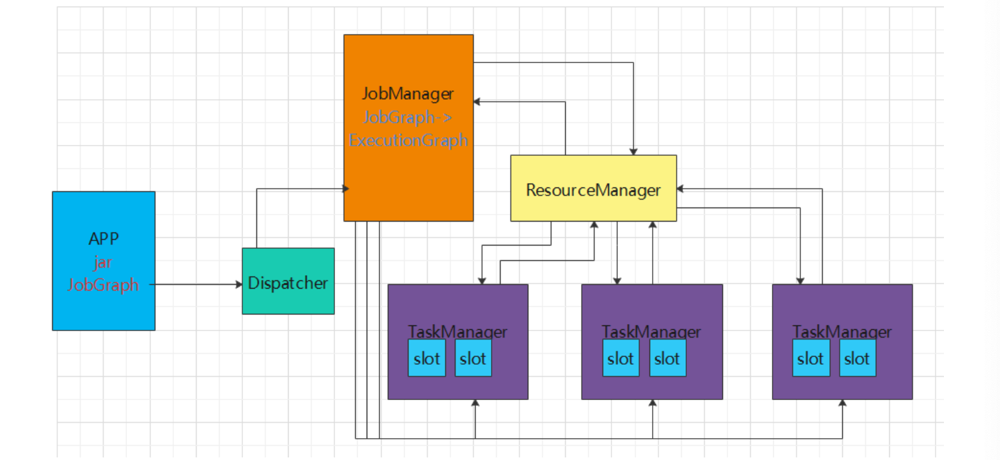
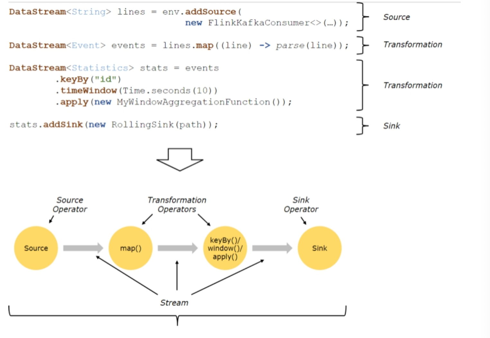
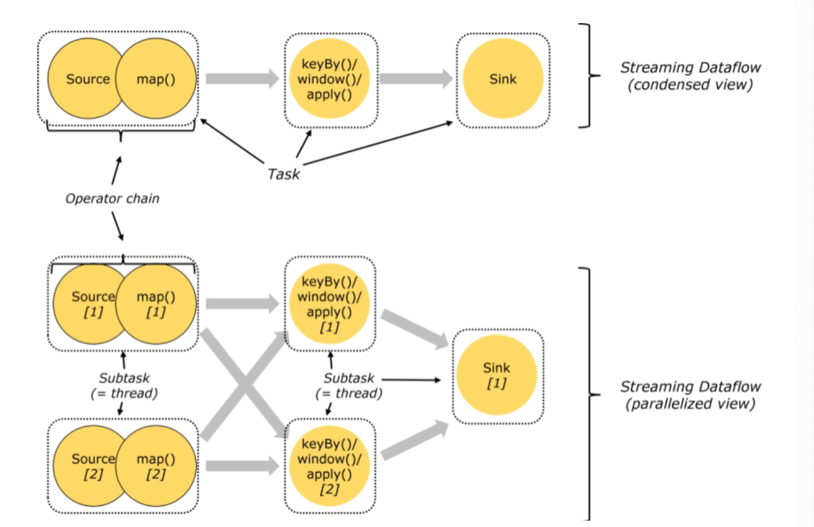
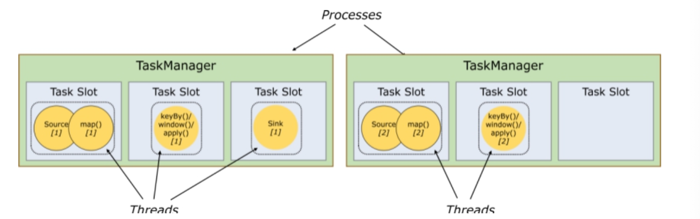
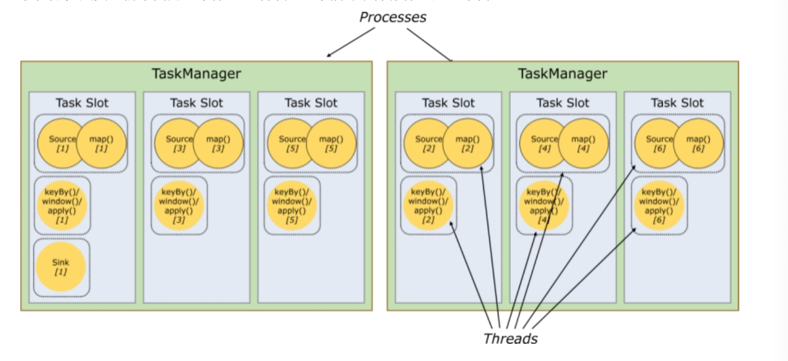
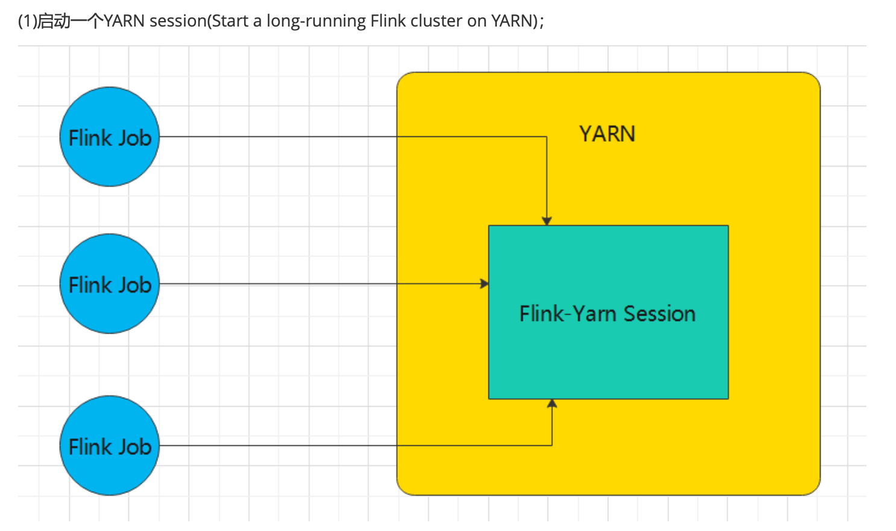
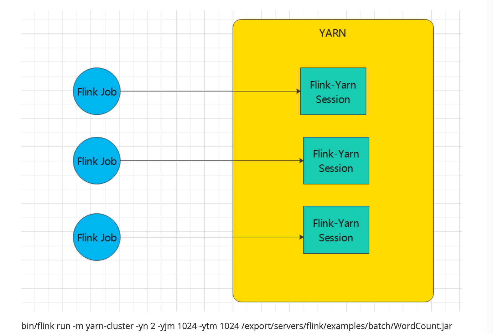
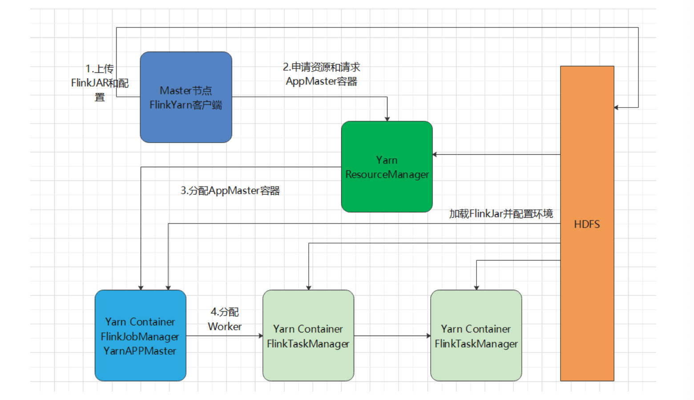
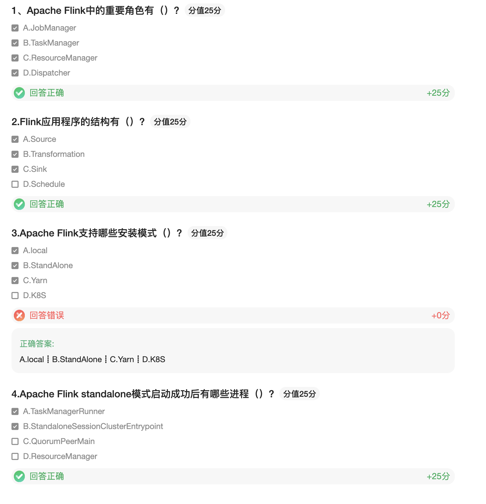

### Flink体系结构

#### Flink的重要角色

Flink是非常经典的Master/Slave结构实现，JobManager是Master，TaskManager是slave

* JobManager处理器（Master）
  * 协调分布式执行，它们用来调度task，协调检查点（CheckPoint），协调失败时恢复等
  * Flink运行时至少存在一个master处理器，如果配置高可用模式则会存在多个master处理器，它们其中有一个是leader，而其他的事standby
  * JobManager接收的应用包括jar和JobGraph
* TaskManager处理器（Slave），也称之为Worker
  * 主要职责是从JobManager处接收任务，并部署和启动任务，接收上有的数据并处理
  * TaskManager是在JVM中的一个或多个线程中执行任务的工作节点
  * TaskManager在启动的时候会想ResourceManager注册自己的资源信息（Slot的数量）
* ResoucreManager
  * 针对不同的环境和资源提供者，如（Yarn，Me搜索、Kubernetes或独立部署），Flink提供了不同的ResourceManager
  * 作用：负责管理Flink的处理资源单元--Slot（槽）
* Dispatcher
  * 作用：提供一个REST接口来让我们提交需要执行的应用
  * 一旦一个应用提交执行，Dispatcher会启动一个JobManager，并将应用转交给他
  * Dispatcher还会启动一个webUI来提供有关作业执行信息
  * 注意：某些应用的提交执行的方式，有可能用不到Dispatcher

###### 各组件之间的关系




#### Flink运行架构

###### Flink程序架构

Flink程序的基本构建块是流和转换（请注意，Flink的DataSet API中使用的DataSet也是内部流）。从概念上讲，流是（可能永无止境的）数据记录流，而转换的是将一个或多个流输入，并产生一个或多个输出流。



上图表述了Flink的应用程序架构，有Source（源头）、Transformation（转换）、Sink（接收器）三个重要的组成部分

* Source

  数据源，定义Flink从哪里加载数据，Flink在流处理和批处理上source大概有4类：基于本地集合的source、基于文件的source、基于网络套接字socket的source、自定义的source。自定义的source常见的有Apache kafka、RabbitMQ等

* Transformation

  数据转换的各种操作，也称之为算子，有Map、FlatMap、Filter、KeyBy、reduce、Window等，可以将数据转换成你想要的数据

* Sink

  接收器，Flink将转换计算后的数据发送的地点，定义了结果数据的输出方向，Flink常见的Sink大概有如下几类，写入文件、打印出来、写入Socket、自定义Sink。自定义的Sink常见的有Apache Kakfa、RabbitMQ、MySQL、ES、cassandra、HDFS等

###### Task和SubTask

* Task是一个阶段多个功能相同SubTask的集合，类似Spark中的TaskSet
* SubTask（子任务）
  * SubTask是Flink中任务最小的执行单元，是一个Java类的实例，这个Java类中有属性和方法，完成具体的计算逻辑
  * 比如一个执行操作Map，分布式场景下会有多个线程同时执行，每个线程执行的都叫做一个SubTask


###### Operator chain（操作器链）

Flink的所有操作都称之为Operator，客户端在提交任务的时候会对Operator进行优化操作，能进行合并的Operator会被合并为一个Operator，合并后的的Operator 成为Operator Chain，实际上就是一个执行链，每个执行链会在TaskManager上独立的线程中执行。




###### Flink中的数据传输

在运行过程中，应用中的任务会持续进行数据交换。为了有效利用网络资源和提高吞吐量，Flink在处理任务间的数据传输过程中，采用了缓冲区机制

###### 任务槽和槽共享

任务槽也叫做task-slot、槽共享也叫做slot sharing




每个TaskManager是一个JVM进程，可以在不同的线程中执行一个或多个子任务。

为了控制一个worker能接收多少个Task。worker通过task slot来进行控制（一个worker至少有一个Task slot）

* 任务槽

  每个Task slot 表示TaskManager拥有资源的一个固定大小的子集，一般来说，我们分配槽的个数都是和CPU的核数相等，比如6核，那么就分配6核。

  Flink将进程的内存进行划分到多个slot中。假设一个TaskManager有3个slot，那么每个slot占有1/3的内存（平分）

  内存被划分到不同的slot之后可以获得如下好处：

  * TaskManager最多能同时并发执行的任务是可以控制的，那就是3个，因为不能超过slot的数量
  * slot有独立的内存空间，这样在一个TaskManager中可以运行不同的作业，作业之间不受影响

* 槽共享

  默认情况下，Flink允许子任务subtask（map[1] map[2] keyby[1] keyby[2]）共享插槽，即使他们是不同任务的子任务，只要它们来自同一个任务。结果是一个槽可以保存作业的整个管道。



### Flink安装和部署

Flink支持多种安装模式

* local（本地）：单机模式，一般本地开发调试使用
* StandAlone独立模式：Flink自带集群，自己管理资源调度，生产环境也会有所应用
* Yarn模式：计算资源统一由Hadoop Yarn管理，生产环境应用较多

#### 环境准备工作

###### 基础环境

* jdk1.8及以上【配置JAVA_HOME环境变量】 
* ssh免密码登录【集群内节点之间免密登录】

###### StandAlone模式部署

修改flink-conf.yaml文件

```properties
jobmanager.rpc.address: linux120
#设置每个TaskManager有几个Slot，一般设置与CPU核数相同
taskmanager.numberOfTaskSlots: 2
```

修改master文件

```properties
linux120
```

修改worker文件

```properties
linux120
linux121
linux122
linux123
```

修改zoo.cfg

```properties
server.1=linux120:2888:3888
```

启动集群：

```shell
./bin/start-cluster.sh
```

###### Yarn模式部署




2、直接在YARN上提交运行Flink作业(Run a Flink job on YARN)









