### Flink Time

#### Time

在Flink流式处理中，会涉及到时间的不同概念，如下图所示


* Event Time：事件发生的时间
* Ingestion Time：时间进入到Flink的时间
* Processing Time：Flink的处理时间。某个Flink节点执行某个operation的时间

如果以ProcessingTime基础来定义时间窗口，那将形成ProcessingTimeWindow，以operator的systemTime为准，在Flink流式处理中，绝大部分的业务都会使用eventTime，只在EventTime无法使用时，才会被迫使用ProcessingTime或者IngestionTime。

如果要使用EventTime，那么需要引入EventTime的时间属性，引入方式如下所示: env.setStreamTimeCharacteristic(TimeCharacteristic.EventTime) //设置使用事件时间

#### 数据延迟产生的问题

###### 示例1 

现在假设，你正在去往地下停车场的路上，并且打算用手机点一份外卖。

选好了外卖后，你就用在线支付功能付款了，这个时候是11点50分。恰好这时，你走进了地下停车库，而这里并没 有手机信号。因此外卖的在线支付并没有立刻成功，而支付系统一直在Retry重试“支付”这个操作。

当你找到自己的车并且开出地下停车场的时候，已经是12点05分了。这个时候手机重新有了信号，手机上的支付数 据成功发到了外卖在线支付系统，支付完成。

在上面这个场景中你可以看到，支付数据的事件时间是11点50分，而支付数据的处理时间是12点05分 一般在实际开发中会以事件时间作为计算标准

###### 示例2

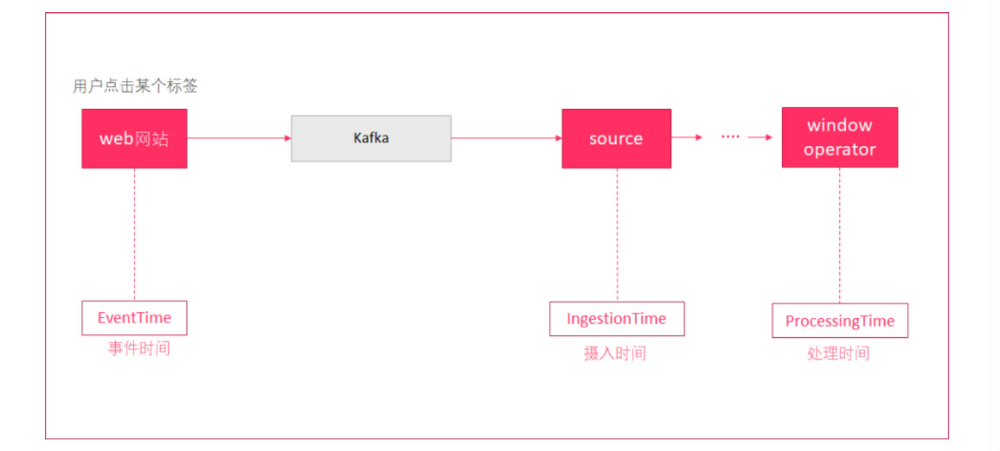

一条日志进入Flink的时间为2019-08-12 10:00:01，摄入时间 

到达Window的系统时间为2019-08-12 10:00:02，处理时间 

日志的内容为:2019-08-12 09:58:02 INFO Fail over to rm2 ,事件时间 

对于业务来说，要统计1h内的故障日志个数，哪个时间是最有意义的?---事件时间 EventTime，因为我们要根据日志的生成时间进行统计。

###### 示例3

某 App 会记录用户的所有点击行为，并回传日志(在网络不好的情况下，先保存在本地，延后回传)。

A 用户在 11:02 对 App 进行操作，B 用户在 11:03 操作了 App，

但是 A 用户的网络不太稳定，回传日志延迟了，导致我们在服务端先接受到 B 用户 11:03 的消息，然后再接受到 A 用户 11:02 的消息，消息乱序了。

###### 示例4

在实际环境中，经常会出现，因为网络原因，数据有可能会延迟一会才到达Flink实时处理系统。 我们先来设想一下下面这个场景:

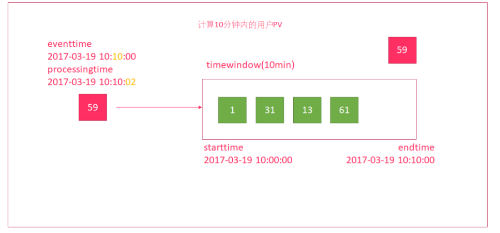

1. 使用时间窗口来统计10分钟内的用户流量 
2. 有一个时间窗口
   - 开始时间为:2017-03-19 10:00:00 - 结束时间为:2017-03-19 10:10:00

3. 有一个数据，因为网络延迟

   - 事件发生的时间为:2017-03-19 10:10:00

   - 但进入到窗口的时间为:2017-03-19 10:10:02，延迟了2秒中

4. 时间窗口并没有将59这个数据计算进来，导致数据统计不正确 

这种处理方式，根据消息进入到window时间来进行计算。在网络有延迟的时候，会引起计算误差。 如何解决?

使用水印解决网络延迟问题 通过上面的例子,我们知道,在进行数据处理的时候应该按照事件时间进行处理,也就是窗口应该要考虑到事件时间 但是窗口不能无限的一直等到延迟数据的到来,需要有一个触发窗口计算的机制 也就是我们接下来要学的watermaker水位线/水印机制

#### 使用Watermark解决

水印（watermark）就是一个时间戳，Flink可以给数据流添加水印，可以理解为:收到一条消息后，额外给这个消息添加了一个时间字段，这就是添加水印，水印并不会影响原有的Eventtime事件时间，但数据流添加水印后，会按照水印时间来触发窗口计算。

也就是说watermark水印是用来触发窗口计算的。一般会设置水印时间，比事件时间小几秒钟，表示允许数据延迟达到多少（即水印时间=事件时间 - 允许延迟时间）

当接收到的水印时间 >= 窗口结束时间，则触发计算，如等到一条数据的水印的时间为：10:10:00 >= 10:10:00 才触发计 算,也就是要等到事件时间为10:10:03的数据到来才触发计算

(即事件时间 - 允许延迟时间 >= 窗口结束时间 或 事件时间 >= 窗口结束时间 + 允许延迟时间)

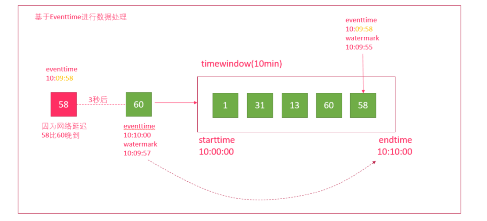

总结:watermaker是用来解决延迟数据的问题

如窗口10:00:00~10:10:00, 而数据到达的顺序是: A 10:10:00 ,B 10:09:58 如果没有watermaker,那么A数据将会触发窗口计算,B数据来了窗口已经关闭,则该数据丢失 那么如果有了watermaker,设置允许数据迟到的阈值为3s,那么该窗口的结束条件则为 水印时间>=窗口结束时间10:10:00,也就是需要有一条数据的水印时间= 10:10:00 而水印时间10:10:00= 事件时间- 延迟时间3s 也就是需要有一条事件时间为10:10:03的数据到来,才会真正的触发窗口计算.

而上面的 A 10:10:00 ,B 10:09:58都不会触发计算,也就是会被窗口包含,直到10:10:03的数据到来才会计算窗口 10:00:00~10:10:00的数据


#### Watermark案例

###### 步骤:

 1、获取数据源

 2、转化

 3、声明水印(watermark)

 4、分组聚合，调用window的操作

 5、保存处理结果

**注意:**

当使用EventTimeWindow时，所有的Window在EventTime的时间轴上进行划分， 也就是说，在Window启动后，会根据初始的EventTime时间每隔一段时间划分一个窗口， 如果Window大小是3秒，那么1分钟内会把Window划分为如下的形式: 

[00:00:00,00:00:03)

[00:00:03,00:00:06)

[00:00:03,00:00:09)

[00:00:03,00:00:12)

[00:00:03,00:00:15)

[00:00:03,00:00:18)

[00:00:03,00:00:21)

[00:00:03,00:00:24)

...

[00:00:57,00:00:42)

[00:00:57,00:00:45)

[00:00:57,00:00:48)
 ... 

如果Window大小是10秒，则Window会被分为如下的形式: 

[00:00:00,00:00:10)

[00:00:10,00:00:20) 

... 

[00:00:50,00:01:00)


注意: 

1. 窗口是左闭右开的，形式为:[window_start_time,window_end_time)。

2. Window的设定基于第一条消息的事件时间，也就是说，Window会一直按照指定的时间间隔进行划分，不论这个 Window中有没有数据，EventTime在这个Window期间的数据会进入这个Window。

3. Window会不断产生，属于这个Window范围的数据会被不断加入到Window中，所有未被触发的Window都会等待触发，只要Window还没触发，属于这个Window范围的数据就会一直被加入到Window中，直到Window被触发才会停止数据的追加，而当Window触发之后才接受到的属于被触发Window的数据会被丢弃。

4. Window会在以下的条件满足时被触发执行: 
   - 在[window_start_time,window_end_time)窗口中有数据存在 
   - watermark时间 >= window_end_time; 
5. 一般会设置水印时间，比事件时间小几秒钟,表示最大允许数据延迟达到多久 (即水印时间 = 事件时间 - 允许延迟时间)、当接收到的水印时间 >= 窗口结束时间且窗口内有数据，则触发计算 (即事件时间 - 允许延迟时间 >= 窗口结束时间 或 事件时间 >= 窗口结束时间 + 允许延迟时间)

###### 代码实现

数据源:

```
01,1586489566000
01,1586489567000
01,1586489568000
01,1586489569000
01,1586489570000
01,1586489571000
01,1586489572000
01,1586489573000
01,1586489574000
01,1586489575000
01,1586489576000
01,1586489577000

2020-04-10 11:32:46 
2020-04-10 11:32:47 
2020-04-10 11:32:48 
2020-04-10 11:32:49 
2020-04-10 11:32:50
```

代码:

```java
package stream.water;

import org.apache.flink.api.common.eventtime.*;
import org.apache.flink.api.common.functions.MapFunction;
import org.apache.flink.api.java.tuple.Tuple2;
import org.apache.flink.streaming.api.TimeCharacteristic;
import org.apache.flink.streaming.api.datastream.DataStreamSource;
import org.apache.flink.streaming.api.datastream.KeyedStream;
import org.apache.flink.streaming.api.datastream.SingleOutputStreamOperator;
import org.apache.flink.streaming.api.datastream.WindowedStream;
import org.apache.flink.streaming.api.environment.StreamExecutionEnvironment;
import org.apache.flink.streaming.api.functions.windowing.WindowFunction;
import org.apache.flink.streaming.api.windowing.assigners.TumblingEventTimeWindows;
import org.apache.flink.streaming.api.windowing.time.Time;
import org.apache.flink.streaming.api.windowing.windows.TimeWindow;
import org.apache.flink.util.Collector;

import java.text.SimpleDateFormat;
import java.util.ArrayList;
import java.util.Collections;
import java.util.Iterator;

/**
 * @description:
 * @author: huanghongbo
 * @date: 2021-01-16 14:05
 **/
public class WaterDemo {


    public static void main(String[] args) throws Exception {

        // 1、获取数据源
        StreamExecutionEnvironment executionEnvironment = StreamExecutionEnvironment.getExecutionEnvironment();
        //使用eventTime处理事件
        executionEnvironment.setStreamTimeCharacteristic(TimeCharacteristic.EventTime);
        //设置周期
        executionEnvironment.getConfig().setAutoWatermarkInterval(1000L);
        executionEnvironment.setParallelism(1);
        DataStreamSource<String> dataStreamSource = executionEnvironment.socketTextStream("hhb", 9999);

        //2、转化
        SingleOutputStreamOperator<Tuple2<String, Long>> mapStream = dataStreamSource.map(new MapFunction<String, Tuple2<String, Long>>() {
            @Override
            public Tuple2<String, Long> map(String value) throws Exception {
                String[] arr = value.split(",");
                return new Tuple2<>(arr[0], Long.valueOf(arr[1]));
            }
        });
        SimpleDateFormat simpleDateFormat = new SimpleDateFormat("yyyy-MM-dd HH:mm:ss");

        //3、声明水印(watermark)
        SingleOutputStreamOperator<Tuple2<String, Long>> waterMarkStream = mapStream.assignTimestampsAndWatermarks(new WatermarkStrategy<Tuple2<String, Long>>() {
            @Override
            public WatermarkGenerator<Tuple2<String, Long>> createWatermarkGenerator(WatermarkGeneratorSupplier.Context context) {
                return new WatermarkGenerator<Tuple2<String, Long>>() {
                    
                    //直接使用long的最小值有一个bug， maxTimeStamp（负数） - maxOutOrderNeed  > 0
                    private Long maxTimeStamp = Long.MIN_VALUE;

                    private Long maxOutOrderNeed = 3000L;


                    @Override
                    public void onEvent(Tuple2<String, Long> event, long eventTimestamp, WatermarkOutput output) {
                        maxTimeStamp = Math.max(maxTimeStamp, event.f1);
                        System.err.println("maxTimeStamp:" + simpleDateFormat.format(maxTimeStamp));
                    }

                    //周期性的广播WaterMark的time
                    @Override
                    public void onPeriodicEmit(WatermarkOutput output) {
                        //上面设置executionEnvironment.getConfig().setAutoWatermarkInterval(1000L);
                        //所以每秒执行一次
//                        System.err.println("============");
                        if (maxTimeStamp > 0 && maxTimeStamp - maxOutOrderNeed > 0) {
                            output.emitWatermark(new Watermark(maxTimeStamp - maxOutOrderNeed));
                        }

                    }
                };
            }
        }.withTimestampAssigner(new SerializableTimestampAssigner<Tuple2<String, Long>>() {
            @Override
            public long extractTimestamp(Tuple2<String, Long> element, long recordTimestamp) {
                return element.f1;
            }
        }));

        //4、分组聚合，调用window的操作
        KeyedStream<Tuple2<String, Long>, String> keyedStream = waterMarkStream.keyBy(value -> value.f0);
        WindowedStream<Tuple2<String, Long>, String, TimeWindow> window = keyedStream.window(TumblingEventTimeWindows.of(Time.seconds(4)));
        SingleOutputStreamOperator<String> result = window.apply(new WindowFunction<Tuple2<String, Long>, String, String, TimeWindow>() {
            @Override
            public void apply(String s, TimeWindow window, Iterable<Tuple2<String, Long>> input, Collector<String> out) throws Exception {

                System.out.println("..." + simpleDateFormat.format(window.getStart()));
                String key = s;
                Iterator<Tuple2<String, Long>> iterator = input.iterator();
                ArrayList<Long> list = new ArrayList<>();
                while (iterator.hasNext()) {
                    Tuple2<String, Long> next = iterator.next();
                    list.add(next.f1);
                }
                Collections.sort(list);
                String result = "key:" + key + "..." + "list.size:" + list.size() + "...list.first:" + simpleDateFormat.format(list.get(0)) + "...list.last:" + simpleDateFormat.format(list.get(list.size() - 1)) + "...window.start:" + simpleDateFormat.format(window.getStart()) + "..window.end:" + simpleDateFormat.format(window.getEnd());
                out.collect(result);
            }
        });
        //5、保存处理结果
        result.print();

        executionEnvironment.execute();
    }
}
```

### Flink的State

State:用来保存计算结果或缓存数据

#### 状态类型

Flink根据是否需要保存中间结果，把计算分为有状态计算和无状态计算

* 有状态计算：依赖之前或之后的事件

* 无状态计算：独立

根据数据结构不同，Flink定义了多种state，应用不同的场景

* ValueState：即类型为T的单值状态。这个状态与对应的key绑定，是最简单的状态，他可以通过update方法更新状态值，通过value()方法获取状态值。
* ListState：即key上的状态值为一个列表。可以通过add方法往列表中附加值，也可以通过get()方法返回一个 `Iterable<T>`来遍历状态值
* ReducingState：这种状态通过用户传入的reduceFunction，每次调用add方法添加值得时候，会调用reduceFunction，最后合并到一个单一的状态值
* FoldingState：跟ReducingState有点类似，不过它的状态值类型可以与 add 方法中传入的元素类型不同(这种 状态将会在Flink未来版本中被删除)。
* MapState：即状态值是一个map。用户通过put或putAll方法添加元素

State按照是否有key划分KeyedState和OperatorState，Keyed state：KeyedStream流上的每一个key都对应一个State

案例：利用state求平均值,原始数据:(1,3)(1,5)(1,7)(1,4)(1,2)

思路：

1. 读取数据源

2. 将数据源根据key分组

3. 按照key分组策略，对流式数据调用状态化处理
   - 在处理过程中：实例化一个状态实例
   - 随着流式数据的到来，更新状态
4. 输出计算结果

代码

```java
package stream.state;

import org.apache.flink.api.common.functions.MapFunction;
import org.apache.flink.api.common.functions.RichFlatMapFunction;
import org.apache.flink.api.common.state.ValueState;
import org.apache.flink.api.common.state.ValueStateDescriptor;
import org.apache.flink.api.common.typeinfo.TypeHint;
import org.apache.flink.api.common.typeinfo.TypeInformation;
import org.apache.flink.api.java.tuple.Tuple2;
import org.apache.flink.configuration.Configuration;
import org.apache.flink.streaming.api.datastream.DataStreamSource;
import org.apache.flink.streaming.api.datastream.KeyedStream;
import org.apache.flink.streaming.api.datastream.SingleOutputStreamOperator;
import org.apache.flink.streaming.api.environment.StreamExecutionEnvironment;
import org.apache.flink.util.Collector;

/**
 * @description:
 * @author: huanghongbo
 * @date: 2021-01-16 15:45
 **/
public class KeyStateDemo {


    public static void main(String[] args) throws Exception {


        StreamExecutionEnvironment executionEnvironment = StreamExecutionEnvironment.getExecutionEnvironment();

        //每两秒调用一次checkPoint
        executionEnvironment.enableCheckpointing(2000L);

        //1、读数据源
        DataStreamSource<Tuple2<Long, Long>> dataStreamSource = executionEnvironment.fromElements(new Tuple2<>(1L, 1L),
                new Tuple2<>(1L, 3L), new Tuple2<>(1L, 5L), new Tuple2<>(1L, 7L), new Tuple2<>(1L, 9L));

        //2、将数据源根据key分组
        KeyedStream<Tuple2<Long, Long>, Long> keyStream = dataStreamSource.keyBy(value -> value.f0);

        //3、按照key分组策略，对流式数据调用状态化处理 在处理过程中:
        SingleOutputStreamOperator<Tuple2<Long, Double>> result = keyStream.flatMap(new RichFlatMapFunction<Tuple2<Long, Long>, Tuple2<Long, Double>>() {

            private ValueState<Tuple2<Long, Long>> state;

            @Override
            public void open(Configuration parameters) throws Exception {
                //a、实例化出一个状态实例
                ValueStateDescriptor<Tuple2<Long, Long>> valueStateDescriptor = new ValueStateDescriptor<Tuple2<Long, Long>>(
                        "average",
                        TypeInformation.of(new TypeHint<Tuple2<Long, Long>>() {
                        }),
                        Tuple2.of(0L, 0L)

                );

                state = getRuntimeContext().getState(valueStateDescriptor);

                super.open(parameters);
            }

          // b、随着流式数据的到来，更新状态
            @Override
            public void flatMap(Tuple2<Long, Long> value, Collector<Tuple2<Long, Double>> out) throws Exception {
                Tuple2<Long, Long> currValue = state.value();
                currValue.f0 += 1;
                currValue.f1 += value.f1;
                state.update(currValue);
                if (currValue.f0 == 2) { //每两个结果向外输出一次
                    double result = currValue.f1 * 1.0 / currValue.f0;
                    out.collect(new Tuple2<>(value.f0, result));
                    state.clear();
                }
            }
        });

        result.print();
//        result.addSink(new OperatorStateDemo(5));
        executionEnvironment.execute();

    }
}
```

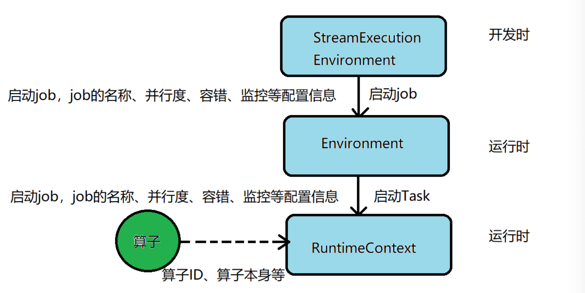

Operatior State代码：

```java
package stream.state;

import org.apache.flink.api.common.state.ListState;
import org.apache.flink.api.common.state.ListStateDescriptor;
import org.apache.flink.api.common.typeinfo.TypeHint;
import org.apache.flink.api.common.typeinfo.TypeInformation;
import org.apache.flink.api.java.tuple.Tuple2;
import org.apache.flink.runtime.state.FunctionInitializationContext;
import org.apache.flink.runtime.state.FunctionSnapshotContext;
import org.apache.flink.streaming.api.checkpoint.CheckpointedFunction;
import org.apache.flink.streaming.api.functions.sink.SinkFunction;

import java.util.ArrayList;
import java.util.List;

/**
 * @description:
 * @author: huanghongbo
 * @date: 2021-01-16 17:16
 **/
public class OperatorStateDemo implements SinkFunction<Tuple2<Long, Double>>, CheckpointedFunction {

    private ListState<Tuple2<Long, Double>> listState;

    private List<Tuple2<Long, Double>> list;

    private int count = 1;

    public OperatorStateDemo(int count) {
        this.count = count;
        this.list = new ArrayList<>();
    }

    /**
     * 该方法在每次调用checkPoint的时候调用
     */
    @Override
    public void snapshotState(FunctionSnapshotContext context) throws Exception {
        System.err.println("snapshotState 被调用");
        listState.clear();
        for (Tuple2<Long, Double> tuple2 : list) {
            listState.add(tuple2);
        }
    }

    /**
     * function初始化的时候调用，一个slot就会初始化一次
     *
     * @param context
     * @throws Exception
     */
    @Override
    public void initializeState(FunctionInitializationContext context) throws Exception {
        System.err.println("initializeState被调用");
        //创建状态描述器
        ListStateDescriptor<Tuple2<Long, Double>> listStateDescriptor = new ListStateDescriptor<>(
                "OperatorStateDemo",
                TypeInformation.of(new TypeHint<Tuple2<Long, Double>>() {
                })
        );
        //创建状态
        listState = context.getOperatorStateStore().getListState(listStateDescriptor);
        // 当程序发生异常的时候，该结果变为true
        if (context.isRestored()) {
            for (Tuple2<Long, Double> tuple2 : listState.get()) {
                list.add(tuple2);
            }
        }
    }

    /**
     * 每条数据进入的时候调用,sink的方法
     *
     * @param value
     * @param context
     * @throws Exception
     */
    @Override
    public void invoke(Tuple2<Long, Double> value, Context context) throws Exception {
        list.add(value);
        //当调用transformation 调用 sink的次数达到 count次，输出，并将缓存的结果三处
        if (list.size() == count) {
            System.err.println("out：" + list);
            list.clear();
        }
    }
}
```

```java
package stream.state;

import org.apache.flink.api.common.functions.MapFunction;
import org.apache.flink.api.common.functions.RichFlatMapFunction;
import org.apache.flink.api.common.state.ValueState;
import org.apache.flink.api.common.state.ValueStateDescriptor;
import org.apache.flink.api.common.typeinfo.TypeHint;
import org.apache.flink.api.common.typeinfo.TypeInformation;
import org.apache.flink.api.java.tuple.Tuple2;
import org.apache.flink.configuration.Configuration;
import org.apache.flink.streaming.api.datastream.DataStreamSource;
import org.apache.flink.streaming.api.datastream.KeyedStream;
import org.apache.flink.streaming.api.datastream.SingleOutputStreamOperator;
import org.apache.flink.streaming.api.environment.StreamExecutionEnvironment;
import org.apache.flink.util.Collector;

/**
 * @description:
 * @author: huanghongbo
 * @date: 2021-01-16 15:45
 **/
public class KeyStateDemo {


    public static void main(String[] args) throws Exception {


        StreamExecutionEnvironment executionEnvironment = StreamExecutionEnvironment.getExecutionEnvironment();

        //每两秒调用一次checkPoint
        executionEnvironment.enableCheckpointing(2000L);

        //1、读数据源
//        DataStreamSource<Tuple2<Long, Long>> dataStream = executionEnvironment.fromElements(new Tuple2<>(1L, 1L),
//                new Tuple2<>(1L, 3L), new Tuple2<>(1L, 5L), new Tuple2<>(1L, 7L), new Tuple2<>(1L, 9L));


        //[root@hhb ~]# nc -lp 9999
        //1,1
        //1,2
        //1,3
        //1,4
        //1,5
        //1,6
        //1,7
        //1,8
        //1,9
        //a,b
        //[root@hhb ~]# nc -lp 9999
        //1,10
        //[root@hhb ~]#
        // out：[(1,5.5), (1,4.5), (1,3.5), (1,4.5), (1,9.5)]
        DataStreamSource<String> dataStreamSource = executionEnvironment.socketTextStream("hhb", 9999);
        SingleOutputStreamOperator<Tuple2<Long, Long>> mapStream = dataStreamSource.map(new MapFunction<String, Tuple2<Long, Long>>() {
            @Override
            public Tuple2<Long, Long> map(String value) throws Exception {

                String[] split = value.split(",");
                return new Tuple2<Long, Long>(Long.valueOf(split[0]), Long.valueOf(split[1]));
            }
        });


        //2、将数据源根据key分组
        KeyedStream<Tuple2<Long, Long>, Long> keyStream = mapStream.keyBy(value -> value.f0);

        //3、按照key分组策略，对流式数据调用状态化处理 在处理过程中:
        SingleOutputStreamOperator<Tuple2<Long, Double>> result = keyStream.flatMap(new RichFlatMapFunction<Tuple2<Long, Long>, Tuple2<Long, Double>>() {

            private ValueState<Tuple2<Long, Long>> state;

            @Override
            public void open(Configuration parameters) throws Exception {
                //a、实例化出一个状态实例
                ValueStateDescriptor<Tuple2<Long, Long>> valueStateDescriptor = new ValueStateDescriptor<Tuple2<Long, Long>>(
                        "average",
                        TypeInformation.of(new TypeHint<Tuple2<Long, Long>>() {
                        }),
                        Tuple2.of(0L, 0L)

                );

                state = getRuntimeContext().getState(valueStateDescriptor);

                super.open(parameters);
            }

            @Override
            public void flatMap(Tuple2<Long, Long> value, Collector<Tuple2<Long, Double>> out) throws Exception {
                Tuple2<Long, Long> currValue = state.value();
                currValue.f0 += 1;
                currValue.f1 += value.f1;
                state.update(currValue);
                if (currValue.f0 == 2) { //每两个结果向外输出一次
                    double result = currValue.f1 * 1.0 / currValue.f0;
                    out.collect(new Tuple2<>(value.f0, result));
                    state.clear();
                }
            }
        });

//        result.print();
        result.addSink(new OperatorStateDemo(5));

        executionEnvironment.execute();

    }
}
```

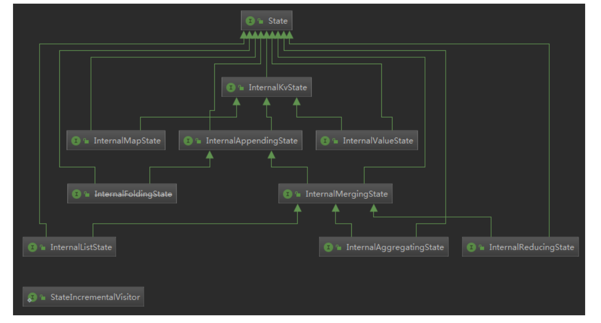

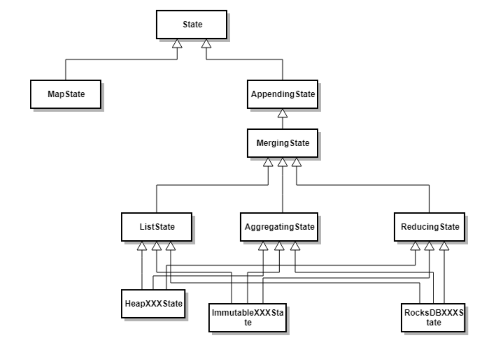


###### Key State

表示和Key相关的一种state，只能用于KeyedStream类型数据集对应的Functions和Operators之上。Keyed State是Operator State的特例，区别在于Keyed State事先按照key对数据集进行了分区，每个 Key State仅对应一个Operator 和 key 的组合，Keyed State可以通过Key Groups进行管理，主要用于当算子并行度发生变化时，自动重新分布Keyed state数据。在系统运行过程中，一个Keyed算子实例可能运行一个或者多个Key Groups 的 keys

###### Operator State

与Keyed State不同的是，Operator State只和并行的算子实例绑定，和数据元素中的key无关，每个算子实例中持有所有的数据元素中的一部分状态数据。Operator State支持当算子实例并行度发生变化时自动重新分配状态数据。

同时在Flink的Keyed State和 Operator State均具有两种形式，其中一种为**托管状态（Managerd State）**形式，由Flink Runtime中控制和管理状态数据，并将状态数据转换成内存 Hash tables 或 ROCKSDB的对象存储，然后将这些状态数据通过内部的接口持久化到Checkpoints中，任务异常时可以通过这些状态数据恢复任务。另外一种是原生状态（**Raw State**）形式，由算子自己管理数据结构，当触发Checkpoint过程中，Flink并不知道状态数据内部的数据结构，只是将数据转换成bytes数据存储到CheckPoints中，当从Checkpoint恢复任务时，算子自己在反序列化出状态的数据结构。DataStreamAPI支持使用Managerd state和 Raw State两种状态形式，在Flink中推荐用户使用Managed State管理状态数据，主要原因是Managed State能够更好地支持状态数据的重平衡以及更加完善的内存管理

#### 状态描述

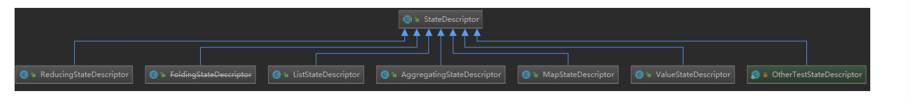

state 既然是暴露给用户的，那么需要有一些属性指定：state名称，val serializer，state type info。在对应的StateBackend中，会去调用对应的create方法获取到stateDescriptor中的值。Flink通过StateDescriptor来定义一个状态。这是一个抽象类，内部定义了状态名称、类型、序列化器等基础信息。与上面的状态对应，从stateDescriptor派生了ValueStateDescriptor、ListStateDescriptor 等descriptor

* ValueState getState(ValueStateDescriptor)

* ReducingState getReducingState(ReducingStateDescriptor) ListState 
* getListState(ListStateDescriptor)

* FoldingState getFoldingState(FoldingStateDescriptor) 
* MapState getMapState(MapStateDescriptor)

#### 广播状态

什么是广播状态？

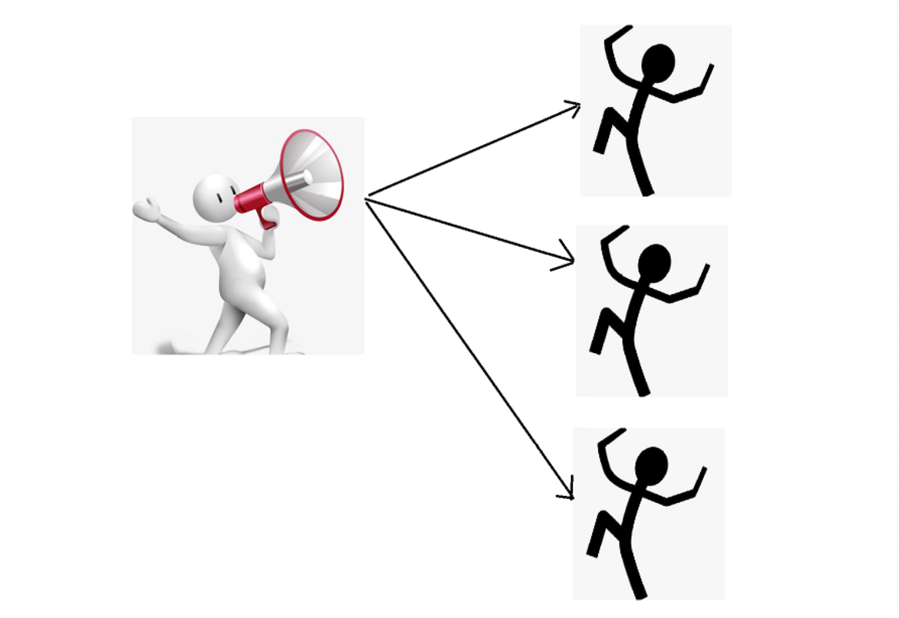

所有并行实例，这些实例将它们维持为状态，不广播留一个流的时间，而是将其发送到同一个运行商的各个实例，并与广播流的事件一起处理，新的广播状态非常适合需要加入低吞吐和高吞吐流或需要动态更新其处理逻辑的应用程序。

广播状态下的动态模式评估：

想象一下，一个电子商务网站将所有用户的交互捕获为用户操作流。运营该网站的工作有兴趣分析交互以增加收入，改善用户体验，以及检测和防止恶意行为。 该网站实现了一个流应用程序，用于检测用户事件流上的模式。但是，公司希望每次模式更改时都避免修改和重新部署应用程序。相反，应用程序在从模式流接收新模式时摄取第二个模式流并更新其活动模式。在下文中，我们将逐步讨论此应用程序，并展示它如何利用Apache Flink中的广播状态功能。

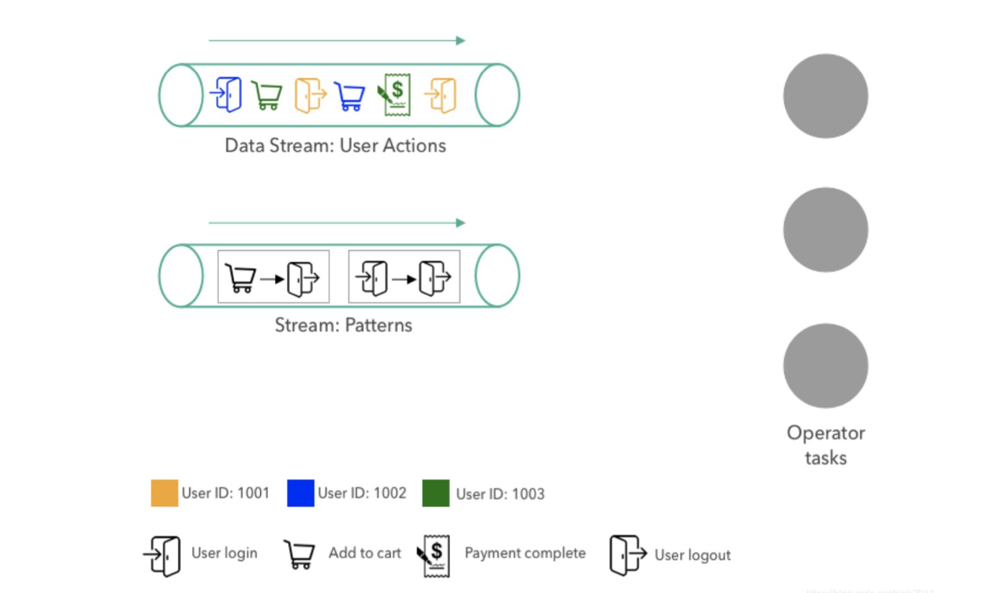

我们的示例应用程序摄取了两个数据流。第一个流在网站上提供用户操作，并在上图的左上方显示。用户交互事件包括操作的类型(用户登录，用户注销，添加到购物车或完成付款)和用户的ID，其由颜色编码。图示中的用户动作事 件流包含用户1001的注销动作，其后是用户1003的支付完成事件，以及用户1002的“添加到购物车”动作。

第二流提供应用将执行的动作模式。评估。模式由两个连续的动作组成。在上图中，模式流包含以下两个: 

* 模式1:用户登录并立即注销而无需浏览电子商务网站上的其他页面。

* 模式2:用户将商品添加到购物车并在不完成购买的情况下注销。

这些模式有助于企业更好地分析用户行为，检测恶意行为并改善网站体验。例如，如果项目被添加到购物车而没有后续购买，网站团队可以采取适当的措施来更好地了解用户未完成购买的原因并启动特定程序以改善网站转换(如提供折扣代码，限时免费送货优惠等)

在右侧，该图显示了操作员的三个并行任务，即摄取模式和用户操作流，评估操作流上的模式，并在下游发出模式匹配。为简单起见，我们示例中的运算符仅评估具有两个后续操作的单个模式。当从模式流接收到新模式时，替换当前活动模式。原则上，还可以实现运算符以同时评估更复杂的模式或多个模式，这些模式可以单独添加或移除。

我们将描述模式匹配应用程序如何处理用户操作和模式流。

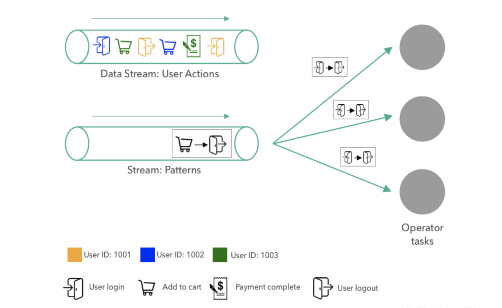

首先，将模式发送给操作员。该模式被广播到运营商的所有三个并行任务。任务将模式存储在其广播状态中。由于广 播状态只应使用广播数据进行更新，因此所有任务的状态始终预期相同。

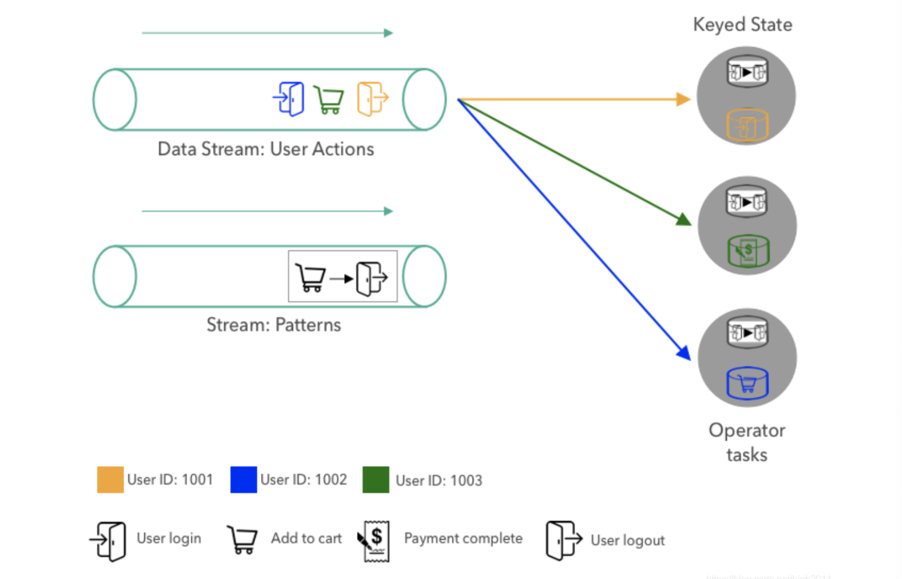

接下来，第一个用户操作按用户ID分区并发送到操作员任务。分区可确保同一用户的所有操作都由同一任务处理。上图显示了操作员任务消耗第一个模式和前三个操作事件后应用程序的状态。

当任务收到新的用户操作时，它会通过查看用户的最新和先前操作来评估当前活动的模式。对于每个用户，操作员将先前的操作存储在键控状态。由于上图中的任务到目前为止仅为每个用户收到了一个操作(我们刚刚启动了应用程序)，因此不需要评估该模式。最后，用户键控状态中的先前操作被更新为最新动作，以便能够在同一用户的下一个动作到达时查找它。

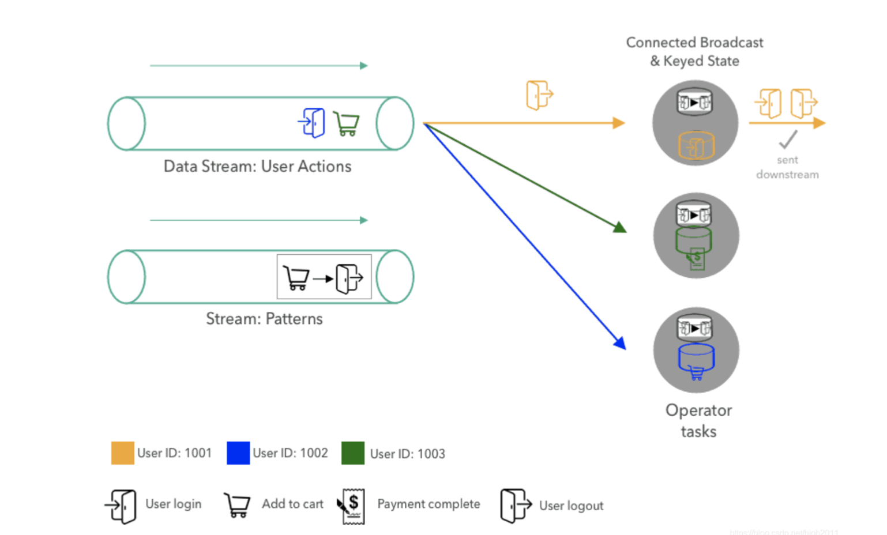

在处理前三个动作之后，下一个事件(用户1001的注销动作)被运送到处理用户1001的事件的任务。当任务接收到动作时，它从广播状态中查找当前模式并且用户1001的先前操作。由于模式匹配两个动作，因此任务发出模式匹配事件。最后，任务通过使用最新操作覆盖上一个事件来更新其键控状态。

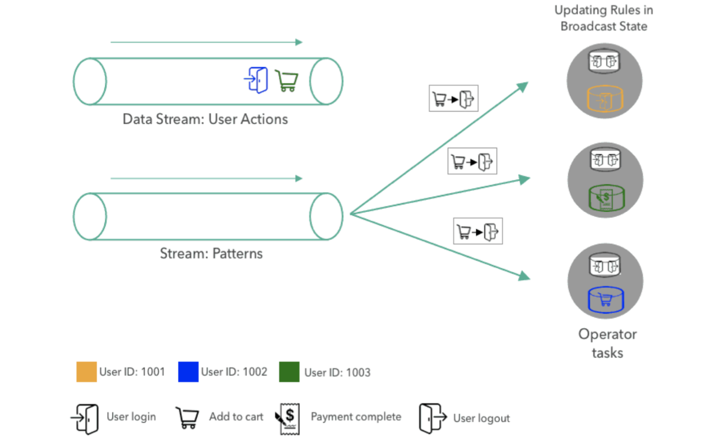

当新模式到达模式流时，它被广播到所有任务，并且每个任务通过用新模式替换当前模式来更新其广播状态。

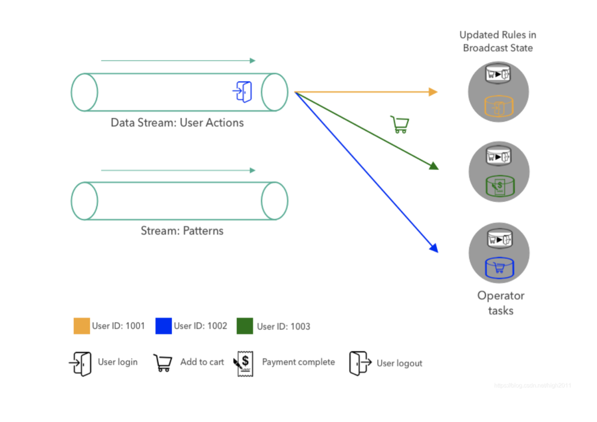一旦用新模式更新广播状态，匹配逻辑就像之前一样继续，即，用户动作事件由密钥分区并由负责任务评估。
如何使用广播状态实现应用程序?

到目前为止，我们在概念上讨论了该应用程序并解释了它如何使用广播状态来评估事件流上的动态模式。接下来，我 们将展示如何使用Flink的DataStream API和广播状态功能实现示例应用程序。

让我们从应用程序的输入数据开始。我们有两个数据流，操作和模式。在这一点上，我们并不关心流来自何处。这些流可以从Apache Kafka或Kinesis或任何其他系统中摄取。并与各两个字段的POJO:

```java
DataStream<Action> actions = ???
DataStream<Pattern> patterns = ??? 
Action Pattern
```

作为第一步，我们在属性上键入操作流。接下来，我们准备广播状态。广播状态始终表示为Flink提供的最通用的状态原语。由于我们的应用程序一次只评估和存储一个，我们将广播状态配置为具有键类型和值类型。使用广播状态，我们在流上应用转换并接收 。在我们获得了keyed Stream和广播流之后，我们都流式传输并应用了一个 userId

```java
package stream.state;

import org.apache.flink.api.common.functions.FilterFunction;
import org.apache.flink.api.common.state.*;
import org.apache.flink.api.common.typeinfo.Types;
import org.apache.flink.api.java.tuple.Tuple2;
import org.apache.flink.configuration.Configuration;
import org.apache.flink.streaming.api.datastream.BroadcastStream;
import org.apache.flink.streaming.api.datastream.DataStreamSource;
import org.apache.flink.streaming.api.datastream.KeyedStream;
import org.apache.flink.streaming.api.datastream.SingleOutputStreamOperator;
import org.apache.flink.streaming.api.environment.StreamExecutionEnvironment;
import org.apache.flink.streaming.api.functions.co.KeyedBroadcastProcessFunction;
import org.apache.flink.util.Collector;

/**
 * @description:
 * @author: huanghongbo
 * @date: 2021-01-16 18:42
 **/
public class BroadcastDemoTeacher {
    public static void main(String[] args) throws Exception {
        StreamExecutionEnvironment env = StreamExecutionEnvironment.getExecutionEnvironment();
        env.setParallelism(4);
        //两套数据流，1：用户行为   2 ： 模式
        UserAction ac1 = new UserAction(1001l, "login");
        UserAction ac2 = new UserAction(1003l, "pay");
        UserAction ac3 = new UserAction(1002l, "car");
        UserAction ac4 = new UserAction(1001l, "logout");
        UserAction ac5 = new UserAction(1003l, "car");
        UserAction ac6 = new UserAction(1002l, "logout");
        DataStreamSource<UserAction> actions = env.fromElements(ac1, ac2, ac3, ac4, ac5, ac6);

        actions.filter(new FilterFunction<UserAction>() {
            @Override
            public boolean filter(UserAction value) throws Exception {
                return false;
            }
        }).setParallelism(8);

        MyPattern myPattern1 = new MyPattern("login", "logout");
        MyPattern myPattern2 = new MyPattern("car", "logout");
        DataStreamSource<MyPattern> patterns = env.fromElements(myPattern1);

        KeyedStream<UserAction, Long> keyed = actions.keyBy(value -> value.getUserId());


        //将模式流广播到下游的所有算子
        MapStateDescriptor<Void, MyPattern> bcStateDescriptor = new MapStateDescriptor<>("patterns", Types.VOID, Types.POJO(MyPattern.class));
        BroadcastStream<MyPattern> broadcastPatterns = patterns.broadcast(bcStateDescriptor);


        SingleOutputStreamOperator<Tuple2<Long, MyPattern>> process = keyed.connect(broadcastPatterns).process(new PatternEvaluator());


        //将匹配成功的结果输出到控制台
        process.print();
        env.execute();

    }

    public static class PatternEvaluator extends KeyedBroadcastProcessFunction<Long, UserAction, MyPattern, Tuple2<Long, MyPattern>> {
        ValueState<String> prevActionState;

        @Override
        public void open(Configuration parameters) throws Exception {
            //初始化KeyedState
            prevActionState = getRuntimeContext().getState(new ValueStateDescriptor<String>("lastAction", Types.STRING));
        }

        //没来一个Action数据，触发一次执行
        @Override
        public void processElement(UserAction value, ReadOnlyContext ctx, Collector<Tuple2<Long, MyPattern>> out) throws Exception {
            //把用户行为流和模式流中的模式进行匹配
            ReadOnlyBroadcastState<Void, MyPattern> patterns = ctx.getBroadcastState(new MapStateDescriptor<>("patterns", Types.VOID, Types.POJO(MyPattern.class)));
            MyPattern myPattern = patterns.get(null);
            String prevAction = prevActionState.value();
            if (myPattern != null && prevAction != null) {
                if (myPattern.getFirstAction().equals(prevAction) && myPattern.getSecondAction().equals(value.getAction())) {
                    //如果匹配成...
                    out.collect(new Tuple2<>(ctx.getCurrentKey(), myPattern));
                } else {
                    //如果匹配不成功...
                }
            }
            prevActionState.update(value.getAction());
        }

        //每次来一个模式Pattern的时候触发执行
        @Override
        public void processBroadcastElement(MyPattern value, Context ctx, Collector<Tuple2<Long, MyPattern>> out) throws Exception {
            BroadcastState<Void, MyPattern> bcstate = ctx.getBroadcastState(new MapStateDescriptor<>("patterns", Types.VOID, Types.POJO(MyPattern.class)));
            bcstate.put(null, value);
        }
    }
}
```

* processBroadcastElement 为广播流的每个记录调用。在我们的函数中，我们只是使用键将接收到的记录放入广播状态（记住，我们只存储一个模式）。
* processElement()，为键控流的每个记录调用。他提供对广播状态的只读访问，以防止修改导致跨函数的并行实例的不同广播状态。从广播状态检索当前模式的方法和键控状态检索用户的先前动作。如果两者都存在，则检查先前和当前操作是否与模式匹配，并且如果是这种情况则发出模式匹配记录。最后，他将键控状态更新为当前用户操作。
* onTime() 在先前注册的计时触发时调用。定时器可以在任何处理方法中注册，并用于执行计算或将来清理状态。我们再示例中没有实现此方法，以保持代码简洁。但是，当用户在一段时间内未处于活跃状态时，它可用于删除用户的最后一个操作，以避免由于非活动用户而导致状态增长。

您可能已经注意到了处理方法的上下文对象。上下文对象提供对其他功能的访问，例如KeyedBroadcastProcessFunction

* 广播状态(读写或只读，取决于方法)， 
* A，可以访问记录的时间戳，当前的水印，以及可以注册计时器， TimerService 
* 当前密钥(仅适用于 )，和 processElement() 
* 一种将函数应用于每个注册密钥的键控状态的方法(仅适用于) processBroadcastElement()

在具有就像任何其他ProcessFunction完全进入状态弗林克和时间特性，因此可以用来实现复杂的应用程序逻辑。广 播状态被设计为适应不同场景和用例的多功能特性。虽然我们只讨论了一个相当简单且受限制的应用程序，但您可以 通过多种方式使用广播状态来实现应用程序的要求。 KeyedBroadcastProcessFunction

结论

在这篇博文中，我们向您介绍了一个示例应用程序，以解释Apache Flink的广播状态以及它如何用于评估事件流上的

动态模式。我们还讨论了API并展示了我们的示例应用程序的源代码。

#### 状态存储


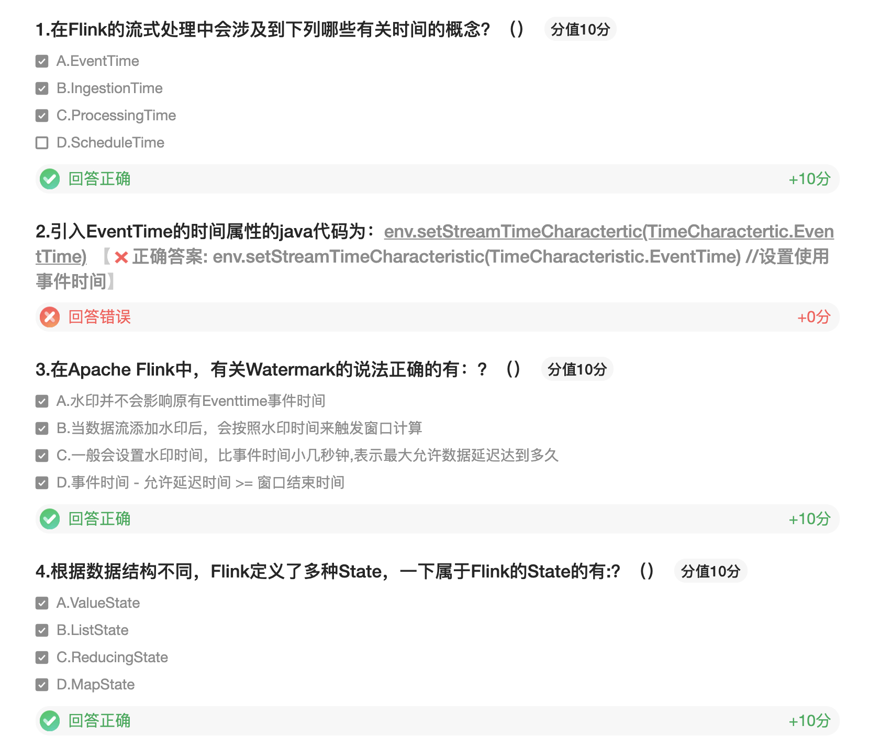

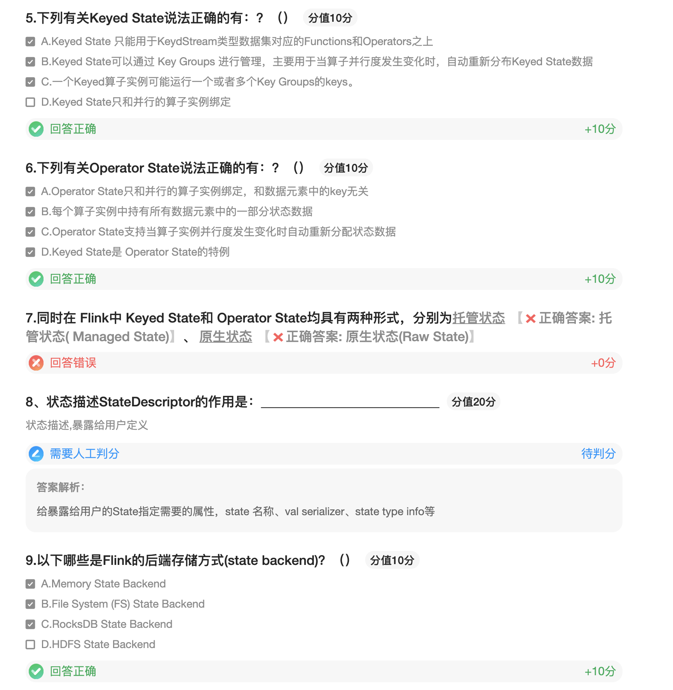