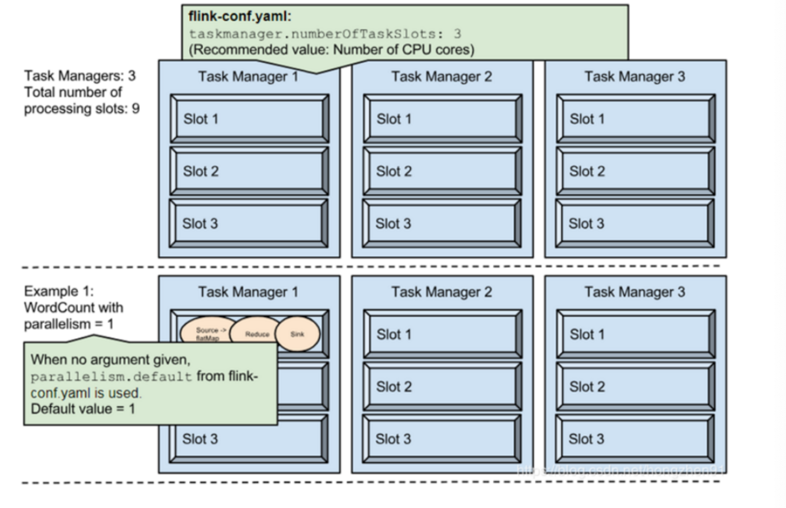
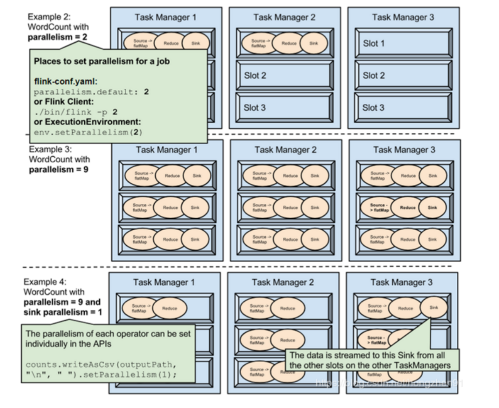
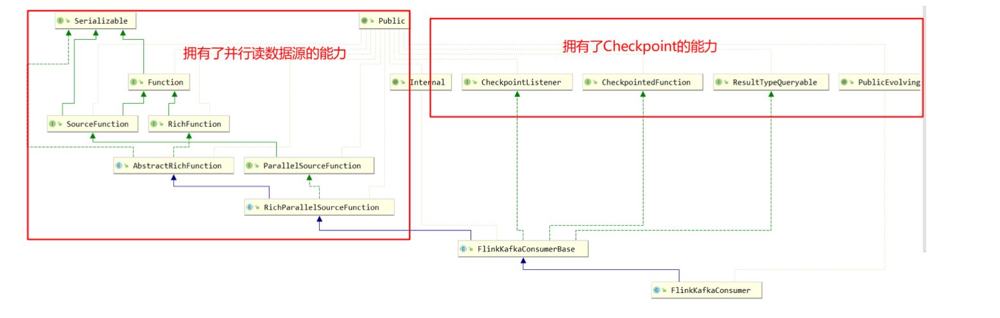
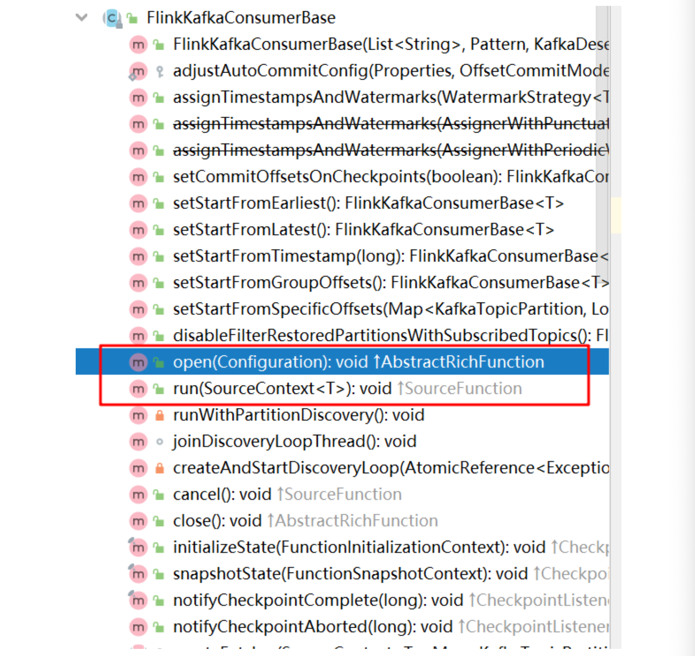
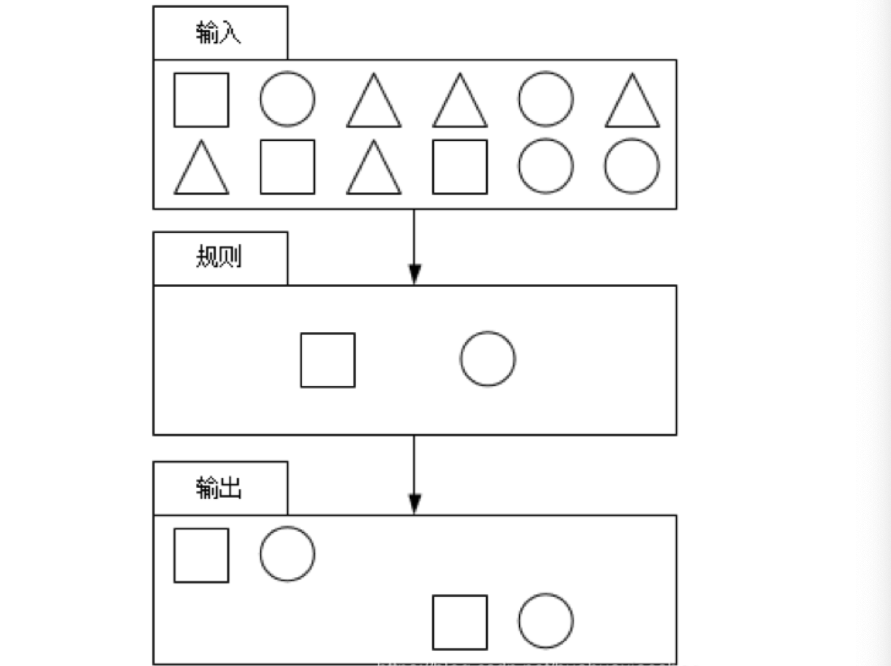
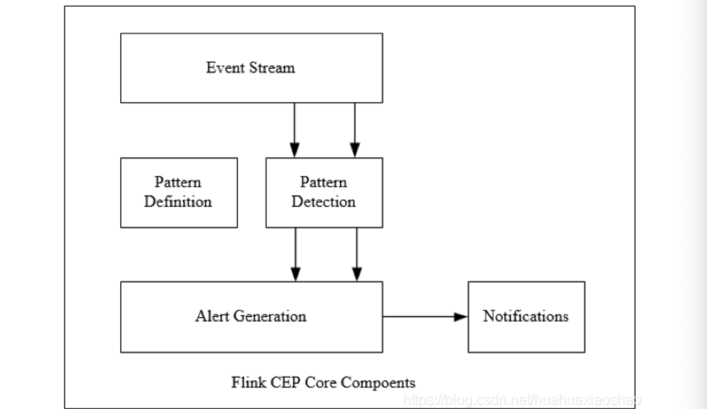
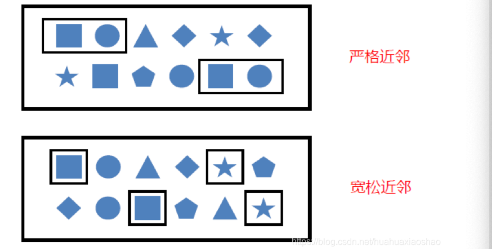
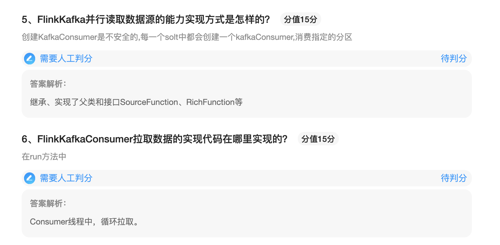
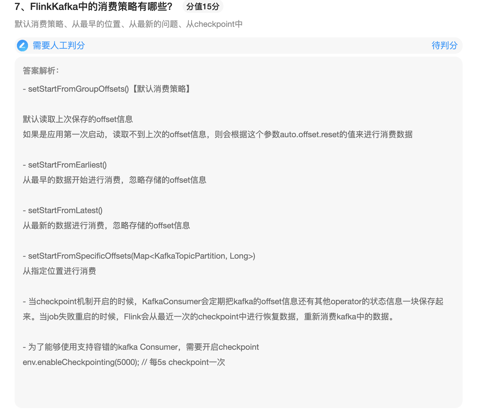

### 并行度

一个Flink程序由多个Operator组成(source、transformation和 sink)。 一个Operator由多个并行的Task(线程)来执行， 一个Operator的并行Task(线程)数目就被称为该Operator(任务)的并行度(Parallel) 并行度可以有如下几种指定方式：

* Operator Level（算子级别）（可以使用）

  一个算子、数据源和sink并行度可以通过调用setParallelism()方法来指定

  ```java
  actions.filter(new FilterFunction<UserAction>() { 
    @Override
    public boolean filter(UserAction value) throws Exception {
         return false;
  } }).setParallelism(4);
  ```

* Execution Environment Level（Env级别）可以使用

  执行环境（任务）的默认并行度可以通过调用setParallelism()方法指定。为了以并行度3来执行所有的算子、数据源和data sink，可以通过如下的方式设置环境的并行度

  执行环节的并行度可以通过显式设置算子的并行度而被重写

  ```java
  StreamExecutionEnvironment env = StreamExecutionEnvironment.getExecutionEnvironment(); 
  env.setParallelism(4);
  ```

* Client Level(客户端级别,推荐使用)(可以使用) 并行度可以在客户端将job提交到Flink时设定。 对于CLI客户端，可以通过-p参数指定并行度 ./bin/flink run -p 10 WordCount-java.jar

* System Level(系统默认级别,尽量不使用) 在系统级可以通过设置flink-conf.yaml文件中的parallelism.default属性来指定所有执行环境的默认并行度

示例：





Example1：在fink-conf.yaml中 taskmanager.numberOfTaskSlots 默认值为1，即每个Task Manager上只有一个Slot ，此处是 3

Example1中，WordCount程序设置了并行度为1，意味着程序 Source、Reduce、Sink在一个Slot中，占用一个Slot 

Example2 通过设置并行度为2后，将占用2个Slot

Example3通过设置并行度为9，将占用9个Slot

Example4 通过设置并行度为9，并且设置sink的并行度为1，则Source、Reduce将占用9个Slot，但是Sink只占用1个Slot

注意：

1. 并行度的优先级：算子级别 > env 级别 > Client 级别 > 系统默认级别（越靠前具体的代码并行度的优先级越高）
2. 如果source不可以被并行执行，即使指定了并行度为多个，也不会生效
3. 尽可能的规避算子的并行度设置，因为并行度的改变会造成task的重新划分，带来shuffle问题
4. 推荐使用任务提交的时候动态设置指定并行度
5. slot是静态的概念，指TaskManager具有并发执行能力，parallelism是动态的概念，是指程序运行实际使用的并发能力

### Flink-Connector（Kafka）

#### 源码理解

Function：UDF--处理数据的逻辑

RichFunction：open、close 管理函数的生命周期的方法....RunTimeContext函数的运行时上下文

SourceFunction：提供了自定义数据源的功能，run方法是获取数据的方法

ParallelSourceFunction：



创建一个新的流数据源消费者

Flink Kafka Consumer是一个流数据源，他从Apache提取并行数据流，使用者可以在多个并行实例中运行，每个实例将从一个或多个Kafka分区提取数据。

Flink Kafka消费者参与检查点并保证没有数据丢失，当出现故障时，计算过程只处理一次元素。 (注:这些保证自然假设Kafka本身不会丢失任何数据。)

请注意，Flink在内部快照偏移量，将其作为分布式检查点的一部分。提交到kafka上的offset只是为了使外部的 outside view of progress与Flink的view of progress同步。通过这种方式，监视和其他工作可以了解Flink Kafka消费者在某个主题上消费了多少数据。

FlinkKafkaConsumerBase:

所有的Flink Kafka Consumer 数据源的基类，这个类实现了所有Kafka版本的公共行为



Flink-Kafka-Consumer：

```java
package stream;

import org.apache.flink.api.common.functions.FlatMapFunction;
import org.apache.flink.api.common.serialization.SimpleStringSchema;
import org.apache.flink.api.java.functions.KeySelector;
import org.apache.flink.api.java.tuple.Tuple2;
import org.apache.flink.streaming.api.datastream.DataStreamSource;
import org.apache.flink.streaming.api.datastream.KeyedStream;
import org.apache.flink.streaming.api.datastream.SingleOutputStreamOperator;
import org.apache.flink.streaming.api.environment.StreamExecutionEnvironment;
import org.apache.flink.streaming.connectors.kafka.FlinkKafkaConsumer;
import org.apache.flink.util.Collector;

import java.util.Properties;

/**
 * @description:测试连接Kafka的Source
 * @author: huanghongbo
 * @date: 2021-01-13 16:32
 **/
public class StreamFromKafka {


    public static void main(String[] args) throws Exception {
        StreamExecutionEnvironment executionEnvironment = StreamExecutionEnvironment.getExecutionEnvironment();
        //连接Kafka
        String topic = "stream";
        Properties properties = new Properties();
        properties.put("bootstrap.servers", "linux120:9092");
        FlinkKafkaConsumer<String> consumer = new FlinkKafkaConsumer<>(topic, new SimpleStringSchema(), properties);
        //创建Kafka数据Source
        DataStreamSource<String> dataStream = executionEnvironment.addSource(consumer);

        SingleOutputStreamOperator<Tuple2<String, Integer>> wordAndOne = dataStream.flatMap(new FlatMapFunction<String, Tuple2<String, Integer>>() {
            @Override
            public void flatMap(String s, Collector<Tuple2<String, Integer>> collector) throws Exception {

                for (String word : s.split("\\s+")) {
                    collector.collect(new Tuple2<>(word, 1));
                }

            }
        });
        KeyedStream<Tuple2<String, Integer>, String> keyedStream = wordAndOne.keyBy(new KeySelector<Tuple2<String, Integer>, String>() {
            @Override
            public String getKey(Tuple2<String, Integer> tuple2) throws Exception {
                return tuple2.f0;
            }
        });

        SingleOutputStreamOperator<Tuple2<String, Integer>> result = keyedStream.sum(1);
        result.print();

        executionEnvironment.execute();
    }
}
```

flink-kafka 是如何消费的?以及如何分区分配等

###### open方法源码：

```java
@Override
	public void open(Configuration configuration) throws Exception {
		// determine the offset commit mode
    //指定Kafka消费方式
		this.offsetCommitMode = OffsetCommitModes.fromConfiguration(
				getIsAutoCommitEnabled(),
				enableCommitOnCheckpoints,
				((StreamingRuntimeContext) getRuntimeContext()).isCheckpointingEnabled());

		// create the partition discoverer
    //创建一个分区发现器
		this.partitionDiscoverer = createPartitionDiscoverer(
				topicsDescriptor,
				getRuntimeContext().getIndexOfThisSubtask(),
				getRuntimeContext().getNumberOfParallelSubtasks());
    // 实例化出consumer对象
		this.partitionDiscoverer.open();

    //已经订阅的分区列表
		subscribedPartitionsToStartOffsets = new HashMap<>();
    // 获取kafka中所有的分区
		final List<KafkaTopicPartition> allPartitions = partitionDiscoverer.discoverPartitions();
		if (restoredState != null) {
			for (KafkaTopicPartition partition : allPartitions) {
				if (!restoredState.containsKey(partition)) {
          //restoredState 快照，consumer是从快照中恢复的方式创建
					restoredState.put(partition, KafkaTopicPartitionStateSentinel.EARLIEST_OFFSET);
				}
			}

			for (Map.Entry<KafkaTopicPartition, Long> restoredStateEntry : restoredState.entrySet()) {
				// seed the partition discoverer with the union state while filtering out
				// restored partitions that should not be subscribed by this subtask
        //过滤一下和当前subTask没有关系的分区数据
				if (KafkaTopicPartitionAssigner.assign(
					restoredStateEntry.getKey(), getRuntimeContext().getNumberOfParallelSubtasks())
						== getRuntimeContext().getIndexOfThisSubtask()){
					subscribedPartitionsToStartOffsets.put(restoredStateEntry.getKey(), restoredStateEntry.getValue());
				}
			}

			if (filterRestoredPartitionsWithCurrentTopicsDescriptor) {
				subscribedPartitionsToStartOffsets.entrySet().removeIf(entry -> {
					if (!topicsDescriptor.isMatchingTopic(entry.getKey().getTopic())) {
						LOG.warn(
							"{} is removed from subscribed partitions since it is no longer associated with topics descriptor of current execution.",
							entry.getKey());
						return true;
					}
					return false;
				});
			}

			LOG.info("Consumer subtask {} will start reading {} partitions with offsets in restored state: {}",
				getRuntimeContext().getIndexOfThisSubtask(), subscribedPartitionsToStartOffsets.size(), subscribedPartitionsToStartOffsets);
		} else {
      // 创建一个新的consumer
			// use the partition discoverer to fetch the initial seed partitions,
			// and set their initial offsets depending on the startup mode.
			// for SPECIFIC_OFFSETS and TIMESTAMP modes, we set the specific offsets now;
			// for other modes (EARLIEST, LATEST, and GROUP_OFFSETS), the offset is lazily determined
			// when the partition is actually read.
      // consumer的消费策略
			switch (startupMode) {
				case SPECIFIC_OFFSETS:
					if (specificStartupOffsets == null) {
						throw new IllegalStateException(
							"Startup mode for the consumer set to " + StartupMode.SPECIFIC_OFFSETS +
								", but no specific offsets were specified.");
					}

					for (KafkaTopicPartition seedPartition : allPartitions) {
						Long specificOffset = specificStartupOffsets.get(seedPartition);
						if (specificOffset != null) {
							// since the specified offsets represent the next record to read, we subtract
							// it by one so that the initial state of the consumer will be correct
							subscribedPartitionsToStartOffsets.put(seedPartition, specificOffset - 1);
						} else {
							// default to group offset behaviour if the user-provided specific offsets
							// do not contain a value for this partition
							subscribedPartitionsToStartOffsets.put(seedPartition, KafkaTopicPartitionStateSentinel.GROUP_OFFSET);
						}
					}

					break;
				case TIMESTAMP:
					if (startupOffsetsTimestamp == null) {
						throw new IllegalStateException(
							"Startup mode for the consumer set to " + StartupMode.TIMESTAMP +
								", but no startup timestamp was specified.");
					}

					for (Map.Entry<KafkaTopicPartition, Long> partitionToOffset
							: fetchOffsetsWithTimestamp(allPartitions, startupOffsetsTimestamp).entrySet()) {
						subscribedPartitionsToStartOffsets.put(
							partitionToOffset.getKey(),
							(partitionToOffset.getValue() == null)
									// if an offset cannot be retrieved for a partition with the given timestamp,
									// we default to using the latest offset for the partition
									? KafkaTopicPartitionStateSentinel.LATEST_OFFSET
									// since the specified offsets represent the next record to read, we subtract
									// it by one so that the initial state of the consumer will be correct
									: partitionToOffset.getValue() - 1);
					}

					break;
				default:
					for (KafkaTopicPartition seedPartition : allPartitions) {
						subscribedPartitionsToStartOffsets.put(seedPartition, startupMode.getStateSentinel());
					}
			}

			if (!subscribedPartitionsToStartOffsets.isEmpty()) {
				switch (startupMode) {
					case EARLIEST:
						LOG.info("Consumer subtask {} will start reading the following {} partitions from the earliest offsets: {}",
							getRuntimeContext().getIndexOfThisSubtask(),
							subscribedPartitionsToStartOffsets.size(),
							subscribedPartitionsToStartOffsets.keySet());
						break;
					case LATEST:
						LOG.info("Consumer subtask {} will start reading the following {} partitions from the latest offsets: {}",
							getRuntimeContext().getIndexOfThisSubtask(),
							subscribedPartitionsToStartOffsets.size(),
							subscribedPartitionsToStartOffsets.keySet());
						break;
					case TIMESTAMP:
						LOG.info("Consumer subtask {} will start reading the following {} partitions from timestamp {}: {}",
							getRuntimeContext().getIndexOfThisSubtask(),
							subscribedPartitionsToStartOffsets.size(),
							startupOffsetsTimestamp,
							subscribedPartitionsToStartOffsets.keySet());
						break;
					case SPECIFIC_OFFSETS:
						LOG.info("Consumer subtask {} will start reading the following {} partitions from the specified startup offsets {}: {}",
							getRuntimeContext().getIndexOfThisSubtask(),
							subscribedPartitionsToStartOffsets.size(),
							specificStartupOffsets,
							subscribedPartitionsToStartOffsets.keySet());

						List<KafkaTopicPartition> partitionsDefaultedToGroupOffsets = new ArrayList<>(subscribedPartitionsToStartOffsets.size());
						for (Map.Entry<KafkaTopicPartition, Long> subscribedPartition : subscribedPartitionsToStartOffsets.entrySet()) {
							if (subscribedPartition.getValue() == KafkaTopicPartitionStateSentinel.GROUP_OFFSET) {
								partitionsDefaultedToGroupOffsets.add(subscribedPartition.getKey());
							}
						}

						if (partitionsDefaultedToGroupOffsets.size() > 0) {
							LOG.warn("Consumer subtask {} cannot find offsets for the following {} partitions in the specified startup offsets: {}" +
									"; their startup offsets will be defaulted to their committed group offsets in Kafka.",
								getRuntimeContext().getIndexOfThisSubtask(),
								partitionsDefaultedToGroupOffsets.size(),
								partitionsDefaultedToGroupOffsets);
						}
						break;
					case GROUP_OFFSETS:
						LOG.info("Consumer subtask {} will start reading the following {} partitions from the committed group offsets in Kafka: {}",
							getRuntimeContext().getIndexOfThisSubtask(),
							subscribedPartitionsToStartOffsets.size(),
							subscribedPartitionsToStartOffsets.keySet());
				}
			} else {
				LOG.info("Consumer subtask {} initially has no partitions to read from.",
					getRuntimeContext().getIndexOfThisSubtask());
			}

			this.deserializer.open(() -> getRuntimeContext().getMetricGroup().addGroup("user"));
		}
	}
```


1、指定offset提交模式：OffsetCommitMode ，表示偏移量如何从外部提交回Kafka brokers /Zookeeper的行为，他的确切值实在运行时在使用子任务中确定的

```java
@Internal
public enum OffsetCommitMode {

	/** Completely disable offset committing. */
	DISABLED,

	/** Commit offsets back to Kafka only when checkpoints are completed. */
	ON_CHECKPOINTS,

	/** Commit offsets periodically back to Kafka, using the auto commit functionality of internal Kafka clients. */
	KAFKA_PERIODIC;
}
```

* DISABLED:完全禁用offset提交。 
* ON_CHECKPOINTS:只有当检查点完成时，才将偏移量提交回Kafka。 
* KAFKA_PERIODIC:使用内部Kafka客户端的自动提交功能，定期将偏移量提交回Kafka。

```java
public static OffsetCommitMode fromConfiguration(
			boolean enableAutoCommit,
			boolean enableCommitOnCheckpoint,
			boolean enableCheckpointing) {

		if (enableCheckpointing) {
			// if checkpointing is enabled, the mode depends only on whether committing on checkpoints is enabled
			return (enableCommitOnCheckpoint) ? OffsetCommitMode.ON_CHECKPOINTS : OffsetCommitMode.DISABLED;
		} else {
			// else, the mode depends only on whether auto committing is enabled in the provided Kafka properties
			return (enableAutoCommit) ? OffsetCommitMode.KAFKA_PERIODIC : OffsetCommitMode.DISABLED;
		}
	}
```

使用多个配置值来确定偏移量的提交模式

如果启动了checkPoint，并且启用了checkpoint完成时提交offset，返回ON_CHECKPOINTS。

如果未启动checkPoint，但是启动了自动提交，返回KAFKA_PERIODIC

其他情况返回DISABLED

```java
// create the partition discoverer
//创建分区发现工具
		this.partitionDiscoverer = createPartitionDiscoverer(
				topicsDescriptor,
				getRuntimeContext().getIndexOfThisSubtask(),
				getRuntimeContext().getNumberOfParallelSubtasks());
		this.partitionDiscoverer.open();
```

2、创建分区发现工具用于为此子任务查找新分区的分区发现程序。

参数一：topicsDescriptor，描述我们是为固定主题还是主题模式发现分区，也就是fixedTopics 和 topicPattern的封装，其中fixedTopic明确指定了topic的名称，称为固定的topic。topicPattern为匹配topic名称的正则表达式，用于分区发现

```java
/**
 * A Kafka Topics Descriptor describes how the consumer subscribes to Kafka topics -
 * either a fixed list of topics, or a topic pattern.
 */
@Internal
public class KafkaTopicsDescriptor implements Serializable {
}
```

参数二：indexOfThisSubtask :此consumer子任务的索引。

参数三：numParallelSubtasks : 并行consumer子任务的总数

方法返回一个分区发现器的实例


3、打开分区发现程序，初始化所有需要的kafka连接

```java
/**
	 * Opens the partition discoverer, initializing all required Kafka connections.
	 *
	 * <p>NOTE: thread-safety is not guaranteed.
	 */
	public void open() throws Exception {
		closed = false;
		initializeConnections();
	}

	protected abstract void initializeConnections() throws Exception;


	/**
	* 创建KafkaConsumer对象
	*/
	@Override
	protected void initializeConnections() {
		this.kafkaConsumer = new KafkaConsumer<>(kafkaProperties);
	}
```

注意线程不是安全的，

4、

```java
/**
* 用来保存将读取的一组主题分区，以及要开始读取的初始偏移量。
*/
private Map<KafkaTopicPartition, Long> subscribedPartitionsToStartOffsets;

/**
* 已订阅的分区列表，这里将它初始化
*/
subscribedPartitionsToStartOffsets = new HashMap<>();

```

5、用户获取所有的fixedTopics和匹配的topicPattern的topic所包含的所有分区信息

```java
/**
	 * Execute a partition discovery attempt for this subtask.
	 * This method lets the partition discoverer update what partitions it has discovered so far.
	 *
	 * @return List of discovered new partitions that this subtask should subscribe to.
	 */
	public List<KafkaTopicPartition> discoverPartitions() throws WakeupException, ClosedException {
		if (!closed && !wakeup) {
			try {
				List<KafkaTopicPartition> newDiscoveredPartitions;

				// (1) get all possible partitions, based on whether we are subscribed to fixed topics or a topic pattern
        //如果topic描述器里面是固定的分区，获取所有的固定的分区
				if (topicsDescriptor.isFixedTopics()) {
					newDiscoveredPartitions = getAllPartitionsForTopics(topicsDescriptor.getFixedTopics());
				} else {
          // 否则获取所有的分区
					List<String> matchedTopics = getAllTopics();

					// retain topics that match the pattern
          // 遍历所有的分区
					Iterator<String> iter = matchedTopics.iterator();
          //判断遍历的分区与描述器的是否匹配
					while (iter.hasNext()) {
						if (!topicsDescriptor.isMatchingTopic(iter.next())) {
							iter.remove();
						}
					}
					//如果匹配的分区不为空，赋值
					if (matchedTopics.size() != 0) {
						// get partitions only for matched topics
						newDiscoveredPartitions = getAllPartitionsForTopics(matchedTopics);
					} else {
						newDiscoveredPartitions = null;
					}
				}

				// (2) eliminate partition that are old partitions or should not be subscribed by this subtask
				if (newDiscoveredPartitions == null || newDiscoveredPartitions.isEmpty()) {
					throw new RuntimeException("Unable to retrieve any partitions with KafkaTopicsDescriptor: " + topicsDescriptor);
				} else {
          //如果分区发现器里面的分区信息不为空，遍历看是不是新的分区
					Iterator<KafkaTopicPartition> iter = newDiscoveredPartitions.iterator();
					KafkaTopicPartition nextPartition;
					while (iter.hasNext()) {
						nextPartition = iter.next();
						if (!setAndCheckDiscoveredPartition(nextPartition)) {
							iter.remove();
						}
					}
				}

				return newDiscoveredPartitions;
			} catch (WakeupException e) {
				// the actual topic / partition metadata fetching methods
				// may be woken up midway; reset the wakeup flag and rethrow
				wakeup = false;
				throw e;
			}
		} else if (!closed && wakeup) {
			// may have been woken up before the method call
			wakeup = false;
			throw new WakeupException();
		} else {
			throw new ClosedException();
		}
	}
```

6、如果consumer从检查点恢复状态，restoredState用来保存要恢复的偏移量

选择TreeMap数据类型，目的是有序

```java
if (restoredState != null) {
  		// 遍历所有的分区，如果restoredState没有包含某个分区信息，那么需要重头消费该分区
			for (KafkaTopicPartition partition : allPartitions) {
				if (!restoredState.containsKey(partition)) {
					restoredState.put(partition, KafkaTopicPartitionStateSentinel.EARLIEST_OFFSET);
				}
			}
			//过滤掉不属于该SubTask复制的Partition分区
			for (Map.Entry<KafkaTopicPartition, Long> restoredStateEntry : restoredState.entrySet()) {
				// seed the partition discoverer with the union state while filtering out
				// restored partitions that should not be subscribed by this subtask
        // 返回应该分配给特定Kafka分区的目标的子任务索引
				if (KafkaTopicPartitionAssigner.assign(
					restoredStateEntry.getKey(), getRuntimeContext().getNumberOfParallelSubtasks())
						== getRuntimeContext().getIndexOfThisSubtask()){
					subscribedPartitionsToStartOffsets.put(restoredStateEntry.getKey(), restoredStateEntry.getValue());
				}
			}
			//过滤掉topic名称不符合topic描述器的topic分区
			if (filterRestoredPartitionsWithCurrentTopicsDescriptor) {
				subscribedPartitionsToStartOffsets.entrySet().removeIf(entry -> {
					if (!topicsDescriptor.isMatchingTopic(entry.getKey().getTopic())) {
						LOG.warn(
							"{} is removed from subscribed partitions since it is no longer associated with topics descriptor of current execution.",
							entry.getKey());
						return true;
					}
					return false;
				});
			}

			LOG.info("Consumer subtask {} will start reading {} partitions with offsets in restored state: {}",
				getRuntimeContext().getIndexOfThisSubtask(), subscribedPartitionsToStartOffsets.size(), subscribedPartitionsToStartOffsets);
		}
```

restoredState实在initializeState 方法中实例化

```java
@Override
	public final void initializeState(FunctionInitializationContext context) throws Exception {

		OperatorStateStore stateStore = context.getOperatorStateStore();

		this.unionOffsetStates = stateStore.getUnionListState(new ListStateDescriptor<>(OFFSETS_STATE_NAME,
			createStateSerializer(getRuntimeContext().getExecutionConfig())));
		//发生异常的时候，该参数为true。
		if (context.isRestored()) {
			restoredState = new TreeMap<>(new KafkaTopicPartition.Comparator());

			// populate actual holder for restored state
			for (Tuple2<KafkaTopicPartition, Long> kafkaOffset : unionOffsetStates.get()) {
				restoredState.put(kafkaOffset.f0, kafkaOffset.f1);
			}

			LOG.info("Consumer subtask {} restored state: {}.", getRuntimeContext().getIndexOfThisSubtask(), restoredState);
		} else {
			LOG.info("Consumer subtask {} has no restore state.", getRuntimeContext().getIndexOfThisSubtask());
		}
	}
```

```
if (restoredState != null) { // 从快照恢复逻辑...
} else {
// 直接启动逻辑...
}
```

7、否则走else

```java
else {
			// use the partition discoverer to fetch the initial seed partitions,
			// and set their initial offsets depending on the startup mode.
			// for SPECIFIC_OFFSETS and TIMESTAMP modes, we set the specific offsets now;
			// for other modes (EARLIEST, LATEST, and GROUP_OFFSETS), the offset is lazily determined
			// when the partition is actually read.
  		//startupMode
  		// GROUP_OFFSETS:从保存在zookeeper或者是Kafka broker的对应消费者组提交的offset开始消费，这个是默认的配置
			//EARLIEST:尽可能从最早的offset开始消费
			//LATEST:从最近的offset开始消费
			//TIMESTAMP:从用户提供的timestamp处开始消费 
  		//SPECIFIC_OFFSETS:从用户提供的offset处开始消费
			switch (startupMode) {
        //如果startup模式为SPECIFIC_OFFSETS：
				case SPECIFIC_OFFSETS:
					if (specificStartupOffsets == null) {
						throw new IllegalStateException(
							"Startup mode for the consumer set to " + StartupMode.SPECIFIC_OFFSETS +
								", but no specific offsets were specified.");
					}
					//获取每个分区的执行消费起始offset
					for (KafkaTopicPartition seedPartition : allPartitions) {
						Long specificOffset = specificStartupOffsets.get(seedPartition);
						if (specificOffset != null) {
             // 如果分区配置了offset，从设置offset开始消费
							// since the specified offsets represent the next record to read, we subtract
							// it by one so that the initial state of the consumer will be correct
							subscribedPartitionsToStartOffsets.put(seedPartition, specificOffset - 1);
            // 如果分区没有配置offset，从GROUP_OFFSET开始消费
						} else {
							// default to group offset behaviour if the user-provided specific offsets
							// do not contain a value for this partition
							subscribedPartitionsToStartOffsets.put(seedPartition, KafkaTopicPartitionStateSentinel.GROUP_OFFSET);
						}
					}

					break;
         //设置的时间戳，最终也是将时间戳转换为offset
				case TIMESTAMP:
					if (startupOffsetsTimestamp == null) {
						throw new IllegalStateException(
							"Startup mode for the consumer set to " + StartupMode.TIMESTAMP +
								", but no startup timestamp was specified.");
					}

					for (Map.Entry<KafkaTopicPartition, Long> partitionToOffset
							: fetchOffsetsWithTimestamp(allPartitions, startupOffsetsTimestamp).entrySet()) {
						subscribedPartitionsToStartOffsets.put(
							partitionToOffset.getKey(),
							(partitionToOffset.getValue() == null)
									// if an offset cannot be retrieved for a partition with the given timestamp,
									// we default to using the latest offset for the partition
									? KafkaTopicPartitionStateSentinel.LATEST_OFFSET
									// since the specified offsets represent the next record to read, we subtract
									// it by one so that the initial state of the consumer will be correct
									: partitionToOffset.getValue() - 1);
					}

					break;
				default:
					for (KafkaTopicPartition seedPartition : allPartitions) {
						subscribedPartitionsToStartOffsets.put(seedPartition, startupMode.getStateSentinel());
					}
			}

			this.deserializer.open(() -> getRuntimeContext().getMetricGroup().addGroup("user"));
		}
```

###### run方法源码

```java
@Override
	public void run(SourceContext<T> sourceContext) throws Exception {
    //判断保存分区和offset起始偏移量的集合是否为空
		if (subscribedPartitionsToStartOffsets == null) {
			throw new Exception("The partitions were not set for the consumer");
		}

		// initialize commit metrics and default offset callback method
    //记录提交成功和失败的数量
		this.successfulCommits = this.getRuntimeContext().getMetricGroup().counter(COMMITS_SUCCEEDED_METRICS_COUNTER);
		this.failedCommits =  this.getRuntimeContext().getMetricGroup().counter(COMMITS_FAILED_METRICS_COUNTER);
    //获取当前任务的索引
		final int subtaskIndex = this.getRuntimeContext().getIndexOfThisSubtask();

    //注册一个提交时的回调函数，提交成功时，提交成功计数器+1.失败的时候，失败计数器+1
		this.offsetCommitCallback = new KafkaCommitCallback() {
			@Override
			public void onSuccess() {
				successfulCommits.inc();
			}

			@Override
			public void onException(Throwable cause) {
				LOG.warn(String.format("Consumer subtask %d failed async Kafka commit.", subtaskIndex), cause);
				failedCommits.inc();
			}
		};

		// mark the subtask as temporarily idle if there are no initial seed partitions;
		// once this subtask discovers some partitions and starts collecting records, the subtask's
		// status will automatically be triggered back to be active.
    //判断subscribedPartitionsToStartOffsets集合是否为空。如果为空，标记数据源的状态为暂时空闲
		if (subscribedPartitionsToStartOffsets.isEmpty()) {
			sourceContext.markAsTemporarilyIdle();
		}

		LOG.info("Consumer subtask {} creating fetcher with offsets {}.",
			getRuntimeContext().getIndexOfThisSubtask(), subscribedPartitionsToStartOffsets);
		// from this point forward:
		//   - 'snapshotState' will draw offsets from the fetcher,
		//     instead of being built from `subscribedPartitionsToStartOffsets`
		//   - 'notifyCheckpointComplete' will start to do work (i.e. commit offsets to
		//     Kafka through the fetcher, if configured to do so)
		//创建kafkaFetcher，借助KafkaConsumerAPI从Kafka的broker中拉取数据
    this.kafkaFetcher = createFetcher(
				sourceContext,
				subscribedPartitionsToStartOffsets,
				watermarkStrategy,
				(StreamingRuntimeContext) getRuntimeContext(),
				offsetCommitMode,
				getRuntimeContext().getMetricGroup().addGroup(KAFKA_CONSUMER_METRICS_GROUP),
				useMetrics);

		if (!running) {
			return;
		}

		// depending on whether we were restored with the current state version (1.3),
		// remaining logic branches off into 2 paths:
		//  1) New state - partition discovery loop executed as separate thread, with this
		//                 thread running the main fetcher loop
		//  2) Old state - partition discovery is disabled and only the main fetcher loop is executed
    //分解分区发现间隔时间，来确定是否启动分区定时发现任务
    // 如果没有配置分区定时发现时间间隔，则直接启动获取数据任务，否则启动定期分区发现任务和数据获取任务
		if (discoveryIntervalMillis == PARTITION_DISCOVERY_DISABLED) {
			kafkaFetcher.runFetchLoop();
		} else {
			runWithPartitionDiscovery();
		}
	}
```

runWithPartitionDiscovery：

```java
private void runWithPartitionDiscovery() throws Exception {
		final AtomicReference<Exception> discoveryLoopErrorRef = new AtomicReference<>();
		//启动分区发现定时任务
		createAndStartDiscoveryLoop(discoveryLoopErrorRef);
		//启动从kafka broker 上拉取数据任务
		kafkaFetcher.runFetchLoop();

		// make sure that the partition discoverer is waked up so that
		// the discoveryLoopThread exits
  	// 确保分区发现器在分区发现循环线程启动期间，一直处于唤醒状态
		partitionDiscoverer.wakeup();
    // 等待发现分区线程执行完毕
		joinDiscoveryLoopThread();

		// rethrow any fetcher errors
		final Exception discoveryLoopError = discoveryLoopErrorRef.get();
		if (discoveryLoopError != null) {
			throw new RuntimeException(discoveryLoopError);
		}
	}
```

启动分区发现定时任务 createAndStartDiscoveryLoop

```java
private void createAndStartDiscoveryLoop(AtomicReference<Exception> discoveryLoopErrorRef) {
		discoveryLoopThread = new Thread(() -> {
			try {
				// --------------------- partition discovery loop ---------------------

				// throughout the loop, we always eagerly check if we are still running before
				// performing the next operation, so that we can escape the loop as soon as possible

				while (running) {
					if (LOG.isDebugEnabled()) {
						LOG.debug("Consumer subtask {} is trying to discover new partitions ...", getRuntimeContext().getIndexOfThisSubtask());
					}

					final List<KafkaTopicPartition> discoveredPartitions;
					try {
            //尝试发现新的分区
						discoveredPartitions = partitionDiscoverer.discoverPartitions();
					} catch (AbstractPartitionDiscoverer.WakeupException | AbstractPartitionDiscoverer.ClosedException e) {
						// the partition discoverer may have been closed or woken up before or during the discovery;
						// this would only happen if the consumer was canceled; simply escape the loop
						break;
					}

					// no need to add the discovered partitions if we were closed during the meantime
          //将发现的新分区添加到KafkaFetcher中
					if (running && !discoveredPartitions.isEmpty()) {
						kafkaFetcher.addDiscoveredPartitions(discoveredPartitions);
					}

          // 启动分区发现定时任务
					// do not waste any time sleeping if we're not running anymore
					if (running && discoveryIntervalMillis != 0) {
						try {
							Thread.sleep(discoveryIntervalMillis);
						} catch (InterruptedException iex) {
							// may be interrupted if the consumer was canceled midway; simply escape the loop
							break;
						}
					}
				}
			} catch (Exception e) {
				discoveryLoopErrorRef.set(e);
			} finally {
				// calling cancel will also let the fetcher loop escape
				// (if not running, cancel() was already called)
				if (running) {
					cancel();
				}
			}
		}, "Kafka Partition Discovery for " + getRuntimeContext().getTaskNameWithSubtasks());

		discoveryLoopThread.start();
	}
```

partitionDiscoverer.discoverPartitions()的调用，即发现分区的执行过程。

```java
/**
	 * Execute a partition discovery attempt for this subtask.
	 * This method lets the partition discoverer update what partitions it has discovered so far.
	 *
	 * @return List of discovered new partitions that this subtask should subscribe to.
	 */
	public List<KafkaTopicPartition> discoverPartitions() throws WakeupException, ClosedException {
    //	确保没有关闭数据源，也没有wakeup
		if (!closed && !wakeup) {
			try {
				List<KafkaTopicPartition> newDiscoveredPartitions;

				// (1) get all possible partitions, based on whether we are subscribed to fixed topics or a topic pattern
        // 如果配置了fixedTopics，获取这些topic的分区
				if (topicsDescriptor.isFixedTopics()) {
					newDiscoveredPartitions = getAllPartitionsForTopics(topicsDescriptor.getFixedTopics());
				} else {
          //否则获取所有的topic
					List<String> matchedTopics = getAllTopics();

					// retain topics that match the pattern
					Iterator<String> iter = matchedTopics.iterator();
					while (iter.hasNext()) {
						if (!topicsDescriptor.isMatchingTopic(iter.next())) {
              //逐个删除不匹配的topic
							iter.remove();
						}
					}
				//如果有匹配的topic，获取他们的分区
					if (matchedTopics.size() != 0) {
						// get partitions only for matched topics
						newDiscoveredPartitions = getAllPartitionsForTopics(matchedTopics);
					} else {
            //否则将分区信息设置为null
						newDiscoveredPartitions = null;
					}
				}

				// (2) eliminate partition that are old partitions or should not be subscribed by this subtask
				if (newDiscoveredPartitions == null || newDiscoveredPartitions.isEmpty()) {
					throw new RuntimeException("Unable to retrieve any partitions with KafkaTopicsDescriptor: " + topicsDescriptor);
				} else {
					Iterator<KafkaTopicPartition> iter = newDiscoveredPartitions.iterator();
					KafkaTopicPartition nextPartition;
					while (iter.hasNext()) {
            //分区存入discoveredPartitions集合中，返回值为该分区是否归当前task消费
						nextPartition = iter.next();
						if (!setAndCheckDiscoveredPartition(nextPartition)) {
							iter.remove();
						}
					}
				}

				return newDiscoveredPartitions;
			} catch (WakeupException e) {
				// the actual topic / partition metadata fetching methods
				// may be woken up midway; reset the wakeup flag and rethrow
				wakeup = false;
				throw e;
			}
		} else if (!closed && wakeup) {
			// may have been woken up before the method call
			wakeup = false;
			throw new WakeupException();
		} else {
			throw new ClosedException();
		}
	}
```

kafkaFetcher的runFetchLoop方法

此方法为FlinkKafkaConsumer获取数据的主入口，通过一个循环来不断获取Kafka Broker的数据

```java
@Override
	public void runFetchLoop() throws Exception {
		try {
			// kick off the actual Kafka consumer
      //线程启动，需要观察consumerThread 的 run方法
			consumerThread.start();

			while (running) {
				// this blocks until we get the next records
				// it automatically re-throws exceptions encountered in the consumer thread
				final ConsumerRecords<byte[], byte[]> records = handover.pollNext();
				//获取handovr中的数据，在consumerThread线程没有将数据发送给handover之前，这个方法会阻塞
				// get the records for each topic partition
        //遍历所有的订阅分区
				for (KafkaTopicPartitionState<T, TopicPartition> partition : subscribedPartitionStates()) {

          //获取属于该分区的record
					List<ConsumerRecord<byte[], byte[]>> partitionRecords =
						records.records(partition.getKafkaPartitionHandle());

					partitionConsumerRecordsHandler(partitionRecords, partition);
				}
			}
		}
		finally {
			// this signals the consumer thread that no more work is to be done
			consumerThread.shutdown();
		}

		// on a clean exit, wait for the runner thread
		try {
			consumerThread.join();
		}
		catch (InterruptedException e) {
			// may be the result of a wake-up interruption after an exception.
			// we ignore this here and only restore the interruption state
			Thread.currentThread().interrupt();
		}
	}
```

KafkaConsumerThread线程的run方法实例化handover

```java

	@Override
	public void run() {
		// early exit check
		if (!running) {
			return;
		}

		// this is the means to talk to FlinkKafkaConsumer's main thread
    //实例化handover，作用是和FlinkKafkaConsumer的main方法保持会话
		final Handover handover = this.handover;

		// This method initializes the KafkaConsumer and guarantees it is torn down properly.
		// This is important, because the consumer has multi-threading issues,
		// including concurrent 'close()' calls.
		try {
			this.consumer = getConsumer(kafkaProperties);
		}
```

回到KafkaFecher类中的runFetchLoop方法：

```java
protected void partitionConsumerRecordsHandler(
			List<ConsumerRecord<byte[], byte[]>> partitionRecords,
			KafkaTopicPartitionState<T, TopicPartition> partition) throws Exception {

		for (ConsumerRecord<byte[], byte[]> record : partitionRecords) {
      //反序列化，并将数据交个KafkaCollector，以备将数据向下游发送
			deserializer.deserialize(record, kafkaCollector);

			// emit the actual records. this also updates offset state atomically and emits
			// watermarks
      //发送数据，更新offset，生成timestamp和watermarkets
			emitRecordsWithTimestamps(
				kafkaCollector.getRecords(),
				partition,
				record.offset(),
				record.timestamp());

      //如果数据源已到末尾（收到结束信号），停止fetcher循环
			if (kafkaCollector.isEndOfStreamSignalled()) {
				// end of stream signaled
				running = false;
				break;
			}
		}
	}
```

#### 消费策略

* setStartFromGroupOffsets()【默认消费策略】

  默认读取上次保存的offset信息 如果是应用第一次启动，读取不到上次的offset信息，则会根据这个参数 auto.offset.reset的值来进行消费数据

* setStartFromEarliest() 从最早的数据开始进行消费，忽略存储的offset信息
* setStartFromLatest() 从最新的数据进行消费，忽略存储的offset信息 
* setStartFromSpecificOffsets(Map<KafkaTopicPartition, Long>) 从指定位置进行消费

* 当checkpoint机制开启的时候，KafkaConsumer会定期把kafka的offset信息还有其他operator的状态信息一块保存起来。当job失败重启的时候，Flink会从最近一次的checkpoint中进行恢复数据，重新消费kafka中的数据。

* 为了能够使用支持容错的kafka Consumer，需要开启checkpoint env.enableCheckpointing(5000); // 每5s checkpoint一次

#### Kafka consumer offset自动提交

kafka consumer offset自动提交的配置需要根据job是否开启checkpoint来区分 

checkpoint关闭时:

checkpoint开启时: 

如果启用了checkpoint，并且启用了checkpoint完成时提交offset，返回ON_CHECKPOINTS。 如果未启用checkpoint，但是启用了自动提交，返回KAFKA_PERIODIC。 其他情况都返回DISABLED。

OffsetCommitMode 是一个枚举类型，具有如下三个值:

* DISABLED:完全禁用offset提交。 
* ON_CHECKPOINTS:当checkpoint完成的时候再提交offset。 
* KAFKA_PERIODIC:周期性提交offset。

#### Flink Kafka Producer

nc，代码接受nc，把接收到的nc的数据，给到kafka flink kafka producer

```java
package stream.sink;

import org.apache.flink.api.common.serialization.SimpleStringSchema;
import org.apache.flink.streaming.api.datastream.DataStreamSource;
import org.apache.flink.streaming.api.environment.StreamExecutionEnvironment;
import org.apache.flink.streaming.connectors.kafka.FlinkKafkaProducer;

import java.util.Properties;

/**
 * @description:
 * @author: huanghongbo
 * @date: 2021-01-14 11:21
 **/
public class MySinkKafka {

    public static void main(String[] args) throws Exception {
        StreamExecutionEnvironment executionEnvironment = StreamExecutionEnvironment.getExecutionEnvironment();
        DataStreamSource<String> dataStreamSource = executionEnvironment.socketTextStream("hhb", 9999);


        Properties properties = new Properties();
        properties.put("bootstrap.servers", "hhb:9092");
        String topic = "sink";
        FlinkKafkaProducer sink = new FlinkKafkaProducer<>(topic, new SimpleStringSchema(), properties);
        dataStreamSource.addSink(sink);

        executionEnvironment.execute();

    }
}
```

### Flink CEP

CEP 即Complex Event Processing - 复杂事件处理，Flink CEP 是在 Flink 中实现的复杂时间处理(CEP)库。处理事件的规则，被叫做“模式”(Pattern)，Flink CEP 提供了 Pattern API，用于对输入流数据进行复杂事件规则定义，用来提取符合规则的事件序列。  Pattern API 大致分为三种:个体模式，组合模式，模式组。

Flink CEP 应用场景:

CEP 在互联网各个行业都有应用，例如金融、物流、电商、智能交通、物联网行业等行业:

**实时监控:**在网站的访问日志中寻找那些使用脚本或者工具“爆破”登录的用户; 我们需要在大量的订单交易中发现那些虚假交易(超时未支付)或发现交易活跃用户; 或者在快递运输中发现那些滞留很久没有签收的包裹等。
**风险控制:** 比如金融行业可以用来进行风险控制和欺诈识别，从交易信息中寻找那些可能存在的危险交易和非法交易。 

**营销广告:**跟踪用户的实时行为，指定对应的推广策略进行推送，提高广告的转化率。

#### 基础

(1)定义复合事件处理(Complex Event Processing，CEP)是一种基于动态环境中事件流的分析技术，事件在这里通常是有意义的状态变化，通过分析事件间的关系，利用过滤、关联、聚合等技术，根据事件间的时序关系和聚合关系制定检测规则，持续地从事件流中查询出符合要求的事件序列，最终分析得到更复杂的复合事件。

 (2)特征 CEP的特征如下: 目标:从有序的简单事件流中发现一些高阶特征; 输入:一个或多个简单事件构成的事件流; 处 理:识别简单事件之间的内在联系，多个符合一定规则的简单事件构成复杂事件; 输出:满足规则的复杂事件。



(3)功能 CEP用于分析低延迟、频繁产生的不同来源的事件流。CEP可以帮助在复杂的、不相关的时间流中找出有意义的模式和复杂的关系，以接近实时或准实时的获得通知或组织一些行为。 CEP支持在流上进行模式匹配，根据模式的条件不同，分为连续的条件或不连续的条件;模式的条件允许有时间的限制，当条件范围内没有达到满足的条件 时，会导致模式匹配超时。 看起来很简单，但是它有很多不同的功能: 

* 1 输入的流数据，尽快产生结果; 
* 在2个 事件流上，基于时间进行聚合类的计算; 
* 提供实时/准实时的警告和通知; 
* 在多样的数据源中产生关联分析模 式; 
* 高吞吐、低延迟的处理 市场上有多种CEP的解决方案

例如Spark、Samza、Beam等，但他们都没有提供专 门的库支持。然而，Flink提供了专门的CEP库。 (4)主要组件 Flink为CEP提供了专门的Flink CEP library，它包含 如下组件:Event Stream、Pattern定义、Pattern检测和生成Alert。 首先，开发人员要在DataStream流上定义出模 式条件，之后Flink CEP引擎进行模式检测，必要时生成警告。



#### Pattern API

处理事件的规则，被叫作模式(Pattern)。 Flink CEP提供了Pattern API用于对输入流数据进行复杂事件规则定义， 用来提取符合规则的事件序列。 模式大致分为三类:

1. 个体模式(Individual Patterns) 组成复杂规则的每一个单 独的模式定义，就是个体模式。

   ```
   start.times(3).where(_.behavior.startsWith(‘fav’))
   ```

2. 组合模式(Combining Patterns，也叫模式序列) 很多个体模式组合起来，就形成了整个的模式序列。 模式序列必须以一个初始模式开始:

   ```
   val start = Pattern.begin(‘start’)
   ```

3. 模式组(Group of Pattern) 将一个模式序列作为条件嵌套在个体模式里，成为一组模式。

###### 个体模式

个体模式包括单例模式和循环模式。单例模式只接收一个事件，而循环模式可以接收多个事件。

1. 量词 可以在一个个体模式后追加量词，也就是指定循环次数。

   ```
   // 匹配出现4次
   start.time(4)
   // 匹配出现0次或4次 
   start.time(4).optional
   // 匹配出现2、3或4次
   start.time(2,4)
   // 匹配出现2、3或4次，并且尽可能多地重复匹配 
   start.time(2,4).greedy
   // 匹配出现1次或多次
   start.oneOrMore
   // 匹配出现0、2或多次，并且尽可能多地重复匹配
   start.timesOrMore(2).optional.greedy
   ```

2. 条件 每个模式都需要指定触发条件，作为模式是否接受事件进入的判断依据。CEP中的个体模式主要通过调 用.where()、.or()和.until()来指定条件。按不同的调用方式，可以分成以下几类: 

   1. 简单条件 通过.where()方法对事 件中的字段进行判断筛选，决定是否接收该事件

      ```
      start.where(event=>event.getName.startsWith(“foo”))
      ```

   2. 组合条件 将简单的条件进行合并;or()方法表示或逻辑相连，where的直接组合就相当于与and。 

      ```
      Pattern.where(event => .../*some condition*/).or(event => /*or condition*/)
      ```

   3. 终止条件 如果使用了oneOrMore或者oneOrMore.optional，建议使用.until()作为终止条件，以便清理状态。 4 迭代条件 能够对模式之前所有接收的事件进行处理;调用.where((value,ctx) => {...})，可以调用 ctx.getEventForPattern(“name”)

###### 模式序列

不同的近邻模式如下图:



1. 严格近邻 所有事件按照严格的顺序出现，中间没有任何不匹配的事件，由.next()指定。例如对于模式“a next b”，事件序列“a,c,b1,b2”没有匹配。 

2. 宽松近邻 允许中间出现不匹配的事件，由.followedBy()指定。例如对于模 式“a followedBy b”，事件序列“a,c,b1,b2”匹配为{a,b1}。 

3. 非确定性宽松近邻 进一步放宽条件，之前已经匹配过 的事件也可以再次使用，由.followedByAny()指定。例如对于模式“a followedByAny b”，事件序列“a,c,b1,b2”匹配为 {ab1}，{a,b2}。 除了以上模式序列外，还可以定义“不希望出现某种近邻关系”: .notNext():不想让某个事件严格紧 邻前一个事件发生。 .notFollowedBy():不想让某个事件在两个事件之间发生。 需要注意:

   * 所有模式序列必须以.begin()开始; 

   * 模式序列不能以.notFollowedBy()结束; 

   * “not”类型的模式不能被optional所修饰; 

   * 可以为模式指定时间约束，用来要求在多长时间内匹配有效。

     ```
     next.within(Time.seconds(10))
     ```

###### 模式的检测

指定要查找的模式序列后，就可以将其应用于输入流以检测潜在匹配。调用CEP.pattern()，给定输入流和模式，就能得到一个PatternStream。

```java
val input:DataStream[Event] = ...
val pattern:Pattern[Event,_] = ...
val patternStream:PatternStream[Event]=CEP.pattern(input,pattern)
```

###### 匹配事件的提取

创建PatternStream之后，就可以应用select或者flatSelect方法，从检测到的事件序列中提取事件了。 select()方法 需要输入一个select function作为参数，每个成功匹配的事件序列都会调用它。 select()以一个 Map[String,Iterable[IN]]来接收匹配到的事件序列，其中key就是每个模式的名称，而value就是所有接收到的事件的 Iterable类型。

```scala
def selectFn(pattern : Map[String,Iterable[IN]]):OUT={ 
  val startEvent = pattern.get(“start”).get.next
  val endEvent = pattern.get(“end”).get.next 
  OUT(startEvent, endEvent)
}
```

flatSelect通过实现PatternFlatSelectFunction实现与select相似的功能。唯一的区别就是flatSelect方法可以返回多条记录，它通过一个Collector[OUT]类型的参数来将要输出的数据传递到下游。

process

select

###### 超时事件的提取

当一个模式通过within关键字定义了检测窗口时间时，部分事件序列可能因为超过窗口长度而被丢弃;为了能够处理这些超时的部分匹配，select和flatSelect API调用允许指定超时处理程序。 Flink CEP 开发流程:

1. DataSource 中的数据转换为 DataStream;
2. 定义 Pattern，并将 DataStream 和 Pattern 组合转换为 PatternStream; 
3. PatternStream 经过 select、process 等算子转换为 DataStraem;
4. 再次转换的 DataStream 经过处理后，sink 到目标库。  

select方法:

```java
SingleOutputStreamOperator<PayEvent> result = patternStream.select(orderTimeoutOutput, new PatternTimeoutFunction<PayEvent, PayEvent>() {
    @Override
    public PayEvent timeout(Map<String, List<PayEvent>> map, long l) throws Exception {
      return map.get("begin").get(0); }
}, new PatternSelectFunction<PayEvent, PayEvent>() {
    @Override
public PayEvent select(Map<String, List<PayEvent>> map) throws Exception { 
  return map.get("pay").get(0);
} });
```

对检测到的模式序列应用选择函数。对于每个模式序列，调用提供的{@link PatternSelectFunction}。模式选择函数只能产生一个结果元素。

对超时的部分模式序列应用超时函数。对于每个部分模式序列，调用提供的{@link PatternTimeoutFunction}。模式超时函数只能产生一个结果元素。

您可以在使用相同的{@link OutputTag}进行select操作的{@link SingleOutputStreamOperator}上获得由{@link SingleOutputStreamOperator}生成的{@link SingleOutputStreamOperator}生成的超时数据流。

@param timedOutPartialMatchesTag 标识端输出超时模式的@link OutputTag} 

@param patternTimeoutFunction 为超时的每个部分模式序列调用的模式超时函数。 

@param patternSelectFunction 为每个检测到的模式序列调用的模式选择函数。 

@param 产生的超时元素的类型

@param 结果元素的类型

return {@link DataStream}，其中包含产生的元素和在边输出中产生的超时元素。

```java
DataStream<PayEvent> sideOutput = result.getSideOutput(orderTimeoutOutput);
```

获取{@link DataStream}，该{@link DataStream}包含由操作发出到指定{@link OutputTag}的边输出的元素。

#### NFA：非确定有限自动机

FlinkCEP在运行时会将用户的逻辑转化成这样的一个NFA Graph (nfa对象) 所以有限状态机的工作过程，就是从开始状态，根据不同的输入，自动进行状态转换的过程。


上图中的状态机的功能，是检测二进制数是否含有偶数个 0。从图上可以看出，输入只有 1 和 0 两种。从 S1 状态开 始，只有输入 0 才会转换到 S2 状态，同样 S2 状态下只有输入 0 才会转换到 S1。所以，二进制数输入完毕，如果满 足最终状态，也就是最后停在 S1 状态，那么输入的二进制数就含有偶数个 0。

#### 案例

Flink CEP 开发流程:

1. DataSource 中的数据转换为 DataStream;
2. 定义 Pattern，并将 DataStream 和 Pattern 组合转换为 PatternStream; 
3. PatternStream 经过 select、process 等算子转换为 DataStraem;
4. 再次转换的 DataStream 经过处理后，sink 到目标库。

引入Pom：

```properties
<dependency>
  <groupId>org.apache.flink</groupId>
  <artifactId>flink-cep_2.11</artifactId>
  <version>1.11.1</version>
</dependency>
```

###### 案例一：恶意登录检测

需求:找出5秒内，连续登录失败的账号

```java
//数据源
new LoginBean(1L, "fail", 1597905234000L),
new LoginBean(1L, "success", 1597905235000L),
new LoginBean(2L, "fail", 1597905236000L),
new LoginBean(2L, "fail", 1597905237000L),
new LoginBean(2L, "fail", 1597905238000L),
new LoginBean(3L, "fail", 1597905239000L),
new LoginBean(3L, "success", 1597905240000L)
```

代码：

```java
package stream.cep;

/**
 * @description:
 * @author: huanghongbo
 * @date: 2021-01-17 19:03
 **/
public class LoginBean {

    private Long id;

    private String state;

    private Long ts;

    public LoginBean(Long id, String state, Long ts) {
        this.id = id;
        this.state = state;
        this.ts = ts;
    }

    public Long getId() {
        return id;
    }

    public LoginBean setId(Long id) {
        this.id = id;
        return this;
    }

    public String getState() {
        return state;
    }

    public LoginBean setState(String state) {
        this.state = state;
        return this;
    }

    public Long getTs() {
        return ts;
    }

    public LoginBean setTs(Long ts) {
        this.ts = ts;
        return this;
    }

    @Override
    public String toString() {
        return "LoginBean{" +
                "id=" + id +
                ", state='" + state + '\'' +
                ", ts=" + ts +
                '}';
    }
}
```

```java
package stream.cep;

import org.apache.flink.api.common.eventtime.*;
import org.apache.flink.cep.CEP;
import org.apache.flink.cep.PatternStream;
import org.apache.flink.cep.functions.PatternProcessFunction;
import org.apache.flink.cep.pattern.Pattern;
import org.apache.flink.cep.pattern.conditions.IterativeCondition;
import org.apache.flink.streaming.api.TimeCharacteristic;
import org.apache.flink.streaming.api.datastream.DataStreamSource;
import org.apache.flink.streaming.api.datastream.KeyedStream;
import org.apache.flink.streaming.api.datastream.SingleOutputStreamOperator;
import org.apache.flink.streaming.api.environment.StreamExecutionEnvironment;
import org.apache.flink.streaming.api.windowing.time.Time;
import org.apache.flink.util.Collector;

import java.util.List;
import java.util.Map;

/**
 * @description:
 * @author: huanghongbo
 * @date: 2021-01-17 18:59
 **/
public class CEPDemo1 {

    public static void main(String[] args) throws Exception {

        StreamExecutionEnvironment env = StreamExecutionEnvironment.getExecutionEnvironment();
        env.setStreamTimeCharacteristic(TimeCharacteristic.EventTime);
        env.setParallelism(1);
        //1、数据源
        DataStreamSource<LoginBean> dataStream = env.fromElements(
                new LoginBean(1L, "fail", 1597905234000L),
                new LoginBean(1L, "success", 1597905235000L),
                new LoginBean(2L, "fail", 1597905236000L),
                new LoginBean(2L, "fail", 1597905237000L),
                new LoginBean(2L, "fail", 1597905238000L),
                new LoginBean(3L, "fail", 1597905239000L),
                new LoginBean(3L, "success", 1597905240000L)
        );
        //2、在数据源上做出watermark
        SingleOutputStreamOperator<LoginBean> watermark = dataStream.assignTimestampsAndWatermarks(new WatermarkStrategy<LoginBean>() {
            @Override
            public WatermarkGenerator<LoginBean> createWatermarkGenerator(WatermarkGeneratorSupplier.Context context) {
                return new WatermarkGenerator<LoginBean>() {

                    private long maxTimeStamp = Long.MIN_VALUE;

                    private long maxOutOfOrderNess = 500l;

                    @Override
                    public void onEvent(LoginBean event, long eventTimestamp, WatermarkOutput output) {
                        maxTimeStamp = Math.max(maxTimeStamp, event.getTs());
                    }

                    @Override
                    public void onPeriodicEmit(WatermarkOutput output) {
                        output.emitWatermark(new Watermark(maxTimeStamp - maxOutOfOrderNess));
                    }
                };
            }
        }.withTimestampAssigner((element, recordTimestamp) -> element.getTs()));

        //3、在watermark上根据id分组keyby
        KeyedStream<LoginBean, Long> keyedStream = watermark.keyBy(value -> value.getId());
        // 4、做出模式pattern
        Pattern<LoginBean, LoginBean> pattern = Pattern.<LoginBean>begin("start").where(new IterativeCondition<LoginBean>() {
            @Override
            public boolean filter(LoginBean loginBean, Context<LoginBean> context) throws Exception {
                return loginBean.getState().equals("fail");
            }
        }).next("next").where(new IterativeCondition<LoginBean>() {
            @Override
            public boolean filter(LoginBean loginBean, Context<LoginBean> context) throws Exception {
                return loginBean.getState().equals("fail");
            }
        }).within(Time.seconds(5));
        //5、在数据流上进行模式匹配
        PatternStream<LoginBean> patternStream = CEP.pattern(keyedStream, pattern);
        //6、提取匹配成功的数据,泛型：第一个是输入值，第二个是输出值
        SingleOutputStreamOperator<LoginBean> result = patternStream.process(new PatternProcessFunction<LoginBean, LoginBean>() {
            @Override
            public void processMatch(Map<String, List<LoginBean>> map, Context context, Collector<LoginBean> collector) throws Exception {
                collector.collect(map.get("start").get(0));
            }
        });

        result.print();
        env.execute();
    }
}
```

###### 案例二：检测交易活跃用户

需求:找出24小时内，至少5次有效交易的用户:

```java
new DAUBean("100XX", 0.0D, 1597905234000L),
new DAUBean("100XX", 100.0D, 1597905235000L),
new DAUBean("100XX", 200.0D, 1597905236000L),
new DAUBean("100XX", 300.0D, 1597905237000L),
new DAUBean("100XX", 400.0D, 1597905238000L),
new DAUBean("100XX", 500.0D, 1597905239000L),
new DAUBean("101XX", 0.0D, 1597905240000L),
new DAUBean("101XX", 100.0D, 1597905241000L)
```

代码：

```java
package stream.cep;

/**
 * @description:
 * @author: huanghongbo
 * @date: 2021-01-17 19:26
 **/
public class DAUBean {

    private String userId;

    private Double money;

    private Long ts;

    public DAUBean(String userId, Double money, Long ts) {
        this.userId = userId;
        this.money = money;
        this.ts = ts;
    }

    public String getUserId() {
        return userId;
    }

    public DAUBean setUserId(String userId) {
        this.userId = userId;
        return this;
    }

    public Double getMoney() {
        return money;
    }

    public DAUBean setMoney(Double money) {
        this.money = money;
        return this;
    }

    public Long getTs() {
        return ts;
    }

    public DAUBean setTs(Long ts) {
        this.ts = ts;
        return this;
    }

    @Override
    public String toString() {
        return "DAUBean{" +
                "userId='" + userId + '\'' +
                ", money=" + money +
                ", ts=" + ts +
                '}';
    }
}
```

```java
package stream.cep;

import org.apache.flink.api.common.eventtime.*;
import org.apache.flink.cep.CEP;
import org.apache.flink.cep.PatternStream;
import org.apache.flink.cep.functions.PatternProcessFunction;
import org.apache.flink.cep.pattern.Pattern;
import org.apache.flink.cep.pattern.conditions.IterativeCondition;
import org.apache.flink.streaming.api.datastream.DataStreamSource;
import org.apache.flink.streaming.api.datastream.KeyedStream;
import org.apache.flink.streaming.api.datastream.SingleOutputStreamOperator;
import org.apache.flink.streaming.api.environment.StreamExecutionEnvironment;
import org.apache.flink.streaming.api.windowing.time.Time;
import org.apache.flink.util.Collector;

import java.util.List;
import java.util.Map;

/**
 * @description:
 * @author: huanghongbo
 * @date: 2021-01-17 19:26
 **/
public class CEPDemo2 {

    public static void main(String[] args) throws Exception {

        StreamExecutionEnvironment env = StreamExecutionEnvironment.getExecutionEnvironment();
        DataStreamSource<DAUBean> dataStream = env.fromElements(
                new DAUBean("100XX", 0.0D, 1597905234000L),
                new DAUBean("100XX", 100.0D, 1597905235000L),
                new DAUBean("100XX", 200.0D, 1597905236000L),
                new DAUBean("100XX", 300.0D, 1597905237000L),
                new DAUBean("100XX", 400.0D, 1597905238000L),
                new DAUBean("100XX", 500.0D, 1597905239000L),
                new DAUBean("101XX", 0.0D, 1597905240000L),
                new DAUBean("101XX", 100.0D, 1597905241000L)
        );

        SingleOutputStreamOperator<DAUBean> watermark = dataStream.assignTimestampsAndWatermarks(new WatermarkStrategy<DAUBean>() {
            @Override
            public WatermarkGenerator<DAUBean> createWatermarkGenerator(WatermarkGeneratorSupplier.Context context) {
                return new WatermarkGenerator<DAUBean>() {

                    private long maxTimeStamp = Long.MIN_VALUE;

                    private long maxOutOfOrderNess = 300l;


                    @Override
                    public void onEvent(DAUBean event, long eventTimestamp, WatermarkOutput output) {
                        maxTimeStamp = Math.max(maxTimeStamp, event.getTs());
                    }

                    @Override
                    public void onPeriodicEmit(WatermarkOutput output) {
                        output.emitWatermark(new Watermark(maxTimeStamp - maxOutOfOrderNess));
                    }
                };
            }
        }.withTimestampAssigner((element, recordTimestamp) -> element.getTs()));

        KeyedStream<DAUBean, String> keyedStream = watermark.keyBy(value -> value.getUserId());

        //创建Pattern
        Pattern<DAUBean, DAUBean> pattern = Pattern.<DAUBean>begin("begin").where(new IterativeCondition<DAUBean>() {
            @Override
            public boolean filter(DAUBean dauBean, Context<DAUBean> context) throws Exception {
                return dauBean.getMoney() > 0;
            }
        }).timesOrMore(5).within(Time.hours(24));

        PatternStream<DAUBean> patternStream = CEP.pattern(keyedStream, pattern);

        SingleOutputStreamOperator<DAUBean> result = patternStream.process(new PatternProcessFunction<DAUBean, DAUBean>() {
            @Override
            public void processMatch(Map<String, List<DAUBean>> map, Context context, Collector<DAUBean> collector) throws Exception {
                System.err.println(map);
                collector.collect(map.get("begin").get(0));
            }
        });

        result.print();

        env.execute();


    }
}
```

###### 案例三：超时未支付

需求:找出下单后10分钟没有支付的订单

```java
package stream.cep;

import org.apache.flink.api.common.eventtime.*;
import org.apache.flink.cep.CEP;
import org.apache.flink.cep.PatternSelectFunction;
import org.apache.flink.cep.PatternStream;
import org.apache.flink.cep.PatternTimeoutFunction;
import org.apache.flink.cep.pattern.Pattern;
import org.apache.flink.cep.pattern.conditions.IterativeCondition;
import org.apache.flink.streaming.api.TimeCharacteristic;
import org.apache.flink.streaming.api.datastream.DataStream;
import org.apache.flink.streaming.api.datastream.DataStreamSource;
import org.apache.flink.streaming.api.datastream.KeyedStream;
import org.apache.flink.streaming.api.datastream.SingleOutputStreamOperator;
import org.apache.flink.streaming.api.environment.StreamExecutionEnvironment;
import org.apache.flink.streaming.api.windowing.time.Time;
import org.apache.flink.util.OutputTag;

import java.util.List;
import java.util.Map;

/**
 * @description:
 * @author: huanghongbo
 * @date: 2021-01-18 18:41
 **/
public class CEPDemo3 {

    public static void main(String[] args) throws Exception {

        StreamExecutionEnvironment env = StreamExecutionEnvironment.getExecutionEnvironment();
        env.setStreamTimeCharacteristic(TimeCharacteristic.EventTime);
        env.setParallelism(1);
        DataStreamSource<PayBean> dataStreamSource = env.fromElements(
                new PayBean(1L, "create", 1597905234000L),
                new PayBean(1L, "pay", 1597905235000L),
                new PayBean(2L, "create", 1597905236000L),
                new PayBean(2L, "pay", 1597905237000L),
                new PayBean(3L, "create", 1597905239000L)
        );


        KeyedStream<PayBean, Long> keyStream = dataStreamSource.keyBy(value -> value.getId());
        SingleOutputStreamOperator<PayBean> watermarks = keyStream.assignTimestampsAndWatermarks(new WatermarkStrategy<PayBean>() {
            @Override
            public WatermarkGenerator<PayBean> createWatermarkGenerator(WatermarkGeneratorSupplier.Context context) {
                return new WatermarkGenerator<PayBean>() {

                    long maxTimeStamp = 0l;

                    long maxOutOfOrderNess = 300l;

                    @Override
                    public void onEvent(PayBean event, long eventTimestamp, WatermarkOutput output) {
                        maxTimeStamp = Math.max(maxTimeStamp, event.getTs());
                    }

                    @Override
                    public void onPeriodicEmit(WatermarkOutput output) {
                        output.emitWatermark(new Watermark(maxTimeStamp - maxOutOfOrderNess));
                    }
                };
            }
        }.withTimestampAssigner((element, recordTimestamp) -> element.getTs()));

        Pattern<PayBean, PayBean> pattern = Pattern.<PayBean>begin("begin").where(new IterativeCondition<PayBean>() {
            @Override
            public boolean filter(PayBean payBean, Context<PayBean> context) throws Exception {
                return payBean.getState().equals("create");
            }
        }).followedBy("pay").where(new IterativeCondition<PayBean>() {
            @Override
            public boolean filter(PayBean payBean, Context<PayBean> context) throws Exception {
                return payBean.getState().equals("pay");
            }
        }).within(Time.seconds(600));

        PatternStream<PayBean> patternStream = CEP.pattern(watermarks, pattern);
        //准备错误的数据的输出变量
        OutputTag<PayBean> output = new OutputTag<PayBean>("orderTimeOut") {
        };
        SingleOutputStreamOperator<PayBean> result = patternStream.select(output, new PatternTimeoutFunction<PayBean, PayBean>() {
            //超时的错误信息
            @Override
            public PayBean timeout(Map<String, List<PayBean>> pattern, long timeoutTimestamp) throws Exception {
//                System.err.println("=====" + pattern);
                //====={begin=[PayBean{id=3, state='create', ts=1597905239000}]}
                return pattern.get("begin").get(0);
            }
        }, new PatternSelectFunction<PayBean, PayBean>() {
            //正确的信息
            @Override
            public PayBean select(Map<String, List<PayBean>> pattern) throws Exception {
//                System.err.println("------" + pattern);
                //------{begin=[PayBean{id=1, state='create', ts=1597905234000}], pay=[PayBean{id=1, state='pay', ts=1597905235000}]}
                //------{begin=[PayBean{id=2, state='create', ts=1597905236000}], pay=[PayBean{id=2, state='pay', ts=1597905237000}]}
                return pattern.get("pay").get(0);
            }
        });
        DataStream<PayBean> sideOutput = result.getSideOutput(output);
        sideOutput.print();
        System.err.println("=====================");
        result.print();
        env.execute();
    }
}

```




