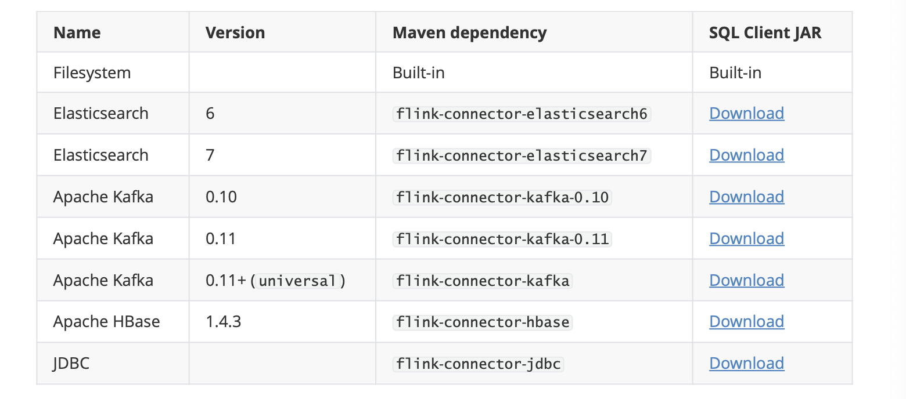
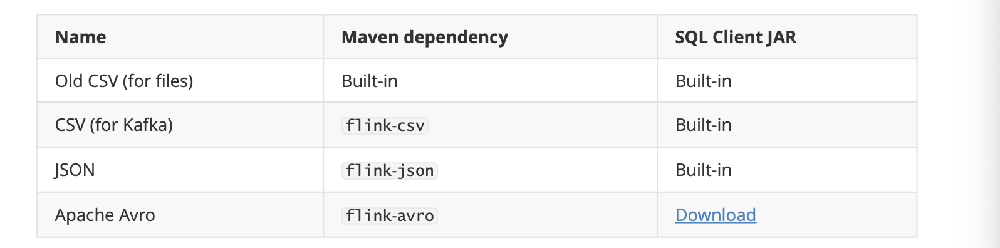
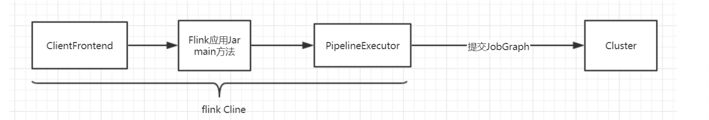
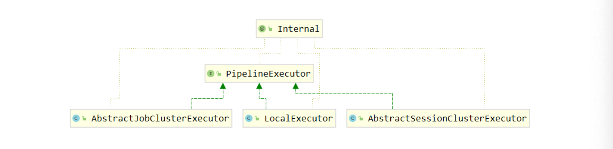
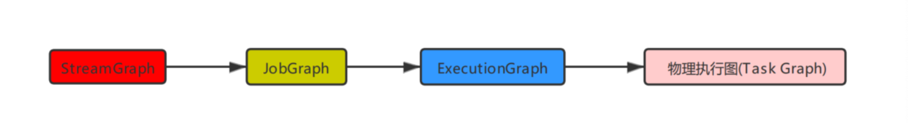
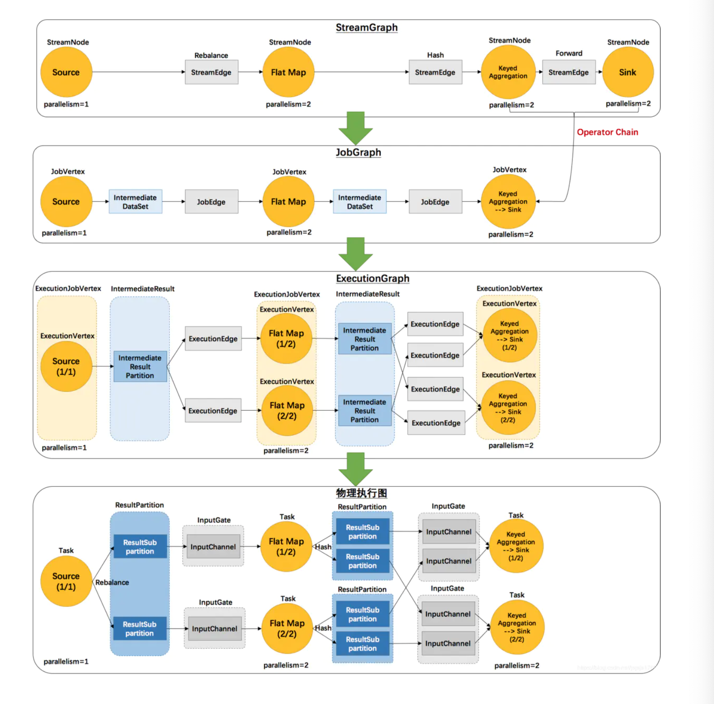
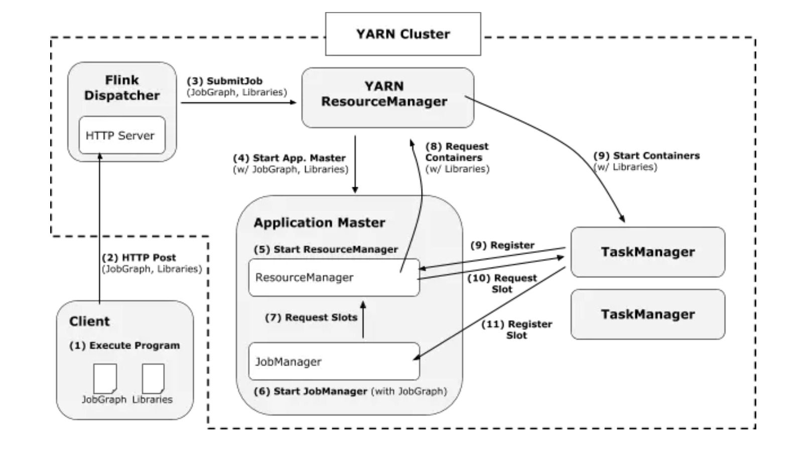
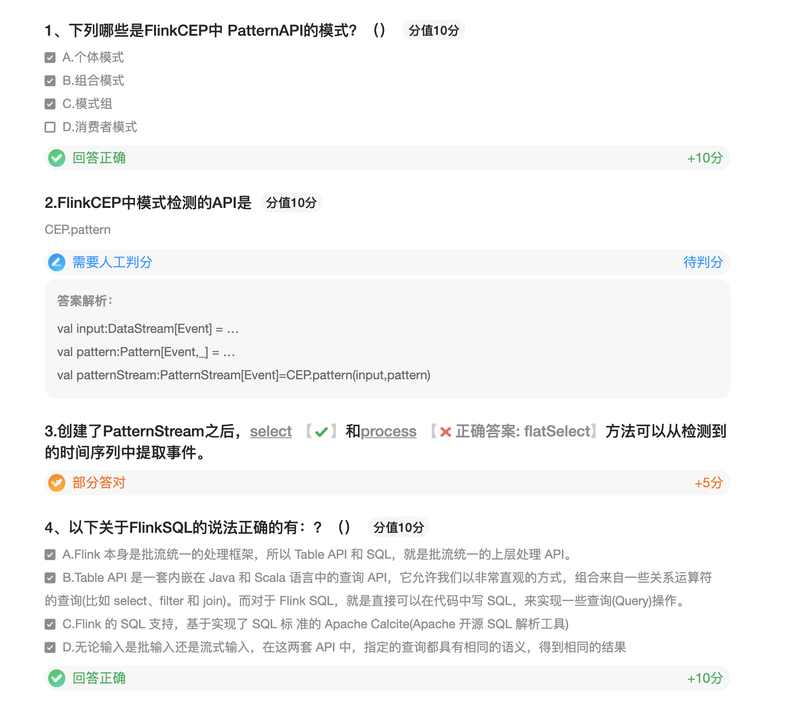
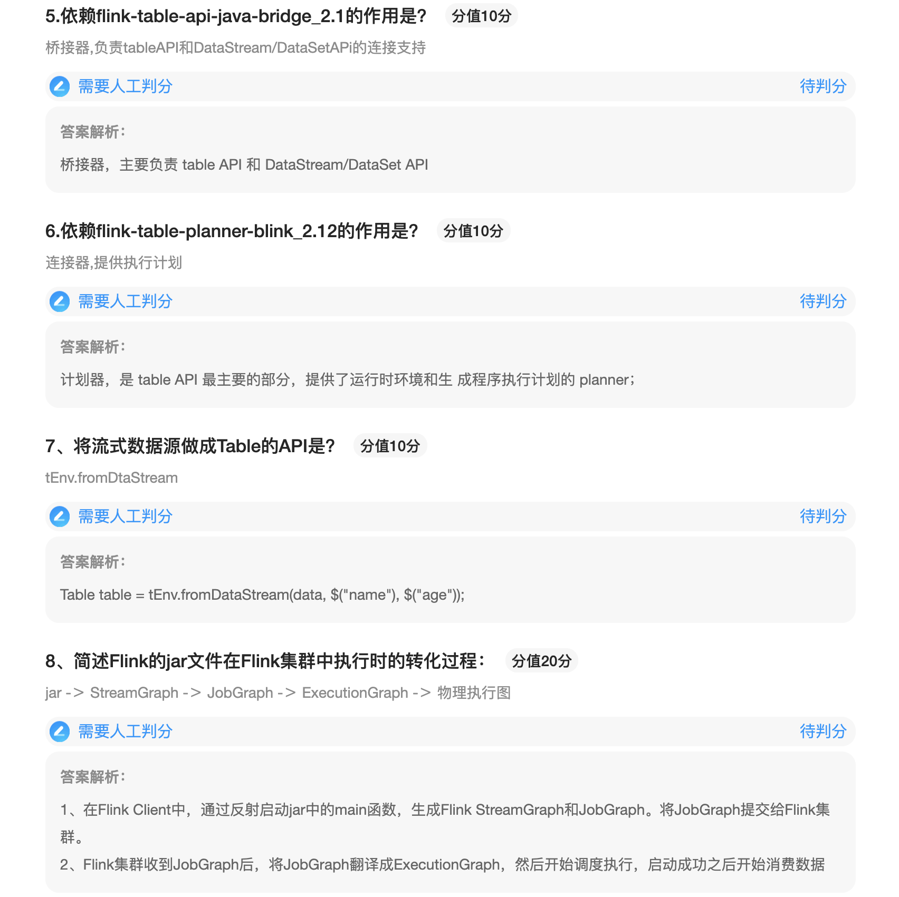
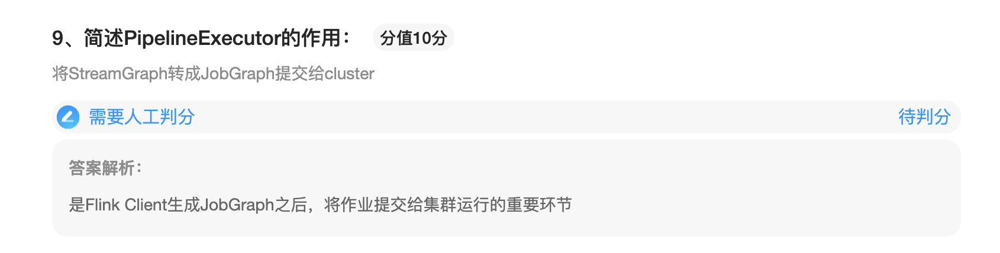

### Flink SQL

#### 什么是Table API和 Flink SQL

Flink本身是批流统一的处理框架，所以Table API和 SQL，就是批流统一的上层处理API。Table API是一套内嵌在Java和Scala语言中的查询API，他允许我们以非常直观的方式，组合来自一些关系运算符的查询（比如select 、filter和join）。而对于Flink SQL，就是直接可以在代码中写SQL，来实现一些查询（Query）操作。Flink的SQL支持，基于实现的SQL标准的Apache Calcite（Apache开源SQL解析工具）。无论输入是批输入还是流式输出，在这两套API中，指定查询都具有相同的语义，得到相同的结果。

#### 入门代码

依赖：

```properties
<dependency>
	<groupId>org.apache.flink</groupId>
	<artifactId>flink-table</artifactId>
	<version>1.11.1</version>
	<type>pom</type>
	<scope>provided</scope>
</dependency>
<!-- Either... -->
<dependency>
	<groupId>org.apache.flink</groupId>
	<artifactId>flink-table-api-java-bridge_2.11</artifactId>
	<version>1.11.1</version>
	<scope>provided</scope>
</dependency> <!-- or... -->
<dependency>
	<groupId>org.apache.flink</groupId>
	<artifactId>flink-table-api-scala-bridge_2.11</artifactId>
	<version>1.11.1</version>
	<scope>provided</scope>
</dependency>
<dependency>
	<groupId>org.apache.flink</groupId>
	<artifactId>flink-table-planner-blink_2.11</artifactId>
	<version>1.11.1</version>
	<scope>provided</scope>
</dependency>
```

依赖说明：

flink-table-api-java-bridge_2.1:桥接器，主要负责 table API 和 DataStream/DataSet API的连接支持，按照语音分为Java和scala

flink-table-planner-blink_2.12:连接器，是Table API的最主要的部分，提供了运行时环境和生成程序执行计划的planner，如果是生产环境，lib 目录下默认已 经有了 planner，就只需要有 bridge 就可以了

flink-table:flinktable的基础依赖

代码：

```java
package stream.tablesql;

import org.apache.flink.api.java.tuple.Tuple2;
import org.apache.flink.streaming.api.datastream.DataStream;
import org.apache.flink.streaming.api.datastream.DataStreamSource;
import org.apache.flink.streaming.api.environment.StreamExecutionEnvironment;
import org.apache.flink.streaming.api.functions.source.SourceFunction;
import org.apache.flink.table.api.EnvironmentSettings;
import org.apache.flink.table.api.Table;
import org.apache.flink.table.api.bridge.java.StreamTableEnvironment;
import org.apache.flink.types.Row;

import static org.apache.flink.table.api.Expressions.$;

/**
 * @description:
 * @author: huanghongbo
 * @date: 2021-01-19 11:36
 **/
public class Demo1 {


    public static void main(String[] args) throws Exception {

        // 获取Flink执行环境env
        StreamExecutionEnvironment env = StreamExecutionEnvironment.getExecutionEnvironment();
        // 用env做出table环境的tEnv
        EnvironmentSettings settings = EnvironmentSettings.newInstance()
                .useBlinkPlanner()
                .inStreamingMode()
                .build();
        StreamTableEnvironment tEnv = StreamTableEnvironment.create(env, settings);

        //获取流式数据
        DataStreamSource<Tuple2<String, Long>> data = env.addSource(new SourceFunction<Tuple2<String, Long>>() {

            private long number = 0;

            @Override
            public void run(SourceContext<Tuple2<String, Long>> ctx) throws Exception {
                while (true) {
                    number++;
                    ctx.collect(new Tuple2<>("name" + number, number));
                    Thread.sleep(1000);
                }
            }

            @Override
            public void cancel() {

            }
        });

//        //Table API
//        // 将流式数据做成table
//        Table table = tEnv.fromDataStream(data, $("name"), $("number"));
//        //对table数据做查询，输出所有偶数的信息
//        Table tableResult = table.select($("name"), $("number")).where($("number").mod(2).isEqual(0));
//        //将Table数据转成数据流
//        DataStream<Tuple2<Boolean, Row>> result = tEnv.toRetractStream(tableResult, Row.class);

        //SQL:
        // 创建临时视图t1
        tEnv.createTemporaryView("t1", data,$("name"),$("number"));
        //执行SQL
        Table table = tEnv.sqlQuery("select  * from t1 where mod(number,2) = 0");
        //
        DataStream<Tuple2<Boolean, Row>> result = tEnv.toRetractStream(table, Row.class);


        result.print();
        env.execute();

    }
}
```

#### 外部链接

###### Connectors



###### Formats



1. **数据查询语言DQL**:数据查询语言DQL基本结构是由SELECT子句，FROM子句，WHERE 子句组成的查询块: SELECT <字段名表> FROM <表或视图名> WHERE <查询条件>
2. 数据操纵语言DML 数据操纵语言DML主要有三种形式: 
   1. 插入:INSERT 
   2. 更新:UPDATE 
   3. 删除:DELETE 
3. 数据定义语言DDL 数据定义语言DDL用来创建数据库中的各种对象-----表、视图、 索引、同义词、聚簇等如:CREATE TABLE/VIEW/INDEX/SYN/CLUSTER 表 视图 索引 同义词 簇 DDL操作是隐性提交的!不能rollback

4. 数据控制语言DCL 数据控制语言DCL用来授予或回收访问数据库的某种特权，并控制 数据库操纵事务发生的时间 及效果，对数据库实行监视等。如:

连接外部系统在 Catalog 中注册表，直接调用 tableEnv.connect()就可以，里面参数要传 入一个 ConnectorDescriptor，也就是 connector 描述器。对于文件系统的 connector 而言， flink 内部已经提供了，就叫做 FileSystem()。

依赖

```properties
<dependency>
	<groupId>org.apache.flink</groupId>
	<artifactId>flink-csv</artifactId>
	<version>1.11.1</version>
</dependency>
```

#### 查询数据

###### fromFile

```java
package stream.connect;

import org.apache.flink.api.java.tuple.Tuple2;
import org.apache.flink.streaming.api.datastream.DataStream;
import org.apache.flink.streaming.api.environment.StreamExecutionEnvironment;
import org.apache.flink.table.api.DataTypes;
import org.apache.flink.table.api.EnvironmentSettings;
import org.apache.flink.table.api.Table;
import org.apache.flink.table.api.bridge.java.StreamTableEnvironment;
import org.apache.flink.table.descriptors.Csv;
import org.apache.flink.table.descriptors.FileSystem;
import org.apache.flink.table.descriptors.Schema;
import org.apache.flink.types.Row;

/**
 * @description:
 * @author: huanghongbo
 * @date: 2021-01-19 13:31
 **/
public class FromFileSystem {

    public static void main(String[] args) throws Exception {

        StreamExecutionEnvironment env = StreamExecutionEnvironment.getExecutionEnvironment();
        EnvironmentSettings settings = EnvironmentSettings.newInstance()
                .useBlinkPlanner()
                .inStreamingMode()
                .build();
        StreamTableEnvironment tEnv = StreamTableEnvironment.create(env, settings);

        tEnv.connect(new FileSystem().path("/Users/baiwang/myproject/flink/data/test.txt"))
                .withFormat(new Csv())
                .withSchema(new Schema().field("name", DataTypes.STRING()))
                .createTemporaryTable("t1");

        Table table = tEnv.sqlQuery("select * from t1");

        DataStream<Tuple2<Boolean, Row>> result = tEnv.toRetractStream(table, Row.class);
        result.print();

        env.execute();
    }
}
```

###### fromKafka

```java
package stream.connect;

import org.apache.flink.api.java.tuple.Tuple2;
import org.apache.flink.streaming.api.datastream.DataStream;
import org.apache.flink.streaming.api.environment.StreamExecutionEnvironment;
import org.apache.flink.table.api.DataTypes;
import org.apache.flink.table.api.EnvironmentSettings;
import org.apache.flink.table.api.Table;
import org.apache.flink.table.api.bridge.java.StreamTableEnvironment;
import org.apache.flink.table.descriptors.Csv;
import org.apache.flink.table.descriptors.Kafka;
import org.apache.flink.table.descriptors.Schema;
import org.apache.flink.types.Row;

/**
 * @description:
 * @author: huanghongbo
 * @date: 2021-01-19 13:41
 **/
public class FromKafka {

    public static void main(String[] args) throws Exception {

        StreamExecutionEnvironment env = StreamExecutionEnvironment.getExecutionEnvironment();
        EnvironmentSettings settings = EnvironmentSettings.newInstance()
                .useBlinkPlanner()
                .inStreamingMode()
                .build();
        StreamTableEnvironment tEnv = StreamTableEnvironment.create(env, settings);

        tEnv.connect(new Kafka()
                .version("universal")
                .topic("connect-test")
                .startFromEarliest()
                .property("bootstrap.servers", "hhb:9092"))
                .withFormat(new Csv())
                .withSchema(new Schema()
                        .field("info", DataTypes.STRING()))
                .createTemporaryTable("t2");

        Table table = tEnv.sqlQuery("select * from t2");

        DataStream<Tuple2<Boolean, Row>> result = tEnv.toRetractStream(table, Row.class);
        result.print();
        env.execute();
    }
}
```

#### 输出表

###### 输出到文件

```java
package stream.connect;

import org.apache.flink.api.java.tuple.Tuple2;
import org.apache.flink.streaming.api.datastream.DataStreamSource;
import org.apache.flink.streaming.api.environment.StreamExecutionEnvironment;
import org.apache.flink.streaming.api.functions.source.SourceFunction;
import org.apache.flink.table.api.DataTypes;
import org.apache.flink.table.api.EnvironmentSettings;
import org.apache.flink.table.api.Table;
import org.apache.flink.table.api.bridge.java.StreamTableEnvironment;
import org.apache.flink.table.descriptors.Csv;
import org.apache.flink.table.descriptors.FileSystem;
import org.apache.flink.table.descriptors.Schema;

import static org.apache.flink.table.api.Expressions.$;

/**
 * @description:
 * @author: huanghongbo
 * @date: 2021-01-19 13:52
 **/
public class ToFileSystem {

    public static void main(String[] args) {

        // 获取Flink执行环境env
        StreamExecutionEnvironment env = StreamExecutionEnvironment.getExecutionEnvironment();
        // 用env做出table环境的tEnv
        EnvironmentSettings settings = EnvironmentSettings.newInstance()
                .useBlinkPlanner()
                .inStreamingMode()
                .build();
        StreamTableEnvironment tEnv = StreamTableEnvironment.create(env, settings);

        //获取流式数据
        DataStreamSource<Tuple2<String, Long>> data = env.addSource(new SourceFunction<Tuple2<String, Long>>() {

            private long number = 0;

            @Override
            public void run(SourceContext<Tuple2<String, Long>> ctx) throws Exception {
                while (true) {
                    number++;
                    ctx.collect(new Tuple2<>("name" + number, number));
                    Thread.sleep(1000);
                }
            }

            @Override
            public void cancel() {

            }
        });


        tEnv.connect(new FileSystem()
                .path("/Users/baiwang/myproject/flink/data/connent/output"))
                .withFormat(new Csv())
                .withSchema(new Schema()
                        .field("name", DataTypes.STRING())
                        .field("number", DataTypes.BIGINT()))
                .createTemporaryTable("t3");

        Table table = tEnv.fromDataStream(data, $("name"), $("number"));

        table.executeInsert("t3");
    }
}
```

###### 输出到Kafka

```java
package stream.connect;

import org.apache.flink.streaming.api.datastream.DataStreamSource;
import org.apache.flink.streaming.api.environment.StreamExecutionEnvironment;
import org.apache.flink.streaming.api.functions.source.SourceFunction;
import org.apache.flink.table.api.DataTypes;
import org.apache.flink.table.api.EnvironmentSettings;
import org.apache.flink.table.api.Table;
import org.apache.flink.table.api.bridge.java.StreamTableEnvironment;
import org.apache.flink.table.descriptors.Csv;
import org.apache.flink.table.descriptors.Kafka;
import org.apache.flink.table.descriptors.Schema;

import static org.apache.flink.table.api.Expressions.$;

/**
 * @description:
 * @author: huanghongbo
 * @date: 2021-01-19 13:59
 **/
public class ToKafka {

    public static void main(String[] args) {

        // 获取Flink执行环境env
        StreamExecutionEnvironment env = StreamExecutionEnvironment.getExecutionEnvironment();
        // 用env做出table环境的tEnv
        EnvironmentSettings settings = EnvironmentSettings.newInstance()
                .useBlinkPlanner()
                .inStreamingMode()
                .build();
        StreamTableEnvironment tEnv = StreamTableEnvironment.create(env, settings);

        //获取流式数据
        DataStreamSource<String> data = env.addSource(new SourceFunction<String>() {

            private long number = 0;

            @Override
            public void run(SourceContext<String> ctx) throws Exception {
                while (true) {
                    number++;
                    ctx.collect("name" + number);
                    Thread.sleep(1000);
                }
            }

            @Override
            public void cancel() {

            }
        });

        tEnv.connect(new Kafka()
                .version("universal")
                .topic("connect-test")
                .property("bootstrap.servers", "hhb:9092"))
                .withFormat(new Csv())
                .withSchema(new Schema()
                        .field("name", DataTypes.STRING()))
                .createTemporaryTable("t4");

        Table table = tEnv.fromDataStream(data, $("name"));
        table.executeInsert("t4");
    }
}
```

###### 输出到MySQL（了解）


### 作业提交

Flink的Jar 文件并不是Flink集群的可执行文件，需经过转换之后提交给集群。

转换过程：

1、在Flink Client中，通过反射启动jar中的main函数，生产Flink StreamGraph和JobGraph。将JobGraph提交给Flink集群。

2、Flink集群收到JobGraph后，将JobGraph翻译成ExecutionGraph，然后开始执行调度，启动成功之后开始消费数据

总结：

Flink的核心执行流程就是，把用户的一系列API调用，转化为StreamGraph -- JobGraph -- ExecutionGraph --物理执行拓扑（Task DAG）



Flink提交作业的核心过程图

PipelineExecutor：流水线执行器。是Flink Client生成JobGraph 之后，将作业提交给集群运行的重要环节



Session 模式: AbstractSessionClusterExecutor

Per-Job模式：AbstractJobClusterExecutor

IDE调试：LocalExecutor


Session模式：

作业提交通过：yarn-session.sh 脚本，在启动脚本的时候，检查是否已经存在已经启动好的Flink-Session模式的集群，然后再PipelineExecutor中，通过Dispatcher提供的Rest接口提交的Flink JobGraph。Dispatcher为每一个作业提供一个JobMaster，进入到执行阶段


Pre-job模式：

一个作业一个集群，作业之间相互隔离。在PipelineExecutor执行作业提交的时候，可以创建集群，并将JobGraph以及需要的文件一起提交给Yarn集群，在Yarn集群的容器中启动Flink Master（JobManager进程），进行初始化后，从文件系统中获取JobGraph，交给Dispatcher，之后和Session流程相同。

流图：











