## 数据类型

支持DML，为了提高性能，较传统数据库而言，clickhouse提供了复合数据类型。ClickHouse的Update和Delete是有Alter变种实现。

### 整型

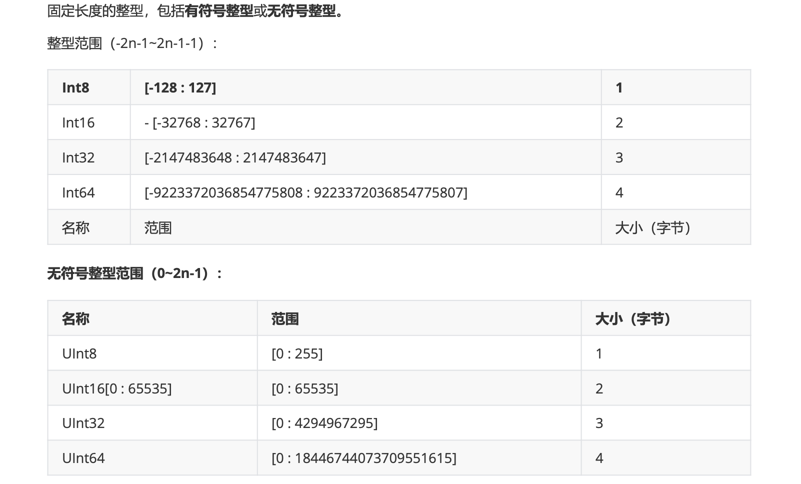

### 浮点型

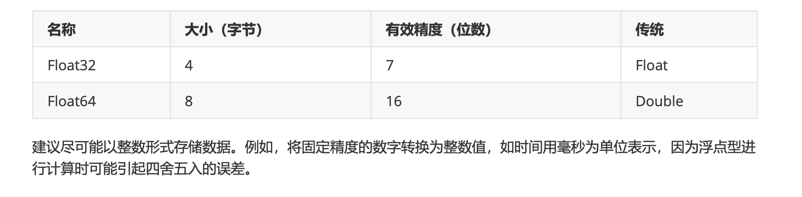

```shell
SELECT 1 - 0.9

┌───────minus(1, 0.9)─┐
│ 0.09999999999999998 │
└─────────────────────┘
# 正无穷
SELECT 1 / 0

┌─divide(1, 0)─┐
│          inf │
└──────────────┘

1 rows in set. Elapsed: 0.002 sec.

# 负无穷
linux121 :) select  -1 / 0

SELECT -1 / 0

┌─divide(-1, 0)─┐
│          -inf │
└───────────────┘

1 rows in set. Elapsed: 0.001 sec.
# 非数字
linux121 :) select 0/0

SELECT 0 / 0

┌─divide(0, 0)─┐
│          nan │
└──────────────┘

```

### Decimal

如果要求更高精度，可以选择Decimal类型，格式:Decimal(P,S)  P:代表精度，决定总位数(正数部分+小数部分)，取值范围0-38 S:代表规模，决定小数位数，取值范围是0-P

ClickHouse对Decimal提供三种简写: Decimal32，Decimal64，Decimal128

#### 相加、减精度取大

```sql
-- 相加
SELECT toDecimal32(2, 4) + toDecimal32(2, 2)

┌─plus(toDecimal32(2, 4), toDecimal32(2, 2))─┐
│                                     4.0000 │
└────────────────────────────────────────────┘

1 rows in set. Elapsed: 0.002 sec.

-- 相减
linux121 :) select toDecimal64(2,4) - toDecimal32(2,2)

SELECT toDecimal64(2, 4) - toDecimal32(2, 2)

┌─minus(toDecimal64(2, 4), toDecimal32(2, 2))─┐
│                                      0.0000 │
└─────────────────────────────────────────────┘

1 rows in set. Elapsed: 0.002 sec.
```

#### 相乘精度取和

```sql
linux121 :) select toDecimal64(2,4) * toDecimal32(2,2)

SELECT toDecimal64(2, 4) * toDecimal32(2, 2)

┌─multiply(toDecimal64(2, 4), toDecimal32(2, 2))─┐
│                                       4.000000 │
└────────────────────────────────────────────────┘

1 rows in set. Elapsed: 0.002 sec.
```

#### 相除精度取被除数

```sql
linux121 :) select toDecimal64(2,4) / toDecimal32(2,2)

SELECT toDecimal64(2, 4) / toDecimal32(2, 2)

┌─divide(toDecimal64(2, 4), toDecimal32(2, 2))─┐
│                                       1.0000 │
└──────────────────────────────────────────────┘

1 rows in set. Elapsed: 0.002 sec.

-- 被除数的精度要高于除数
linux121 :) select toDecimal64(2,2) / toDecimal32(2,4)

SELECT toDecimal64(2, 2) / toDecimal32(2, 4)


Received exception from server (version 20.5.4):
Code: 69. DB::Exception: Received from localhost:9000. DB::Exception: Decimal result's scale is less than argument's one.

0 rows in set. Elapsed: 0.002 sec.

```

### 字符串

#### String

字符串可以任意长度。他可以包含任意的字节集，包括空字节

#### FixedString(N)

固定长度N的字符串，N必须是严格的正自然数，当服务端读取长度小于N的字符串的时候，通过在字符串末尾添加空字节来达到N字节长度。当服务端读取长度大于N的字符串时候，将返回错误信息

```sql
linux121 :) select toFixedString('abc',5),length(toFixedString('abc',5));

SELECT
    toFixedString('abc', 5),
    length(toFixedString('abc', 5))

┌─toFixedString('abc', 5)─┬─length(toFixedString('abc', 5))─┐
│ abc                     │                               5 │
└─────────────────────────┴─────────────────────────────────┘

1 rows in set. Elapsed: 0.002 sec.
```

#### UUID

ClickHouse将UUID这种在传统数据库中充当主键的类型直接做成了数据类型

创建表：

```sql
linux121 :) create table uuid_test( c1 UUID, c2 String) engine= Memory ;

CREATE TABLE uuid_test
(
    `c1` UUID,
    `c2` String
)
ENGINE = Memory

Ok.

0 rows in set. Elapsed: 0.006 sec.
```

插入数据

```sql
insert into uuid_test select generateUUIDv4(),'t1';
insert into uuid_test (c2) values('t2') ;
insert into uuid_test (c2) values('t3') ;
```

查询结果

```sql
linux121 :) select * from uuid_test;

SELECT *
FROM uuid_test

┌───────────────────────────────────c1─┬─c2─┐
│ 5136b23d-cb0b-4a41-883a-d0e0ed4a5e78 │ t1 │
└──────────────────────────────────────┴────┘
┌───────────────────────────────────c1─┬─c2─┐
│ 00000000-0000-0000-0000-000000000000 │ t2 │
└──────────────────────────────────────┴────┘
┌───────────────────────────────────c1─┬─c2─┐
│ 00000000-0000-0000-0000-000000000000 │ t3 │
└──────────────────────────────────────┴────┘

3 rows in set. Elapsed: 0.001 sec.
```

### 枚举类型

包括Enum8 和 Enum16类型，Enum保存 'String' = Integer 的对应关系。

* Enum8用 'String' = Int8对描述

* Enum16用 'String' = Int16对描述

用法演示，创建一个带有枚举 Enum8('hello' = 1,'world' = 2)类型的列

```sql
linux121 :) create table  t_enum (x Enum8('hello' = 1,'world' = 2)) ENGINE = TinyLog ;
CREATE TABLE t_enum
(
    `x` Enum8('hello' = 1, 'world' = 2)
)
ENGINE = TinyLog

Ok.

0 rows in set. Elapsed: 0.005 sec.
```

这个x列只能存储类型定义出的值：'hello' 或 'world'。如果尝试保存其他值，ClickHouse抛出异常

```sql
linux121 :) insert into t_enum values('hello'),('world'),('hello')
:-] ;

INSERT INTO t_enum VALUES

Ok.

3 rows in set. Elapsed: 0.002 sec.
```

从数据库里面查询数据

```sql
linux121 :) select * from t_enum;

SELECT *
FROM t_enum

┌─x─────┐
│ hello │
│ world │
│ hello │
└───────┘

3 rows in set. Elapsed: 0.002 sec.
```

如果需要看到对应行的数值，则必须将Enum转换为整数类型。

```sql
linux121 :) select x ,cast(x,'Int8') from t_enum;

SELECT
    x,
    cast(x, 'Int8')
FROM t_enum

┌─x─────┬─cast(x, 'Int8')─┐
│ hello │               1 │
│ world │               2 │
│ hello │               1 │
└───────┴─────────────────┘

3 rows in set. Elapsed: 0.002 sec.
```

为什么需要枚举类型？

后续对枚举的操作：排序、分组、去重、过滤等，会使用int类型的Value值

### 数组

Array(T)：有T类型元素组成的数组

T可以是任意类型，包含数组类型，但不推荐使用多维数组，ClickHouse对多维数组的支持有限。例如，不能在MergeTree表中存储多维数组

可以使用array函数创建数组：array(T) ,也可以使用方括号：ClickHouse能够自动推断数据类型 []

创建数组案例

```sql
linux121 :) select array(1,2.0) as x , toTypeName(x);

SELECT
    [1, 2.] AS x,
    toTypeName(x)

┌─x─────┬─toTypeName(array(1, 2.))─┐
│ [1,2] │ Array(Float64)           │
└───────┴──────────────────────────┘

1 rows in set. Elapsed: 0.002 sec.

linux121 :) select [1,2] as x , toTypeName(x);

SELECT
    [1, 2] AS x,
    toTypeName(x)

┌─x─────┬─toTypeName([1, 2])─┐
│ [1,2] │ Array(UInt8)       │
└───────┴────────────────────┘

1 rows in set. Elapsed: 0.002 sec.
```

如果是声明表字段的时候，需要指明数据类型

```sql
linux121 :) create table t_array (c1 Array(String)) ENGINE = Memory;

CREATE TABLE t_array
(
    `c1` Array(String)
)
ENGINE = Memory

Ok.

0 rows in set. Elapsed: 0.003 sec.
```

### 元组

Tuple(T1,T2,...)：元组， 其中每个元素都有单独的类型

创建元组的示例：

```sql
linux121 :) select tuple(1,'a') as x , toTypeName(x);

SELECT
    (1, 'a') AS x,
    toTypeName(x)

┌─x───────┬─toTypeName(tuple(1, 'a'))─┐
│ (1,'a') │ Tuple(UInt8, String)      │
└─────────┴───────────────────────────┘

1 rows in set. Elapsed: 0.002 sec.

```

如果是声明表字段的时候，需要指明数据类型

```sql
linux121 :) create table t_tuple(x Tuple(String,UInt8)) ENGINE = Memory;

CREATE TABLE t_tuple
(
    `x` Tuple(String, UInt8)
)
ENGINE = Memory

Ok.

0 rows in set. Elapsed: 0.004 sec.
```

### Date、DateTime

日期类型，用两个字节存储，表示从1970-01-01(无符号)到当前的日期值

```sql
linux121 :) select min_date,min_time from parts limit 1;

SELECT
    min_date,
    min_time
FROM parts
LIMIT 1

┌───min_date─┬────────────min_time─┐
│ 2021-01-22 │ 0000-00-00 00:00:00 │
└────────────┴─────────────────────┘

1 rows in set. Elapsed: 0.015 sec.
```

### 布尔型

没有单独的类型来存储布尔值，可以使用Uiint8类型， 取值限制为0 或 1

## 表引擎

表引擎（即表的类型）决定了

1. 数据的存储方式和位置，写到哪里以及从哪里读取数据
2. 支持哪些查询以及如何支持
3. 并发数据访问
4. 索引的使用（如果存在）
5. 是否可以执行多线程请求
6. 数据复制参数

ClickHouse的表引擎有很多，下面介绍其中几种，对其他引擎有兴趣的可以去查阅官方文档：https://clickhouse.yandex/docs/zh/operations/table_engines/

### 日志

#### TinyLog

最简单的表引擎，用于将数据存储在磁盘上，每列都存储在单独的压缩文件中，写入时，数据将附加到文件末尾，改引擎没有并发控制

* 如果同时从表中读取和写入数据，则读取操作将抛出异常
* 如果同时写入多个查询中的表，则数据将被破坏

这种表引擎的典型用法是 write-once：首先只写入一次数据，然后根据需要多次读取。此引擎适用于相对较小的表，建议最多（1,000,000行）。如果有许多小表，则使用此表引擎是合适的，因为他需要打开文件更少，当拥有大量小表时，可能会导致性能低下。不支持索引

案例：创建一个TinyLog引擎的biang并插入一条数据

```sql
-- 创建表
linux121 :) create table t(a UInt8 , b String) ENGINE = TinyLog;

CREATE TABLE t
(
    `a` UInt8,
    `b` String
)
ENGINE = TinyLog

Ok.

0 rows in set. Elapsed: 0.005 sec.
-- 插入数据
linux121 :) insert into t(a,b) values(1,'abc');

INSERT INTO t (a, b) VALUES

Ok.

1 rows in set. Elapsed: 0.002 sec.
```

此时我们到保存数据的目录/var/lib/clickhouse/data/default/t中可以看到如下目录结构:

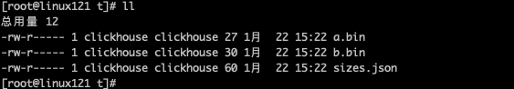

a.bin 和 b.bin 是压缩过的对应的列的数据， sizes.json 中记录了每个 *.bin 文件的大小，可以理解为下次保存的起始偏移量:

less sizes.json

```json
{"yandex":{"a%2Ebin":{"size":"27"},"b%2Ebin":{"size":"30"}}}
```

#### Log

Log与TinyLog的不同之处在于，<标记>的小文件与列文件存在一起。这些标记写在每个数据块上，并且包含偏移量，这些偏移量指示从哪里开始读取文件，以便跳过执行的行数，这使得可以在多个线程中读取表数据。对于并发数据访问。可以同时执行读取操作，而写入操作则阻塞读取和其他写入。Log引擎不支持索引。同样，如果写入表失败，则该表讲被破坏，并且从该表读取将返回错误。Log引擎适用于临时数据，Write-once表以及测试或演示目的

#### StripeLog

该引擎属于日志引擎系列，请在日志引擎系列文章中（https://clickhouse.tech/docs/zh/engines/table-engines/log-family/）查看引擎共同属性和差异

如果你需要吸入很多小数据量（小于一百万行）的表的场景下使用这个引擎

建表：

```sql
CREATE TABLE [IF NOT EXISTS] [db.]table_name [ON CLUSTER cluster] (
	column1_name [type1] [DEFAULT|MATERIALIZED|ALIAS expr1], 
  column2_name [type2] [DEFAULT|MATERIALIZED|ALIAS expr2],
  ...
) ENGINE = StripeLog
```

查看建表请求的详细说明。(https://clickhouse.tech/docs/zh/engines/table-engines/log-family/stripelog/#create- table-query)

写数据：

StrpeLog引擎将所有列存储在一个文件中。对每次insert请求，clickHouse 将数据块追加在表文件末尾，逐列写入

ClickHouse 为每张表写入以下文件：

* data.bin -- 数据文件
* index.mrk -- 带标记的文件。标记了包含了已插入每个数据块中每列的偏移量

StripeLog引擎不支持Alter update 和 Tlter Detele操作。

读数据：带标记的文件使得ClickHouse可以并行的读取数据。这意味着Select请求返回行的顺序是不可预测的。使用order by 子句 对 行进行排序。

建表:

```sql
CREATE TABLE stripe_log_table
(
    timestamp DateTime,
    message_type String,
    message String
)
ENGINE = StripeLog
```

插入数据：

```sql
 insert into stripe_log_table values(now(),'REGULAR','The first regular message');
 insert into stripe_log_table values(now(),'REGULAR','The second regular message');
 insert into stripe_log_table values(now(),'WARNING','The first regular message');
 insert into stripe_log_table values(now(),'WARNING','The second regular message'),(now(),'WARNING','The third regular message');
```

使用了四次insert 请求，从而在data.bin 文件中创建了四个数据块

ClickHouse 在查询数据时使用多线程，每个线程读取单独的数据块并在完成后独立的返回结果行。这样的结果是，大多数情况下，输出中块的顺序和输入时相应块的顺序是不同的。

查询：

```sql
linux121 :) select * from stripe_log_table;

SELECT *
FROM stripe_log_table

┌───────────timestamp─┬─message_type─┬─message───────────────────┐
│ 2021-01-22 16:51:59 │ REGULAR      │ The first regular message │
└─────────────────────┴──────────────┴───────────────────────────┘
┌───────────timestamp─┬─message_type─┬─message────────────────────┐
│ 2021-01-22 16:52:12 │ REGULAR      │ The second regular message │
└─────────────────────┴──────────────┴────────────────────────────┘
┌───────────timestamp─┬─message_type─┬─message───────────────────┐
│ 2021-01-22 16:52:36 │ WARNING      │ The first regular message │
└─────────────────────┴──────────────┴───────────────────────────┘
┌───────────timestamp─┬─message_type─┬─message────────────────────┐
│ 2021-01-22 16:56:28 │ WARNING      │ The second regular message │
│ 2021-01-22 16:56:28 │ WARNING      │ The third regular message  │
└─────────────────────┴──────────────┴────────────────────────────┘

5 rows in set. Elapsed: 0.003 sec.
```

对结果排序(默认排序)

```sql
linux121 :) select * from stripe_log_table order by timestamp;

SELECT *
FROM stripe_log_table
ORDER BY timestamp ASC

┌───────────timestamp─┬─message_type─┬─message────────────────────┐
│ 2021-01-22 16:51:59 │ REGULAR      │ The first regular message  │
│ 2021-01-22 16:52:12 │ REGULAR      │ The second regular message │
│ 2021-01-22 16:52:36 │ WARNING      │ The first regular message  │
│ 2021-01-22 16:56:28 │ WARNING      │ The second regular message │
│ 2021-01-22 16:56:28 │ WARNING      │ The third regular message  │
└─────────────────────┴──────────────┴────────────────────────────┘

5 rows in set. Elapsed: 0.002 sec.
```

### Memory

内存引擎，数据以未压缩的原始形式直接保存在内存当中，服务器重启数据就会消失。读写操作不会互相阻塞，不支持索引。简单查询下有非常非常高的性能表现（超过10G/s）。

一般用到他的地方不多，除了用来测试，就是在需要非常高的性能，同时数据量又不太大（上限大概1亿行）的场景。

### Merge

Merge引擎（不要跟MergeTree引擎混淆）本身不存存数据，但是可用于同时从任意其他表中读取数据。读是自动并行的，不支持写入。读取时，那些真正被读取到的数据的表的索引（如果有的话）会被使用

Merge引擎的参数：一个数据库名和一个用户匹配表名的正则表达式。

案例：先建a1、a2、a3三个表，然后用Merge引擎的a表再把他们连接起来

```sql
create table a1(id UInt8,name String) ENGINE = TinyLog;
create table a2(id UInt8,name String) ENGINE = TinyLog;
create table a3(id UInt8,name String) ENGINE = TinyLog;
insert into a1 values(1,'a1');
insert into a2 values(2,'a2');
insert into a3 values(3,'a3');
-- ^a 表示以a开头的所有表
create table a (id UInt8,name String) ENGINE = Merge(currentDatabase(),'^a');
```

```sql
linux121 :) select * from a;

SELECT *
FROM a

┌─id─┬─name─┐
│  1 │ a1   │
└────┴──────┘
┌─id─┬─name─┐
│  2 │ a2   │
└────┴──────┘
┌─id─┬─name─┐
│  3 │ a3   │
└────┴──────┘

3 rows in set. Elapsed: 0.002 sec.
```

### MergeTree

ClickHouse中最强大的表引擎当属MergeTree(合并树)引擎及该系列（*MergeTree）中的其他引擎，MergeTree引擎系列的基本理念如下，当你有巨量数据要插入到表中，你要高效地一批批写入数据片段，比希望这些数据片段在后台按照一定规则合并。相比较插入时不断修改（重写）数据进行存储，这次策略会更高效

#### MergeTree的创建方式与存储结构

###### MergeTree的创建方式

```
CREATE TABLE [IF NOT EXISTS] [db.]table_name [ON CLUSTER cluster] (
name1 [type1] [DEFAULT|MATERIALIZED|ALIAS expr1] [TTL expr1], 
name2 [type2] [DEFAULT|MATERIALIZED|ALIAS expr2] [TTL expr2], ...
INDEX index_name1 expr1 TYPE type1(...) GRANULARITY value1, 
INDEX index_name2 expr2 TYPE type2(...) GRANULARITY value2
) ENGINE = MergeTree()
ORDER BY expr
[PARTITION BY expr]
[PRIMARY KEY expr]
[SAMPLE BY expr]
[TTL expr [DELETE|TO DISK 'xxx'|TO VOLUME 'xxx'], ...]
[SETTINGS name=value, ...]
```

案例

```sql
create table mt_table(
    date Date,
    id UInt8,
    name String
)ENGINE=MergeTree
partition by toYYYYMM(date)
order by id;
```

* ENGINE - 引擎和参数，ENGINE=MergeTree：表示使用MergeTree引擎

* partition by - 分区键

  要按月进行分区，使用表达式toYYYYMM(date)，这里的date_column是一个Date类型的列，这里该分区名格式是YYYYMM

* order by - 表的排序键，必选

  可以是一组列的元组活任意表达式，例如order by (CounterID,EventDate)

* Primary key - 主键，如果要设置，跟排序键不同

  默认情况下，主键跟排序键（由order by 子句指定）相同，大部分情况下不需要在专门指定一个primary key 子句

* sample by - 用于抽样表达式

  如果要用抽样表达式，主键中必须包含这个表达式，例如：sample by intHash32(UserId)order by (CounterID,EventDate,intHash32(UserId)).

* settings - 影响MergeTree性能的额外参数

  * index_granularity — 索引粒度。即索引中相邻『标记』间的数据行数。默认值，8192 。该列表中所有可 用的参数可以从这里查看 MergeTreeSettings.h

  * index_granularity_bytes — 索引粒度，以字节为单位，默认值: 10Mb。如果仅按数据行数限制索引粒度, 请设置为0(不建议)。
  * enable_mixed_granularity_parts — 启用或禁用通过 index_granularity_bytes 控制索引粒度的大小。在 19.11版本之前, 只有 index_granularity 配置能够用于限制索引粒度的大小。当从大表(数十或数百兆)中查 询数据时候，index_granularity_bytes 配置能够提升ClickHouse的性能。如果你的表内数据量很大，可以 开启这项配置用以提升SELECT 查询的性能。
  * use_minimalistic_part_header_in_zookeeper — 数据片段头在 ZooKeeper 中的存储方式。如果设置了 use_minimalistic_part_header_in_zookeeper=1 ，ZooKeeper 会存储更少的数据。更多信息参考『服务 配置参数』这章中的 设置描述 。
  * min_merge_bytes_to_use_direct_io — 使用直接 I/O 来操作磁盘的合并操作时要求的最小数据量。合并 数据片段时，ClickHouse 会计算要被合并的所有数据的总存储空间。如果大小超过了 min_merge_bytes_to_use_direct_io 设置的字节数，则 ClickHouse 将使用直接 I/O 接口(O_DIRECT 选 项)对磁盘读写。如果设置 min_merge_bytes_to_use_direct_io = 0 ，则会禁用直接 I/O。默认值:10 * 1024 * 1024 * 1024 字节。
  * merge_with_ttl_timeout — TTL合并频率的最小间隔时间。默认值: 86400 (1 天)。 
  * write_final_mark — 启用或禁用在数据片段尾部写入最终索引标记。默认值: 1(不建议更改)。 
  * storage_policy — 存储策略。 参见 使用多个区块装置进行数据存储.

插入语句：

```sql
-- 根据年月进行分区
insert into mt_table values ('2020-05-01',1,'张三');
insert into mt_table values ('2020-06-01',2,'lisi');
insert into mt_table values ('2020-06-01',5,'wangwu');
```

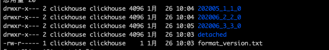

进入到202005_1_1_0/ 下查看

```
-rw-r----- 1 clickhouse clickhouse 384 1月  26 10:04 checksums.txt
-rw-r----- 1 clickhouse clickhouse  74 1月  26 10:04 columns.txt
-rw-r----- 1 clickhouse clickhouse   1 1月  26 10:04 count.txt
-rw-r----- 1 clickhouse clickhouse  28 1月  26 10:04 date.bin
-rw-r----- 1 clickhouse clickhouse  48 1月  26 10:04 date.mrk2
-rw-r----- 1 clickhouse clickhouse  27 1月  26 10:04 id.bin
-rw-r----- 1 clickhouse clickhouse  48 1月  26 10:04 id.mrk2
-rw-r----- 1 clickhouse clickhouse   4 1月  26 10:04 minmax_date.idx
-rw-r----- 1 clickhouse clickhouse  33 1月  26 10:04 name.bin
-rw-r----- 1 clickhouse clickhouse  48 1月  26 10:04 name.mrk2
-rw-r----- 1 clickhouse clickhouse   4 1月  26 10:04 partition.dat
-rw-r----- 1 clickhouse clickhouse   2 1月  26 10:04 primary.idx
```

* *.bin 文件 是按列保存数据的文件
* *.mrk 保存块偏移量
* primary.idx 保存主键索引信息

###### MergeTree的存储信息

```
-rw-r----- 1 clickhouse clickhouse 384 1月  26 10:04 checksums.txt
-rw-r----- 1 clickhouse clickhouse  74 1月  26 10:04 columns.txt
-rw-r----- 1 clickhouse clickhouse   1 1月  26 10:04 count.txt
-rw-r----- 1 clickhouse clickhouse  28 1月  26 10:04 date.bin
-rw-r----- 1 clickhouse clickhouse  48 1月  26 10:04 date.mrk2
-rw-r----- 1 clickhouse clickhouse  27 1月  26 10:04 id.bin
-rw-r----- 1 clickhouse clickhouse  48 1月  26 10:04 id.mrk2
-rw-r----- 1 clickhouse clickhouse   4 1月  26 10:04 minmax_date.idx
-rw-r----- 1 clickhouse clickhouse  33 1月  26 10:04 name.bin
-rw-r----- 1 clickhouse clickhouse  48 1月  26 10:04 name.mrk2
-rw-r----- 1 clickhouse clickhouse   4 1月  26 10:04 partition.dat
-rw-r----- 1 clickhouse clickhouse   2 1月  26 10:04 primary.idx
```

checksums.txt：二进制的校验文件，保存余下文件的大小size和size值的hash值

columns.txt: 明文列信息，如：

```
columns format version: 1
3 columns:
`date` Date
`id` UInt8
`name` String
```

data.bin: 压缩格式（默认LZ4）的数据文件，保存了原始数据，以列名.bin 命名

data.mk2:使用了自适应大小的索引间隔，名字为 .mk2,二进制的列字段标记文件，作用是把稀疏索引 .idx 文件和存放数据的文件 .bin 联系起来。

primary.idx:二进制的一级索引文件，在建表的时候，通过order by 或 primary key声明的稀疏索引

#### 数据分区

数据是以分区目录的形式组织的，每个分区独立分开存储。这种形式，查询数据时，可以有效地跳过无用的数据文件。

###### 数据分区的规则

分区键的取值，生产分区ID，分区根据ID决定，根据分区键的数据类型不同，分区ID生成目前有四种规则：

* 不指定分区键
* 使用整型
* 使用日期类型 toYYYYMM(data)
* 使用其他类型

数据在写入时，会对照分区ID落入对应的分区

###### 分区目录的生成规则

partitionID_minBlockNum_maxBlockNum_level

BlockNum是一个全局整型，从1开始，每当创建一个分区目录，此数字就加1

MinBlockNum：最小的数据块编号

MaxBlockNum：最大数据块编号

对于一个新的分区，MinBlockNum和MaxBlockNum值相同

如：2020_03_1_1_0, 2020_03_2_2_0

Level：合并的层级，某个分区被合并过的次数，不是全局的，而是针对某一个分区

###### 分区目录的合并过程

MergeTree的分区目录在数据写入过程中被创建。不同的批次写入数据属于同一分区，也会生成不同的目录，在之后的某个是和在合并（写入后的10-15分钟），合并后的旧分区目录默认8分钟后删除

同一个分区的多个目录合并以后的命名规则：

* MinBlockNum:取同一分区中MinBlockNum值的最小值
* MaxBlockNum：取同一分区中MaxBlockNum值最大值
* Level取同一个分区最大的Level值加1

#### 索引

###### 一级索引

文件：primary.idx

MergeTree 的 主键使用Primary key 定义，主键定义之后，MergeTree会根据**index_granularity间隔（默认8192**）为数据生成一级索引并保存只primary.idx 文件中，这种方式是稀疏索引

简化形式：通过order by 指定主键

###### 一级索引-稀疏索引

primary.idx 文件的一级索引采用稀疏索引

稠密索引：每一行索引标记对应一行具体的数据记录

稀疏索引：每一行索引标记对应一段数据记录（默认索引粒度8192）

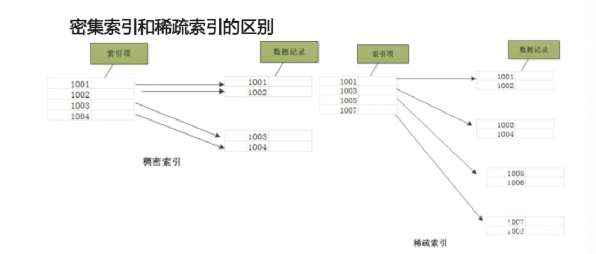

稀疏索引占用空间小，索引primary.idx 内的索引数据常驻内存中，取用速度快！

###### 一级索引-索引粒度

index_granularity参数表示索引粒度，新版本中clickhouse提供了自适应索引粒度。索引粒度在MergeTree引擎中很重要

###### 一级索引-索引数据的生成规则

借助hits_v1 表中的真实数据观察：primary.idx文件

由于稀疏索引，所以MergeTree要间隔index_granularity行数据才会生成一个索引记录，其索引值会根据声明的主键字段获取

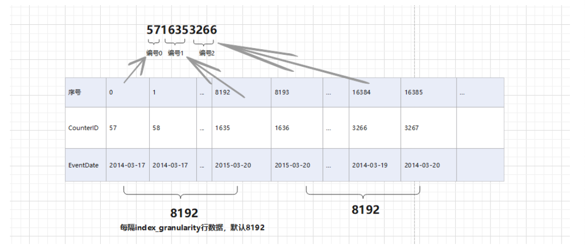

###### 一级索引-索引的查询过程

索引是如何工作的?对primary.idx文件的查询过程

MarkRange：一小段数据区间

按照index_granularity 的间隔粒度，将一段完整的数据划分成多个小的数据段，小的数据段就是MarkRange，MarkRange与索引编号对应

案例：

共200行数据，index_granularity大小为5，主键ID为Int，取值为0开始，根据索引生成规则，primary.idx文件内容为：05101520253035404550...200

共200行数据 / 5 = 40 个 MarkRange

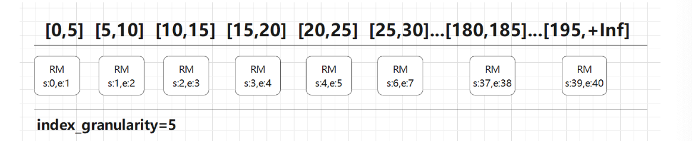

索引查询 where id = 5

第一步：形成区间格式 [5,5]

第二步：进行交集 [3,3]∩[0,无穷大（这里就是199）]

以MarkRange的步长大于8分块，进行剪枝

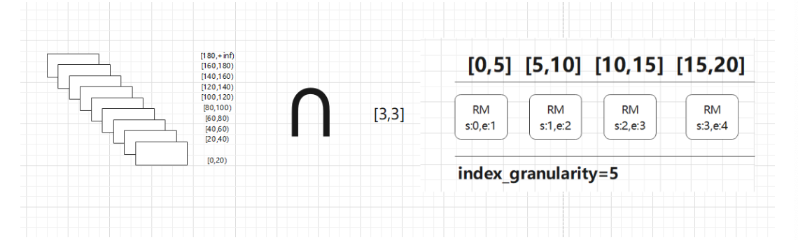

第三步：合并

MarkRange:(start0, end 20)

在ClickHouse中，MergeTree引擎表的索引列在建表时使用order by 语法来指定，而在官方文档中，用了下图：

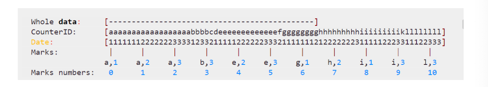

这张图除了以CounterID、Date两列为索引列的情况，即先以CounterID为主要关键字排序，再以Date为次要关键字排序，最后用两列的组合作为索引建。marks 与 mark numbers就是索引标记，且marks 之间 的间隔就是由建表时的索引粒度参数 index_granularity 来指定，默认值是8192

ClickHouse MergeTree引擎表中，每个part的数据大致以下面的结构存储。

. ├── business_area_id.bin ├── business_area_id.mrk2 ├── coupon_money.bin ├── coupon_money.mrk2 ├── groupon_id.bin ├── groupon_id.mrk2 ├── is_new_order.bin ├── is_new_order.mrk2 ... ├── primary.idx ...  其中bin文件存储的是每一列的原始数据（可能被压缩存储）,mrk2文件存储的是图中的mark numbers与bin文件中数据位置的映射关系。另外还有一个primary.idx文件存储索引列的具体数据，另外每一个part的数据都存储在单独的目录中，目录名形如：20200708_92_121_7，即包含了分区键、其实mark number 和 结束 mark number，方便定位

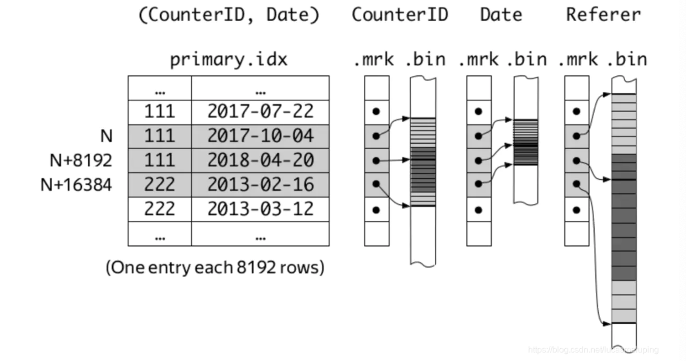

这样，每一列都通过order by 列进行索引。查询时，先查询数据所在的parts，在通过mrk2文件确定bin文件中数据的范围即可。

不过，ClickHouse的稀疏索引与Kafka稀疏索引不同，可以有用户自由组合多列，因此也要格外注意不要加入太多索引列，防止索引数据过于稀疏。另外，基数太小（即分区度太低）的列不适合做索引列，因为很可能横跨多个mark的值仍然相同，没有索引的意义了。

###### 跳数索引-granularity和index_granularity的关系

index_granularity 定义了数据的粒度，granularity定义了聚合信息汇总的粒度，granularity定义了一行跳数索引能够跳过多少个index_granularity区间的数据

###### 跳数索引-索引的可用类型

* minmax 存储指定表达式的极值(如果表达式是 tuple ，则存储 tuple 中每个元素的极值)，这些信息用于跳 过数据块，类似主键。

* set(max_rows) 存储指定表达式的惟一值(不超过 max_rows 个，max_rows=0 则表示『无限制』)。这些信 息可用于检查 WHERE 表达式是否满足某个数据块。

* ngrambf_v1(n, size_of_bloom_filter_in_bytes, number_of_hash_functions, random_seed) 存储包含数据块 中所有 n 元短语的 布隆过滤器 。只可用在字符串上。 可用于优化 equals ， like 和 in 表达式的性能。 n – 短 语长度。 size_of_bloom_filter_in_bytes – 布隆过滤器大小，单位字节。(因为压缩得好，可以指定比较大的 值，如256或512)。 number_of_hash_functions – 布隆过滤器中使用的 hash 函数的个数。 random_seed – hash 函数的随机种子。

* tokenbf_v1(size_of_bloom_filter_in_bytes, number_of_hash_functions, random_seed) 跟 ngrambf_v1 类似，不同于 ngrams 存储字符串指定长度的所有片段。它只存储被非字母数据字符分割的片段。

#### 数据存储

表按主键排序的数据片段组成。

当数据被插入到表中，会分成数据片段并按主键的字典序排序。例如，主键是(CounterID，Date)时，片段中数据按CounterID排序，具有相同CounterID的部分按Date排序

不同分区的数据会被切分成不同的片段，ClickHouse在后台合并数据片段 以便更高效存储，不会合并来之不同分区的数据片段。这个合并机制并不保证相同主键的所有行都会合并到同一个数据片段中。

ClickHouse会为每个数据片段创建一个索引文件，索引文件包含每个索引行（[标记]）的主键值。索引行号定义为n * index_granularity。最大的n等于总行数除以index_granularity 的值得整数部分。对于每列，跟主键相同的索引行处也会写入标记，这些标记让你可以直接找到数据所在的列。

你可以只用单一的大表并不断的一块一块往里面加入数据--MergeTree索引就是为了这种场景。

###### 按列存储

在MergeTree中数据按列存储，具体都每个列字段，都拥有一个.bin数据文件，是最终存储数据的文件。按列存储的好处：

1. 更好的压缩
2. 最小化数据扫描范围

MergeTree往.bin存数据的步骤

1. 对数据进行压缩
2. 根据OrderBy排序
3. 数据以压缩数据块的形式写入.bin文件。

###### 压缩数据块

CompressionMethod_CompressedSize_UnccompressedSize

一个压缩块由两个部分组成

1. 头信息
2. 压缩数据

头信息使用9位字节表示，1个UInt8(1字节) + 2个UInt32(4字节),分别表示压缩算法、压缩后数据大小，压缩前数据大小。

如：0x821200065536 

0x82:是压缩方法 12000:压缩后数据大小 65536:压缩前数据大小 

clickhouse-compressor --stat命令

```
[root@linux121 202005_1_1_0]# clickhouse-compressor --stat <./date.bin> out.log
[root@linux121 202005_1_1_0]# cat out.log
2	12
[root@linux121 202005_1_1_0]#
```

Out.log文件中显示的数据，全面的是压缩的，后面的是未压缩的

\[column.bin]:

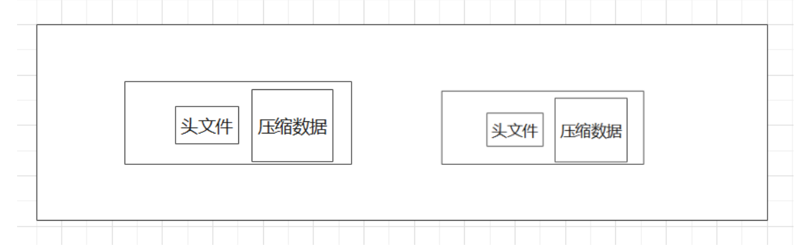

如果按照默认8192的索引粒度会把数据分成批次，每个批次读入数据的规则

设置x为批次数据的大小

* 如果单批次获取的数据 x < 64k，则继续读下一个批次，直到size > 64k 则生成下一个数据块
* 如果单批次数据 64k < x < 1M 则直接生成下一个数据块
* 如果x > 1M，则按照1M切分，剩下的数据继续按照上述规则执行

#### 数据标记

.mrk文件：将索引文件primary.idx 和 数据文件 .bin 建立映射关系

通用用hits_v1表说明：

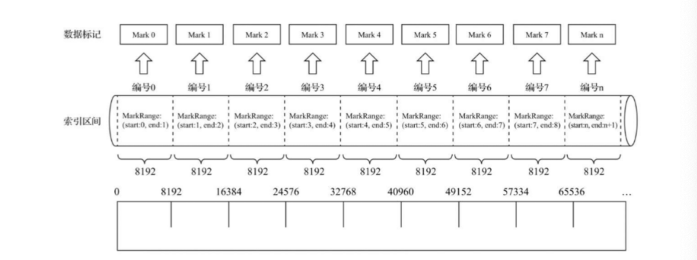

1. 数据标记和索引区间是对齐的，根据索引区间的下标编号，就能找到数据标记-索引编号和数据标记数值形同
2. 每个column.bin 都有一个 cloumn.mrk 与之对应， mrk 文件记录数据在 bin 文件中的偏移量。

拿一个UInt8 类型的字段来说，一个字段大小为1b，那么一个索引默认记录8192，数据就是 1 * 8192 = 8192b，由于该数据需要大于64k才会成为一批次，所以继续读取，那么8192b * 8 = 64kb，所以，8个索引对应的数据成为一个批次：

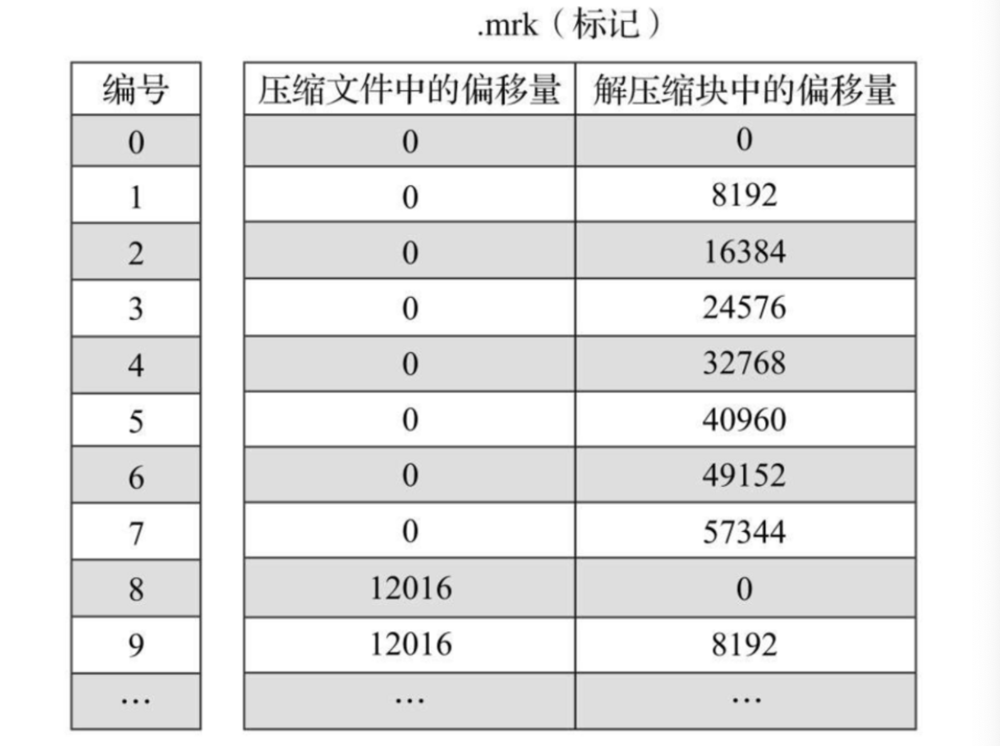

###### .mrk 文件内容的生成规则

数据标记和区间对齐，均按照index_granularity粒度间隔。可以通过索引区间的下标编号找到对应的数据标记。每个列字段 的 biin文件都有一个mrk数据标记文件，用于记录数据在bin文件中的偏移量，标记数据采用LRU缓存策略加快其取用速度

###### .mrk 文件的工作方式

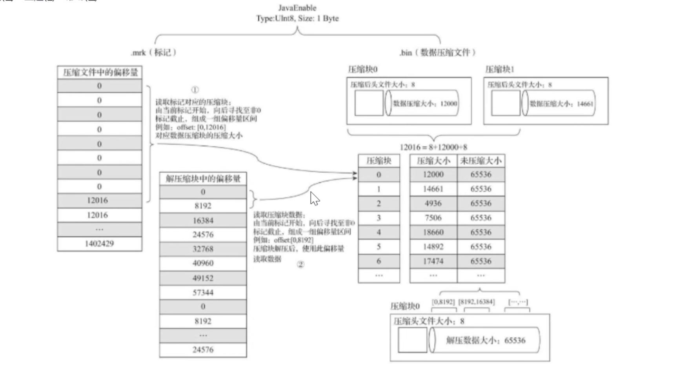

#### 分区、索引、标记与压缩协同

###### 写入过程

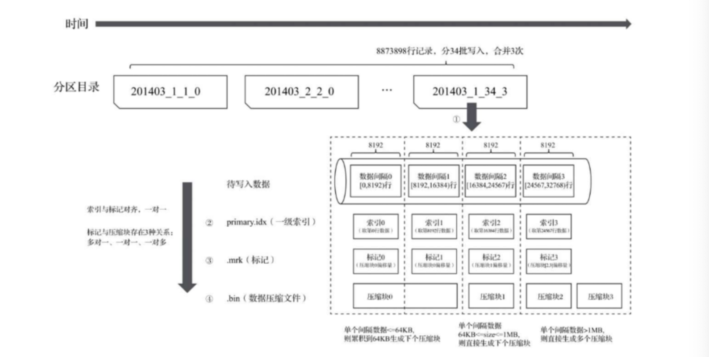


1. 生成分区目录
2. 合并分区目录
3. 生成primary.idx索引文件、每一列的 bin 和 mrk文件

###### 查询过程

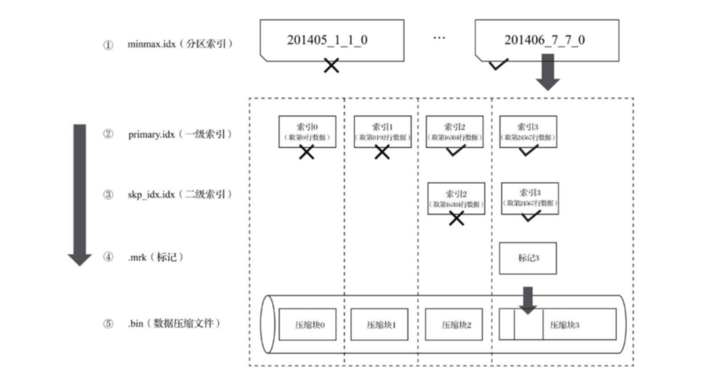

1. 根据分区索引缩小查询范围
2. 分解数据标记，缩小查询范围
3. 解压缩压缩块

###### 数据标记与压缩数据块的对应关系

多对一：多条mrk记录对应同一个数据块（64 kb ~1M）

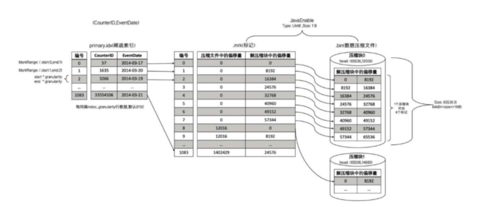

一对一:一条mrk记录对应一个数据块

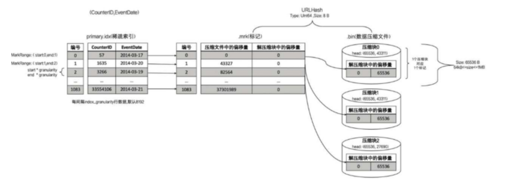

一对多：一条mrk记录对应多个数据块

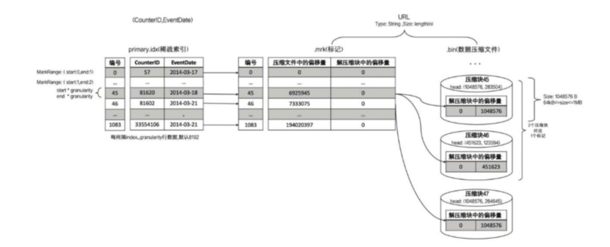

#### MergeTree的TTL

TTL：time to live 数据存活时间，TTL既可以设置在表上，也可以设置在列上。TTL指定的时间到期后则删除相应的表或列，如果同时设置列TTL，则根据先过期时间删除相应数据。

用法：

TTL time_col + Interval 3 Day

表示数据存活时间是time_col 时间的3天后

Interval可以设定的时间：SECOND MINUTE HOUR DAY WEEK MONTH QUARTER YEAR

###### TTL设置到列上

例：

```
CREATE TABLE ttl_table
(
    `id` String,
    `create_time` DateTime,
    `code` String TTL create_time + toIntervalSecond(10),
    `type` UInt8 TTL create_time + toIntervalSecond(10)
)
ENGINE = MergeTree
PARTITION BY toYYYYMM(create_time)
ORDER BY id
```

```sql
insert into ttl_table values('A000',now(),'C1',1),('A000',now()+INTERVAL 10
MINUTE,'C2',2);
select * from ttl_table;

--结果
┌─id───┬─────────create_time─┬─code─┬─type─┐
│ A000 │ 2021-01-28 11:14:34 │ C1   │    1 │
│ A000 │ 2021-01-28 11:24:34 │ C2   │    2 │
└──────┴─────────────────────┴──────┴──────┘
-- 10秒后
┌─id───┬─────────create_time─┬─code─┬─type─┐
│ A000 │ 2021-01-28 11:14:34 │      │    0 │
│ A000 │ 2021-01-28 11:24:34 │ C2   │    2 │
└──────┴─────────────────────┴──────┴──────┘
-- 10分钟后
┌─id───┬─────────create_time─┬─code─┬─type─┐
│ A000 │ 2021-01-28 11:14:34 │      │    0 │
│ A000 │ 2021-01-28 11:24:34 │      │    0 │
└──────┴─────────────────────┴──────┴──────┘
```

###### TTL设置到表上

```sql
create table tt1_table_v2 (
id String,
create_time DateTime,
code String TTL create_time + INTERVAL 10 SECOND,
type UInt8
)
ENGINE = MergeTree
PARTITION BY toYYYYMM(create_time)
ORDER BY create_time
TTL create_time + INTERVAL 1 DAY;
```

目前TTL没有取消的办法

```sql
 ALTER TABLE tt1_table_v1 MODIFY TTL create_time + INTERVAL + 3 DAY;
```

###### TTL文件说明

```shell
ll /var/lib/clickhouse/data/default/ttl_table
# 原始数据
drwxr-x--- 2 clickhouse clickhouse 4096 1月  28 11:14 202101_1_1_0
# 数据过期一次，进行合并的数据
drwxr-x--- 2 clickhouse clickhouse 4096 1月  28 11:14 202101_1_1_1
drwxr-x--- 2 clickhouse clickhouse 4096 1月  28 11:13 detached
-rw-r----- 1 clickhouse clickhouse    1 1月  28 11:13 format_version.txt


cd 202101_1_1_0

-rw-r----- 1 clickhouse clickhouse 458 1月  28 11:14 checksums.txt
-rw-r----- 1 clickhouse clickhouse  32 1月  28 11:14 code.bin
-rw-r----- 1 clickhouse clickhouse  48 1月  28 11:14 code.mrk2
-rw-r----- 1 clickhouse clickhouse  99 1月  28 11:14 columns.txt
-rw-r----- 1 clickhouse clickhouse   1 1月  28 11:14 count.txt
-rw-r----- 1 clickhouse clickhouse  34 1月  28 11:14 create_time.bin
-rw-r----- 1 clickhouse clickhouse  48 1月  28 11:14 create_time.mrk2
-rw-r----- 1 clickhouse clickhouse  36 1月  28 11:14 id.bin
-rw-r----- 1 clickhouse clickhouse  48 1月  28 11:14 id.mrk2
-rw-r----- 1 clickhouse clickhouse   8 1月  28 11:14 minmax_create_time.idx
-rw-r----- 1 clickhouse clickhouse   4 1月  28 11:14 partition.dat
-rw-r----- 1 clickhouse clickhouse  10 1月  28 11:14 primary.idx
-rw-r----- 1 clickhouse clickhouse 135 1月  28 11:14 ttl.txt
-rw-r----- 1 clickhouse clickhouse  28 1月  28 11:14 type.bin
-rw-r----- 1 clickhouse clickhouse  48 1月  28 11:14 type.mrk2
```

查看ttl.txt

```
ttl format version: 1
{"columns":[{"name":"code","min":1611803684,"max":1611804284},{"name":"type","min":1611803684,"max":1611804284}]}

SELECT
    create_time,
    toDateTime(1611803684),
    toDateTime(1611804284)
FROM ttl_table

第一列是name为code的创建时间，第二列是code列最小的过期时间，第三列是code最大的过期时间
┌─────────create_time─┬─toDateTime(1611803684)─┬─toDateTime(1611804284)─┐
│ 2021-01-28 11:14:34 │    2021-01-28 11:14:44 │    2021-01-28 11:24:44 │
│ 2021-01-28 11:24:34 │    2021-01-28 11:14:44 │    2021-01-28 11:24:44 │
└─────────────────────┴────────────────────────┴────────────────────────┘
```

文件ttl.txt 记录是列字段的过期时间（最大、最小）

#### MergeTree 的存储策略

Config.xml

```xml
<storage_configuration>
    <disks>
        <disk_hot1>
            <path>/var/lib/clickhouse/chbase/hotdata1/</path>
        </disk_hot1>
        <disk_hot2>
            <path>/var/lib/clickhouse/chbase/hotdata2/</path>
        </disk_hot2>
        <disk_cold>
            <path>/var/lib/clickhouse/chbase/colddata/</path>
        </disk_cold>
    </disks>
    <policies>
		<!-- 配置JBOD策略，数据存储在disk_hot1 和disk_hot2 两个磁盘轮休存放  -->
        <default_jbod>
            <volumes>
                <jbod>
                    <disk>disk_hot1</disk>               
                    <disk>disk_hot2</disk>
                </jbod>
            </volumes>
			<!-- 移动因子，当数据盘剩余空间不足0.2的时候，移动数据，默认0.1  -->
            <move_factor>0.2</move_factor>
        </default_jbod>
		<!--HOT/COLD策略,向disk_hot1 插入数据，当数据大于1G的时候，向disk_cold 移动数据 -->
        <moving_from_hot_to_cold>
            <volumes>
                <hot>
                    <disk>disk_hot1</disk>
                    <max_data_part_size_bytes>1073741824</max_data_part_size_bytes>
                </hot>
                <cold>
                    <disk>disk_cold</disk>
                </cold>
            </volumes>
            <move_factor>0.2</move_factor>
        </moving_from_hot_to_cold>
		<!--HOT/COLD策略,向disk_hot1 插入数据，当数据大于1M 的时候，向disk_cold 移动数据 -->
        <moving_from_hot_to_cold_new>
            <volumes>
                <hot>
                    <disk>disk_hot2</disk>
                    <max_data_part_size_bytes>1048576</max_data_part_size_bytes>
                </hot>
                <cold>
                    <disk>disk_cold</disk>
                </cold>
            </volumes>
            <move_factor>0.2</move_factor>
        </moving_from_hot_to_cold_new>
    </policies>
</storage_configuration>
```

在三个服务器创建目录

```shell
cd /var/lib/clickhouse/
mkdir chbase
cd chbase
mkdir colddata
mkdir hotdata1
mkdir hotdata2
# 修改用户组
chown clickhouse:clickhouse chbase
chown clickhouse:clickhouse chbase/*
```

重启服务

```
service clickhouse-server restart
```

###### 默认策略

19.15之前，只能单路径存储，存储位置为conf.xml配置文件中指定

```xml
<!-- Path to data directory, with trailing slash. -->
<path>/var/lib/clickhouse/</path>
```

19.15之后，支持多路径存储策略的自定义存储策略，目前有三类策略:

###### JBOD策略

配置方式在config.xml配置文件中指定:

```xml
<default_jbod>
   <volumes>
     <jbod>
       <disk>disk_hot1</disk>               
       <disk>disk_hot2</disk>
     </jbod>
   </volumes>
   <!-- 移动因子，当数据盘剩余空间不足0.2的时候，移动数据，默认0.1  -->
   <move_factor>0.2</move_factor>
</default_jbod>
```


```sql
-- 查看有哪些存储目录
SELECT
    name,
    path,
    formatReadableSize(free_space),
    formatReadableSize(total_space)
FROM system.disks;
```


```sql
-- 查看storage_policies 信息
select
policy_name,
volume_name,
volume_priority,
disks,
formatReadableSize(max_data_part_size) max_data_part_size,
move_factor
from system.storage_policies;
```

建表语句

```sql
CREATE TABLE jbod_table
(
    `id` UInt8
)
ENGINE = MergeTree
ORDER BY id
SETTINGS storage_policy = 'default_jbod'
```

插入数据后，会轮询的向disk_hot1、disk_hot2插入数据

###### HOT/COLD策略

conf.xml

```xml
<!--HOT/COLD策略,向disk_hot1 插入数据，当数据大于1G的时候，向disk_cold 移动数据 -->
<moving_from_hot_to_cold>
  <volumes>
    <hot>
      <disk>disk_hot1</disk>
      <max_data_part_size_bytes>1073741824</max_data_part_size_bytes>
    </hot>
    <cold>
      <disk>disk_cold</disk>
    </cold>
  </volumes>
  <move_factor>0.2</move_factor>
</moving_from_hot_to_cold>
```

建表语句：

```sql
create table hot_cold_table(
id UInt64
)ENGINE=MergeTree()
ORDER BY id
SETTINGS storage_policy='moving_from_hot_to_cold_new';
```

写入一批500K的数据，生成一个分区目录:

```sql
insert into hot_cold_table select rand() from numbers(100000);
```

当该操作执行多次后，触发到合并，会自动的将disk_hot的数据移动到cold中，

clickhouse有自动合并数据的功能，也可以手动触发合并

```sql
OPTIMIZE TABLE hot_cold_table_new
```

## MergeTree家族表引擎

### ReplacingMergeTree

这个引擎是在MergeTree的基础上，添加了处理重复数据的功能，改引擎和MergeTree不同之处在于他会删除具有相同主键的重复项。

特点：

* 使用 **Order by 排序键**作为判断重复的唯一键
* 数据的去重只会在合并的过程中触发
* **以数据分区为单位删除重复数据，不同分区的重复数据不会被删除**
* 找到重复数据的方式依赖数据已经order by 排好序
* 如果没有ver版本号，则保留重复数据的最后一行
* 如果设置了ver版本号，则保留重复数据中ver版本号最大的数据

格式

ENGINE [=] ReplacingMergeTree(date-column [, sampling_expression], (primary, key),index_granularity, [ver]) 可以看出他比MergeTree只多了一个ver，这个ver指代版本列。

案例：

```sql
CREATE TABLE replace_table
(
    `id` String,
    `code` String,
    `create_time` DateTime
)
ENGINE = ReplacingMergeTree()
PARTITION BY toYYYYMM(create_time)
PRIMARY KEY id
ORDER BY (id, code)

insert into replace_table values('A001','C1','2020-08-21 08:00:00'); 
insert into replace_table values('A001','C1','2020-08-22 08:00:00'); 
insert into replace_table values('A001','C8','2020-08-23 08:00:00'); 
insert into replace_table values('A001','C9','2020-08-24 08:00:00'); 
insert into replace_table values('A002','C2','2020-08-25 08:00:00'); 
insert into replace_table values('A003','C3','2020-08-26 08:00:00');

-- 查询可以看到结果，相同分区的相同orderby 信息的只保留一条
select * from replace_table;

SELECT *
FROM replace_table

┌─id───┬─code─┬─────────create_time─┐
│ A001 │ C1   │ 2020-08-22 08:00:00 │
│ A001 │ C8   │ 2020-08-23 08:00:00 │
│ A001 │ C9   │ 2020-08-24 08:00:00 │
│ A002 │ C2   │ 2020-08-25 08:00:00 │
└──────┴──────┴─────────────────────┘
┌─id───┬─code─┬─────────create_time─┐
│ A003 │ C3   │ 2020-08-26 08:00:00 │
└──────┴──────┴─────────────────────┘


insert into replace_table values('A001','C1','2020-05-21 08:00:00');
-- 不同分区的数据不会被删除
select * from replace_table;

SELECT *
FROM replace_table

┌─id───┬─code─┬─────────create_time─┐
│ A001 │ C1   │ 2020-05-21 08:00:00 │
└──────┴──────┴─────────────────────┘
┌─id───┬─code─┬─────────create_time─┐
│ A001 │ C1   │ 2020-08-22 08:00:00 │
│ A001 │ C8   │ 2020-08-23 08:00:00 │
│ A001 │ C9   │ 2020-08-24 08:00:00 │
│ A002 │ C2   │ 2020-08-25 08:00:00 │
└──────┴──────┴─────────────────────┘
┌─id───┬─code─┬─────────create_time─┐
│ A003 │ C3   │ 2020-08-26 08:00:00 │
└──────┴──────┴─────────────────────┘
```

### SummingMergeTree

该引擎继承自MergeTree。区别在于，当合并SummingMergeTree表的数据片段时，ClickHouse会把所有具有相同聚合数据的条件的key合并成一行，该行包含了被合并的行中具有数值数据类型的列的汇总值。如果聚合数据的条件key的组合方式使用单个键值对应大量的行，则可以显著的减少存储空间并加快数据查询熟读，对于不可加的列，会取一个最先出现的值。

特征：

* 用order by 排序键最为聚合数据条件的key
* 合并分区的时候触发汇总逻辑
* 以数据分区为单位聚合数据，不同分区的数据不会被汇总
* 如果在定义引擎时，指定了columns汇总列（非主键）则sum汇总这些字段
* 如果没有指定，则汇总所有非主键的数值类型字段
* sum汇总相同的聚合key的数据，依赖order by 排序
* 同一个分区sum汇总过程中，非汇总字段的数据保留第一行值
* 支持嵌套逻辑，但列字段名称必须以Map后缀结束。

语法

```sql
CREATE TABLE [IF NOT EXISTS] [db.]table_name [ON CLUSTER cluster] (
	name1 [type1] [DEFAULT|MATERIALIZED|ALIAS expr1], 
  name2 [type2] [DEFAULT|MATERIALIZED|ALIAS expr2], ...
) ENGINE = SummingMergeTree([columns])
[PARTITION BY expr]
[ORDER BY expr]
[SAMPLE BY expr]
[SETTINGS name=value, ...]
```

Columns 包含要被汇总的列的列名的元组

#### 案例一

```sql
CREATE TABLE smt_table
(
    `date` Date,
    `name` String,
    `a` UInt16,
    `b` UInt16
)
ENGINE = SummingMergeTree(date, (date, name), 8192, a);
insert into smt_table (date, name, a, b) values ('2019-07-10', 'a', 1, 2);
insert into smt_table (date, name, a, b) values ('2019-07-10', 'b', 2, 1);
insert into smt_table (date, name, a, b) values ('2019-07-11', 'b', 3, 8);
insert into smt_table (date, name, a, b) values ('2019-07-11', 'b', 3, 8);
insert into smt_table (date, name, a, b) values ('2019-07-11', 'a', 3, 1);
insert into smt_table (date, name, a, b) values ('2019-07-12', 'c', 1, 3);

linux121 :) select * from smt_table;

SELECT *
FROM smt_table

┌───────date─┬─name─┬─a─┬─b─┐
│ 2019-07-10 │ a    │ 1 │ 2 │
│ 2019-07-10 │ b    │ 2 │ 1 │
│ 2019-07-11 │ a    │ 3 │ 1 │
│ 2019-07-11 │ b    │ 6 │ 8 │
└────────────┴──────┴───┴───┘
┌───────date─┬─name─┬─a─┬─b─┐
│ 2019-07-12 │ c    │ 1 │ 3 │
└────────────┴──────┴───┴───┘
```

发现2019-07-11，b的a列合并相加了，b列取了8(因为b列为8的数据最先插入)。

#### 案例二

```sql
CREATE TABLE summing_table
(
    `id` String,
    `city` String,
    `v1` UInt32,
    `v2` Float64,
    `create_time` DateTime
)
ENGINE = SummingMergeTree()
PARTITION BY toYYYYMM(create_time)
PRIMARY KEY id
ORDER BY (id, city);


insert into table summing_table values('A000','beijing',10,20,'2020-08-20 08:00:00');
insert into table summing_table values('A000','beijing',20,30,'2020-08-30 08:00:00');
insert into table summing_table values('A000','shanghai',10,20,'2020-08-20 08:00:00'); 
insert into table summing_table values('A000','beijing',10,20,'2020-06-20 08:00:00'); 
insert into table summing_table values('A001','beijing',50,60,'2020-02-20 08:00:00');

--查询结果
linux121 :) select * from summing_table;

SELECT *
FROM summing_table

┌─id───┬─city────┬─v1─┬─v2─┬─────────create_time─┐
│ A001 │ beijing │ 50 │ 60 │ 2020-02-20 08:00:00 │
└──────┴─────────┴────┴────┴─────────────────────┘
┌─id───┬─city────┬─v1─┬─v2─┬─────────create_time─┐
│ A000 │ beijing │ 10 │ 20 │ 2020-06-20 08:00:00 │
└──────┴─────────┴────┴────┴─────────────────────┘
┌─id───┬─city────┬─v1─┬─v2─┬─────────create_time─┐
│ A000 │ beijing │ 10 │ 20 │ 2020-08-20 08:00:00 │
└──────┴─────────┴────┴────┴─────────────────────┘
┌─id───┬─city────┬─v1─┬─v2─┬─────────create_time─┐
│ A000 │ beijing │ 20 │ 30 │ 2020-08-30 08:00:00 │
└──────┴─────────┴────┴────┴─────────────────────┘
┌─id───┬─city─────┬─v1─┬─v2─┬─────────create_time─┐
│ A000 │ shanghai │ 10 │ 20 │ 2020-08-20 08:00:00 │
└──────┴──────────┴────┴────┴─────────────────────┘

-- 手动触发合并
OPTIMIZE TABLE summing_table;


linux121 :) select * from summing_table;

SELECT *
FROM summing_table

┌─id───┬─city────┬─v1─┬─v2─┬─────────create_time─┐
│ A001 │ beijing │ 50 │ 60 │ 2020-02-20 08:00:00 │
└──────┴─────────┴────┴────┴─────────────────────┘
┌─id───┬─city────┬─v1─┬─v2─┬─────────create_time─┐
│ A000 │ beijing │ 10 │ 20 │ 2020-06-20 08:00:00 │
└──────┴─────────┴────┴────┴─────────────────────┘
┌─id───┬─city─────┬─v1─┬─v2─┬─────────create_time─┐
│ A000 │ beijing  │ 30 │ 50 │ 2020-08-20 08:00:00 │
│ A000 │ shanghai │ 10 │ 20 │ 2020-08-20 08:00:00 │
└──────┴──────────┴────┴────┴─────────────────────┘

```

通过观察，根据order by 排序键（id，city）作为聚合key，因为没有在建表指定SummingMergeTree的时候指定Sum列，所以把所有非主键数值类型的列都进行了sum逻辑

#### 案例三

SummingMergeTree支持嵌套类型的字段，但是字段名称必须十一Map后缀结束

```sql
CREATE TABLE summing_table_nested
(
    `id` String,
    `nestMap` Nested(    id UInt32,     key UInt32,     val UInt64),
    `create_time` DateTime
)
ENGINE = SummingMergeTree()
PARTITION BY toYYYYMM(create_time)
ORDER BY id;

INSERT INTO summing_table_nested (id,nestMap.id,nestMap.key,nestMap.val,create_time)values('1',[1,2,3],[1,2,3],[1,2,3],'2020-08-20 08:00:00');

INSERT INTO summing_table_nested (id,nestMap.id,nestMap.key,nestMap.val,create_time)values('1',[1,2,3],[1,2,3],[1,2,3],'2020-08-21 08:00:00');


select * from summing_table_nested;

┌─id─┬─nestMap.id─┬─nestMap.key─┬─nestMap.val─┬─────────create_time─┐
│ 1  │ [1,2,3]    │ [1,2,3]     │ [1,2,3]     │ 2020-08-20 08:00:00 │
└────┴────────────┴─────────────┴─────────────┴─────────────────────┘
┌─id─┬─nestMap.id─┬─nestMap.key─┬─nestMap.val─┬─────────create_time─┐
│ 1  │ [1,2,3]    │ [1,2,3]     │ [1,2,3]     │ 2020-08-21 08:00:00 │
└────┴────────────┴─────────────┴─────────────┴─────────────────────┘
 -- 手动合并
 OPTIMIZE TABLE summing_table_nested;
 
select * from summing_table_nested;


┌─id─┬─nestMap.id─┬─nestMap.key─┬─nestMap.val─┬─────────create_time─┐
│ 1  │ [1,2,3]    │ [2,4,6]     │ [2,4,6]     │ 2020-08-20 08:00:00 │
└────┴────────────┴─────────────┴─────────────┴─────────────────────┘

INSERT INTO summing_table_nested (id,nestMap.id,nestMap.key,nestMap.val,create_time)values('1',[4,5,6],[1,2,3],[1,2,3],'2020-08-21 08:00:00');

linux121 :) select * from summing_table_nested;

SELECT *
FROM summing_table_nested

┌─id─┬─nestMap.id────┬─nestMap.key───┬─nestMap.val───┬─────────create_time─┐
│ 1  │ [1,2,3,4,5,6] │ [2,4,6,1,2,3] │ [2,4,6,1,2,3] │ 2020-08-20 08:00:00 │
└────┴───────────────┴───────────────┴───────────────┴─────────────────────┘

INSERT INTO summing_table_nested (id,nestMap.id,nestMap.key,nestMap.val,create_time)values('2',[4,5,6],[1,2,3],[1,2,3],'2020-08-21 08:00:00');

┌─id─┬─nestMap.id────┬─nestMap.key───┬─nestMap.val───┬─────────create_time─┐
│ 1  │ [1,2,3,4,5,6] │ [2,4,6,1,2,3] │ [2,4,6,1,2,3] │ 2020-08-20 08:00:00 │
│ 2  │ [4,5,6]       │ [1,2,3]       │ [1,2,3]       │ 2020-08-21 08:00:00 │
└────┴───────────────┴───────────────┴───────────────┴─────────────────────┘
```

得出结论，根据id进行合并，即order by id。

### AggregateMergeTree

说明：该引擎继承自MergeTree，并改变了数据片段的合并逻辑。ClickHouse会将相同主键的所有行（在一个数据片段内）替换为单个存储一系列聚合函数状态的行。可以使用AggregatingMergeTree表来做增量数据统计聚合，包括物化视图的数据聚合。引擎需使用AggregateFunction类型来处理所有列，如果要按一组规则来合并减少行数，则使用AggregatingMergeTree是合适的，对于AggregatingMergeTree不能直接使用insert来写入数据，一般是用insert select 。但更常用的是创建物化视图。

#### 创建一个MergeTree的基表

```sql
CREATE TABLE arr_table_base
(
    `id` String,
    `city` String,
    `code` String,
    `value` UInt32
)
ENGINE = MergeTree
PARTITION BY city
ORDER BY (id, city);
```

#### 创建一个AggregatingMergeTree的物化视图

```sql
CREATE MATERIALIZED VIEW agg_view
ENGINE = AggregatingMergeTree()
PARTITION BY city
ORDER BY (id, city) AS
SELECT
    id,
    city,
    uniqState(code) AS code,
    sumState(value) AS value
FROM arr_table_base
GROUP BY
    id,
    city;
```

#### 向基表中插入数据

```
insert into table arr_table_base values ('A000','wuhan','code1',1),('A000','wuhan','code2',200), ('A000','zhuhai','code1',200);
```

#### 查询数据

```sql
SELECT
    id,
    sumMerge(value),
    uniqMerge(code)
FROM agg_view
GROUP BY
    id,
    city;
```

#### 使用场景

可以使用AggregatingMergeTree表来做增量数据统计聚合，包括物化视图的数据聚合。

### CollapsingMergeTree

以增代删

说明：yandex官方给出的介绍是CollapsingMergeTree会异步的删除（折叠）有成对的数据（sign 1 和 -1）就是成对的，没有成对的数据就会被保留，该引擎可以显著的降低存储量并提供select 查询效率，CollapsingMergeTree引擎有个状态列 sign，该列的值1 为 ”状态“行，”-1“ 为取消行，对于数据只关心 状态列为状态的数据。

#### 创建CollapsingMergeTree表

```
CREATE TABLE cmt_tab
(
    `sign` Int8,
    `date` Date,
    `name` String,
    `point` String
)
ENGINE = CollapsingMergeTree(sign)
PARTITION BY date
ORDER BY name
SAMPLE BY name;
```

#### 插入数据

```sql
insert into cmt_tab(sign,date,name,point) values (1,'2019-12-13','cctv','100000');
insert into cmt_tab(sign,date,name,point) values (-1,'2019-12-13','cctv','100000');
insert into cmt_tab(sign,date,name,point) values (1,'2019-12-13','hntv','10000');
insert into cmt_tab(sign,date,name,point) values (-1,'2019-12-13','hntv','10000');
insert into cmt_tab(sign,date,name,point) values (1,'2019-12-13','hbtv','11000');
insert into cmt_tab(sign,date,name,point) values (-1,'2019-12-13','hbtv','11000');
insert into cmt_tab(sign,date,name,point) values (1,'2019-12-14','cctv','200000');
insert into cmt_tab(sign,date,name,point) values (1,'2019-12-14','hntv','15000');
insert into cmt_tab(sign,date,name,point) values (1,'2019-12-14','hbtv','16000');
```

#### 查询：

```
linux121 :) select * from cmt_tab;

SELECT *
FROM cmt_tab

┌─sign─┬───────date─┬─name─┬─point──┐
│    1 │ 2019-12-14 │ cctv │ 200000 │
└──────┴────────────┴──────┴────────┘
┌─sign─┬───────date─┬─name─┬─point─┐
│    1 │ 2019-12-14 │ hntv │ 15000 │
└──────┴────────────┴──────┴───────┘
┌─sign─┬───────date─┬─name─┬─point─┐
│    1 │ 2019-12-14 │ hbtv │ 16000 │
└──────┴────────────┴──────┴───────┘
```

#### 使用场景

大数据对于数据更新很难做到，比如他统计一个网站或TV的登录的用户数，更多的场景都是选择用记录每个点的数据，在对数据进行一定的聚合查询。而clickhouse通过collapsingMergeTree就可以实现，所以使用CollapsingMergeTree大部分用于OLAP场景。

### VersionedCollapsingMergeTree

这个引擎和CollapsingMergeTree差不多，只是对CollapsingMergeTree引擎加了一个版本，比如可以适用于非实时 用户在线统计，统计每个节点用户在在线业务

创建语法：

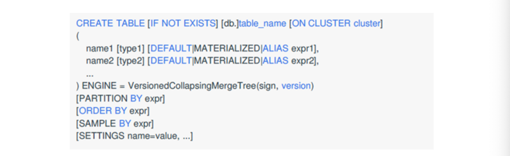


