## Kudu

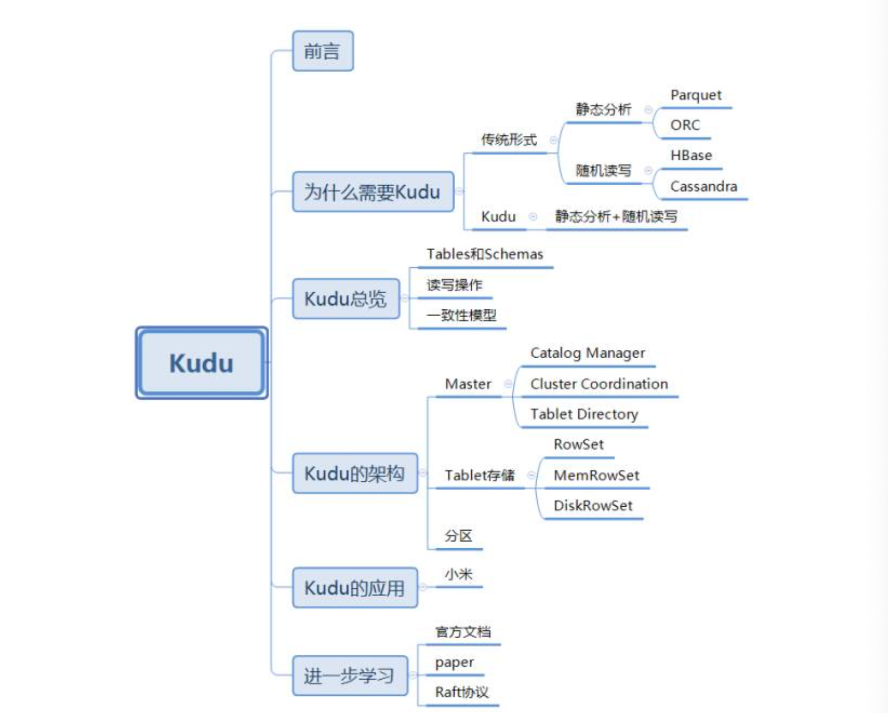

#### 概述

###### 背景

Apache Kudu 是由cloudera开源的存储引擎，可以同时提供低延迟的随机读写和高效的性能分析能力，kudu支持水平扩展，使用Raft协议进行一致性保证，并且与 Impala和Spark等当前流行的大数据查询和分析工具结合紧密。

基于HDFS的存储技术

* 数据分析：Parquet，具有高吞吐量连续读取数据的能力
* 实时读取：Hbase和cassandre等技术适用于低延迟的随机读写场景

在kudu之前，大数据主要有两种方式存储：

* 静态数据：以HDFS引擎作为存储引擎，适用于高吞吐的离线大数据分析。局限是无法进行随机读写。
* 动态数据：以HBase作为存储引擎，适用于大数据随机读写场景，局限是吞吐量不如HDFS，不适用批量数据分析。

两套场景：

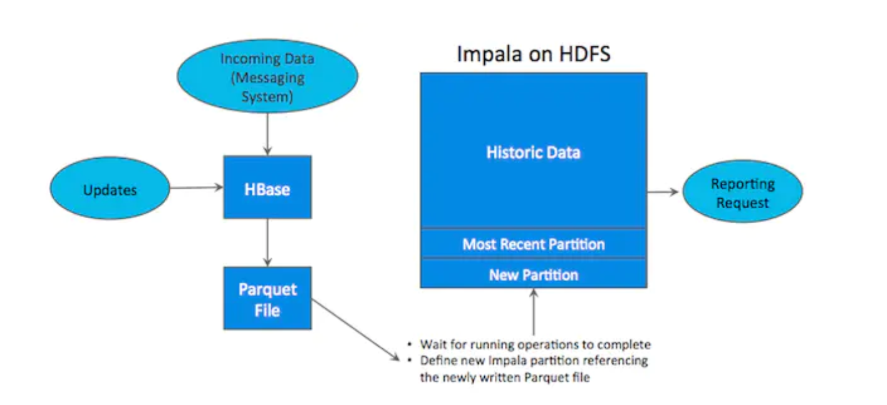

缺点：

* 用户需要在两套系统间编写和维护复杂的ETL逻辑，结构复杂、维护成本高。
* 时效性差，因为ETL通常是一小时、几小时甚至是一天一次，无法满足实时的操作
* 更新需求难以满足，对历史数据进行更新，对parquet静态数据集更新操作代价昂贵。
* 存储资源浪费，两条系统，占用空间翻倍

kudu结合两种优缺点，提供了”happy medium”的选择，虽然数据分析没有hdfs效果好，但是实时性更强，实时性没有hbase好，但是数据分析比hbase更好。并且提供了行级插入、更新、删除API，同时提供了接近Parquet性能的批量扫描操作。使用同一份存储，即可以随机读写，又可以满足数据分析。

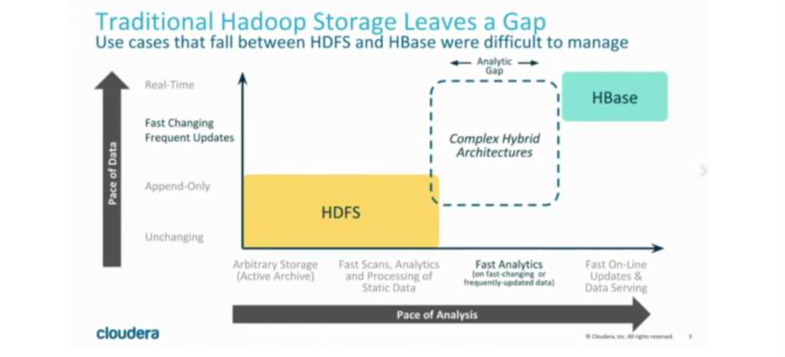

###### 数据模型

kudu的数据模型与传统的关系型数据库类似，一个kudu集群有多个表组成，每个表多个字段组成，一个表必须指定一个由若干个（>= 1）字段组成的主键，如下图：

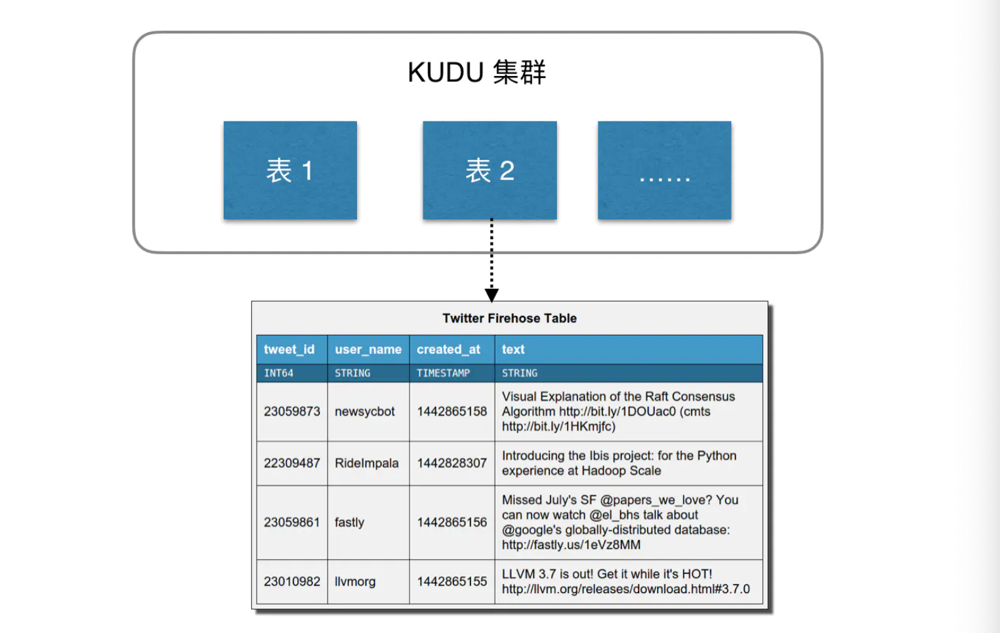

从用户角度来看：kudu是一个存储结构化数据表的存储系统，在一个kudu集群中可以定义任意数量的table。每个table都需要预先定义好schema。每个table的列数是确定的，每一列都需要有名字和类型，每个表中可以把其中一列或多列定义为主键。

kudu更像关系型数据库，而不是像hbase等nosql数据库，不过kudu目前还不能像关系型数据库一样支持二级索引。kudu使用确定的列类型，字段是强类型的，而不是类似于NoSQL的everything  is byte，这样的好处：

* 确定列类型使kudu可以进行类型特有的编码，节省空间
* 可以提供SQL- 像元数据给其他上层查询工具，如BI工具
* KUDU使用场景是OLAP分析，有一个数据类型对下游分析更加友好

用户使用insert、update和delete API 对表进行写操作。不论使用哪种API，都必须指定主键，但批量的删除和更新操作需要依赖更高层次的组件（比如impala、Spark）。Kudu目前还不支持多行事务。而在读操作方面，Kudu只通了scan操作来获取数据。用户可通过指定过滤条件来获取自己想要读的数据，但是目前只提供两种类型的过滤条件：主键范围与列值与常数的比较。由于Kudu在硬盘中的数据采用列式存储，所以只扫描需要的列将极大地提高读取性能。

一致性模型，内部事务隔离。

Kudu为用户提供了两种一致性模型。默认的一致性模型是snapshot consistency，这种一致性模型保证用户每次读出来的都是一个可用快照，但只能保证单个client可以看到最新的数据，不能保证多个client每次取出的数据都是最新的。

另一种一致性模型是external consistency，可以在多个client 主键保证每次取到的数据都是最新数据，但是kudu没有提供默认的实现，需要用户做一些额外的工作。

为了实现external consistency，Kudu提供了两种方式:

* 在Client 之间传播 timestamp token。在一个client 完成一次写入后，会得到一个timestamp token，然后这个client 把这个token传播到其他的client。这样其他的client就可以通过token获取最新的数据，实现复杂度很高。
* 通过commit-wait方式，这有些类似Google的Spanner。但是目前基于NTP的commit-wait方式 延迟实在有点高。不过Kudu相信，随着Spanner的出现，未来几年内基于real-time clock的技术 将会逐渐成熟。

#### Kudu架构

与HDFS和HBase类型，kudu使用单个master节点，用来管理集群的元数据，并且使用任意数量的Tabelt Server 节点用来存储实际数据，可以部署多个Master 节点来提高容错性。

###### Master

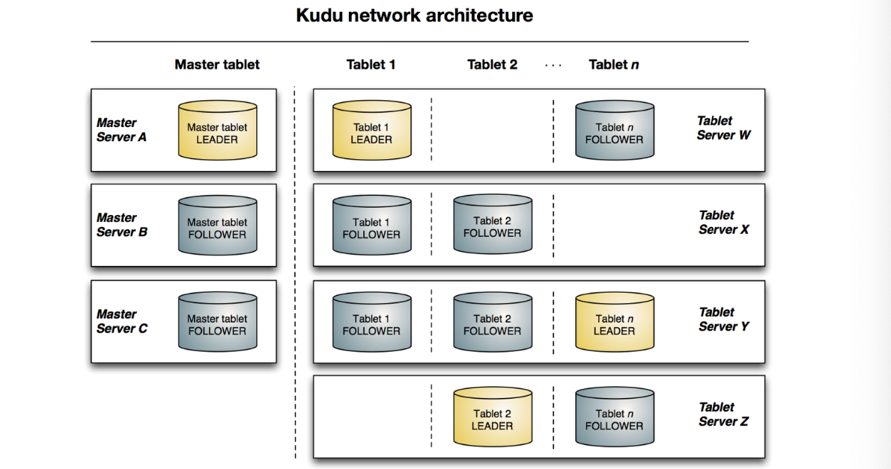

Kudu的master节点复制整个集群的元数据管理和服务协调，它承担着以下功能

* 作为catalog manager，master节点管理着集群中所有table和tablet 的schema及一些其他的元数据。
* 作为 cluster coordinator，master节点追踪着所有server节点是否存活，并且当server节点挂掉后协调数据的重新分布。
* 作为tablet directory，master追踪每个tablet的位置

**Catalog Manager**

kudu的master节点会持有一个table--catalog table，但是用户不能直接访问，master将内部catalog信息写入改tablet，并且将整个catalog信息缓存到内存中。随着现在商用服务器内存越来越大，并且元数据信息占用的空间其实并不大，所以master不容易存在性能瓶颈。catalog table 保存了所有table 的schma的版本以及table的状态（创建、运行、删除等）。

**Cluster Coordination**

Kudu集群中每个tablet server都需要配置master的主机列表，当集群启动时，tablet server会向master注册，并发送所有的tablet的信息，tablet server第一次向master发送信息时会发送所有的全量信息，后续每次发送增量信息，仅包含新创建、删除或修改的tablet的信息。作为cluster coordiination，master只是集群状态的观察者。对于tabletserver中tablet副本的位置，Raft配置和schema版本等信息的控制和修改由tablet server自身完成。master只需要下发命令，tablet server执行成功后会自动上报处理的结果。

**Tablet Driectory**

因为master上缓存了集群的元数据，所以client读写数据的时候，可能要通过master才能获取到tablet的位置等信息，但如果每次读取都要通过master节点的话，那master就会变成这个集群的性能瓶颈，所以client的位置可能也会发生变化，（比如某个tablet server 节点crash掉了），所以当tablet 的位置发生变化的时候，client会受到相应的通知，然后再去master上获取一份新的元数据信息。

###### Table

在数据存储方面，Kudu选择完全有自己实现，而没有借助于已有的开源方案。tablet存储主要想要时间的目标为：

* 快速的列扫描
* 低延迟的随机读写
* 一致性的性能

###### RowSets

在kudu中，tablet被细分为更小的单元，叫做RowSets，一些RowSet仅存在内存中，被称为MemRowSets，而另一些则是同时使用内存和硬盘，被称为DiskRowSets。任何一行未被删除的数据都只能存在于一个RowSet中。无论什么时候，一个Tablet仅有一个MemRowSet用来保存最新插入的数据，并且一个后台线程会定期吧内存中的数据flush到硬盘上。当一个MemRowSet被flush到硬盘上以后，一个新的MemRowSet会代替它。而原来的MemRowSet会变成一个到多个DiskRowSet。flush操作是完全同步进行的，在进行Flush时，Client同样可以进行读写操作。

###### MemRowSet

MemRowSets是一个可以被并发访问并进行锁优化的B-tree，主要是基于MassTree来设计的，但是存在几点不同：

* Kudu并不支持直接删除操作，由于使用了MVCC，所以在Kudu中删除操作其实是插入一条标志着删除的数据，这样就可以推迟删除操作。
* 类似删除操作，Kudu也不支持原地更细操作。
* 将Tree的leaf连接起来，就想B+Tree，这一步关键的操作可以明显的提升scan的操作性能
* 没有时间字典树（trie树），而是只用了单个Tree，因为kudu并不适用于极高的随机读写场景。

与Kudu中其他模块中的数据结构不同，MemRowSet中的数据使用行式存储。因为数据都在内存中，所以性能也是可以接受的，而且Kudu对在MemRowSet中的数据结构进行了一定的优化。

###### DiskRowSet

当MemRowSet被flush到硬盘上，就变成了DiskRowSet。当MemRowSet被flush到硬盘的时候，每32M就会形成一个新的DiskRowSet，这主要是为了保证每个DiskRowSet不会太大，便于后续的增量**compaction**操作。Kudu通过将数据分为Base data和delta data，来实现数据的更新操作。Kudu会将数据按列存储，数据被切分为多个Page，并使用B-tree进行索引，除了用户写入的数据，Kudu还会将主键索引存入一个列中，并且提供布隆过滤器来进行高效查找。

###### Compaction

为了提高查询性能，Kudu会定期进行Compaction操作，合并delta data与base data，对标记了删除的数据进行删除，并且会合并一些DiskRowSet

###### 分区

选择分区策略需要理解**数据模型和表的预期工作负载**

* 对于写量大的工作负载，重要的是要设计分区，使写分散在各个tablet上，以避免单个tablet超载。
* 对于涉及许多短扫描的工作负载（其中联系远程服务器
* 的开销占主导地位），如果扫描的所有数据都位于同一块tablet上，则可能提高性能。

理解这些基本的权衡是设计有效分区模式的核心

没有默认分区,在创建表时，kudu不通过默认的分区策略。建议预期具有繁重读写工作负载的新表至少拥有与tablet服务器相同的tablet

和许多分布式存储系统一样，Kudu的table是水平分区的。BigTable只提供了range分区，Cassandra只提供hash分区，而Kudu同时提供了这两种分区方式，使分区较为灵活。当用户创建一个table时，可以同时指定table的的partition schema，partition schema会将primary key映射为partition key。一个 partition schema包括0到多个hash-partitioning规则和一个range-partitioning规则。通过灵活地组合各种partition规则，用户可以创造适用于自己业务场景的分区方式。

### 安装和运行

Linux122:

```shell
wget http://archive.cloudera.com/kudu/redhat/7/x86_64/kudu/cloudera-kudu.repo

mv cloudera-kudu.repo /etc/yum.repos.d/

yum install kudu kudu-master kudu-tserver kudu-client0 kudu-client-devel -y

cd /etc/default/

vim kudu-master
export FLAGS_log_dir=/var/log/kudu
#export FLAGS_rpc_bind_addresses=0.0.0.0:7051
export FLAGS_rpc_bind_addresses=linux122:7051

vim kudu-tserver
export FLAGS_log_dir=/var/log/kudu
#export FLAGS_rpc_bind_addresses=0.0.0.0:7050
export FLAGS_rpc_bind_addresses=linux122:7050

vim /etc/kudu/conf/master.gflagfile
--fromenv=rpc_bind_addresses
--fromenv=log_dir

--fs_wal_dir=/var/lib/kudu/master
--fs_data_dirs=/var/lib/kudu/master
--trusted_subnets=0.0.0.0/0
--rpc-encryption=disabled
--rpc_authentication=disabled

--unlock_unsafe_flags=true
--allow_unsafe_replication_factor=true
--default_num_replicas=1

vim /etc/kudu/conf/tserver.gflagfile
--fromenv=rpc_bind_addresses
--fromenv=log_dir

--fs_wal_dir=/var/lib/kudu/tserver
--fs_data_dirs=/var/lib/kudu/tserver
--trusted_subnets=0.0.0.0/0
--tserver_master_addrs=linux122:7051
--rpc-encryption=disabled
--rpc_authentication=disabled

--unlock_unsafe_flags=true
--allow_unsafe_replication_factor=true
--default_num_replicas=1

service kudu-master start
service kudu-tserver start
```

在linux121、linux123上面执行tserver相关的修改与配置

```
vim kudu-tserver
export FLAGS_log_dir=/var/log/kudu
#export FLAGS_rpc_bind_addresses=0.0.0.0:7050
export FLAGS_rpc_bind_addresses=linux121:7050

vim /etc/kudu/conf/tserver.gflagfile
--fromenv=rpc_bind_addresses
--fromenv=log_dir

--fs_wal_dir=/var/lib/kudu/tserver
--fs_data_dirs=/var/lib/kudu/tserver
--trusted_subnets=0.0.0.0/0
--tserver_master_addrs=linux122:7051
--rpc-encryption=disabled
--rpc_authentication=disabled

--unlock_unsafe_flags=true
--allow_unsafe_replication_factor=true
--default_num_replicas=1

service kudu-master start
service kudu-tserver start
```

### Kudu常用API

#### 添加Maven依赖

```xml
<dependency>
  <groupId>org.apache.kudu</groupId>
  <artifactId>kudu-client</artifactId>
	<version>1.4.0</version>
</dependency>
```

#### 创建表

```java
package kudu;

import org.apache.kudu.ColumnSchema;
import org.apache.kudu.Schema;
import org.apache.kudu.Type;
import org.apache.kudu.client.CreateTableOptions;
import org.apache.kudu.client.KuduClient;
import org.apache.kudu.client.KuduException;

import java.util.ArrayList;

/**
 * @description:
 * @author: huanghongbo
 * @date: 2021-01-30 16:43
 **/
public class CreateKuduTable {

    public static void main(String[] args) {

        //创建client
        String masterAddresses = "bigdata-test-master01:7051,bigdata-test-master02:7051,bigdata-test001:7051";
        KuduClient client = new KuduClient.KuduClientBuilder(masterAddresses).build();
        //创建表
        String tableName = "student";

        //创建schema信息
        ArrayList<ColumnSchema> columnSchemas = new ArrayList<>();
        ColumnSchema id = new ColumnSchema.ColumnSchemaBuilder("id", Type.INT32).key(true).build();
        ColumnSchema name = new ColumnSchema.ColumnSchemaBuilder("name", Type.STRING).key(false).build();
        columnSchemas.add(id);
        columnSchemas.add(name);
        Schema schema = new Schema(columnSchemas);
        //设置副本和分区信息

        CreateTableOptions options = new CreateTableOptions();
        options.setNumReplicas(1);
        ArrayList<String> keys = new ArrayList<String>();
        keys.add("id");
        options.addHashPartitions(keys, 3);

        try {
            client.createTable(tableName, schema, options);
        } catch (KuduException e) {
            e.printStackTrace();
        } finally {
            try {
                client.close();
            } catch (KuduException e) {
                e.printStackTrace();
            }
        }
    }
}
```

#### 插入数据

```
package kudu;

import org.apache.kudu.client.*;

/**
 * @description:
 * @author: huanghongbo
 * @date: 2021-01-30 19:32
 **/
public class InsertDemo {
    public static void main(String[] args) {
        //1、获取客户端
        KuduClient client = new KuduClient.KuduClientBuilder("bigdata-test-master01:7051,bigdata-test-master02:7051,bigdata-test001:7051").defaultSocketReadTimeoutMs(5000).build();
        //2、打开一张表
        try {
            KuduTable table = client.openTable("student");
            //3、创建会话
            KuduSession session = client.newSession();
            //4、设置刷数据模式
            session.setFlushMode(SessionConfiguration.FlushMode.MANUAL_FLUSH);
            //5、获取插入实例
            Insert insert = table.newInsert();
            //6、声明待插入数据
            insert.getRow().addInt("id", 1);
            insert.getRow().addString("name", "lisi");
            //7、刷入数据
            session.flush();
            //8、应用插入实例
            session.apply(insert);
            //9、关闭会话
            session.close();
        } catch (KuduException e) {
            e.printStackTrace();
        } finally {
            try {
                client.close();
            } catch (KuduException e) {
                e.printStackTrace();
            }
        }
    }
}
```

#### 查询数据

```java
package kudu;

import org.apache.kudu.client.*;

/**
 * @description:
 * @author: huanghongbo
 * @date: 2021-01-30 19:38
 **/
public class SelectDemo {


    public static void main(String[] args) {
        KuduClient.KuduClientBuilder builder = new KuduClient.KuduClientBuilder("bigdata-test-master01:7051,bigdata-test-master02:7051,bigdata-test001:7051");
        builder.defaultSocketReadTimeoutMs(50000);
        KuduClient client = builder.build();

        try {
            KuduTable stuTable = client.openTable("student");
            KuduScanner scanner = client.newScannerBuilder(stuTable).build();
            while (scanner.hasMoreRows()) {
                for (RowResult result : scanner.nextRows()) {
                    int id = result.getInt("id");
                    String name = result.getString("name");
                    System.out.println("id:" + id + "...name:" + name );
                }
            }
        } catch (KuduException e) {
            e.printStackTrace();
        } finally {
            try {
                client.close();
            } catch (KuduException e) {
                e.printStackTrace();
            }
        }
    }
}
```

#### 修改数据

```java
package kudu;

import org.apache.kudu.client.*;

/**
 * @description:
 * @author: huanghongbo
 * @date: 2021-01-30 22:58
 **/
public class UpdateDemo {

    public static void main(String[] args) {

        KuduClient client = new KuduClient.KuduClientBuilder("bigdata-test-master01:7051,bigdata-test-master02:7051,bigdata-test001:7051").defaultSocketReadTimeoutMs(5000).build();

        try {
            KuduTable table = client.openTable("student");
            KuduSession kuduSession = client.newSession();
            kuduSession.setFlushMode(SessionConfiguration.FlushMode.MANUAL_FLUSH);

            Update update = table.newUpdate();
            update.getRow().addInt("id", 2);
            update.getRow().addString("name", "zhangsan");

            kuduSession.apply(update);
            kuduSession.close();

        } catch (KuduException e) {
            e.printStackTrace();
        } finally {
            try {
                client.close();
            } catch (KuduException e) {
                e.printStackTrace();
            }
        }
    }
}
```

#### 删除数据

```java
package kudu;

import org.apache.kudu.client.*;

/**
 * @description:
 * @author: huanghongbo
 * @date: 2021-01-30 23:02
 **/
public class DeleteDemo {

    public static void main(String[] args) {

        KuduClient client = new KuduClient.KuduClientBuilder("bigdata-test-master01:7051,bigdata-test-master02:7051,bigdata-test001:7051").defaultSocketReadTimeoutMs(5000).build();
        try {
            KuduTable table = client.openTable("student");

            KuduSession session = client.newSession();
            session.setFlushMode(SessionConfiguration.FlushMode.MANUAL_FLUSH);

            Delete delete = table.newDelete();
            delete.getRow().addInt("id",2);

            session.flush();
            session.apply(delete);

            session.close();

        } catch (KuduException e) {
            e.printStackTrace();
        }finally {
            try {
                client.close();
            } catch (KuduException e) {
                e.printStackTrace();
            }
        }
    }
}
```

#### 删除表

```java
package kudu;

import org.apache.kudu.client.KuduClient;
import org.apache.kudu.client.KuduException;

/**
 * @description:
 * @author: huanghongbo
 * @date: 2021-01-30 23:05
 **/
public class DeleteTableDemo {

    public static void main(String[] args) {
        KuduClient client = new KuduClient.KuduClientBuilder("bigdata-test-master01:7051,bigdata-test-master02:7051,bigdata-test001:7051").defaultSocketReadTimeoutMs(5000).build();

        try {
            client.deleteTable("flink_table");
        } catch (KuduException e) {
            e.printStackTrace();
        }finally {
            try {
                client.close();
            } catch (KuduException e) {
                e.printStackTrace();
            }
        }
    }
}
```

### Spark 操作Kudu接口

#### 注意事项

* Kudu引擎暂不支持SparkSQL中 < 、> 、or 这些谓词下推，支持like，但仅限于“201907%”这种形 式，不支持“201907%02”这种形式 
* 使用SparkSQL读取Kudu表时，必须使用between或者in来指定range分区字段的范围，否则会变成全表扫描，效率极低!!! 
* 插入数据、更新数据和删除行的df必须包含所有主键，主键不可为空 
* 删除kudu分区会同时删除分区内的数据

#### Spark-Kudu接口

目前官网提供的kuduContext接口极为简单，无法满足需求，因此整合了一个功能更全面的接口。 GitHub地址: https://github.com/hhb1san14/KuduHandle

### Kudu表设计

Tablet是kudu表的水平分区，类似于google Bigtable的tablet，或者HBase的region。每个tablet存储 着一定连续range的数据(key)，且tablet两两间的range不会重叠。一张表的所有tablet包含了这张表的所有key空间。

Tablet由RowSet组成，RowSet由一组rows组成(n条数据、n行数据)。RowSet是不相交的，即不同的RowSet间的row不会交叉，因此一条给定的数据，只会存在于一个RowSet中。虽然Rowset是不相交的，但是两两间的key空间是可以相交的(key的range)。

#### Handling Insertions

一个RowSet存储在内存中，它被称为MemRowSet，一个tablet中只有一个MemRowSet。 MemRowSet是一个in-memory的B-Tree树，且按照表的主键排序。所有的insert直接写入进 MemRowSet。受益于MVCC(Multi-Version Concurrency Control 多版本并发控制，下文中会讲述)，一旦数据写入到MemRowSet，后续的reader能立马查询到。

注意:不同于BigTable，Kudu只有插入和插入与flush前的mutation才会被记录到MemRowSet。 mutation例如基于磁盘数据的update、deletion，下文会有介绍。

任何一条数据都以entry的形式精确的存在于一个MemRowSet中，entry由一个特殊的header和实际的 row data内容组成。由于MemRowSet只存于内存中，最终会被写满，然后Flush到磁盘里(一个或者 多个DiskRowSet中)。(下文会详细介绍)

#### MVCC overview

Kudu为了提供一些有用的特性，使用多版本并发控制:

Snapshot scanner:快照查询，当创建了一个查询，系统会操作tablet指定时间的快照(point-in- time)。在这个查询过程中的任何针对这个tablet的update都会被忽略。另外，指定时间的快照 (point-in-time)可以被存储并在其他的查询中重复使用，例如，一个应用对一组连续的数据进行多次 交互执行分析查询。

Time-travel scanners:历史快照查询，与上边的快照查询一样。用户可以指定历史的一个时间点创建 一个查询，MVCC可以保证历史快照的一致性。这个功能可以被用来在某个时间点上的一致性备份。 Change-history queries:历史变更查询，给定两个MVCC快照，用户可以查询这两个快照间任务数据。这个功能可以用来做增量备份，跨集群同步，或者离线审计分析。

Multi-row atomic updates within a tablet:tablet内多行数据的原子更新，在一个tablet里，一个操作 (mutation)可以修改多行数据，而且在一条数据里的原子操作里是可见的。(应该是针对column的 原子操作) 为了提供MVCC功能，每个操作(mutation)会带有一个时间戳(timestamp)。Timestamp是由TS- wide Clock实例提供的，tablet的MvccManager能保证在这个tablet中timestamp是唯一的不重复的。 MvccManager决定了数据提交的timestamp，从而这个时间点后的查询都可以获取到刚刚提交的数 据。查询在被创建的时候，scanner提取了一个MvccManager时间状态的快照，所有对于这个scanner 可见的数据都会跟这个MvccSnapshot比较，从而决定到底是哪个insertion、update或者detete操作后 的数据可见。

每个tablet的Timestamp都是单调递增的。我们使用HybridTime技术来创建时间戳，它能保证节点之 间的时间戳一致。

为了支持快照和历史快照功能，多个版本的数据必须被存储。为了防止空间无限扩展，用户可以配置一 个保留时间，并将这个时间之前的记录GC(这个功能可以防止每次查询都从最原始版本开始读取)。

#### MVCC Mutations in MemRowSet

为了在MemRowSet中支持MVCC功能，每行插入的数据都会带着时间戳。而且，row会有一个指针，它指向紧随其后的mutations列表，每个mutation都有带有timestamp:

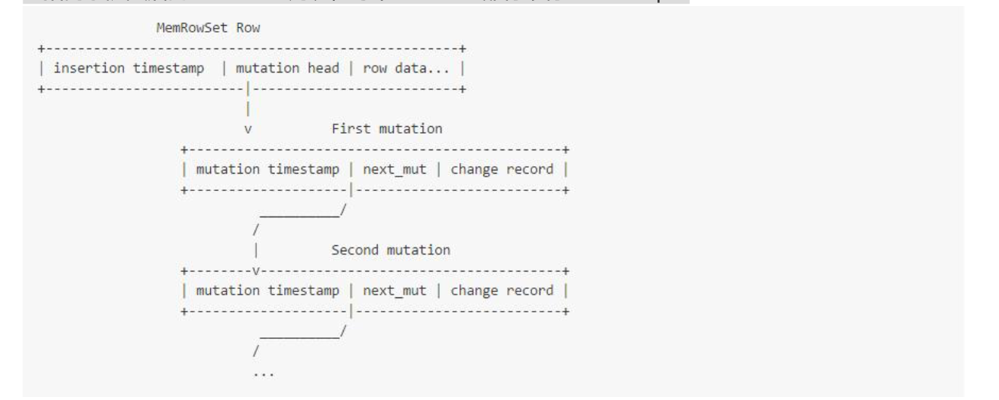

在传统的关系型数据库术语里，这个有序的mutations列表可以被称作“RODO log”。 任何reader需要访问MemRowSet的row中的mutations，才能得到正确的快照。逻辑如下:

如果这行数据插入时的timestamp，不在scanner 的MVCC snapshot里(即scanner快照指定的 timestamp小于数据插入的时间戳，数据还没创建)，忽略该行。 如上如果不满足，将这行数据放入output缓存里。
 循环list里的mutation:

1. 如果mutation的timestamp在MVCC snapshot里，在内存的缓存中执行这个更新。如果不在，则 跳过此mutation。

2. 如果mutation是一个DELETE操作，则在buffer中标记为已经被删除了，并清空之前加载缓存里的 数据。

注意，mutation可以是如下的任何一种:

* UPDATE:更新value，一行数据里的一列或者多列

* DELETE: 删除一行数据

* REINSERT:重新插入一行数据(这种情况只在之前有一个DELETE mutation且数据在MemRowSet里 时发生。)

 举个真实例子，表结构(key STRING, val UINT32)，经过如下操作:

INSERT INTO t VALUES (“row”, 1); [timestamp 1] 

UPDATE t SET val = 2 WHERE key = “row”; [timestamp 2] 

DELETE FROM t WHERE key = “row”; [timestamp 3] 

INSERT INTO t VALUES (“row”, 3); [timestamp 4] 

在MemRowSet中，会有如下结构:

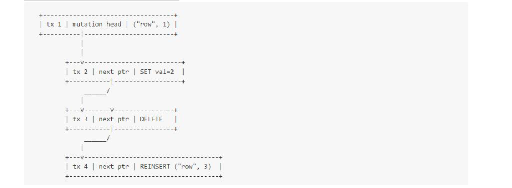

注意，当更新过于频繁时，会有如下的影响:

readers需要追踪linked list指针，导致生成很多CPU cache任务 更新需要追加到linked list的末尾，导致每次更新的时间复杂度是O(n)。 考虑到如上低效率的操作，我们给出如下假设:

Kudu适用于相对低频率更新的场景，即假设数据不会过于频繁的更新。 整个数据中，只有一小部分存于MemRowSet中:一旦MemRowSet达到一定阈值，它会被flush到 disk。因此即使MemRowSet的mutation会导致性能低，也只是占用整体查询时间的一小部分。 如果如上提到的低效率影响到了实际应用，后续会有很多降低开销的优化可以去做。

#### MemRowSet Flushes

当MemRowSet满了，会触发Flush操作，它会持续将数据写入disk。

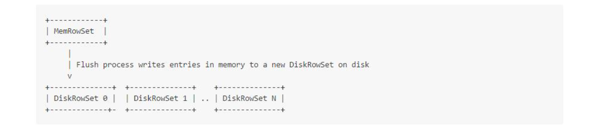

数据flush到disk成了CFiles文件(参见src/kudu/cfile/README)。数据里的每行都通过一个有序的 rowid标识了，而且这个rowid在DiskRowSet中是密集的、不可变的、唯一的。举个例子，如果一个给 定的DiskRowSet包含有5行数据，那么它们会以key上升的顺序被分配为rowid0~4。不同的 DiskRowSet，会有不同的行(rows)，但却可能有相同rowid。

读取时，系统会使用一个索引结构，把用户可见的主键key和系统内部的rowid映射起来。上述例子中的 主键是一个简单的key，它的结构嵌入在主键列的cfile里。另外，一个独立的index cfile保存了编码后的 组合key，使用了提供了类似的方法。(不懂)

注意:rowid不是精确的跟每行数据的data存在一起，而是在这个cfile里根据数据有序的index的一个隐 式识别。在一部分源码中，将rowid定义为 “row indexes” 或者 “ordinal indexes”。

注意:其他系统，例如C-Store把MemRowSet称为”write optimized store” (WOS)，把DiskRowSet称 为”read-optimized store” (ROS)。

#### Historical MVCC in DiskRowSets

为了让on-disk data具备MVCC功能，每个on-disk的Rowset不仅仅包含当前版本row的data，还包含 UNDO的记录，如此，可以获取这行数据的历史版本。

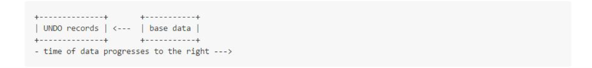

当用户想读取flush后最新版本的数据时，只需要获取base data。因为base data是列式存储的，这种查询性能是非常高的。如果不是读取最新数据，而是time-travel查询，就得回滚到指定历史时间的一个 版本，此时就需要借助UNDO record数据。

当一个查询拿到一条数据，它处理MVCC信息的流程是:

读取base data

循环每条UNDO record:如果相关的操作timestamp还未提交，则执行回滚操作。即查询指定的快照 timestamp小于mutation的timestamp，mutation还未发生。

举个例子，回顾一下之前MVCC Mutations in MemRowSet章节例子的一系列操作:

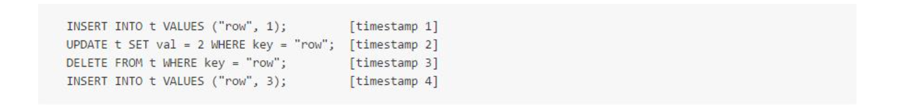

当这条数据flush进磁盘，它将会被存成如下形式:

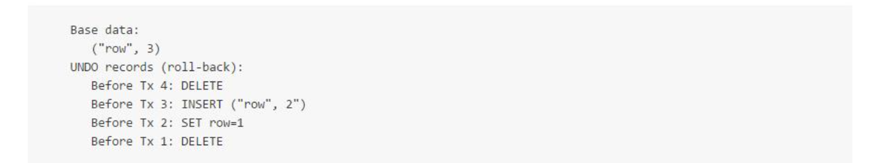

每条UNDO record是执行处理的反面。例如在UNDO record里，第一条INSERT事务会被转化成 DELETE。UNDO recod旨在保留插入或者更新数据的时间戳:查询的MVCC快照指定的时间早于Tx1 时，Tx1还未提交，此时将会执行DELETE操作，那么这时这条数据是不存在的。

再举两个不同查询的例子:

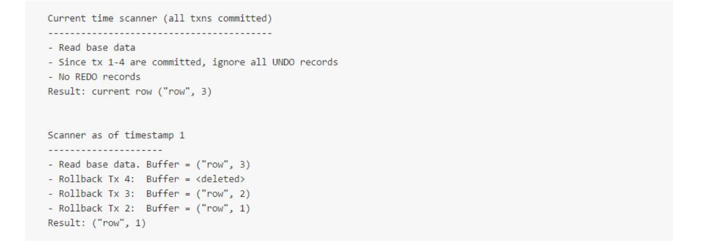

每个例子都处理了正确时间的UNDO record，以产生正确的数据。

最常见的场景是查询最新的数据。此时，我们需要优化查询策略，避免处理所有的UNDO records。为了达到这个目标，我们引入文件级别的元数据，指向UNDO record的数据范围。如果查询的MVCC快照符合的所有事务都已经提交了(查询最新的数据)，这组deltas就会短路(不处理UNDO record)，这时查询将没有MVCC开销。

#### Handling mutations against on-disk files

更新或者删除已经flush到disk的数据，不会操作MemRowSet。它的处理过程是这样的:为了确定 update/delete的key在哪个RowSet里，系统将巡视所有RowSet。这个处理首先使用一个区间tree，去定位一组可能含有这key的RowSet。然后，使用boom filter判断所有候选RowSet是否含有此key。如果某一些RowSet同时通过了如上两个check，系统将在这些RowSet里寻找主键对应的rowid。

一旦确定了数据所在的RowSet，mutation将拿到主键对应的rowid，然后mutation会被写入到一个称为DeltaMemStore的内存结构中。

一个DiskRowSet里就一个DeltaMemStore，DeltaMemStore是一个并行BTree，BTree的key是使用 rowid和mutation的timestamp混合成的。查询时，符合条件的mutation被执行后得到快照timestamp 对应数据，执行方式与新数据插入后的mutation类似(MemRowSet)。

当DeltaMemStore存入的数据很大后，同样也会执行flush到disk，落地为DeltaFile文件:

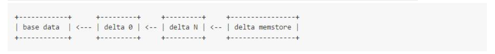

DeltaFile的信息类型与DeltaMemStore是一致的，只是被压实和序列化在密集型的磁盘里。为了把数据从base data更新成最新的数据，查询时需要执行这些DeltaFile里的mutation事务，这些DeltaFile集合称作REDO文件，而file里这些mutation称作REDO record。与存于MemRowSet里的mutation类似，当读取比base data更新版本的数据时，它们需要被一次应用(执行)。

一条数据的delta信息可能包含在多个DeltaFile文件，这种情况下，DeltaFile是有序的，后边的变更会优先于前边的变更。

注意，mutation存储结构没必要包含整行的数据。如果在一行中，仅仅只有一列数据被更新，那么 mutation结构只会包含这一列的更新信息。不读取或者重写无关的列，这样更新数据操作就快而有效率。

#### Summary of delta file processing

总结一下，每个DiskRowSet逻辑上分三部分:

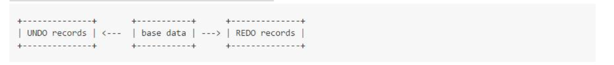

Base data:MemRowSet flush到DiskRowSet时的最新数据，数据是列式存储的。 

UNDO records:历史数据，用来回滚到Base data之前一些历史版本数据。

REDO records:Base data之后的一些更新数据，可以用来得到最新版本的数据。 

UNDO record 和REDO record存储格式是一样的，都称为DeltaFile。

#### Delta Compactions

当DeltaFile里的mutation堆积越来越多，读取RowSet数据效率就越来越低，最坏情况，读取最新版本数据需要遍历所有REDO record并与base data merge。换一句话说，如果数据被更新了太多次，为了得到最新版本的数据，就需要执行这么多次的mutation。

为了提高读取性能，Kudu在后台将低效率的物理布局转化成更加高效的布局，且转化后具有同样的逻辑内容。这种转化称为:delta compaction。它的目标如下:

1. 减少delta files数量。RowSet flush的delta files文件越多，为了读取最新版本数据所要读取的独立的delta

   files就越多。这个工作不适于放在内存中(RAM)，因为每次读取都会带有delta file的磁盘寻

   址，会遭受性能损失。

2. 将REDO records迁移成UNDO records。如上所述，一个RowSet包含了一个base data，且是按列存储的，往后一段是UNDO records，往前一段是REDO records。大部分查询都是为了获取最新版本的数据，因此我们需要最小化REDO records数量。

3. 回收old UNDO records。UNDO recods只需要保存用户设定最早时间点后的数据，这个时间之前的UNDO record都可以从磁盘中移除。

注意:BigTable的设计是timestamp绑定在data里，没有保留change信息(insert update delete); 而kudu的设计是timestamp绑定在change里，而不是data。如果历史的UNDO record被删除，那么将 获取不到某行数据或者某列数据是什么时候插入或者更新的。如果用户需要这个功能，他们需要保存插 入或者更新的timestamp列，就跟传统关系型数据库一样。

#### Types of Delta Compaction

delta campaction分minor和major两种。

Minor delta compactoin:Minor compaction是多个delta file的compaction，不会包含base data，compact生成的也是delta file。

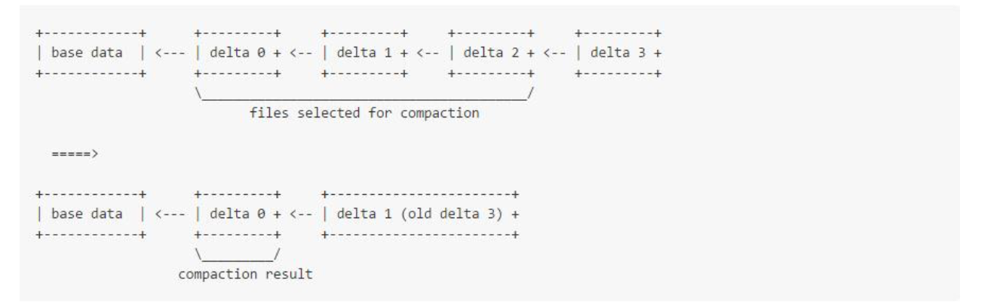

Major delta compaction:Major compaction是对base data和任意多个delta file的compact。

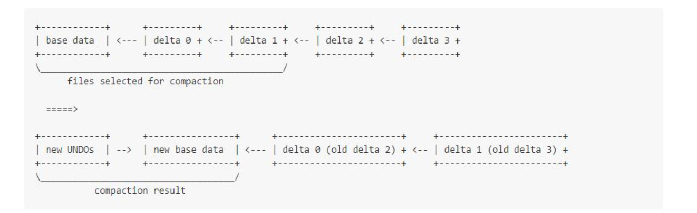

Major compaction比minor compaction更耗性能，因为它需要读取和重写base data，并且base data 比delta data大很多(因为base data存了一行数据，而delta data是对某一些column的mutation，需要注意的base data是列式存储的，delta data不是)。

Major compaction可以对DiskRowSet里的任意多个或者一个column进行compact。如果只有一列数据进行了多次重要的更新，那么compact可以只针对这一列进行读取和重写。在企业级应用中会经常遇到这种情况，例如更新订单的状态、更新用户的访问量。

两种类型的compaction都维护RowSet里的rowid。因为它们完全在后台执行，且不会带锁。compact 的结果文件会采用原子swapping的方式被引入进RowSet。Swap操作结束后，compact前的那些老文件将会被删除。

#### Merging compactions

随着越来越多的数据写入tablet，DiskRowSet数量也会累积的越来越多。如此这般将会降低kudu性 能:

1. 随机访问(通过主键获取或者更新一条数据)，这种情况下，每个RowSet只要它的key范围包含了 这个主键，将各自去定位主键的位置。Boom filter可以缓解一定数量的物理寻址，但是特大的bloom filter访问会影响到CPU，并且同样会增加 内存消耗。
2. 查询一定key范围数据(例如查询主键在A与B之间的数据)，此时，每个RowSet，只要它的key范 围与提供的范围重叠，将各自去寻址，不使用bloom filter。专门的索引结构可能会有帮助，但是同样会消耗内存。
3. 排序查询，如果用户要求查询的结果与主键有相同顺序，那么查询结果集必须经过一个merge过 程。Merge的消耗通常与输入的数据量成对数级增长，即随着数据量的增大，merge将越耗性能。

如上所述，我们应该merge RowSet以减少RowSet的数量:

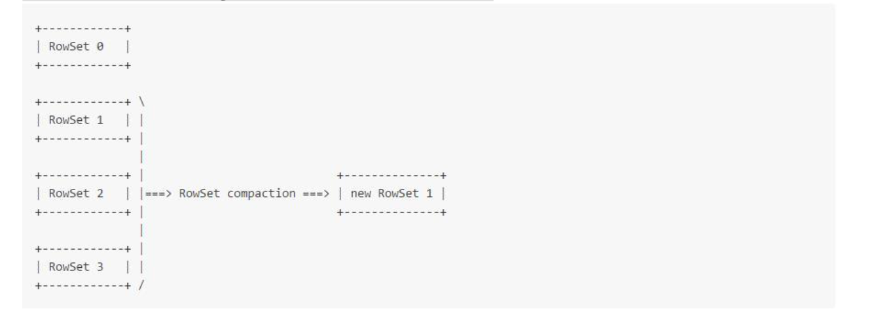

与如上提到的Delta Compaction不同，请注意，merging Compaction不会保持rowid一样。这使得处 理并发的mutation错综复杂。这个过程在compaction.txt文件中有比较详细的描述。

#### Overall picture

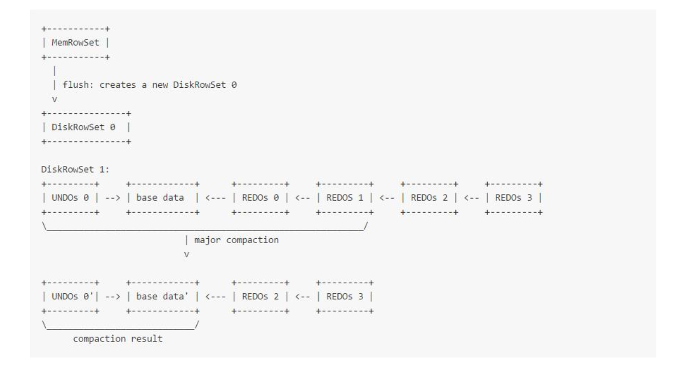

#### Comparison to BigTable approach

与BigTable不同的设计方式点如下:

1. kudu中，一个给定的key只会存在于一个tablet的RowSet里。 在BigTable里，一个key可以存在多个不同的SSTable里。BigTable的一整个Tablet类似于kudu的 RowSet:读取一条数据需要merge所有SSTable里找到的数据(根据key)，类似于Kudu，读取一 条数据需要merge base data和所有DeltaFile数据。 Kudu的优势是，读取一条数据或者执行非排序查询，不需要merge。例如，聚合一定范围内的 key可以独立的查询每个RowSet(甚至可以并行的)，然后执行求和，因为key的顺序是不重要的， 显然查询的效率更高。 Kudu的劣势是，不像BigTable，insert和mutation是不同的操作:insert写入数据至 MemRowSet，而mutation(delete、update)写入存在这条数据的RowSet的DeltaMemStore 里。性能影响有一下几点:
    a)写入时必须确定这是一条新数据。这会产生一个bloom filter查询所有RowSet。如果布隆过滤器得到一个可能的match(即计算出可能在一个RowSet 里)，接着为了确定是否是insert还是update，一个寻址就必须被执行。 假设，只要RowSet足够小，bloom filter的结果就会足够精确，那么大部分插入将不需要物理磁盘寻址。另外，如果插入的key是有序 的，例如timeseries+“_”+xxx，由于频繁使用，key所在的block可能会被保存在数据块缓存中。 b)Update时，需要确定key在哪个RowSet。与上雷同，需要执行bloom filter。这有点类似于关系型数据库RDBMS，当插入一条主键存在的数据时会报错，且不会更新这条数 据。类似的，更新一条数据时，如果这条数据不存在也会报错。BigTable的语法却不是这样。

2. Mutation操作磁盘数据，是通过rowid的，而不是实际意义上的key。 BigTable中，同一个主键数据是可以存在多个SSTable里的，为了让mutation和磁盘的存的key组 合在一起，BigTable需要基于rowkey执行merge。Rowkey可以是任意长度的字符串，因此对比 rowkey是非常耗性能的。另外，在一个查询中，即使key列没有被使用(例如聚合计算)，它们也 要被读取出来，这导致了额外的IO。复合主键在BigTable应用中很常见，主键的大小可能比你关注 的列大一个数量级，特别是查询的列被压缩的情况下。 相比之下，kudu的mutation是与rowid绑定的。所以merge会更加高效，通过维护计数器的方 式:给定下一个需要保存的mutation，我们可以简单的相减，就可以得到从base data到当前版本有多少个mutation。或者，直接寻址可以用来高效的获取最新版本的数据。 另外，如果在查询中没有指定key，那执行计划就不会查阅key，除了需要确定key边界情况。 举 例:

   

   如上表的主键是(host,unitx_time)，在kudu里的执行伪代码如下:sum = 0 foreach RowSet: start_rowid = rowset.lookup_key(1349658729) end_rowid = rowset.lookup_key(1352250720) iter =
    rowset.new_iterator(“cpu_usage”) iter.seek(start_rowid) remaining =

   end_rowid - start_rowid while remaining > 0: block = iter.fetch_upto(remaining) sum += sum(block)。 获取block也非常的高效，因为mutation直接指向了block的索引地址。

3. timgstamp不是数据模型里的一部分。 BigTable-like的系统中，每个cell的timstamp都是暴露给用户的，本质上组成了这个cell的一个符 合主键。意味着，这种方式可以高效的直接访问指定版本的cell，且它存储了一个cell的整个时间 序列的所有版本。而Kudu却不高效(需要执行多个mutation)，它的timestamp是从MVCC实现 而来的，它不是主键的另外一个描述。作为替代，kudu可以使用原生的复合主键来满足时间序列场景，例如主键(host，unix_time)。

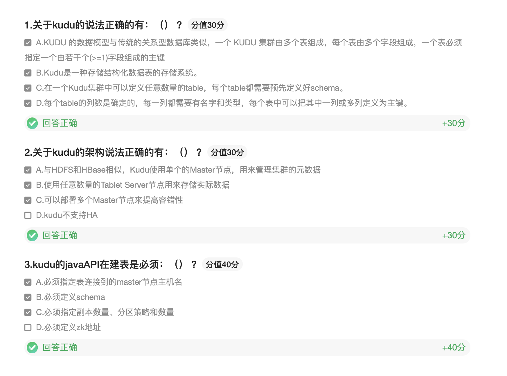