## 课程概述

```
1. 概述（历史、特点、应用场景；基本术语；技术架构；工作原理；生态）
2. 安装配置
3. 构建Cube（全量构建）
4. 增量构建Cube
5. Cube优化
6.流式构建
```

## Apache Kylin实战

Apache KylinTM是一个开源的、分布式的分析引擎，提供 Hadoop 之上的 SQL 查询接口及多维分析(OLAP)能力以支持超大规模数据，最初由 eBay 开发并贡献至开源社区，它能在亚秒内查询巨大的表。


### Kylin概述

#### 背景、历史及特点

Apache Kylin，一种MOLAP的数据分析引擎。最早脱胎于eBay中国研发中心，并贡献给Apache基金会，目前Apache Kylin的核心开发团队已经自立门户，创建了Kyligence (Kylin Intelligence) 公司。值得一提的是，Apache Kylin是第一个由中国人主导的Apache顶级项目。

eBay使用的传统数据仓库和商业智能平台遇到瓶颈，Hadoop平台虽然可以批量处理大规模数据，但无法提供高效的 数据交互分析。于是，Kylin被eBay孵化了。

###### Apache Kylin 发展历程

* 2014 年 Kylin 诞生，支持 Hive 批数据源，从海量历史数据挖掘价值
* 2015 年 V1.5 首次支持 Kafka 数据源，采用单机微批次构建
* 2016 年 V1.6 发布准实时(NRT Streaming)， 使用 Hadoop 微批次消费流数据 
* 2017 年 V2.0 支持雪花模型和 Spark 引擎
* eBay 团队开始尝试 real-time

* 2018 年 V2.4 支持 Kafka 流数据 与 Hive 维度表 join
* eBay 开源 real-time OLAP 实现

* 2019 年 Q1，经过社区 review 和完善，合并 master
* 2019 年 Q4，v3.0 发布 Real-time OLAP，实现秒级数据准备延迟

Kylin提供多维数据分析(MOLAP)的秒级响应。目前国内很多公司都在使用Kylin。Kylin的特点:

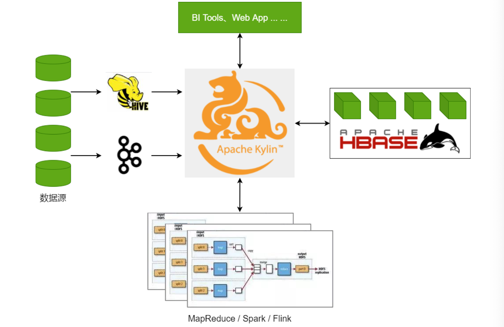

数据源和模型：只要支持Hive、Kafka

构建引擎：早期支持MapReduce计算引擎，新版本支持Spark、Flink计算引擎。除了全量构建外，对基于时间的分区特性，支持增量构建。

存储引擎：构建好的Cube与Key-Value的形式存储在Hbase中，通过优化RowKey加速查询。每一种维度的排列组合计算结果被保存为一个物化视图，交Cuboid

优化算法：Cube本身就是空间换时间，也会根据算法，剪枝优化掉一些多余的Cuboid，寻求平衡，

访问接口：支持标准SQL接口，可以对接Zeppelin、Tableau等BI工具。SQL通过查询引擎，可以被路由到对应的Cuboid上

#### 应用场景

**特点：Kylin在亚秒内返回海量数据的查询结果**

Kylin典型的应用场景如下：

* 巨大的数据量，单个数据源表千亿行数据级别，且单个数据源达百TB级别
* 巨大的查询压力（查询的高并发）
* 查询的快速反应
* 下游灵活的查询方式，需支持带有复杂条件的SQL查询

Kylin的核心思想是**预计算**，将数据按照指定的维度和指标，预先计算出所有可能的查询结果，**利用空间换时间**来加速模式固定的OLAP查询

#### 基本术语

###### 数据仓库

数据仓库是一种信息系统的资料储存理论，强调的是利用某些特殊的资料储存方式，让所包含的资料特别有利于分析和处理，从而产生有价值的资讯，并可依此做出决策。

利用数据仓库的方式存放的资料，具有一旦存入，便不会随时间发生变动的特性，此外，存入的资料必定包含时间属性，通常一个数据仓库中会含有大量的历史性资料，并且它可利用特定的分析方式，从其中发掘出特定的资讯。

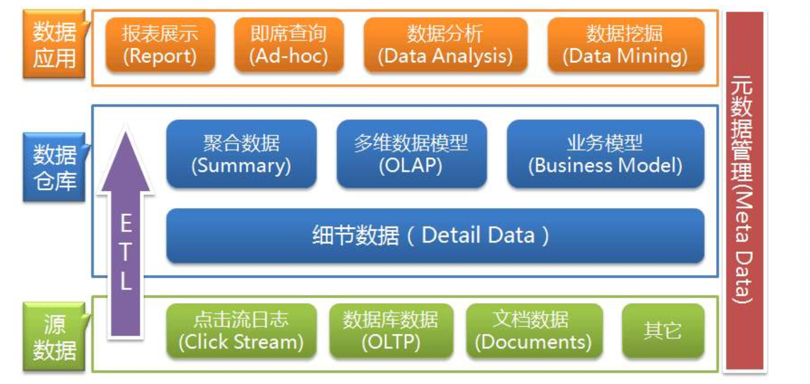

###### OLTP

联机事务处理。传统的关系型数据库的应用

###### OLAP分类

**OLAP**（Online Analytical Process），联机分析处理，以多维度的方式分析数据。它是呈现集成性决策信息的方法，多用于数据仓库。主要功能在于方便大规模数据分析以及统计计算。与之想区别的是OLTP，联机交易处理，侧重于基本的、日常的事务处理，主要是数据的增删改查。

OLAP的概念，在实际应用中存在广义和狭义两种不同的理解方式，广义上理解的与字面上意思相同，泛指一切不会对数据进行更新的分析处理。但更多的情况下是狭义上的含义：即与多维分析相关，基于立方体Cube计算而进行的分析

OLAP有多种实现方法，根据存储数据的方式不同可以分为ROLAP、MOLAP、HOLAP

**ROLAP**（Relational PLAP），细节数据、聚合后的数据都保存在类关系型数据库中。hive、SparkSQl等属于ROLAP。

**MOLAP**(Multidimensional OLAP),事先将汇总数据计算好，存放在自己特定的多维数据库中，用户的OLAP操作可直接映射到多维数据库的访问，不通过SQL访问，其实只是空间换时间。

Apache kylin 本质上是MOLAP

**HOLAP**（Hybird OLAP），表示基于混合数据组合的OLAP实现（Hybrid OLAP）。如底层是关系型的，高层是多维矩阵型的，这种港式具有更好的灵活性

###### 事实表和维度表

事实表（Fact Table）是指存储有事实记录的表，如系统日志、销售日志、传感器数值等；事实表的记录是动态增长的，所有它的体积远远大于维度表

维度表或维表，也被称为查找表，是与事实表相对应的一种表；他保存了维度的属性值，可以跟事实表做关联，相当于将事实表上经常重复的属性抽取、规范出来用一张表进行管理。常见的维度表有：日期表（存储于日期对应的周、月、季度等属性）、地区表（包含国家、省、洲、城市等属性）等。维度表的变化通常不会太大。使用维表的好处：

* 缩小了事实表的大小
* 便于维度的管理和维护，增加、删除和修改维度的属性，不必对事实表的大量记录进行改动
* 维度表可以为多个事实表重用

###### 维度和度量

维度：是指审视数据的角度，通常是数据记录的一个属性，如时间、地点等

度量：聚合的统计值，就是聚合运算的结果，通常是一个数值，如销售额、不同用户数等

分析人员往往要结合若干个维度来审查度量值，以便在其中找到变化规律。在一个SQL查询中，Group by的属性通常就是维度，而所计算的值则是度量

```sql
select part_dt,
  lstg_site_id,
  -- 度量
  sum(price) as total_selled,
  count(distinct seller_id) as sellers
from kylin_sales
-- 维度
group by part_dt, lstg_site_id;
```

###### 星型模型&雪花模型

星型模型（Star Schema）是数据仓库维度建模中常用的数据模型之一，他的特点是一张事实表，以及一到多个维度表，事实表与维度表通过主外键相关联，维表之间没有关联

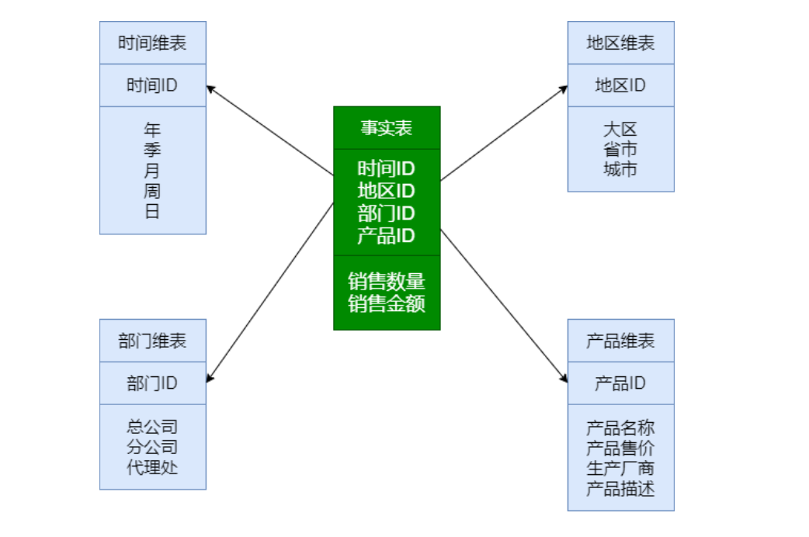

另一种常用的模型是雪花模型（SnowFlake Schema），就是将星型模型中的某些维度表抽取成更细粒度的维表，然后让维表之间也进行关联，这种形状酷似雪花的模型被称为雪花模型

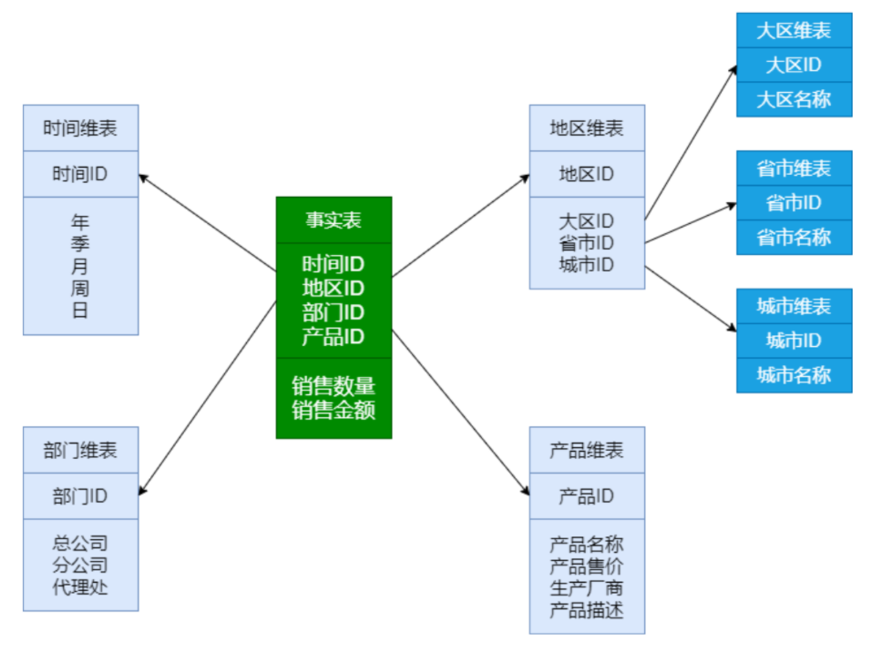

**低版本只支持星型模型，从2.0开始支持雪花模型**

###### Cube 和 Cuboid

Cube即多维立方体，也叫数据立方体

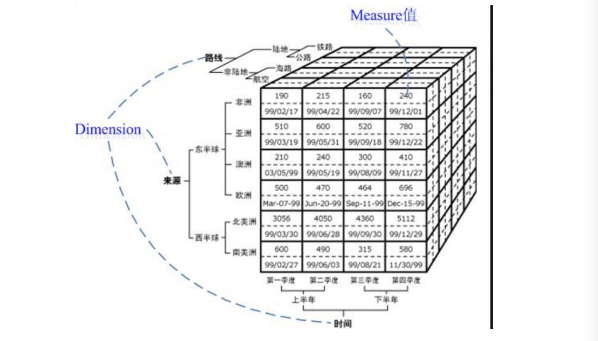

这是有三个维度（维度数可以超过 3 个，上图仅为了方便画图表达）构成的OLAP立方体，立方体中包含了满足条件的 **cell（子立方体）**值，这些cell里面包含了要分析的数据，称之为度量值

* 立方体：有维度构建出来的多维空间，包含了所有要分析的基础数据，所有的聚合数据操作都在立方体上进行
* 维度：观察数据的角度，一般是一组离散值。对于N各维度来说，所有可能的组合有2的N次方个
* 度量：即聚合计算的结果，一般是连续的值
* Cuboid:特指Kylin中在某一中维度组合下所计算的数据
* 事实表中的一个字段，要么是维度，要么是度量（可以被聚合）
* 给定一个数据模型，可以对其上所有维度进行组合，对于N个维度来说，所有可能的组合有2的N次方个
* Cube（或称DataCube），即数据立方体，是一种常用于数据分析与索引技术，他可以对原始数据建立多个维度索引，大大加快查询效率。数据立方体只是多维度模型的一个形象的说法。
* **Cuboid特指Kylin中某一种维度组合下所有计算的数据**

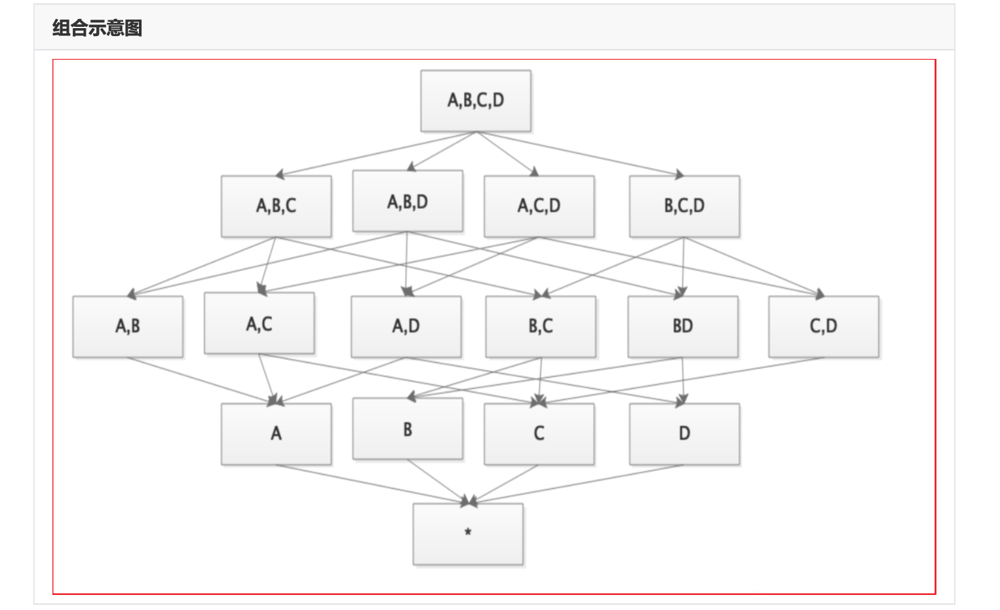

#### Kylin的技术架构

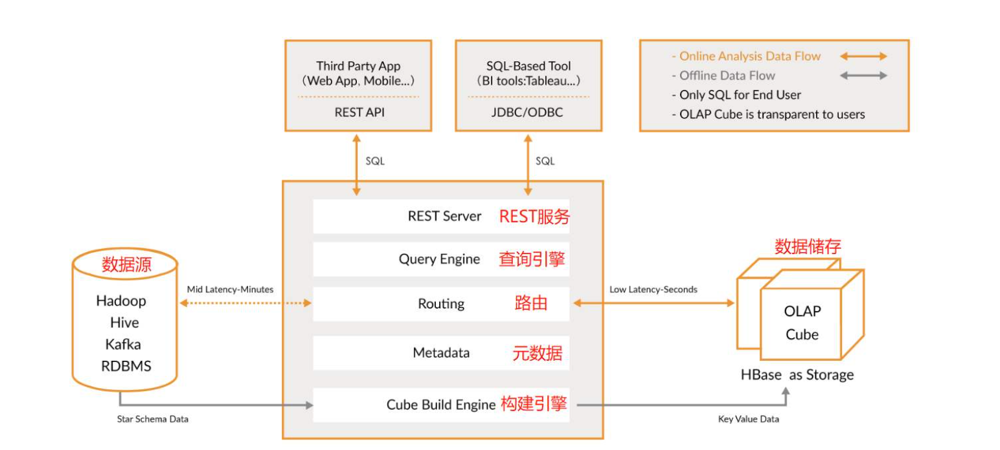

Apache kylin系统可分为：在线查询和离线架构两部分

在线查询模式主要出于上半部分，离线出于下班部分。Kylin技术架构如下：

* 数据源主要是Hadoop Hive，数据以关系表的形式输入，保持着待分析的数据。根据元数据定义，构建引擎从数据源抽取数据，并构建Cube
* Kylin可以使用MapReduce 或 Spark 作为构建引擎，构建后的Cube保存在右侧的存储引擎中，一般选用Hbase作为存储
* 完成了离线构建后，用户可以从查询系统发送SQl进行查询分析
* Kylin提供了各种Rest API、JDBC、ODBC接口，无论从那个接口进入，SQL最终都会了来到Rest服务层，在转交给查询引擎进行处理
* SQL语句是基于数据源的关系模型书写的，而不是Cube，
  * Kylin在设计时，可以对查询用户屏蔽了Cube的概念
  * 只需要理解关系模型就可以使用Kylin，没有额外的学习成本，传统的SQL应用也很容易迁移
  * 查询引擎解析SQl，生成基于关系表的逻辑执行计划，然后将其转换为基于Cube的物理执行计划，最后查询预计算生成Cube并产生结果，**整个过程不会访问原始数据源**

**组件的功能**

* REST Server：提供了Restful接口，例如创建、构建、刷新、合并等Cube相关操作，Kylin的Projects、Tables等元数据管理，用户访问权限控制，SQL的查询等
* Query Engine：使用开源Apache Calcite 框架来实现SQL解析，可以理解为SQL引擎层
* Routing：负责解析SQl生成的执行计划转换成Cube缓存的查询，这部分查询可以在秒级甚至毫秒级完成
* Metadata：Kylin中有大量的元数据信息，包括Cube的定义、星型模型的定义、Job和执行Job的输出信息、模型的维度信息等等，Kylin的元数据和Cube都存储在Hbase中，存储的格式是Json字符串。
* Cube Build Engine：所有模块的基础，它主要负责Kylin预计算中创建Cube，创建过程是首先通过Hive读取原始数据，然后通过一些MapReduce或Spark计算生成Htable，最后将数据load到HBase表中

#### 工作原理

Apache Kylin工作原理就是**对数据模型Cube预计算**，并利用计算的结果加速查询。具体工作过程如下：

* 指定数据模型，定义维度和度量
* 预计算Cube，计算所有Cuboid并保存为物化视图（存储到Hbase中）
* 执行查询时，读取Cuboid，计算并产生查询结果。

高效OLAP分析：

* Kylin的查询过程不会扫描原始记录，而是通过预计算预先完成表的关联、聚合等复杂运算。

* 利用预计算的结果来执行查询，相比非预计算的查询技术，其速度一般要快一到两个数量级，在超大的数据集上优势更明显
* 数据集达到千亿乃至万亿级别时，Kylin的速度可以超越其他非预计算技术1000倍以上。

#### Kylin生态

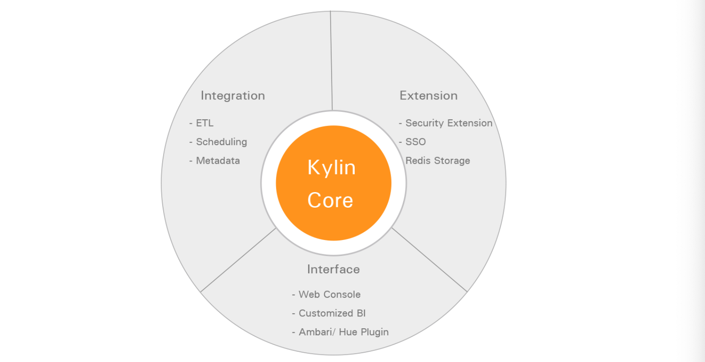

* Apache Kylin核心:Kylin的OALP 引擎由元数据引擎、查询引擎、任务引擎、存储引擎组成。另外，它还有一 个 REST 服务器对外提供查询请求的服务

* 可扩展性:提供插件机制支持额外的特性和功能 
* 与其他系统的整合:可整合任务调度器，ETL工具、监控及告警系统 
* 驱动包(Drivers):提供ODBC、JDBC驱动支持与其他工具(如Tableau)的整合

### Kylin安装

#### 依赖环境

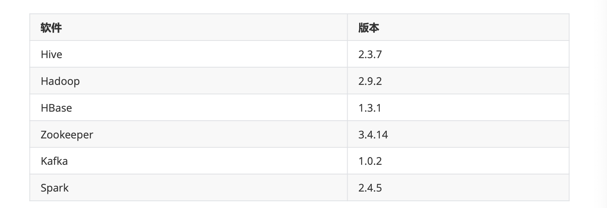

#### 集群规划

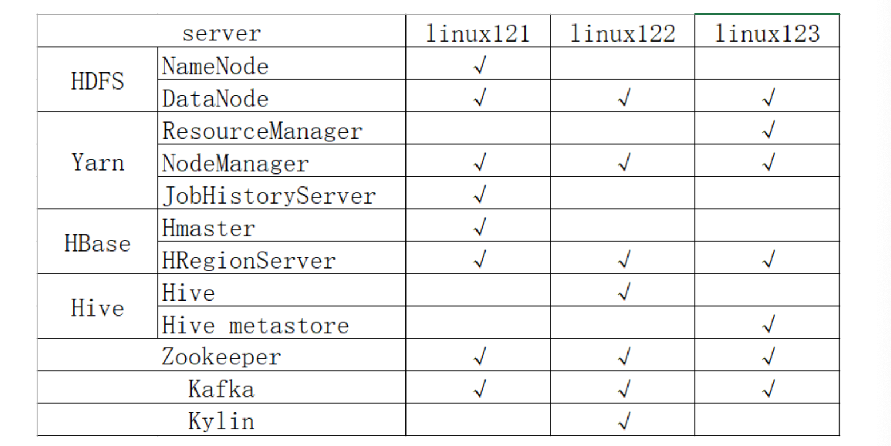

注意:要求hbase的hbase.zookeeper.quorum值必须只能是host1、host2、...。不允许出现host:2181。 hbase- site.xml文件:

```xml
<!-- 指定zk的地址，多个用“,”分割 --> 
<property>
  <name>hbase.zookeeper.quorum</name>
  <value>linux121,linux122,linux123</value>
</property>
```

#### Kylin 安装配置

1、解压缩软件(apache-kylin-3.1.1-bin-hbase1x.tar.gz)，并移动到 /opt/lagou/servers 目录下

```shell
cd /opt/lagou/software
tar zxvf apache-kylin-3.1.1-bin-hbase1x.tar.gz
mv apache-kylin-3.1.1-bin-hbase1x/ ../servers/kylin-3.1.1 
cd ../servers/kylin-3.1.1
```

2、添加环境变量，并使之生效

```shell
vi /etc/profile
# 增加以下内容
export KYLIN_HOME=/opt/lagou/servers/kylin-3.1.1
export PATH=$PATH:$KYLIN_HOME/bin

source /etc/profile
```

3、增加kylin依赖组件的配置

```shell
cd $KYLIN_HOME/conf

ln -s $HADOOP_HOME/etc/hadoop/hdfs-site.xml hdfs-site.xml
ln -s $HADOOP_HOME/etc/hadoop/core-site.xml core-site.xml
ln -s $HBASE_HOME/conf/hbase-site.xml hbase-site.xml
ln -s $HIVE_HOME/conf/hive-site.xml hive-site.xml
ln -s $SPARK_HOME/conf/spark-defaults.conf spark-defaults.conf
```

4、修改Kylin.sh 

```shell
cd $KYLIN_HOME/bin 

vim kylin.sh
# 在 kylin.sh 文件头部添加
export HADOOP_HOME=/opt/lagou/servers/hadoop-2.9.2 
export HIVE_HOME=/opt/lagou/servers/hive-2.3.7 
export HBASE_HOME=/opt/lagou/servers/hbase-1.3.1 
export SPARK_HOME=/opt/lagou/servers/spark-2.4.5
```

5、检查依赖

```shell
$KYLIN_HOME/bin/check-env.sh
```

#### 启动集群

1、启动 zookeeper(linux121) 

```
zk.sh start
```

2、启动 HDFS(linux121)

```shell
start-dfs.sh
```

 3、启动 YARN (linux123) 

```shell
start-yarn.sh
```

4、启动 HBase(linux121) 

```shell
start-hbase.sh
```

5、启动 metastore(linux123)

```shell
nohup hive --service metastore &
```

6、启动Yarn history server(linux121) 

```shell
mr-jobhistory-daemon.sh start historyserver
```

7、启动 (linux122)

```shell
kylin kylin.sh start
```

8、登录 Kylin Web界面

```
url:http://linux122:7070/kylin
用户名：ADMIN
密码：KYLIN
```

### 使用Kylin构架Cube

备注:以下操作均在linux122上执行

#### 准备数据

将4个数据文件:dw_sales_data.txt、dim_channel_data.txt、dim_product_data.txt、dim_region_data.txt

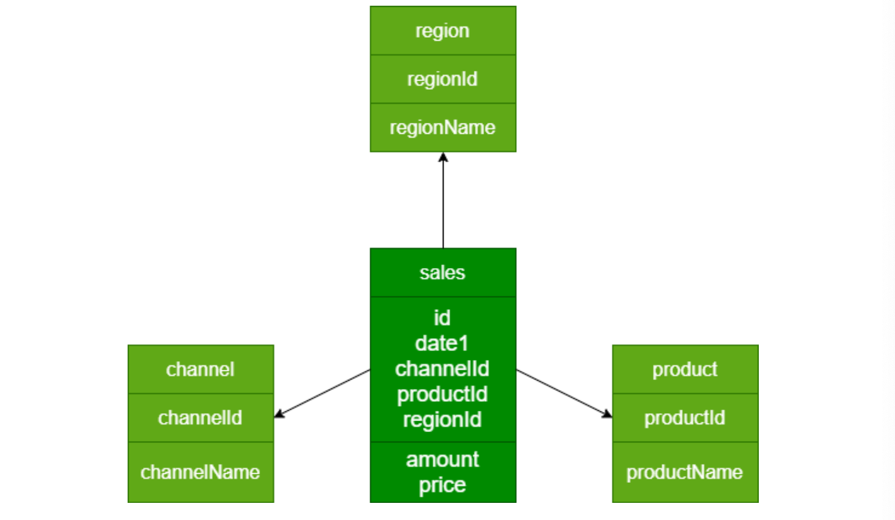

```
mkdir -p /mnt/kylin/3.1
```

kylin_examples.sql 脚本内容:

```sql
-- 创建订单数据库、表结构
create database if not exists `lagou_kylin`;

-- 1、销售表：dw_sales
-- id           唯一标识
-- date1        日期
-- channelId    渠道ID
-- productId    产品ID
-- regionId             区域ID
-- amount               数量
-- price                金额
create table lagou_kylin.dw_sales(
  id string,
  date1 string,
  channelId string,
  productId string,
  regionId string,
  amount int,
  price double
)ROW FORMAT DELIMITED FIELDS TERMINATED BY ',';

-- 2、渠道表：dim_channel
-- channelId    渠道ID
-- channelName  渠道名称
create table lagou_kylin.dim_channel(
  channelId string,
  channelName string
)ROW FORMAT DELIMITED FIELDS TERMINATED BY ',';

-- 3、产品表：dim_product
create table lagou_kylin.dim_product(
  productId string,
  productName string
)ROW FORMAT DELIMITED FIELDS TERMINATED BY ',';

--4、区域表：dim_region
create table lagou_kylin.dim_region(
  regionId string,
  regionName string
)ROW FORMAT DELIMITED FIELDS TERMINATED BY ',';

-- 导入数据
LOAD DATA LOCAL INPATH '/mnt/kylin/3.1/dw_sales_data.txt' OVERWRITE INTO TABLE lagou_kylin.dw_sales;
LOAD DATA LOCAL INPATH '/mnt/kylin/3.1/dim_channel_data.txt' OVERWRITE INTO TABLE lagou_kylin.dim_channel;
LOAD DATA LOCAL INPATH '/mnt/kylin/3.1/dim_product_data.txt' OVERWRITE INTO TABLE lagou_kylin.dim_product;
LOAD DATA LOCAL INPATH '/mnt/kylin/3.1/dim_region_data.txt' OVERWRITE INTO TABLE lagou_kylin.dim_region;
```

2、执行hive -f kylin_examples.sql

3、检查表、数据导入操作

###### 维度表的优化

* 要具有数据一致性，主键值必须是唯一的（否则Kylin构建的过程会报错）
* 维度表越小越好，因为Kylin会将维度表加载到内存中供查询，过大的表不适合作为维度表，默认的阈值是300MB
* 改变频率低，Kylin会在每次构建中试图重用维度表的快照，如果维度表经常改变的话，重用就会失效，这就会导致要经常对维度表创建快照
* 维度表最好不要是hive试图，因为每次都需要将试图物化，从而导致额外的时间开销

###### 事实表优化

* 移除不参与Cube构建的字段，可以提升构建速度，减低Cube构建结果的大小。
* 尽可能将事实表进行维度拆分，提取公用的维度
* 保证维度表与事实表的映射关系，过滤无法映射的记录

#### 构建Cube（按日期）

执行步骤:
1、创建项目(Project)【非必须】 

2、创建数据源(DataSource)。指定有哪些数据需要进行数据分析

3、创建模型(Model)。指定具体要对哪个事实表、那些维度进行数据分析 

4、创建立方体(Cube)。指定对哪个数据模型执行数据预处理，生成不同维度的数据 

5、执行构建、等待构建完成

6、再执行SQL查询，获取结果。从Cube中查询数据

```sql
 select date1,
  sum(price) as total_money,
  sum(amount) as total_amount
from dw_sales
group by date1;
```

#### 构建Cube（按渠道）

维度:渠道 ，指标:销售总金额、订单总笔数、最大订单金额、订单的平均金额

执行步骤同上，可不操作1、2步骤

```sql
select t2.channelid, t2.channelname,
sum(t1.price), max(t1.price), count(t1.price), avg(t1.price)
from dw_sales t1 join dim_channel t2 on t1.channelid = t2.channelid group by t2.channelid, t2.channelname;
```

#### 构建Cube（按日期、区域、产品、渠道）

Cube设计

维度:日期、渠道、区域、产品 

指标:销售总金额、订单总笔数

```sql
select
t1.date1,
t2.regionid,
t2.regionname,
t3.productid,
t3.productname,
sum(t1.price) as total_money, sum(t1.amount) as total_amount
    from   dw_sales t1
inner join dim_region t2
on t1.regionid = t2.regionid inner join dim_product t3
on t1.productid = t3.productid group by
t1.date1, t2.regionid, t2.regionname, t3.productid, t3.productname
order by t1.date1,
t2.regionname, t3.productname
```

### 增量构建Cube

* 在大多数的业务场景下，Hive中的数据处于不断增长的状态
* 为了支持在构建Cube时，无需重复处理历史数据，引入增量构建功能

#### Segment（段）

Kylin将Cube划分为多个Segment（对应的就是）

* 一个Cube可能由一个或多个Segment组成。Segment是指定时间范围的Cube，可以理解为Cube的分区
* Segment是针对源数据中的某一个片段计算出来的Cube数据，代表一段时间内源数据的预计算结果
* 每个Segment用起始时间和结束时间来标志
* 一个Segment的起始时间等于它之前Segment的结束时间；他的结束时间等于它后面那个Segment的起始时间
* 同一个Cube下不同的Segment除了背后的源数据不同之外，其他如数据结构、构架过程、优化方法、存储方式等都完全相同

#### 全量构建与增量构建

###### 全量构建

在全量构建中：

* Cube中存在唯一的一个Segment
* 该Segment没有分割时间的概念，即没有起始时间和结束时间
* 对于全量构建来说，每当需要更新Cube数据时，他不会区分历史数据还是新加入的数据，在构建时会处理所有数据

###### 增量构建

只会导入新Segment指定的时间区间内的原始数据，并对这部分原始数据进行预计算

###### 全量构建与增量构建的对比

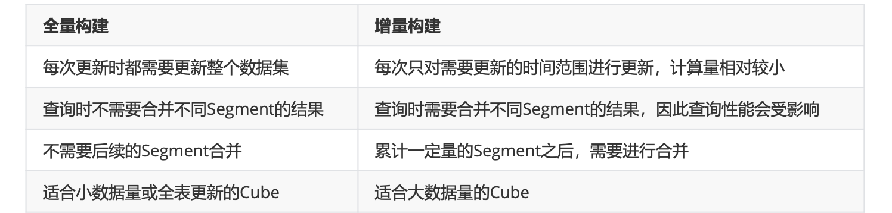

查询方式对比

* 全量构建
  * 查询引擎只需向引擎访问单个Segment所对应的数据，无需进行Segment合并
  * 为了加强性能，单个Segment的数据也有可能被分片存储到引擎的多个分区上，查询引擎可能仍然需要对单个Segment不同分区的数据做进一步的聚和
* 增量构建
  * 由于不同时间的数据分布在不同的Segment之中，查询引擎需要向存储引擎请求读取各个Segment的数据
  * 增量构建的Cube上的查询会比全量构建做更多运行时的聚和，通常来说，增量查询会比全量慢一些

对于小数据量的Cube,或者经常需要全表更新的Cube，使用全量构建需要更少的运维经历，以少量的重复计算降低生产环境中维度的复杂度

对于大数据量的Cube，例一个包含较长历史数据的Cube，如果每天更新，那么大量的资源用于重复计算，这种情况考虑增量构建

#### 增量构建Cube的过程

###### 指定分割时间列

增量构建Cube的定义必须包含一个时间维度，用来分割不同的Segment，这样的维度被称为分割时间列（Partition Date Column）

###### 增量构建过程

* 在进行增量构建时，将增量部分的起始时间和结束时间作为增量构建请求的一部分提交给Kylin的任务引擎
* 任务引擎会根据起始时间和结束时间从Hive中抽取相应时间的数据，并对这部分数据做预计算处理
* 将预计算结果封装成为一个新的Segment，并将相应的信息保存到元数据和存储引擎中，一般来说，增量部分的起始时间等于Cube中最后一个Segment的结束时间。

#### 增量Cube构建

定义数据源：

```sql
create table lagou_kylin.dw_sales1(
  id string,
  channelId string,
  productId string,
  regionId string,
  amount int,
  price double
)
partitioned by (dt string)
ROW FORMAT DELIMITED FIELDS TERMINATED BY ',';
-- 加载数据
load data local inpath "/mnt/kylin/4.4/dw_sales1001_data.txt" into table lagou_kylin.dw_sales1 partition(dt="2020-10-01");
load data local inpath "/mnt/kylin/4.4/dw_sales1002_data.txt" into table lagou_kylin.dw_sales1 partition(dt="2020-10-02");
load data local inpath "/mnt/kylin/4.4/dw_sales1003_data.txt" into table lagou_kylin.dw_sales1 partition(dt="2020-10-03");
load data local inpath "/mnt/kylin/4.4/dw_sales1004_data.txt" into table lagou_kylin.dw_sales1 partition(dt="2020-10-04");
```


查询：

```sql
select 
t1.dt, t2.regionname,
sum(t1.price) as total_money, 
sum(t1.amount) as total_amount, 
max(t1.price) as total_money, 
min(t1.amount) as total_amount
from dw_sales1 t1 
join dim_region t2 
on t1.regionid = t2.regionid 
group by t1.dt, t2.regionname
order by dt


select
t1.dt,
t2.regionid,
t2.regionname,
t3.productid,
t3.productname,
sum(t1.price) as total_money, sum(t1.amount) as total_amount
    from   dw_sales1 t1
inner join dim_region t2
on t1.regionid = t2.regionid inner join dim_product t3
on t1.productid = t3.productid group by
t1.dt, t2.regionid, t2.regionname, t3.productid, t3.productname
order by t1.dt,
t2.regionname, t3.productname
```

#### Segment 管理

增量构架的Cube每天都可能会有新的增量，这样的Cube中最终可能包含很多Segment，这将导致Kylin性能受到严重影响

* 从执行引擎的角度来说，运行时的查询引擎需要聚合多个Segment的结果才能返回正确的查询结果
* 从存储引擎的角度来说，大量的Segment会带来大量的文件，给存储空间带来巨大的压力

需要采取措施控制Cube中Segment的数量

为了保证查询性能，需要：

* 需要定期地将某些Segment合并在一起
* 根据Segment保留策略，自动地淘汰那些不会再被查询到的陈旧Segment。

#### 手动触发合并Segment

Kylin提供一种简单的机制用于控制Cube中Segment的数量：合并Segments。

#### 删除Segment

将Segment删除

#### 自动合并

手动维护Segment很繁琐，人工成本很高，Kylin中是可以支持自动合并Segment

在Cube Designer的“Refresh Settings”的页面中有:

* Auto Merge Thresholds 
* Retention Threshold

两个设置项可以用来帮助管理Segment碎片。这两项设置搭配使用这两项设置可以大大减少对Segment进行管理的麻烦。

###### Auto Merge Thresholds

* 允许用户设置介个层级的时间阀值，层级越靠后，时间阈值遇大
* 每当Cube中有新的Segment状态变为READY的时候，会自动触发一次系统自动合并
* 合并策略
  * 尝试最大一级的时间阈值。例如：针对（7天、28天）层级的日志，先检查是否能将连续若干个Segment合并成一个超过28天的大Segment
    * 如果有个别的Segment的时间长度本身已经超过28天，系统会跳过Segment 
    * 如果满足条件的连续Segment还不能够累积超过28天，那么系统会使用下一个层级的时间阈值重复寻找

###### 案例1 - 理解 Kylin 自动合并策略

假设自动合并阈值设置为7天、28天，如果现在有A-H 8个连续的Segment，它们的时间长度为28天(A)、7天(B)、1天(C)、1天(D)、1天 (E)、1天(F)、1天(G)、1天(H)。 此时，第9个Segment I加入，时间长度为1天

自动合并策略为:
1、Kylin判断时候能将连续的Segment合并到28天这个阈值，由于Segment A已经超过28天，会被排除

2、剩下的连续Segment，所有时间加一起 B + C + D + E + F + G + H + I (7 + 1 + 1 + 1 + 1 + 1 + 1 + 1 = 14) < 28 天，无法满足28天阈值，开始尝试7天阈值

3、跳过A(28)、B(7)均超过7天，排除

4、剩下的连续Segment，所有时间加一起 C + D + E + F + G + H + I(1 + 1 + 1 + 1 + 1 + 1 + 1 = 7)达到7天阈值，触发合并，提交Merge任务。并构建一个Segment X(7天) 

5、合并后，Segment为:A(28天)、B(7天)、X(7天)

6、继续触发检查，A(28天)跳过，B + X(7 + 7 = 14)< 28天，不满足第一阈值，重新使用第二阈值触发 

7、跳过B、X，尝试终止

#### 配置保留Segment

自动合并是将多个Segment合并为一个Segment，以达到清理碎片的目的。保留Segment则是及时清理不再使用的 Segment。

在很多场景中，只会对过去一段时间内的数据进行查询：

* 对于某个只显示过去一年数据的报表
* 支撑它的Cube其实只需要保留过去一年类Segment即可
* 由于数据在Hive中已经存在备份，则无需在Kylin中备份超过一年的历史数据

可以将Retention Threshold设置为365，每当有新的Segment状态变更为READY的时候，系统会检查每一个Segment。如果他的结束时间距离最晚的一个Segment的结束时间大于等于 “Retention Threshold” ，那么这 个Segment将被视为无需保留。系统会自动地从Cube中删除这个Segment。

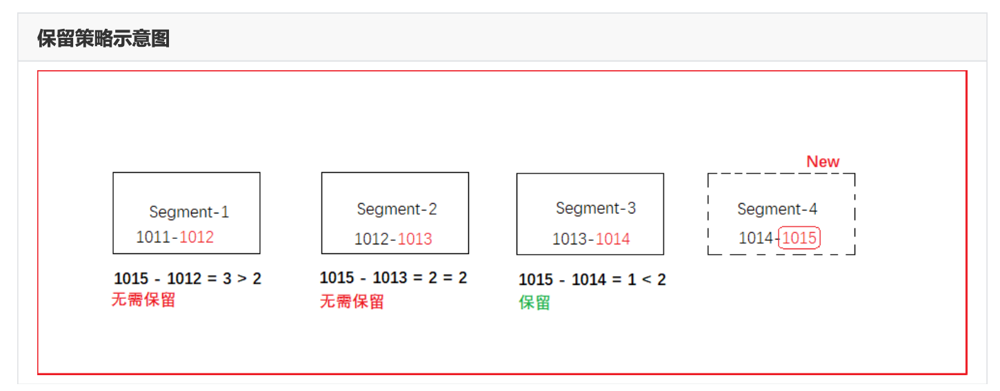

#### 使用JDBC连接Kylin

* 要将数据以可视化方式展示出来，需要使用Kylin的JDBC方式连接执行SQL，获取Kylin的执行结果 
* 使用Kylin的JDBC与JDBC操作MySQL一致
  * jdbc url: jdbc:kylin://linux122:7070/lagou_sales_olap 
  * 用户名密码:ADMIN/KYLIN

```xml
<dependency>
  	<groupId>org.apache.kylin</groupId> 
  	<artifactId>kylin-jdbc</artifactId> 
  	<version>3.1.1</version>
</dependency>
```

### Cube优化

#### Cuboid 剪枝优化

**Cuboid特指Kylin中在某一种任意维度组合下所计算的所有的数据**

**以减少Cuboid数量为目的的优化统称为Cuboid剪枝**

默认进行所有的预计算：

* 4个维度： 2^4 =16
* 10个维度：2 ^10=1024
* 20个维度：2^20=1048576

过多的Cuboid数量对构建引擎、存储引擎的压力非常大，因此，在构建维度数量较多的Cube时，尤其要注意Cube 的剪枝优化。

* 选择跳过”多余“的Cuboid
  * Cuboid因为查询条件不会被查询到，所以多余
  * 有的Cuboid与其他Cuboid能力接近，所以多余


#### 检查Cuboid数量

Apache Kylin提供了一个简单的工具，检查Cube中哪些Cuboid最终被预计算了，称这些Cuboid为被物化的 Cuboid，该工具还能给出每个Cuboid所占空间的估计值。由于该工具需要在对数据进行一定阶段的处理之后才能估算Cuboid的大小，一般来说在Cube构建完毕之后再使用该工具。

使用如下的命令行工具去检查这个Cube中的Cuboid状态:

```
 kylin.sh org.apache.kylin.engine.mr.common.CubeStatsReader lagou_sales_cube4
```

输出结果分析

```
Cube statistics hll precision: 14
Total cuboids: 15
Total estimated rows: 203
Total estimated size(MB): 0.0027539730072021484 
Sampling percentage: 100
Mapper overlap ratio: 0.0 
Mapper number: 0
```

* 估计Cuboid大小的精度(Hll Precision)
* 总共的Cuboid数量

* Segment的总行数估计 
* Segment的大小估计，Segment的大小决定mapper、reducer的数量、数据分片数量等

```
|---- Cuboid 1111, est row: 54, est MB: 0
	|---- Cuboid 0111, est row: 18, est MB: 0, shrink: 33.33%
		|---- Cuboid 0011, est row: 6, est MB: 0, shrink: 33.33% 
			|---- Cuboid 0001, est row: 2, est MB: 0, shrink: 33.33% 
			|---- Cuboid 0010, est row: 3, est MB: 0, shrink: 50%
		|---- Cuboid 0101, est row: 8, est MB: 0, shrink: 44.44% 
			|---- Cuboid 0100, est row: 4, est MB: 0, shrink: 50%
		|---- Cuboid 0110, est row: 9, est MB: 0, shrink: 50% 
	|---- Cuboid 1011, est row: 18, est MB: 0, shrink: 33.33%
		|---- Cuboid 1001, est row: 6, est MB: 0, shrink: 33.33% 
			|---- Cuboid 1000, est row: 3, est MB: 0, shrink: 50%
		|---- Cuboid 1010, est row: 9, est MB: 0, shrink: 50% 
	|---- Cuboid 1101, est row: 24, est MB: 0, shrink: 44.44%
		|---- Cuboid 1100, est row: 12, est MB: 0, shrink: 50% 
	|---- Cuboid 1110, est row: 27, est MB: 0, shrink: 50%
```

* 所有的 Cuboid 及它的分析结果都以树状的形式打印了出来 
* 在这棵树中，每个节点代表一个Cuboid，每个Cuboid都由一连串1或0的数字组成 
* 数字串的长度等于有效维度的数量，从左到右的每个数字依次代表Rowkeys设置中的各个维度。如果数字为0， 则代表这个Cuboid中不存在相应的维度;如果数字为1，则代表这个Cuboid中存在相应的维度 
* 除了最顶端的Cuboid之外，每个Cuboid都有一个父亲Cuboid，且都比父亲Cuboid少了一个“1”。其意义是这个 Cuboid就是由它的父亲节点减少一个维度聚合而来的(上卷)
* 最顶端的Cuboid称为Base Cuboid，它直接由源数据计算而来。Base Cuboid中包含所有的维度，因此它的数 字串中所有的数字均为1 
* 每行Cuboid的输出中除了0和1的数字串以外，后面还有每个Cuboid的具体信息，包括该Cuboid行数的估计 值、该Cuboid大小的估计值，以及这个Cuboid的行数与父亲节点的对比(Shrink值) 
* 所有Cuboid行数的估计值之和应该等于Segment的行数估计值，所有Cuboid的大小估计值应该等于该 Segment的大小估计值。每个Cuboid都是在它的父亲节点的基础上进一步聚合而成的

#### 检测Cube大小

在Web GUI的Model页面选择一个READY状态的Cube，光标移到该Cube的Cube Size列时，Web GUI会提示Cube的 源数据大小，以及当前Cube的大小除以源数据大小的比例，称为膨胀率(Expansion Rate)

一般来说，Cube的膨胀率应该在0%~1000%之间，如果一个Cube的膨胀率超过1000%，那么应当查找其中的原因。 膨胀率高可能有以下几个方面的原因:

* Cube中的维度数量较多，且没有进行很好的Cuboid剪枝优化，导致Cuboid数量极多 
* Cube中存在较高基数的维度(基数的维度是指维度中有多少个不同的值)，导致包含这类维度的每一个Cuboid 占用的空间都很大，这些Cuboid累积造成整体Cube体积变大

* 存在占用空间大的度量。例如Count Distinct，因此需要在Cuboid的每一行中都为其保存一个较大度量数据， 最坏的情况将会导致Cuboid中每一行都有数十KB，从而造成整个Cube的体积变大

对于Cube膨胀率居高不下的情况，需要结合实际数据进行分析，优化。

#### 使用衍生维度

一个维度可以是普通维度或者是衍生维度(Derived)。

将维度表的维度设置为**衍生维度**，这个维度不会参与预计算，而是使用维度表的主键(或事实表的外键)来替代它。 Kylin会在底层记录维表主键与维度表其他维度之间的映射关系，以便在查询时能够动态地将维度表的主键翻译成这些非主键维度，并进行实时聚合。 创建Cube的时候，这些维度如果指定为衍生维度，Kylin将会排除这些维度，而是使用维度表的主键来代替它们创建Cuboid。后续查询的时候，再基于主键的聚合结果，再进行一次聚合。 使用衍生维度会有效减少Cube中 Cuboid 的数量;但在查询时会增加聚合的时间。

不适用的场景: 如果从维度表主键到某个维度表维度所需要的聚合工作量非常大，此时作为一个普通的维度聚合更合适，否则会影响Kylin的查询性能

#### 聚合组

随着维度数目的增加，Cuboid 的数量会爆炸式地增长。为了缓解 Cube 的构建压力，Apache Kylin 引入了一系列的高级设置，帮助用户筛选出真正需要的 Cuboid(本质是要减少Cube构建过程中的预计算)。这些高级设置包括:

* 聚合组(Aggregation Group) 
* 强制维度(Mandatory Dimension) 
* 层级维度(Hierachy Dimension) 
* 联合维度(Joint Dimension)

默认Kylin会将所有维度放到同一个聚合组中，如果维度数较多（如维度数 > 15），建议用户根据查询条件与模式，将维度分不到多个聚合组中。通过使用多个聚合组，可以大大降低Cube的Cuboid数量

如果一个Cube有（M+N）个维度

* 这些维度放在一个聚合组中，默认有 2^(M+N) 个 Cuboid 
* 将这些维度分为两个不相交的聚合组，第一个组有M个维度，第二个组有N个维度。那么 Cuboid 的总数为:( 2^M + 2^N )个维度

* 一个维度可以出现在多个聚合组中

**在单个聚合组中，可以对维度设置一些高级属性，包括强制维度、层级维度、联合维度。一个维度只能出现在一个属 性组中。**

构建 N 个维度的 Cube 会生成 2^N个 Cuboid。如下图所示，构建一个 4 个维度(A，B，C, D)的 Cube，需要生成 16 个Cuboid。

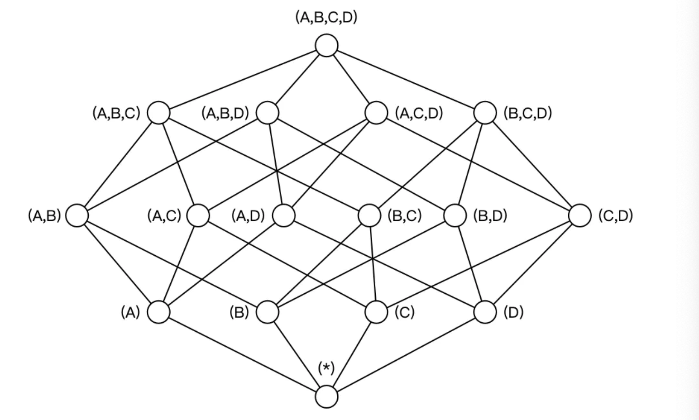

根据用户关注的维度组合，可以维度划分不同的组合类，这些组合类在 Kylin 中被称为聚合组。如用户仅仅关注维度 AB 组合和维度 CD 组合，那么该 Cube 则可以被分化成两个聚合组，分别是聚合组 AB 和聚合组 CD。生成的 Cuboid 数目从 16 个缩减为 8 个。

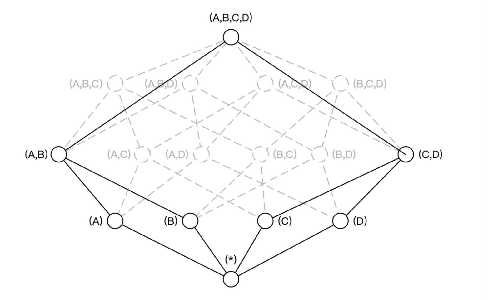

用户关心的聚合组之间可能包含相同的维度。如聚合组 ABC 和聚合组 BCD 都包含维度 B 和维度 C。这些聚合组之间 会衍生出相同的 Cuboid。聚合组 ABC 会产生 Cuboid BC，聚合组 BCD 也会产生 Cuboid BC。这些 Cuboid不会重 复生成，一份 Cuboid 为这些聚合组所共有。

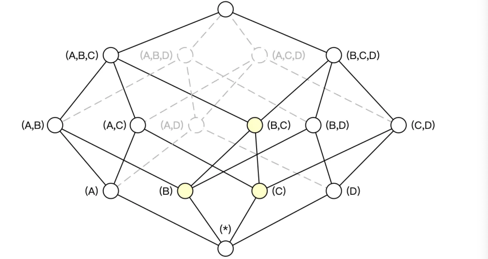

有了聚合组就可以**粗粒度**地对 Cuboid 进行筛选，获取自己想要的维度组合。 Kylin的建模需要业务专家参与。

#### 强制维度(Mandatory Dimension)

**强制/必要维度:指的是那些总会出现在 Where 条件或 Group By 语句中的维度。**

通过指定某些维度为强制维度，Kylin 不预计算那些不包含此维度的 Cuboid ，从而减少计算量。维度A是强制维度，那么生成的 Cube 如下图所示，维度数目从16变为9。

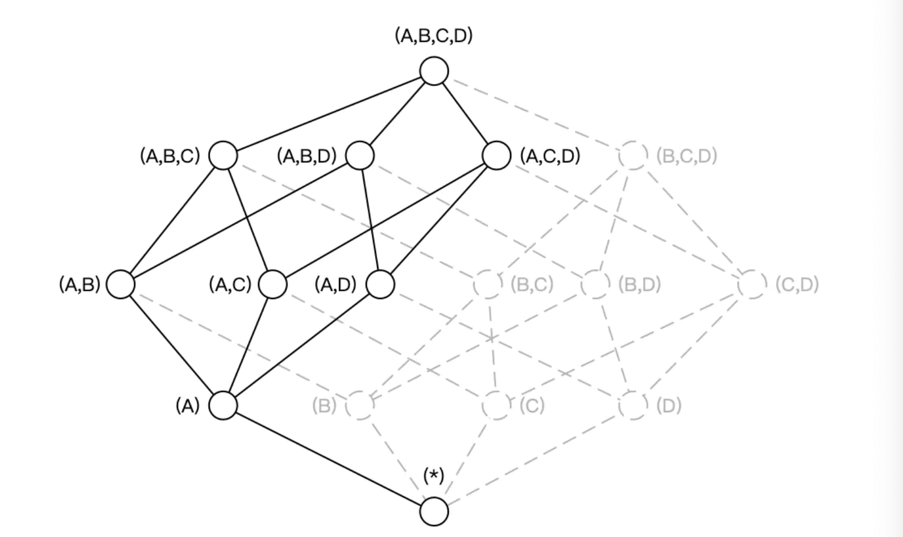

#### 层级维度(Hierachy Dimension)

**层级维度:是指一组有层级关系的维度。**

维度中常常会出现具有层级关系的维度。例如国家、省份、城市这三个维度，从上而下来说国家/省份/城市之间分 别是一对多的关系。假设维度 A 代表国家，维度 B 代表省份，维度 C 代表城市，ABC 三个维度可以被设置为层级维 度，生成的Cube 如下图所示:

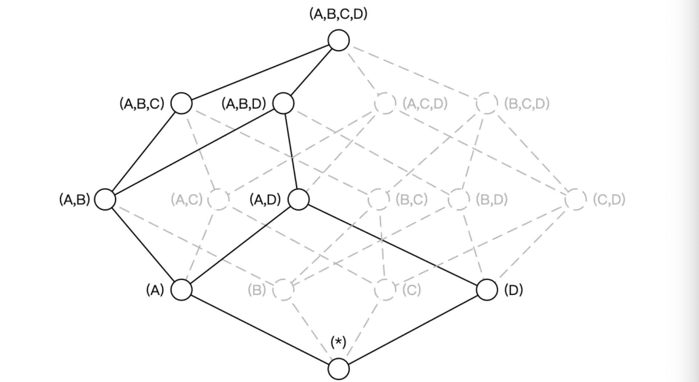

Cuboid [A,C,D]=Cuboid[A, B, C, D]，Cuboid[B, D]=Cuboid[A, B, D]，因而 Cuboid[A, C, D] 和 Cuboid[B, D] 就不必 重复存储。

#### 联合维度(Joint Dimension)

**联合维度:是将多个维度视作一个维度，在进行组合计算的时候，它们要么一起出现，要么均不出现。**

通常适用于以下几种情形:

* 总是在一起查询的维度 
* 彼此之间有一定映射关系，如USER_ID和EMAIL 
* 基数很低的维度。如性别、布尔类型的属性

维度的基数:维度有多少个不同的值。 联合维度并不关心维度之间各种细节的组合方式。如用户的查询语句中仅仅会出现 group by A, B, C ，而不会出现 group by A、B 或者 group by C 等等这些细化的维度组合。这一类问题就是联合维度所解决的问题。

例如将维度 A、B、C 定义为联合维度，Apache Kylin 就仅仅会构建 Cuboid ABC，而 Cuboid AB、BC、A 等等 Cuboid 都不会被生成。最终的 Cube 结果如下图所示，Cuboid 数目从 16 减少到 4。

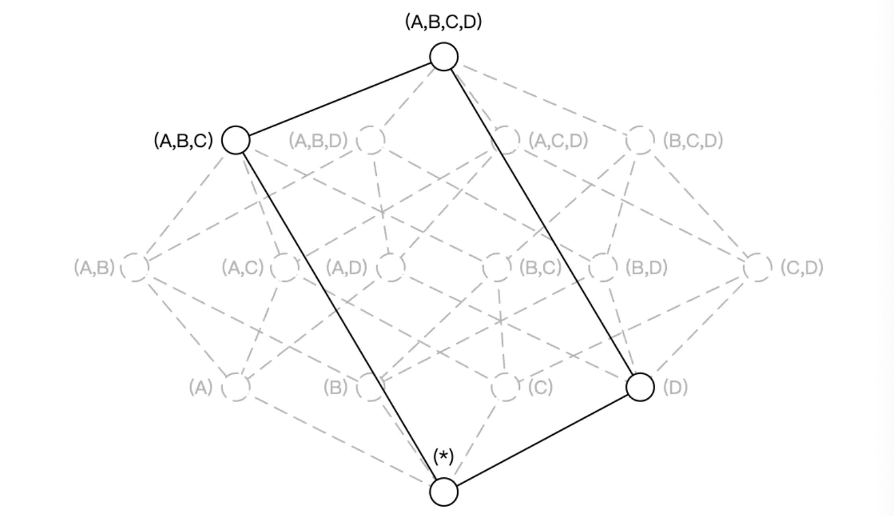

小结:

* 在单个聚合组中，可以对维度进行设置，包括强制维度、层级维度、联合维度。一个维度只能出现在一个属性组中

* 强制维度:指的是那些总会出现在Where条件或Group By子句中的维度 
* 层级维度:一组具有层级关系的维度(如:国家、省、市) 
* 联合维度:将多个维度看成一个维度。要么一起出现、要么都不出现

#### Rowkeys

简单的说Cuboid的维度会映射为HBase的Rowkey，Cuboid的指标会映射为HBase的Value。

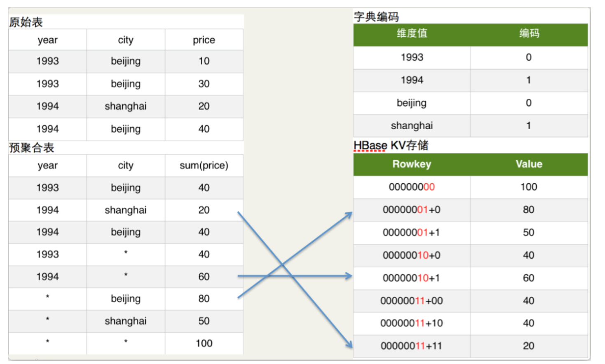

如上图原始表所示:Hive表有两个维度列 year 和 city ，有一个指标列 price 。 如上图预聚合表所示:我们具体要计算的是 year 和 city 这两个维度所有维度组合(即4个cuboid)下的sum(priece) 指标，这个指标的具体计算过程就是由MapReduce完成的。 

如上图字典编码所示:为了节省存储资源，Kylin对维度值进行了字典编码。图中将 beijing 和 shanghai 依次编码为0和1。

如上图HBase KV存储所示:在计算cuboid过程中，会将Hive表的数据转化为HBase的KV形式。Rowkey的具体格式是 cuboid id + 具体的维度值 (最新的Rowkey中为了并发查询还加入了Shard Key)，以预聚合表内容的第2行为 例，其维度组合是(year，city)，所以cuboid id就是00000011，cuboid是8位，具体维度值是1994和shanghai， 所以编码后的维度值对应上图的字典编码也是11，所以HBase的Rowkey就是0000001111，对应的HBase Value就 是 sum(priece) 的具体值。

所有的cuboid计算完成后，会将cuboid转化为HBase的 KeyValue 格式生成HBase的HFile，最后将HFile load进 cube对应的HBase表中。

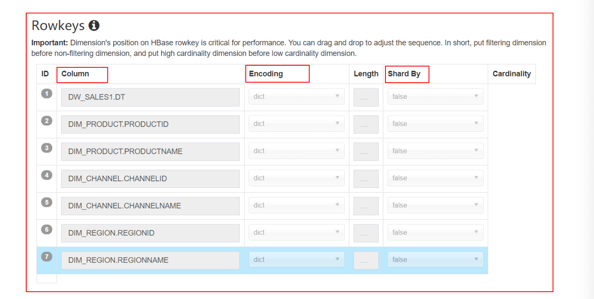

###### 编码

Kylin 以 Key-Value 的方式将 Cube 存储到 HBase 中，HBase 的 key就是 Rowkey，是由各维度的值拼接而成的。为 了更高效地存储这些值，Kylin 会对它们进行编码和压缩;每个维度均可以选择合适的编码方式，默认采用的是字典 (Dictionary)编码技术。字段支持的基本编码类型如下:

* Dictionary :字典编码将所有此维度下的值构成一张映射表，从而大大节约存储空间，适用于大部分字段， 默认推荐使用。Dictionary产生的编码非常紧凑，尤其在维度的值基数小且长度大的情况下。但**在超高基情况下，可能引起内存不足的问题**，在Kylin中字典编码允许的基数上限默认是500万(由参数 kylin.dictionary.max.cardinality 配置)
* boolean :适用于字段值为：true, false, TRUE, FALSE, True, False, t, f, T, F, yes, no, YES,NO, Yes, No, y, n, Y, N, 1, 0
* integer:适用于字段值为**整数字符**，支持的整数区间为[ -2^(8N-1), 2^(8N-1)]
* date :适用于字段值为**日期字符**，支持的格式包括yyyymmdd、yyyy-MM-dd、yyyy-MM-dd HH:mm:ss、yyyy-MM-dd HH:mm:ss.sss
* time:适用于字段值为**时间戳字符**，支持范围为[1970-01-01 00:00:00, 2038/01/19 03:14:07]，毫秒部 分会被忽略，time编码适用于 time、datetime、timestamp 等类型
* fix_length :**适用于超高基场景**，将选取字段的前 N 个字节作为编码值，当 N 小于字段长度，会造成字段截 断，当 N 较大时，造成 RowKey 过长，查询性能下降，只适用于 varchar 或 nvarchar 类型
* fixed_length_hex :适用于字段值为十六进制字符，比如 1A2BFF 或者 FF00FF，每两个字符需要一个字节， 只适用于 varchar 或 nvarchar 类型

###### 顺序

各维度在 Rowkeys 中的顺序，对于查询的性能会产生较明显的影响;在这里用户可以根据查询的模式和习惯，通过拖曳的方式调整各个维度在Rowkeys上的顺序。推荐的顺序为:

* Mandatory 维度

* where 过滤条件中出现频率较多的维度 
* 高基数维度
* 低基数维度放后面

* 不常用的维度放在后面

这样做的好处是，充分利用过滤条件来缩小在 HBase 中扫描的范围，从而提高查询的效率。

###### 分片

指定 ShardBy 的列，明细数据将按照该列的值分片;没有指定 ShardBy 的列，则默认将根据所有列中的数据进行分片;选择适当的 ShardBy 列，可以使明细数据较为均匀的分散在多个数据片上，提高并行性，进而获得更理想的查 询效率;

**建议选择基数较大的列作为 ShardBy 列，避免数据分散不均匀。**

### 流式构建

实时数据更新是一种普遍的需求，快速分析变化趋势才能做出正确的决策。Kylin V1.6 发布了可扩展的 streaming cubing 功能，它利用 Hadoop 消费 Kafka 数据的方式构建 cube。 这种方式构建的Cube能满足分钟级的更新需求。

步骤:项目 => 定义数据源(Kafka) => 定义Model => 定义Cube => Build Cube => 作业调度(频率高)


Streaming Cube 和普通的 cube 大致上一样。以下几点需要注意:

* 分区时间列应该是 Cube 的一个 dimension。在 Streaming OLAP 中时间总是一个查询条件，Kylin 利用它来缩小扫描分区的范围
* 不要使用 order_time 作为 dimension 因为它非常的精细;建议使用 mintue_start、hour_start 或其他，取决 于用户如何查询数据
* 定义 year_start、quarter_start、month_start、day_start，hour_start，minute_start 作为层级以减少组合 计算
* 在 refersh setting 设置中，创建更多合并的范围，如 0.5 小时、4 小时、1 天、 7 天;这样设置有助于控制 cube segment 的数量
* 在 rowkeys 部分，拖拽 minute_start 到最上面的位置，对于 streaming 查询，时间条件会一直显示;将其放 到前面将会缩小扫描范围

### 实时OLAP

Kylin实时OLAP的组件

* Kafka Cluster [data source]
* Kylin Process [job server/query server/coordinator]

* Kylin streaming receiver Cluster [real-time part computation and storage] 
* HBase Cluster [historical part storage]

* Zookeeper Cluster [receiver metadata storage]

* MapReduce [distributed computation]

* HDFS [distributed storage]

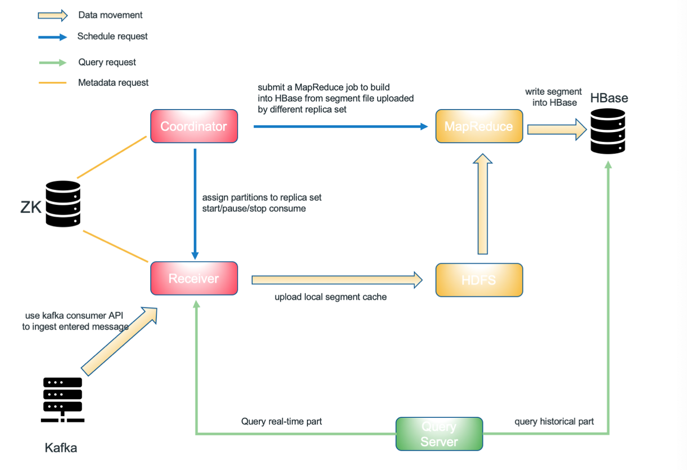

#### Streaming Coordinator

Streaming coordinator充当streaming receiver cluster的master node。其主要职责包括:分配/取消分配特定的topic partition给特定的副本集，暂停或继续使用，收集消费速率(每秒消息)等详细信息。

#### Coordinator Cluster

为了消除单点故障，我们可以启动多个coordinator程序。当集群具有多个coordinator程序时，zookeeper将选择一 个leader。只有leader将回答coordinator客户端的请求，其他进程将成为备用/候选者，因此将消除单点故障。

#### Streaming Receiver

Streaming Receiver是工作节点。它由Streaming Coordinator管理，其职责如下:

* 摄取(ingest)实时事件
* 在本地构建基本cuboid(如果配置正确，则可以构建更多cuboid) 
* 回答查询请求以获取分配给自身的部分数据 
* 将本地segment缓存上传到HDFS或在segment状态更改为不可变时将其删除

#### Receiver Cluster

所有streaming receiver的集合称为receiver cluster。

#### Replica Set

Replica Set是一组**streaming receivers**。Replica Set是任务分配的最小单位，这意味着一个Replica Set中的所有 receivers都将执行相同的任务(包含相同的主题分区)。当某些receiver意外关闭但所有replica set都具有至少一个 可访问的receiver时，receiver cluster仍可查询，并且数据不会丢失。


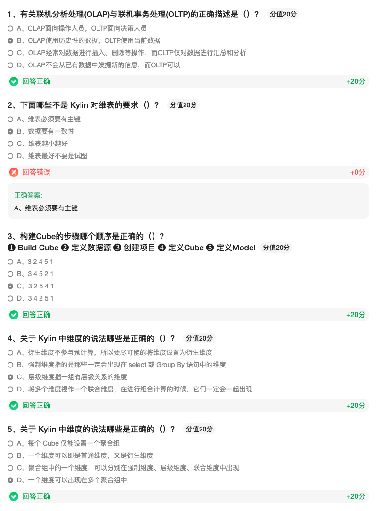

