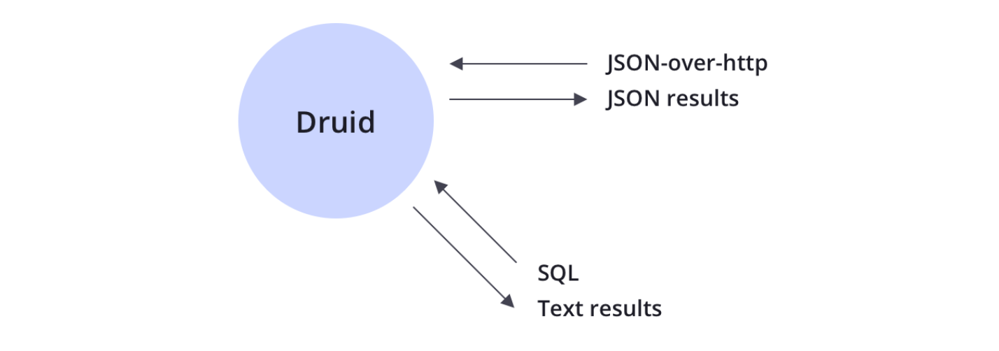

## Apache Druid简介及架构

### Druid概述

#### 什么是Druid

数据分析的基础架构可以分为以下几类:

* 使用Hadoop/Spark进行分析

* 将Hadoop/Spark的结果导入 RDBMS 中提供数据分析

* 将结果保存到容量更大的 NoSQL 数据库中，解决数据分析的存储瓶颈，例如:HBase 
* 将数据源进行流式处理，对接流式计算框架(如Storm、Spark、Flink)，结果保存到 RDBMS或NoSQL中 
* 将数据源进行流式处理，对接分析数据库，例如:Druid


互联网技术的快速增长催生了各类大体量的数据，Hadoop很大的贡献在于帮助企业将他们那些低价值的事件流数据 转化为高价值的聚合数据;

Hadoop擅长的是存储和获取大规模数据，它并不提供任何性能上的保证它能多快获取到数据。虽然Hadoop是一个 高可用的系统，但在高并发负载下性能会下降;

Hadoop是一个很好的后端、批量处理和数据仓库系统。在一个需要高并发并且保证查询性能和数据可用性的并需要 提供产品级别的保证的需求，Hadoop并不能满足。

Druid 是 Metamarkets 公司(一家为在线媒体或广告公司提供数据分析服务的公司)推出的一个分布式内存实时分 析系统，用于解决如何在大规模数据集下进行快速的、交互式的查询和分析。

Druid 是一个开源的数据分析引擎工具，为实时和历史数据的次秒级(多于一秒)查询设计。主要应用于对数据的 OLAP查询，Druid 提供低延迟(实时)的数据摄取、灵活的数据探索、快速的数据聚合。现有的 Druid 部署已支持 扩展到数万亿时间和 PB 级数据。

#### 与其他OLAP技术对比


SparkSQL / Impala / ClickHouse，支持海量数据，灵活性强，但对响应时间是没有保证的。当数据量和计算复杂度增加后，响应时间会变慢，从秒级到分钟级，甚至小时级都有可能。

搜索引擎架构的系统(Elasticsearch等)，在入库时将数据转换为倒排索引。牺牲了灵活性换取很好的性能，在搜索类查询上能做到亚秒级响应，但是对于扫描聚合为主的查询，随着处理数据量的增加，响应时间也会退化到分钟级。

Druid / Kylin，则在入库时对数据进行预聚合，进一步牺牲灵活性换取性能，以实现对超大数据集的秒级响应。

* Kylin 利用 Hadoop/HBase 做计算和存储，使用 SQL 查询，提供 JDBC/ODBC 驱动与常见BI工具集成
* Druid 有自己独立的分布式集群，能够实时摄入数据，有自己的查询接口(与BI兼容性较弱)，**通常多用于实时要求高的场景**

目前没有一个OLAP分析引擎能在数据量、灵活程度、性能(吞吐&并发)做到完美，需要基于自己的业务场景进行取舍和选型。

#### 技术选型

Apache Druid是一个开源的、分布式、实时OLAP分析工具。Druid的核心设计结合了数据仓库、时间序列数据库和搜索系统的思想，适用于多种场景的高性能数据实时分析。Druid将这三个系统中的每个系统的关键特征合并到其接收层、存储格式、查询层和核心体系结构中。


时间序列数据库主要用于指处理，带时间标签(按照时间的顺序变化)的数据，带时间标签的数据也称为时间序列数据。

时间序列数据主要由电力行业、化工行业等各类型实时监测、检查与分析设备所采集、产生的数据，这些工业数据的典型特点是:产生频率快(每一个监测点一秒钟内可产生多条数据)、严重依赖于采集时间(每一条数据均要求对应 唯一的时间)、测点多信息量大(常规的实时监测系统均有成千上万的监测点，监测点每秒钟都产生数据，每天产生几十GB的数据量)。

###### 主要特点

* **列式存储**

  Druid 独立的存储和压缩每一列，只需要读取特定查询所需的内容，这可以支持快速扫描、排名和聚合

* **流式和批量摄取**(**Ingestion**)

  支持 Apache Kafka、HDFS、AWS S3、stream processors 等现成连接器

* **本地的搜索索引**

  Druid 为字符串创建倒排索引，以支持快速搜索和排序

* **灵活的schema**

  Druid 可以处理变化的 schema 和嵌套数据

* **基于时间优化 partition**

  Druid 基于时间智能的对数据进行分区，基于时间的查询比传统数据库要快得多

* 支持 SQL

  Druid 支持本机的 JSON 语言，还支持基于 HTTP 或者 JDBC 的 SQL

* **水平扩展性**

  Druid 已经用户生产环境中，每秒接收数百万个事件，保存多年的数据并提供次秒级查询

* **操作简单**

  只需要增加或删除服务器即可扩展或缩小规模，Druid 会自动平衡，容错架构通过服务器的故障进行路由

###### 集成

Druid是开源大数据技术的补充，包括Apache Kafka，Apache Hadoop，Apache Flink等，通常位于存储或处理层与最终应用之间，充当查询层或数据分析服务。


###### Ingestion(摄取)

Druid支持流式传输和批量摄取。Druid连接到数据源，包括:Kafka(用于流数据加载)，或分布式文件系统，如HDFS(用于批处理数据加载)。

Druid在 “索引” 过程中将数据源中的原始数据转换为支持高效读取的优化格式(Segment，段)。


###### 存储

Druid的数据存储采用列式存储格式。根据列的类型(字符串，数字等)，应用不同的压缩和编码方法，根据列类型构建不同类型的索引。

Druid为字符串列构建倒排索引，以进行快速搜索和过滤。Druid可按时间对数据进行智能分区，以实现面向时间的快速查询。

Druid在摄取数据时对数据进行预聚合，节省大量存储空间。


###### 查询方式

Druid支持JSON、SQL两种方式查询数据。



#### 应用场景

Druid擅长的部分

* 对于大部分查询场景可以亚秒级响应 
* 事件流实时写入与批量数据导入兼备 
* 数据写入前预聚合节省存储空间，提升查询效率 
* 水平扩容能力强
* 社区活跃

是否需要使用Druid

* 处理时间序列事件

* 快速的聚合以及探索式分析

* 近实时分析亚秒级响应 
* 存储大量(TB级、PB级)可以预先定义若干维度的事件 
* 无单点问题的数据存储

### 体系架构

#### Druid进程和服务

* Coordinator： 进程管理集群上数据可用性，从metastore中读取了Segment的元数据，并决定那些Segments需要被加载到集群中，使用zk查看已经存在的历史节点，连接集群各个节点负载情况，创建一个zk的条目告诉历史节点被加载、删除或者移动Segments
* Overlord：进程控制数据提取工作负载的分配
* Historical：进程存储可查询数据。提供对Segment的数据查询服务。与zk通信，上报节点信息，告知zk自己拥有哪些Segments，从zk中获取执行任务
* MiddleManager：进程负责提取数据
* Broker：进程处理来自外部客户端的查询。负责将查询请求分发到历史节点或实时节点，并聚合这些节点返回的查询结果数据。Broker节点通过zk知道Segment都存放在哪些节点上
* Router：进程是可选的进程，可以将请求路由到Broker、Coordinator、Overlords

根据进程的服务类型分为：

* Master：Coordinator & Overlord ，管理数据可用性和数据摄取
* Data：Historical & MiddleManager，执行提取工作负载并存储所有可查询的数据
* Query：Broker & Router ，处理来之外部的客户端的查询


#### 外部依赖

* Deep Storage：深度存储，例如HDFS。不是用来存储查询数据的，而是作为数据的备份或者进程间数据交换
* Metadata Storage：元数据存储，可用RDBMS
* ZK：服务发现、leader选举、服务协调

## Druid部署

官网：https://druid.apache.org/

下载安装包 

```
wget https://mirror.bit.edu.cn/apache/druid/0.19.0/apache-druid-0.19.0-bin.tar.gz
```

### 单服务器部署

```
Nano-Quickstart:1个CPU，4GB RAM
	启动命令: bin/start-nano-quickstart
	配置目录: conf/druid/single-server/nano-quickstart/*
微型快速入门:4个CPU，16GB RAM
	启动命令: bin/start-micro-quickstart
	配置目录: conf/druid/single-server/micro-quickstart/*
小型:8 CPU，64GB RAM(〜i3.2xlarge)
	启动命令: bin/start-small
	配置目录: conf/druid/single-server/small/*
中:16 CPU，128GB RAM(〜i3.4xlarge)
	启动命令: bin/start-medium
	配置目录: conf/druid/single-server/medium/*
大型:32 CPU，256GB RAM(〜i3.8xlarge) 
	启动命令: bin/start-large
	配置目录: conf/druid/single-server/large/*
大型X:64 CPU，512GB RAM(〜i3.16xlarge) 
	启动命令: bin/start-xlarge
	配置目录: conf/druid/single-server/xlarge/*
```

启动：

```
./bin/start-nano-quickstart start
```

登录http://linux121:8888/查看页面

### 集群部署

#### 部署规划

集群部署采用的分配如下:

* 主节点部署 Coordinator 和 Overlord进程 
* 数据节点运行 Historical 和 MiddleManager进程 
* 查询节点 部署 Broker 和 Router 进程


#### 设置环境变量

```shell
vi /etc/profile

# 在文件中增加以下内容
export DRUID_HOME=/opt/lagou/servers/druid-0.19.0
export PATH=$PATH:$DRUID_HOME/bin

source /etc/profile
```

#### MySQL中创建相关数据库

```
mysql -uroot -p12345678

CREATE DATABASE druid DEFAULT CHARACTER SET utf8mb4;
set global validate_password_policy=0;
CREATE USER 'druid'@'%' IDENTIFIED BY '12345678';
GRANT ALL PRIVILEGES ON druid.* TO 'druid'@'%';
```

#### 配置Druid参数

```shell

cd /opt/lagou/servers/druid-0.19.0/conf/druid/cluster/_common 
ln -s $HADOOP_HOME/etc/hadoop/core-site.xml core-site.xml
ln -s $HADOOP_HOME/etc/hadoop/hdfs-site.xml hdfs-site.xml
ln -s $HADOOP_HOME/etc/hadoop/yarn-site.xml yarn-site.xml
ln -s $HADOOP_HOME/etc/hadoop/mapred-site.xml mapred-site.xml

cd $DRUID_HOME/extensions/mysql-metadata-storage/
ln -s $HIVE_HOME/lib/mysql-connector-java-5.1.46.jar mysql-connector-java-5.1.46.jar


vim $DRUID_HOME/conf/druid/cluster/_common/common.runtime.properties

# 增加"mysql-metadata-storage"
druid.extensions.loadList=["mysql-metadata-storage", "druid-hdfs-storage", "druid-kafka- indexing-service", "druid-datasketches"]
# 每台机器写自己的ip或hostname druid.host=linux121
# 填写zk地址 druid.zk.service.host=linux121:2181,linux122:2181,linux123:2181 druid.zk.paths.base=/druid
# 注释掉前面 derby 的配置
# 增加 mysql 的配置
druid.metadata.storage.type=mysql druid.metadata.storage.connector.connectURI=jdbc:mysql://linux123:3306/druid druid.metadata.storage.connector.user=druid druid.metadata.storage.connector.password=12345678
# 注释掉local的配置
# 增加HDFS的配置，即使用HDFS作为深度存储
druid.storage.type=hdfs
druid.storage.storageDirectory=/druid/segments
# 注释掉 indexer.logs For local disk的配置
# 增加 indexer.logs For HDFS 的配置 
druid.indexer.logs.type=hdfs
druid.indexer.logs.directory=/druid/indexing-logs


vim $DRUID_HOME/conf/druid/cluster/master/coordinator-overlord/jvm.config
-server
-Xms512m
-Xmx512m
-XX:+ExitOnOutOfMemoryError
-XX:+UseG1GC
-Duser.timezone=UTC+8
-Dfile.encoding=UTF-8
-Djava.io.tmpdir=var/tmp
-Djava.util.logging.manager=org.apache.logging.log4j.jul.LogManager


vim $DRUID_HOME/conf/druid/cluster/data/historical/jvm.config
-server
-Xms512m
-Xmx512m
-XX:MaxDirectMemorySize=1g
-XX:+ExitOnOutOfMemoryError
-Duser.timezone=UTC+8
-Dfile.encoding=UTF-8
-Djava.io.tmpdir=var/tmp
-Djava.util.logging.manager=org.apache.logging.log4j.jul.LogManager

vim $DRUID_HOME/conf/druid/cluster/data/historical/runtime.properties
druid.processing.buffer.sizeBytes=50000000

vim $DRUID_HOME/conf/druid/cluster/data/middleManager/jvm.config
-server
-Xms128m
-Xmx128m
-XX:+ExitOnOutOfMemoryError
-Duser.timezone=UTC+8
-Dfile.encoding=UTF-8
-Djava.io.tmpdir=var/tmp
-Djava.util.logging.manager=org.apache.logging.log4j.jul.LogManager


vim $DRUID_HOME/conf/druid/cluster/query/broker/jvm.config
-server
-Xms512m
-Xmx512m
-XX:MaxDirectMemorySize=1g
-XX:+ExitOnOutOfMemoryError
-Duser.timezone=UTC+8
-Dfile.encoding=UTF-8
-Djava.io.tmpdir=var/tmp
-Djava.util.logging.manager=org.apache.logging.log4j.jul.LogManager


vim $DRUID_HOME/conf/druid/cluster/query/broker/runtime.properties
druid.processing.buffer.sizeBytes=50000000

vim $DRUID_HOME/conf/druid/cluster/query/router/jvm.config
-server
-Xms128m
-Xmx128m
-XX:+UseG1GC
-XX:MaxDirectMemorySize=128m
-XX:+ExitOnOutOfMemoryError
-Duser.timezone=UTC+8
-Dfile.encoding=UTF-8
-Djava.io.tmpdir=var/tmp
-Djava.util.logging.manager=org.apache.logging.log4j.jul.LogManager
```

向linux122、linux123分发安装包,修改host 的name，修改环境变量


启动：

```shell
#linux121
zk.sh start
```

在主节点启动: linux121

```shell
nohup start-cluster-master-no-zk-server &
```

在数据节点(linux122)上启动服务:

```
nohup start-cluster-data-server &
```

在查询节点(linux123)上启动服务:

```shell
nohup start-cluster-query-server &
```

关闭服务：

```shell
 # 在各个节点运行
cd /opt/lagou/servers/druid-0.19.0/bin 
./service --down
```

## Druid架构与原理

### 基础架构


Druid总体包含以下6类节点：

1、Coordinator Node：主要负责历史节点的数据负载均衡，已经通过规则管理数据的生命周期。协调节点告诉历史节点加载新数据、卸载过期数据、复制数据和为了负载均衡移动数据。

Coordinator 是周期性运行的（由 druid.coordinator.period配置指定，默认执行间隔为60s）；Coordinator需要维护和zk的链接，以获取集群信息，Segment和Rule的信息保存在元数据库中，所以也需要维护与元数据库的连接

2、Overlord Node：监视MiddleManager进程，并且是Druid数据摄入的主节点，负责将提取任务分配给MiddleManager 并协调Segment发布，包括接受、拆解、分配Task，以及创建Task相关的锁，并返回Task的状态。

3、Hisrtorical node：加载生成好的数据文件，以供数据查询，是整个集群的核心，承担大部分Segment的查询。Historical 从 Deep Storage 中下载Segment，并响应这些segment有关的查询请求，（请求来自Broker进程),Historical 不处理写入请求，Historical 采用了无共享架构设计，知道如何去加载和删除Segment，以及如何基于Segment来响应查询。即便底层的深度存储无法正常工作，Historical 进程还是可以针对已通过的Segments提供查询服务。

4、MiddleManager ：即时摄入实时数据，生成Segment数据文件。是执行提交任务的工作节点，MiddleManager将任务转发给不同的JVM中运行Peon进程，MiddleManager、Peon、Task对应关系是，每个Peon进程一次只能运行一个Task任务，但一个MiddleManager去可以管理多个Peon进程。

5、Broker：接收客户端查询请求，并将这些查询转发给Historical 和MiddleManager。当Brokers从这些子查询中收到结果时，他们会合并这些结果并将他们返回给调用者。Broker节点负责转发Client查询请求的，Broker通过ZK可以知道哪个Segment在哪些节点上，将查询转发给相应节点，所有节点返回数据后，Broker会将所有节点的数据进行合并，然后返回给Client

6、Router Node（可选的）：负责将请求路由到Broker、Coordinator、Overlords。Router 进程可以在 Brokers、Overlords 和 Coordinators 进程之上，提供一层统一的 API网关。Router 进程是 可选的，如果集群数据规模已经达到了 TB级别，需要考虑启用(druid.router.managementProxy.enabled=true)。 一旦集群规模达到一定的数量级，那么发生故障的概率就会变得不容忽视，而 Router 支持将请求只发送给健康的节点，避免 请求失败。同时，查询的响应时间和资源消耗，也会随着数据量的增长而变高，而 Router 支持设置查询的优先级和负载均衡 策略，避免了大查询造成的队列堆积或查询热点等问题。

Druid 的进程可以被任意部署，为了理解与部署组织方便。这些进程分为了三类:

* Master: Coordinator、Overlord 负责数据可用性和摄取

* Query: Broker and Router，负责处理外部请求

* Data: Historical and MiddleManager，负责实际的Ingestion负载和数据存储

Druid 还包含 3 类外部依赖:

* Deep Storage:存放生成的 Segment 数据文件，并供历史服务器下载， 对于单节点集群可以是本地磁盘，而对于分布式集群一般是HDFS

  Druid使用deep storage来做数据的备份，也作为在Druid进程之间在后台传输数据的一种方式。 当响应查询时，Historical首先从本地磁盘读取预取的段，这也意味着需要在deep storage和加载的数据的Historical 中拥有足够的磁盘空间。

* Metadata Storage，存储 Druid 集群的元数据信息，如 Segment 的相关信息，一般使用 MySQL

  

* zookeeper:为了集群提供以执行协调服务，如内部服务监控、协调和领导者选举

  ```
  Coordinator 节点的 Leader 选举
  Historical 节点发布 Segment 的协议
  Coordinator 和 Historical 之间 load / drop 
  Segment 的协议 Overlord 节点的 Leader 选举
  Overlord 和 MiddleManager 之间的 Task 管理
  ```

#### 架构演进

Apache Druid 初始版本架构图 ~ 0.6.0(2012~2013)


#### Lambda架构

从大的架构上看，Druid是一个Lambda架构

Lambda架构是有Storm的作者提出的一个实时大数据处理框架，是为了处理大规模数据时，同时发挥流处理和批处理的优势。

* 通过批处理提供全面、准确的数据
* 通过流处理提供低延迟的数据

从而达到平衡延迟、吞吐量和容错性的目的，为了满足下游的即席查询，批处理和流处理的结果会进行合并

Lambda架构包含三层，Batch Layer、Speed Layer和 Serving Layer

* Batch Layer：批处理层。对离线的数据进行预计算，为了下游能够快速查询想要的结果。由于批处理基于完整的历史数据集，准备性可以得到保证，批处理可以用Hadoop、Spark和Flink等框架计算
* Speed Layer：加速处理层，处理实时的增量数据，这一层重点在于低延迟。加速层的数据不同批处理层那样完整和准确，但是可以填补批处理高延迟导致的数据空白。加速层可以用Storm、Spark 和Flink等框架计算。
* Serving Layer：合并层，将历史数据、实时数据合并到一起，输出出去


### 数据存储

* Druid中的数据存储被称为DataSource，DataSource类似RDBMS中的Table
* 每个DataSource按照时间划分，每个时间范围称为一个Chunk（比如按天分区，则一个Chunk为一天）
* 在Chunk中数据被分为一个或多个Segment
  * Segment是数据实际存储结构，DataSource、Chunk只是一个逻辑上的概念
* Segment是按照时间组成的Chunk，所以按照时间查询数据，效率非常高
* 每个Segment都是一个单独的文件，通常包含几百万行数据


#### 数据分区

* Druid处理的是事件数据，每条数据都有一个时间戳，可以使用时间进行分区
* 上图指定了分区粒度为天，那么每天的数据都会被单独存储和查询

#### Segment内存存储结构

* Druid 采用列式数据，每列数据都是在独立的结构中存储
* Segment中数据类型主要三种：
  * 时间戳，每一行数据，都必须有一个时间戳，Druid一定会基于时间戳来分片
  * 维度列：用来过滤filter或者组合group by 的列，通常是String、float、double、int类型
  * 指标列。用来进行聚合计算的列，指定的聚合函数sum、average等


MiddleManager节点接受到ingestion的任务之后，开始创建Segment：

* 转换成列存储格式
* 用bitmap来建立索引（对所有的dimension列建立索引）
* 使用各种压缩算法
  * 所有的列使用LZ4压缩
  * 所有的字符串列采用字典编码/标识以达到最小化存储
  * 对位图索引使用位图压缩

Segment 创建完成后，Segment文件就是不可更改的，被写入到深度存储（目的就是为了防止MiddleManager节点宕机后，Segment的丢失）。然后Segment会加载到Historical节点，Historical可以直接加载到内存中，同时MetaData Store会记录这个新创建的Segment的信息，如结构、深度存储的位置等，Coordinator节点需要这些元数据来协调数据的查找。

### 索引服务

* 索引服务：数据导入并创建Segments数据文件的服务
* 索引服务是一个高可用的分布式服务，采用主从架构作为架构模式，索引服务由三大组件构成
  * Overlord作为主节点
  * MiddleManager 是从节点
  * peon用于运行一个task

索引服务架构如下图所示


索引服务由三部分组件组成

* Overlord组件

  负责创建Task、分发Task到MiddleManager上运行，为task创建锁以及跟踪task运行状态并返回给用户

* MiddleManager组件内

  作为从节点，负责接收主节点分配的任务，然后为每个task启动一个独立JVM进程来完成具体的任务

* Peon（劳工）组件

  有MiddleManager启动的一个进程用于运行一个Task任务

索引服务架构与Yarn架构列式

* Overlord -> ResourceManager，负责集群上的资源管理和任务分配
* MiddleManager -> NodeManager，负责接收任务和管理节点上的资源
* Pone -> Container 执行节点上具体的任务

Task类型有很多，包括：

* Index hadoop task：Hadoop索引任务，利用Hadoop集群执行MapReduce任务以完成Segment数据文件创建，适合体量比较大的Segments数据文件和创建任务
* Index kafka task： 用于kafka数据的实时摄入，通过kafka索引服务可以在Overlord上配置一个KafkaSupervisor，通过管理Kafka索引任务的创建和生命周期来完成Kafka数据的摄取
* Merge Task：合并索引任务，将多个Segments数据文件按照指定的聚合方法合并为一个Segments数据文件
* Kill task：销毁索引任务，将执行时间范围内的数据从Druid集群的深度存储中删除

### 索引与压缩机制

Druid的查询时延迟低、性能好的主要技术点：

* 数据预聚合
* 列式存储，数据压缩
* Bitmap索引
* mmap（内存文件映射方式）
* 查询结果的中间缓存

#### 数据预聚合

* Druid 通过一个roll-up的处理，将原始数据再注入的时候进行汇总处理
* Roll-up可以压缩我们需要保存数据量
* Druid会把选定的相同的维度的数据进行预聚合操作，可减少存储的大小。
* Druid可以通过queryGranularity 来控制注入数据的粒度。最小的queryGranularity是毫秒级

Roll-up聚合前


#### 位图索引

Druid在摄入的数据示例:


* 第一列为时间，appkey 和 area是维度列，value是指标列
* Druid 会在导入阶段自动对数据进行Rollup，将维度相同组合的数据进行聚合处理
* 数据聚合的粒度根据业务需要确定

按天聚合后的数据如下


Druid通过建立位图索引，实现快速数据查找。

Bitmap索引只要为了加速查询时有条件过滤的场景，Druid在生产索引文件的时候，对每个列的每个取值生产对应的Bitmap集合，如下：


位图索引可以看做是hashmap<String,Bitmap>

* Key 就是维度的取值
* value 就是该表中对应的行是否有该维度的值


以SQL查询为例：

1）boolean 条件查询

```sql
select sum(value)
from tab1
where time='2020-10-01'
and appkey in ('appkey1', 'appkey2') and area='北京'
```

执行过程分析：

* 通过时间段确认Segment
* appkey in ('appkey1', 'appkey2') and area='北京'，查到各自的bitmap
  * (appkey1 or appkey2) and 北京

  * (110000 or 001100) and 101010 = 111100 and 101010 = 101000 
  * 符合条件的列为:第1行 & 第3行，这几行 sum(value) 的和为 40

2）group by 查询

```sql
select area, sum(value)
  from tab1
where time='2020-10-01'
and appkey in ('appkey1', 'appkey2')
group by area
```

该查询与上面的查询不同之处在于将符合条件的列:

* appkey1 or appkey2
* 110000 or 001100 = 111100
* 将第1行 到 第4行取出来 
* 在内存中做分组聚合。结果为:北京:40、深圳:60


###  Druid案例小结

* 在配置摄入源时要设置为True从流的开始进行消费数据，否则在数据源中可能查不到数据 
* Druid的join能力非常有限，分组或者聚合多的场景推荐使用

* sql支持能力也非常受限

* 数据的分区组织只有时间序列一种方式


