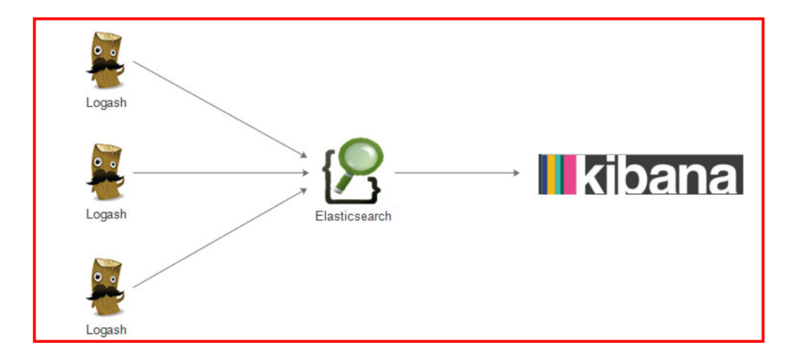

## ElasticSeach 简介

### ELK

#### 集中式日志系统

日志，对于任何系统来说都是及其重要的组成部分。在计算机系统里面，更是如此。但是由于现在的计算机系统大多 比较复杂，很多系统都不是在一个地方，甚至都是跨国界的;即使是在一个地方的系统，也有不同的来源，比如，操 作系统，应用服务，业务逻辑等等。他们都在不停产生各种各样的日志数据。根据不完全统计，我们全球每天大约要 产生 2EB的数据。

面对如此海量的数据，又是分布在各个不同地方，如果我们需要去查找一些重要的信息，难道还是使用传统的方法， 去登陆到一台台机器上查看?看来传统的工具和方法已经显得非常笨拙和低效了。于是，一些聪明人就提出了建立一 套集中式的方法，把不同来源的数据集中整合到一个地方。

一个完整的集中式日志系统，是离不开以下几个主要特点的。

* 收集-能够采集多种来源的日志数据 
* 传输-能够稳定的把日志数据传输到中央系统 
* 存储-如何存储日志数据
* 分析-可以支持 UI 分析 
* 警告-能够提供错误报告，监控机制

#### ELK协议栈介绍以及体系结构




```
vim /etc/sysctl.conf

vm.max_map_count = 655360

sysctl -p

vim /etc/security/limits.conf
* soft nproc  4096
* hard nproc  4096
```


```
useradd es
mkdir -p /opt/lagou/servers/es
mkdir -p /opt/lagou/servers/data/es
mkdir -p /opt/lagou/servers/logs/es
chown -R es /opt/lagou/servers/es
chown -R es /opt/lagou/servers/data/es
chown -R es /opt/lagou/servers/logs/es 
passwd es
```

