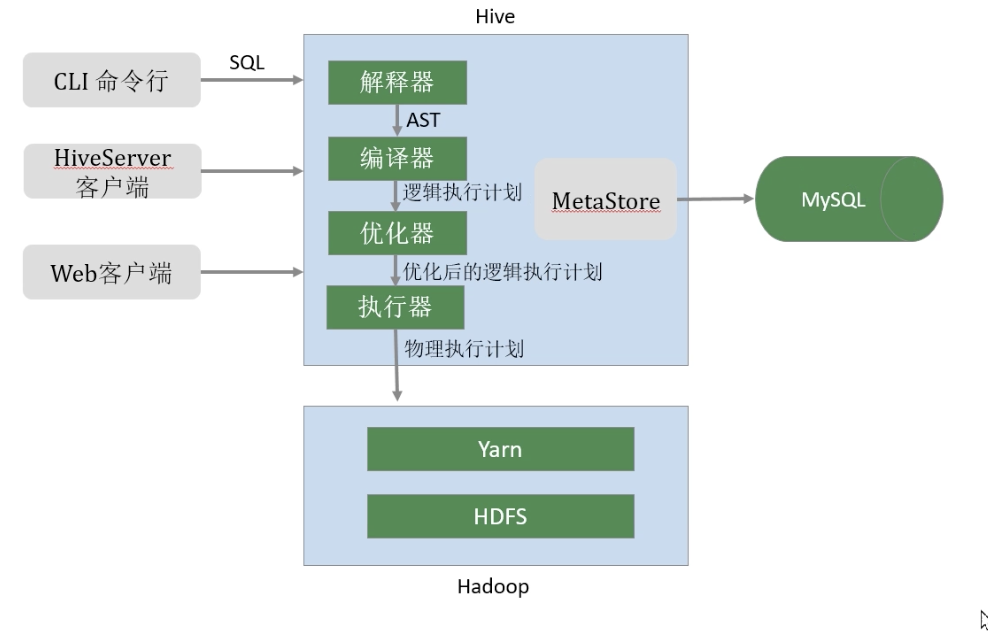

## 数据仓库工具Hive

#### Hive产生背景

直接使用MapReduce处理大数据，问题：

1. MapReduce开放难度大
2. HDFS文件没有字段、数据类型，不方便管理
3. 开发周期长

Hive是基于Hadoop的一个数据数仓工具。提供SQL查询功能

1. 本质：将SQL转换为MapReduce任务
2. 底层是由HDFS提供数据存储
3. 就是一个将SQL转换为MapReduce任务的工具

数仓：**面向主题、集成的、相对稳定的、反应历史变化的数据集合**。主要用于管理决策

1. 目的：构建面向分析、集成的数据集合。为企业提供决策
2. 本身不产生数据，都是来源外部
3. 存储大量数据

#### Hive和RDBMS对比

RDBMS：关系型数据库管理

由于Hive采用了类似SQL的查询语言HQL（Hive Query Language），因此很容易将Hive理解为数据库，其实从结构上看，Hive和传统关系数据库除了拥有相似的SQL，再无类似之处

1. 查询语言相似
2. 数据规模不同，Hive存储海量数据，RDBMS之处存储有限的数据
3. 执行引擎不同。Hive的引擎是MR/Tez/Spark/Flink;RDBMS使用自己的执行引擎
4. 数据存储不同：Hive存储在HDFS上，RDBMS存储在本地文件系统、磁盘
5. 执行速度不同：Hive相对慢（MR/数据量）RDBMS相对快，但是数据量大时，Hive的并行计算的优势就体现出来了
6. 可扩展性不同：Hive之处水平拓展，通常RDBMS之处垂直拓展，对水平扩展不友好，目前最先进的并行数据库 Oracle 在理论上的扩展能力也只有100台左右。
7. 数据更新不同：Hive对数据更新不友好，针对数据仓库应用设计的，数据仓库的内容是读多写少的，RDBMS支持频繁、快速数据更新

#### Hive的优缺点

优点：

1. 学习成本低，与SQL类似
2. 处理的数据量大，底层是MR任务
3. 系统可以水平拓展
4. 功能可以拓展，自定义函数
5. 良好的容错下，某个节点发生故障，可以在另一个节点拉起重新处理一遍即可
6. 统一元数据（表、表里的字段，字段的类型）处理

缺点：

1. HQL的表达能力有限，有些复杂的逻辑结构无法通过HQL处理。
2. 迭代计算无法表达
3. 执行的效率不高（基于MR）
4. 自动生成的MR任务，某些情况下不够智能。
5. 调优困难。

#### Hive的架构

1. MetaStore（元数据管理）：Hive将元数据存储在关系型数据库。
2. 元数据：数据库名、表名及类型、字段名字、数据类型、数据所在位置
3. 驱动程序（Driver）
   1. 解析器（SQLParser）：使用第三方组件（antlr）将HQL字符串抽象成语法树（AST），对AST进行语法分析、判断字段、表是否存在等
   2. 编译器（Compiler）：将AST编译生成逻辑执行计划
   3. 优化器(Optimizer)：对编译器生成的逻辑执行计划进行优化，减少不必要的类、使用分区灯等
   4. 执行器（Ececutr）：把逻辑计划转换成可运行的物理计划。