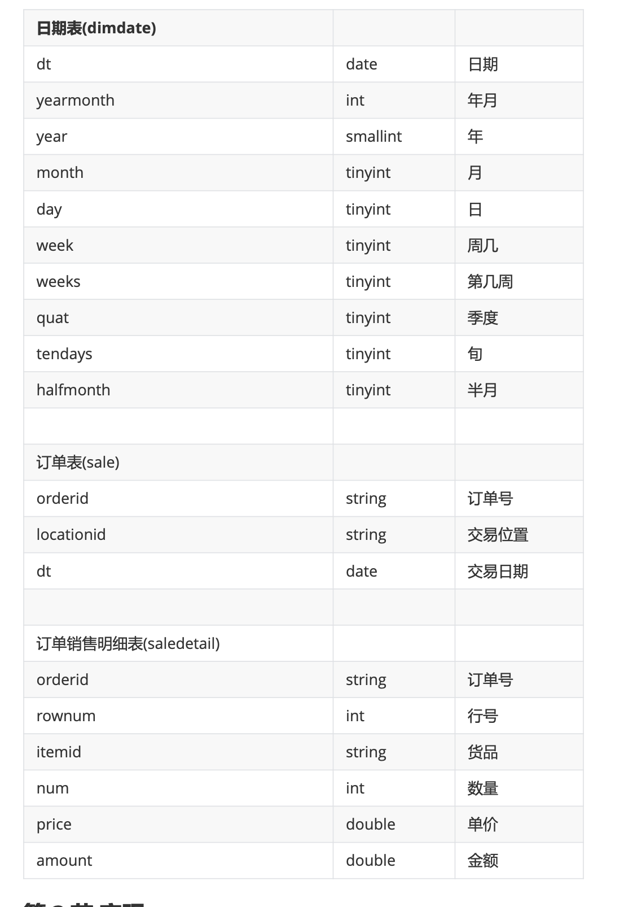

综合Hive知识，复习巩固。

#### 需求描述 

针对销售数据，完成统计:

1. 按年统计销售额
2. 销售金额在 10W 以上的订单
3. 每年销售额的差值
4. 年度订单金额前10位(年度、订单号、订单金额、排名)
5. 季度订单金额前10位(年度、季度、订单id、订单金额、排名) 
6. 求所有交易日中订单金额最高的前10位
7. 每年度销售额最大的交易日
8.  年度最畅销的商品(即每年销售金额最大的商品)

#### 数据说明



#### 实现

```sql
-- 1、按年统计销售额

select t1.year,sum(t2.amount) from (
select substr(dt,0,4) as year,orderid from sale)
t1 join saledetail t2 on t1.orderid = t2.orderid group by t1.year;

select
    year(t1.dt) ,
    sum(t2.amount)
    from sale t1 join saledetail t2
    on t1.orderid = t2.orderid
    group by year(t1.dt);

SELECT year(B.dt) year, round(sum(A.amount)/10000, 2) amount FROM saledetail A join sale B on A.orderid=B.orderid group by year(B.dt);
-- 2、销售金额在 10W 以上的订单
select orderid, sum(amount) from
saledetail group  by orderid having sum(amount) > 100000
-- 老师版本
SELECT orderid, round(sum(amount), 2) amount
  FROM saledetail
group by orderid
having sum(amount) > 100000
-- 3、每年销售额的差值

with temp as (select
    year(t1.dt) as nowyear,
    sum(t2.amount) as amount
    from sale t1 join saledetail t2
    on t1.orderid = t2.orderid
    group by year(t1.dt))
    select
        nowyear,
        amount,
        (amount - lag(amount) over(order by nowyear)) as chae
      from temp;


-- 4、年度订单金额前10位(年度、订单号、订单金额、排名)
with temp as (select t1.orderid,year(t1.dt) dt,sum(t2.amount) amount from sale t1 left join saledetail t2
        on t1.orderid = t2.orderid
        group by  t1.orderid,year(t1.dt))
        select * from (
         select
   dt,
    orderid,
    amount,
    dense_rank() over(partition by dt order by amount desc) as rank
    from temp
        )t
    where rank <= 10;

--
SELECT dt, orderid, amount, rank
  from (SELECT dt, orderid, amount,
               dense_rank() over(PARTITION BY dt ORDER BY amount
desc) rank
from (SELECT year(B.dt) dt, A.orderid, sum(A.amount)
amount
from saledetail A join sale B on A.orderid=B.orderid
GROUP BY year(B.dt), A.orderid
) tmp1 ) tmp2
where rank <= 10;

-- 5、季度订单金额前10位(年度、季度、订单id、订单金额、排名)
with temp as (
select
    t1.year,t1.quat,t2.orderid,sum(t3.amount) as amount
 from dimdate t1
    join sale t2 on t1.dt = t2.dt
    join saledetail t3
    on t2.orderid = t3.orderid
    group by t1.year,t1.quat,t2.orderid
)
select * from (
    select year,quat,orderid,amount,
    dense_rank()over(partition by year,quat order by amount desc) as rank
    from temp
)t
where rank <=10;
-- 6、求所有交易日中订单金额最高的前10位
with temp as (
select t1.dt,t1.orderid,sum(amount) as amount from sale t1 join saledetail t2 on  t2.orderid = t1.orderid
group by t1.dt,t1.orderid
)
select * from (
    select dt,orderid,amount,
    dense_rank()over(order by amount) as rank
     from temp
)t where rank <= 10;

-- 7、每年度销售额最大的交易日
with temp as (
select t1.dt ,sum(t2.amount) as amount from sale t1 join saledetail t2 on  t2.orderid = t1.orderid group by t1.dt )
select * from(
select dt,amount,
dense_rank()over(partition by year(dt) order by amount desc) as rank
 from temp)
 t where rank  = 1;
-- 8、年度最畅销的商品(即每年销售金额最大的商品)
with temp as (
select year(t1.dt)as year ,t2.goods,sum(amount) as amount from  sale t1 join saledetail t2 on  t2.orderid = t1.orderid group by t2.goods,year(t1.dt)
)
select * from
(
    select year,goods,amount,
    dense_rank()over(partition by year order by amount desc) as rank
    from temp
)t
where rank = 1;


```

