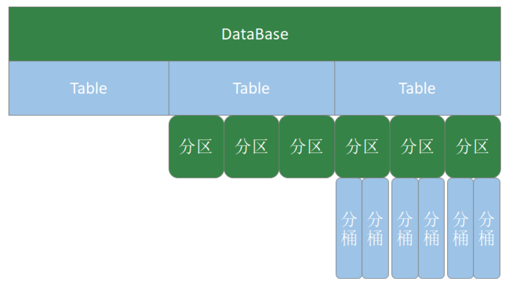

## HQL操作之-DDL命令

参考:https://cwiki.apache.org/confluence/display/Hive/LanguageManual+DDL




查询数据库信息

```sql
-- 查看数据库信息
desc database mydb2;
desc database extended mydb2; 
describe database extended mydb2;
```

删除数据库

```HQL
-- 删除一个空数据库
drop database databasename;
-- 如果数据库不为空，使用 cascade 强制删除 
drop database databasename cascade;
```

#### 内部表和外部表

* 默认创建内部表，如果创建外部表需要使用关键字external；create external table
* 删除内部表，会把数据和表结构都删除
* 删除外部表，只删除表结构
* 生产一般都是外部表


创建内部表：

```sql
-- 默认导入数据的时候，是使用^A，^B，^C分割。下面自定义为 ; , :。
create table t1(
  id int,
  name string,
  hobby array<string>,
  addr map<string,string>
)
row format delimited
fields terminated by ";"
collection items terminated by ","
map keys terminated by ":";

-- 查看表信息
desc t1;

desc formatted t1;

--加载数据
load data local inpath '/mnt/hadoop/data/t1.dat' into table t1;
-- 查询数据：
select * from t1;

-- 查询数据位置：
dfs -ls /user/hive/warehouse/mydb.db/t1
dfs -cat /user/hive/warehouse/mydb.db/t1/t1.dat;

-- 删除表：
drop table t1;

-- 再次查看：数据也没了
dfs -ls /user/hive/warehouse/mydb.db;

```


创建外部表：

```sql
-- 默认导入数据的时候，是使用^A，^B，^C分割。下面自定义为 ; , :。
create external table t1(
  id int,
  name string,
  hobby array<string>,
  addr map<string,string>
)
row format delimited
fields terminated by ";"
collection items terminated by ","
map keys terminated by ":";

-- 查看表信息
desc t1;

desc formatted t1;

--加载数据
load data local inpath '/mnt/hadoop/data/t1.dat' into table t1;
-- 查询数据：
select * from t1;

-- 查询数据位置：
dfs -ls /user/hive/warehouse/mydb.db/t1
dfs -cat /user/hive/warehouse/mydb.db/t1/t1.dat;


-- 删除表：
drop table t1;

-- 再次查看：数据还在
dfs -ls /user/hive/warehouse/mydb.db;

```

内部表外部表转换

```sql
-- 默认导入数据的时候，是使用^A，^B，^C分割。下面自定义为 ; , :。
create table t1(
  id int,
  name string,
  hobby array<string>,
  addr map<string,string>
)
row format delimited
fields terminated by ";"
collection items terminated by ","
map keys terminated by ":";

-- 查看表信息
desc t1;

desc formatted t1;

--加载数据
load data local inpath '/mnt/hadoop/data/t1.dat' into table t1;
-- 查询数据：
select * from t1;


-- 内部表转外部表
alter table t1 set tblproperties('EXTERNAL'='TRUE'); 
-- 查询表信息，是否转换成功
desc formatted t1;
-- 外部表转内部表。EXTERNAL 大写，false 不区分大小
alter table t1 set tblproperties('EXTERNAL'='FALSE'); 
-- 查询表信息，是否转换成功
desc formatted t1;

```


#### 分区表

作用：避免全表扫描，提高查询效率

分区表创建和数据加载：

```sql
-- 默认导入数据的时候，是使用^A，^B，^C分割。下面自定义为 ; , :。
create table if not exists t1(
  id int,
  name string,
  hobby array<string>,
  addr map<string,string>
)
partitioned by (dt string)
row format delimited
fields terminated by ";"
collection items terminated by ","
map keys terminated by ":";
-- 加载数据。
load data local inpath "/mnt/hadoop/data/t1.dat" into table t1 partition(dt="2020-06-01");
load data local inpath "/mnt/hadoop/data/t1.dat" into table t1 partition(dt="2020-06-02");
load data inpath "/user/hive/warehouse/ads.db/ads_member_active_count/dt=2020-07-21" into table ads_member_active_count partition(dt="2020-07-21");

-- 查看有几个分区
show partitions t1;
-- 增加分区
alter table t1 add partition(dt="2020-06-03");

-- 增加多个分区，不加载数据
alter table t1;
add partition(dt='2020-06-05') partition(dt='2020-06-06');
-- 增加多个分区。准备数据
hdfs dfs -cp /user/hive/warehouse/mydb.db/t1/dt=2020-06-01 /user/hive/warehouse/mydb.db/t1/dt=2020-06-07
hdfs dfs -cp /user/hive/warehouse/mydb.db/t1/dt=2020-06-01 /user/hive/warehouse/mydb.db/t1/dt=2020-06-08
-- 增加多个分区。加载数据
alter table t1 add
partition(dt='2020-06-07') location '/user/hive/warehouse/mydb.db/t1/dt=2020-06-07' partition(dt='2020-06-08') location '/user/hive/warehouse/mydb.db/t1/dt=2020-06-08';
-- 查询数据
select * from t1;

-- 修改分区的hdfs路径：
alter table t1 partition(dt='2020-06-01') set location '/user/hive/warehouse/t1/dt=2020-06-03';

-- 可以删除一个或多个分区，用逗号隔开
alter table t1 drop partition(dt='2020-06-03'), partition(dt='2020-06-04');
-- 查看某个分区的数据：
select * from t1 where dt='2020-06-01';
```


**分区的字段，不是表中已经存在的数据，可以将分区字段看成伪列**


#### 分桶表

当单个分区或者表的数据量过大，分区不能更细的粒度划分数据，就需要分桶技术划分。

原理：

* MR：key.hashCode % reduceTask (默认分区)
* Hive中。分桶字段.hashCode % 分桶个数


```sql
-- 创建分桶表
create table course(
    id int,
    name string,
    score int
)
clustered by (id) into 3 buckets
row format delimited fields terminated by ",";

create table course_common(
id int,
name string,
score int )
row format delimited fields terminated by ",";
-- 普通表加载数据
load data local inpath '/mnt/hadoop/data/course.dat' into table course_common;
-- 通过 insert ... select ... 给桶表加载数据
insert into table course select * from course_common;
-- 观察分桶数据。数据按照:(分区字段.hashCode) % (分桶数) 进行分区
```

* 分桶规则：分桶字段.hashCode % 分桶数
* 分桶表加载数据时，使用 insert……select…… 方式进行
* 网上有资料说要使用分区表需要设置 hive.enforce.bucketing=true，那是Hive 1.x 以前的版本;Hive 2.x 中，删除了该参数，始终可以分桶;

#### 修改表和删除表

```sql
--修改表名
alter table t1 rename to t2;
-- 修改列名
alter table t2 change column id cid int;
-- 修改字段类型 修改字段数据类型时，要满足数据类型转换的要求。如int可以转为string，但是 string不能转为int
alter table t2 change column cid cid string;
-- 增加字段
alter table t2 add columns (common string);
alter table dws_member_start_week add column (week string);
-- 删除字段
alter table t2 replace columns (cid string,cname string,score int);
-- 删除表
drop table t2;
```


HQL DDL小结：

* 操作对象：库、表
* 表的分类：
  * 内部表：表数据和元数据都删除
  * 外部表：只删除元数据
  * 分区表：按照指定字段分区，将数据放到不同的目录，提高SQL查询性能
  * 分桶表：按照分桶字段，将表中字段分开。分桶字段.hashCode % 分桶数据
* 命令：create、alter、drop

