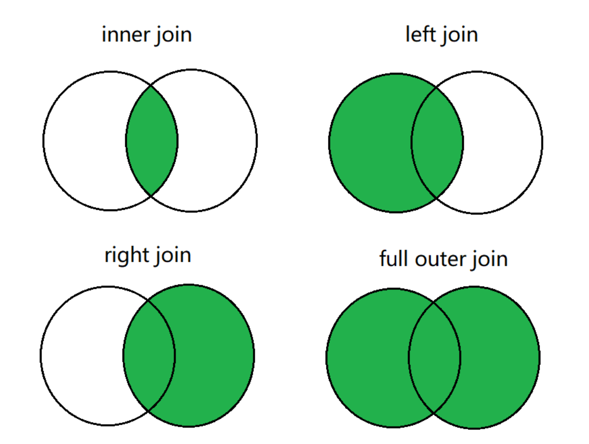

## HQL操作之DQL命令


```sql
-- 测试数据 /home/hadoop/data/emp.dat
7369,SMITH,CLERK,7902,2010-12-17,800,,20
7499,ALLEN,SALESMAN,7698,2011-02-20,1600,300,30
7521,WARD,SALESMAN,7698,2011-02-22,1250,500,30
7566,JONES,MANAGER,7839,2011-04-02,2975,,20
7654,MARTIN,SALESMAN,7698,2011-09-28,1250,1400,30
7698,BLAKE,MANAGER,7839,2011-05-01,2850,,30
7782,CLARK,MANAGER,7839,2011-06-09,2450,,10
7788,SCOTT,ANALYST,7566,2017-07-13,3000,,20
7839,KING,PRESIDENT,,2011-11-07,5000,,10
7844,TURNER,SALESMAN,7698,2011-09-08,1500,0,30
7876,ADAMS,CLERK,7788,2017-07-13,1100,,20
7900,JAMES,CLERK,7698,2011-12-03,950,,30
7902,FORD,ANALYST,7566,2011-12-03,3000,,20
7934,MILLER,CLERK,7782,2012-01-23,1300,,10
-- 建表并加载数据 
CREATE TABLE emp (
    empno int,
    ename string,
    job string,
    mgr int,
    hiredate DATE,
    sal int,
    comm int,
    deptno int
)row format delimited fields terminated by ",";
-- 加载数据
LOAD DATA LOCAL INPATH '/home/hadoop/data/emp.dat' INTO TABLE emp;
```


#### 基本查询

```sql
-- 省略from子句的查询 select 8*888 ;
select current_date ;
-- 使用列别名
select 8*888 product;
select current_date as currdate;

-- 全表查询
select * from emp;
-- 选择特定列查询
select ename, sal, comm from emp;
-- 使用函数
select count(*) from emp;
-- count(colname) 按字段进行count，不统计NULL select sum(sal) from emp;
select max(sal) from emp;
select min(sal) from emp;
select avg(sal) from emp;
-- 使用limit子句限制返回的行数 select * from emp limit 3;
```

#### where 子句

**Where 子句不能使用列的别名**

| **比较运算符** | **描述**                                                     |
| -------------- | ------------------------------------------------------------ |
| RLIKE、 REGEXP | 基于java的正则表达式，匹配返回TRUE，反之返回FALSE。匹配 使用的是JDK中的正则表达式接口实现的，因为正则也依据其中的 规则。例如，正则表达式必须和整个字符串A相匹配，而不是只需 与其字符串匹配。 |

备注:通常情况下NULL不参与运算，如果参与运算返回值为NULL;**NULL<=>NULL的结果为true**

#### 逻辑运算符

```sql
-- 比较运算符，null参与运算 
select null=null;  -- NULL
select null==null; -- NULL
select null<=>null;--true
select null is null;--true
-- 使用 is null 判空
select * from emp where comm is null;
-- 使用 in
select * from emp where deptno in (20, 30);
-- 使用 between ... and ... 左闭右闭
select * from emp where sal between 1000 and 2000;
-- 使用 like
select ename, sal from emp where ename like '%L%';
-- 使用 rlike。正则表达式，名字以A或S开头
select ename, sal from emp where ename rlike '^(A|S).*';
```

#### Group by

分组聚合,和MySQL一样。


#### 表链接

Hive只支持等值连接。不支持非等值连接

1. 内链接
2. 外连接
   1. 左外连接
   2. 右外连接
   3. 全外连接



Hive 是按照从左到右的顺序执行，Hive会对每对JOIN链接对象启动一个MapReduce任务

笛卡尔积：缺省条件下 hive不支持笛卡尔积运算;

```sql
-- 默认
set hive.strict.checks.cartesian.product
> hive.strict.checks.cartesian.product=true

set hive.strict.checks.cartesian.product=false;
```


#### 排序子句

###### order by 全局有限

order by 执行全局排序，只有一个reduce。

排序字段要出现在select子句中。

**对于大规模数据而言，order by 效率低** 


###### sort by 局部有序

sort by 为每个reduce 产生一个排序文件，在reduce内部有序，得到局部有序结果

```sql
-- 设置reduce个数
set mapreduce.job.reduces=2;
-- 按照工资降序查看员工信息
select * from emp sort by sal desc;
-- 将查询结果导入到文件中(按照工资降序)。生成两个输出文件，每个文件内部数据按 工资降序排列
insert overwrite local directory '/mnt/hadoop/output/sortsal' select * from emp sort by sal desc;
```


###### distribute by 分区排序

1. distribute by 将特定的行发送到特定的reducer中，便于后继的聚合与排序操作
2. distribute by 类似于MR的分区操作，可以结合sort by，是分区数据有序
3. distribute by 要写在sort by 之前

```sql
-- 启动2个reducer task;先按 deptno 分区，在分区内按 sal+comm 排序
set mapreduce.job.reduces=2;
-- 将结果输出到文件，观察输出结果
insert overwrite local directory '/mnt/hadoop/output/distBy' select empno, ename, job, deptno, sal + nvl(comm, 0) salcomm
from emp
distribute by deptno
sort by salcomm desc;
-- 上例中，数据被分到了统一区，看不出分区的结果
-- 将数据分到3个区中，每个分区都有数据
set mapreduce.job.reduces=3;
insert overwrite local directory '/mnt/hadoop/output/distBy1' select empno, ename, job, deptno, sal + nvl(comm, 0) salcomm
  from emp
distribute by deptno
sort by salcomm desc;
```


###### Cluster by

当distribute by 和sort by 是 同一个字段，可使用cluster by。且cluster 只能是升序，不能指定排序规则

```sql
select * from emp distribute by deptno sort by deptno;
select * from emp cluster by deptno;
```


排序小结：

* order by：全局排序
* sort by： 局部有序（在reduce内部有序）
* distribute by 按照指定条件将数据分组，常与sort by连用，使数据局部有序
* cluster by：当distribute by 与 sort by是同一个字段时，可使用cluster by简化 语法