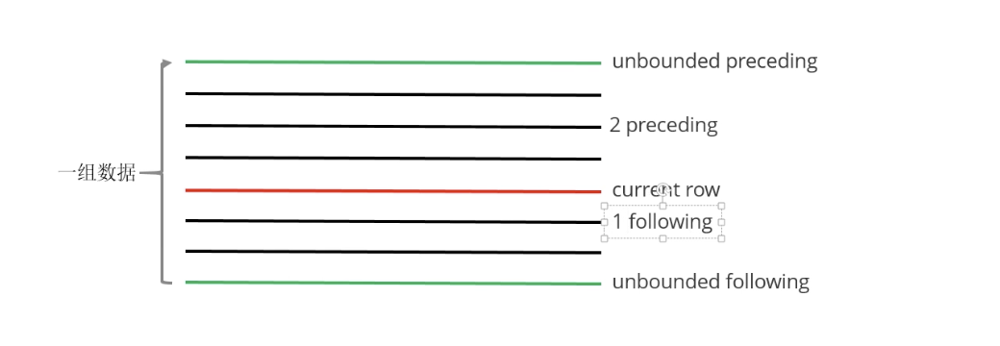
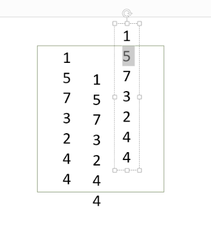
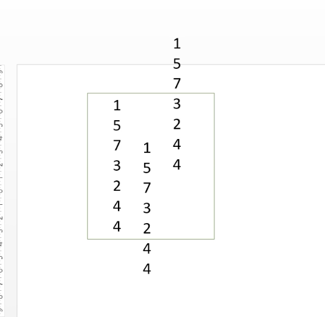

## 函数

#### 内置函数

```sql
-- 查看系统自带函数 
show functions;
-- 显示自带函数的用法
desc function upper;
desc function extended upper;
```


#### 时间函数

```sql
-- 当前前日期
select current_date;
select unix_timestamp();
-- 建议使用current_timestamp，有没有括号都可以 
select current_timestamp();
-- 时间戳转日期
select from_unixtime(1505456567);
select from_unixtime(1505456567, 'yyyyMMdd');
select from_unixtime(1505456567, 'yyyy-MM-dd HH:mm:ss');
-- 日期转时间戳
select unix_timestamp('2019-09-15 14:23:00');
-- 计算时间差
select datediff('2020-04-18','2019-11-21'); 
select datediff('2019-11-21', '2020-04-18');
-- 查询当月第几天
select dayofmonth(current_date);
-- 计算月末:
select last_day(current_date);
-- 当月第1天:
select date_sub(current_date, dayofmonth(current_date)-1)
-- 下个月第1天:
select add_months(date_sub(current_date, dayofmonth(current_date)-1), 1
-- 字符串转时间(字符串必须为:yyyy-MM-dd格式)
select to_date('2020-01-01');
select to_date('2020-01-01 12:12:12');
-- 日期、时间戳、字符串类型格式化输出标准时间格式
select date_format(current_timestamp(), 'yyyy-MM-dd HH:mm:ss'); 
select date_format(current_date(), 'yyyyMMdd');
select date_format('2020-06-01', 'yyyy-MM-dd HH:mm:ss');
-- 计算emp表中，每个人的工龄
select *, round(datediff(current_date, hiredate)/365,1) workingyears from emp;
```

###### 字符串函数

```sql
-- 转小写。lower
select lower("HELLO WORLD");
-- 转大写。upper
select lower(ename), ename from emp;
-- 求字符串长度。length
select length(ename), ename from emp;
-- 字符串拼接。 concat / ||
select empno || " " ||ename idname from emp; select concat(empno, " " ,ename) idname from emp;
-- 指定分隔符。concat_ws(separator, [string | array(string)]+) 
SELECT concat_ws('.', 'www', array('lagou', 'com'));
select concat_ws(" ", ename, job) from emp;
-- 求子串。substr
SELECT substr('www.lagou.com', 5); SELECT substr('www.lagou.com', -5); SELECT substr('www.lagou.com', 5, 5);
-- 字符串切分。split，注意 '.' 要转义
select split("www.lagou.com", "\\.");
```

###### 数学函数

```sql
-- 四舍五入。round
select round(314.15926); 
select round(314.15926, 2); 
select round(314.15926, -2);
-- 向上取整。ceil
select ceil(3.1415926);
-- 向下取整。floor
select floor(3.1415926);
--求绝对值
abs()
-- 平方
power()
-- 开方
sqrt()
-- 对数
log2()
```


###### 条件函数

```sql
-- if (boolean testCondition, T valueTrue, T valueFalseOrNull)
select sal, if (sal<1500, 1, if (sal < 3000, 2, 3)) from emp;

-- CASE WHEN a THEN b [WHEN c THEN d]* [ELSE e] END -- 复杂条件用 case when 更直观
select sal, case when sal<=1500 then 1
                 when sal<=3000 then 2
                 else 3 end sallevel
from emp;


select ename, deptno,
       case deptno when 10 then 'accounting'
                   when 20 then 'research'
                   when 30 then 'sales'
                   else 'unknown' end deptname
from emp;


-- COALESCE(T v1, T v2, ...)。返回参数中的第一个非空值;如果所有值都为 NULL，那么返回NULL
select sal,comm, coalesce(comm,sal) from emp;

-- isnull(a) isnotnull(a)
select * from emp where isnull(comm);
select * from emp where isnotnull(comm);

-- nvl(T value, T default_value)
select empno, ename, job, mgr, hiredate, deptno, sal +
nvl(comm,0) sumsal
from emp;


-- nullif(x, y) 相等为空，否则返回第一个参数
SELECT nullif("b", "b"), nullif("b", "a");
```

###### **UDTF函数**

表生产函数，一行输入，多行输出。将一行中复杂的数据结构（map,array）拆分成多行。

```sql
-- 就是将一行中复杂的 array 或者 map 结构拆分成多行 
select explode(array('A','B','C')) as col; 
select explode(map('a', 8, 'b', 88, 'c', 888));


-- UDTF's are not supported outside the SELECT clause, nor nested in expressions
-- SELECT pageid, explode(adid_list) AS myCol... is not supported -- SELECT explode(explode(adid_list)) AS myCol... is not supported
-- lateral view 常与表生成函数explode结合使用
-- lateral view 语法:
lateralView: LATERAL VIEW udtf(expression) tableAlias AS columnAlias (',' columnAlias)* fromClause: FROM baseTable (lateralView)*

-- 这种写法报错：
 with t1 as ( select 'OK' cola, split('www.lagou.com', '\\.') colb ) select cola,explode(colb) from t1;
-- FAILED: SemanticException [Error 10081]: UDTF's are not supported outside the SELECT clause, nor nested in expressions
-- lateral view 的基本使用 with t1 as (
select 'OK' cola, split('www.lagou.com', '\\.') colb )
select cola, colc
  from t1
       lateral view explode(colb) t2 as colc;
```

UDTF案例1:

```sql
-- 数据(uid tags): 
 1 1,2,3
 2 2,3
 3 1,2
--编写sql,实现如下结果: 
 11
 12
 13
 22
 23 
 31 
 32
create table market(
  id int,
  tags string)
   row format delimited fields terminated by ' ';
   
load data local inpath '/mnt/hadoop/data/market.dat' into table market;

-- SQL
 with t as (
   select id ,split(tags,',')as tags from market
 )
 select 
 id ,tag 
 from t lateral view explode(tags) t1 as tag;
 
 -- 简写
 select id,tag from market lateral view explode(split(tags,',')) t as tag;
```


UDTF案例2:

```sql
-- 数据准备 
lisi|Chinese:90,Math:80,English:70
wangwu|Chinese:88,Math:90,English:96
maliu|Chinese:99,Math:65,English:60

create table stu (
  name string,
  score map<string,string>)
  row format delimited
  fields terminated by '|'
  collection items terminated by ','
  map keys terminated by ':';
  
-- 需求:找到每个学员的最好成绩
-- 第一步，使用 explode 函数将map结构拆分为多行
select explode(score) as (sub,soc) from stu;
-- 第二步:explode常与 lateral view 函数联用，这两个函数结合在一起能关联其 他字段
select name,sub,soc from stu lateral view explode(score) t as sub,soc;
-- 第三步:找到每个学员的最好成绩
-- 第一种写法
select max(soc),name from (select name,score,sub,soc from stu lateral view explode(score) t as sub,soc) t group by name;
-- 第二种
with tmp as (select name,sub,soc from stu lateral view explode(score) t as sub,soc)
 select name,max(soc) from tmp group by name;

```

小结：

1. explode将一行数据拆分成多行数据，可以用于行中复杂数据结果（array\map）
2. Lateral view 与 explod连用，解决UDTF不能添加额外列问题。

###### 窗口函数

又叫开窗函数，属于分析函数一种，解决复杂报表统计需求的功能。用于计算基于组的某种聚合值，和聚合函数不同，对于每个组返回多行，聚合函数只返回一行。窗口函数制定了分析函数工作的数据窗口大小，这个数据窗口大小可能会随着行的变化而变化。

###### over

```sql
-- 查询emp表工资总和
select sum(sal) from emp;
-- 不使用窗口函数，有语法错误
select ename, sal, sum(sal) salsum from emp;
-- 使用窗口函数
select ename, sal, sum(sal) over() salsum from emp; 

-- 使用窗口函数，查询员工姓名、薪水、薪水总和
select ename, sal, sum(sal) over() salsum,
       concat(round(sal / sum(sal) over()*100, 1) , '%')
ratiosal
from emp;
```

窗口函数针对的每一行数据，over如果没有指定参数，默认是整个数据集

###### partition by

在over窗口进行分区，对某一列进行分区统计，窗口大小就是分区大小；

```sql
-- 查询员工姓名、薪水、部门薪水总和
select ename, sal,deptno, sum(sal) over(partition by deptno) salsum from emp; 
-- 结果：
MILLER	1300	10	8750
KING	5000	10	8750
CLARK	2450	10	8750
ADAMS	1100	20	10875
SCOTT	3000	20	10875
SMITH	800	20	10875
JONES	2975	20	10875
FORD	3000	20	10875
TURNER	1500	30	9400
ALLEN	1600	30	9400
BLAKE	2850	30	9400
MARTIN	1250	30	9400
WARD	1250	30	9400
JAMES	950	30	9400
```

###### order by

```sql
-- 在组内计算第一行到当前行的累积和
select ename, sal,deptno, sum(sal) over(partition by deptno order by ename) salsum from emp;
-- 结果：
ename	sal	deptno	salsum
CLARK	2450	10	2450
KING	5000	10	7450
MILLER	1300	10	8750
ADAMS	1100	20	1100
FORD	3000	20	4100
JONES	2975	20	7075
SCOTT	3000	20	10075
SMITH	800	20	10875
ALLEN	1600	30	1600
BLAKE	2850	30	4450
JAMES	950	30	5400
MARTIN	1250	30	6650
TURNER	1500	30	8150
WARD	1250	30	9400
```

###### window 子句

```
rows between ... and ...
```

如果要对窗口的结果做更细粒度的划分，使用window子句，有如下几个选项：

* unbounded preceding 组内第一行数据
* n preceding 组内当前行的前n行数据
* current row 当前行
* n following 组内当前行的后n行数据
* unbounded following 组内最后一行数据



```sql
-- 通过部门编号分区，然后计算在组内计算第一行到当前行的累积和
select ename, sal,deptno, sum(sal) over(partition by deptno order by ename) salsum from emp; 
-- rows between ... and... ，上面是该语句的缺省的写发，默认是从第一个行计算到当前行累加
select ename, sal,deptno, sum(sal) 
over(partition by deptno order by ename rows between unbounded preceding and current row ) salsum 
from emp; 

-- rows between ... and...  从当前行计算到最后一行
select ename, sal,deptno, sum(sal) 
over(partition by deptno order by ename rows between unbounded preceding and unbounded following ) salsum 
from emp;

-- rows between ... and...  计算前一行+当前行+后一行的累加
select ename, sal,deptno, sum(sal) - sal
over(partition by deptno order by ename rows between 1 preceding and 1 following ) salsum 
from emp;


-- rows between ... and...  计算前一行+后一行的累加
select ename, sal,deptno, salsum - sal from (
select ename, sal,deptno, sum(sal)
over(partition by deptno order by ename rows between 1 preceding and 1 following ) salsum 
from emp) t;
```

###### 排名函数

都是从1开始，生成数据项在分组中的排名，通常用于求解 TopN问题，排名有三种

* row_number() 排名顺序增加不同重复；如：1、2、3、4 .....
* rank() : 排名相等会在名次中留下空位；如：1、2、2、4、5、......
* dense_rank(): 排名相等会在名次中不会留下空位；如：1、2、2、3、4、5、......

```sql
--测试数据
class1 s01 100
class1 s03 100
class1 s05 100
class1 s07 99
class1 s09 98
class1 s02 98
class1 s04 97
class2 s21 100
class2 s24 99
class2 s27 99
class2 s22 98
class2 s25 98
class2 s28 97
class2 s26 96

create table t2(
    cname string,
    sname string,
    score int
) row format delimited fields terminated by ' ';

-- 按照班级，使用3种方式对成绩进行排名
select 
cname,sname,score,
row_number() over(partition by cname order by score desc) rank1,
rank() over(partition by cname order by score desc) rank2,
dense_rank() over(partition by cname order by score desc) rank3
from t2;
-- 使用3种方式对成绩进行排名
select 
cname,sname,score,
row_number() over( order by score desc) rank1,
rank() over( order by score desc) rank2,
dense_rank() over( order by score desc) rank3
from t2;

-- 求每个班级前3名的学员--前3名的定义是什么--假设使用dense_rank
select * from (
select 
cname,sname,score,
dense_rank() over(partition by cname order by score desc) rank3
from t2)t where rank3 <= 3;
```

###### 序列/行函数

* lag: 返回当前行数据的上一行数据
* lead：返回当前行数据的下一行数据
* first_value：将数据分组排序后，截止到当前行，第一个值
* last_value：将数据分组排序后，截止到当前行，最后一个值
* ntile：将数据分组排序后，顺序切分成n分，返回当前切片值

```sql
-- 测试数据
cookie1,2019-04-10,1
cookie1,2019-04-11,5
cookie1,2019-04-12,7
cookie1,2019-04-13,3
cookie1,2019-04-14,2
cookie1,2019-04-15,4
cookie1,2019-04-16,4
cookie2,2019-04-10,2
cookie2,2019-04-11,3
cookie2,2019-04-12,5
cookie2,2019-04-13,6
cookie2,2019-04-14,3
cookie2,2019-04-15,9
cookie2,2019-04-16,7

-- 建表语句
create table userpv(
    cid string,
    ctime date,
    pv int
)
row format delimited fields terminated by ",";
Load data local inpath '/mnt/hadoop/data/userpv.dat' into table userpv;
-- lag\load
-- 按照cid 分组，按照ctime降序排序，分别将上一行的pv、下一行的pv移动到当前行,如图
select cid,ctime,pv,
lag(pv) over(partition by cid order by ctime ) lagpv,
lead(pv) over(partition by cid order by ctime ) leadpv
from userpv;
-- lag\load 可以跟参数，移动多行
-- 按照cid 分组，按照ctime降序排序，分别将上两行的pv、下三行的pv移动到当前行,如图
select cid,ctime,pv,
lag(pv,2) over(partition by cid order by ctime ) lagpv,
lead(pv,3) over(partition by cid order by ctime ) leadpv
from userpv;


-- first_value\last_value
select cid,ctime,pv,
first_value(pv) over(partition by cid order by ctime ) firstpv,
last_value(pv) over(partition by cid order by ctime ) leadpv
from userpv;

-- ntile 按照cid进行分组，每组数据分成两份
select cid,ctime,pv,
ntile(2) over(partition by cid order by ctime ) ntilepv
from userpv;
```






###### SQL 面试题

1、连续7天登陆的用户

```sql
1 2019-07-11 1
1 2019-07-12 1
1 2019-07-13 1
1 2019-07-14 1
1 2019-07-15 1
1 2019-07-16 1
1 2019-07-17 1
1 2019-07-18 1
2 2019-07-11 1
2 2019-07-12 1
2 2019-07-13 0
2 2019-07-14 1
2 2019-07-15 1
2 2019-07-16 0
2 2019-07-17 1
2 2019-07-18 0
3 2019-07-11 1
3 2019-07-12 1
3 2019-07-13 1
3 2019-07-14 0
3 2019-07-15 1
3 2019-07-16 1
3 2019-07-17 1
3 2019-07-18 1

create table ulogin(
    uid int,
    dt date,
    status int
)
row format delimited fields terminated by ' ';
load data local inpath '/mnt/hadoop/data/ulogin.dat' into table ulogin;

-- 连续值求解问题，只要是连续值求解，是同一类问题。按以下步骤
-- 1、 把需要的数据筛选出来使用row_number()对组内数据编号
select uid,dt,
row_number() over(partition by uid order by dt) rownum
from ulogin where status =1;
-- 2、使用某个列（该题为日期）减去 rownum = gid，gid可以作为下一步分组的依据
select uid,dt,
row_number() over(partition by uid order by dt) rownum,
date_sub(dt,row_number() over(partition by uid order by dt)) gid
from ulogin where status =1;
-- 3、使用gid作为分组的依据，将数据分组，求最终的结果。
select uid,gid,count(*) from(
select uid,
date_sub(dt,row_number() over(partition by uid order by dt)) gid
from ulogin where status =1)t
group by uid,gid having count(*) >= 7;

-- 假设连续三天登陆
select  uid,max(total) total from (
select uid,gid,count(*)as total from(
select uid,
date_sub(dt,row_number() over(partition by uid order by dt)) gid
from ulogin where status =1)t
group by uid,gid having count(*) >= 3)t1
group by uid ;

```

对于连续值求解的问题：

* 使用row_number()给组内数据编号rownum
* 某个列 - rownum = gid，gid作为下一步分组的依据
* 使用gid最为分组依据，将数据分组，求的最终结果。

2、编写SQL语句实现每个班级前三名，同时求出前三名按名次排序的分差

```sql
1 1901 90
2 1901 90
3 1901 83
4 1901 60
5 1902 66
6 1902 23
7 1902 99
8 1902 67
9 1902 87

create table stu(
sno int,
class string,
score int
)row format delimited fields terminated by ' ';
load data local inpath '/mnt/hadoop/data/stu.dat' into table stu;
-- 思路：
-- 1、使用排名函数，分数并列，使用dense_rank()
select sno,class,score,
dense_rank() over(partition by class order by score desc) as rank
from stu;
-- 2、使用行函数lag，将数据向下一行，求分差相减
select sno,class,score,
dense_rank() over(partition by class order by score desc) as rank,
score - lag(score) over(partition by class order by score desc) as lagsocre
from stu;
-- 3、处理null
select sno,class,score,
dense_rank() over(partition by class order by score desc) as rank,
nvl(score - lag(score) over(partition by class order by score desc),0) as lagsocre
from stu;
-- 自己写的
select sno,class,rank,score,nvl((score-ss),0)
from (
select sno,class,score,
dense_rank() over(partition by class order by score desc) rank,
 lag(score) over(partition by class order by score desc) ss
from stu) t where  rank  <= 3;
```

总结

* 看见top的时候，上排名函数
* 看见求分差，上行函数

3、行转列、列转行

```sql
-- 行转列
a b 2
a b 1
a b 3
c d 6
c d 8
c d 8


create table rowline1(
    id1 string,
    id2 string,
    flag int
) row format delimited fields terminated by ' ';
load data local inpath '/mnt/hadoop/data/data1.dat' into table rowline1;
-- 解题思路
-- 1、 将数据分组聚拢
select id1,id2,collect_set(flag)flags
from rowline1
group by id1,id2;
-- 该方式结果：会去掉重复数据
-- id1	id2	flags
-- a	  b	  [2,1,3]
-- c	  d	  [6,8]

-- 该方式结果：不会去掉重复数据
select id1,id2,collect_list(flag) flags
from rowline1
group by id1,id2;
-- id1	id2	flags
-- a	b	[2,1,3]
-- c	d	[6,8,8]

-- 2、 将数据连接在一起,如果不使用case类型转换，会报错，提示需要使用string类型，但是你的是int类型
select id1,id2,concat_ws('|',collect_list(cast(flag as string))) flags
from rowline1
group by id1,id2;

-- 列转行
1 java
1 hadoop
1 hive
1 hbase
2 java
2 hive
2 spark
2 flink
3 java
3 hadoop
3 hive
3 kafka
create table rowline2(
id string,
course string
)row format delimited fields terminated by ' ';
load data local inpath '/mnt/hadoop/data/data2.dat' into table rowline2;

--
select id,
case when course = 'java' then 1 else 0 end as java,
case when course = 'hadoop' then 1 else 0 end as hadoop,
case when course = 'hive' then 1 else 0 end as hive,
case when course = 'hbase' then 1 else 0 end as hbase,
case when course = 'spark' then 1 else 0 end as spark,
case when course = 'flink' then 1 else 0 end as flink,
case when course = 'kafka' then 1 else 0 end as kafka
from rowline2;
-- 
select id,
sum(case when course = 'java' then 1 else 0 end) as java,
sum(case when course = 'hadoop' then 1 else 0 end)as hadoop,
sum(case when course = 'hive' then 1 else 0 end )as hive,
sum(case when course = 'hbase' then 1 else 0 end) as hbase,
sum(case when course = 'spark' then 1 else 0 end )as spark,
sum(case when course = 'flink' then 1 else 0 end )as flink,
sum(case when course = 'kafka' then 1 else 0 end )as kafka
from rowline2 group by id;

```

小结：3类典型问题：行列互转、TopN+行函数、连续值求解（row_number(),gid,分组）


#### 自定义函数

* UDF 用户自定义函数，特点：一进一出，类似于lower，upper
* UDAF：用户自定义聚集函数，特点，多进一出，类似于 sum
* UDTF：用户自定义表生成函数，一进多处，类似于explode


UDF开发：

* 继承org.apache.hadoop.hive.ql.exec.UDF
* 需要实现evaluate函数;evaluate函数支持重载
* UDF必须要有返回类型，可以返回null，但是返回类型不能为void

开发步骤

* 创建一个maven工程，添加依赖
* 开发Java类，继承UDF，实现evaluate
* 打包jar，上传服务器
* 在Hive命令中添加jar
* 设置函数与自定义函数执行的联系
* 测试使用自定义函数

需求：拓展系统nvl函数功能

```
-- 原功能
nvl(ename, "OK"): ename==null => 返回第二个参数
-- 扩展以后的
nvl(ename, "OK"): ename==null or ename=="" or ename==" " => 返回第二个参数
```

1、创建maven java 工程，添加依赖

```xml
<!-- pom.xml 文件 --> 
<dependency>
  <groupId>org.apache.hive</groupId>
  <artifactId>hive-exec</artifactId>
  <version>2.3.7</version>
</dependency>
```

2、开发java类继承UDF，实现evaluate 方法

```java
package com.hhb.hive.udf;

import org.apache.hadoop.hive.ql.exec.UDF;
import org.apache.hadoop.io.Text;

/**
 * @author: huanghongbo
 * @Date: 2020-07-12 17:10
 * @Description:
 */
public class nvl extends UDF {

    public Text evaluate(Text x, Text y) {
        if (x == null || x.toString().trim().length() == 0) {
            return y;
        }
        return x;
    }
}

```

3、将项目打包上传服务器 

4、添加开发的jar包(在Hive命令行中)

```shell
add jar  /mnt/hadoop/hiveudf.jar;
```

5、创建临时函数。指定类名一定要完整的路径，即包名加类名

```sql
create temporary function mynvl as "com.hhb.hive.udf.nvl";
```

6、执行查询

```sql
-- 基本功能还有
select mynvl(comm, 0) from mydb.emp;
-- 测试扩充的功能
select mynvl("", "OK"); 
select mynvl(" ", "OK");
```

7、退出Hive命令行，再进入Hive命令行。执行步骤6的测试，发现函数失效。 备注:创建临时函数每次进入Hive命令行时，都必须执行以下语句，很不方便:

```sql
add jar  /mnt/hadoop/hiveudf.jar;
create temporary function mynvl as "com.hhb.hive.udf.nvl";
```

**可创建永久函数:**

1、将jar上传HDFS

```sql
hdfs dfs -put hiveudf.jar jar/
```

2、在Hive命令行中创建永久函数

```sql
create function mynvl1 as 'com.hhb.hive.udf.nvl' using jar 'hdfs:/user/hadoop/jar/hiveudf.jar';
-- 查询所有的函数，发现 mynvl1 在列表中 
show functions;
```

3、退出Hive，再进入，执行测试

```sql
-- 基本功能还有
select mynvl(comm, 0) from mydb.emp;
-- 测试扩充的功能
select mynvl("", "OK"); 
select mynvl(" ", "OK");
```

4、删除永久函数，并检查

```sql
drop function mynvl1;
show functions;
```


