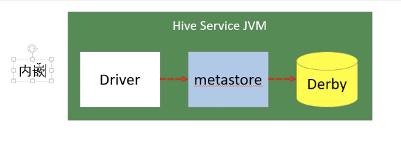
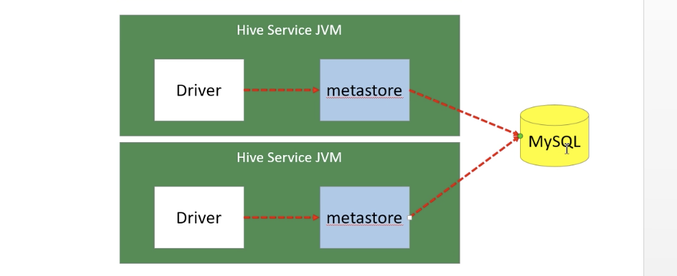
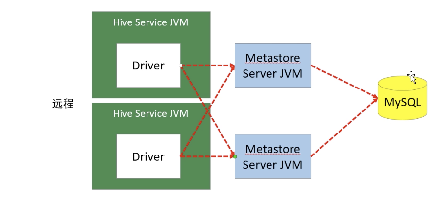
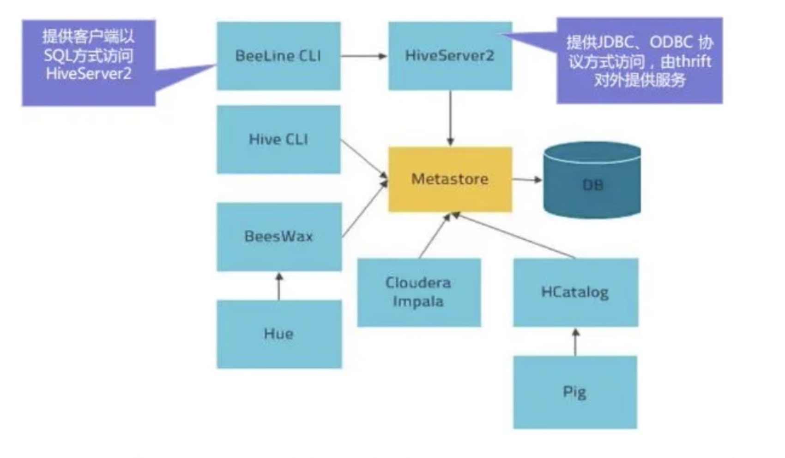
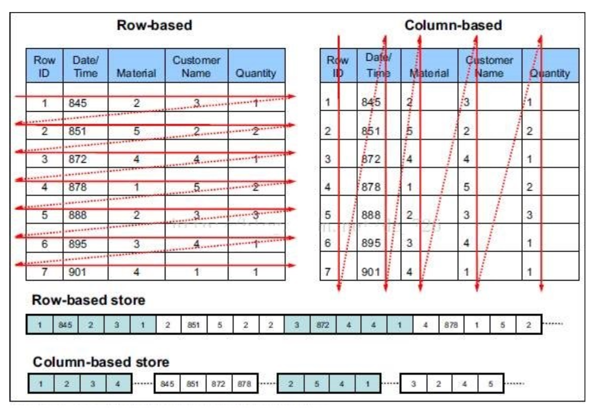
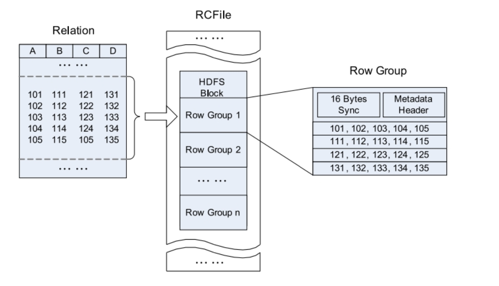
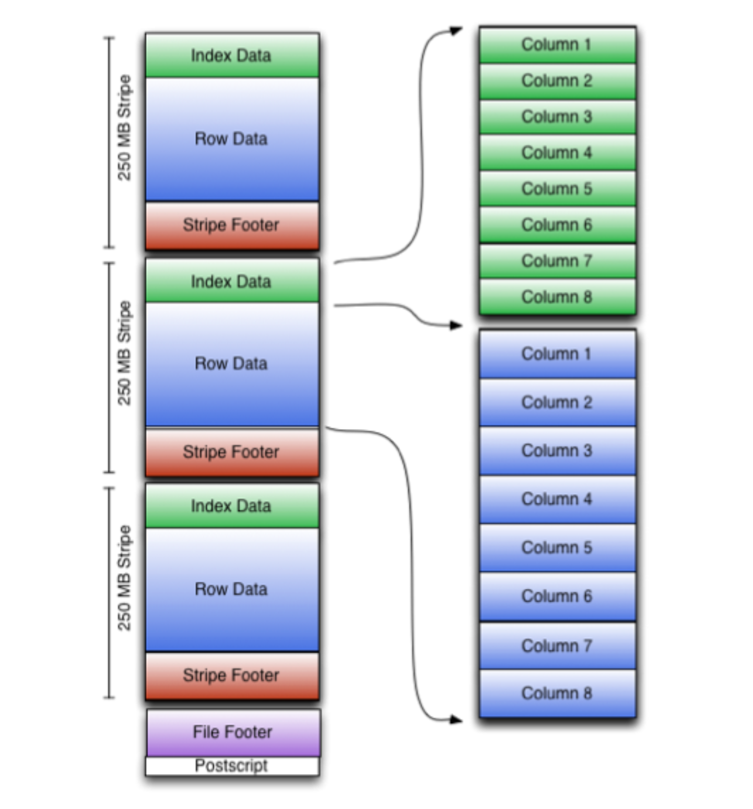
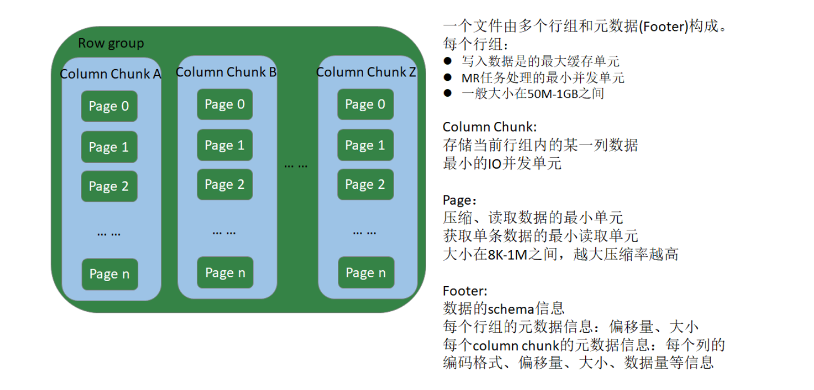

## 元数据管理与存储

在Hive的具体使用中，首先面临的问题便是如何定义表结构信息，跟结构化的数据 映射成功。所谓的映射指的是一种对应关系。在Hive中需要描述清楚表跟文件之间 的映射关系、列和字段之间的关系等等信息。这些描述映射关系的数据的称之为 Hive的元数据。该数据十分重要，因为只有通过查询它才可以确定用户编写sql和最 终操作文件之间的关系。


#### Metastore

**Metadata**即元数据。元数据包含用Hive创建的database、table、表的字段等元信 息。元数据存储在关系型数据库中。如hive内置的Derby、第三方如MySQL等。

**Metastore**即元数据服务，是Hive用来管理库表元数据的一个服务。有了它上层的 服务不用再跟裸的文件数据打交道，而是可以基于结构化的库表信息构建计算框 架。

通过metastore服务将Hive的元数据暴露出去，而不是需要通过对Hive元数据库 mysql的访问才能拿到Hive的元数据信息;metastore服务实际上就是一种thrift服务（跨语言的），通过它用户可以获取到Hive元数据，并且通过thrift获取元数据的方式，屏蔽了 数据库访问需要驱动，url，用户名，密码等细节。

###### metastore三种配置方式

**内嵌模式（默认方式）**

内嵌模式使用的是内嵌的Derby数据库来存储元数据，也不需要额外起Metastore服务。数据库和Metastore服务都嵌入在主Hive Server进程中。这个是默认的，配置简单，但是一次只能一个客户端连接，适用于用来实验，不适用于生产环境。

**优点:**配置简单，解压hive安装包 bin/hive 启动即可使用; 

**缺点:**不同路径启动hive，每一个hive拥有一套自己的元数据，无法共享。



**本地方式**

本地模式采用外部数据库来存储元数据，目前支持的数据库有:MySQL、

Postgres、Oracle、MS SQL Server。教学中实际采用的是MySQL。

本地模式不需要单独起metastore服务，用的是跟Hive在同一个进程里的metastore 服务。也就是说当启动一个hive 服务时，其内部会启动一个metastore服务。Hive 根据 hive.metastore.uris 参数值来判断，如果为空，则为本地模式。

**缺点:**每启动一次hive服务，都内置启动了一个metastore;在hive-site.xml中暴露的数据库的连接信息;一旦数据连接如密码等信息发送编号，配置文件都有修改

**优点**:配置较简单，本地模式下hive的配置中指定mysql的相关信息即可。




**远程模式**

远程模式下，需要单独起metastore服务，然后每个客户端都在配置文件里配置连接 到该metastore服务。远程模式的metastore服务和hive运行在不同的进程里。**在生产环境中，建议用远程模式来配置Hive Metastore。**

在这种模式下，其他依赖hive的软件都可以通过Metastore访问Hive。此时需要配置 hive.metastore.uris 参数来指定 metastore 服务运行的机器ip和端口，并且需要单 独手动启动metastore服务。metastore服务可以配置多个节点上，避免单节点故障 导致整个集群的hive client不可用。同时hive client配置多个metastore地址，会自 动选择可用节点。



**metastore内嵌模式配置**

1. 下载软件解压缩 
2. 设置环境变量，并使之生效
3. 初始化数据库。
     schematool -dbType derby -initSchema 
4. 进入hive命令行 
5. 再打开一个hive命令行，发现无法进入


**metastore远程模式配置**

| 节点     | metastore | clent |
| -------- | --------- | ----- |
| Linux121 | √         |       |
| linux122 |           | √     |
| linux123 | √         |       |

配置步骤:

1. 将 linux123 的 hive 安装文件拷贝到 linux121、linux122 ,

```shell
yum install -y lsof
```


2. 在linux121、linux123上分别启动 metastore 服务

```shell
# 启动 metastore 服务
nohup hive --service metastore &
# 查询9083端口(metastore服务占用的端口) 
lsof -i:9083
# 安装lsof
yum install lsof
```

3. 修改 linux122 上hive-site.xml。删除配置文件中:MySQL的配置、连接数据库 的用户名、口令等信息;增加连接metastore的配置:

```xml
<!-- hive metastore 服务地址 --> 
<property>
	<name>hive.metastore.uris</name>
	<value>thrift://linux121:9083,thrift://linux123:9083</value>
</property>
```

4. 启动hive。此时client端无需实例化hive的metastore，启动速度会加快。

```shell
# 分别在linux121、linux121上执行以下命令，查看连接情况 
lsof -i:9083
```

5. 高可用测试。关闭已连接的metastore服务，发现hive连到另一个节点的服务 上，仍然能够正常使用。

#### HiveServer2

HiveServer2是一个服务端接口，使远程客户端可以执行对Hive的查询并返回结果。 目前基于Thrift RPC的实现是HiveServer的改进版本，并支持多客户端并发和身份验 证，启动hiveServer2服务后，就可以使用jdbc、odbc、thrift 的方式连接。

Thrift是一种接口描述语言和二进制通讯协议，它被用来定义和创建跨语言的服务。 它被当作一个远程过程调用(RPC)框架来使用，是由Facebook为“大规模跨语言服务开发”而开发的。



HiveServer2(HS2)是一种允许客户端对Hive执行查询的服务。HiveServer2是 HiveServer1的后续 版本。HS2支持多客户端并发和身份验证，旨在为JDBC、ODBC 等开放API客户端提供更好的支持。

HS2包括基于Thrift的Hive服务(TCP或HTTP)和用于Web UI 的Jetty Web服务器。

HiveServer2作用：

* 为hive 提供一种允许客户端远程访问的服务
* 基于thirft协议，支持跨平台、跨编程语言对Hive访问
* 允许远程访问hive

#### HiveServer2配置

| 节点     | HiveServer2 | client（beeline） |
| -------- | ----------- | ----------------- |
| Linux121 |             |                   |
| linux122 |             | √                 |
| Linux123 | √           |                   |

###### 配置步骤

1. 修改集群core-site.xml，增加一下内容

```xml
<!-- HiveServer2 连不上10000;hadoop为安装用户 --> 
<!-- root用户可以代理所有主机上的所有用户 -->
<property>
  <name>hadoop.proxyuser.root.hosts</name>
  <value>*</value>
</property>
<property>
  <name>hadoop.proxyuser.root.groups</name>
  <value>*</value>
</property>
```

2. 修改集群上hdfs-site.xml

```xml
<!-- HiveServer2 连不上10000;启用 webhdfs 服务 -->
<property>
  	<name>dfs.webhdfs.enabled</name>
  	<value>true</value>
</property>
```

分发到其他节点，重新启动HDFS

3. 启动linux123上的 HiveServer2 服务

```shell
# 启动 hiveserver2 服务 
nohup hiveserver2 &
# 检查 hiveserver2 端口 
lsof -i:10000
# 从2.0开始，HiveServer2提供了WebUI
# 还可以使用浏览器检查hiveserver2的启动情况。http://linux123:10002/
```

4、启动 linux122 节点上的 beeline

Beeline是从 Hive 0.11版本引入的，是 Hive 新的命令行客户端工具。 Hive客户端工具后续将使用Beeline 替代 Hive 命令行工具 ，并且后续版本也会废弃

掉 Hive 客户端工具。


```sql
cd $HIVE_HOME/bin/
./beeline
! connect jdbc:hive2://linux123:10000
use mydb;
show tables;
select * from emp;
create table tabtest1 (c1 int, c2 string);

```


#### HCataLog

HCatalog 提供了一个统一的元数据服务，允许不同的工具如 Pig、MapReduce 等 通过 HCatalog 直接访问存储在 HDFS 上的底层文件。HCatalog是用来访问 Metastore的Hive子项目，它的存在给了整个Hadoop生态环境一个统一的定义。

HCatalog 使用了 Hive 的元数据存储，这样就使得像 MapReduce 这样的第三方应 用可以直接从 Hive 的数据仓库中读写数据。同时，HCatalog 还支持用户在 MapReduce 程序中只读取需要的表分区和字段，而不需要读取整个表，即提供一种 逻辑上的视图来读取数据，而不仅仅是从物理文件的维度。

HCatalog 提供了一个称为 hcat 的命令行工具。这个工具和 Hive 的命令行工具类 似，两者最大的不同就是 hcat 只接受不会产生 MapReduce 任务的命令。

```shell
# 进入 hcat 所在目录。$HIVE_HOME/hcatalog/bin 
cd $HIVE_HOME/hcatalog/bin
# 执行命令，创建表
./hcat -e "create table default.test1(id string, name string, age int)"
# 长命令可写入文件，使用 -f 选项执行 
./hcat -f createtable.txt
# 查看元数据
./hcat -e "use mydb; show tables"
# 查看表结构
./hcat -e "desc mydb.emp"
# 删除表
./hcat -e "drop table default.test1"
```

#### 数据存储格式

Hive支持存储格式主要有：

* Textfile(默认模式),导入数据时，可以直接将数据拷贝到hdfs上
* SEQUENCEFILE、RCFILE、ORCFILE、PARQUET不能直接从文件系统导入数据，通常先导入textfile表中，然后执行insert...select...操作，在导出Textfile

**行存储与列存储**

行式存储下，一张表的数据都是放在一起的，但列存储下,数据被分开保存了。

**行式存储**

优点：一行数据被保存在一起，insert与update更容易

缺点：查询时，即使涉及几列，所有的数据都会被读取

**列式存储**

优点：查询的时候只有设计的列会被读取，效率高

缺点：选中的列要重新组装，insert/update比较麻烦


**textfile**、sequencefile 的存储格式是行存储

rcfile、**ocr、parquet** 式列存储



#### TextFile

默认的存储格式，数据不做压缩，磁盘开销大，数据解析开销大，可结合Gzip、Bzip2使用（系统自动检查，执行查询时自动解压），但是这种方式，hive不会对数据进行切分，从而无法对数据进行并行操作。

```sql
create table if not exists uaction_text(
  userid string,
  itemid string,
  behaviortype int,
  geohash string,
  itemcategory string,
  time string)
row format delimited fields terminated by ','
stored as textfile;
load data local inpath '/mnt/hadoop/data/uaction.dat' overwrite into table uaction_text;
```


#### SEQUENCEFILE（使用较少）

Sequence file 是Hadoop API提供的一种**二进制文件**行存储，具有使用方便、可分割、可压缩的特点。

支持的压缩方式：

* none
* record
* block

备注：Record一般压缩效率比较低，一般建议使用BLOCK方式压缩

#### RCFile（使用方式也比较少）

RCFile（Record Columnar File），列式记录文件，是一种类似sequenceFile 的键值对数据文件，结合了列存储和行存储的优缺点，是基于行列行列混合存储的RCFile

RCFile遵循的**先水平划分，在垂直划分**的设计理念，先将数据按行水平划分为行组，这样一行数据保证存储在同一个集群节点，然后在行进行垂直划分。



* 一个表包含多个HDFS
* 一个HDFS的Block包含多个行组（row group）
* 行组由三个部分组成
  * 第一个部分是一个16字节的分隔符，用来做两个不同行组的分割符。
  * 第二个部分是当前行组的元数据信息
  * 第三部分才是数据存储区，以列为单位，存储真实数据。

#### ORCFile

全名：Optimized Row Columnar (ORC) file，其实就是对RCFile做了一些优化。运用ORCFile可以提高Hive的读、写以及处理数据的性能。

ORCFile由三个部分组成：

* Postscript: 压缩参数和压缩大小相关信息。
* file footer: 文件脚注，包含文件中的stripe（条带）的列表、每个stripe行数，以及每个列的数据类型，还包括每个列的最大、最小、行计数、求和等信息。
* strpe：条带，orc文件存储数据的地方，默认请求，一个条带250M；
  * index data：一个轻量级的index，默认是每隔1W行做一个索引，包括该条带的一些统计信息，以及数据在条带的位置索引信息。
  * row data：存放实际的数据，先做水平分割，在做垂直分割，以列为单位存储数据。
  * stripe footer：存放条带的元数据信息




ORC在每个文件提供三个级别索引：文件索引、条带索引、行组级索引，**借助ORC提供给的索引，能加速数据查找和读取效率**，避免大部分不满足条件的查询，也可以避免磁盘和网络IO的浪费，提高效率。提升整个集群的工作负载。

事务表必须使用ORC格式。

```sql
create table if not exists uaction_orc(
  userid string,
  itemid string,
  behaviortype int,
  geohash string,
  itemcategory string,
  time string)
stored as orc;

insert overwrite table uaction_orc select * from uaction_text;
```


#### Parquet

Apache Parquet 是 Hadoop生态圈中一种新型**列式存储的格式**，他可以兼容Hadoop生态圈中大多数计算框架。被多种查询语言引擎支持，**与语言和平台无关**。

Parquet文件是以二进制方式存储的，不能直接读取的。文件中包括实际数据和元数据，parquet格式文件是自解析的。



一个文件由多个行组和元数据（Footer）组成

行组：

* 写入数据的时候，一个行组是最大的缓存单元
* MR任务处理的最小并发单元，一个MR至少处理一个行组
* 一般大小在50M-1G之间。可以设置

一个行组包含多个Column Chunk，

Column Chunk：

* 存储当前行组内的某一列数据。
* 最小的IO并发单元，一个CPU一次读取一个Column Chunk

一个Column Chunk 可以多有page

page：

* 压缩、读取数据的最小单元
* 获取单条数据的最小读取单元
* 大小在8K-1M之间，越大压缩率越高。

Footer：

数据的schema信息，

每个行组的元数据信息：偏移量、大小。

每个column Chunk 的元数据信息：列的编码格式、偏移量、大小、数据量的等信息。

```sql
create table if not exists uaction_parquet(
  userid string,
  itemid string,
  behaviortype int,
  geohash string,
  itemcategory string,
  time string)
stored as parquet;
insert overwrite table uaction_parquet select * from uaction_text;
```


#### 文件存储格式对比测试

ORC/Parquet/TextFile

说明:
 1、给 linux123 分配合适的资源。2core;2048G内存

2、适当减小文件的数据量(现有数据约800W，根据自己的实际选择处理100- 300W条数据均可)


```shell
# 检查文件行数
wc -l uaction.dat
#
head -n 1000000 uaction.dat > uaction1.dat 
tail -n 1000000 uaction.dat > uaction2.dat
```

**文件压缩比**

```shell

hive (mydb)> dfs -ls /user/hive/warehouse/mydb.db/ua*;
13517070 /user/hive/warehouse/mydb.db/uaction_orc/000000_1000 
34867539 /user/hive/warehouse/mydb.db/uaction_parquet/000000_1000 
90019734 /user/hive/warehouse/mydb.db/uaction_text/useraction.dat
```

ORC > Parquet > text


**执行查询**

```sql
SELECT COUNT(*) FROM uaction_text;
SELECT COUNT(*) FROM uaction_orc;
SELECT COUNT(*) FROM uaction_parquet;
-- text : 14.446 
-- orc: 0.15
-- parquet : 0.146
```

orc 与 parquet类似 > txt

在生产环境中，Hive表的数据格式使用最多的有三种:TextFile、ORCFile、Parquet。

* TextFile文件更多的是作为跳板来使用(即方便将数据转为其他格式) 
* 有update、delete和事务性操作的需求，通常选择ORCFile
*  没有事务性要求，希望支持Impala、Spark，建议选择Parquet


