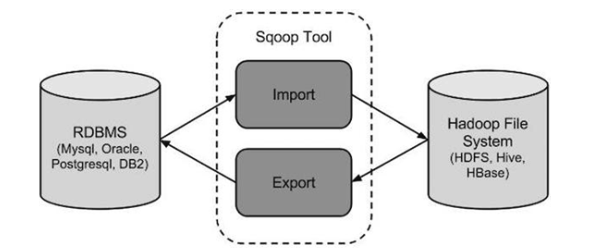

## Sqoop概述

Sqoop是一款开源的工具，主要用于在Hadoop(Hive)与传统的数据库(mysql、 postgresql等)间进行数据的传递。可以将关系型数据库(MySQL ,Oracle ,Postgres 等)中的数据导入到HDFS中，也可以将HDFS的数据导进到关系型数据库中。

Sqoop项目开始于2009年，最早是作为Hadoop的一个第三方模块存在，后来为了 让使用者能够快速部署，也为了让开发人员能够更快速的迭代开发，Sqoop独立成 为一个 Apache 项目。



将导入或导出命令转换为 MapReduce 程序来实现。翻译出的 MapReduce 中主要 是对 inputformat 和outputformat 进行定制。

## 安装配置

[Sqoop 官网](http://sqoop.apache.org/ )

[Sqoop下载地址](http://www.apache.org/dyn/closer.lua/sqoop/)

1、下载、上传并解压

将下载的安装包 sqoop-1.4.6.bin__hadoop-2.0.4-alpha.tar.gz 上传到虚拟机中; 解压缩软件包;

```shell
tar zxvf sqoop-1.4.7.bin__hadoop-2.6.0.tar.gz
mv sqoop-1.4.7.bin__hadoop-2.6.0/ ../servers/sqoop-1.4.7/
```

2、增加环境变量，并使其生效

```shell
vi /etc/profile

# 增加以下内容
export SQOOP_HOME=/opt/lagou/servers/sqoop-1.4.7
export PATH=$PATH:$SQOOP_HOME/bin

source /etc/profile
```

3、创建、修改配置文件

```shell
# 配置文件位置 $SQOOP_HOME/conf;要修改的配置文件为 sqoop-env.sh 
cp sqoop-env-template.sh sqoop-env.sh

vi sqoop-env.sh
# 在文件最后增加以下内容
export HADOOP_COMMON_HOME=/opt/lagou/servers/hadoop-2.9.2 
export HADOOP_MAPRED_HOME=/opt/lagou/servers/hadoop-2.9.2 
export HIVE_HOME=/opt/lagou/servers/hive-2.3.7
```

4、拷贝JDBC驱动程序

```shell
# 拷贝jdbc驱动到sqoop的lib目录下(备注:建立软链接也可以),该方式为软连接
ln -s /opt/lagou/servers/hive-2.3.7/lib/mysql-connector-java-5.1.46.jar /opt/lagou/servers/sqoop-1.4.7/lib/
```

5、拷贝 jar

将 $HIVE_HOME/lib 下的 hive-common-2.3.7.jar，拷贝到 $SQOOP_HOME/lib目录下。如不拷贝在MySQL往Hive导数据的时候将会出现 错误:ClassNotFoundException: org.apache.hadoop.hive.conf.HiveConf

```shell
# 硬拷贝 和 建立软链接都可以，选择一个执行即可。下面是硬拷贝
cp $HIVE_HOME/lib/hive-common-2.3.7.jar $SQOOP_HOME/lib/
# 建立软链接
ln -s /opt/lagou/servers/hive-2.3.7/lib/hive-common-2.3.7.jar /opt/lagou/servers/sqoop-1.4.7/lib/hive-common-2.3.7.jar
```

将 $HADOOP_HOME/share/hadoop/tools/lib/json-20170516.jar 拷贝到 $SQOOP_HOME/lib/ 目录下;否则在创建sqoop job时会报: java.lang.NoClassDefFoundError: org/json/JSONObject

```shell
cp $HADOOP_HOME/share/hadoop/tools/lib/json-20170516.jar $SQOOP_HOME/lib/
```

6、安装验证

```shell
sqoop version 省略了警告 ... ...
20/06/19 10:37:24 INFO sqoop.Sqoop: Running Sqoop version: 1.4.7 Sqoop 1.4.7
git commit id 2328971411f57f0cb683dfb79d19d4d19d185dd8
Compiled by maugli on Thu Dec 21 15:59:58 STD 2017
# 测试Sqoop是否能够成功连接数据库
sqoop list-databases --connect jdbc:mysql://linux123:3306/?useSSL=false --username hive --password 12345678
... ...
information_schema
hivemetadata
mysql
performance_schema
sys
```

## 应用案例

在Sqoop中

* 导入是指:从关系型数据库向大数据集群(HDFS、HIVE、HBASE)传输数据; 使用import关键字;
* 导出是指:从 大数据集群 向 关系型数据库 传输数据;使用export关键字;


#### **测试数据脚本**

```sql
-- 用于在 Mysql 中生成测试数据 
CREATE DATABASE sqoop;
use sqoop;
CREATE TABLE sqoop.goodtbl( 
  gname varchar(50),
  serialNumber int,
  price int,
  stock_number int,
  create_time date
);
DROP FUNCTION IF EXISTS `rand_string`;
DROP PROCEDURE IF EXISTS `batchInsertTestData`;
-- 替换语句默认的执行符号，将;替换成 // 
DELIMITER //
CREATE FUNCTION `rand_string` (n INT) RETURNS VARCHAR(255) CHARSET 'utf8'
BEGIN
    DECLARE char_str varchar(200) DEFAULT
'0123456789ABCDEFGHIJKLMNOPQRSTUVWXYZ';
    DECLARE return_str varchar(255) DEFAULT '';
    DECLARE i INT DEFAULT 0;
    WHILE i < n DO
        SET return_str = concat(return_str, substring(char_str,
FLOOR(1 + RAND()*36), 1));
        SET i = i+1;
    END WHILE;
    RETURN return_str;
END

//
-- 第一个参数表示:序号从几开始;第二个参数表示:插入多少条记录 
CREATE PROCEDURE `batchInsertTestData` (m INT, n INT) BEGIN
    DECLARE i INT DEFAULT 0;
    WHILE i < n DO
        insert into goodtbl (gname, serialNumber, price,
stock_number, create_time)
        values (rand_string(6), i+m, ROUND(RAND()*100),
FLOOR(RAND()*100), now());
        SET i = i+1;
    END WHILE;
END 
//
delimiter ;


call batchInsertTestData(1, 100);
```

以下案例需要启动:HDFS、YARN、MySQL 对应的服务;


#### 导入数据

**MySQL到 HDFS**

###### 导入全部数据

```
sqoop import \
--connect jdbc:mysql://linux123:3306/sqoop \
--username hive \
--password 12345678 \
--table goodtbl \
--target-dir /sqoop \
--delete-target-dir \
--num-mappers 1 \
--fields-terminated-by "\t"
```

备注:

* target-dir:将数据导入 HDFS 的路径;
* delete-target-dir:如果目标文件夹在 HDFS 上已经存在，那么再次运行就会报 错。可以使用--delete-target-dir来先删除目录。也可以使用 append 参数，表 示追加数据;
*  num-mappers:启动多少个Map Task;默认启动4个Map Task;也可以写成 -m 1
* fields-terminated-by:HDFS文件中数据的分隔符;

###### 导入查询数据

```
sqoop import \
--connect jdbc:mysql://linux123:3306/sqoop \
--username hive \
--password 12345678 \
--target-dir /sqoop/2 \
--append \
--m 1 \
--fields-terminated-by "\t" \
--query 'select * from goodtbl where price>88 and $CONDITIONS;'
```

备注:

* 查询语句的where子句中必须包含 '$CONDITIONS' 
* 如果query后使用的是双引号，则$CONDITIONS前必须加转义符，防止shell识 别为自己的变量

###### 导入指定的列

```
sqoop import \
--connect jdbc:mysql://linux123:3306/sqoop \
--username hive \
--password 12345678 \
--table goodtbl \
--columns gname,price,stock_number \
--target-dir /sqoop/3 \
--append \
--m 1 \
--fields-terminated-by "\t" 
```

**备注:columns如果涉及到多列，用逗号分隔，不能添加空格**


###### 导入查询的数据（使用关键字）

```
sqoop import \
--connect jdbc:mysql://linux123:3306/sqoop \
--username hive \
--password 12345678 \
--table goodtbl \
--where "price>=66" \
--target-dir /sqoop/4 \
--append \
--m 1 \
--fields-terminated-by "\t" 
```

###### 启动多个MapTask导入数据

```
-- 第一种
sqoop import \
--connect jdbc:mysql://linux123:3306/sqoop \
--username hive \
--password 12345678 \
--table goodtbl \
--target-dir /sqoop/5 \
--append \
--fields-terminated-by "," \
--split-by serialNumber


# 分区字段是字符类型，使用 sqoop 命令的时候要添加
sqoop import -Dorg.apache.sqoop.splitter.allow_text_splitter=true \
--connect jdbc:mysql://linux123:3306/sqoop \
--username hive \
--password 12345678 \
--table goodtbl \
--target-dir /sqoop/6 \
--append \
--fields-terminated-by "," \
--split-by gname
```

备注:

* 使用多个 Map Task 进行数据导入时，sqoop 要对每个Task的数据进行分区 
  * 如果 MySQL 中的表有主键，指定 Map Task 的个数就行,默认是4个
  * 如果 MySQL 中的表有主键，要使用 split-by 指定分区字段
  * 如果分区字段是字符类型，使用 sqoop 命令的时候要添加:- Dorg.apache.sqoop.splitter.allow_text_splitter=true。即

```
sqoop import -Dorg.apache.sqoop.splitter.allow_text_splitter=true \ --connect jdbc:mysql://liunx:3306/sqoop \
... ...
```

* 查询语句的where子句中的 '$CONDITIONS' ，也是为了做数据分区使用的，即 使只有1个Map Task

###### MySQL到Hive

在 hive 中创建表:

```sql
CREATE TABLE mydb.goodtb1(
gname string,
serialNumber int,
price int,
stock_number int,
create_time date
);
```

```
sqoop import \
--connect jdbc:mysql://linux123:3306/sqoop \
--username hive \
--password 12345678 \
--table goodtbl \
--hive-import \
--hive-database mydb \
--hive-table goodtb1 \
--hive-overwrite \
--fields-terminated-by "\t" \
--split-by serialNumber \
-m 4
```

参数说明:

* hive-import。必须参数，指定导入hive 
* hive-database。Hive库名(缺省值default)
* hive-table。Hive表名
* fields-terminated-by。Hive字段分隔符
* hive-overwrite。覆盖中已经存在的数据
* create-hive-table。创建好 hive 表，但是表可能存在错误。不建议使用这个参数，建议提前建好表


问题：从mysql是否可以通过sqoop直接导出到hive的parquet存储格式。


```sql
CREATE TABLE mydb.goodtbl3(
gname string,
serialNumber int,
price int,
stock_number int,
create_time date
) stored as parquet;
```

```
sqoop import \
--connect jdbc:mysql://linux123:3306/sqoop \
--username hive \
--password 12345678 \
--table goodtb \
--hive-import \
--hive-database mydb \
--hive-table goodtbl3 \
--hive-overwrite \
--split-by serialNumber \
-m 4
```


#### 导出数据

######  全量数据导出

**Hive/HDFS到RDBMS**，**备注:MySQL表需要提前创建**

```
CREATE TABLE sqoop.goodtbl2(
  gname varchar(50),
  serialNumber int,
  price int,
  stock_number int,
  create_time date);


sqoop export \
--connect jdbc:mysql://linux123:3306/sqoop \
--username hive \
--password 12345678 \
--table goodtbl2 \
--m 1 \
--export-dir /user/hive/warehouse/mydb.db/goodtbl \
--input-fields-terminated-by "\t"

```

#### 增量数据导入

前面都是执行的全量数据导入。如果数据量很小，则采取完全源数据抽取;如果源 数据量很大，则需要抽取发生变化的数据，这种数据抽取模式叫做**变化数据捕获**， 简称CDC(Change Data Capture)。

CDC大体分为两种:侵入式和非侵入式。侵入式指CDC操作会给源系统带来性能影响，只要CDC操作以任何一种方式对源数据库执行了SQL操作，就认为是侵入式 的。

常用的4种CDC方法是(前三种是侵入式的):

* **基于时间戳的CDC**。抽取过程可以根据某些属性列来判断哪些数据是增量的，最常见的属性列有以下两种:
  * 时间戳:最好有两个列，一个插入时间戳，表示何时创建，一个更新时间戳，表示最后一次更新的时间;
  * 序列:大多数数据库都提供自增功能，表中的列定义成自增的，很容易地根 据该列识别新插入的数据;
  * 这种方法是最简单且常用的，但是有如下缺点:
    * 不能记录删除记录的操作
    * 无法识别多次更新
    * 不具有实时能力
* **基于触发器的CDC**。当执行INSERT、UPDATE、DELETE这些SQL语句时，激活 数据库里的触发器，使用触发器可捕获变更的数据，并把数据保存在中间临时 表里。然后这些变更数据再从临时表取出。大多数场合下，不允许向操作型数 据库里添加触发器，且这种方法会降低系统性能，基本不会被采用;
* **基于快照的CDC**。 可以通过比较源表和快照表来获得数据变化。基于快照的 CDC可以检测到插入、更新和删除的数据，这是相对于基于时间戳的CDC方案 的优点。其缺点是需要大量存储空间来保存快照。
* **基于日志的CDC**。最复杂的和没有侵入性的CDC方法是基于日志的方式。数据库会把每个插入、更新、删除操作记录到日志里。解析日志文件，就可以获取 相关信息。每个关系型数据库日志格式不一致，没有通用的产品。阿里巴巴的 canal可以完成MySQL日志文件解析。

Sqoop实现的是基于时间戳的CDC，增量导入数据分为两种方式:

* 基于递增列的增量数据导入(Append方式)
* 基于时间列的数据增量导入(LastModified方式)


###### Append方式

1、准备初始化数据

```
-- 删除 MySQL 表中的全部数据
truncate table sqoop.goodtbl;
-- 删除 Hive 表中的全部数据
truncate table mydb.goodtbl;
-- 向MySQL的表中插入100条数据
call batchInsertTestData(1, 100);
```

2、将数据导入Hive

```
sqoop import \
--connect jdbc:mysql://linux123:3306/sqoop \
--username hive \
--password 12345678 \
--table goodtbl \
--hive-import \
--hive-table mydb.goodtbl \
--incremental append \
--check-column serialNumber \
--last-value 0 \
-m 1
```

参数说明:

* check-column 用来指定一些列(即可以指定多个列)，这些列在增量导入时用 来检查这些数据是否作为增量数据进行导入，和关系型数据库中的自增字段及 时间戳类似。这些被指定的列的类型不能使任意字符类型，如char、varchar等 类型都不可以
* last-value 指定上一次导入中检查列指定字段最大值

3、检查hive表中是否有数据，有多少条数据

4、再向MySQL中加入1000条数据，编号从200开始

```
call batchInsertTestData(200, 1000);
```

5、再次执行增量导入，将数据从 MySQL 导入 Hive 中;此时要将 last-value 改为 100

```
sqoop import \
--connect jdbc:mysql://linux123:3306/sqoop \
--username hive \
--password 12345678 \
--table goodtbl \
--hive-import \
--hive-table mydb.goodtbl \
--incremental append \
--check-column serialNumber \
--last-value 100 \
-m 1
```

6、再检查hive表中是否有数据，有多少条数据

#### 执行Job

执行数据增量导入有两种实现方式:

1. 每次手工配置last-value，手工调度
2. 使用job，给定初始last-value，定时任务每天定时调度

很明显方式2更简便。

1、创建口令文件

```shell
# 在当前目录创建一个文件，里面保存信息为12345678
echo -n "12345678" > sqoopPWD.pwd
# 在HDFS上创建目录
hdfs dfs -mkdir -p /sqoop/pwd
# 将刚才创建的目录放到HDFS中
hdfs dfs -put sqoopPWD.pwd /sqoop/pwd
# 改变权限
hdfs dfs -chmod 400 /sqoop/pwd/sqoopPWD.pwd
# 可以在 sqoop 的 job 中增加: 
--password-file /sqoop/pwd/sqoopPWD.pwd
```

2、创建 sqoop job

```shell
# 创建 sqoop job
sqoop job --create myjob1 -- import \
--connect jdbc:mysql://linux123:3306/sqoop \
--username hive \
--password-file /sqoop/pwd/sqoopPWD.pwd \
--table goodtbl \
--hive-import \
--hive-table mydb.goodtbl \
--incremental append \
--check-column serialNumber \
--last-value 0 \
-m 1
# 查看已创建的job 
sqoop job --list
# 查看job详细运行是参数 
sqoop job --show myjob1
# 执行job
sqoop job --exec myjob1
# 删除job
sqoop job --delete myjob1
```

3、执行job

```
sqoop job -exec myjob1
```

4、查看数据

**实现原理**

因为job执行完成后，会把当前check-column的最大值记录到meta中，下次再调起 时把此值赋给last-value。缺省情况下元数据保存在 ~/.sqoop/，其中，metastore.db.script 文件记录了对last-value的更新操作:

## 常用命令及参数

#### 常用命令

| 序号 | 命令              | 类                  | 说明                                                         |
| ---- | ----------------- | ------------------- | ------------------------------------------------------------ |
| 1    | import            | ImportTool          | 见数据导入到集群                                             |
| 2    | export            | ExportTool          | 将集群数据导出                                               |
| 3    | codegen           | CodeGenTool         | 获取数据库中某张数据生成Java并打包jar                        |
| 4    | create-hive-table | CreateHiveTableTool | 创建hive                                                     |
| 5    | eval              | EvalSqlTool         | 查看SQL执行结果                                              |
| 6    | import-all-tables | ImportAllTablesTool | 导入某个数据库下所有表到HDFS                                 |
| 7    | job               | JobTool             | 用来生成一个sqoop的任务，生成后，该任务并不执行，除非使用命令执行该任务 |
| 8    | list-databases    | ListDatabasesTool   | 列出所有数据库名                                             |
| 9    | list-tables       | ListTablesTool      | 列出所有某个数据库下所有表名                                 |
| 10   | merge             | MergeTool           | 将HDFS中不同目录下面的数据合并在一起，并存放在指定目录中。   |
| 11   | metastore         | MetastoreTool       | 记录sqoop job的元数据信息，如果不启动metastore实例，则默认的元数据存储目录为：~/.sqoop,如果要更改存储目录，可以在配置文件sqoop-site.xml中进行修改 |
| 12   | help              | HelpTool            | 打印sqoop帮助信息                                            |
| 13   | Version           | VersionTool         | 打印sqoop版本信息                                            |

#### 常用参数

所谓公用参数，就是大多数命令都支持的参数。

###### 公共参数-数据库连接

| 序号 | 参数                 | 说明                   |
| ---- | -------------------- | ---------------------- |
| 1    | --connect            | 链接关系型数据库的url  |
| 2    | --connection-manager | 指定要使用的链接管理类 |
| 3    | --driver             | Hadoop根目录           |
| 4    | --help               | 打印帮助信息           |
| 5    | --password           | 链接数据库的密码       |
| 6    | --username           | 链接数据库的用户名     |
| 7    | --verbose            | 在控制台打印出详细信息 |

###### 公共参数-import

| 序号 | 参数                     | 说明                                                         |
| ---- | ------------------------ | ------------------------------------------------------------ |
| 1    | --enclosed-by            | 给字段值前加上指定的字符                                     |
| 2    | --excaped-by             | 对字段中的双引号加转义符                                     |
| 3    | --fields-terminated-by   | 设定每个字段十一什么符号为结束，默认是逗号                   |
| 4    | --lines-terminated-by    | 设定每行记录之间的分隔符，默认是\n                           |
| 5    | --mysql-delimiters       | Mysql默认的分隔符设置，字段之间以逗号分隔，行之间 以\n分隔，默认转义符是\，字段值以单引号包裹 |
| 6    | --optionally-enclosed-by | 给带有双引号或单引号的字段值前后加上指定字符                 |

###### 公共参数-export

| 序号 | 参数                           | 说明                                       |
| ---- | ------------------------------ | ------------------------------------------ |
| 1    | --input-enclosed-by            | 对字段值前后加上指定字符                   |
| 2    | --input-excaped-by             | 对含有转义符做转义处理                     |
| 3    | --input-fields-terminated-by   | 字段之间的分隔符                           |
| 4    | --input-lines-terminated-by    | 行之间的分隔符                             |
| 5    | --input-optionally-enclosed-by | 给带有双引号或单引号的字段前后加上指定字符 |

###### 公共参数-hive

| 序号 | 参数                      | 说明                                                       |
| ---- | ------------------------- | ---------------------------------------------------------- |
| 1    | --hive-delims-replacement | 用自定义的字符串替换掉数据中的\r\n和\013 \010等字符        |
| 2    | --hive-drop-import-delims | 在导入数据到hive时，去掉数据中的 \r\n\013\010这样的字符    |
| 3    | --map-column-hive         | 生成hive表时，可以更改生成字段的数据类型                   |
| 4    | --hive-partition-key      | 创建分区，后面直接跟分区名，分区字段的默认 类型为string    |
| 5    | --hive-partition- value   | 导入数据时，指定某个分区的值                               |
| 6    | --hive-home               | hive的安装目录，可以通过该参数覆盖之前默认 配置的目录      |
| 7    | --hive-import             | 将数据从关系数据库中导入到hive表中                         |
| 8    | --hive-overwrite          | 覆盖掉在hive表中已经存在的数据                             |
| 9    | --create-hive-table       | 默认是false，即，如果目标表已经存在了，那么 创建任务失败。 |
| 10   | --hive-table              | 后面接要创建的hive表,默认使用MySQL的表名                   |
| 11   | --table                   | 指定关系数据库的表名                                       |

###### import参数

| 序号 | 参数                         | 说明                                                         |
| ---- | ---------------------------- | ------------------------------------------------------------ |
| 1    | --append                     | 将数据追加到HDFS中已经存在的DataSet中，如 果使用该参数，sqoop会把数据先导入到临时文 件目录，再合并。 |
| 2    | --as- avrodatafile           | 将数据导入到一个Avro数据文件中                               |
| 3    | --as- sequencefile           | 将数据导入到一个sequence文件中                               |
| 4    | --as-textfile                | 将数据导入到一个普通文本文件中                               |
| 5    | --boundary- query            | 边界查询，导入的数据为该参数的值(一条sql语 句)所执行的结果区间内的数据。 |
| 6    | --columns <col1, col2, col3> | 指定要导入的字段                                             |
| 7    | --direct                     | 直接导入模式，使用的是关系数据库自带的导入 导出工具，以便加快导入导出过程。 |
| 8    | --direct-split- size         | 在使用上面direct直接导入的基础上，对导入的流 按字节分块，即达到该阈值就产生一个新的文件 |
| 9    | --inline-lob- limit          | 设定大对象数据类型的最大值                                   |
| 10   | --m或–num- mappers           | 启动N个map来并行导入数据，默认4个。                          |
| 11   | --query或--e                 | 将查询结果的数据导入，使用时必须伴随参-- target-dir，--hive-table，如果查询中有where条 件，则条件后必须加上$CONDITIONS关键字 |
| 12   | --split-by                   | 按照某一列来切分表的工作单元，不能与-- autoreset-to-one-mapper连用(请参考官方文档) |
| 13   | --table                      | 关系数据库的表名                                             |
| 14   | --target-dir                 | 指定HDFS路径                                                 |
| 15   | --warehouse- dir             | 与14参数不能同时使用，导入数据到HDFS时指定 的目录            |
| 16   | --where                      | 从关系数据库导入数据时的查询条件                             |
| 17   | --z或-- compress             | 允许压缩                                                     |
| 18   | --compression- codec         | 指定hadoop压缩编码类，默认为gzip(Use Hadoop codec default gzip) |
| 19   | --null-string                | string类型的列如果null，替换为指定字符串                     |
| 20   | --null-non- string           | 非string类型的列如果null，替换为指定字符串                   |
| 21   | --check- column              | 作为增 量导入 判断的 列名                                    |
| 22   | --incremental                | mode:append或lastmodified                                    |
| 23   | --last-value                 | 指定某一个值，用于标记增量导入的位置                         |

###### export参数

| 1    |                           |                                                              |
| ---- | ------------------------- | ------------------------------------------------------------ |
| 1    | --direct                  | 利用数据库自带的导入导出工具，以便于提高效率                 |
| 2    | --export- dir             | 存放数据的HDFS的源目录                                       |
| 3    | -m或-- num- mappers       | 启动N个map来并行导入数据，默认4个                            |
| 4    | --table                   | 指定导出到哪个RDBMS中的表                                    |
| 5    | --update- key             | 对某一列的字段进行更新操作                                   |
| 6    | --update- mode            | updateonly allowinsert(默认)                                 |
| 7    | --input- null-string      | 请参考import该类似参数说明                                   |
| 8    | --input- null-non- string | 请参考import该类似参数说明                                   |
| 9    | --staging- table          | 创建一张临时表，用于存放所有事务的结果，然后将所有 事务结果一次性导入到目标表中，防止错误。 |
| 10   | --clear- staging- table   | 如果第9个参数非空，则可以在导出操作执行前，清空临 时事务结果表 |


