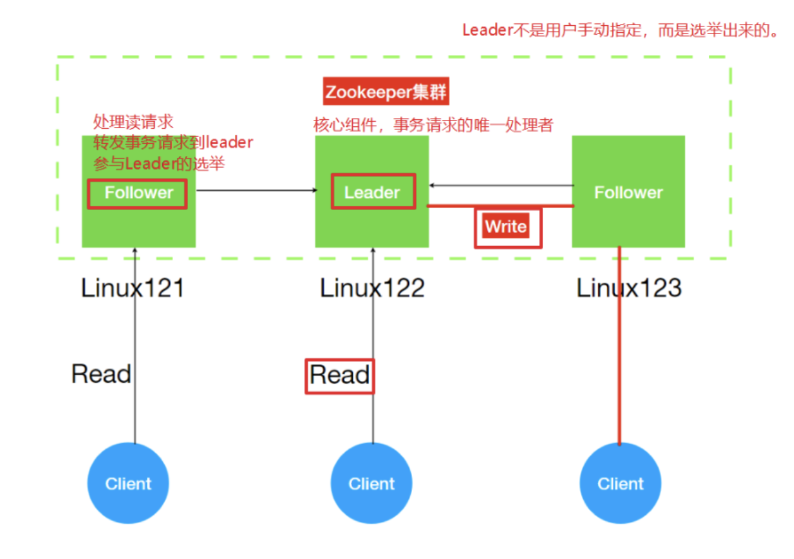

## Zookeeper 简介

#### Zookeeper是什么？

Zookeeper 是一个分布式协调服务的开源框架。 主要⽤来解决分布式集群中应用系统的一致性问题， 例如怎样避免同时操作同一数据造成脏读的问题。分布式系统中数据存在一致性的问题!!

* **ZooKeeper** 本质上是一个分布式的小文件存储系统。 提供基于类似于文件系统的⽬录树方式的数据存储，并且可以对树中的节点进行有效管理理。
*  **ZooKeeper** 提供给客户端监控存储在**zk**内部数据的功能，从⽽可以达到基于数据的集群管理。 诸如: 统一命名服务(dubbo)、分布式配置管理(solr的配置集中管理)、分布式消息队列 (sub/pub)、分布式锁、分布式协调等功能。

#### Zookeeper的架构组成



* Leader:
  * 核心角色
  * 各个服务的调度者
  * 事务请求（写操作）的唯一调度和处理者，保证集群事务的顺序性；
* Follower
  * 处理读请求
  * 转发事务给Leader
  * 参与Leader的选举
* Observer（一般很少被使用）
  * 处理读请求，转发事务给Leader，增加集群的并发读请求
  * 不参加Leader的选举

#### Zookeeper特点

1. Zookeeper:一个领导者(leader:⽼大)，多个跟随者(follower:小弟)组成的集群。
2. Leader负责进行投票的发起和决议，更新系统状态(内部原理理)
3. Follower用于接收客户请求并向客户端返回结果，在选举Leader过程中参与投票
4. 集群中只要有**半数以上节点存活**，Zookeeper集群就能正常服务。
5. 全局数据⼀致:每个server保存一份相同的数据副本，Client⽆论连接到哪个server，数据都是一 致的。
6. 更新请求顺序进行(内部原理)
7. 数据更新原⼦性，一次数据更新要么成功，要么失败。


## Zookeeper环境搭建

#### 搭建方式

* 单机
* 伪集群
* 集群

#### 集群搭建


解压缩

```
tar -zxvf zookeeper-3.4.14.tar.gz -C ../servers/
```

修改配置⽂文件创建data与log⽬目录


```xml
 
#创建zk存储数据⽬目录
mkdir -p /opt/lagou/servers/zookeeper-3.4.14/data 
#创建zk⽇日志⽂文件⽬目录
mkdir -p /opt/lagou/servers/zookeeper-3.4.14/data/logs 
#修改zk配置⽂文件
cd /opt/lagou/servers/zookeeper-3.4.14/conf
#文件改名
mv zoo_sample.cfg zoo.cfg

vim zoo.cfg

#更新datadir
dataDir=/opt/lagou/servers/zookeeper-3.4.14/data
#增加logdir
dataLogDir=/opt/lagou/servers/zookeeper-3.4.14/data/logs
#增加集群配置 
##server.服务器ID=服务器IP地址:服务器之间通信端口:服务器之间投票选举端口
server.1=linux121:2888:3888
server.2=linux122:2888:3888
server.3=linux123:2888:3888
#打开注释 
#ZK提供了了⾃动清理事务日志和快照⽂件的功能，这个参数指定了清理频率，单位是⼩时 autopurge.purgeInterval=1
```

配置myid，在zookeeper的 data⽬录下创建⼀个myid文件，内容为1，这个文件就是记录每个服务器的ID

```
 cd /opt/lagou/servers/zookeeper-3.4.14/data
 echo 1 > myid
```

安装包分发并修改myid的值

```
rsync-script /opt/lagou/servers/zookeeper-3.4.14
```

修改myid值 linux122

 ```
echo 2 >/opt/lagou/servers/zookeeper-3.4.14/data/myid
 ```

修改myid值 linux123

```
echo 3 >/opt/lagou/servers/zookeeper-3.4.14/data/myid
```

依次启动三个zk实例例,启动命令(三个节点都要执⾏行行)

```
/opt/lagou/servers/zookeeper-3.4.14/bin/zkServer.sh start 
```

查看zk启动情况

```
/opt/lagou/servers/zookeeper-3.4.14/bin/zkServer.sh status
```

集群启动停⽌止脚本

```
vim zk.sh


#!/bin/sh
echo "start zookeeper server..."
if(($#==0));then
echo "no params";
exit;
fi
hosts="linux121 linux122 linux123"
for host in $hosts
do
ssh $host "source /etc/profile; /opt/lagou/servers/zookeeper-3.4.14/bin/zkServer.sh $1"
done
```


