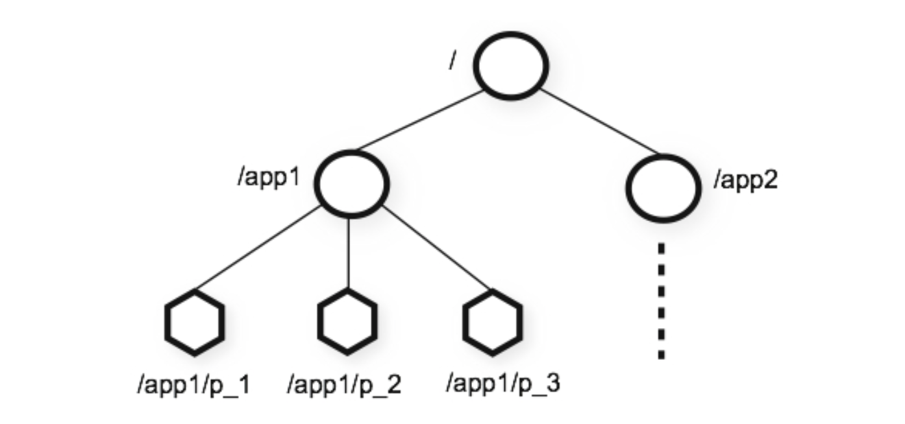
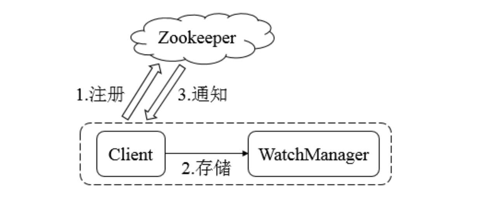

## Zookeeper数据结构与监听机制

#### ZooKeeper数据模型Znode

在ZooKeeper中，数据信息被保存在⼀个数据节点上，这些节点被称为znode。ZNode 是 Zookeeper 中最小数据单位，在 ZNode 下⾯又可以再挂 ZNode，这样⼀层下去就形成了一个层次化命名空间 ZNode 树，我们称为 ZNode Tree，它采⽤了类似⽂件系统的层级树状结构进行管理。⻅下图示例:



在 Zookeeper 中，每一个数据节点都是⼀个 ZNode，上图根⽬录下有两个节点，分别是:app1 和 app2，其中 app1 下面又有三个⼦节点,所有ZNode按层次化进⾏组织，形成这么一颗树，ZNode的节点路径标识⽅式和Unix文件系统路径⾮常相似，都是由⼀系列使用斜杠(/)进行分割的路径表示，开发人员可以向这个节点写入数据，也可以在这个节点下面创建⼦节点。

#### ZNode的类型

三大类

* 持久性节点(Persistent)
* 临时性节点(Ephemeral)
* 顺序性节点(Sequential)


创建节点可以生成以下四种节点类型:持久节点、持久顺序节点、临时节点、临时顺序节点。不同类型的节点则会有不同的生命周期。

* 持久节点：是Zookeeper中最常见的⼀种节点类型，所谓持久节点，就是指节点被创建后会⼀直存在服务器，直到删除操作主动清除
* 持久顺序节点：就是有顺序的持久节点，节点特性和持久节点是一样的，只是额外特性表现在顺序上。 顺序特性实质是在创建节点的时候，会在节点名后⾯加上一个数字后缀，来表示其顺序。
* 临时节点：就是会被⾃动清理掉的节点，它的生命周期和客户端会话绑在一起，客户端会话结束，节点会被删除掉。与持久性节点不同的是，临时节点不能创建子节点。
* 临时顺序节点：就是有顺序的临时节点，和持久顺序节点相同，在其创建的时候会在名字后面加上数字后缀。

###### 事务ID

首先，先了解，事务是对物理和抽象的应用状态上的操作集合。往往在现在的概念中，􏰁狭义上的事务通常指的是数据库事务，⼀般包含了一系列对数据库有序的读写操作，这些数据库事务具有所谓的ACID特性，即原子性(Atomic)、一致性(Consistency)、隔离性(Isolation)和持久性(Durability)。

⽽在ZooKeeper中，事务是指能够改变ZooKeeper服务器状态的操作，我们也称之为事务操作或更新操作，⼀般包括数据节点创建与删除、数据节点内容更新等操作。对于每⼀个事务请求，ZooKeeper都会为其分配一个全局唯一的事务ID，⽤用**ZXID**来表示，通常是一个 64 位的数字。每一个 ZXID对应⼀次更新操作，从这些ZXID中可以间接地识别出ZooKeeper处理这些更新操作请求的全局顺序

zk中的事务指的是对zk服务器状态改变的操作(create,update data,更新字节点);zk对这些事务操作都会编号，这个编号是自增长的被称为ZXID。

#### ZNode的状态信息

```
# 使用bin/zkCli.sh 连接到zk集群
get /zookeeper

## 第一行返回空

cZxid = 0x0
ctime = Wed Dec 31 19:00:00 EST 1969 mZxid = 0x0
mtime = Wed Dec 31 19:00:00 EST 1969 pZxid = 0x0
cversion = -1
dataVersion = 0
aclVersion = 0
ephemeralOwner = 0x0
dataLength = 0
numChildren = 1
```

整个ZNode节点内容包括两部分:节点数据内容和节点状态信息。数据内容是空，其他的属于状态信息。那么这些状态信息都有什么含义呢?

* cZxid 就是 Create ZXID，表示节点被创建时的事务ID。
* ctime 就是 Create Time，表示节点创建时间。
* mZxid 就是 Modified ZXID，表示节点最后一次被修改时的事务ID。
* mtime 就是 Modified Time，表示节点最后⼀次被修改的时间。
*  pZxid 表示该节点的⼦子节点列列表最后一次被修改时的事务 ID。只有子节点列表变更才会更新 pZxid，子节点内容变更不会更新。
* cversion 表示⼦节点的版本号。
* dataVersion 表示内容版本号。
*  aclVersion 标识acl版本
*  ephemeralOwner 表示创建该临时节点时的会话 sessionID，如果是持久性节点那么值为 0 
* dataLength 表示数据⻓长度。
* numChildren 表示直系⼦子节点数。


#### Wacher机制

Zookeeper使用Watcher机制实现分布式数据的发布/订阅功能

一个典型的发布/订阅模型系统定义了一种一对多的订阅关系，能够让多个订阅者同时监听某一个主题对象，当这个主题对象⾃身状态变化时，会通知所有订阅者，使它们能够做出相应的处理理。

在 ZooKeeper 中，引⼊了 Watcher机制来实现这种分布式的通知功能。ZooKeeper允许客户端向服务端注册一个 Watcher 监听，当服务端的⼀些指定事件触发了这个Watcher，那么Zk就会向指定客户端发送一个事件通知来实现分布式的通知功能。

整个Watcher注册与通知过程如图所示。



Zookeeper的Watcher机制主要包括客户端线程、客户端WatcherManager、Zookeeper服务器三部分。

具体⼯工作流程为:

1. 客户端在向Zookeeper服务器注册的同时，会将Watcher对象存储在客户端的WatcherManager当中
2. 当Zookeeper服务器触发Watcher事件后，会向客户端发送通知
3. 客户端线程从WatcherManager中取出对应的Watcher对象来执⾏回调逻辑

## Zookeeper的基本使用


#### Zookeeper命令行操作

```
./zkcli.sh 连接本地的zookeeper服务器器
./zkCli.sh -server ip:port(2181) 连接指定的服务器器
```

链接上服务器后：

```
 help
 
ZooKeeper -server host:port cmd args
 	stat path [watch]
	set path data [version]
	ls path [watch]
	delquota [-n|-b] path
	ls2 path [watch]
	setAcl path acl
	setquota -n|-b val path history
	redo cmdno
	printwatches on|off
	delete path [version]
	sync path
	listquota path
	rmr path
	get path [watch]
	create [-s] [-e] path data acl addauth scheme auth
	quit
	getAcl path
	close
	connect host:port
```

###### 创建节点

```
 create [-s][-e] path data 
 其中，-s或-e分别指定节点特性，顺序或临时节点，若不指定，则创建持久节点
```

1. 创建永久顺序节点

```
create -s /zk-test 123
```

2. 创建临时节点

```
 create -e /zk-temp 123
 退出本次链接后，改节点自动删除
```

3. 创建永久节点

```
create /zk-permanent 123
```

4. 创建临时顺序节点

```
create -s -e /zk-permanent-test 123
退出本次链接后，改节点自动删除
```

###### 读取节点

展示路径信息：

```
ls /{path}
其中，{path}表示的是指定数据节点的节点路路径
```

get命令可以获取Zookeeper指定节点的数据内容和属性信息。

```
get path
```

###### 更新节点

```
set path data
data就是要更新的新内容
```

###### 删除节点

```
delete path
```

**若删除节点存在子节点，那么无法删除该节点，必须先删除子节点，再删除⽗节点**

#### Zookeeper-开源客户端

###### ZkClient
ZkClient是Github上一个开源的zookeeper客户端，在Zookeeper原⽣API接⼝之上进⾏了了包装，是⼀个更易用的Zookeeper客户端，同时，zkClient在内部还实现了了诸如Session超时重连、Watcher反复注册等功能.接下来，还是从创建会话、创建节点、读取数据、更新数据、删除节点等⽅面来介绍如何使用zkClient 这个zookeeper客户端

###### 添加依赖

```xml
<dependency>
  <groupId>org.apache.zookeeper</groupId>
  <artifactId>zookeeper</artifactId>
  <version>3.4.14</version>
</dependency>
<dependency>
  <groupId>com.101tec</groupId>
  <artifactId>zkclient</artifactId>
  <version>0.2</version>
</dependency>
```

###### 创建会话

```java
public class ZkDemo {

    public static void main(String[] args) {
        // 获取ZkClient对象，客户端与集群通信的端口是2181
        //建立了到ZK集群的会话
        ZkClient zkClient = new ZkClient("linux122:2181");
        System.err.println("zkClient is ready");
    }

}

```

 运行结果:ZooKeeper session created 。结果表明已经成功创建会话。

###### 创建节点

ZkClient提供了递归创建节点的接⼝，即其帮助开发者先完成父节点的创建，再创建⼦节点

```java
public class ZkCreateNode {
    public static void main(String[] args) {
        ZkClient zkClient = new ZkClient("linux122:2181");
        //副节点不存在，直接创建自节点，属于及联创建，createPersistent方法默认不及联创建
        zkClient.createPersistent("/lagouClient/lagou-c1", true);
        System.err.println("创建成功");
    }
}
```

###### 删除节点

```java
public class ZkDeleteNode {
    public static void main(String[] args) {
        ZkClient zkClient = new ZkClient("linux122:2181");
        //delete删除的方式，只能删除目录下没有子节点的目录
//        zkClient.delete("/hhb-test");

        //及联递归的删除，把要删除的目录下面的子节点全都删除。
        //是先删除子节点，在删除父节点
        zkClient.deleteRecursive("/lagouClient");
    }
}
```


