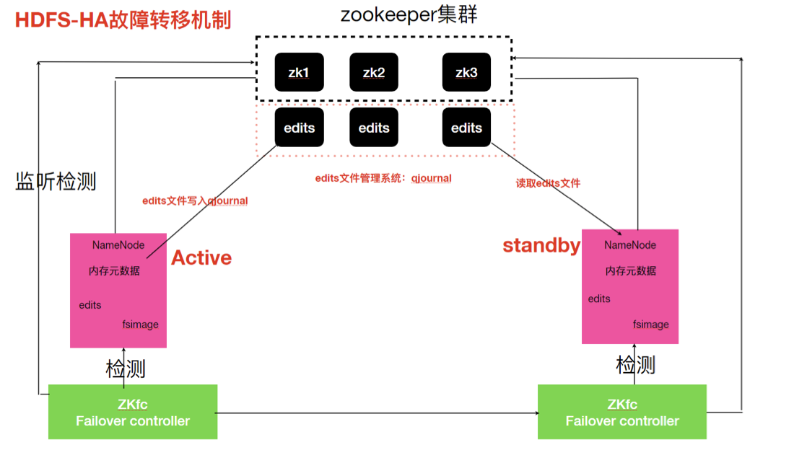
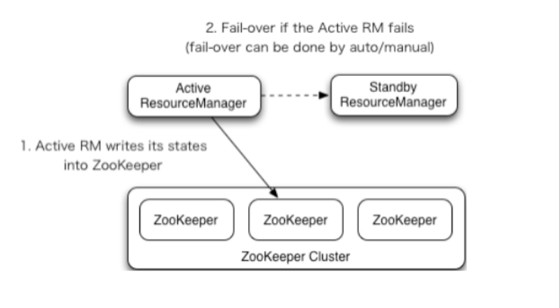

## Hadoop HA

#### HA概述

1. 所谓HA(High Available)，即⾼可用(7*24⼩小时不不中断服务)。
2. 实现⾼可用最关键的策略是消除单点故障。Hadoop-HA严格来说应该分成各个组件的HA机制:HDFS的HA和YARN的HA。
3. Hadoop2.0之前，在HDFS集群中NameNode存在单点故障(SPOF)。
4.  NameNode主要在以下两个方面影响HDFS集群
   1. NameNode机器发生意外，如宕机，集群将无法使用，直到管理员重启
   2. NameNode机器需要升级，包括软件、硬件升级，此时集群也将无法使用

HDFS HA功能通过配置Active/Standby两个NameNodes实现在集群中对NameNode的热备来解决上述 问题。如果出现故障，如机器崩溃或机器需要升级维护，这时可通过此种⽅式将NameNode很快的切换 到另外一台机器。

#### HDFS-HA工作机制

通过双NameNode消除单点故障(Active/Standby)

###### HDFS-HA工作要点

1. 元数据管理方式需要改变
   内存中各自保存一份元数据; Edits日志只有Active状态的NameNode节点可以做写操作，两个NameNode都可以读取Edits; 共享的Edits放在⼀个共享存储中管理(qjournal和NFS两个主流实现);

2. 需要一个状态管理功能模块

   实现了一个zkfailover，常驻在每一个namenode所在的节点，每一个zkfailover负责监控⾃己所在 NameNode节点，利用zk进行状态标识，当需要进行状态切换时，由zkfailover来负责切换，切换 时需要防止brain split（脑链）现象的发⽣生(集群中出现两个Active的Namenode)。

3. 必须保证两个NameNode之间能够ssh⽆密码登录

4. 隔离(Fence)，即同一时刻仅有一个NameNode对外提供服务

###### HDFS-HA工作机制

配置部署HDFS-HA进行自动故障转移。⾃动故障转移为HDFS部署增加了两个新组件:ZooKeeper和 ZKFailoverController(ZKFC)进程，ZooKeeper是维护少量协调数据，通知客户端这些数据的改变和监视客户端故障的⾼可用服务。HA的⾃动故障转移依赖于ZooKeeper的以下功能:

* 故障检测 

  集群中的每个NameNode在ZooKeeper中维护了一个临时会话，如果机器器崩溃，ZooKeeper中的会话将终⽌，ZooKeeper通知另一个NameNode需要触发故障转移。 

* 现役NameNode选择

  ZooKeeper提供了一个简单的机制⽤于唯一的选择一个节点为active状态。如果⽬前现役NameNode崩溃，另一个节点可能从ZooKeeper获得特殊的排外锁以表明它应该成为现役 NameNode。

ZKFC是⾃动故障转移中的另一个新组件，是ZooKeeper的客户端，也监视和管理NameNode的状态。 每个运⾏NameNode的主机也运⾏了⼀个ZKFC进程，ZKFC负责:

* 健康监测

  ZKFC使用一个健康检查命令定期地ping与之在相同主机的NameNode，只要该NameNode及时地回复健康状态，ZKFC认为该节点是健康的。如果该节点崩溃，冻结或进入不健康状态，健康监测器器标识该节点为⾮健康的。

* ZooKeeper会话管理

  当本地NameNode是健康的，ZKFC保持⼀个在ZooKeeper中打开的会话。如果本地NameNode处于active状态，ZKFC也保持⼀个特殊的znode锁，该锁使用了ZooKeeper对短暂节点的⽀持，如果会话终止，锁节点将自动删除。

* 基于ZooKeeper的选择

  如果本地NameNode是健康的，且ZKFC发现没有其它的节点当前持有znode锁，它将为⾃己获取 该锁。如果成功，则它已经赢得了选择，并负责运行故障转移进程以使它的本地NameNode为 Active。故障转移进程与前面描述的手动故障转移相似，首先如果必要保护之前的现役 NameNode，然后本地NameNode转换为Active状态。



#### HDFS-HA配置

[HDFS-HA配置官网](https://hadoop.apache.org/docs/stable/hadoop-project-dist/hadoop- hdfs/HDFSHighAvailabilityWithQJM.html)

###### 环境准备

1. 修改IP
2.  修改主机名及主机名和IP地址的映射 
3. 关闭防⽕火墙
4.  ssh免密登录

5. 安装JDK，配置环境变量量等

###### 集群规划

| Linux121    | Linux122    | Linux123    |
| ----------- | ----------- | ----------- |
| NameNode    | NameNode    |             |
| JournalNode | JournalNode | JournalNode |
| DataNode    | DataNode    | DataNode    |
| ZK          | ZK          | ZK          |

###### 启动ZK集群

```shell
zk.sh start
# 查看zk集群状态
zk.sh status
```

###### 配置HDFS-HA集群

1. 停止原先的HDFS集群

```
stop-dfs.sh
```

2. 在所有节点，/opt/lagou/servers⽬录下创建⼀个ha⽂件夹

```
  mkdir /opt/lagou/servers/ha
```

3.  将/opt/lagou/servers/目录下的 hadoop-2.9.2拷贝到ha⽬录下

```
cp -r hadoop-2.9.2 ha
```

4. 删除原集群data目录

```
rm -rf /opt/lagou/servers/ha/hadoop-2.9.2/data
```

5. 配置hdfs-site.xml

```xml
 
<property>
    <name>dfs.nameservices</name>
    <value>lagoucluster</value>
</property>
<property>
    <name>dfs.ha.namenodes.lagoucluster</name>
    <value>nn1,nn2</value>
</property>
<property>
    <name>dfs.namenode.rpc-address.lagoucluster.nn1</name>
    <value>linux121:9000</value>
</property>
<property>
    <name>dfs.namenode.rpc-address.lagoucluster.nn2</name>
    <value>linux122:9000</value>
</property>
<property>
    <name>dfs.namenode.http-address.lagoucluster.nn1</name>
    <value>linux121:50070</value>
</property>
<property>
    <name>dfs.namenode.http-address.lagoucluster.nn2</name>
    <value>linux122:50070</value>
</property>
<property>
    <name>dfs.namenode.shared.edits.dir</name>
    <value>qjournal://linux121:8485;linux122:8485;linux123:8485/lagou</value>
</property>
<property>
    <name>dfs.client.failover.proxy.provider.lagoucluster</name>
    <value>org.apache.hadoop.hdfs.server.namenode.ha.ConfiguredFailoverProxyProvider</value>
</property>
<property>
    <name>dfs.ha.fencing.methods</name>
    <value>sshfence</value>
</property>
<property>
    <name>dfs.ha.fencing.ssh.private-key-files</name>
    <value>/root/.ssh/id_rsa</value>
</property>
<property>
    <name>dfs.journalnode.edits.dir</name>
    <value>/opt/journalnode</value>
</property>
<property>
    <name>dfs.ha.automatic-failover.enabled</name>
    <value>true</value>
</property>
```

6. 配置core-site.xml

```
<property>
    <name>fs.defaultFS</name>
    <value>hdfs://lagoucluster</value>
</property>
<property>
    <name>hadoop.tmp.dir</name>
    <value>/opt/lagou/servers/ha/hadoop-2.9.2/data/tmp</value>
</property>
<property>
    <name>ha.zookeeper.quorum</name>
    <value>linux121:2181,linux122:2181,linux123:2181</value>
</property>
```

7. 拷贝配置好的hadoop环境到其他节点

```
rsync-script /opt/lagou/servers/ha/hadoop-2.9.2/
```

###### 启动HDFS-HA集群

1. 在各个JournalNode节点上，输⼊以下命令启动journalnode服务(去往HA安装目录，不要使用环境变量中命令)

```
/opt/lagou/servers/ha/hadoop-2.9.2/sbin/hadoop-daemon.sh start journalnode
```

2. 在[nn1]即linux121上，对其进行格式化，并启动

```
#只执行一次
/opt/lagou/servers/ha/hadoop-2.9.2/bin/hdfs namenode -format

# 启动NameNode
/opt/lagou/servers/ha/hadoop-2.9.2/sbin/hadoop-daemon.sh start namenode
```

3. 在[nn2]上，同步nn1的元数据信息

```
/opt/lagou/servers/ha/hadoop-2.9.2/bin/hdfs namenode -bootstrapStandby
```

4. 在[nn1]上初始化zkfc

```
/opt/lagou/servers/ha/hadoop-2.9.2/bin/hdfs zkfc -formatZK
```

5. 在[nn1]上，启动集群

```
 /opt/lagou/servers/ha/hadoop-2.9.2/sbin/start-dfs.sh
```

6. 验证

看看 http://linux122:50070/ 、 http://linux121:50070/ 两个NameNode的状态，是不是分别为：active和standby

杀掉active的NameNode，看看standby是否变为standby

#### Yarn-HA配置

###### Yarn-HA工作机制

[官方文档](https://hadoop.apache.org/docs/stable/hadoop-yarn/hadoop-yarn- site/ResourceManagerHA.html)



###### 配置YARN-HA集群

1. 环境准备

* 修改IP
* 修改主机名及主机名和IP地址的映射
* 关闭防⽕火墙
*  ssh免密登录
* 安装JDK，配置环境变量量等 
* 配置Zookeeper集群

2. 集群规划

| Linux121    | Linux122        | Linux123        |
| ----------- | --------------- | --------------- |
| NameNode    | NameNode        |                 |
| JournalNode | JournalNode     | JournalNode     |
| DataNode    | DataNode        | DataNode        |
| ZK          | ZK              | ZK              |
|             | ResourceManager | ResourceManager |
| NodeManager | NodeManager     | NodeManager     |

3. 配置yarn-site.xml

```xml
<property>
    <name>yarn.nodemanager.aux-services</name>
    <value>mapreduce_shuffle</value>
</property>
<!--启⽤用resourcemanager ha-->
<property>
    <name>yarn.resourcemanager.ha.enabled</name>
    <value>true</value>
</property>
<!--声明两台resourcemanager的地址-->
<property>
    <name>yarn.resourcemanager.cluster-id</name>
    <value>cluster-yarn</value>
</property>
<property>
    <name>yarn.resourcemanager.ha.rm-ids</name>
    <value>rm1,rm2</value>
</property>
<property>
    <name>yarn.resourcemanager.hostname.rm1</name>
    <value>linux122</value>
</property>
<property>
    <name>yarn.resourcemanager.hostname.rm2</name>
    <value>linux123</value>
</property>
<!--指定zookeeper集群的地址-->
<property>
    <name>yarn.resourcemanager.zk-address</name>
    <value>linux121:2181,linux122:2181,linux123:2181</value>
</property>
<!--启⽤用⾃自动恢复-->
<property>
    <name>yarn.resourcemanager.recovery.enabled</name>
    <value>true</value>
</property>
<!--指定resourcemanager的状态信息存储在zookeeper集群-->
<property>
    <name>yarn.resourcemanager.store.class</name>
   <value>org.apache.hadoop.yarn.server.resourcemanager.recovery.ZKRMStateStore</value>
</property>
```

4. 同步到其他节点

```
rsync-script yarn-site.xml
```

5. 启动hdfs,在linux123上执行

```
 /opt/lagou/servers/ha/hadoop-2.9.2/sbin/start-yarn.sh
```

6. 单独启动另一个RM，在linux122上执行

```
/opt/lagou/servers/ha/hadoop-2.9.2/sbin/yarn-daemon.sh start resourcemanager
```

7. 验证

同HDFS-YA同理


