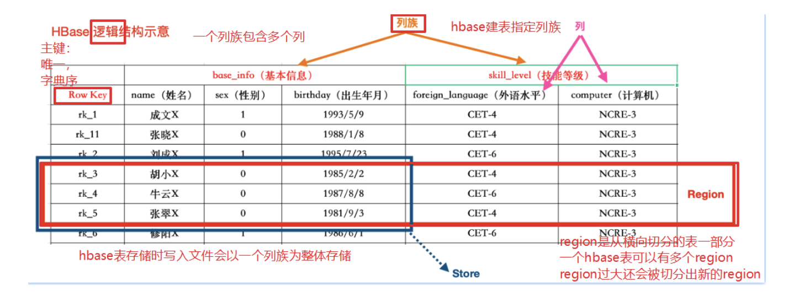
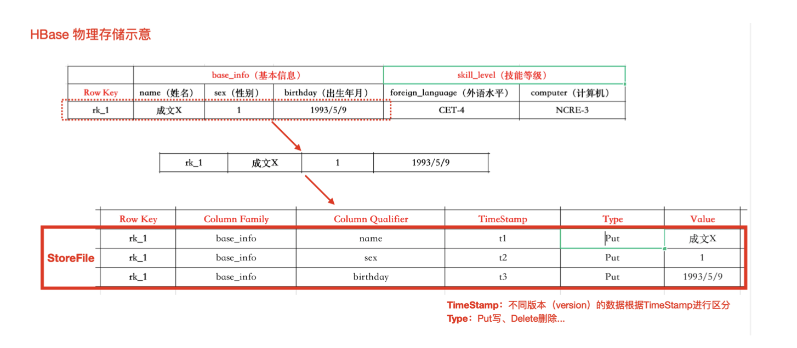
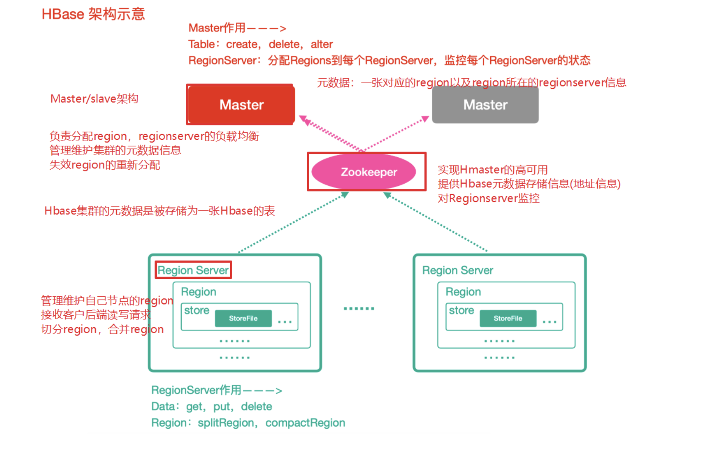

## HBase简介

#### HBase是什么？

HBase是基于Google的BigTable而来，是**一个分布式海量列式非关系型数据库系统，可以提供超大规模数据集的实时随机读写**

列式存储的有点：

1. 减少存储空间，行存储的时候，没有值的字段也会占用空间。
2. 支持好多列

#### HBase特点

* 海量存储： 底层基于HDFS存储海量数据
* 列式存储：HBase表的数据是基于列族进行存储，一个列族包含多个列
* 极易拓展：底层依赖HDFS，当磁盘空间不足的时候，只需要动态增加DataNode服务节点就可以
* 高并发：支持高并发的读写请求。
* 稀疏：稀疏主要是针对HBase列的灵活性，在列族中，你可以指定任意多的列，在列数据为空的情况下，是不会占有存储空间的。
* 数据的多版本：HBase表中的数据可以有多个版本值，默认情况是根本版本号进行区分，版本号就是插入数据的时间戳。
* 数据类型单一：所有的数据在HBase中是以字节数组进行存储。

#### HBase的数据模型

HBase的数据也是以表（有行有列）的形式存储。

###### HBase逻辑架构



HBase物理存储



| 概念                    | 描述                                                         |
| ----------------------- | ------------------------------------------------------------ |
| namespace（类似数据库） | 命名空间，类似于关系型数据库的database概念，每个命名空间下有多个表。HBase两个⾃带的命名空间，分别是hbase和default，hbase中存放的是HBase内置的表，default表是用户默认使⽤的命名空间。一个表可以自由选择是否有命名空间，如果创建表的时候加上了命名空间后，这个表名字以:作为区分! |
| table                   | 类似于关系型数据库的表概念。不同的是，HBase定义表时只需要声明列族即可，数据属性，比如超时时间(TTL)，压缩算法 (COMPRESSION)等，都在列族的定义中定义，不需要声明具体的列。 |
| row（一行逻辑数据）     | HBase表中的每行数据都由⼀个RowKey和多个Column(列)组成。一个行包含了多个列，这些列通过列族来分类,行中的数据所属列族只能从该表所定义的列族中选取,不能定义这个表中不存在的列族，否则报错NoSuchColumnFamilyException。 |
| rowkey（相当于主键）    | Rowkey由用户指定的⼀串不重复的字符串定义，是一行的**唯一标识**!数据是按照RowKey的**字典顺序**存储的，并且查询数据时只能根据RowKey进行检索，所以RowKey的设计⼗分重要。如果使⽤了之前已经定义的RowKey，那么会将之前的数据更新掉! |
| columnFamily            | 列族是多个列的集合。⼀个列族可以动态地灵活定义多个列。表的相关属性大部分都定义在列族上，同一个表里的不同列族可以有完全不同的属性配置，但是同一个列族内的所有列都会有相同的属性。列族存在的意义是HBase会把相同列族的列尽量放在同⼀台机器器上，所以说，如果想让某⼏个列被放到一起，你就给他们定义相同的列族。 |
| Colomn Qualifer         | Hbase中的列是可以随意定义的，⼀个行中的列不限名字、不限数量，只限定列族。因此列必须依赖于列族存在!列的名称前必须带着其所属的列族!例如info:name，info:age |
| TimeStamp               | ⽤于标识数据的不同版本(version)。时间戳默认由系统指定，也可以由⽤户显式指定。在读取单元格的数据时，版本号可以省略，如果不指定，Hbase默认会获取最后一个版本的数据返回! |
| cell                    | 一个列中可以存储多个版本的数据。而每个版本就称为⼀个单元格(Cell)。 |
| Region                  | Region由一个表的若⼲行组成!在Region中行的排序按照⾏键(rowkey)字典排序。Region不能跨RegionSever，且当数据量大的时候，HBase会拆分Region。 |

#### HBase整体架构




###### Zookeeper

* 实现了HMaster的高可用 
  * 保存了HBase的元数据信息（地址信息），是所有HBase表的寻址⼊口
* 对HMaster和HRegionServer实现了监控

######  **HMaster**(Master)

* 为HRegionServer分配Region 
  * 维护整个集群的负载均衡
* 维护集群的元数据信息
* 发现失效的Region，并将失效的Region分配到正常的HRegionServer上 

###### HRegionServer**(**RegionServer)

* 负责管理Region 
* 接受客户端的读写数据请求 
* 切分在运行过程中变大的Region
* 合并在运行过程中变小的Region

###### Region

* 每个HRegion由多个Store构成，
* 每个Store保存一个列族(Columns Family)，表有几个列族，则有几个Store
* 每个Store由一个MemStore和多个StoreFile组成，MemStore是Store在内存中的内容，写到文件后就是StoreFile。StoreFile底层是以HFile的格式保存。

## HBase集群安装部署

1. 下载安装包

[官网,hbase-1.3.1-bin.tar.gz](http://archive.apache.org/dist/hbase/1.3.1/)

2. 规划安装目录

```
/opt/lagou/servers/
```

3. 解压到指定目录

```
tar -zxvf hbase-1.3.1-bin.tar.gz -C /opt/lagou/servers
```

4. 修改配置文件

* 需要把hadoop中的配置core-site.xml 、hdfs-site.xml拷贝到hbase安装目录下的conf⽂件夹中

  ```
  ln -s /opt/lagou/servers/hadoop-2.9.2/etc/hadoop/core-site.xml /opt/lagou/servers/hbase-1.3.1/conf/core-site.xml
  
  ln -s /opt/lagou/servers/hadoop-2.9.2/etc/hadoop/hdfs-site.xml /opt/lagou/servers/hbase-1.3.1/conf/hdfs-site.xml
  ```

  

* 修改conf目录下配置文件

  * 修改 hbase-env.sh

    ```
    #添加java环境变量量
    export JAVA_HOME=/opt/lagou/servers/jdk1.8.0_231
    #指定使⽤用外部的zk集群
    export HBASE_MANAGES_ZK=FALSE
    ```

  * 修改 hbase-site.xml

    ```
    <configuration>
        <!-- 指定hbase在HDFS上存储的路路径 -->
        <property>
            <name>hbase.rootdir</name>
            <value>hdfs://linux121:9000/hbase</value>
        </property>
        <!-- 指定hbase是分布式的 -->
        <property>
            <name>hbase.cluster.distributed</name>
            <value>true</value>
        </property>
        <!-- 指定zk的地址，多个⽤用“,”分割 -->
        <property>
            <name>hbase.zookeeper.quorum</name>
            <value>linux121:2181,linux122:2181,linux123:2181</value>
        </property>
    </configuration>
    ```

  * 修改regionservers文件

    ```
     #指定regionserver节点
    linux121
    linux122
    linux123
    ```

  * hbase的conf⽬录下创建文件backup-masters (Standby Master)

    ```
    linux122
    ```

5. 配置hbase的环境变量

   ```
   export HBASE_HOME=/opt/lagou/servers/hbase-1.3.1
   export PATH=$PATH:$HBASE_HOME/bin
   ```

6. 分发hbase⽬录和环境变量到其他节点

   ```
   rsync-script hbase-1.3.1
   ```

7. 让所有节点的hbase环境变量⽣效

   在所有节点执行：

   ```
   source /etc/profile
   ```

启动集群：

```
启动HBase:start-hbase.sh 
停止HBase:stop-hbase.sh
```

HBase集群的web管理界面

```
http://linux121:16010
```

#### HBase shell基本操作

进入Hbase客户端

```
hbase shell
```

查看帮助命令

```
help
```

查看有哪些数据库

```
list
```

创建一个lagou表

```
create 'lagou','base_info','extra_info'
或者(Hbase建表必须指定列列族信息)
create 'lagou', {NAME => 'base_info', VERSIONS => '3'},{NAME => 'extra_info',VERSIONS => '3'}
VERSIONS 是指此单元格内的数据可以保留留最近的 3 个版本
```

添加数据

```
put 'lagou','rk1','base_info:name','wang'
put 'lagou','rk1','base_info:age',30
put 'lagou','rk1','base_info:address','beijing'
put 'lagou','rk1','extra_info:address','beijing2'
```

获取表中rowkey为rk1的数据

```
get 'lagou','rk1'
```

获取表中rowkey为rk1的base_info列族的数据的数据

```
get 'lagou','rk1','base_info'
```

获取表中row key为rk1，指定列族的指定列的信息

```
get 'lagou','rk1','base_info:name','extra_info:address'
```

获取lagou表中row key为rk1，base_info、extra_info列族的信息

```
get 'lagou','rk1','base_info','extra_info'
或者
get 'lagou', 'rk1', {COLUMN => ['base_info', 'extra_info']} 
或者
 get 'lagou', 'rk1', {COLUMN => ['base_info:name', 'extra_info:address']}
```

指定rowkey与列值查询

```
get 'lagou','rk1',{FILTER=>"ValueFilter(=,'binary:wang')"}
```

获取表中row key为rk1，列名中含有a的信息

```
get 'lagou','rk1',{FILTER=>"QualifierFilter(=,'substring:a')"}
```

获取表中所有信息

```
scan 'lagou'
```

查询表中列列族为 base_info 的信息

```sql
scan 'lagou',{COLUMNS=>'base_info'}
scan 'lagou',{COLUMNS=>'base_info:address'}
scan 'lagou',{COLUMNS=>['base_info','extra_info']}

##
## Scan时可以设置是否开启Raw模式,开启Raw模式会返回包括已添加删除标记但是未实际删除的数据
## VERSIONS指定查询的最⼤版本数
scan 'lagou', {COLUMNS => 'base_info', RAW => true, VERSIONS => 3}
```

查询lagou表中列族为 base_info 和 extra_info且列名中含有a字符的信息

```
scan 'lagou',{COLUMNS=>['base_info','extra_info'],FILTER=>"QualifierFilter(=,'substring:a')"}
```

 rowkey的范围值查询(⾮常重要)

```sql
## 查询lagou表中列族为base_info，rk范围是[rk1, rk3)的数据(rowkey底层存储是字典序,按rowkey顺序存储。)
scan 'lagou',{COLUMNS=>'base_info',STARTROW =>'rk1',ENDROW =>'rk2'}
```

查询lagou表中row key以rk字符开头的

```
scan 'lagou',{FILTER=>"PrefixFilter('rk')"}
```

把lagou表中rowkey为rk1的base_info列族下的列name修改为liang

```
put 'lagou','rk1','base_info:name','li'
```

删除lagou表row key为rk1，列标示符为 base_info:name 的数据

```
delete 'lagou','rk1','base_info:name'
```

删除 base_info 列族

```
alter 'lagou', 'delete' => 'base_info'
```

删除lagou表数据

```
truncate 'lagou'
```

删除lagou表

```sql
#先disable 再drop 
disable 'lagou'
drop 'lagou'

#如果不不进⾏行行disable，直接drop会报错
ERROR: Table user is enabled. Disable it first.

```


