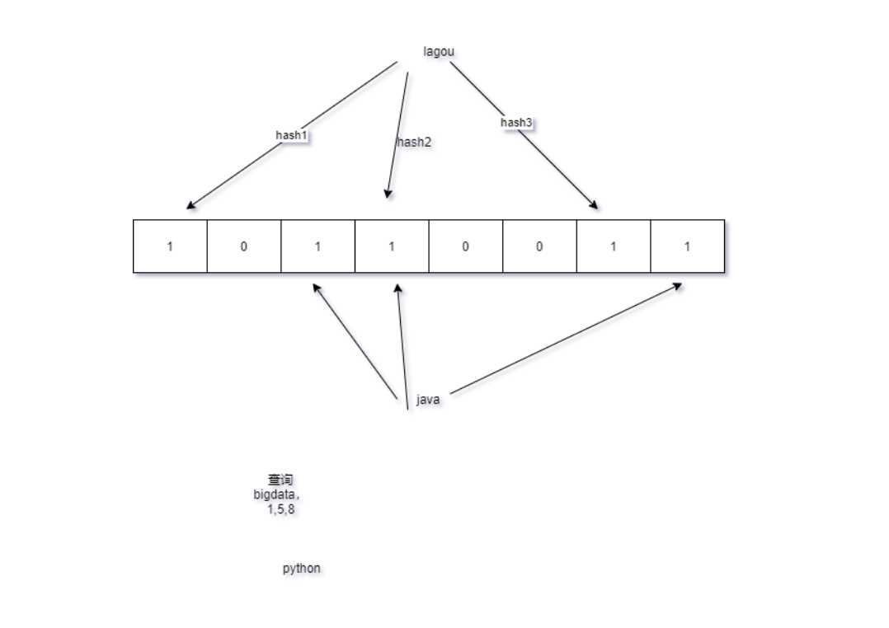

#### HBase API 客户端操作

#### HBaseAPI 客户端操作

```xml
 <!-- HBase -->
<dependency>
  <groupId>org.apache.hbase</groupId>
  <artifactId>hbase-client</artifactId>
  <version>1.3.1</version>
</dependency>
<dependency>
  <groupId>junit</groupId>
  <artifactId>junit</artifactId>
  <version>4.12</version>
  <scope>test</scope>
</dependency>
<dependency>
  <groupId>org.testng</groupId>
  <artifactId>testng</artifactId>
  <version>6.14.3</version>
  <scope>test</scope>
</dependency>
```

代码：

```java
package com.hhb.hbase;

import org.apache.hadoop.conf.Configuration;
import org.apache.hadoop.hbase.*;
import org.apache.hadoop.hbase.client.*;
import org.apache.hadoop.hbase.util.Bytes;
import org.junit.After;
import org.junit.Before;
import org.junit.Test;

import java.io.IOException;
import java.util.ArrayList;
import java.util.List;

/**
 * @description:
 * @author: huanghongbo
 * @date: 2020-07-29 10:16
 **/
public class HBaseClient {

    private Configuration conf = null;

    private Connection conn = null;

    @Before
    public void init() throws IOException {
        conf = HBaseConfiguration.create();
        conf.set("hbase.zookeeper.quorum", "linux121,linux122,linux123");
        conf.set("hbase.zookeeper.property.clientPort", "2181");
        conn = ConnectionFactory.createConnection(conf);
    }


    /**
     * 创建表
     *
     * @throws IOException
     */
    @Test
    public void createTable() throws IOException {
        //获取HBaseAdmin操作表
        HBaseAdmin admin = (HBaseAdmin) conn.getAdmin();
        //创建表描述器
        HTableDescriptor person = new HTableDescriptor(TableName.valueOf("person"));
        //增加列族
        person.addFamily(new HColumnDescriptor("info"));
        person.addFamily(new HColumnDescriptor("address"));
        admin.createTable(person);
        admin.close();
        System.err.println("创建表成功");
    }


    /**
     * 插入数据
     *
     * @throws IOException
     */
    @Test
    public void putData() throws IOException {
        HTable person = (HTable) conn.getTable(TableName.valueOf("person"));
        List<Put> list = new ArrayList<>();
        //rowKey
        Put put1 = new Put(Bytes.toBytes("110"));
        //分别设置：列族、列、值
        put1.addColumn(Bytes.toBytes("info"), Bytes.toBytes("name"), Bytes.toBytes("张三"));
        list.add(put1);

        Put put2 = new Put(Bytes.toBytes("110"));
        put2.addColumn(Bytes.toBytes("info"), Bytes.toBytes("age"), Bytes.toBytes("20"));
        list.add(put2);

        Put put3 = new Put(Bytes.toBytes("110"));
        put3.addColumn(Bytes.toBytes("address"), Bytes.toBytes("city"), Bytes.toBytes("beijing"));
        list.add(put3);
        person.put(list);

        person.close();
        System.err.println("插入数据成功");
    }


    /**
     * 查询数据
     *
     * @throws IOException
     */
    @Test
    public void selectData() throws IOException {
        HTable person = (HTable) conn.getTable(TableName.valueOf("person"));
        // rowKey
        Get get = new Get(Bytes.toBytes("110"));
//        get.addFamily(Bytes.toBytes("info"));
        get.addColumn(Bytes.toBytes("info"), Bytes.toBytes("age"));
//        get.addColumn()
        Result result = person.get(get);
        List<Cell> cells = result.listCells();
        for (Cell cell : cells) {
            System.err.println("rowKey信息：  " + Bytes.toString(CellUtil.cloneRow(cell)));
            System.err.println("列族信息：  " + Bytes.toString(CellUtil.cloneFamily(cell)));
            System.err.println("列信息：  " + Bytes.toString(CellUtil.cloneQualifier(cell)));
            System.err.println("value信息：  " + Bytes.toString(CellUtil.cloneValue(cell)));
        }
        person.close();
    }

    /**
     * 扫描全表数据
     *
     * @throws IOException
     */
    @Test
    public void scanData() throws IOException {
        HTable person = (HTable) conn.getTable(TableName.valueOf("person"));
        Scan scan = new Scan();
        ResultScanner scanner = person.getScanner(scan);
        for (Result result : scanner) {
            List<Cell> cells = result.listCells();
            for (Cell cell : cells) {
                System.err.println("rowKey信息：  " + Bytes.toString(CellUtil.cloneRow(cell)));
                System.err.println("列族信息：  " + Bytes.toString(CellUtil.cloneFamily(cell)));
                System.err.println("列信息：  " + Bytes.toString(CellUtil.cloneQualifier(cell)));
                System.err.println("value信息：  " + Bytes.toString(CellUtil.cloneValue(cell)));
            }
        }
    }


    /**
     * 扫描全表数据的部分数据
     *
     * @throws IOException
     */
    @Test
    public void scanStartEndData() throws IOException {
        HTable person = (HTable) conn.getTable(TableName.valueOf("person"));
        Scan scan = new Scan();
        scan.setStartRow(Bytes.toBytes("110"));
        scan.setStopRow(Bytes.toBytes("111"));
        ResultScanner scanner = person.getScanner(scan);
        for (Result result : scanner) {
            List<Cell> cells = result.listCells();
            for (Cell cell : cells) {
                System.err.println("rowKey信息：  " + Bytes.toString(CellUtil.cloneRow(cell)));
                System.err.println("列族信息：  " + Bytes.toString(CellUtil.cloneFamily(cell)));
                System.err.println("列信息：  " + Bytes.toString(CellUtil.cloneQualifier(cell)));
                System.err.println("value信息：  " + Bytes.toString(CellUtil.cloneValue(cell)));
            }
        }
        person.close();
    }

    /**
     * 删除数据
     */
    @Test
    public void deleteData() throws IOException {
        HTable person = (HTable) conn.getTable(TableName.valueOf("person"));
        Delete delete = new Delete(Bytes.toBytes("110"));
        delete.addColumn(Bytes.toBytes("info"), Bytes.toBytes("age"));
        person.delete(delete);

        person.close();
    }


    @After
    public void close() throws IOException {
        if (conn != null) {
            conn.close();
        }
    }


}

```

#### Hbase协处理器

###### 协处理器概述

[官方地址](http://hbase.apache.org/book.html#cp)

访问HBase的⽅式是使⽤scan或get获取数据，在获取到的数据上进⾏业务运算。但是在数据量非常大的时候，⽐如一个有上亿行及十万个列的数据集，再按常用的方式移动获取数据就会遇到性能问题。客户端也需要有强⼤的计算能力以及足够的内存来处理这么多的数据。

此时就可以考虑使用Coprocessor(协处理器)。将业务运算代码封装到Coprocessor中并在RegionServer上运行，即在数据实际存储位置执行，最后将运算结果返回到客户端。利用协处理器，用户可以编写运行在 HBase Server 端的代码。

Hbase Coprocessor类似以下概念

触发器和存储过程:一个Observer Coprocessor有些类似于关系型数据库中的触发器，通过它我们可以在⼀些事件(如Get或是Scan)发生前后执行特定的代码。Endpoint Coprocessor则类似于关系型数据库中的存储过程，因为它允许我们在RegionServer上直接对它存储的数据进行运算，⽽非是在客户端完成运算。

 MapReduce:MapReduce的原则就是将运算移动到数据所处的节点。Coprocessor也是按照相同的原则去工作的。 

AOP:如果熟悉AOP的概念的话，可以将Coprocessor的执行过程视为在传递请求的过程中对请求进行了拦截，并执⾏了一些自定义代码。

###### 协处理器类型

1. **Observer**

协处理器与触发器(trigger)类似:在一些特定事件发生时回调函数(也被称作钩⼦函数，hook)被执行。这些事件包括一些用户产生的事件，也包括服务器端内部⾃动产生的事件。

协处理器框架提供的接口如下

RegionObserver:⽤户可以用这种的处理器处理数据修改事件，它们与表的region联系紧密。

MasterObserver:可以被用作管理或DDL类型的操作，这些是集群级事件。

WALObserver:提供控制WAL的钩子函数

2. **Endpoint**

这类协处理器类似传统数据库中的存储过程，客户端可以调⽤这些 Endpoint 协处理器在Regionserver中执⾏一段代码，并将 RegionServer 端执行结果返回给客户端进⼀步处理。

**Endpoint**常⻅⽤途 

聚合操作

假设需要找出一张表中的最大数据，即 max 聚合操作，普通做法就是必须进行全表扫描，然后Client代码内遍历扫描结果，并执行求最大值的操作。这种⽅式存在的弊端是⽆法利用底层集群的并发运算能力，把所有计算都集中到 Client 端执行,效率低下。

使用Endpoint Coprocessor，用户可以将求最⼤值的代码部署到 HBase RegionServer 端，HBase 会利用集群中多个节点的优势来并发执行求最大值的操作。也就是在每个 Region 范围内执行求最大值的代码，将每个 Region 的最大值在 Region Server 端计算出，仅将该 max 值返回给Client。在Client进一步将多个 Region 的 最大值汇总进⼀步找到全局的最⼤值。

Endpoint Coprocessor的应用后续可以借助Phoenix非常容易就可以实现，针对HBase数据集进行聚合运算，直接使用SQL就能搞定

###### Observer 案例

需求：通过协处理器Observer实现Hbase当中t1表插入数据,指定的另一张表t2也需要插入相对应的数据。

```
create 't1','info'
create 't2','info'
```

实现思路:通过Observer协处理器捕捉到t1插入数据时，将数据复制一份并保存到t2表中

开发步骤：

1. 添加依赖

```xml
   <!-- 协处理器 -->
        <dependency>
            <groupId>org.apache.hbase</groupId>
            <artifactId>hbase-server</artifactId>
            <version>1.3.1</version>
        </dependency>
```


2. 写Observer协处理器

```java
package com.hhb.hbase.process;

import org.apache.hadoop.hbase.Cell;
import org.apache.hadoop.hbase.TableName;
import org.apache.hadoop.hbase.client.Durability;
import org.apache.hadoop.hbase.client.HTable;
import org.apache.hadoop.hbase.client.Put;
import org.apache.hadoop.hbase.coprocessor.BaseRegionObserver;
import org.apache.hadoop.hbase.coprocessor.ObserverContext;
import org.apache.hadoop.hbase.coprocessor.RegionCoprocessorEnvironment;
import org.apache.hadoop.hbase.regionserver.wal.WALEdit;
import org.apache.hadoop.hbase.util.Bytes;

import java.io.IOException;
import java.util.List;

/**
 * @description:需求： 通过协处理器Observer实现Hbase当中t1表插入数据, 指定的另一张表t2也需要插入相对应的数据。
 * 正常需要实现RegionObserver接口，但是该接口RegionObserver有默认的实现类BaseRegionObserver
 * 所以只需要继承BaseRegionObserver类，实现prePut方法即可，这样就可以监听的t1表插入数据时，执行向t2表插入数据
 * @author: huanghongbo
 * @date: 2020-07-29 19:29
 **/

public class MyProcessor extends BaseRegionObserver {


    /**
     * 把自己执行逻辑定义在这里
     *
     * @param e          上下文,通过上下文获取环境变量等信息
     * @param put        向t1表插入数据的对象，如果向t2插入，与t1的put一样就好
     * @param edit
     * @param durability
     * @throws IOException
     */
    @Override
    public void prePut(ObserverContext<RegionCoprocessorEnvironment> e, Put put, WALEdit edit, Durability durability) throws IOException {
        //获取t2表的table对象
        HTable t2 = (HTable) e.getEnvironment().getTable(TableName.valueOf("t2"));
        //table对象.put
        Put t2Put = new Put(put.getRow());
        //解析数据
        List<Cell> cells = put.get(Bytes.toBytes("info"), Bytes.toBytes("name"));
        //获取最新的数据
        Cell cell = cells.get(0);
        t2Put.add(cell);
        t2.put(t2Put);
        super.prePut(e, put, edit, durability);
    }
}

```

3. 打成jar包，上传到HDFS

```
cd /opt/lagou/softwares
mv original-hbaseStudy-1.0-SNAPSHOT.jar processor.jar 
hdfs dfs -mkdir -p /processor
hdfs dfs -put processor.jar /processor
```

4. 挂载协处理器

```
hbase(main):056:0> describe 't1'
hbase(main):055:0> alter 't1',METHOD => 'table_att','Coprocessor'=>'hdfs://linux121:9000/processor/processor.jar|com.hhb.hbase.process.MyProcessor|1001|' #再次查看't1'表，
hbase(main):043:0> describe 't1'
```

5. 验证

```
# 向t1插入数据
 put 't1','rk1','info:name','lisi'
```

6. 卸载协处理器

```
disable 't1'
alter 't1',METHOD=>'table_att_unset',NAME=>'coprocessor$1' 
enable 't2'
```

#### HBase表的RowKey设计

###### RowKey的基本介绍

ASCII码字典顺序。
 012,0,123,234,3.
 0,3,012,123,234
 0,012,123,234,3

字典序的排序规则：先比较第一个字节，如果相同，比较第二个字节，依此类推，如果到了第X个字节，其中一个已经超出rowkey的长度，短的rowkey排在前面。

###### RowKey长度原则

rowKey是一个二进制码流，可以是任意字符串，最大长度是64Kb，实际应用一般是10-100 bytes，以byte[]形式保存，一般设计成定长。

建议：

越短越好，不要超过16个字节，设计的过长会降低memstore内存的利用率和HFile存储数据的效率。

###### RowKey散列原则

建议将rowKey的高位作为散列字段，这样将提高数据均匀分布在每个RegionServer，以实现负载均衡的几率。

###### RowKey唯一原则

必须在设计上保证其唯一性，访问table中行的三种方式：

* 单个rowkey
* rowkey的range
* 全表扫描（生产一定不可以使用）

scan使用的时候注意：setStartRow和setEndRow范围越小，性能越高。

###### RowKey排序原则

按照ASCII有序设计


#### HBase表的热点

###### 什么是热点

检索habse的记录首先要通过row key来定位数据行。当⼤量的client访问hbase集群的⼀个或少数几个节点，造成少数region server的读/写请求过多、负载过大，⽽其他region server负载却很⼩，就造成了“热点”现象

###### 热点的解决方案

* 预分区

  目的是让表的数据均衡的分散在集群中，而不是默认只有一个region。

* 加盐

  在rowkey的前面加随机数。

* 哈希

  哈希会使统一行永远用一个前缀加盐。

* 反转

  反转固定长度的rowkey

#### HBase的二级索引

HBase表按照rowkey查询性能是最高的。rowkey就相当于hbase表的一级索引!!

为了HBase的数据查询更高效、适应更多的场景，诸如使⽤非rowkey字段检索也能做到秒级响应，或者支持各个字段进⾏模糊查询和多字段组合查询等， 因此需要在 HBase上面构建⼆级索引， 以满足现实中更复杂多样的业务需求。

hbase的二级索引其本质就是建立hbase表中列与行键之间的映射关系。 常见的二级索引我们一般可以借助各种其他的方式来实现，例如Phoenix或者solr或者ES等

#### 布隆过滤器载HBase的应用

###### 布隆过滤器的应用

之前再讲hbase的数据存储原理的时候，我们知道hbase的读操作需要访问⼤量的文件，大部分的实现通过布隆过滤器来避免⼤量的读文件操作。

###### 布隆过滤器的原理

通常判断某个元素是否存在用的可以选择hashmap。但是 HashMap 的实现也有缺点，例如存储容量占⽐高，考虑到负载因子的存在，通常空间是不能被用满的，⽽一旦你的值很多，例如上亿的时候，那 HashMap 占据的内存⼤小就变得很可观了了。

Bloom Filter是一种空间效率很高的随机数据结构，它利用位数组很简洁地表示⼀个集合，并能判断⼀个元素是否属于这个集合。 hbase 中布隆过滤器来过滤指定的rowkey是否在目标文件，避免扫描多个文件。使⽤布隆过滤器来判断。 布隆过滤器返回true,在结果不一定正确，如果返回false则说明确实不存在。

###### 布隆过滤器的原理示意图



###### Bloom Filter案例

pom

```xml
 <!-- 布隆过滤器 -->
 <dependency>
    <groupId>com.google.guava</groupId>
    <artifactId>guava</artifactId>
    <version>27.0.1-jre</version>
 </dependency>
```

java

```java
package com.hhb.hbase.bloom;

import com.google.common.hash.BloomFilter;
import com.google.common.hash.Funnel;
import com.google.common.hash.Funnels;

import java.nio.charset.Charset;

/**
 * @description:
 * @author: huanghongbo
 * @date: 2020-07-31 10:20
 **/
public class BloomFilterMain {

    public static void main(String[] args) {
        Charset charset = Charset.forName("utf-8");
        Funnel<CharSequence> charSequenceFunnel = Funnels.stringFunnel();
        // 预期数据量量10000，错误率0.0001
        BloomFilter<CharSequence> bloomFilter = BloomFilter.create(charSequenceFunnel, 10000, 0.0001);
        // 2.将⼀一部分数据添加进去
        for (int i = 0; i < 5000; i++) {
            bloomFilter.put("" + i);
        }
        System.out.println("数据写⼊入完毕"); // 3.测试结果
        for (int i = 0; i < 10000; i++) {
            if (bloomFilter.mightContain("" + i)) {
                System.out.println(i + "存在");
            } else {
                System.out.println(i + "不不存在");
            }
        }
    }
}

```

