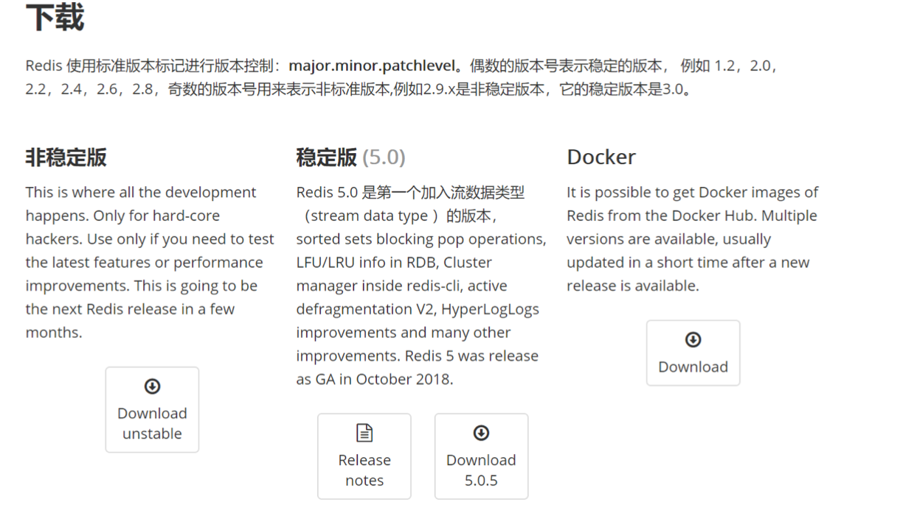
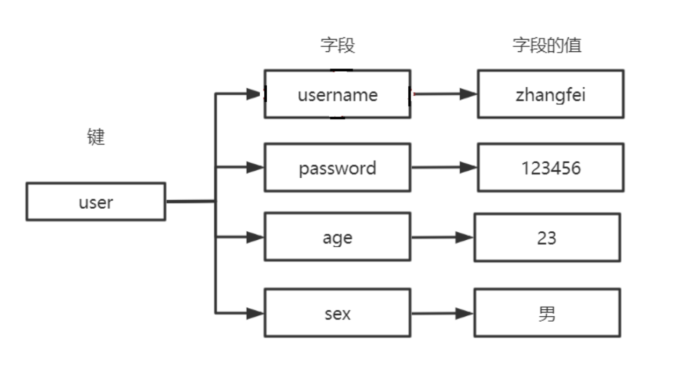
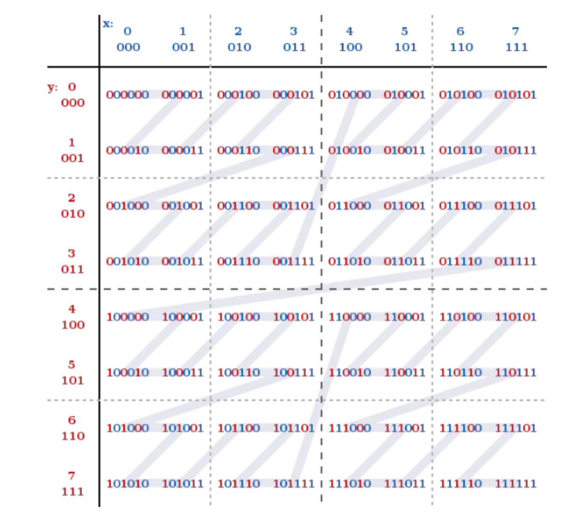
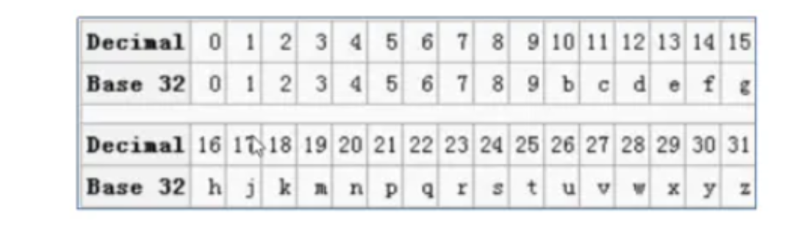

## Redis基础

#### Redis介绍

###### 什么是Redis

* Redis (Remote Dictionary Server) 远程字典服务器，是用C语言开发的一个开源的高性能键值对( key-value )内存数据库。
*  它提供了五种数据类型来存储值:字符串类型、散列类型、列表类型、集合类型、有序集合类型 
* 它是一种NoSQL数据存储。

###### Redis发展历史

2008年，意大利的一家创业公司 Merzia 推出了一款基于 MySQL 的网站实时统计系统 LLOOGG ，然而没 过多久该公司的创始人Salvatore Sanfilippo ( antirez)便 对MySQL的性能感到失望，于是他决定亲自为 LLOOGG 量身定做一个数据库，并于2009年开发完成，这个数据库就是Redis。

**Redis2.6**

Redis2.6在2012年正式发布，主要特性如下: 服务端支持Lua脚本、去掉虚拟内存相关功能、键的过期时间支持毫秒、从节点提供只读功能、两个新的位图命令:bitcount和bitop、重构了大量的核心代码、优化了大量的命令。

**Redis2.8**

Redis2.8在2013年11月22日正式发布，主要特性如下:

添加部分主从复制(增量复制)的功能、可以用bind命令绑定多个IP地址、Redis设置了明显的进程 名、发布订阅添加了pubsub命令、Redis Sentinel生产可用

**Redis3.0**

Redis3.0在2015年4月1日正式发布，相比于Redis2.8主要特性如下:
 Redis Cluster:Redis的官方分布式实现(Ruby)、全新的对象编码结果、lru算法大幅提升、部分命令的性能提升

**Redis3.2**

Redis3.2在2016年5月6日正式发布，相比于Redis3.0主要特征如下: 添加GEO相关功能、SDS在速度和节省空间上都做了优化、新的List编码类型:quicklist、从节点读取过期数据保证一致性、Lua脚本功能增强等

**Redis4.0** 

Redis4.0在2017年7月发布，主要特性如下:

提供了模块系统，方便第三方开发者拓展Redis的功能、PSYNC2.0:优化了之前版本中，主从节点切换 必然引起全量复制的问题、提供了新的缓存剔除算法:LFU(Last Frequently Used)，并对已有算法 进行了优化、提供了RDB-AOF混合持久化格式等

#### Redis应用场景

* 缓存使用，减轻DB压力
* DB使用，用于临时存储数据(字典表，购买记录)
* 解决分布式场景下Session分离问题(登录信息) 
* 任务队列(秒杀、抢红包等等) 乐观锁 
* 应用排行榜 zset
* 签到 bitmap 
* 分布式锁 
* 冷热数据交换(通过缓存淘汰策略)

## Redis单机版安装和使用

#### Redis下载

[官网地址](http://redis.io/)

[中文官网地址](http://www.redis.cn/)

[下载地址](http://download.redis.io/releases/)



#### Redis安装

1. 安装 C 语言需要的 GCC 环境

```
yum install -y gcc-c++
yum install -y wget
```

2. 下载并解压缩 Redis 源码压缩包

```
wget http://download.redis.io/releases/redis-5.0.5.tar.gz 
tar -zxf redis-5.0.5.tar.gz
```

3. 编译Redis源码，进入Redis-5.0.5目录，执行编译命令

```
cd redis-5.0.5/src
make
```

4. 安装 Redis ，需要通过PREFIX 指定安装路径

```
mkdir /usr/redis -p
make install PREFIX=/usr/redis
```

#### Redis启动

* 启动命令:  redis-server 直接运行 bin/redis-server 将以前端模式启动

```
./redis-server
```

* 关闭命令: ctrl+c
* 启动缺点:客户端窗口关闭则 redis-server 程序结束，不推荐使用此方法

#### 守护进程启动

1. 拷贝 redis-5.0.5/redis.conf 配置文件到 Redis 安装目录的 bin 目录

```
cp redis.conf /usr/redis/bin/
```

2. 修改 redis.conf

```
vim redis.conf
```

```
# 将`daemonize`由`no`改为`yes`
daemonize yes
# 默认绑定的是回环地址，默认不能被其他机器访问
# bind 127.0.0.1
# 是否开启保护模式，由yes该为no
protected-mode no
```

3. 启动服务

```
./redis-server redis.conf
```

4. 关闭方式

```
./redis-cli shutdown
```

###### 命令说明

* redis-server :启动redis服务
* redis-cli :进入redis命令客户端
* redis-benchmark : 性能测试的工具
* redis-check-aof : aof 文件进行检查的工
* redis-check-dump : rdb 文件进行检查的工具
* redis-sentinel : 启动哨兵监控服务

#### Redis命令后客户端

* 命令格式

```
./redis-cli -h 127.0.0.1 -p 6379
```


## Redis数据类型和应用场景

Redis是一个Key-Value的存储系统，使用ANSI C语言编写。 key的类型是字符串。
value的数据类型有:string字符串类型、list列表类型、set集合类型、sortedset(zset)有序集合类型、hash类型。不常见的:bitmap位图类型、geo地理位置类型、HyperLogLog基数统计。Redis5.0新增一种:stream类型。注意:Redis中命令是忽略大小写，(set SET)，key是不忽略大小写的 (NAME name)

#### Redis的key设计

1. 用:分割
2. 把表名转换为key前缀, 比如: user: 
3. 第二段放置主键值
4. 第三段放置列名

比如:用户表user, 转换为redis的key-value存储

| userid | username | password | email           |
| ------ | -------- | -------- | --------------- |
| 9      | zhangf   | 111111   | zhanf@lagou.com |

username 的 key: user:9:username

{userid:9,username:zhangf}

email的key user:9:email 

表示明确:看key知道意思,不易被覆盖.


###### string字符串类型

Redis的String能表达3种值的类型:字符串、整数、浮点数 100.01 是个六位的串

常见操作命令如下表:

| 命令名称 |                      | 命令描述                                                     |
| -------- | -------------------- | ------------------------------------------------------------ |
| set      | set key value        | 赋值                                                         |
| get      | get key              | 取值                                                         |
| getset   | getset key value     | 取值并赋值                                                   |
| setnx    | setnx key value      | 当value不存在时采用赋值<br/> set key value NX PX 3000 原子操作，px 设置毫秒数 |
| append   | append key value     | 向尾部追加值                                                 |
| strlen   | strlen key           | 获取字符串长度                                               |
| incr     | incr key             | 递增数字                                                     |
| incrby   | incrby key increment | 增加指定的整数                                               |
| decr     | decr key             | 递减数字                                                     |
| derby    | decrby key decrement | 减少指定的整数                                               |
| ttl      | ttl key              | 查看key剩余存活时间                                          |

应用场景:

1. key和命令是字符串
2. 普通的赋值
3. incr用于乐观锁 incr:递增数字，可用于实现乐观锁 watch(事务) 
4. setnx用于分布式锁 当value不存在时采用赋值，可用于实现分布式锁

setnx

```
#如果name不存在赋值
setnx name zhangf (integer) 1
#再次赋值失败
setnx name zhaoyun (integer) 0
get name 
"zhangf"
```

set

```
#如果不存在赋值 有效期10秒
set age OK NX PX 10000
#赋值失败
set age 20 NX 
(nil)
#age失效
get age 
(nil)
#赋值成功
set age 30 NX PX 10000
get age
```

list列表类型

list列表类型可以存储有序、可重复的元素，获取头部或尾部附近的记录是极快的，list的元素个数最多为2^32-1个(40亿) 

常见操作命令如下表:

| 命令名称   | 命令格式                             | 描述                                                         |
| ---------- | ------------------------------------ | ------------------------------------------------------------ |
| lpush      | lpush key v1 v2 v3……                 | 从左侧插入列表                                               |
| lpop       | lpop key                             | 从列表左侧取出                                               |
| rpush      | rpush key v1 v2 v3……                 | 从右侧插入列表                                               |
| rpop       | rpop key                             | 从列表右侧取出                                               |
| lpushx     | lpushx key value                     | 将值插入到列表头部                                           |
| rpushx     | rpushx key value                     | 将值插入到列表尾部                                           |
| blpop      | blpop key timeout                    | 从列表左侧取出，当列表为空时阻塞，可以设置最大阻塞时间，单位为秒 |
| brpop      | blpop key  timeout                   | 从列表右侧取出，当列表为空时阻塞，可以设置最大阻塞时间，单位为秒 |
| llen       | llen key                             | 获得列表中元素个数                                           |
| lindex     | lindex key  index                    | 获得列表中下标为index的元素 index从0开始                     |
| lrange     | lrange key start end                 | 返回列表中指定区间的元素，区间通过start和end指定             |
| lrem       | lrem key count value                 | 删除列表中与value相等的元素<br/> 当count>0时， lrem会从列表左边开始删除;当count<0时， lrem会从列表后边开始删除;当count=0时， lrem删除所有 值为value的元素 |
| lset       | lset key index value                 | 将列表index位置的元素设置成value的值                         |
| ltrim      | ltrim key start end                  | 对列表进行修剪，只保留start到end区间                         |
| rpoplpush  | rpoplpush key1 key2                  | 从key1列表右侧弹出并插入到key2列表左侧                       |
| brpoplpush | brpoplpush key2                      | 从key1列表右侧弹出并插入到key2列表左侧，会阻塞 key1          |
| linsert    | linsert key BEFORE/AFTER pivot value | 将value插入到列表，且位于值pivot之前或之后                   |

应用场景

1. 作为栈或队列使用，列表有序可以作为栈和队列使用
2. 可用于各种列表，比如用户列表、商品列表、评论列表等。

#### set集合类型

Set:无序、唯一元素 集合中最大的成员数为 2^32 - 1 

常见操作命令如下表:

| 命令名称    | 格式                    | 描述                                   |
| ----------- | ----------------------- | -------------------------------------- |
| sadd        | sadd key mem1 mem2      | 为集合添加新成员                       |
| srem        | srem key mem1 mem2 .... | 删除集合中指定成员                     |
| smembers    | smembers key            | 获得集合中所有元素                     |
| spop        | spop key                | 返回集合中一个随机元素，并将该元素删除 |
| srandmember | srandmember key         | 返回集合中一个随机元素，不会删除该元素 |
| scard       | scard key               | 获得集合中元素的数量                   |
| sismember   | sismember key member    | 判断元素是否在集合内                   |
| sinter      | sinter key1 key2 key3   | 求多集合的交集                         |
| sdiff       | sdiff key1 key2 key3    | 求多集合的差集                         |
| sunion      | sunion key1 key2 key3   | 求多集合的并集                         |

应用场景: 适用于不能重复的且不需要顺序的数据结构 比如:关注的用户，还可以通过spop进行随机抽奖

#### srotedset 有序集合

SortedSet(ZSet) 有序集合: 元素本身是无序不重复的，每个元素关联一个分数(score) 可按分数排序，分数可重复

| 命令名称  | 格式                                       | 描述                                        |
| --------- | ------------------------------------------ | ------------------------------------------- |
| zadd      | zadd key score1 member1 score2 member2 ... | 为有序集合添加新成员                        |
| zrem      | zrem key mem1 mem2 ....                    | 删除有序集合中指定成员                      |
| zcard     | zcard key                                  | 获得有序集合中的元素数量                    |
| zcount    | zcount key min max                         | 返回集合中score值在[min,max]区间 的元素数量 |
| zincrby   | zincrby key increment member               | 在集合的member分值上加increment             |
| zscore    | zscore key member                          | 获得集合中member的分值                      |
| zrank     | zrank key member                           | 获得集合中member的排名(按分值从 小到大)     |
| zrevrank  | zrevrank key member                        | 获得集合中member的排名(按分值从 大到小)     |
| zrange    | zrange key start end                       | 获得集合中指定区间成员，按分数递增 排序     |
| zrevrange | zrevrange key start end                    | 获得集合中指定区间成员，按分数递减 排序     |

应用场景：由于可以按照分值排序，所以适用于各种排行榜。比如:点击排行榜、销量排行榜、关注排行榜等。

#### hash类型（散列表）

Redis hash 是一个 string 类型的 field 和 value 的映射表，它提供了字段和字段值的映射。 每个 hash 可以存储 2^32 - 1 键值对(40多亿)。



| 命令名称 | 格式                                  | 描述                             |
| -------- | ------------------------------------- | -------------------------------- |
| hset     | hset key field value                  | 赋值，不区别新增或修改           |
| hmset    | hmset key field1 value1 field2 value2 | 批量赋值                         |
| hsetnx   | hsetnx key field value                | 赋值，如果filed存在则不操作      |
| hexists  | hexists key filed                     | 查看某个field是否存在            |
| hget     | hget key field                        | 获取一个字段值                   |
| hmget    | hmget key field1 field2 ...           | 获取多个字段值                   |
| hgetall  | hgetall key                           | 用于返回哈希表中，所有的字段和值 |
| hdel     | hdel key field1 field2...             | 删除指定字段                     |
| hincrby  | hincrby key field increment           | 指定字段自增increment            |
| hlen     | hlen key                              | 获得字段数量                     |

应用场景: 对象的存储 ，表数据的映射

#### BitMap位图类型

bitmap是进行位操作的 通过一个bit位来表示某个元素对应的值或者状态,其中的key就是对应元素本身。bitmap本身会极大的节省储存空间。

常见操作命令如下表:

| 命令名称 | 格式                                        | 描述                                      |
| -------- | ------------------------------------------- | ----------------------------------------- |
| setbit   | setbit key offset value                     | 设置key在offset处的bit值(只能是0或者 1)。 |
| getbit   | getbit key offset                           | 获得key在offset处的bit值                  |
| bitcount | bitcount key                                | 获得key的bit位为1的个数                   |
| bitpos   | bitpos key value                            | 返回第一个被设置为bit值的索引值           |
| bitop    | bitop and[or/xor/not] destkey key [key ...] | 对多个key 进行逻辑运算后存入destkey 中    |

应用场景:

1. 用户每月签到，用户id为key ， 日期作为偏移量 1表示签到 
2. 统计活跃用户, 日期为key，用户id为偏移量 1表示活跃 
3. 查询用户在线状态， 日期为key，用户id为偏移量 1表示在线


#### Geo地址位置信息

geo是Redis用来处理位置信息的。在Redis3.2中正式使用。主要是利用了Z阶曲线、Base32编码和geohash算法

###### Z阶曲线

在x轴和y轴上将十进制数转化为二进制数，采用x轴和y轴对应的二进制数依次交叉后得到一个六位数编码。把数字从小到大依次连起来的曲线称为Z阶曲线，Z阶曲线是把多维转换成一维的一种方法。



###### Base32编码

Base32这种数据编码机制，主要用来把二进制数据编码成可见的字符串，其编码规则是:任意给定一 个二进制数据，以5个位(bit)为一组进行切分(base64以6个位(bit)为一组)，对切分而成的每个组进行编码得到1个可见字符。Base32编码表字符集中的字符总数为32个(0-9、b-z去掉a、i、l、o)，这也是 Base32名字的由来。



###### Geohase算法

Gustavo在2008年2月上线了geohash.org网站。Geohash是一种地理位置信息编码方法。 经过 geohash映射后，地球上任意位置的经纬度坐标可以表示成一个较短的字符串。可以方便的存储在数据 库中，附在邮件上，以及方便的使用在其他服务中。以北京的坐标举例，[39.928167,116.389550]可以 转换成 wx4g0s8q3jf9 。

Redis中经纬度使用52位的整数进行编码，放进zset中，zset的value元素是key，score是GeoHash的 52位整数值。在使用Redis进行Geo查询时，其内部对应的操作其实只是zset(skiplist)的操作。通过zset 的score进行排序就可以得到坐标附近的其它元素，通过将score还原成坐标值就可以得到元素的原始坐 标。

常见操作命令如下表:

| 命令名称          | 格式                                                         | 描述                    |
| ----------------- | ------------------------------------------------------------ | ----------------------- |
| geoadd            | geoadd key 经度 纬度 成员名称1 经度1 纬度1 成 员名称2 经度2 纬度 2 ... | 添加地理坐标            |
| geohash           | geohash key 成员名称1 成员名称2...                           | 返回标准的 geohash串    |
| geopos            | geopos key 成员名称1 成员名称2...                            | 返回成员经纬度          |
| geodist           | geodist key 成员1 成员2 单位                                 | 计算成员间距离          |
| georadiusbymember | georadiusbymember key 成员 值单位 count 数 asc[desc]         | 根据成员查找附 近的成员 |

应用场景: 

1. 记录地理位置 
2. 计算距离 
3. 查找"附近的人"

示例：

```sql
#添加用户地址 zhangf、zhaoyun、diaochan的经纬度
geoadd user:addr 116.31 40.05 zhangf 116.38 39.88 zhaoyun 116.47 40.00 diaochan

#获得zhangf和diaochan的geohash码
geohash user:addr zhangf diaochan
 
 
#计算zhangf到diaochan的距离，位是m
geodist user:addr zhangf diaochan
#距离，单位km
geodist user:addr zhangf diaochan km

# 获得距离zhangf20km以内的按由近到远的顺序排出前三名的成员名称、距离及经纬度 
# withcoord : 获得经纬度 withdist:获得距离 withhash:获得geohash码
georadiusbymember user:addr zhangf 20 km withcoord withdist count 3 asc
georadiusbymember user:addr zhangf 20 km withhash withdist count 3 asc
```


#### Stream数据流类型

stream是Redis5.0后新增的数据结构，用于可持久化的消息队列。 几乎满足了消息队列具备的全部内容，包括:

* 消息ID的序列化生成 
* 消息遍历 
* 消息的阻塞和非阻塞读取 
* 消息的分组消费 
* 未完成消息的处理 
* 消息队列监控

每个Stream都有唯一的名称，它就是Redis的key，首次使用 xadd 指令追加消息时自动创建。

| 命令名称           | 格式                                                         | 描述                                                         |
| ------------------ | ------------------------------------------------------------ | ------------------------------------------------------------ |
| xadd               | xadd key id <*> field1 value1....                            | 将指定消息数据追加到指定队列(key)中，* 表示最新生成的id(当前时间+序列号) |
| xread              | xread [COUNT count] [BLOCK milliseconds] STREAMS key [key ...] ID [ID ...] | 从消息队列中读取，COUNT:读取条数， BLOCK:阻塞读(默认不阻塞)key:队列 名称 id:消息id |
| xrange             | xrange key start end [COUNT]                                 | 读取队列中给定ID范围的消息 COUNT:返回消息条数(消息id从小到大 |
| xrevrange          | xrevrange key start end [COUNT]                              | 读取队列中给定ID范围的消息 COUNT:返回消息条数(消息id从大到小) |
| xdel               | xdel key id                                                  | 删除队列的消息                                               |
| xgroup create      | xgroup create key groupname  id                              | 创建一个新的消费组                                           |
| xgroup destory     | xgroup destory key groupname                                 | 删除指定消费组                                               |
| xgroup delconsumer | xgroup delconsumer key  groupname cname                      | 删除指定消费组中的某个消费者                                 |
| xgroup setid       | xgroup setid key id                                          | 修改指定消息的最大id                                         |
| xreadgroup         | xreadgroup group groupname  consumer COUNT streams key       | 从队列中的消费组中创建消费者并消费数据（consumer不存在则创建) |

使用：

```
127.0.0.1:6379> xadd topic:001 * name zhangfei age 23
"1596456179301-0"
127.0.0.1:6379> xadd topic:001 * name zhaoyun age 24 name diaochan age 16
"1596456186336-0"
127.0.0.1:6379> xrange topic:001 - +
1) 1) "1596456179301-0"
   2) 1) "name"
      2) "zhangfei"
      3) "age"
      4) "23"
2) 1) "1596456186336-0"
   2) 1) "name"
      2) "zhaoyun"
      3) "age"
      4) "24"
      5) "name"
      6) "diaochan"
      7) "age"
      8) "16"
127.0.0.1:6379> xread COUNT 1 streams topic:001 0
1) 1) "topic:001"
   2) 1) 1) "1596456179301-0"
         2) 1) "name"
            2) "zhangfei"
            3) "age"
            4) "23"
127.0.0.1:6379> xgroup create topic:001 group1 0
OK
127.0.0.1:6379> xreadgroup group group1 cus1 count 1 streams topic:001 >
1) 1) "topic:001"
   2) 1) 1) "1596456179301-0"
         2) 1) "name"
            2) "zhangfei"
            3) "age"
            4) "23"
127.0.0.1:6379> xreadgroup group group1 cus1 count 1 streams topic:001 >
1) 1) "topic:001"
   2) 1) 1) "1596456186336-0"
         2) 1) "name"
            2) "zhaoyun"
            3) "age"
            4) "24"
            5) "name"
            6) "diaochan"
            7) "age"
            8) "16"
127.0.0.1:6379>
127.0.0.1:6379> xreadgroup group group1 cus1 count 1 streams topic:001 >
(nil)
127.0.0.1:6379>
```

#### Redis常用命令

[官方命令大全网址](http://www.redis.cn/commands.html)

###### exists

判断一个key是否存在，返回0或1

```
exists key
```

###### TTL

查看key的剩余生存时间

```
ttl key
```

###### PERSIST

清除生存时间

```
PERSIST key
```

###### rename

重命名key

```
rename oldkey newkey
```

###### type

显示指定key的数据类型

```
type key
```

#### Redis的Java客户端-Jedis

pom文件

```
 <!-- redis客户端-jedis -->
 <dependency>
   <groupId>redis.clients</groupId>
   <artifactId>jedis</artifactId>
   <version>2.9.0</version>
 </dependency>
```

java文件

```java
package com.hhb.redis;

import org.junit.Test;
import redis.clients.jedis.Jedis;

/**
 * @description:
 * @author: huanghongbo
 * @date: 2020-08-03 20:12
 **/
public class TestRedis {

    @Test
    public void testCoon() {
        Jedis jedis = new Jedis("59.110.241.53", 6379);
        jedis.set("key1", "value1");
        //获得Redis中字符串的值
        System.out.println(jedis.get("key1"));
        //在Redis中写list
        jedis.lpush("jedis:list:1", "1", "2", "3", "4", "5");
        //获得list的长度
        System.out.println(jedis.llen("jedis:list:1"));
    }
}

```


#### 缓存过期和淘汰策略

Redis性能高:官方数据
 读:110000次/s
 写:81000次/s 

长期使用，key会不断增加，不可以向Redis添加内容，Redis作为缓存使用，物理内存也会满，当内存满的时候，会向系统申请，操作系统会将硬盘的一部分空间当作内存，给到Redis，即内存与硬盘交换(swap) 虚拟内存 ，频繁IO 性能急剧下降

###### maxmemory

不设置maxmemory的场景：

Redis的key是固定的，不会增加 Redis作为DB使用，保证数据的完整性，不能淘汰 ，可以做集群，横向扩展，缓存淘汰策略:禁止驱逐 (默认)

设置maxmemory的场景

Redis是作为缓存使用，可以不断向Redis放内容

maxmemory : 默认为0 不限制 

问题:达到物理内存后性能急剧下架，甚至崩溃，内存与硬盘交换(swap) 虚拟内存 ，频繁IO 性能急剧下降，设置多少与业务有关，1个Redis实例，保证系统运行1G ，剩下的就都可以设置Redis 物理内存的3/4，如果是slaver : 要留出一定的内存

在redis.conf中

```
 maxmemory <bytes>
 maxmemort 1024mb
```

命令: 获得maxmemory数

```
CONFIG GET maxmemory
```

设置`maxmemory`后，当趋近`maxmemory`时，通过缓存淘汰策略，从内存中删除对象,不设置`maxmemory`无最大内存限制。`maxmemory-policy noeviction` (禁止驱逐) 不淘汰,如果设置`maxmemory` 那么`maxmemory-policy` 要配置

###### expire

在Redis中可以使用expire命令设置一个键的存活时间(ttl: time to live)，过了这段时间，该键就会自动被删除。

###### expire 原理

```
typedef struct redisDb {
  dict *dict; -- key Value 
  dict *expires; -- key ttl 
  dict *blocking_keys; 
  dict *ready_keys;
  dict *watched_keys;
  int id;
} redisDb;
```

上面的代码是Redis 中关于数据库的结构体定义，这个结构体定义中除了 id 以外都是指向字典的指针， 其中我们只看 dict 和 expires。

dict 用来维护一个 Redis 数据库中包含的所有 Key-Value 键值对，expires则用于维护一个 Redis 数据 库中设置了失效时间的键(即key与失效时间的映射)。

当我们使用 expire命令设置一个key的失效时间时，Redis 首先到 dict 这个字典表中查找要设置的key 是否存在，如果存在就将这个key和失效时间添加到 expires 这个字典表。

当我们使用 setex命令： `set key value PX 3000`(原子操作)向系统插入数据时，Redis 首先将 Key 和 Value 添加到 dict 这个字典表中，然后 将 Key 和失效时间添加到 expires 这个字典表中。

简单地总结来说就是，设置了失效时间的key和具体的失效时间全部都维护在 expires 这个字典表中。

#### 删除策略

Redis的数据删除有定时删除、惰性删除和主动删除三种方式。 Redis目前采用**惰性删除+主动删除**的方式。

###### 定时删除

在设置键的过期时间的同时，创建一个定时器，让定时器在键的过期时间到达时，立即执行对键的删除 操作。需要创建定时器，而且消耗CPU，一般不推荐使用。

###### 惰性删除

在key被访问时如果发现它已经失效，那么就删除它。 调用expireIfNeeded函数，该函数的意义是:读取数据之前先检查一下它有没有失效，如果失效了就删除它。

```c++
int expireIfNeeded(redisDb *db, robj *key) {
  //获取主键的失效时间 get当前时间-创建时间>ttl
  long long when = getExpire(db,key); 
  //假如失效时间为负数，说明该主键未设置失效时间(失效时间默认为-1)，直接返回0 
  if (when < 0) return 0; 
  //假如Redis服务器正在从RDB文件中加载数据，暂时不进行失效主键的删除，直接返回0 
  if (server.loading) return 0;
  ...
  //如果以上条件都不满足，就将主键的失效时间与当前时间进行对比，如果发现指定的主键 
  //还未失效就直接返回0
  if (mstime() <= when) return 0; 
  //如果发现主键确实已经失效了，那么首先更新关于失效主键的统计个数，然后将该主键失 
  //效的信息进行广播，最后将该主键从数据库中删除
	server.stat_expiredkeys++; propagateExpire(db,key); return dbDelete(db,key);
}
```

###### 主动删除

在redis.conf文件中可以配置主动删除策略,默认是no-enviction(不删除)

```
maxmemory-policy allkeys-lru
```

###### LRU

LRU (Least recently used) 最近最少使用，算法根据数据的历史访问记录来进行淘汰数据，其核心思想 是“如果数据最近被访问过，那么将来被访问的几率也更高”。最常见的实现是使用一个链表保存缓存数据，详细算法实现如下:

1. 新数据插入到链表头部;
2. 每当缓存命中(即缓存数据被访问)，则将数据移到链表头部; 
3. 当链表满的时候，将链表尾部的数据丢弃。
4. 在Java中可以使用**LinkHashMap**(哈希链表)去实现LRU

###### Redis的LRU数据淘汰策略

在服务器配置中保存了 lru 计数器 server.lrulock，会定时(redis 定时程序 serverCorn())更新，server.lrulock 的值是根据 server.unixtime 计算出来的。另外，从 struct redisObject 中可以发现，每一个 redis 对象都会设置相应的 lru。可以想象的是，每一次访问数据的时候，会更新 redisObject.lru。

LRU 数据淘汰机制是这样的:在数据集中随机挑选几个键值对，取出其中 lru 最大的键值对淘汰。

不可能遍历key，而是随机获取，用当前时间-最近访问越大 说明 访问间隔时间越长

volatile-lru ：从已设置过期时间的数据集(server.db[i].expires)中随机挑选最近最少使用的数据淘汰

allkeys-lru：从数据集(server.db[i].dict)中随机挑选最近最少使用的数据淘汰

###### LFU

LFU (Least frequently used) 最不经常使用，如果一个数据在最近一段时间内使用次数很少，那么在将来一段时间内被使用的可能性也很小。

volatile-lfu
allkeys-lfu

###### random

随机
 volatile-random： 从已设置过期时间的数据集(server.db[i].expires)中任意选择数据淘汰

 allkeys-random：从数据集(server.db[i].dict)中任意选择数据淘汰

###### ttl

TTL 数据淘汰机制:从过期时间的表中随机挑选几个键值对，取出其中 ttl 最小的键值对淘汰。

volatile-ttl：从已设置过期时间的数据集(server.db[i].expires)中挑选将要过期的数据淘汰

redis 数据集数据结构中保存了键值对过期时间的表，即 redisDb.expires。

###### noenviction

禁止驱逐数据，不删除，默认配置


###### 淘汰策略的选择

* allkeys-lru : 在不确定时一般采用策略。 冷热数据交换
* volatile-lru : 比allkeys-lru性能差存 : 过期时间

* allkeys-random : 希望请求符合平均分布(每个元素以相同的概率被访问) 
* 自己控制:volatile-ttl 缓存穿透

###### 案例分享

key-Value 业务表存 code 显示文字，拉勾早期将字典库，设置了maxmemory，并设置缓存淘汰策略为allkeys-lru 结果造成字典库某些字段失效，缓存击穿 ， DB压力剧增，差点宕机。
分析:
字典库 : Redis做DB使用，要保证数据的完整性 maxmemory设置较小，采用allkeys-lru，会对没有经常访问的字典库随机淘汰 当再次访问时会缓存击穿，请求会打到DB上。
 解决方案:
 1、不设置maxmemory
 2、使用noenviction策略

Redis是作为DB使用的，要保证数据的完整性，所以不能删除数据。 可以将原始数据源(XML)在系统启动时一次性加载到Redis中。 Redis做主从+哨兵 保证高可用

