## 高可用方案

“高可用性”(High Availability)通常来描述一个系统经过专门的设计，从而减少停工时间，而保持其服 务的高度可用性。CAP的 AP模型(C一致性，A可用性，P分区容错性)。单机的Redis是无法保证高可用性的，当Redis服务器宕机后，即使在有持久化的机制下也无法保证不丢 失数据。

所以我们采用Redis多机和集群的方式来保证Redis的高可用性。 单进程+单线程 + 多机 (集群)

#### 主从复制

Redis支持主从复制功能，可以通过执行slaveof(Redis5以后改成replicaof)或者在配置文件中设置slaveof(Redis5以后改成replicaof)来开启复制功能。

一主一从：

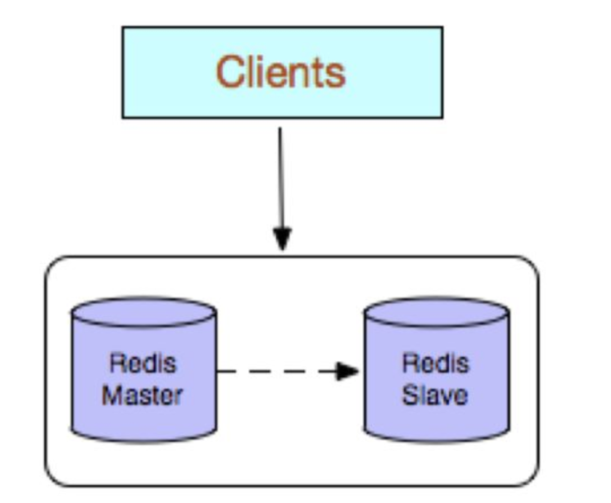

一主多从：

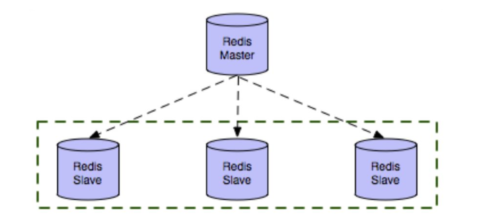

传递复制

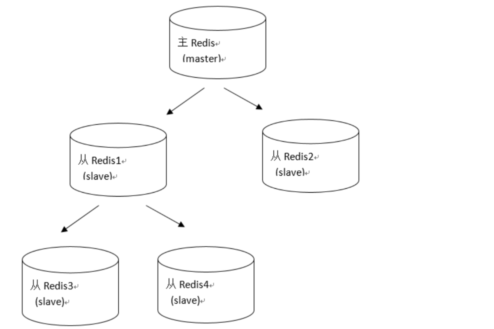

* 主对外从对内，主可写从不可写
* 主挂了，从不可以自动为主

#### 主从配置

###### 主Redis配置

无需特殊配置

###### 从Redis配置

修改从服务器上的 redis.conf 文件:

```
# slaveof <masterip> <masterport>
# 表示当前【从服务器】对应的【主服务器】的IP是192.168.10.135，端口是6379。 
replicaof 127.0.0.1 6379
```

#### 作用

###### 读写分离

* 一主多从，主从同步 
* 主负责写，从负责读 
* 提升Redis的性能和吞吐量
*  主从的数据一致性问题

###### 数据容灾

* 从机是主机的备份 
* 主机宕机，从机可读不可写
* 默认情况下主机宕机后，从机不可为主机
* 利用哨兵可以实现主从切换，做到高可用

#### 实现与原理

###### 复制流程

**保存主节点信息**

当客户端向从服务器发送slaveof(replicaof) 主机地址(127.0.0.1) 端口(6379)时:从服务器将主机 ip(127.0.0.1)和端口(6379)保存到redisServer的masterhost和masterport中。

```c
Struct redisServer{
	char *masterhost;//主服务器ip 
	int masterport;//主服务器端口
};
```

从服务器将向发送SLAVEOF命令的客户端返回OK，表示复制指令已经被接收，而实际上复制工作是在 OK返回之后进行。

**建立socket链接**

slaver与master建立socket连接

slaver关联文件事件处理器，该处理器接收RDB文件(全量复制)、接收Master传播来的写命令(增量复制)

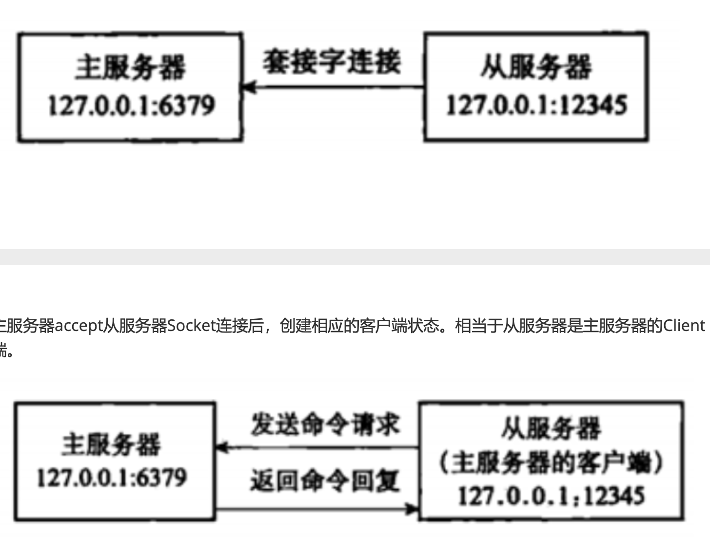

主服务器accept从服务器Socket连接后，创建相应的客户端状态。相当于从服务器是主服务器的Client 端。

**发送ping命令**

Slaver向Master发送ping命令 

1. 检测socket的读写状态 
2. 检测Master能否正常处理

Master的响应:

1. 发送“pong” , 说明正常 
2. 返回错误，说明Master不正常 
3. timeout，说明网络超时

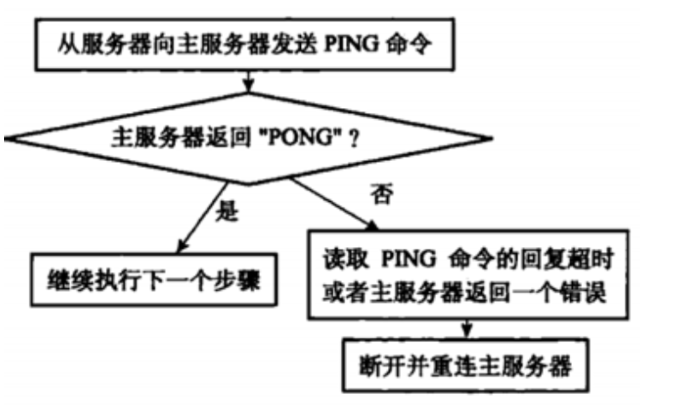

**权限验证**

主从正常连接后，进行权限验证。主未设置密码(requirepass=“”) ，从也不用设置密码(masterauth=“”)。主设置密码(requirepass!=""),从需要设置密码(masterauth=主的requirepass的值) 或者从通过auth命令向主发送密码

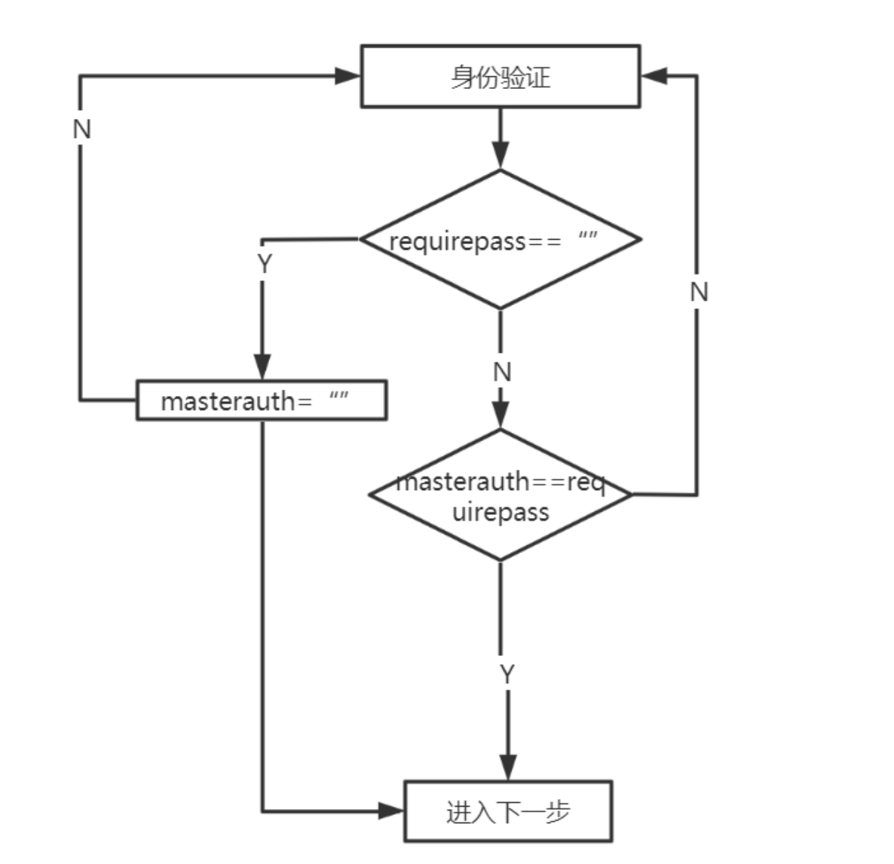

**发送端口信息**

在身份验证步骤之后，从服务器将执行命令REPLCONF listening-port ，向主服务器发送从服务器的监听端口号。


**同步数据**

Redis 2.8之后分为全量同步和增量同步，具体的后面详细讲解。

**命令传播**

当同步数据完成后，主从服务器就会进入命令传播阶段，主服务器只要将自己执行的写命令发送给从服 务器，而从服务器只要一直执行并接收主服务器发来的写命令。

###### 同步数据集

* Redis 2.8以前使用SYNC命令同步复制 

* Redis 2.8之后采用PSYNC命令替代SYNC

###### 旧版本实现方式

Redis 2.8以前：Redis的同步功能分为同步(sync)和命令传播(command propagate)。

1. 同步操作

   * 通过从服务器发送到SYNC命令给主服务器
   *  主服务器生成RDB文件并发送给从服务器，同时发送保存所有写命令给从服务器 
   * 从服务器清空之前数据并执行解释RDB文件
   * 保持数据一致(还需要命令传播过程才能保持一致)

   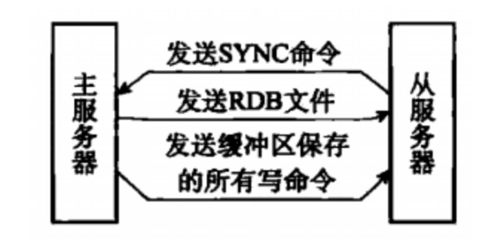

2. 命令传播操作

   同步操作完成后，主服务器执行写命令，该命令发送给从服务器并执行，使主从保存一致。

缺陷：

* 没有全量同步和增量同步的概念，从服务器在同步时，会清空所有数据。
* 主从服务器断线后重复制，主服务器会重新生成RDB文件和重新记录缓冲区的所有命令，并全量同步到 从服务器上。

###### 新版本实现方式

Redis 2.8以后，在Redis 2.8之后使用PSYNC命令，具备完整重同步和部分重同步模式。

* Redis 的主从同步，分为**全量同步**和**增量同步**。 

* 只有从机第一次连接上主机是**全量同步**。 

* 断线重连有可能触发**全量同步**也有可能是**增量同步**( master 判断 runid 是否一致)。

* 除此之外的情况都是**增量同步**。

  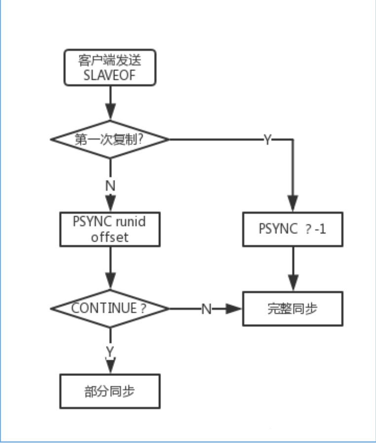

**全量同步**

Redis的全量同步过程主要分三个阶段:

* **同步快照阶段:** Master 创建并发送**快照**RDB给 Slave ， Slave 载入并解析快照。 Master 同时将此阶段所产生的新的写命令存储到缓冲区。
* **同步写缓冲阶段:** Master 向 Slave 同步存储在缓冲区的写操作命令。
* **同步增量阶段:** Master 向 Slave 同步写操作命令。

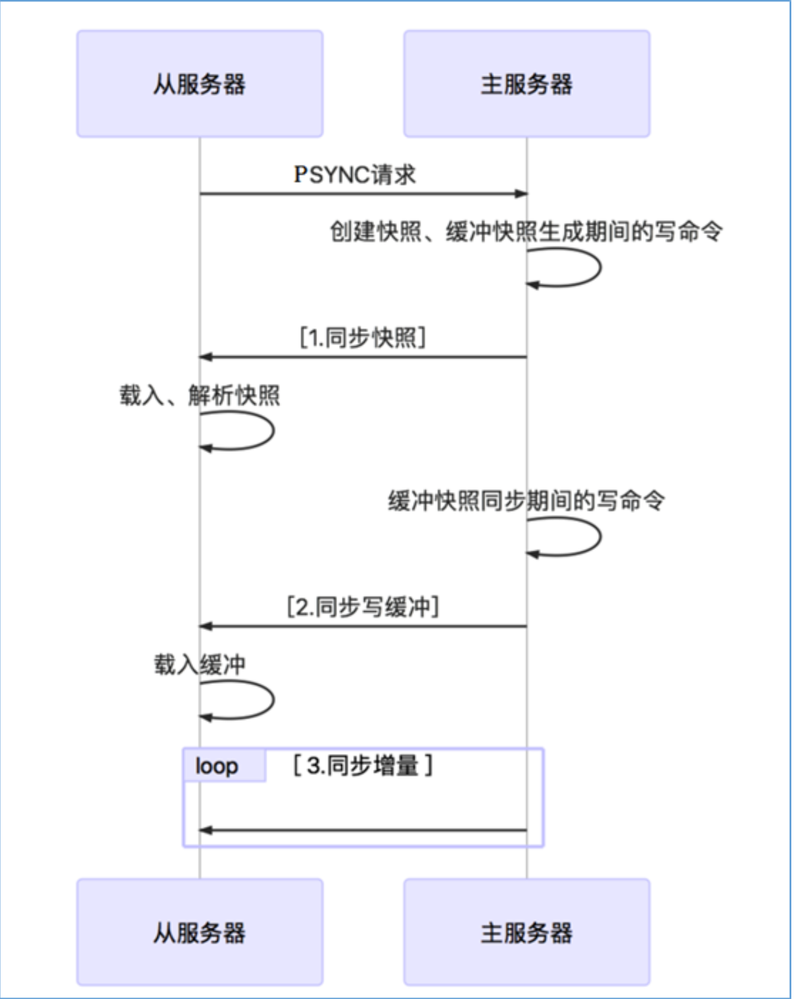

**增量同步**

* Redis增量同步主要指Slave完成初始化后开始正常工作时， Master 发生的写操作同步到 Slave 的过程。
*  通常情况下， Master 每执行一个写命令就会向 Slave 发送相同的**写命令**，然后 Slave 接收并执行。

###### 心跳检测

在命令传播阶段，从服务器默认会以每秒一次的频率向主服务器发送命令:

```properties
replconf ack <replication_offset>
#ack :应答 
#replication_offset:从服务器当前的复制偏移量
```

主要作用有三个

1. 检测主从的连接状态

   * 检测主从服务器的网络连接状态

   * 通过向主服务器发送INFO replication命令，可以列出从服务器列表，可以看出从最后一次向主发 送命令距离现在过了多少秒。lag的值应该在0或1之间跳动，如果超过1则说明主从之间的连接有故障。

2. 辅助实现min-slaves

   * Redis可以通过配置防止主服务器在不安全的情况下执行写命令
     * min-slaves-to-write 3 (min-replicas-to-write 3 )
     * min-slaves-max-lag 10 (min-replicas-max-lag 10)

   上面的配置表示:从服务器的数量少于3个，或者三个从服务器的延迟(lag)值都大于或等于10 秒时，主服务器将拒绝执行写命令。这里的延迟值就是上面INFOreplication命令的lag值。

3. 检测命令丢失

   * 如果因为网络故障，主服务器传播给从服务器的写命令在半路丢失，那么当从服务器向主服务器发 送REPLCONF ACK命令时，主服务器将发觉从服务器当前的复制偏移量少于自己的复制偏移量， 然后主服务器就会根据从服务器提交的复制偏移量，在复制积压缓冲区里面找到从服务器缺少的数据,并将这些数据重新发送给从服务器。(补发) 网络不断

   * 增量同步:网断了，再次连接时

#### 哨兵模式

哨兵(sentinel)是Redis的高可用性(High Availability)的解决方案: 由一个或多个sentinel实例组成sentinel集群可以监视一个或多个主服务器和多个从服务器。当主服务器进入下线状态时，sentinel可以将该主服务器下的某一从服务器升级为主服务器继续提供服 务，从而保证redis的高可用性。

###### 部署方案


###### 搭建配置

在一台机器上采用伪分布式的方式部署。(生产环境应该是多台机器)，根据上面的部署方案搭建如下:Redis-Master :127.0.0.1 6379。 采用安装的方式，正常安装和配置

1. 安装Redis5.0

```shell
cd /mnt/module
mkdir redis-ms
cd redis-ms
mkdir master slaver-1 slaver-2 sentinel1 sentinel2 sentinel3
cd /mnt/module/redis-5.0.5/src
make install PREFIX=/mnt/module/redis-ms/master
cd /mnt/module/redis-5.0.5
cp redis.conf /mnt/module/redis-ms/master/bin
```

2. 修改redis.com

```shell
/mnt/module/redis-ms/master/bin
vim redis.conf

#默认绑定的是回环地址，默认不能被其他机器访问
#bind 127.0.0.1
protected-mode no
daemonize yes


退出保存
```

3. 配置两个从节点

```shell
cp -r /mnt/module/redis-ms/master/* /mnt/module/redis-ms/slaver-1
cp -r /mnt/module/redis-ms/master/* /mnt/module/redis-ms/slaver-2
## 修改slaver-1配置文件
vim /mnt/module/redis-ms/slaver-1/bin/redis.conf

port 6380
replicaof 127.0.0.1 6379

## 修改slaver-2配置文件
vim /mnt/module/redis-ms/slaver-1/bin/redis.conf

port 6381
replicaof 127.0.0.1 6379
```

4. 配置sentinel1

```shell
cd /mnt/module/redis-5.0.5/src
make install PREFIX=/mnt/module/redis-ms/sentinel1
cd /mnt/module/redis-5.0.5
cp sentinel.conf /mnt/module/redis-ms/sentinel1/bin
cd /mnt/module/redis-ms/sentinel1/bin
vim sentinel.conf

# 哨兵sentinel实例运行的端口 默认26379
port 26379
# 将`daemonize`由`no`改为`yes` 
daemonize yes
# 哨兵sentinel监控的redis主节点的 ip port
# master-name 可以自己命名的主节点名字 只能由字母A-z、数字0-9 、这三个字符".-_"组成。
# quorum 当这些quorum个数sentinel哨兵认为master主节点失联 那么这时 客观上认为主节点失联了 
# sentinel monitor <master-name> <ip> <redis-port> <quorum>
sentinel monitor mymaster 127.0.0.1 6379 2
# 当在Redis实例中开启了requirepass foobared 授权密码 这样所有连接Redis实例的客户端都要提供密码
# 设置哨兵sentinel 连接主从的密码 注意必须为主从设置一样的验证密码
# sentinel auth-pass <master-name> <password>
sentinel auth-pass mymaster MySUPER--secret-0123passw0rd
# 指定多少毫秒之后 主节点没有应答哨兵sentinel 此时 哨兵主观上认为主节点下线 默认30秒，改成3秒 # sentinel down-after-milliseconds <master-name> <milliseconds>
sentinel down-after-milliseconds mymaster 3000
# 这个配置项指定了在发生failover主备切换时最多可以有多少个slave同时对新的master进行 同步， 这个数字越小，完成failover所需的时间就越长，但是如果这个数字越大，就意味着越 多的slave因为replication而不可用。可以通过将这个值设为 1 来保证每次只有一个slave 处于不能处理命令请求的状态。
# sentinel parallel-syncs <master-name> <numslaves>
sentinel parallel-syncs mymaster 1
# 故障转移的超时时间 failover-timeout 可以用在以下这些方面:
#1. 同一个sentinel对同一个master两次failover之间的间隔时间。
#2. 当一个slave从一个错误的master那里同步数据开始计算时间。直到slave被纠正为向正确的master 那里同步数据时。
#3.当想要取消一个正在进行的failover所需要的时间。 #4.当进行failover时，配置所有slaves指向新的master所需的最大时间。不过，即使过了这个超时， slaves依然会被正确配置为指向master，但是就不按parallel-syncs所配置的规则来了
# 默认三分钟
# sentinel failover-timeout <master-name> <milliseconds>
sentinel failover-timeout mymaster 180000
```

5. 配置sentinel2、配置sentinel3

```shell
cd /mnt/module/redis-ms
cp -r /sentinel1/* sentinel2
cp -r /sentinel1/* sentinel3

# 配置sentinel2
cd /mnt/module/redis-ms/sentinel2/bin
vim sentinel.conf

port 26380

# 配置sentinel3
cd /mnt/module/redis-ms/sentinel3/bin
vim sentinel.conf

port 26381
```

6. 启动

```shell
#启动redis-master和redis-slaver
cd /mnt/module/redis-ms/master/bin/
./redis-server redis.conf 
cd /mnt/module/redis-ms/slaver-1/bin/
./redis-server redis.conf 
cd /mnt/module/redis-ms/slaver-2/bin/
./redis-server redis.conf 
#启动redis-sentinel
cd /mnt/module/redis-ms/sentinel1/bin/
./redis-sentinel sentinel.conf
cd /mnt/module/redis-ms/sentinel2/bin/
./redis-sentinel sentinel.conf
cd /mnt/module/redis-ms/sentinel3/bin/
./redis-sentinel sentinel.conf
```

7. 查看启动状态

```shell
[root@hhb redis-ms]# ps -ef | grep redis
root      1559     1  0 8月05 ?       00:01:05 ./redis-server *:6380
root      1565     1  0 8月05 ?       00:01:14 ./redis-server *:6381
root      1572     1  0 8月05 ?       00:01:36 ./redis-sentinel *:26379 [sentinel]
root      1577     1  0 8月05 ?       00:01:35 ./redis-sentinel *:26380 [sentinel]
root      1582     1  0 8月05 ?       00:01:35 ./redis-sentinel *:26381 [sentinel]
root      1651     1  0 8月05 ?       00:01:04 ./redis-server *:6379
root      2928  2834  0 11:16 pts/0    00:00:00 grep --color=auto redis
```

* 如果kill掉master，会在两个从节点选择一个节点自动切换为master
* 被kill的master如果被重启，启动后会自动变为slaver
* master读写，slaver只能读

##### 执行流程

###### **启动并初始化Sentinel**

Sentinel是一个特殊的Redis服务器。不会进行持久化，Sentinel实例启动后，每个Sentinel会创建2个连向主服务器的网络连接 命令连接:用于向主服务器发送命令，并接收响应; 

订阅连接:用于订阅主服务器的—sentinel—:hello频道。

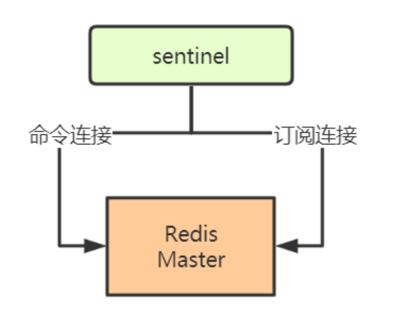

###### **获取主服务信息**

Sentinel默认每10s一次，向被监控的主服务器发送info命令，获取主服务器和其下属从服务器的信息。

```
 info
# Server
redis_version:5.0.5
redis_git_sha1:00000000
redis_git_dirty:0

……
# Replication
role:master
connected_slaves:2
slave0:ip=127.0.0.1,port=6380,state=online,offset=9968302,lag=0
slave1:ip=127.0.0.1,port=6379,state=online,offset=9968036,lag=0
master_replid:42c43604e651941fec4e47ac2cf86602a7965650
master_replid2:0ed1c001d719e6590fee6da5fd9392c9f0dcd1f5
master_repl_offset:9968302
second_repl_offset:83024
repl_backlog_active:1
repl_backlog_size:1048576
repl_backlog_first_byte_offset:8919727
repl_backlog_histlen:1048576

```


###### **获取从服务器信息**

当Sentinel发现主服务器有新的从服务器出现时，Sentinel还会向从服务器建立命令连接和订阅连接。 在命令连接建立之后，Sentinel还是默认10s一次，向从服务器发送info命令，并记录从服务器的信息。

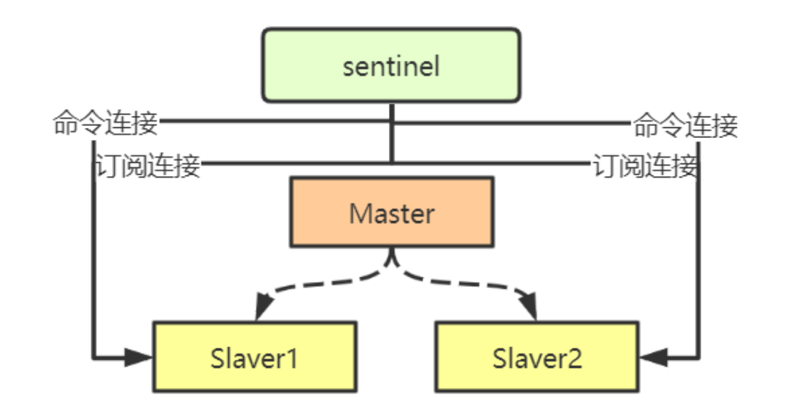

```
127.0.0.1:6379> info
# Server
redis_version:5.0.5
redis_git_sha1:00000000
……
# Replication
role:slave
master_host:127.0.0.1
master_port:6381
master_link_status:up
master_last_io_seconds_ago:0
master_sync_in_progress:0
slave_repl_offset:9921416
slave_priority:100
slave_read_only:1
connected_slaves:0
master_replid:42c43604e651941fec4e47ac2cf86602a7965650
master_replid2:0000000000000000000000000000000000000000
master_repl_offset:9921416
second_repl_offset:-1
repl_backlog_active:1
repl_backlog_size:1048576
repl_backlog_first_byte_offset:8872841
repl_backlog_histlen:1048576
……
```

###### **向主服务器和从服务器发送消息(以订阅的方式)**

默认情况下，Sentinel每2s一次，向所有被监视的主服务器和从服务器所订阅的`_sentinel_:hello`频道上发送消息，消息中会携带Sentinel自身的信息和主服务器的信息。

```shell
PUBLISH _sentinel_:hello "< s_ip > < s_port >< s_runid >< s_epoch > < m_name > <m_ip >< m_port ><m_epoch>"
```

###### **接收来自主服务器和从服务器的频道信息**

当Sentinel与主服务器或者从服务器建立起订阅连接之后，Sentinel就会通过订阅连接，向服务器发送 以下命令:

```
subscribe —sentinel—:hello
```

Sentinel彼此之间**只创建命令连接，而不创建订阅连接**，因为Sentinel通过订阅主服务器或从服务器，就可以感知到新的Sentinel的加入，而一旦新Sentinel加入后，相互感知的Sentinel通过命令连接来通信就可以了。

###### **检测主观下线状态**

当一个Sentinel将一个主服务器判断为主观下线后,Sentinel会向同时监控这个主服务器的所有其他Sentinel发送查询命令 

主机的

```
SENTINEL is-master-down-by-addr <ip> <port> <current_epoch> <runid>
```

其他Sentinel回复

```
<down_state>< leader_runid >< leader_epoch >
```

判断它们是否也认为主服务器下线。如果**达到Sentinel配置中的quorum数量**的Sentinel实例都判断主服务器为主观下线，则该主服务器就会被判定为客观下线(**ODown**)。

###### **选举Leader Sentinel**

当一个主服务器被判定为客观下线后，监视这个主服务器的所有Sentinel会通过选举算法(raft)，选出一个Leader Sentinel去执行failover(故障转移)操作。

##### 哨兵leader选举

**Raft**

Raft协议是用来解决分布式系统一致性问题的协议。 Raft协议描述的节点共有三种状态:Leader, Follower, Candidate。 

term:Raft协议将时间切分为一个个的Term(任期)，可以认为是一种“逻辑时间”。

**选举流程**:
Raft采用心跳机制触发Leader选举，系统启动后，全部节点初始化为Follower，term为0。节点如果收到了RequestVote或者AppendEntries，就会保持自己的Follower身份；节点如果一段时间内没收AppendEntries消息，在该节点的超时时间内还没发现Leader，Follower就会转换成Candidate，自己开始竞选Leader。一旦转化为Candidate，该节点立即开始下面几件事情:

* 增加自己的term。

* 启动一个新的定时器。

* 给自己投一票。 
* 向所有其他节点发送RequestVote，并等待其他节点的回复。

如果在计时器超时前，节点收到多数节点的同意投票，就转换成Leader。同时向所有其他节点发送 AppendEntries，告知自己成为了Leader。每个节点在一个term内只能投一票，采取先到先得的策略，Candidate前面说到已经投给了自己， Follower会投给第一个收到RequestVote的节点。Raft协议的定时器采取随机超时时间，这是选举Leader的关键。 在同一个term内，先转为Candidate的节点会先发起投票，从而获得多数票。

**Sentinel的leader选举流程**

1. 某Sentinel认定master客观下线后，该Sentinel会先看看自己有没有投过票，如果自己已经投过票给其他Sentinel了，在一定时间内自己就不会成为Leader。 
2. 如果该Sentinel还没投过票，那么它就成为Candidate。 
3. Sentinel需要完成几件事情:
   * 更新故障转移状态为start 
   * 当前epoch加1，相当于进入一个新term，在Sentinel中epoch就是Raft协议中的term。 
   * 向其他节点发送 is-master-down-by-addr 命令请求投票。命令会带上自己的epoch。 
   * 给自己投一票(leader、leader_epoch)

4. 当其它哨兵收到此命令时，可以同意或者拒绝它成为领导者;(通过判断epoch) 
5. Candidate会不断的统计自己的票数，直到他发现认同他成为Leader的票数超过一半而且超过它配置的quorum，这时它就成为了Leader。 
6. 其他Sentinel等待Leader从slave选出master后，检测到新的master正常工作后，就会去掉客观下线的标识。

###### 故障转移

当选举出Leader Sentinel后，Leader Sentinel会对下线的主服务器执行故障转移操作，主要有三个步 骤:

1. 它会将失效 Master 的其中一个 Slave 升级为新的 Master , 并让失效 Master 的其他 Slave 改为复制新的 Master ;
2. 当客户端试图连接失效的 Master 时，集群也会向客户端返回新 Master 的地址，使得集群可以使用现在的 Master 替换失效 Master 。
3. Master 和 Slave 服务器切换后， Master 的 redis.conf 、 Slave 的 redis.conf 和 sentinel.conf 的配置文件的内容都会发生相应的改变，即， Master 主服务器的 redis.conf配置文件中会多一行 replicaof 的配置， sentinel.conf 的监控目标会随之调换。

###### 主服务器的选择

哨兵leader根据以下规则从客观下线的主服务器的从服务器中选择出新的主服务器。

1. 过滤掉主观下线的节点
2. 选择slave-priority最高的节点，如果由则返回没有就继续选择
3. 选择出复制偏移量最大的系节点，因为复制偏移量越大则数据复制的越完整，如果由就返回了，没有就继续
4. 选择run_id最小的节点，因为run_id越小说明重启次数越少

#### 集群与分区

分区是将数据分布在多个Redis实例(Redis主机)上，以至于每个实例只包含一部分数据。

###### 分区的意义

* 性能的提升 

  单机Redis的网络I/O能力和计算资源是有限的，将请求分散到多台机器，充分利用多台机器的计算能力可网络带宽，有助于提高Redis总体的服务能力。 

* 存储能力的横向扩展

  即使Redis的服务能力能够满足应用需求，但是随着存储数据的增加，单台机器受限于机器本身的存储 容量，将数据分散到多台机器上存储使得Redis服务可以横向扩展。

###### 分区的方式

根据分区键(id)进行分区:

###### 范围分区

根据id数字的范围比如1--10000、100001--20000.....90001-100000，每个范围分到不同的Redis实例中

好处: 实现简单，方便迁移和扩展 

缺陷: 热点数据分布不均，性能损失

​	非数字型key，比如uuid无法使用(可采用雪花算法替代) 分布式环境 主键 雪花算法
​     是数字
 	能排序

###### hash分区

利用简单的hash算法即可:**Redis实例=hash(key)%N**

 key:要进行分区的键，比如user_id N:Redis实例个数(Redis主机)

 好处:支持任何类型的key， 热点分布较均匀，性能较好
 缺陷: 迁移复杂，需要重新计算，扩展较差(利用一致性hash环)

###### 一致性hash

**基本概念**

普通hash是对主机数量取模，而一致性hash是对2^32(4 294 967 296)取模。我们把2^32想象成一 个圆，就像钟表一样，钟表的圆可以理解成由60个点组成的圆，而此处我们把这个圆想象成由2^32个 点组成的圆，（Hash环）

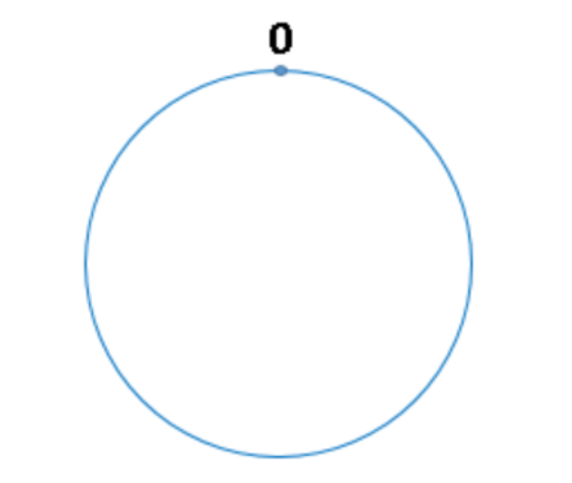

圆环的正上方的点代表0，0点右侧的第一个点代表1，以此类推，2、3、4、5、6......直到2^32-1,也就 是说0点左侧的第一个点代表2^32-1 。我们把这个由2的32次方个点组成的圆环称为hash环。

假设我们有3台缓存服务器，服务器A、服务器B、服务器C，那么，在生产环境中，这三台服务器肯定有自己的IP地址，我们使用它们各自的IP地址进行哈希计算，使用哈希后的结果对2^32取模，可以使用 如下公式:

**hash(服务器的IP地址) % 2^32**

通过上述公式算出的结果一定是一个0到2^32-1之间的一个整数，我们就用算出的这个整数，代表服务器A、服务器B、服务器C，既然这个整数肯定处于0到2^32-1之间，那么，上图中的hash环上必定有一 个点与这个整数对应，也就是服务器A、服务器B、服务C就可以映射到这个环上，如下图:

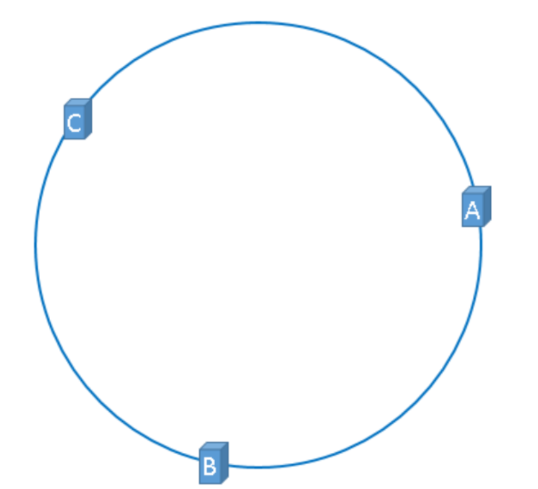


假设，我们需要使用Redis缓存数据，那么我们使用公式:**hash(key) % 2^32**可以将数据映射到上图中的hash环上。 
映射后的示意图如下，下图中的橘黄色圆形表示数据

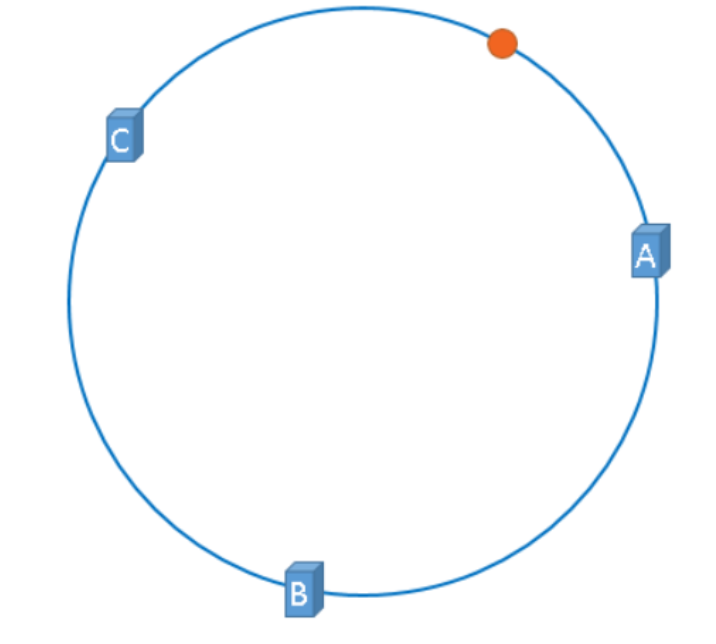

现在服务器与数据都被映射到了hash环上，上图中的数据将会被缓存到服务器A上，因为从数据的位置开始，沿顺时针方向遇到的第一个服务器就是A服务器，所以，上图中的数据将会被缓存到服务器A上。 如图:

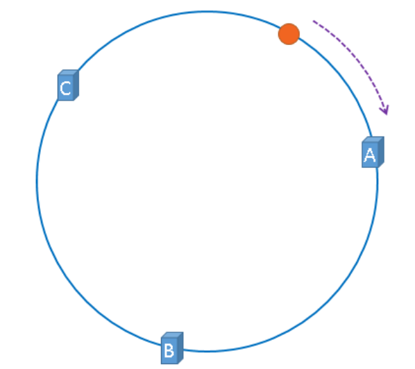

将缓存服务器与被缓存对象都映射到hash环上以后，从被缓存对象的位置出发，沿顺时针方向遇到的第一个服务器，就是当前对象将要缓存于的服务器，由于被缓存对象与服务器hash后的值是固定的，所以，在服务器不变的情况下，数据必定会被缓存到固定的服务器上，那么，当下次想要访问这个数据 时，只要再次使用相同的算法进行计算，即可算出这个数据被缓存在哪个服务器上，直接去对应的服务器查找对应的数据即可。多条数据存储如下:

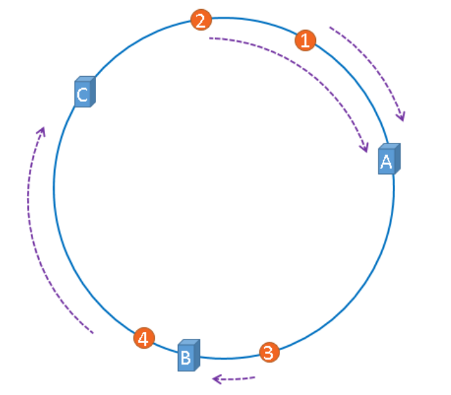

**优点**
添加或移除节点时，数据只需要做部分的迁移，比如上图中把C服务器移除，则数据4迁移到服务器A 中，而其他的数据保持不变。添加效果是一样的。
**hash环偏移**
在介绍一致性哈希的概念时，我们理想化的将3台服务器均匀的映射到了hash环上。也就是说数据的范围是2^32/N。但实际情况往往不是这样的。有可能某个服务器的数据会很多，某个服务器的数据会很 少，造成服务器性能不平均。这种现象称为hash环偏移。

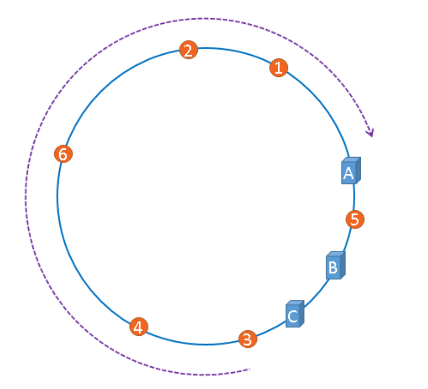

理论上我们可以通过增加服务器的方式来减少偏移，但这样成本较高，所以我们可以采用虚拟节点的方式，也就是虚拟服务器，如图:

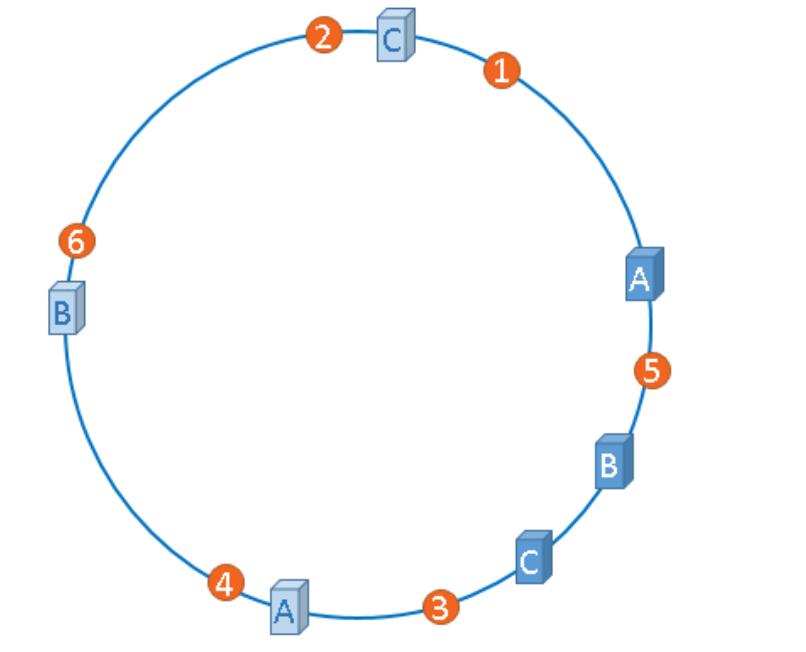

"虚拟节点"是"实际节点"(实际的物理服务器)在hash环上的复制品,一个实际节点可以对应多个虚拟节点。从上图可以看出，A、B、C三台服务器分别虚拟出了一个虚拟节点，当然，如果你需要，也可以虚拟出 更多的虚拟节点。引入虚拟节点的概念后，缓存的分布就均衡多了，上图中，1号、3号数据被缓存在服 务器A中，5号、4号数据被缓存在服务器B中，6号、2号数据被缓存在服务器C中，如果你还不放心，可 以虚拟出更多的虚拟节点，以便减小hash环偏斜所带来的影响，虚拟节点越多，hash环上的节点就越多，缓存被均匀分布的概率就越大。

**缺点**

* 复杂度高 客户端需要自己处理数据路由、高可用、故障转移等问题

* 使用分区，数据的处理会变得复杂，不得不对付多个redis数据库和AOF文件，不得在多个实例和主机之 间持久化你的数据。

* 不易扩展

* 一旦节点的增或者删操作，都会导致key无法在redis中命中，必须重新根据节点计算，并手动迁移全部 或部分数据。

#### 官方cluster分区

Redis3.0之后，Redis官方提供了完整的集群解决方案。

方案采用去中心化的方式，包括:sharding(分区)、replication(复制)、failover(故障转移)。 称为RedisCluster。Redis5.0前采用redis-trib进行集群的创建和管理，需要ruby支持；Redis5.0可以直接使用Redis-cli进行集群的创建和管理

###### 部署架构

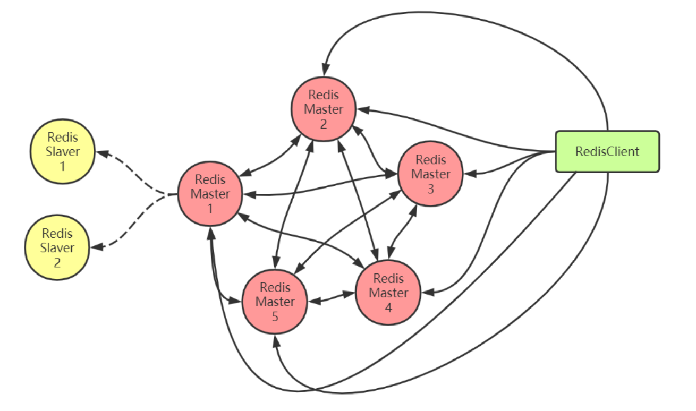

###### 去中心化

RedisCluster由多个Redis节点组构成，是一个P2P（点对点）无中心节点的集群架构，依靠Gossip协议传播的集群。

###### Gossip协议

Gossip协议是一个通信协议，一种传播消息的方式。
起源于:病毒传播
Gossip协议基本思想就是: 一个节点周期性(每秒)随机选择一些节点，并把信息传递给这些节点。这些收到信息的节点接下来会做同样的事情，即把这些信息传递给其他一些随机选择的节点。信息会周期性的传递给N个目标节点。这个N被称为**fanout**(扇出) gossip协议包含多种消息,包括meet、ping、pong、fail、publish等等。

| 命令    | 说明                                                         |
| ------- | ------------------------------------------------------------ |
| meet    | sender向receiver发出，请求receiver加入sender的集群           |
| ping    | 节点检测其他节点是否在线                                     |
| pong    | receiver收到meet或ping后的回复信息;在failover后，新的Master也会广播pong |
| fail    | 节点A判断节点B下线后，A节点广播B的fail信息，其他收到节点会将B节点标记为下线 |
| publish | 节点A收到publish命令，节点A执行该命令，并向集群广播publish命令，收到publish 命令的节点都会执行相同的publish命令 |

通过gossip协议，cluster可以提供集群间状态同步更新、选举自助failover等重要的集群功能。

**slot（Hash槽）**

redis-cluster把所有的物理节点映射到[0-16383]个**slot**上,基本上采用平均分配和连续分配的方式。 比如上图中有5个主节点，这样在RedisCluster创建时，slot槽可按下表分配:

| 节点名称 | slot范围    |
| -------- | ----------- |
| Redis1   | 0-3270      |
| Redis2   | 3271-6542   |
| Redis3   | 6543-9814   |
| Redis4   | 9815-13087  |
| Redis5   | 13088-16383 |

cluster 负责维护节点和slot槽的对应关系 value------>slot-------->节点

当需要在 Redis 集群中放置一个 key-value 时，redis 先对 key 使用 crc16 算法算出一个结果，然后把结果对 16384 求余数，这样每个 key 都会对应一个编号在 0-16383 之间的哈希槽，redis 会根据节点数量大致均等的将哈希槽映射到不同的节点。

比如:

set name zhaoyun
hash("name")采用crc16算法，得到值:1324203551%16384=15903 根据上表15903在13088-16383之间，所以name被存储在Redis5节点。 slot槽必须在节点上连续分配，如果出现不连续的情况，则RedisCluster不能工作，详见容错。

###### RedisCluster的优势

* 高性能

  * Redis Cluster 的性能与单节点部署是同级别的。
  *  多主节点、负载均衡、读写分离

* 高可用

  * Redis Cluster 支持标准的 主从复制配置来保障高可用和高可靠。
  * failover

  * Redis Cluster 也实现了一个类似 Raft 的共识方式，来保障整个集群的可用性。

* 易扩展

  * 向 Redis Cluster 中添加新节点，或者移除节点，都是透明的，不需要停机。

  * 水平、垂直方向都非常容易扩展。

  * 数据分区，海量数据，数据存储

* 原生

  * 部署 Redis Cluster 不需要其他的代理或者工具，而且 Redis Cluster 和单机 Redis 几乎完全兼 容。

###### 集群搭建

RedisCluster最少需要三台主服务器，三台从服务器。 端口号分别为:7001~7006


```shell
mkdir /mnt/module/redis-cluster/7001
cd /mnt/module/redis-5.0.5/src/
make install PREFIX=/mnt/module/redis-cluster/7001
cd ../
cp redis.conf /mnt/module/redis-cluster/7001/bin/
cd /mnt/module/redis-cluster/7001/bin/
vim redis.conf


#bind 127.0.0.1
protected-mode no
port 7001
daemonize yes
cluster-enabled yes
保存后退出

cd /mnt/module/redis-cluster/
cp -r 7001/ 7002
cp -r 7001/ 7003
cp -r 7001/ 7004
cp -r 7001/ 7005
cp -r 7001/ 7006
cp -r 7001/ 7007
cp -r 7001/ 7008

修改各自的端口号后使用脚本启动

```

脚本

```shell
#!/bin/bash

for((fileUrl=7001;fileUrl<7007;fileUrl++));
do
cd /mnt/module/redis-cluster/${fileUrl}/bin;
./redis-server redis.conf
done
```

创建Redis集群

```
# cluster-replicas : 1 1从机 前三个为主
# 采用机器ip而不采用127.0.0.1 不然外界无法访问
cd /mnt/module/redis-cluster/7001/bin
#内网
./redis-cli --cluster create 172.17.178.97:7001 172.17.178.97:7002 172.17.178.97:7003 172.17.178.97:7004 172.17.178.97:7005 172.17.178.97:7006 --cluster-replicas 1
#外网
./redis-cli --cluster create 59.110.241.53:7001 59.110.241.53:7002 59.110.241.53:7003 59.110.241.53:7004 59.110.241.53:7005 59.110.241.53:7006 --cluster-replicas 1
 
 
 >>> Performing hash slots allocation on 6 nodes...
Master[0] -> Slots 0 - 5460
Master[1] -> Slots 5461 - 10922
Master[2] -> Slots 10923 - 16383
Adding replica 172.17.178.97:7005 to 172.17.178.97:7001
Adding replica 172.17.178.97:7006 to 172.17.178.97:7002
Adding replica 172.17.178.97:7004 to 172.17.178.97:7003
>>> Trying to optimize slaves allocation for anti-affinity
[WARNING] Some slaves are in the same host as their master
M: 8b1c6dc5f91f2ddb4f7ff0c23c6a501a56b60b20 172.17.178.97:7001
   slots:[0-5460] (5461 slots) master
M: 877873f64d477171bbca95d00c31645c6b8da6b6 172.17.178.97:7002
   slots:[5461-10922] (5462 slots) master
M: 2e83fbb78a23979f8bfe8951a4481c4208fa6011 172.17.178.97:7003
   slots:[10923-16383] (5461 slots) master
S: 52fa7da53aa2e4bb1f269518217c5b5797b487a4 172.17.178.97:7004
   replicates 877873f64d477171bbca95d00c31645c6b8da6b6
S: 6e6e94c96e233f60856ab4542af657804218036d 172.17.178.97:7005
   replicates 2e83fbb78a23979f8bfe8951a4481c4208fa6011
S: d9ff1122796730b899e64d5893b2a5d56a9e3853 172.17.178.97:7006
   replicates 8b1c6dc5f91f2ddb4f7ff0c23c6a501a56b60b20
Can I set the above configuration? (type 'yes' to accept): yes
>>> Nodes configuration updated
>>> Assign a different config epoch to each node
>>> Sending CLUSTER MEET messages to join the cluster
Waiting for the cluster to join
....
>>> Performing Cluster Check (using node 172.17.178.97:7001)
M: 8b1c6dc5f91f2ddb4f7ff0c23c6a501a56b60b20 172.17.178.97:7001
   slots:[0-5460] (5461 slots) master
   1 additional replica(s)
M: 2e83fbb78a23979f8bfe8951a4481c4208fa6011 172.17.178.97:7003
   slots:[10923-16383] (5461 slots) master
   1 additional replica(s)
S: d9ff1122796730b899e64d5893b2a5d56a9e3853 172.17.178.97:7006
   slots: (0 slots) slave
   replicates 8b1c6dc5f91f2ddb4f7ff0c23c6a501a56b60b20
S: 6e6e94c96e233f60856ab4542af657804218036d 172.17.178.97:7005
   slots: (0 slots) slave
   replicates 2e83fbb78a23979f8bfe8951a4481c4208fa6011
M: 877873f64d477171bbca95d00c31645c6b8da6b6 172.17.178.97:7002
   slots:[5461-10922] (5462 slots) master
   1 additional replica(s)
S: 52fa7da53aa2e4bb1f269518217c5b5797b487a4 172.17.178.97:7004
   slots: (0 slots) slave
   replicates 877873f64d477171bbca95d00c31645c6b8da6b6
[OK] All nodes agree about slots configuration.
>>> Check for open slots...
>>> Check slots coverage...
[OK] All 16384 slots covered.
```

链接集群

```
cd /mnt/module/redis-cluster/7001/bin
./redis-cli -h 127.0.0.1 -p 7001 -c

set k1 v1
-> Redirected to slot [12706] located at 172.17.178.97:7003
OK
172.17.178.97:7003>
```

查看集群状态

```
cluster info
```

查看集群中的节点

```
cluster nodes
```


#### 分片

不同节点分组服务于相互无交集的分片(sharding)，Redis Cluster不存在单独的proxy或配置服务器，所以需要将客户端路由到目标的分片。

###### 客户端路由

Redis Cluster的客户端相比单机Redis 需要具备路由语义的识别能力，且具备一定的路由缓存能力。

###### moved重定向

1. 每个节点通过通信都会共享Redis Cluster中槽和集群中对应节点的关系
2. 客户端向Redis Cluster的任意节点发送命令，接收命令的节点会根据CRC16规则进行hash运算与16384取余，计算自己的槽和对应节点
3. 如果保存数据的槽被分配给当前节点，则去槽中执行命令，并把命令执行结果返回给客户端 
4. 如果保存数据的槽不在当前节点的管理范围内，则向客户端返回moved重定向异常 
5. 客户端接收到节点返回的结果，如果是moved异常，则从moved异常中获取目标节点的信息 
6. 客户端向目标节点发送命令，获取命令执行结果

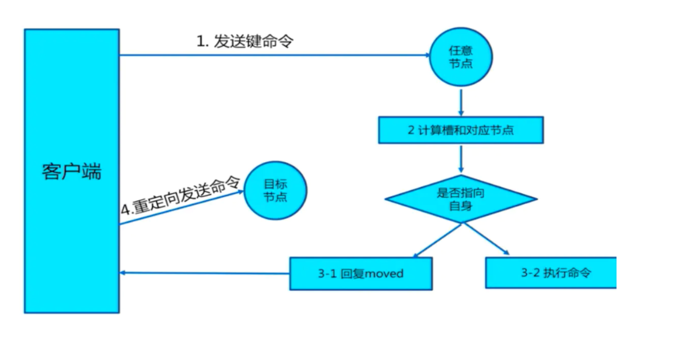

```shell
set k1 v1
-> Redirected to slot [12706] located at 172.17.178.97:7003
OK
172.17.178.97:7003> set k2 v2
-> Redirected to slot [449] located at 172.17.178.97:7001
OK
172.17.178.97:7001> get ke
-> Redirected to slot [11219] located at 172.17.178.97:7003
(nil)
172.17.178.97:7003> get k2
-> Redirected to slot [449] located at 172.17.178.97:7001
"v2"
172.17.178.97:7001>
```

###### ask重定向

在对集群进行扩容和缩容时，需要对槽及槽中数据进行迁移。当客户端向某个节点发送命令，节点向客户端返回moved异常，告诉客户端数据对应的槽的节点信息。如果此时正在进行集群扩展或者缩空操作，当客户端向正确的节点发送命令时，槽及槽中数据已经被迁 移到别的节点了，就会返回ask，这就是ask重定向机制。

1. 客户端向目标节点发送命令，目标节点中的槽已经迁移支别的节点上了，此时目标节点会返回ask转 向给客户端
2. 客户端向新的节点发送Asking命令给新的节点，然后再次向新节点发送命令 
3. 新节点执行命令，把命令执行结果返回给客户端

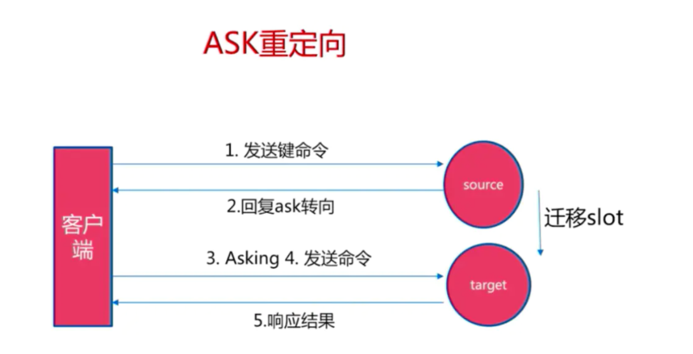

moved和ask的区别

1. moved:槽已确认转移

2. ask:槽还在转移过程中

###### Smart智能客户端

**JedisCluster**

* JedisCluster是Jedis根据RedisCluster的特性提供的集群智能客户端
* JedisCluster为每个节点创建连接池，并跟节点建立映射关系缓存(Cluster slots)
* JedisCluster将每个主节点负责的槽位一一与主节点连接池建立映射缓存
* JedisCluster启动时，已经知道key,slot和node之间的关系，可以找到目标节点
* JedisCluster对目标节点发送命令，目标节点直接响应给JedisCluster
* 如果JedisCluster与目标节点连接出错，则JedisCluster会知道连接的节点是一个错误的节点此时节点返回moved异常给JedisCluster
* JedisCluster会重新初始化slot与node节点的缓存关系，然后向新的目标节点发送命令，目标命令执行 命令并向JedisCluster响应
* 如果命令发送次数超过5次，则抛出异常"Too many cluster redirection!"

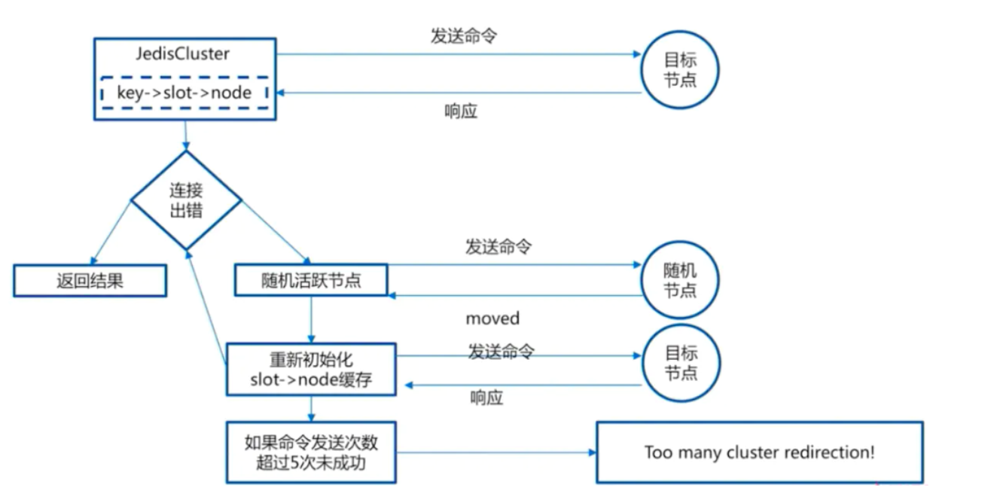

```
package com.hhb.redis;

import redis.clients.jedis.HostAndPort;
import redis.clients.jedis.JedisCluster;
import redis.clients.jedis.JedisPoolConfig;

import java.util.HashSet;
import java.util.Set;

/**
 * @description:
 * @author: huanghongbo
 * @date: 2020-08-08 20:34
 **/
public class TestRedisCluster {


    public static void main(String[] args) {
        JedisPoolConfig config = new JedisPoolConfig();
        Set<HostAndPort> jedisClusterNode = new HashSet<>();
        jedisClusterNode.add(new HostAndPort("59.110.241.53", 7001));
        jedisClusterNode.add(new HostAndPort("59.110.241.53", 7002));
        jedisClusterNode.add(new HostAndPort("59.110.241.53", 7003));
        jedisClusterNode.add(new HostAndPort("59.110.241.53", 7004));
        jedisClusterNode.add(new HostAndPort("59.110.241.53", 7005));
        jedisClusterNode.add(new HostAndPort("59.110.241.53", 7006));
        JedisCluster jcd = new JedisCluster(jedisClusterNode, config);
        jcd.set("k3", "v3");
        String value = jcd.get("k3");
        System.err.println(value);
    }
}

```

###### 迁移

在RedisCluster中每个slot 对应的节点在初始化后就是确定的。在某些情况下，节点和分片需要变更:

* 新的节点作为master加入; 
* 某个节点分组需要下线; 
* 负载不均衡需要调整slot 分布。

此时需要进行分片的迁移，迁移的触发和过程控制由外部系统完成。包含下面 2 种:

* 节点迁移状态设置:迁移前标记源/目标节点。 
* key迁移的原子化命令:迁移的具体步骤。

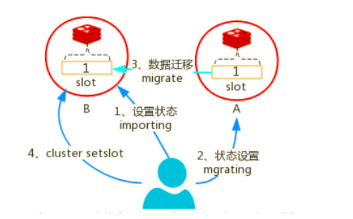

1. 向节点B发送状态变更命令，将B的对应slot 状态置为importing。 
2. 向节点A发送状态变更命令， 将A对应的slot 状态置为migrating。 
3. 向A 发送migrate 命令，告知A 将要迁移的slot对应的key 迁移 到B。
4. 当所有key 迁移完成后，cluster setslot 重新设置槽位。

###### 扩容

添加7007节点作为新节点并启动,执行命令：

```
./redis-cli --cluster add-node 59.110.241.53:7007 59.110.241.53:7001
```

查看节点是否已经在集群中，并查看槽的占用情况

```
./redis-cli -p 7001 -c 
CLUSTER nodes
13f77364e10de63db22063560e20724125e20b42 59.110.241.53:7007@17007 master - 0 1596890975494 0 connected
225800182356811bb577b66f270e49c04af80f9a 59.110.241.53:7005@17005 slave 5113642d08eab63f4602b99204cb6bab28444ec2 0 1596890972488 5 connected
5113642d08eab63f4602b99204cb6bab28444ec2 59.110.241.53:7003@17003 master - 0 1596890974000 3 connected 10923-16383
ffb0706238bf1e7ea4ea209d7199fe03e9a05b16 59.110.241.53:7004@17004 slave 6cdaeb5164b965de2d4d62e1df9802133b2526af 0 1596890974492 4 connected
6cdaeb5164b965de2d4d62e1df9802133b2526af 59.110.241.53:7002@17002 master - 0 1596890972000 2 connected 5461-10922
c0e12e62ef75b7a8e002403157174e52de90f589 59.110.241.53:7006@17006 slave 479aa58ee3ca3717a95a1dc9678ab23c1b39a538 0 1596890973490 6 connected
479aa58ee3ca3717a95a1dc9678ab23c1b39a538 172.17.178.97:7001@17001 myself,master - 0 1596890973000 1 connected 0-5460
```

hash槽重新分配（数据迁移）

1. **添加完主节点需要对主节点进行hash槽分配，这样该主节才可以存储数据。**

查看集群中槽占用情况

```
cluster nodes
```

redis集群有16384个槽，集群中的每个结点分配自已槽，通过查看集群结点可以看到槽占用情况。

2. **给刚添加的7007结点分配槽**

```
./redis-cli --cluster reshard 59.110.241.53:7007
```

3. **输入要分配的槽数量**

```
How many slots do you want to move (from 1 to 16384)? 3000
```

输入:**3000**，表示要给目标节点分配3000个槽


4. **输入接收槽的结点id**

```
What is the receiving node ID?
```

输入:13f77364e10de63db22063560e20724125e20b42

```
PS:这里准备给7007分配槽，通过cluster nodes查看7007结点id为: 13f77364e10de63db22063560e20724125e20b42
```

5. **输入源结点id**

```
Please enter all the source node IDs.
Type 'all' to use all the nodes as source nodes for the hash slots. Type 'done' once you entered all the source nodes IDs.
```

输入all

6. **输入yes**

```
Do you want to proceed with the proposed reshard plan (yes/no)? yes
```

7. 查看结果

```
./redis-cli -h 127.0.0.1 -p 7001 -c
cluster nodes
```

8. 添加从节点

命令

```
./redis-cli --cluster add-node 新节点的ip和端口 旧节点ip和端口 --cluster-slave -- cluster-master-id 主节点id
```

例如

```
./redis-cli --cluster add-node 59.110.241.53:7008 59.110.241.53:7007 --cluster-slave --cluster-master-id 13f77364e10de63db22063560e20724125e20b42
```

注意:如果原来该结点在集群中的配置信息已经生成到cluster-config-file指定的配置文件中(如果 cluster-config-file没有指定则默认为**nodes.conf**)，这时可能会报错:

```
[ERR] Node XXXXXX is not empty. Either the node already knows other nodes (check with CLUSTER NODES) or contains some key in database 0
```

**解决方法是删除生成的配置文件nodes.conf，删除后再执行./redis-cli --cluster add-node指令**

###### 缩容

命令:

```
./redis-cli --cluster del-node 59.110.241.53:7008 bfe7657c5fc812dcf6498feea19871eed641a349
```

删除已经占有hash槽的结点会失败，报错如下:

```
[ERR] Node 127.0.0.1:7008 is not empty! Reshard data away and try again.
```

需要将该结点占用的hash槽分配出去。


#### 容灾

###### 故障检测

集群中的每个节点都会定期地(每秒)向集群中的其他节点发送PING消息，如果在一定时间内(cluster-node-timeout)，发送ping的节点A没有收到某节点B的pong回应，则A将B标识为pfail。A在后续发送ping时，会带上B的pfail信息， 通知给其他节点。如果B被标记为pfail的个数大于集群主节点个数的一半(N/2 + 1)时，B会被标记为fail，A向整个集群 广播，该节点已经下线。其他节点收到广播，标记B为fail。

###### 从节点选举

raft，每个从节点，都根据自己对master复制数据的offset，来设置一个选举时间，offset越大(复制数据越多)的从节点，选举时间越靠前，优先进行选举。slave 通过向其他master发送FAILVOER_AUTH_REQUEST 消息发起竞选， master 收到后回复FAILOVER_AUTH_ACK 消息告知是否同意。slave 发送FAILOVER_AUTH_REQUEST 前会将currentEpoch 自增，并将最新的Epoch 带入到FAILOVER_AUTH_REQUEST 消息中，如果自己未投过票，则回复同意，否则回复拒绝。所有的**Master**开始slave选举投票，给要进行选举的slave进行投票，如果大部分master node(N/2 + 1)都投票给了某个从节点，那么选举通过，那个从节点可以切换成master。

RedisCluster失效的判定:

1. 集群中半数以上的主节点都宕机(无法投票)
2. 宕机的主节点的从节点也宕机了(slot槽分配不连续)

###### 变更通知

当slave 收到过半的master 同意时，会成为新的master。此时会以最新的Epoch 通过PONG 消息广播，自己成为master，让Cluster 的其他节点尽快的更新拓扑结构(node.conf)。

#### 主从切换

###### 自动切换

就是上面讲的从节点选举

###### 手动切换

人工故障切换是预期的操作，而非发生了真正的故障，目的是以一种安全的方式(数据无丢失)将当前 master节点和其中一个slave节点(执行cluster-failover的节点)交换角色

1. 向从节点发送cluster failover 命令(slaveof no one) 
2. 从节点告知其主节点要进行手动切换(CLUSTERMSG_TYPE_MFSTART) 
3. 主节点会阻塞所有客户端命令的执行(10s) 
4. 从节点从主节点的ping包中获得主节点的复制偏移量 
5. 从节点复制达到偏移量，发起选举、统计选票、赢得选举、升级为主节点并更新配置 
6. 切换完成后，原主节点向所有客户端发送moved指令重定向到新的主节点

以上是在主节点在线情况下。

如果主节点下线了，则采用cluster failover force或cluster failover takeover 进行强制切换。

#### 副本漂移

我们知道在一主一从的情况下，如果主从同时挂了，那整个集群就挂了。 为了避免这种情况我们可以做一主多从，但这样成本就增加了。 Redis提供了一种方法叫副本漂移，这种方法既能提高集群的可靠性又不用增加太多的从机。 如图:

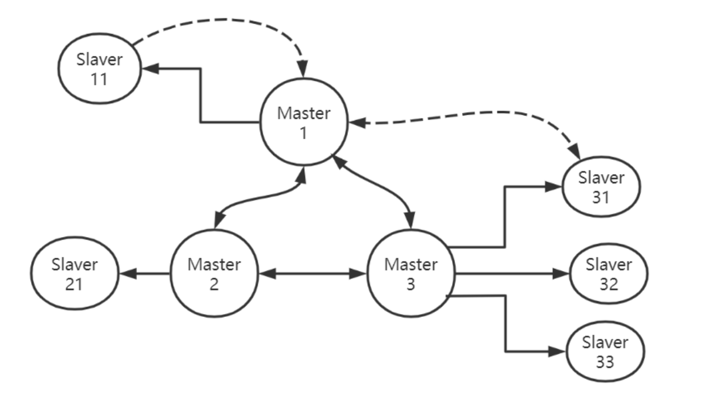

Master1宕机，则Slaver11提升为新的Master1,集群检测到新的Master1是单点的(无从机)。集群从拥有最多的从机的节点组(Master3)中，选择节点名称字母顺序最小的从机(Slaver31)漂移 到单点的主从节点组(Master1)。具体流程如下(以上图为例): 

1. 将Slaver31的从机记录从Master3中删除 
2. 将Slaver31的的主机改为Master1 
3. 在Master1中添加Slaver31为从节点 
4. 将Slaver31的复制源改为Master1 
5. 通过ping包将信息同步到集群的其他节点

