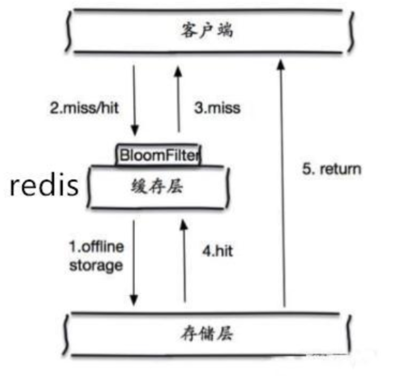
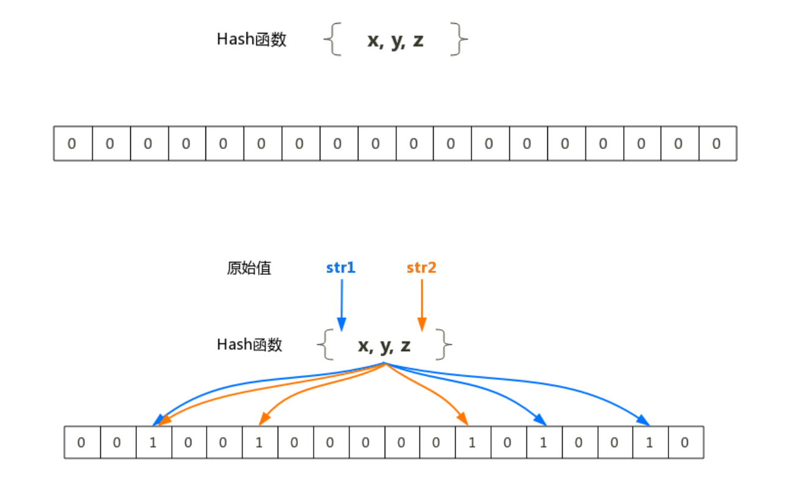
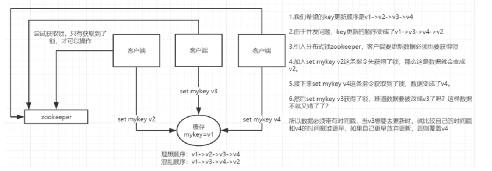
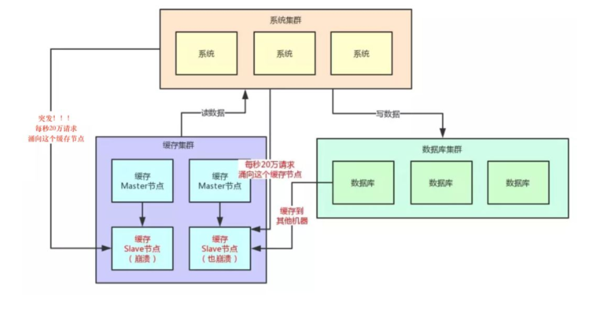
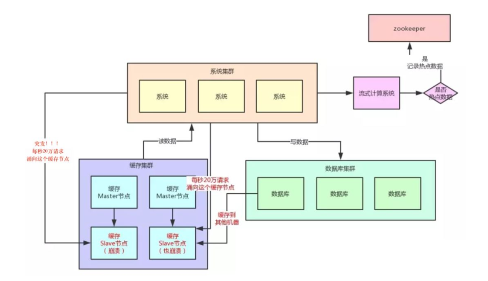
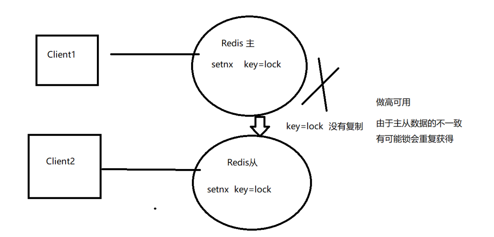
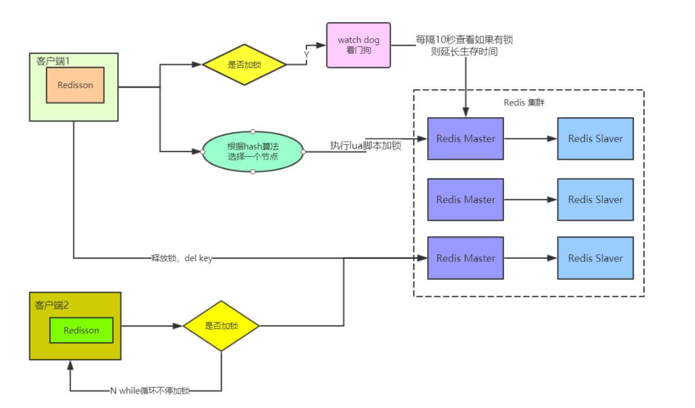
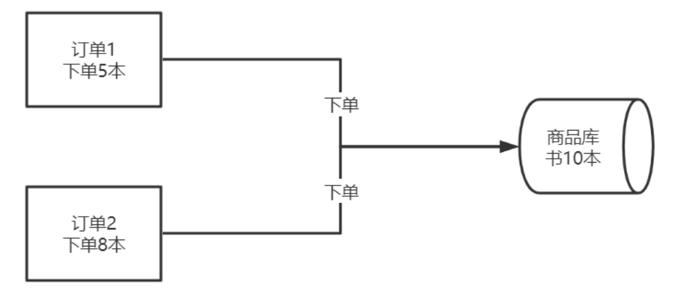
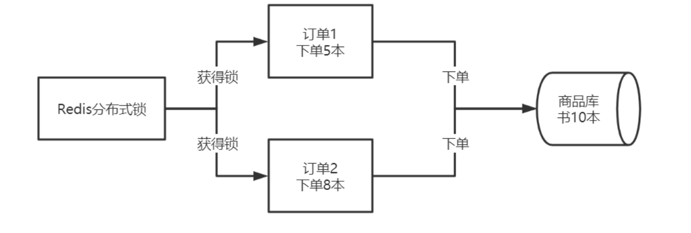
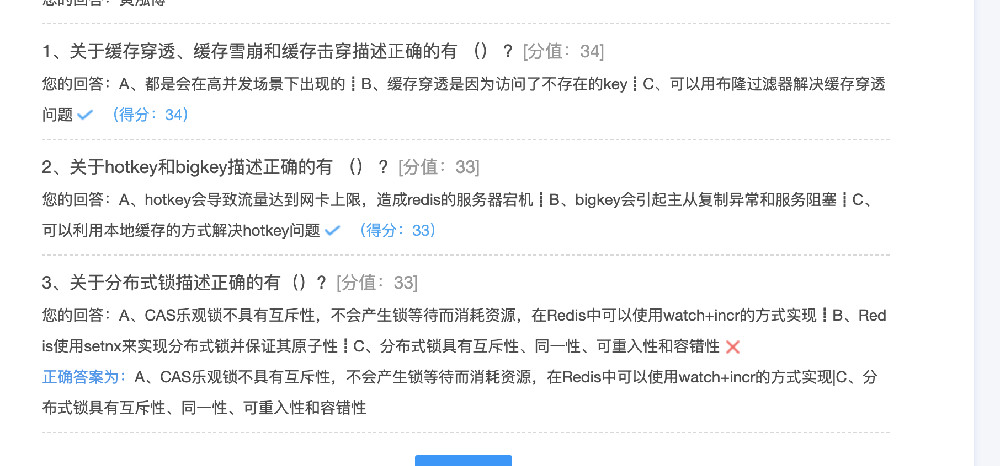

## Redis经典文件解析

### 缓存问题

#### 缓存穿透

一般的缓存系统，都是按照key去缓存查询，如果不存在对应的value，就应该去后端系统查找(比如 DB)。缓存穿透是指在高并发下查询key不存在的数据，会穿过缓存查询数据库。导致数据库压力过大而宕机 

解决方案:

* 对查询结果为空的情况也进行缓存，缓存时间(ttl)设置短一点，或者该key对应的数据insert了 之后清理缓存。
  * 问题:缓存太多空值占用了更多的空间 
* 使用布隆过滤器。在缓存之前在加一层布隆过滤器，在查询的时候先去布隆过滤器查询 key 是否存在，如果不存在就直接返回，存在再查缓存和DB。



布隆过滤器(Bloom Filter)是1970年由布隆提出的。它实际上是一个很长的二进制向量和一系列随机hash映射函数。布隆过滤器可以用于检索一个元素是否在一个集合中。它的优点是空间效率和查询时间都远远超过一般的算法。



布隆过滤器的原理是，当一个元素被加入集合时，通过K个Hash函数将这个元素映射成一个数组中的K个点，把它们置为1。检索时，我们只要看看这些点是不是都是1就(大约)知道集合中有没有它了:如 果这些点有任何一个0，则被检元素一定不在;如果都是1，则被检元素很可能在。这就是布隆过滤器的 基本思想。

* 把字符串------>位 省空间 (1或0) 

* 不用循环------>比较位置 省时间


#### 缓存雪崩

当缓存服务器重启或者大量缓存集中在某一个时间段失效，这样在失效的时候，也会给后端系统(比如 DB)带来很大压力。突然间大量的key失效了或redis重启，大量访问数据库，数据库崩溃解决方案:

1. key的失效期分散开 不同的key设置不同的有效期 
2. 设置二级缓存(数据不一定一致) 
3. 高可用(脏读)

#### 缓存击穿

对于一些设置了过期时间的key，如果这些key可能会在某些时间点被超高并发地访问，是一种非常“热点”的数据。这个时候，需要考虑一个问题:缓存被“击穿”的问题，这个和缓存雪崩的区别在于这里针对某一key缓存，前者则是很多key。

缓存在某个时间点过期的时候，恰好在这个时间点对这个Key有大量的并发请求过来，这些请求发现缓存过期一般都会从后端DB加载数据并回设到缓存，这个时候大并发的请求可能会瞬间把后端DB压垮。

解决方案:

1. 用分布式锁控制访问的线程 

   使用redis的setnx互斥锁先进行判断，这样其他线程就处于等待状态，保证不会有大并发操作去操作数据库。

2. 不设超时时间，volatile-lru 但会造成写一致问题

   当数据库数据发生更新时，缓存中的数据不会及时更新，这样会造成数据库中的数据与缓存中的数据的 不一致，应用会从缓存中读取到脏数据。可采用延时双删策略处理，这个我们后面会详细讲到。

#### 数据不一致

缓存和DB的数据不一致的根源 : 数据源不一样

如何解决：

* 强一致性很难，追求最终一致性(时间) 互联网业务数据处理的特点
* 高吞吐量
* 低延迟
* 数据敏感性低于金融业
* 时序控制是否可行?
* 先更新数据库再更新缓存或者先更新缓存再更新数据库
* 本质上不是一个原子操作，所以时序控制不可行
* 高并发情况下会产生不一致

###### 保证数据的最终一致性（延时双删）

1. 先更新数据库同时删除缓存项(key)，等读的时候再填充缓存
2. 2秒后再删除一次缓存项(key)
3. 设置缓存过期时间 Expired Time 比如 10秒 或1小时
4. 将缓存删除失败记录到日志中，利用脚本提取失败记录再次删除(缓存失效期过长 7*24)

升级方案:

通过数据库的binlog来异步淘汰key，利用工具(canal)将binlog日志采集发送到MQ中，然后通过ACK机 制确认处理删除缓存。

#### 数据并发竞争

这里的并发指的是多个redis的client同时set同一个key引起的并发问题。 多客户端(Jedis)同时并发写一个key，一个key的值是1，本来按顺序修改为2,3,4，最后是4，但是顺序变成了4,3,2，最后变成了2。
 第一种方案:分布式锁+时间戳

1. 整体技术方案

   这种情况，主要是准备一个分布式锁，大家去抢锁，抢到锁就做set操作。加锁的目的实际上就是把并行读写改成串行读写的方式，从而来避免资源竞争。

   

2. Redis分布式锁的实现

主要用到的redis函数是setnx()。用SETNX实现分布式锁
 时间戳 

由于上面举的例子，要求key的操作需要顺序执行，所以需要保存一个时间戳判断set顺序。

> 系统A key 1 {ValueA 7:00}

> 系统B key 1 { ValueB 7:05

假设系统B先抢到锁，将key1设置为{ValueB 7:05}。接下来系统A抢到锁，发现自己的key1的时间戳早于缓存中的时间戳(7:00<7:05)，那就不做set操作了。

**第二种方案:利用消息队列**

在并发量过大的情况下,可以通过消息中间件进行处理,把并行读写进行串行化。 把Redis的set操作放在队列中使其串行化,必须的一个一个执行。

#### Hot Key

当有大量的请求(几十万)访问某个Redis某个key时，由于流量集中达到网络上限，从而导致这个redis的 服务器宕机。造成缓存击穿，接下来对这个key的访问将直接访问数据库造成数据库崩溃，或者访问数据库回填Redis再访问Redis，继续崩溃。



如何发现热key

1. 预估热key，比如秒杀的商品、火爆的新闻等
2. 在客户端进行统计，实现简单，加一行代码即可
3. 如果是Proxy，比如Codis，可以在Proxy端收集
4. 利用Redis自带的命令，monitor、hotkeys。但是执行缓慢(不要用)
5. 利用基于大数据领域的流式计算技术来进行实时数据访问次数的统计，比如 Storm、Spark Streaming、Flink，这些技术都是可以的。发现热点数据后可以写到zookeeper中



如何处理热Key: 

1. 变分布式缓存为本地缓存

   发现热key后，把缓存数据取出后，直接加载到本地缓存中。可以采用Ehcache、Guava Cache都可 以，这样系统在访问热key数据时就可以直接访问自己的缓存了。(数据不要求时时一致)

2. 在每个Redis主节点上备份热key数据，这样在读取时可以采用随机读取的方式，将访问压力负载到 每个Redis上。

3. 利用对热点数据访问的限流熔断保护措施

   每个系统实例每秒最多请求缓存集群读操作不超过 400 次，一超过就可以熔断掉，不让请求缓存集群，直接返回一个空白信息，然后用户稍后会自行再次重新刷新页面之类的。(首页不行，系统友好性差) 通过系统层自己直接加限流熔断保护措施，可以很好的保护后面的缓存集群。

#### Big Key

大key指的是存储的值(Value)非常大，常见场景:

* 热门话题下的讨论 
* 大V的粉丝列表
* 序列化后的图片 
* 没有及时处理的垃圾数据

大key的影响:

* 大key会大量占用内存，在集群中无法均衡
* Redis的性能下降，主从复制异常
* 在主动删除或过期删除时会操作时间过长而引起服务阻塞

如何发现大key:

1. redis-cli --bigkeys命令。可以找到某个实例5种数据类型(String、hash、list、set、zset)的最大key。
    但如果Redis 的key比较多，执行该命令会比较慢

2. 获取生产Redis的rdb文件，通过rdbtools分析rdb生成csv文件，再导入MySQL或其他数据库中进行 分析统计，根据size_in_bytes统计bigkey

大key的处理:

优化big key的原则就是string减少字符串长度，list、hash、set、zset等减少成员数。

1. String类型的big key，尽量不要存入Redis中，可以使用文档型数据库MongoDB或缓存到CDN上。如果必须用Redis存储，最好单独存储，不要和其他的key一起存储。采用一主一从或多从。

2. 单个简单的key存储的value很大，可以尝试将对象分拆成几个key-value， 使用mget获取值，这样 分拆的意义在于分拆单次操作的压力，将操作压力平摊到多次操作中，降低对redis的IO影响。

3. hash， set，zset，list 中存储过多的元素，可以将这些元素分拆。(常见)

   ```
   以hash类型举例来说，对于field过多的场景，可以根据field进行hash取模，生成一个新的key，例如原来的
   hash_key:{filed1:value, filed2:value, filed3:value ...}，可以hash取模后形成如下 key:value形式
   hash_key:1:{filed1:value}
   hash_key:2:{filed2:value}
   hash_key:3:{filed3:value}
   ...
   取模后，将原先单个key分成多个key，每个key filed个数为原先的1/N
   ```

4. 删除大key时不要使用del,因为del是阻塞命令，删除时会影响性能。

5. 使用 lazy delete (unlink命令)

删除指定的key(s),若key不存在则该key被跳过。但是，相比DEL会产生阻塞，该命令会在另一个线程中回收内存，因此它是非阻塞的。 这也是该命令名字的由来:仅将keys从key空间中删除，真正的数据删 除会在后续异步操作。

```
redis> SET key1 "Hello"
"OK"
redis> SET key2 "World"
"OK"
redis> UNLINK key1 key2 key3
(integer) 2
```

### 分布式锁

#### 利用Watch实现Redis乐观锁

乐观锁基于CAS(Compare And Swap)思想(比较并替换)，是不具有互斥性，不会产生锁等待而消耗资源，但是需要反复的重试，但也是因为重试的机制，能比较快的响应。因此我们可以利用redis来 实现乐观锁。具体思路如下:

1. 利用redis的watch功能，监控这个redisKey的状态值 
2. 获取redisKey的值 
3. 创建redis事务 
4. 给这个key的值+1 
5. 然后去执行这个事务，如果key的值被修改过则回滚，key不加1

###### Redis乐观锁实现秒杀

```java
package com.hhb.redis;

import redis.clients.jedis.Jedis;
import redis.clients.jedis.Transaction;

import java.util.List;
import java.util.UUID;
import java.util.concurrent.ExecutorService;
import java.util.concurrent.Executors;

/**
 * @description:
 * @author: huanghongbo
 * @date: 2020-08-09 13:47
 **/
public class SecondKillTest {
    public static void main(String[] args) {
        String redisKey = "redisKey";
        ExecutorService executorService = Executors.newFixedThreadPool(20);
        //设置初始值
        Jedis jedis = new Jedis("59.110.241.53", 6381);
        jedis.set(redisKey, "0");
        jedis.close();
        //并发竞争
        for (int i = 0; i < 1000; i++) {
            executorService.execute(() -> {
                Jedis j1 = new Jedis("59.110.241.53", 6381);
                j1.watch(redisKey);
                String redisValue = j1.get(redisKey);
                int valInteger = Integer.valueOf(redisValue);
                String userInfo = UUID.randomUUID().toString();
                if (valInteger < 20) {
                    Transaction multi = j1.multi();
                    multi.incr(redisKey);
                    List<Object> exec = multi.exec();
                    if (exec != null && exec.size() > 0) {
                        System.out.println("用户:" + userInfo + "，秒杀成功! 当前成功人数:" + (valInteger + 1));
                    } else {
                        System.out.println("用户:" + userInfo + "，秒杀失败");
                    }
                } else {
                    System.out.println("已经有20人秒杀成功，秒杀结束");
                }
                j1.close();
            });
        }
        executorService.shutdown();
    }
}
```


#### setNX

###### 实现原理

* 共享资源互斥
* 共享资源串行化
* 单应用中使用锁:(单进程多线程) 
* synchronized、ReentrantLock 
* 分布式应用中使用锁:(多进程多线程) 
* 分布式锁是控制分布式系统之间同步访问共享资源的一种方式。
*  利用Redis的单线程特性对共享资源进行串行化处理

###### 实现方式

* 方式1(使用set命令实现)--推荐

```java

    /**
     * 原子性操作
     *
     * @return
     */
    public static boolean getLock() {
        Jedis jedis = new Jedis("59.110.241.53", 6381);
        String set = jedis.set("k1", "v1", "NX", "PX", 1000);
        if ("OK".equals(set)) {
            return true;
        }
        return false;
    }

```

* 方式2 使用setNX命令实现) -- 并发会产生问题

```java
		/**
     * 非原子性操作，设置过期时间的时候，系统挂了，后面都获取不到锁了
     *
     * @return
     */
    public static boolean getLock2() {
        Jedis jedis = new Jedis("59.110.241.53", 6381);
        Long set = jedis.setnx("k1", "v1");
        if (1 == set) {
            jedis.expire("k1", 1000);
            return true;
        }
        return false;
    }
```

释放锁 

* 方式1(del命令实现) -- 并发

```java
 		/**
     * 释放分布式锁
     *
     * @param lockKey * @param requestId
     */
    public static void releaseLockUnSafe(String lockKey, String requestId) {
        Jedis jedis = new Jedis("59.110.241.53", 6381);
        if (requestId.equals(jedis.get(lockKey))) {
            jedis.del(lockKey);
        }
    }

```

> 问题在于如果调用jedis.del()方法的时候，这把锁已经不属于当前客户端的时候会解除他人加的锁。 那么是否真的有这种场景?答案是肯定的，比如客户端A加锁，一段时间之后客户端A解锁，在执行 jedis.del()之前，锁突然过期了，此时客户端B尝试加锁成功，然后客户端A再执行del()方法，则将客户 端B的锁给解除了。

* 方式2(**redis+lua脚本实现**)--推荐

```java
		/**
     * 安全的
     *
     * @param lockKey
     * @param requestId
     * @return
     */
    public static boolean releaseLockSafe(String lockKey, String requestId) {
        Jedis jedis = new Jedis("59.110.241.53", 6381);
        String script = "if redis.call('get', KEYS[1]) == ARGV[1] then return redis.call('del', KEYS[1]) else return 0 end ";
        Object result = jedis.eval(script, Collections.singletonList(lockKey),
                Collections.singletonList(requestId));
        if (result.equals(1L)) {
            return true;
        }
        return false;
    }
```

###### 存在问题

* 单机：无法保证高可用

* 主--从：无法保证数据的强一致性，在主机宕机时会造成锁的重复获得。

  

* 无法续租：超过expireTime后，不能继续使用

###### 本质分析

CAP模型分析：在分布式环境下不可能满足三者共存，只能满足其中的两者共存，在分布式下P不能舍弃(舍弃P就是单机了)。所以只能是CP(强一致性模型)和AP(高可用模型)。分布式锁是CP模型，Redis集群是AP模型。 (base)Redis集群不能保证数据的随时一致性，只能保证数据的最终一致性。

为什么还可以用Redis实现分布式锁?

与业务有关，当业务不需要数据强一致性时，比如:社交场景，就可以使用Redis实现分布式锁，当业务必须要数据的强一致性，即不允许重复获得锁，比如金融场景(重复下单，重复转账)就不要使用，可以使用CP模型实现，比如:zookeeper和etcd。

#### Redisson分布式锁的使用

Redisson是架设在Redis基础上的一个Java驻内存数据网格(In-Memory Data Grid)。 Redisson在基于NIO的Netty框架上，生产环境使用分布式锁。

pom

```xml
<!-- redisson -->
<dependency>
  <groupId>org.redisson</groupId>
  <artifactId>redisson</artifactId>
  <version>2.7.0</version>
</dependency>
```

配置Redission

```java
package com.hhb.redis.redission;

import org.redisson.Redisson;
import org.redisson.config.Config;

/**
 * @description:
 * @author: huanghongbo
 * @date: 2020-08-09 14:34
 **/
public class RedissonManager {

    private static Config config = new Config(); //声明redisso对象
    private static Redisson redisson = null;

    //实例化redisson static{
    static {
        config.useClusterServers()
                // 集群状态扫描间隔时间，单位是毫秒
                .setScanInterval(2000)
                //cluster方式至少6个节点(3主3从，3主做sharding，3从用来保证主宕机后可以高可用)
                .addNodeAddress("redis://59.110.241.53:7001")
                .addNodeAddress("redis://59.110.241.53:7002")
                .addNodeAddress("redis://59.110.241.53:7003")
                .addNodeAddress("redis://59.110.241.53:7004")
                .addNodeAddress("redis://59.110.241.53:7005")
                .addNodeAddress("redis://59.110.241.53:7006");
        //得到redisson对象
        redisson = (Redisson) Redisson.create(config);
    }

    //获取redisson对象的方法
    public static Redisson getRedisson() {
        return redisson;
    }
}

```

加锁、释放及使用

```java
package com.hhb.redis.redission;

import org.redisson.Redisson;
import org.redisson.api.RLock;

import java.io.IOException;
import java.util.concurrent.TimeUnit;

/**
 * @description:
 * @author: huanghongbo
 * @date: 2020-08-09 14:37
 **/
public class DistributedRedisLock {
    //从配置类中获取redisson对象
    private static Redisson redisson = RedissonManager.getRedisson();
    private static final String LOCK_TITLE = "redisLock_"; //加锁

    public static boolean acquire(String lockName) { //声明key对象
        String key = LOCK_TITLE + lockName; //获取锁对象
        RLock mylock = redisson.getLock(key); //加锁，并且设置锁过期时间3秒，防止死锁的产生 uuid+threadId
        mylock.lock(2, TimeUnit.SECONDS); //加锁成功
        return true;
    }

    //锁的释放
    public static void release(String lockName) {
        //必须是和加锁时的同一个key
        String key = LOCK_TITLE + lockName;
        //获取所对象
        RLock mylock = redisson.getLock(key);
        //释放锁(解锁)
        mylock.unlock();
    }


    public String discount() throws IOException {
        String key = "lock001";
        //加锁
        DistributedRedisLock.acquire(key); //执行具体业务逻辑
        //todo:dosoming
        //释放锁
        DistributedRedisLock.release(key);
        //返回结果 return soming;
        return null;
    }
}
```

###### Redisson分布式锁的实现原理



###### 加锁机制

如果该客户端面对的是一个redis cluster集群，他首先会根据hash节点选择一台机器。 发送lua脚本到redis服务器上，脚本如下:

```lua
"if (redis.call('exists',KEYS[1])==0) then "+ --看有没有锁 
"redis.call('hset',KEYS[1],ARGV[2],1) ; "+ --无锁 加锁 
"redis.call('pexpire',KEYS[1],ARGV[1]) ; "+
"return nil; end ;" +
"if (redis.call('hexists',KEYS[1],ARGV[2]) ==1 ) then "+ --我加的锁 
"redis.call('hincrby',KEYS[1],ARGV[2],1) ; "+ --重入锁 
"redis.call('pexpire',KEYS[1],ARGV[1]) ; "+
"return nil; end ;" +
"return redis.call('pttl',KEYS[1]) ;" --不能加锁，返回锁的时间
```

lua的作用:保证这段复杂业务逻辑执行的原子性。

lua的解释:

KEYS[1]) : 加锁的key

ARGV[1] : key的生存时间，默认为30秒

ARGV[2] : 加锁的客户端ID (*UUID.randomUUID() + “:” + threadId*)

第一段if判断语句，就是用“exists myLock”命令判断一下，如果你要加锁的那个锁key不存在的话，你 就进行加锁。如何加锁呢?很简单，用下面的命令:

```
hset myLock 8743c9c0-0795-4907-87fd-6c719a6b4586:1 1
```

通过这个命令设置一个hash数据结构，这行命令执行后，会出现一个类似下面的数据结构:

```
myLock :{"8743c9c0-0795-4907-87fd-6c719a6b4586:1":1 }
```

上述就代表“8743c9c0-0795-4907-87fd-6c719a6b4586:1”这个客户端对“myLock”这个锁key完成了加锁。

接着会执行“pexpire myLock 30000”命令，设置myLock这个锁key的生存时间是30秒。

###### 锁互斥机制

那么在这个时候，如果客户端2来尝试加锁，执行了同样的一段lua脚本，会咋样呢?很简单，第一个if判断会执行“exists myLock”，发现myLock这个锁key已经存在了。接着第二个if判断，判断一下，myLock锁key的hash数据结构中，是否包含客户端2的ID，但是明显不 是的，因为那里包含的是客户端1的ID。所以，客户端2会获取到pttl myLock返回的一个数字，这个数字代表了myLock这个锁key的**剩余生存时 间。**比如还剩15000毫秒的生存时间。此时客户端2会进入一个while循环，不停的尝试加锁。

###### 自动延时机制

只要客户端1一旦加锁成功，就会启动一个watch dog看门狗，**他是一个后台线程，会每隔10秒检查一 下**，如果客户端1还持有锁key，那么就会不断的延长锁key的生存时间。

###### 可重入锁机制

第一个if判断肯定不成立，“exists myLock”会显示锁key已经存在了。 第二个if判断会成立，因为myLock的hash数据结构中包含的那个ID，就是客户端1的那个ID，也就是“8743c9c0-0795-4907-87fd-6c719a6b4586:1”此时就会执行可重入加锁的逻辑，他会用

```
incrby myLock 8743c9c0-0795-4907-87fd-6c71a6b4586:1 1
```

通过这个命令，对客户端1的加锁次数，累加1。数据结构会变成: 

```
myLock :{"8743c9c0-0795-4907-87fd-6c719a6b4586:1":2 }
```

###### 释放锁的机制

执行lua脚本如下:

```lua
-- 如果key已经不存在，说明已经被解锁，直接发布(publish)redis消息 
"if (redis.call('exists', KEYS[1]) == 0) then " +
"redis.call('publish', KEYS[2], ARGV[1]); " +
                        "return 1; " +
                    "end;" +
-- key和field不匹配，说明当前客户端线程没有持有锁，不能主动解锁。 不是我加的锁 不能解锁
"if (redis.call('hexists', KEYS[1], ARGV[3]) == 0) then " +
-- 将value减1
    "return nil;" +
"end; " +
"local counter = redis.call('hincrby', KEYS[1], ARGV[3],-1); " +
-- 如果counter>0说明锁在重入，不能删除key
"if (counter > 0) then " + "redis.call('pexpire', KEYS[1], ARGV[2]); " + "return 0; " +
-- 删除key并且publish 解锁消息 
"else " +
"redis.call('del', KEYS[1]); " + -- 删除锁
"redis.call('publish', KEYS[2], ARGV[1]); " + "return 1; "+
                    "end; " +
                    "return nil;",
```

– KEYS[1] :需要加锁的key，这里需要是字符串类型。 

– KEYS[2] :redis消息的ChannelName,一个分布式锁对应唯一的一个channelName:“redisson_lockchannel{” + getName() + “}”

 – ARGV[1] :reids消息体，这里只需要一个字节的标记就可以，主要标记redis的key已经解锁，再结合redis的Subscribe，能唤醒其他订阅解锁消息的客户端线程申请锁。

– ARGV[2] :锁的超时时间，防止死锁

– ARGV[3] :锁的唯一标识，也就是刚才介绍的 id(UUID.randomUUID()) + “:” + threadId

如果执行lock.unlock()，就可以释放分布式锁，此时的业务逻辑也是非常简单的。 其实说白了，就是每次都对myLock数据结构中的那个加锁次数减1。 如果发现加锁次数是0了，说明这个客户端已经不再持有锁了，此时就会用: “del myLock”命令，从redis里删除这个key。 然后呢，另外的客户端2就可以尝试完成加锁了。

#### 分布式锁特性

* 互斥性
  * 任意时刻，只能有一个客户端获取锁，不能同时有两个客户端获取到锁。
  *  Redis : setnx 、set key value NX 如果key存在就不设置

* 同一性 

  * 锁只能被持有该锁的客户端删除，不能由其它客户端删除。 

  * Redis : lua 实现原子性

* 可重入性 
  * 持有某个锁的客户端可继续对该锁加锁，实现锁的续租

* 容错性 
  * 锁失效后(超过生命周期)自动释放锁(key失效)，其他客户端可以继续获得该锁，防止死锁 
  * expire 设置超时时间

  * set key value NX PX


#### 分布式锁的实际应用

* 数据并发竞争 

  利用分布式锁+时间戳可以将处理串行化，前面已经讲过了。

* 防止库存超卖

  

订单1下单前会先查看库存，库存为10，所以下单5本可以成功; 订单2下单前会先查看库存，库存为10，所以下单8本可以成功;订单1和订单2 同时操作，共下单13本，但库存只有10本，显然库存不够了，这种情况称为库存超卖。 可以采用分布式锁解决这个问题。



订单1和订单2都从Redis中获得分布式锁(setnx)，谁能获得锁谁进行下单操作，这样就把订单系统下单 的顺序串行化了，就不会出现超卖的情况了。伪码如下:

* 获得分布式锁
* 取得库存
* 如果大于下单数
* 下单
* 更改库存
* 释放锁

```java
//加锁并设置有效期 
if(redis.lock("RDL",200)){
//判断库存
	if (orderNum<getCount()){ 
  //加锁成功 ,可以下单 
  order(5);
	updateCount(5)
	//释放锁 
   redis,unlock("RDL");
	}
}
```

注意此种方法会降低处理效率，这样不适合秒杀的场景，秒杀可以使用CAS和Redis队列的方式。

